# Technical Design Document: Standalone Billing Service

## Overview

The Billing Service is a standalone, multi-tenant billing platform that provides subscription management, invoice generation, and usage tracking capabilities to multiple client projects. Built with Spring Boot/Java and PostgreSQL, it focuses on subscription lifecycle management and delegates all payment processing to the separate Payment Service.

The service operates independently of any specific client application, allowing multiple projects (such as the SaaS Talent Recruitment Platform) to leverage centralized billing infrastructure while maintaining strict data isolation between tenants.

### Why Spring Boot/Java?

- **Financial Calculations**: Compile-time type safety ensures accuracy in billing calculations
- **Transaction Management**: Robust @Transactional support for complex subscription lifecycle operations
- **Strong Typing**: Proration, discounts, and tax calculations benefit from Java's type system
- **Mission-Critical Stability**: Mature ecosystem for billing operations requiring high reliability
- **Audit & Compliance**: Superior logging and compliance support through Spring Boot Actuator
- **Enterprise Integration**: Seamless integration with enterprise payment processors and financial systems

### Key Design Principles

1. **Multi-Tenant Architecture**: Complete data isolation between client projects using service_tenant_id on all tables with row-level security
2. **Separation of Concerns**: Billing logic (subscriptions, invoices, coupons) separated from payment processing
3. **Payment Service Integration**: Acts as a client of the Payment Service for all payment operations
4. **Event-Driven Webhooks**: Asynchronous notification of billing events to client applications and receives payment status from Payment Service
5. **API-Key Authentication**: Secure client authentication with key rotation and revocation support
6. **Idempotent Operations**: All operations designed for safe retry and exactly-once semantics

### Interface-Based Architecture

The Billing Service follows interface-based design principles for maximum testability, flexibility, and adherence to SOLID principles (particularly Dependency Inversion Principle).

**Why Code to Interfaces:**
- **Testability**: Easy to mock dependencies in unit tests without complex test infrastructure
- **Flexibility**: Swap implementations without changing dependent code (e.g., switch from Stripe to another payment processor)
- **Dependency Inversion**: High-level modules depend on abstractions, not concrete implementations
- **Loose Coupling**: Components interact through contracts, not concrete classes
- **Spring Best Practice**: Aligns with Spring Framework's design philosophy

**Naming Convention:**
- **Interface**: `ServiceName` (e.g., `SubscriptionService`, `PaymentServiceClient`)
- **Implementation**: `ServiceNameImpl` (e.g., `SubscriptionServiceImpl`, `PaymentServiceClientImpl`)
- **Repository Interfaces**: Extend Spring Data JPA interfaces (e.g., `SubscriptionRepository extends JpaRepository`)

**Package Structure:**
- **Interfaces**: Located in parent package (e.g., `com.billing.service`)
- **Implementations**: Located in `impl/` subpackage (e.g., `com.billing.service.impl`)
- **Benefit**: Clear separation between public API (interfaces) and internal implementation details

**Dependency Injection Pattern:**
- All service dependencies injected via **constructor injection** (preferred over field injection)
- Constructor injection ensures immutability and makes dependencies explicit
- Use `@Autowired` on constructor (optional for single constructor in Spring 4.3+)
- Controllers depend on service interfaces from parent package, never import from `impl/`
- Services depend on repository interfaces and other service interfaces
- Integration layer (Payment Service client) uses interface for HTTP communication

**Example Pattern:**
```java
// Interface in parent package
package com.billing.service;

public interface SubscriptionService {
    SubscriptionResponse create(UUID tenantId, CreateSubscriptionRequest request);
}

// Implementation in impl/ subpackage
package com.billing.service.impl;

import com.billing.service.SubscriptionService;
import com.billing.integration.paymentservice.PaymentServiceClient;

@Service
@Transactional
public class SubscriptionServiceImpl implements SubscriptionService {
    private final SubscriptionRepository subscriptionRepository;
    private final PaymentServiceClient paymentServiceClient;
    private final EventPublisher eventPublisher;
    
    @Autowired  // Optional for single constructor
    public SubscriptionServiceImpl(
        SubscriptionRepository subscriptionRepository,
        PaymentServiceClient paymentServiceClient,
        EventPublisher eventPublisher) {
        this.subscriptionRepository = subscriptionRepository;
        this.paymentServiceClient = paymentServiceClient;
        this.eventPublisher = eventPublisher;
    }
    
    @Override
    public SubscriptionResponse create(UUID tenantId, CreateSubscriptionRequest request) {
        // Implementation
    }
}

// Controller depends on interface from parent package
package com.billing.controller;

import com.billing.service.SubscriptionService;  // Import interface, not implementation

@RestController
@RequestMapping("/api/v1/subscriptions")
public class SubscriptionController {
    private final SubscriptionService subscriptionService;
    
    public SubscriptionController(SubscriptionService subscriptionService) {
        this.subscriptionService = subscriptionService;
    }
}
```

**Repository Interfaces:**
All repositories extend Spring Data JPA interfaces, which are already interface-based:
```java
public interface SubscriptionRepository extends JpaRepository<Subscription, UUID> {
    Optional<Subscription> findByServiceTenantIdAndExternalCustomerId(
        UUID serviceTenantId, String externalCustomerId);
}
```

## Architecture

### High-Level System Architecture

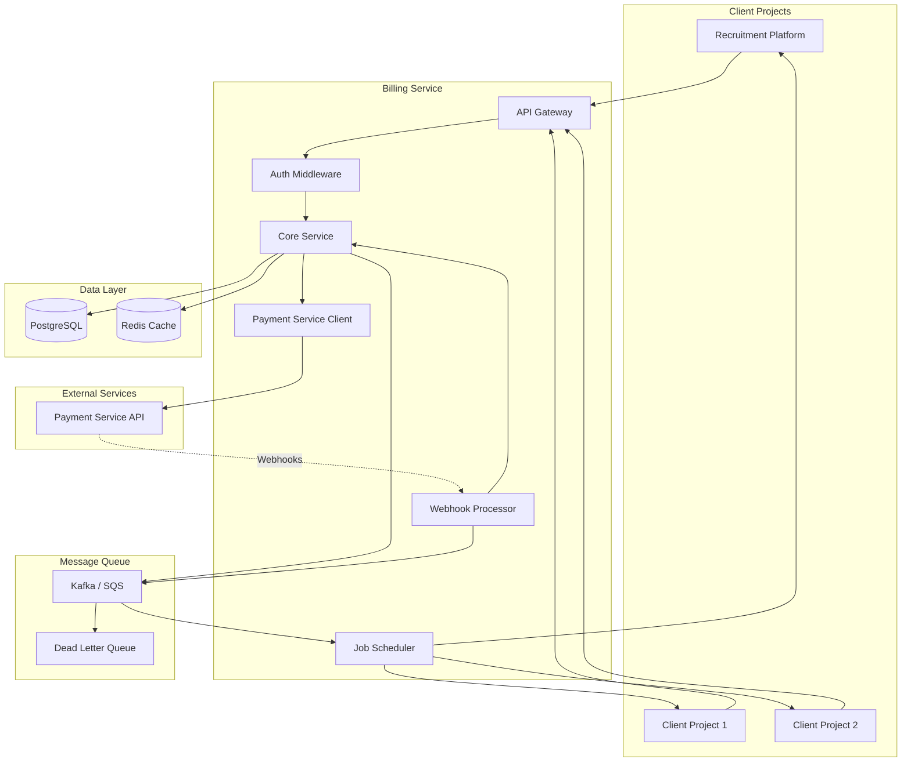

### Component Architecture

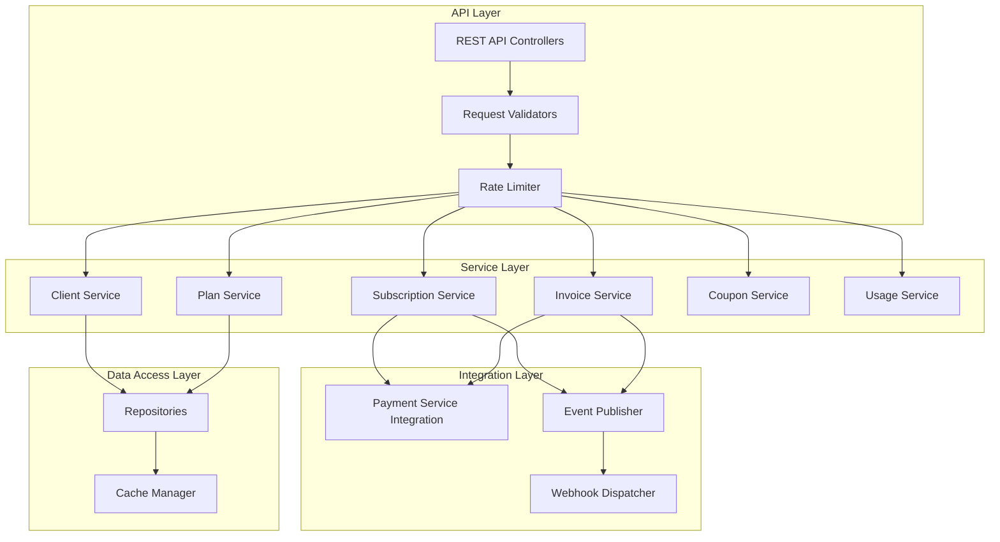

### Deployment Architecture

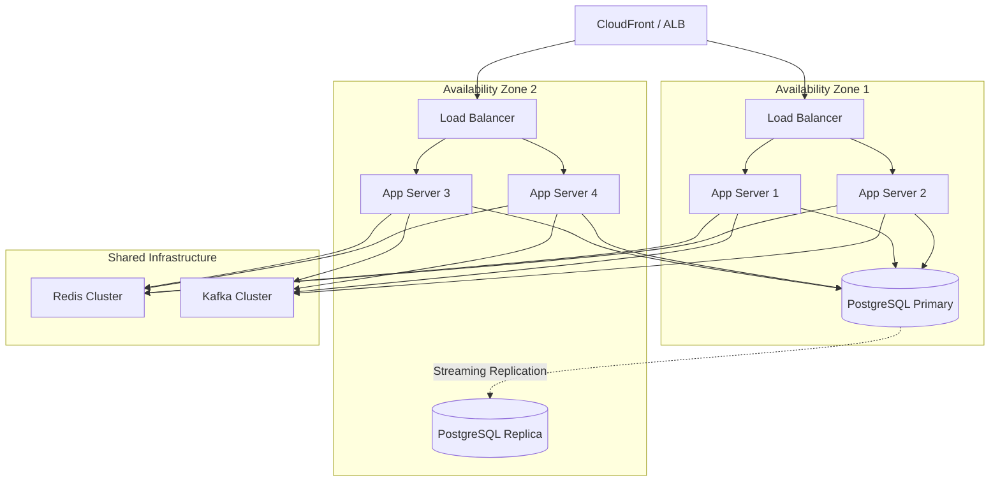

## Project Structure

```
billing-service/
├── src/
│   ├── main/
│   │   ├── java/
│   │   │   └── com/
│   │   │       └── billing/
│   │   │           ├── BillingServiceApplication.java
│   │   │           ├── controller/
│   │   │           │   ├── ClientController.java
│   │   │           │   ├── PlanController.java
│   │   │           │   ├── SubscriptionController.java
│   │   │           │   ├── InvoiceController.java
│   │   │           │   ├── CouponController.java
│   │   │           │   ├── UsageController.java
│   │   │           │   └── WebhookController.java
│   │   │           ├── service/
│   │   │           │   ├── ClientService.java (interface)
│   │   │           │   ├── PlanService.java (interface)
│   │   │           │   ├── SubscriptionService.java (interface)
│   │   │           │   ├── InvoiceService.java (interface)
│   │   │           │   ├── CouponService.java (interface)
│   │   │           │   ├── UsageService.java (interface)
│   │   │           │   ├── WebhookService.java (interface)
│   │   │           │   └── impl/
│   │   │           │       ├── ClientServiceImpl.java
│   │   │           │       ├── PlanServiceImpl.java
│   │   │           │       ├── SubscriptionServiceImpl.java
│   │   │           │       ├── InvoiceServiceImpl.java
│   │   │           │       ├── CouponServiceImpl.java
│   │   │           │       ├── UsageServiceImpl.java
│   │   │           │       └── WebhookServiceImpl.java
│   │   │           ├── repository/
│   │   │           │   ├── ServiceTenantRepository.java (interface)
│   │   │           │   ├── ApiKeyRepository.java (interface)
│   │   │           │   ├── SubscriptionPlanRepository.java (interface)
│   │   │           │   ├── SubscriptionRepository.java (interface)
│   │   │           │   ├── InvoiceRepository.java (interface)
│   │   │           │   ├── CouponRepository.java (interface)
│   │   │           │   ├── WebhookConfigRepository.java (interface)
│   │   │           │   ├── WebhookDeliveryRepository.java (interface)
│   │   │           │   ├── BillingUsageRepository.java (interface)
│   │   │           │   └── IdempotencyKeyRepository.java (interface)
│   │   │           ├── entity/
│   │   │           │   ├── ServiceTenant.java
│   │   │           │   ├── ApiKey.java
│   │   │           │   ├── SubscriptionPlan.java
│   │   │           │   ├── Subscription.java
│   │   │           │   ├── Invoice.java
│   │   │           │   ├── Coupon.java
│   │   │           │   ├── WebhookConfig.java
│   │   │           │   ├── WebhookDelivery.java
│   │   │           │   ├── BillingUsage.java
│   │   │           │   ├── AuditLog.java
│   │   │           │   └── IdempotencyKey.java
│   │   │           ├── dto/
│   │   │           │   ├── request/
│   │   │           │   │   ├── RegisterClientRequest.java
│   │   │           │   │   ├── CreatePlanRequest.java
│   │   │           │   │   ├── CreateSubscriptionRequest.java
│   │   │           │   │   ├── UpdateSubscriptionRequest.java
│   │   │           │   │   ├── CancelSubscriptionRequest.java
│   │   │           │   │   ├── CreateCouponRequest.java
│   │   │           │   │   └── CreateWebhookConfigRequest.java
│   │   │           │   └── response/
│   │   │           │       ├── ServiceTenantResponse.java
│   │   │           │       ├── PlanResponse.java
│   │   │           │       ├── SubscriptionResponse.java
│   │   │           │       ├── InvoiceResponse.java
│   │   │           │       ├── CouponResponse.java
│   │   │           │       ├── WebhookConfigResponse.java
│   │   │           │       ├── PaginatedResponse.java
│   │   │           │       └── ErrorResponse.java
│   │   │           ├── integration/
│   │   │           │   ├── paymentservice/
│   │   │           │   │   ├── PaymentServiceClient.java (interface)
│   │   │           │   │   ├── PaymentServiceWebhookHandler.java (interface)
│   │   │           │   │   ├── impl/
│   │   │           │   │   │   ├── PaymentServiceClientImpl.java
│   │   │           │   │   │   └── PaymentServiceWebhookHandlerImpl.java
│   │   │           │   │   └── dto/
│   │   │           │   │       ├── CreateCustomerRequest.java
│   │   │           │   │       ├── CustomerResponse.java
│   │   │           │   │       ├── CreatePaymentRequest.java
│   │   │           │   │       └── PaymentResponse.java
│   │   │           │   └── webhook/
│   │   │           │       ├── WebhookDispatcher.java (interface)
│   │   │           │       ├── WebhookSigner.java
│   │   │           │       └── impl/
│   │   │           │           └── WebhookDispatcherImpl.java
│   │   │           ├── event/
│   │   │           │   ├── EventPublisher.java (interface)
│   │   │           │   ├── EventConsumer.java
│   │   │           │   ├── BillingEvent.java
│   │   │           │   └── impl/
│   │   │           │       └── EventPublisherImpl.java
│   │   │           ├── security/
│   │   │           │   ├── ApiKeyAuthenticationFilter.java
│   │   │           │   ├── TenantContext.java
│   │   │           │   └── SecurityConfig.java
│   │   │           ├── config/
│   │   │           │   ├── DatabaseConfig.java
│   │   │           │   ├── RedisConfig.java
│   │   │           │   ├── KafkaConfig.java
│   │   │           │   ├── PaymentServiceConfig.java
│   │   │           │   └── WebClientConfig.java
│   │   │           ├── exception/
│   │   │           │   ├── GlobalExceptionHandler.java
│   │   │           │   ├── BillingException.java
│   │   │           │   ├── TenantNotFoundException.java
│   │   │           │   ├── SubscriptionNotFoundException.java
│   │   │           │   └── InvalidCouponException.java
│   │   │           ├── mapper/
│   │   │           │   ├── ServiceTenantMapper.java
│   │   │           │   ├── SubscriptionMapper.java
│   │   │           │   ├── InvoiceMapper.java
│   │   │           │   └── CouponMapper.java
│   │   │           ├── validation/
│   │   │           │   ├── ValidCouponCode.java
│   │   │           │   ├── ValidPlanId.java
│   │   │           │   └── ValidSubscriptionStatus.java
│   │   │           └── util/
│   │   │               ├── CryptoUtil.java
│   │   │               ├── IdempotencyUtil.java
│   │   │               └── WebhookSignatureUtil.java
│   │   └── resources/
│   │       ├── application.yml
│   │       ├── application-dev.yml
│   │       ├── application-prod.yml
│   │       ├── db/
│   │       │   └── migration/
│   │       │       ├── V001__create_service_tenants.sql
│   │       │       ├── V002__create_api_keys.sql
│   │       │       ├── V003__create_subscription_plans.sql
│   │       │       ├── V004__create_subscriptions.sql
│   │       │       ├── V005__create_invoices.sql
│   │       │       ├── V006__create_coupons.sql
│   │       │       ├── V007__create_webhook_configs.sql
│   │       │       └── V008__create_usage_tracking.sql
│   │       └── logback-spring.xml
│   └── test/
│       ├── java/
│       │   └── com/
│       │       └── billing/
│       │           ├── unit/
│       │           │   ├── service/
│       │           │   │   └── impl/  (test implementations)
│       │           │   └── util/
│       │           ├── integration/
│       │           │   ├── controller/
│       │           │   └── repository/
│       │           └── e2e/
│       └── resources/
│           ├── application-test.yml
│           └── test-data.sql
├── docs/
│   ├── api/
│   │   └── openapi.yaml
│   └── architecture/
├── pom.xml (or build.gradle)
├── Dockerfile
├── docker-compose.yml
└── README.md
```

## Data Models

### Entity Relationship Diagram

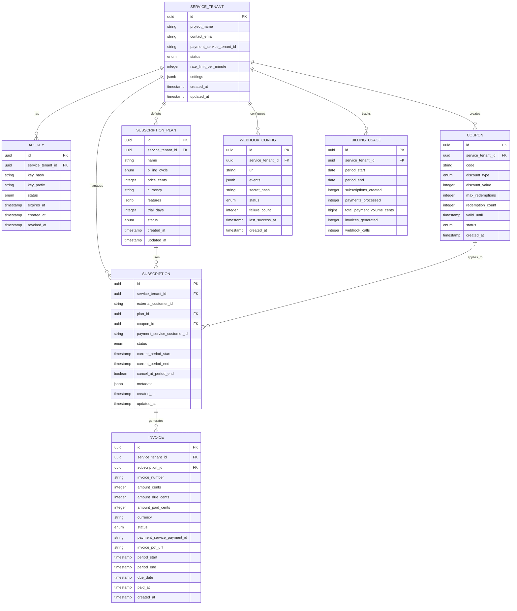

### Database Schema

```sql
-- Service Tenants (Client Projects)
CREATE TABLE service_tenants (
    id UUID PRIMARY KEY DEFAULT gen_random_uuid(),
    project_name VARCHAR(255) NOT NULL,
    contact_email VARCHAR(255) NOT NULL,
    payment_service_tenant_id VARCHAR(255),  -- Reference to Payment Service tenant
    status VARCHAR(50) NOT NULL DEFAULT 'pending',
    rate_limit_per_minute INTEGER DEFAULT 500,
    settings JSONB DEFAULT '{}',
    created_at TIMESTAMP WITH TIME ZONE DEFAULT NOW(),
    updated_at TIMESTAMP WITH TIME ZONE DEFAULT NOW(),
    CONSTRAINT valid_status CHECK (status IN ('pending', 'active', 'suspended', 'deleted'))
);

CREATE INDEX idx_service_tenants_status ON service_tenants(status);
CREATE INDEX idx_service_tenants_payment_tenant ON service_tenants(payment_service_tenant_id);

-- API Keys for Client Authentication
CREATE TABLE api_keys (
    id UUID PRIMARY KEY DEFAULT gen_random_uuid(),
    service_tenant_id UUID NOT NULL REFERENCES service_tenants(id) ON DELETE CASCADE,
    key_hash VARCHAR(255) NOT NULL,
    key_prefix VARCHAR(10) NOT NULL,
    name VARCHAR(255),
    status VARCHAR(50) NOT NULL DEFAULT 'active',
    expires_at TIMESTAMP WITH TIME ZONE,
    last_used_at TIMESTAMP WITH TIME ZONE,
    created_at TIMESTAMP WITH TIME ZONE DEFAULT NOW(),
    revoked_at TIMESTAMP WITH TIME ZONE,
    CONSTRAINT valid_key_status CHECK (status IN ('active', 'revoked', 'expired'))
);

CREATE INDEX idx_api_keys_tenant ON api_keys(service_tenant_id);
CREATE INDEX idx_api_keys_prefix ON api_keys(key_prefix);
CREATE INDEX idx_api_keys_status ON api_keys(status);

-- Subscription Plans per Client
CREATE TABLE subscription_plans (
    id UUID PRIMARY KEY DEFAULT gen_random_uuid(),
    service_tenant_id UUID NOT NULL REFERENCES service_tenants(id) ON DELETE CASCADE,
    name VARCHAR(255) NOT NULL,
    description TEXT,
    billing_cycle VARCHAR(50) NOT NULL DEFAULT 'monthly',
    price_cents INTEGER NOT NULL,
    currency VARCHAR(3) DEFAULT 'USD',
    features JSONB DEFAULT '{}',
    limits JSONB DEFAULT '{}',
    trial_days INTEGER DEFAULT 0,
    status VARCHAR(50) NOT NULL DEFAULT 'active',
    sort_order INTEGER DEFAULT 0,
    created_at TIMESTAMP WITH TIME ZONE DEFAULT NOW(),
    updated_at TIMESTAMP WITH TIME ZONE DEFAULT NOW(),
    CONSTRAINT valid_billing_cycle CHECK (billing_cycle IN ('monthly', 'yearly', 'quarterly')),
    CONSTRAINT valid_plan_status CHECK (status IN ('active', 'archived', 'draft')),
    CONSTRAINT unique_plan_name UNIQUE (service_tenant_id, name)
);

CREATE INDEX idx_plans_tenant ON subscription_plans(service_tenant_id);
CREATE INDEX idx_plans_status ON subscription_plans(status);

-- Customer Subscriptions
CREATE TABLE subscriptions (
    id UUID PRIMARY KEY DEFAULT gen_random_uuid(),
    service_tenant_id UUID NOT NULL REFERENCES service_tenants(id),
    external_customer_id VARCHAR(255) NOT NULL,
    external_customer_email VARCHAR(255),
    plan_id UUID NOT NULL REFERENCES subscription_plans(id),
    coupon_id UUID REFERENCES coupons(id),
    payment_service_customer_id VARCHAR(255),  -- Reference to Payment Service customer
    status VARCHAR(50) NOT NULL DEFAULT 'active',
    current_period_start TIMESTAMP WITH TIME ZONE,
    current_period_end TIMESTAMP WITH TIME ZONE,
    cancel_at_period_end BOOLEAN DEFAULT FALSE,
    canceled_at TIMESTAMP WITH TIME ZONE,
    ended_at TIMESTAMP WITH TIME ZONE,
    trial_start TIMESTAMP WITH TIME ZONE,
    trial_end TIMESTAMP WITH TIME ZONE,
    metadata JSONB DEFAULT '{}',
    created_at TIMESTAMP WITH TIME ZONE DEFAULT NOW(),
    updated_at TIMESTAMP WITH TIME ZONE DEFAULT NOW(),
    CONSTRAINT valid_sub_status CHECK (status IN ('trialing', 'active', 'past_due', 'canceled', 'unpaid', 'incomplete', 'incomplete_expired')),
    CONSTRAINT unique_customer_subscription UNIQUE (service_tenant_id, external_customer_id)
);

CREATE INDEX idx_subscriptions_tenant ON subscriptions(service_tenant_id);
CREATE INDEX idx_subscriptions_customer ON subscriptions(external_customer_id);
CREATE INDEX idx_subscriptions_payment_customer ON subscriptions(payment_service_customer_id);
CREATE INDEX idx_subscriptions_status ON subscriptions(status);
CREATE INDEX idx_subscriptions_period_end ON subscriptions(current_period_end);

-- Invoices
CREATE TABLE invoices (
    id UUID PRIMARY KEY DEFAULT gen_random_uuid(),
    service_tenant_id UUID NOT NULL REFERENCES service_tenants(id),
    subscription_id UUID NOT NULL REFERENCES subscriptions(id),
    invoice_number VARCHAR(100),
    amount_cents INTEGER NOT NULL,
    amount_due_cents INTEGER NOT NULL,
    amount_paid_cents INTEGER DEFAULT 0,
    currency VARCHAR(3) DEFAULT 'USD',
    status VARCHAR(50) NOT NULL,
    payment_service_payment_id VARCHAR(255),  -- Reference to Payment Service payment
    invoice_pdf_url TEXT,
    hosted_invoice_url TEXT,
    period_start TIMESTAMP WITH TIME ZONE,
    period_end TIMESTAMP WITH TIME ZONE,
    due_date TIMESTAMP WITH TIME ZONE,
    paid_at TIMESTAMP WITH TIME ZONE,
    voided_at TIMESTAMP WITH TIME ZONE,
    created_at TIMESTAMP WITH TIME ZONE DEFAULT NOW(),
    CONSTRAINT valid_invoice_status CHECK (status IN ('draft', 'open', 'paid', 'void', 'uncollectible'))
);

CREATE INDEX idx_invoices_tenant ON invoices(service_tenant_id);
CREATE INDEX idx_invoices_subscription ON invoices(subscription_id);
CREATE INDEX idx_invoices_payment_id ON invoices(payment_service_payment_id);
CREATE INDEX idx_invoices_status ON invoices(status);
CREATE INDEX idx_invoices_due_date ON invoices(due_date);

-- Coupons
CREATE TABLE coupons (
    id UUID PRIMARY KEY DEFAULT gen_random_uuid(),
    service_tenant_id UUID NOT NULL REFERENCES service_tenants(id) ON DELETE CASCADE,
    code VARCHAR(50) NOT NULL,
    name VARCHAR(255),
    discount_type VARCHAR(50) NOT NULL,
    discount_value INTEGER NOT NULL,
    currency VARCHAR(3) DEFAULT 'USD',
    duration VARCHAR(50) NOT NULL DEFAULT 'once',
    duration_months INTEGER,
    max_redemptions INTEGER,
    redemption_count INTEGER DEFAULT 0,
    applies_to_plans UUID[],
    valid_from TIMESTAMP WITH TIME ZONE DEFAULT NOW(),
    valid_until TIMESTAMP WITH TIME ZONE,
    status VARCHAR(50) NOT NULL DEFAULT 'active',
    created_at TIMESTAMP WITH TIME ZONE DEFAULT NOW(),
    CONSTRAINT valid_discount_type CHECK (discount_type IN ('percent', 'fixed')),
    CONSTRAINT valid_duration CHECK (duration IN ('once', 'repeating', 'forever')),
    CONSTRAINT valid_coupon_status CHECK (status IN ('active', 'expired', 'archived')),
    CONSTRAINT unique_coupon_code UNIQUE (service_tenant_id, code)
);

CREATE INDEX idx_coupons_tenant ON coupons(service_tenant_id);
CREATE INDEX idx_coupons_code ON coupons(code);
CREATE INDEX idx_coupons_status ON coupons(status);

-- Webhook Configurations
CREATE TABLE webhook_configs (
    id UUID PRIMARY KEY DEFAULT gen_random_uuid(),
    service_tenant_id UUID NOT NULL REFERENCES service_tenants(id) ON DELETE CASCADE,
    url VARCHAR(500) NOT NULL,
    events JSONB NOT NULL DEFAULT '[]',
    secret_hash VARCHAR(255) NOT NULL,
    status VARCHAR(50) NOT NULL DEFAULT 'active',
    failure_count INTEGER DEFAULT 0,
    last_success_at TIMESTAMP WITH TIME ZONE,
    last_failure_at TIMESTAMP WITH TIME ZONE,
    last_failure_reason TEXT,
    created_at TIMESTAMP WITH TIME ZONE DEFAULT NOW(),
    updated_at TIMESTAMP WITH TIME ZONE DEFAULT NOW(),
    CONSTRAINT valid_webhook_status CHECK (status IN ('active', 'disabled', 'failing'))
);

CREATE INDEX idx_webhooks_tenant ON webhook_configs(service_tenant_id);
CREATE INDEX idx_webhooks_status ON webhook_configs(status);

-- Webhook Delivery Log
CREATE TABLE webhook_deliveries (
    id UUID PRIMARY KEY DEFAULT gen_random_uuid(),
    webhook_config_id UUID NOT NULL REFERENCES webhook_configs(id) ON DELETE CASCADE,
    event_type VARCHAR(100) NOT NULL,
    payload JSONB NOT NULL,
    response_status INTEGER,
    response_body TEXT,
    attempt_count INTEGER DEFAULT 1,
    status VARCHAR(50) NOT NULL DEFAULT 'pending',
    next_retry_at TIMESTAMP WITH TIME ZONE,
    delivered_at TIMESTAMP WITH TIME ZONE,
    created_at TIMESTAMP WITH TIME ZONE DEFAULT NOW(),
    CONSTRAINT valid_delivery_status CHECK (status IN ('pending', 'delivered', 'failed', 'retrying'))
);

CREATE INDEX idx_webhook_deliveries_config ON webhook_deliveries(webhook_config_id);
CREATE INDEX idx_webhook_deliveries_status ON webhook_deliveries(status);
CREATE INDEX idx_webhook_deliveries_retry ON webhook_deliveries(next_retry_at) WHERE status = 'retrying';

-- Usage Tracking
CREATE TABLE billing_usage (
    id UUID PRIMARY KEY DEFAULT gen_random_uuid(),
    service_tenant_id UUID NOT NULL REFERENCES service_tenants(id),
    period_start DATE NOT NULL,
    period_end DATE NOT NULL,
    subscriptions_created INTEGER DEFAULT 0,
    subscriptions_canceled INTEGER DEFAULT 0,
    payments_processed INTEGER DEFAULT 0,
    payments_failed INTEGER DEFAULT 0,
    total_payment_volume_cents BIGINT DEFAULT 0,
    invoices_generated INTEGER DEFAULT 0,
    webhook_calls INTEGER DEFAULT 0,
    api_calls INTEGER DEFAULT 0,
    CONSTRAINT unique_usage_period UNIQUE (service_tenant_id, period_start)
);

CREATE INDEX idx_usage_tenant ON billing_usage(service_tenant_id);
CREATE INDEX idx_usage_period ON billing_usage(period_start, period_end);

-- Audit Log
CREATE TABLE audit_logs (
    id UUID PRIMARY KEY DEFAULT gen_random_uuid(),
    service_tenant_id UUID REFERENCES service_tenants(id),
    actor_type VARCHAR(50) NOT NULL,
    actor_id VARCHAR(255),
    action VARCHAR(100) NOT NULL,
    resource_type VARCHAR(100) NOT NULL,
    resource_id UUID,
    before_state JSONB,
    after_state JSONB,
    ip_address INET,
    user_agent TEXT,
    correlation_id VARCHAR(255),
    created_at TIMESTAMP WITH TIME ZONE DEFAULT NOW()
);

CREATE INDEX idx_audit_tenant ON audit_logs(service_tenant_id);
CREATE INDEX idx_audit_action ON audit_logs(action);
CREATE INDEX idx_audit_resource ON audit_logs(resource_type, resource_id);
CREATE INDEX idx_audit_created ON audit_logs(created_at);

-- Idempotency Keys
CREATE TABLE idempotency_keys (
    key VARCHAR(255) PRIMARY KEY,
    service_tenant_id UUID NOT NULL REFERENCES service_tenants(id),
    request_path VARCHAR(255) NOT NULL,
    request_hash VARCHAR(64) NOT NULL,
    response_status INTEGER,
    response_body JSONB,
    created_at TIMESTAMP WITH TIME ZONE DEFAULT NOW(),
    expires_at TIMESTAMP WITH TIME ZONE DEFAULT NOW() + INTERVAL '24 hours'
);

CREATE INDEX idx_idempotency_expires ON idempotency_keys(expires_at);

-- Row-Level Security Policies
ALTER TABLE subscriptions ENABLE ROW LEVEL SECURITY;
ALTER TABLE invoices ENABLE ROW LEVEL SECURITY;
ALTER TABLE subscription_plans ENABLE ROW LEVEL SECURITY;
ALTER TABLE coupons ENABLE ROW LEVEL SECURITY;
ALTER TABLE webhook_configs ENABLE ROW LEVEL SECURITY;

CREATE POLICY tenant_isolation_subscriptions ON subscriptions
    USING (service_tenant_id = current_setting('app.current_service_tenant_id')::uuid);

CREATE POLICY tenant_isolation_invoices ON invoices
    USING (service_tenant_id = current_setting('app.current_service_tenant_id')::uuid);

CREATE POLICY tenant_isolation_plans ON subscription_plans
    USING (service_tenant_id = current_setting('app.current_service_tenant_id')::uuid);

CREATE POLICY tenant_isolation_coupons ON coupons
    USING (service_tenant_id = current_setting('app.current_service_tenant_id')::uuid);

CREATE POLICY tenant_isolation_webhooks ON webhook_configs
    USING (service_tenant_id = current_setting('app.current_service_tenant_id')::uuid);
```


## Payment Service Integration

The Billing Service acts as a client of the Payment Service for all payment-related operations. This section describes the integration patterns, API calls, and webhook handling.

### Integration Architecture

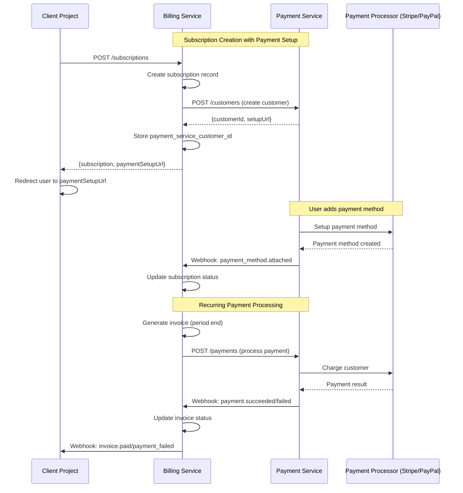

### Payment Service Client Interface

```java
// Payment Service Client Interface
package com.billing.integration.paymentservice;

public interface PaymentServiceClient {
    // Customer Management
    CustomerResponse createCustomer(CreateCustomerRequest request);
    CustomerResponse getCustomer(String customerId);
    CustomerResponse updateCustomer(String customerId, UpdateCustomerRequest request);
    
    // Payment Processing
    PaymentResponse createPayment(CreatePaymentRequest request);
    PaymentResponse getPayment(String paymentId);
    Page<PaymentResponse> listPayments(PaymentFilters filters, Pageable pageable);
    
    // Payment Methods
    List<PaymentMethodResponse> listPaymentMethods(String customerId);
    void setDefaultPaymentMethod(String customerId, String paymentMethodId);
    
    // Refunds
    RefundResponse createRefund(String paymentId, CreateRefundRequest request);
    RefundResponse getRefund(String refundId);
}

// Payment Service Client Implementation using WebClient
package com.billing.integration.paymentservice.impl;

import com.billing.integration.paymentservice.PaymentServiceClient;
import com.billing.integration.paymentservice.dto.*;

@Service
public class PaymentServiceClientImpl implements PaymentServiceClient {
    private final WebClient webClient;
    private final PaymentServiceConfig config;
    
    @Autowired
    public PaymentServiceClientImpl(
            WebClient.Builder webClientBuilder,
            PaymentServiceConfig config) {
        this.config = config;
        this.webClient = webClientBuilder
                .baseUrl(config.getBaseUrl())
                .defaultHeader("X-API-Key", config.getApiKey())
                .defaultHeader("Content-Type", "application/json")
                .build();
    }
    
    @Override
    public CustomerResponse createCustomer(CreateCustomerRequest request) {
        return webClient.post()
                .uri("/api/v1/customers")
                .bodyValue(request)
                .retrieve()
                .onStatus(HttpStatusCode::isError, this::handleError)
                .bodyToMono(CustomerResponse.class)
                .block(Duration.ofSeconds(config.getTimeout()));
    }
    
    @Override
    public PaymentResponse createPayment(CreatePaymentRequest request) {
        return webClient.post()
                .uri("/api/v1/payments")
                .bodyValue(request)
                .retrieve()
                .onStatus(HttpStatusCode::isError, this::handleError)
                .bodyToMono(PaymentResponse.class)
                .block(Duration.ofSeconds(config.getTimeout()));
    }
    
    // Additional methods...
    
    private Mono<? extends Throwable> handleError(ClientResponse response) {
        return response.bodyToMono(String.class)
                .flatMap(body -> Mono.error(
                    new PaymentServiceException(
                        "Payment Service error: " + response.statusCode(),
                        response.statusCode().value(),
                        body
                    )
                ));
    }
}

// Request/Response Types
public record CreateCustomerRequest(
    String tenantId,
    String externalCustomerId,
    @Email String email,
    String name,
    Map<String, String> metadata
) {}

public record CustomerResponse(
    String id,
    String externalCustomerId,
    String email,
    String name,
    String defaultPaymentMethodId,
    String paymentSetupUrl,  // URL for customer to add payment method
    Instant createdAt
) {}

public record CreatePaymentRequest(
    String tenantId,
    String customerId,
    @Positive Integer amount,
    String currency,
    PaymentType paymentType,
    String description,
    Map<String, String> metadata,
    String idempotencyKey
) {}

public enum PaymentType {
    ONE_TIME, RECURRING
}

public record PaymentResponse(
    String id,
    String customerId,
    Integer amount,
    String currency,
    PaymentStatus status,
    PaymentType paymentType,
    String failureReason,
    String receiptUrl,
    Instant createdAt,
    Instant processedAt
) {}

public enum PaymentStatus {
    PENDING, PROCESSING, SUCCEEDED, FAILED, REQUIRES_ACTION
}

public record PaymentMethodResponse(
    String id,
    String customerId,
    PaymentMethodType type,
    boolean isDefault,
    CardDetails cardDetails,
    Instant createdAt
) {}

public enum PaymentMethodType {
    CARD, BANK_ACCOUNT, PAYPAL
}

public record CardDetails(
    String brand,
    String last4,
    int expMonth,
    int expYear
) {}

public record CreateRefundRequest(
    Integer amount,  // Partial refund if specified
    String reason,
    Map<String, String> metadata,
    String idempotencyKey
) {}

public record RefundResponse(
    String id,
    String paymentId,
    Integer amount,
    String currency,
    RefundStatus status,
    String reason,
    Instant createdAt,
    Instant processedAt
) {}

public enum RefundStatus {
    PENDING, SUCCEEDED, FAILED
}
```

### Payment Service Webhook Events

The Billing Service receives webhooks from the Payment Service for payment status updates:

```java
// Webhook Event Types
public enum PaymentServiceWebhookEvent {
    PAYMENT_SUCCEEDED,
    PAYMENT_FAILED,
    PAYMENT_REQUIRES_ACTION,
    PAYMENT_METHOD_ATTACHED,
    PAYMENT_METHOD_DETACHED,
    PAYMENT_METHOD_UPDATED,
    REFUND_SUCCEEDED,
    REFUND_FAILED
}

// Webhook Payload
public record PaymentServiceWebhook(
    String id,
    PaymentServiceWebhookEvent type,
    Instant createdAt,
    WebhookData data
) {}

public record WebhookData(
    String tenantId,
    PaymentResponse payment,
    PaymentMethodResponse paymentMethod,
    RefundResponse refund,
    String customerId
) {}

// Webhook Handler Interface
package com.billing.integration.paymentservice;

public interface PaymentServiceWebhookHandler {
    void handlePaymentSucceeded(PaymentServiceWebhook event);
    void handlePaymentFailed(PaymentServiceWebhook event);
    void handlePaymentRequiresAction(PaymentServiceWebhook event);
    void handlePaymentMethodAttached(PaymentServiceWebhook event);
    void handlePaymentMethodDetached(PaymentServiceWebhook event);
    void handleRefundSucceeded(PaymentServiceWebhook event);
    void handleRefundFailed(PaymentServiceWebhook event);
}

// Webhook Handler Implementation
package com.billing.integration.paymentservice.impl;

import com.billing.integration.paymentservice.PaymentServiceWebhookHandler;
import com.billing.service.UsageService;

@Service
@Transactional
public class PaymentServiceWebhookHandlerImpl implements PaymentServiceWebhookHandler {
    private final InvoiceRepository invoiceRepository;
    private final SubscriptionRepository subscriptionRepository;
    private final UsageService usageService;
    private final EventPublisher eventPublisher;
    
    @Autowired
    public PaymentServiceWebhookHandlerImpl(
            InvoiceRepository invoiceRepository,
            SubscriptionRepository subscriptionRepository,
            UsageService usageService,
            EventPublisher eventPublisher) {
        this.invoiceRepository = invoiceRepository;
        this.subscriptionRepository = subscriptionRepository;
        this.usageService = usageService;
        this.eventPublisher = eventPublisher;
    }
    
    @Override
    public void handlePaymentSucceeded(PaymentServiceWebhook event) {
        // Implementation shown in next section
    }
    
    @Override
    public void handlePaymentFailed(PaymentServiceWebhook event) {
        // Implementation shown in next section
    }
    
    // Additional handler methods...
}
```

### Integration Flows

#### Flow 1: Subscription Creation with Payment Setup

```java
package com.billing.service.impl;

import com.billing.service.SubscriptionService;
import com.billing.integration.paymentservice.PaymentServiceClient;
import com.billing.integration.paymentservice.dto.*;

@Service
@Transactional
public class SubscriptionServiceImpl implements SubscriptionService {
    
    @Autowired
    private SubscriptionRepository subscriptionRepository;
    
    @Autowired
    private PaymentServiceClient paymentServiceClient;
    
    public SubscriptionWithSetupUrl createSubscriptionWithPaymentSetup(
            UUID tenantId,
            CreateSubscriptionRequest request) {
        
        // 1. Create subscription record
        Subscription subscription = subscriptionRepository.save(Subscription.builder()
                .serviceTenantId(tenantId)
                .externalCustomerId(request.externalCustomerId())
                .planId(request.planId())
                .status(SubscriptionStatus.INCOMPLETE)  // Waiting for payment method
                .build());

        // 2. Create customer in Payment Service
        CustomerResponse customer = paymentServiceClient.createCustomer(
                new CreateCustomerRequest(
                        tenantId.toString(),
                        request.externalCustomerId(),
                        request.externalCustomerEmail(),
                        null,
                        Map.of(
                                "subscriptionId", subscription.getId().toString(),
                                "planId", request.planId().toString()
                        )
                )
        );

        // 3. Store Payment Service customer ID
        subscription.setPaymentServiceCustomerId(customer.id());
        subscriptionRepository.save(subscription);

        // 4. Return subscription with payment setup URL
        return new SubscriptionWithSetupUrl(
                subscriptionMapper.toResponse(subscription),
                customer.paymentSetupUrl(),
                "Redirect customer to paymentSetupUrl to add payment method"
        );
    }
}
```

#### Flow 2: Invoice Payment Processing

```java
package com.billing.service.impl;

import com.billing.service.InvoiceService;
import com.billing.integration.paymentservice.PaymentServiceClient;
import com.billing.integration.paymentservice.dto.*;

@Service
@Transactional
public class InvoiceServiceImpl implements InvoiceService {
    
    @Autowired
    private InvoiceRepository invoiceRepository;
    
    @Autowired
    private SubscriptionRepository subscriptionRepository;
    
    @Autowired
    private PaymentServiceClient paymentServiceClient;
    
    public void processInvoicePayment(UUID tenantId, UUID invoiceId) {
        // 1. Get invoice and subscription
        Invoice invoice = invoiceRepository.findByIdAndTenantId(invoiceId, tenantId)
                .orElseThrow(() -> new InvoiceNotFoundException(invoiceId));
        
        Subscription subscription = subscriptionRepository.findById(invoice.getSubscriptionId())
                .orElseThrow(() -> new SubscriptionNotFoundException(invoice.getSubscriptionId()));

        // 2. Call Payment Service to process payment
        PaymentResponse payment = paymentServiceClient.createPayment(
                new CreatePaymentRequest(
                        tenantId.toString(),
                        subscription.getPaymentServiceCustomerId(),
                        invoice.getAmountDueCents(),
                        invoice.getCurrency(),
                        PaymentType.RECURRING,
                        String.format("Invoice %s for subscription %s", 
                                invoice.getInvoiceNumber(), subscription.getId()),
                        Map.of(
                                "invoiceId", invoice.getId().toString(),
                                "subscriptionId", subscription.getId().toString(),
                                "billingPeriod", String.format("%s to %s", 
                                        invoice.getPeriodStart(), invoice.getPeriodEnd())
                        ),
                        "invoice-payment-" + invoice.getId()
                )
        );

        // 3. Store Payment Service payment ID
        invoice.setPaymentServicePaymentId(payment.id());
        invoice.setStatus(payment.status() == PaymentStatus.SUCCEEDED ? 
                InvoiceStatus.PAID : InvoiceStatus.OPEN);
        invoiceRepository.save(invoice);

        // 4. Payment status updates will come via webhook
    }
}
```

#### Flow 3: Payment Webhook Handling

```java
package com.billing.integration.paymentservice.impl;

import com.billing.integration.paymentservice.PaymentServiceWebhookHandler;
import com.billing.service.UsageService;

@Service
@Transactional
public class PaymentServiceWebhookHandlerImpl implements PaymentServiceWebhookHandler {
    
    @Autowired
    private InvoiceRepository invoiceRepository;
    
    @Autowired
    private SubscriptionRepository subscriptionRepository;
    
    @Autowired
    private UsageService usageService;
    
    @Autowired
    private EventPublisher eventPublisher;
    
    @Override
    public void handlePaymentSucceeded(PaymentServiceWebhook event) {
        PaymentResponse payment = event.data().payment();
        UUID invoiceId = UUID.fromString(payment.metadata().get("invoiceId"));
        UUID tenantId = UUID.fromString(event.data().tenantId());

        // 1. Update invoice status
        Invoice invoice = invoiceRepository.findByIdAndTenantId(invoiceId, tenantId)
                .orElseThrow(() -> new InvoiceNotFoundException(invoiceId));
        
        invoice.setStatus(InvoiceStatus.PAID);
        invoice.setAmountPaidCents(payment.amount());
        invoice.setPaidAt(payment.processedAt());
        invoiceRepository.save(invoice);

        // 2. Update subscription status if it was past_due
        if (invoice.getSubscriptionId() != null) {
            Subscription subscription = subscriptionRepository.findById(invoice.getSubscriptionId())
                    .orElseThrow();
            
            if (subscription.getStatus() == SubscriptionStatus.PAST_DUE) {
                subscription.setStatus(SubscriptionStatus.ACTIVE);
                subscriptionRepository.save(subscription);
            }
        }

        // 3. Track usage
        usageService.incrementCounter(tenantId, UsageMetric.PAYMENTS_PROCESSED, 1);
        usageService.incrementCounter(tenantId, UsageMetric.TOTAL_PAYMENT_VOLUME_CENTS, 
                payment.amount());

        // 4. Publish event to client
        eventPublisher.publish(new BillingEvent(
                "invoice.paid",
                tenantId,
                Map.of(
                        "invoiceId", invoice.getId().toString(),
                        "subscriptionId", invoice.getSubscriptionId().toString(),
                        "amountPaid", payment.amount(),
                        "currency", payment.currency()
                )
        ));
    }

    @Override
    public void handlePaymentFailed(PaymentServiceWebhook event) {
        PaymentResponse payment = event.data().payment();
        UUID invoiceId = UUID.fromString(payment.metadata().get("invoiceId"));
        UUID tenantId = UUID.fromString(event.data().tenantId());

        // 1. Update invoice status
        Invoice invoice = invoiceRepository.findByIdAndTenantId(invoiceId, tenantId)
                .orElseThrow(() -> new InvoiceNotFoundException(invoiceId));
        
        invoice.setStatus(InvoiceStatus.OPEN);  // Keep open for retry
        invoiceRepository.save(invoice);

        // 2. Update subscription status to past_due
        if (invoice.getSubscriptionId() != null) {
            Subscription subscription = subscriptionRepository.findById(invoice.getSubscriptionId())
                    .orElseThrow();
            subscription.setStatus(SubscriptionStatus.PAST_DUE);
            subscriptionRepository.save(subscription);
        }

        // 3. Track usage
        usageService.incrementCounter(tenantId, UsageMetric.PAYMENTS_FAILED, 1);

        // 4. Publish event to client
        eventPublisher.publish(new BillingEvent(
                "invoice.payment_failed",
                tenantId,
                Map.of(
                        "invoiceId", invoice.getId().toString(),
                        "subscriptionId", invoice.getSubscriptionId().toString(),
                        "failureReason", payment.failureReason(),
                        "retryable", true
                )
        ));
    }
}
```

### Error Handling

#### Payment Service Unavailable

```java
@Service
public class PaymentServiceErrorHandler {
    
    @Autowired
    private RetryQueue retryQueue;
    
    public void handlePaymentServiceError(Exception error) {
        if (error instanceof ResourceAccessException || error instanceof TimeoutException) {
            // Payment Service is down
            log.error("Payment Service unavailable", error);
            
            // Queue for retry
            retryQueue.add(RetryTask.builder()
                    .operation("createPayment")
                    .retryCount(0)
                    .maxRetries(5)
                    .build());
            
            throw new ServiceUnavailableException("Payment Service is temporarily unavailable");
        }
        
        // Other errors
        throw new BillingException("Payment Service error", error);
    }
}
```

#### Webhook Verification

```java
@Component
public class WebhookSignatureUtil {
    
    public boolean verifyPaymentServiceWebhook(
            String signature,
            String payload,
            String secret) {
        
        try {
            Mac hmac = Mac.getInstance("HmacSHA256");
            SecretKeySpec secretKey = new SecretKeySpec(secret.getBytes(StandardCharsets.UTF_8), "HmacSHA256");
            hmac.init(secretKey);
            
            byte[] hash = hmac.doFinal(payload.getBytes(StandardCharsets.UTF_8));
            String expectedSignature = Hex.encodeHexString(hash);
            
            return MessageDigest.isEqual(
                    signature.getBytes(StandardCharsets.UTF_8),
                    expectedSignature.getBytes(StandardCharsets.UTF_8)
            );
        } catch (Exception e) {
            log.error("Error verifying webhook signature", e);
            return false;
        }
    }
}
```

### Configuration

```yaml
# application.yml
spring:
  application:
    name: billing-service
  
  datasource:
    url: ${DATABASE_URL:jdbc:postgresql://localhost:5432/billing}
    username: ${DATABASE_USER:billing}
    password: ${DATABASE_PASSWORD:secret}
    hikari:
      maximum-pool-size: 20
      minimum-idle: 5
      connection-timeout: 30000
  
  jpa:
    hibernate:
      ddl-auto: validate
    properties:
      hibernate:
        dialect: org.hibernate.dialect.PostgreSQLDialect
        jdbc:
          time_zone: UTC
  
  data:
    redis:
      host: ${REDIS_HOST:localhost}
      port: ${REDIS_PORT:6379}
      password: ${REDIS_PASSWORD:}
      timeout: 2000ms
  
  kafka:
    bootstrap-servers: ${KAFKA_BOOTSTRAP_SERVERS:localhost:9092}
    consumer:
      group-id: billing-service
      auto-offset-reset: earliest
    producer:
      acks: all
      retries: 3

payment-service:
  base-url: ${PAYMENT_SERVICE_URL:http://localhost:3001}
  api-key: ${PAYMENT_SERVICE_API_KEY}
  webhook-secret: ${PAYMENT_SERVICE_WEBHOOK_SECRET}
  timeout: 30s
  retry-attempts: 3
  retry-delay: 1s

server:
  port: 8080
  compression:
    enabled: true
  
management:
  endpoints:
    web:
      exposure:
        include: health,info,metrics,prometheus
  metrics:
    export:
      prometheus:
        enabled: true

logging:
  level:
    com.billing: INFO
    org.springframework.web: INFO
    org.hibernate.SQL: DEBUG
```


## Components and Interfaces

### Core Interfaces/Types

```java
// Service Tenant (Client Project)
@Entity
@Table(name = "service_tenants")
public class ServiceTenant {
    @Id
    @GeneratedValue(strategy = GenerationType.UUID)
    private UUID id;
    
    @Column(nullable = false)
    private String projectName;
    
    @Column(nullable = false)
    private String contactEmail;
    
    private String paymentServiceTenantId;  // Reference to Payment Service tenant
    
    @Enumerated(EnumType.STRING)
    @Column(nullable = false)
    private TenantStatus status;
    
    @Column(nullable = false)
    private Integer rateLimitPerMinute = 500;
    
    @Type(JsonType.class)
    @Column(columnDefinition = "jsonb")
    private TenantSettings settings;
    
    @CreatedDate
    private Instant createdAt;
    
    @LastModifiedDate
    private Instant updatedAt;
}

public enum TenantStatus {
    PENDING, ACTIVE, SUSPENDED, DELETED
}

public record TenantSettings(
    WebhookRetryPolicy webhookRetryPolicy,
    InvoiceSettings invoiceSettings,
    String defaultCurrency,
    String timezone
) {}

public record WebhookRetryPolicy(
    int maxRetries,
    double backoffMultiplier
) {}

public record InvoiceSettings(
    int daysUntilDue,
    String footer
) {}

// API Key
@Entity
@Table(name = "api_keys")
public class ApiKey {
    @Id
    @GeneratedValue(strategy = GenerationType.UUID)
    private UUID id;
    
    @ManyToOne(fetch = FetchType.LAZY)
    @JoinColumn(name = "service_tenant_id", nullable = false)
    private ServiceTenant serviceTenant;
    
    @Column(nullable = false)
    private String keyHash;
    
    @Column(nullable = false, length = 10)
    private String keyPrefix;
    
    private String name;
    
    @Enumerated(EnumType.STRING)
    @Column(nullable = false)
    private ApiKeyStatus status = ApiKeyStatus.ACTIVE;
    
    private Instant expiresAt;
    private Instant lastUsedAt;
    
    @CreatedDate
    private Instant createdAt;
    
    private Instant revokedAt;
}

public enum ApiKeyStatus {
    ACTIVE, REVOKED, EXPIRED
}

// Subscription Plan
@Entity
@Table(name = "subscription_plans")
public class SubscriptionPlan {
    @Id
    @GeneratedValue(strategy = GenerationType.UUID)
    private UUID id;
    
    @ManyToOne(fetch = FetchType.LAZY)
    @JoinColumn(name = "service_tenant_id", nullable = false)
    private ServiceTenant serviceTenant;
    
    @Column(nullable = false)
    private String name;
    
    private String description;
    
    @Enumerated(EnumType.STRING)
    @Column(nullable = false)
    private BillingCycle billingCycle;
    
    @Column(nullable = false)
    private Integer priceCents;
    
    @Column(nullable = false, length = 3)
    private String currency = "USD";
    
    @Type(JsonType.class)
    @Column(columnDefinition = "jsonb")
    private Map<String, Object> features;
    
    @Type(JsonType.class)
    @Column(columnDefinition = "jsonb")
    private Map<String, Integer> limits;
    
    @Column(nullable = false)
    private Integer trialDays = 0;
    
    @Enumerated(EnumType.STRING)
    @Column(nullable = false)
    private PlanStatus status = PlanStatus.ACTIVE;
    
    private Integer sortOrder = 0;
    
    @CreatedDate
    private Instant createdAt;
    
    @LastModifiedDate
    private Instant updatedAt;
}

public enum BillingCycle {
    MONTHLY, YEARLY, QUARTERLY
}

public enum PlanStatus {
    ACTIVE, ARCHIVED, DRAFT
}

// Subscription
@Entity
@Table(name = "subscriptions")
public class Subscription {
    @Id
    @GeneratedValue(strategy = GenerationType.UUID)
    private UUID id;
    
    @ManyToOne(fetch = FetchType.LAZY)
    @JoinColumn(name = "service_tenant_id", nullable = false)
    private ServiceTenant serviceTenant;
    
    @Column(nullable = false)
    private String externalCustomerId;
    
    private String externalCustomerEmail;
    
    @ManyToOne(fetch = FetchType.LAZY)
    @JoinColumn(name = "plan_id", nullable = false)
    private SubscriptionPlan plan;
    
    @ManyToOne(fetch = FetchType.LAZY)
    @JoinColumn(name = "coupon_id")
    private Coupon coupon;
    
    private String paymentServiceCustomerId;  // Reference to Payment Service customer
    
    @Enumerated(EnumType.STRING)
    @Column(nullable = false)
    private SubscriptionStatus status;
    
    private Instant currentPeriodStart;
    private Instant currentPeriodEnd;
    
    @Column(nullable = false)
    private Boolean cancelAtPeriodEnd = false;
    
    private Instant canceledAt;
    private Instant endedAt;
    private Instant trialStart;
    private Instant trialEnd;
    
    @Type(JsonType.class)
    @Column(columnDefinition = "jsonb")
    private Map<String, String> metadata;
    
    @CreatedDate
    private Instant createdAt;
    
    @LastModifiedDate
    private Instant updatedAt;
}

public enum SubscriptionStatus {
    TRIALING, ACTIVE, PAST_DUE, CANCELED, UNPAID, INCOMPLETE, INCOMPLETE_EXPIRED
}

// Invoice
@Entity
@Table(name = "invoices")
public class Invoice {
    @Id
    @GeneratedValue(strategy = GenerationType.UUID)
    private UUID id;
    
    @ManyToOne(fetch = FetchType.LAZY)
    @JoinColumn(name = "service_tenant_id", nullable = false)
    private ServiceTenant serviceTenant;
    
    @ManyToOne(fetch = FetchType.LAZY)
    @JoinColumn(name = "subscription_id", nullable = false)
    private Subscription subscription;
    
    private String invoiceNumber;
    
    @Column(nullable = false)
    private Integer amountCents;
    
    @Column(nullable = false)
    private Integer amountDueCents;
    
    @Column(nullable = false)
    private Integer amountPaidCents = 0;
    
    @Column(nullable = false, length = 3)
    private String currency = "USD";
    
    @Enumerated(EnumType.STRING)
    @Column(nullable = false)
    private InvoiceStatus status;
    
    private String paymentServicePaymentId;  // Reference to Payment Service payment
    
    private String invoicePdfUrl;
    private String hostedInvoiceUrl;
    
    private Instant periodStart;
    private Instant periodEnd;
    private Instant dueDate;
    private Instant paidAt;
    private Instant voidedAt;
    
    @CreatedDate
    private Instant createdAt;
}

public enum InvoiceStatus {
    DRAFT, OPEN, PAID, VOID, UNCOLLECTIBLE
}

// Coupon
@Entity
@Table(name = "coupons")
public class Coupon {
    @Id
    @GeneratedValue(strategy = GenerationType.UUID)
    private UUID id;
    
    @ManyToOne(fetch = FetchType.LAZY)
    @JoinColumn(name = "service_tenant_id", nullable = false)
    private ServiceTenant serviceTenant;
    
    @Column(nullable = false, length = 50)
    private String code;
    
    private String name;
    
    @Enumerated(EnumType.STRING)
    @Column(nullable = false)
    private DiscountType discountType;
    
    @Column(nullable = false)
    private Integer discountValue;
    
    @Column(nullable = false, length = 3)
    private String currency = "USD";
    
    @Enumerated(EnumType.STRING)
    @Column(nullable = false)
    private CouponDuration duration = CouponDuration.ONCE;
    
    private Integer durationMonths;
    
    private Integer maxRedemptions;
    
    @Column(nullable = false)
    private Integer redemptionCount = 0;
    
    @Type(JsonType.class)
    @Column(columnDefinition = "uuid[]")
    private List<UUID> appliesToPlans;
    
    @Column(nullable = false)
    private Instant validFrom;
    
    private Instant validUntil;
    
    @Enumerated(EnumType.STRING)
    @Column(nullable = false)
    private CouponStatus status = CouponStatus.ACTIVE;
    
    @CreatedDate
    private Instant createdAt;
}

public enum DiscountType {
    PERCENT, FIXED
}

public enum CouponDuration {
    ONCE, REPEATING, FOREVER
}

public enum CouponStatus {
    ACTIVE, EXPIRED, ARCHIVED
}

// Webhook Configuration
@Entity
@Table(name = "webhook_configs")
public class WebhookConfig {
    @Id
    @GeneratedValue(strategy = GenerationType.UUID)
    private UUID id;
    
    @ManyToOne(fetch = FetchType.LAZY)
    @JoinColumn(name = "service_tenant_id", nullable = false)
    private ServiceTenant serviceTenant;
    
    @Column(nullable = false, length = 500)
    private String url;
    
    @Type(JsonType.class)
    @Column(columnDefinition = "jsonb", nullable = false)
    private List<WebhookEventType> events;
    
    @Column(nullable = false)
    private String secretHash;
    
    @Enumerated(EnumType.STRING)
    @Column(nullable = false)
    private WebhookStatus status = WebhookStatus.ACTIVE;
    
    @Column(nullable = false)
    private Integer failureCount = 0;
    
    private Instant lastSuccessAt;
    private Instant lastFailureAt;
    private String lastFailureReason;
    
    @CreatedDate
    private Instant createdAt;
    
    @LastModifiedDate
    private Instant updatedAt;
}

public enum WebhookEventType {
    SUBSCRIPTION_CREATED,
    SUBSCRIPTION_UPDATED,
    SUBSCRIPTION_CANCELED,
    SUBSCRIPTION_TRIAL_ENDING,
    INVOICE_CREATED,
    INVOICE_PAID,
    INVOICE_PAYMENT_FAILED,
    INVOICE_PAYMENT_REQUIRES_ACTION
}

public enum WebhookStatus {
    ACTIVE, DISABLED, FAILING
}

// Billing Usage
@Entity
@Table(name = "billing_usage")
public class BillingUsage {
    @Id
    @GeneratedValue(strategy = GenerationType.UUID)
    private UUID id;
    
    @ManyToOne(fetch = FetchType.LAZY)
    @JoinColumn(name = "service_tenant_id", nullable = false)
    private ServiceTenant serviceTenant;
    
    @Column(nullable = false)
    private LocalDate periodStart;
    
    @Column(nullable = false)
    private LocalDate periodEnd;
    
    private Integer subscriptionsCreated = 0;
    private Integer subscriptionsCanceled = 0;
    private Integer paymentsProcessed = 0;
    private Integer paymentsFailed = 0;
    private Long totalPaymentVolumeCents = 0L;
    private Integer invoicesGenerated = 0;
    private Integer webhookCalls = 0;
    private Integer apiCalls = 0;
}
```

### Service Interfaces

```java
// Client Service Interface
package com.billing.service;

public interface ClientService {
    RegisterClientResponse register(RegisterClientRequest request);
    ServiceTenantResponse getById(UUID id);
    ServiceTenantResponse update(UUID id, UpdateClientRequest request);
    void suspend(UUID id, String reason);
    void activate(UUID id);
    RotateApiKeyResponse rotateApiKey(UUID tenantId);
    void revokeApiKey(UUID tenantId, UUID keyId);
    List<ApiKeyResponse> listApiKeys(UUID tenantId);
}

// Client Service Implementation
package com.billing.service.impl;

import com.billing.service.ClientService;
import com.billing.integration.paymentservice.PaymentServiceClient;

@Service
@Transactional
public class ClientServiceImpl implements ClientService {
    private final ServiceTenantRepository serviceTenantRepository;
    private final ApiKeyRepository apiKeyRepository;
    private final PaymentServiceClient paymentServiceClient;
    private final PasswordEncoder passwordEncoder;
    
    @Autowired
    public ClientServiceImpl(
            ServiceTenantRepository serviceTenantRepository,
            ApiKeyRepository apiKeyRepository,
            PaymentServiceClient paymentServiceClient,
            PasswordEncoder passwordEncoder) {
        this.serviceTenantRepository = serviceTenantRepository;
        this.apiKeyRepository = apiKeyRepository;
        this.paymentServiceClient = paymentServiceClient;
        this.passwordEncoder = passwordEncoder;
    }
    
    @Override
    public RegisterClientResponse register(RegisterClientRequest request) {
        // Implementation
    }
    
    // Additional methods...
}

// Plan Service Interface
package com.billing.service;

public interface PlanService {
    PlanResponse create(UUID tenantId, CreatePlanRequest request);
    PlanResponse getById(UUID tenantId, UUID planId);
    List<PlanResponse> list(UUID tenantId, PlanFilters filters);
    PlanResponse update(UUID tenantId, UUID planId, UpdatePlanRequest request);
    void archive(UUID tenantId, UUID planId);
}

// Plan Service Implementation
package com.billing.service.impl;

import com.billing.service.PlanService;

@Service
@Transactional
public class PlanServiceImpl implements PlanService {
    private final SubscriptionPlanRepository planRepository;
    private final ServiceTenantRepository tenantRepository;
    private final PlanMapper planMapper;
    
    @Autowired
    public PlanServiceImpl(
            SubscriptionPlanRepository planRepository,
            ServiceTenantRepository tenantRepository,
            PlanMapper planMapper) {
        this.planRepository = planRepository;
        this.tenantRepository = tenantRepository;
        this.planMapper = planMapper;
    }
    
    @Override
    public PlanResponse create(UUID tenantId, CreatePlanRequest request) {
        // Implementation
    }
    
    // Additional methods...
}

// Subscription Service Interface
package com.billing.service;

public interface SubscriptionService {
    SubscriptionWithSetupUrl create(UUID tenantId, CreateSubscriptionRequest request);
    SubscriptionResponse getById(UUID tenantId, UUID subscriptionId);
    Optional<SubscriptionResponse> getByCustomerId(UUID tenantId, String customerId);
    Page<SubscriptionResponse> list(UUID tenantId, SubscriptionFilters filters, Pageable pageable);
    SubscriptionResponse update(UUID tenantId, UUID subscriptionId, UpdateSubscriptionRequest request);
    SubscriptionResponse cancel(UUID tenantId, UUID subscriptionId, CancelOptions options);
    SubscriptionResponse reactivate(UUID tenantId, UUID subscriptionId);
    SubscriptionResponse changePlan(UUID tenantId, UUID subscriptionId, UUID newPlanId, boolean prorate);
    SubscriptionResponse applyPromoCode(UUID tenantId, UUID subscriptionId, String code);
}

// Subscription Service Implementation
package com.billing.service.impl;

import com.billing.service.SubscriptionService;
import com.billing.service.UsageService;
import com.billing.integration.paymentservice.PaymentServiceClient;

@Service
@Transactional
public class SubscriptionServiceImpl implements SubscriptionService {
    private final SubscriptionRepository subscriptionRepository;
    private final SubscriptionPlanRepository planRepository;
    private final CouponRepository couponRepository;
    private final PaymentServiceClient paymentServiceClient;
    private final EventPublisher eventPublisher;
    private final UsageService usageService;
    private final SubscriptionMapper subscriptionMapper;
    
    @Autowired
    public SubscriptionServiceImpl(
            SubscriptionRepository subscriptionRepository,
            SubscriptionPlanRepository planRepository,
            CouponRepository couponRepository,
            PaymentServiceClient paymentServiceClient,
            EventPublisher eventPublisher,
            UsageService usageService,
            SubscriptionMapper subscriptionMapper) {
        this.subscriptionRepository = subscriptionRepository;
        this.planRepository = planRepository;
        this.couponRepository = couponRepository;
        this.paymentServiceClient = paymentServiceClient;
        this.eventPublisher = eventPublisher;
        this.usageService = usageService;
        this.subscriptionMapper = subscriptionMapper;
    }
    
    @Override
    public SubscriptionWithSetupUrl create(UUID tenantId, CreateSubscriptionRequest request) {
        // Implementation shown in Integration Flows section
    }
    
    // Additional methods...
}

// Invoice Service Interface
package com.billing.service;

public interface InvoiceService {
    InvoiceResponse getById(UUID tenantId, UUID invoiceId);
    Page<InvoiceResponse> list(UUID tenantId, InvoiceFilters filters, Pageable pageable);
    List<InvoiceResponse> listBySubscription(UUID tenantId, UUID subscriptionId);
    UpcomingInvoiceResponse getUpcoming(UUID tenantId, UUID subscriptionId);
    InvoiceResponse voidInvoice(UUID tenantId, UUID invoiceId);
    InvoiceResponse markUncollectible(UUID tenantId, UUID invoiceId);
    void processPayment(UUID tenantId, UUID invoiceId);  // Calls Payment Service
}

// Invoice Service Implementation
package com.billing.service.impl;

import com.billing.service.InvoiceService;
import com.billing.integration.paymentservice.PaymentServiceClient;

@Service
@Transactional
public class InvoiceServiceImpl implements InvoiceService {
    private final InvoiceRepository invoiceRepository;
    private final SubscriptionRepository subscriptionRepository;
    private final PaymentServiceClient paymentServiceClient;
    private final EventPublisher eventPublisher;
    private final InvoiceMapper invoiceMapper;
    
    @Autowired
    public InvoiceServiceImpl(
            InvoiceRepository invoiceRepository,
            SubscriptionRepository subscriptionRepository,
            PaymentServiceClient paymentServiceClient,
            EventPublisher eventPublisher,
            InvoiceMapper invoiceMapper) {
        this.invoiceRepository = invoiceRepository;
        this.subscriptionRepository = subscriptionRepository;
        this.paymentServiceClient = paymentServiceClient;
        this.eventPublisher = eventPublisher;
        this.invoiceMapper = invoiceMapper;
    }
    
    @Override
    public void processPayment(UUID tenantId, UUID invoiceId) {
        // Implementation shown in Integration Flows section
    }
    
    // Additional methods...
}

// Coupon Service Interface
package com.billing.service;

public interface CouponService {
    CouponResponse create(UUID tenantId, CreateCouponRequest request);
    CouponResponse getById(UUID tenantId, UUID couponId);
    Optional<CouponResponse> getByCode(UUID tenantId, String code);
    Page<CouponResponse> list(UUID tenantId, CouponFilters filters, Pageable pageable);
    CouponValidation validate(UUID tenantId, String code, UUID planId);
    void archive(UUID tenantId, UUID couponId);
}

// Coupon Service Implementation
package com.billing.service.impl;

import com.billing.service.CouponService;

@Service
@Transactional
public class CouponServiceImpl implements CouponService {
    private final CouponRepository couponRepository;
    private final SubscriptionPlanRepository planRepository;
    private final CouponMapper couponMapper;
    
    @Autowired
    public CouponServiceImpl(
            CouponRepository couponRepository,
            SubscriptionPlanRepository planRepository,
            CouponMapper couponMapper) {
        this.couponRepository = couponRepository;
        this.planRepository = planRepository;
        this.couponMapper = couponMapper;
    }
    
    @Override
    public CouponValidation validate(UUID tenantId, String code, UUID planId) {
        // Implementation shown in Key Functions section
    }
    
    // Additional methods...
}

// Usage Service Interface
package com.billing.service;

public interface UsageService {
    BillingUsageResponse getCurrentPeriod(UUID tenantId);
    List<BillingUsageResponse> getByPeriod(UUID tenantId, LocalDate startDate, LocalDate endDate);
    UsageReport generateReport(UUID tenantId, ReportOptions options);
    void incrementCounter(UUID tenantId, UsageMetric metric, int amount);
}

// Usage Service Implementation
package com.billing.service.impl;

import com.billing.service.UsageService;

@Service
@Transactional
public class UsageServiceImpl implements UsageService {
    private final BillingUsageRepository usageRepository;
    private final UsageMapper usageMapper;
    
    @Autowired
    public UsageServiceImpl(
            BillingUsageRepository usageRepository,
            UsageMapper usageMapper) {
        this.usageRepository = usageRepository;
        this.usageMapper = usageMapper;
    }
    
    @Override
    public void incrementCounter(UUID tenantId, UsageMetric metric, int amount) {
        // Implementation
    }
    
    // Additional methods...
}

// Webhook Service Interface
package com.billing.service;

public interface WebhookService {
    WebhookConfigResponse createConfig(UUID tenantId, CreateWebhookConfigRequest request);
    WebhookConfigResponse updateConfig(UUID tenantId, UUID configId, UpdateWebhookConfigRequest request);
    void deleteConfig(UUID tenantId, UUID configId);
    List<WebhookConfigResponse> listConfigs(UUID tenantId);
    void dispatch(UUID tenantId, WebhookEvent event);
    void retryDelivery(UUID deliveryId);
}

// Webhook Service Implementation
package com.billing.service.impl;

import com.billing.service.WebhookService;
import com.billing.integration.webhook.WebhookDispatcher;

@Service
@Transactional
public class WebhookServiceImpl implements WebhookService {
    private final WebhookConfigRepository webhookConfigRepository;
    private final WebhookDeliveryRepository webhookDeliveryRepository;
    private final WebhookDispatcher webhookDispatcher;
    private final WebhookMapper webhookMapper;
    
    @Autowired
    public WebhookServiceImpl(
            WebhookConfigRepository webhookConfigRepository,
            WebhookDeliveryRepository webhookDeliveryRepository,
            WebhookDispatcher webhookDispatcher,
            WebhookMapper webhookMapper) {
        this.webhookConfigRepository = webhookConfigRepository;
        this.webhookDeliveryRepository = webhookDeliveryRepository;
        this.webhookDispatcher = webhookDispatcher;
        this.webhookMapper = webhookMapper;
    }
    
    @Override
    public void dispatch(UUID tenantId, WebhookEvent event) {
        // Implementation shown in Algorithmic Pseudocode section
    }
    
    // Additional methods...
}
```

### DTOs (Data Transfer Objects)

```java
// Client Registration
public record RegisterClientRequest(
    @NotBlank String projectName,
    @Email @NotBlank String contactEmail,
    String paymentServiceTenantId,  // Optional: pre-existing Payment Service tenant
    String webhookUrl,
    TenantSettings settings
) {}

public record RegisterClientResponse(
    ServiceTenantResponse tenant,
    String apiKey,  // Full API key (only shown once)
    String apiKeyPrefix
) {}

public record UpdateClientRequest(
    String projectName,
    String contactEmail,
    String paymentServiceTenantId,
    Integer rateLimitPerMinute,
    TenantSettings settings
) {}

// Plan DTOs
public record CreatePlanRequest(
    @NotBlank String name,
    String description,
    @NotNull BillingCycle billingCycle,
    @NotNull @Positive Integer priceCents,
    String currency,
    Map<String, Object> features,
    Map<String, Integer> limits,
    Integer trialDays
) {}

public record PlanResponse(
    UUID id,
    String name,
    String description,
    BillingCycle billingCycle,
    Integer priceCents,
    String currency,
    Map<String, Object> features,
    Map<String, Integer> limits,
    Integer trialDays,
    PlanStatus status,
    Instant createdAt,
    Instant updatedAt
) {}

public record UpdatePlanRequest(
    String name,
    String description,
    Map<String, Object> features,
    Map<String, Integer> limits,
    PlanStatus status,
    Integer sortOrder
) {}

// Subscription DTOs
public record CreateSubscriptionRequest(
    @NotBlank String externalCustomerId,
    @Email String externalCustomerEmail,
    @NotNull UUID planId,
    String paymentMethodId,
    String couponCode,
    Integer trialDays,
    Map<String, String> metadata,
    String idempotencyKey
) {}

// Subscription Response with Payment Setup URL
public record SubscriptionWithSetupUrl(
    SubscriptionResponse subscription,
    String paymentSetupUrl,  // URL for customer to add payment method
    String message
) {}

public record SubscriptionResponse(
    UUID id,
    String externalCustomerId,
    String externalCustomerEmail,
    PlanResponse plan,
    String paymentServiceCustomerId,
    SubscriptionStatus status,
    Instant currentPeriodStart,
    Instant currentPeriodEnd,
    Boolean cancelAtPeriodEnd,
    Instant trialStart,
    Instant trialEnd,
    Map<String, String> metadata,
    Instant createdAt,
    Instant updatedAt
) {}

public record UpdateSubscriptionRequest(
    Map<String, String> metadata,
    Boolean cancelAtPeriodEnd
) {}

public record CancelOptions(
    Boolean immediately,
    String reason,
    String feedback
) {}

// Invoice DTOs
public record InvoiceResponse(
    UUID id,
    UUID subscriptionId,
    String invoiceNumber,
    Integer amountCents,
    Integer amountDueCents,
    Integer amountPaidCents,
    String currency,
    InvoiceStatus status,
    String paymentServicePaymentId,
    String invoicePdfUrl,
    String hostedInvoiceUrl,
    Instant periodStart,
    Instant periodEnd,
    Instant dueDate,
    Instant paidAt,
    Instant createdAt
) {}

public record UpcomingInvoiceResponse(
    Integer amountDue,
    String currency,
    Instant periodStart,
    Instant periodEnd,
    List<InvoiceLineItem> lineItems
) {}

public record InvoiceLineItem(
    String description,
    Integer amount,
    Integer quantity
) {}

// Coupon DTOs
public record CreateCouponRequest(
    @NotBlank String code,
    String name,
    @NotNull DiscountType discountType,
    @NotNull @Positive Integer discountValue,
    String currency,
    CouponDuration duration,
    Integer durationMonths,
    Integer maxRedemptions,
    List<UUID> appliesToPlans,
    Instant validUntil
) {}

public record CouponResponse(
    UUID id,
    String code,
    String name,
    DiscountType discountType,
    Integer discountValue,
    String currency,
    CouponDuration duration,
    Integer durationMonths,
    Integer maxRedemptions,
    Integer redemptionCount,
    List<UUID> appliesToPlans,
    Instant validFrom,
    Instant validUntil,
    CouponStatus status,
    Instant createdAt
) {}

public record CouponValidation(
    boolean valid,
    CouponResponse coupon,
    Integer discountAmount,
    String errorCode,
    String errorMessage
) {}

// Webhook DTOs
public record CreateWebhookConfigRequest(
    @NotBlank @URL String url,
    @NotEmpty List<WebhookEventType> events
) {}

public record UpdateWebhookConfigRequest(
    String url,
    List<WebhookEventType> events,
    WebhookStatus status
) {}

public record WebhookConfigResponse(
    UUID id,
    String url,
    List<WebhookEventType> events,
    WebhookStatus status,
    String secret,  // Only returned on creation
    Integer failureCount,
    Instant lastSuccessAt,
    Instant createdAt
) {}

// Filter Types
public record PaginationParams(
    Integer page,
    Integer limit,
    String sortBy,
    String sortOrder
) {}

public record SubscriptionFilters(
    List<SubscriptionStatus> status,
    UUID planId,
    Instant createdAfter,
    Instant createdBefore
) {}

public record InvoiceFilters(
    List<InvoiceStatus> status,
    UUID subscriptionId,
    Instant dueBefore,
    Instant dueAfter
) {}

// Response Types
public record PaginatedResponse<T>(
    List<T> data,
    PaginationMeta pagination
) {}

public record PaginationMeta(
    int page,
    int limit,
    long total,
    int totalPages,
    boolean hasNext,
    boolean hasPrev
) {}

public record UsageReport(
    UUID tenantId,
    LocalDate periodStart,
    LocalDate periodEnd,
    BillingUsageResponse summary,
    List<DailyUsage> dailyBreakdown,
    Integer estimatedCost
) {}

public record DailyUsage(
    LocalDate date,
    Integer apiCalls,
    Integer subscriptionsCreated,
    Integer paymentsProcessed,
    Long paymentVolumeCents
) {}

public record BillingUsageResponse(
    UUID tenantId,
    LocalDate periodStart,
    LocalDate periodEnd,
    Integer subscriptionsCreated,
    Integer subscriptionsCanceled,
    Integer paymentsProcessed,
    Integer paymentsFailed,
    Long totalPaymentVolumeCents,
    Integer invoicesGenerated,
    Integer webhookCalls,
    Integer apiCalls
) {}

// Error Response
public record ErrorResponse(
    ErrorDetail error
) {}

public record ErrorDetail(
    String code,
    String message,
    Map<String, Object> details,
    String requestId
) {}
```


## API Contracts

### Client Registration API

```java
// POST /api/v1/clients/register
// Register a new client project
// Authentication: Admin API Key or OAuth2 Client Credentials

@RestController
@RequestMapping("/api/v1/clients")
public class ClientController {
    private final ClientService clientService;
    
    // Constructor injection - depends on interface
    public ClientController(ClientService clientService) {
        this.clientService = clientService;
    }
    
    @PostMapping("/register")
    public ResponseEntity<RegisterClientResponse> register(
            @Valid @RequestBody RegisterClientRequest request) {
        RegisterClientResponse response = clientService.register(request);
        return ResponseEntity.status(HttpStatus.CREATED).body(response);
    }
    
    // POST /api/v1/clients/{clientId}/api-keys/rotate
    // Rotate API key with 24-hour grace period
    @PostMapping("/{clientId}/api-keys/rotate")
    public ResponseEntity<RotateApiKeyResponse> rotateApiKey(
            @PathVariable UUID clientId) {
        RotateApiKeyResponse response = clientService.rotateApiKey(clientId);
        return ResponseEntity.ok(response);
    }
    
    // DELETE /api/v1/clients/{clientId}/api-keys/{keyId}
    // Immediately revoke an API key
    @DeleteMapping("/{clientId}/api-keys/{keyId}")
    public ResponseEntity<Void> revokeApiKey(
            @PathVariable UUID clientId,
            @PathVariable UUID keyId) {
        clientService.revokeApiKey(clientId, keyId);
        return ResponseEntity.noContent().build();
    }
}

public record RegisterClientRequest(
    @NotBlank String projectName,
    @Email @NotBlank String contactEmail,
    String stripeAccountId,
    String webhookUrl,
    TenantSettings settings
) {}

public record RegisterClientResponse(
    ServiceTenantResponse tenant,
    String apiKey,  // Full API key (only shown once)
    String apiKeyPrefix
) {}

public record RotateApiKeyResponse(
    String apiKey,
    String apiKeyPrefix,
    Instant expiresAt,
    Instant gracePeriodEnds
) {}
```

### Subscription Plans API

```java
@RestController
@RequestMapping("/api/v1/plans")
public class PlanController {
    private final PlanService planService;
    
    // Constructor injection - depends on interface
    public PlanController(PlanService planService) {
        this.planService = planService;
    }
    
    // POST /api/v1/plans
    // Create a new subscription plan
    @PostMapping
    public ResponseEntity<PlanResponse> createPlan(
            @Valid @RequestBody CreatePlanRequest request) {
        PlanResponse response = planService.create(getTenantId(), request);
        return ResponseEntity.status(HttpStatus.CREATED).body(response);
    }
    
    // GET /api/v1/plans
    // List all plans for the tenant
    @GetMapping
    public ResponseEntity<PaginatedResponse<PlanResponse>> listPlans(
            @RequestParam(required = false) PlanStatus status,
            @RequestParam(defaultValue = "0") int page,
            @RequestParam(defaultValue = "20") int limit) {
        
        PlanFilters filters = new PlanFilters(status);
        Pageable pageable = PageRequest.of(page, limit);
        Page<PlanResponse> plans = planService.list(getTenantId(), filters, pageable);
        
        return ResponseEntity.ok(new PaginatedResponse<>(
                plans.getContent(),
                new PaginationMeta(
                        page,
                        limit,
                        plans.getTotalElements(),
                        plans.getTotalPages(),
                        plans.hasNext(),
                        plans.hasPrevious()
                )
        ));
    }
    
    // GET /api/v1/plans/{planId}
    // Get plan details
    @GetMapping("/{planId}")
    public ResponseEntity<PlanResponse> getPlan(@PathVariable UUID planId) {
        PlanResponse response = planService.getById(getTenantId(), planId);
        return ResponseEntity.ok(response);
    }
    
    // PUT /api/v1/plans/{planId}
    // Update plan (limited fields after creation)
    @PutMapping("/{planId}")
    public ResponseEntity<PlanResponse> updatePlan(
            @PathVariable UUID planId,
            @Valid @RequestBody UpdatePlanRequest request) {
        PlanResponse response = planService.update(getTenantId(), planId, request);
        return ResponseEntity.ok(response);
    }
    
    // DELETE /api/v1/plans/{planId}
    // Archive a plan (soft delete)
    @DeleteMapping("/{planId}")
    public ResponseEntity<Void> archivePlan(@PathVariable UUID planId) {
        planService.archive(getTenantId(), planId);
        return ResponseEntity.noContent().build();
    }
}
```

### Subscriptions API

```java
@RestController
@RequestMapping("/api/v1/subscriptions")
public class SubscriptionController {
    private final SubscriptionService subscriptionService;
    
    // Constructor injection - depends on interface, not implementation
    public SubscriptionController(SubscriptionService subscriptionService) {
        this.subscriptionService = subscriptionService;
    }
    
    // POST /api/v1/subscriptions
    // Create a new subscription
    // Headers: Idempotency-Key (recommended for safe retries)
    @PostMapping
    public ResponseEntity<SubscriptionResponse> createSubscription(
            @Valid @RequestBody CreateSubscriptionRequest request,
            @RequestHeader(value = "Idempotency-Key", required = false) String idempotencyKey) {
        
        SubscriptionWithSetupUrl response = subscriptionService.create(getTenantId(), request);
        return ResponseEntity.status(HttpStatus.CREATED).body(response.subscription());
    }
    
    // GET /api/v1/subscriptions
    // List subscriptions
    @GetMapping
    public ResponseEntity<PaginatedResponse<SubscriptionResponse>> listSubscriptions(
            @RequestParam(required = false) List<SubscriptionStatus> status,
            @RequestParam(required = false) UUID planId,
            @RequestParam(required = false) String externalCustomerId,
            @RequestParam(required = false) @DateTimeFormat(iso = DateTimeFormat.ISO.DATE_TIME) Instant createdAfter,
            @RequestParam(required = false) @DateTimeFormat(iso = DateTimeFormat.ISO.DATE_TIME) Instant createdBefore,
            @RequestParam(defaultValue = "0") int page,
            @RequestParam(defaultValue = "20") int limit,
            @RequestParam(defaultValue = "createdAt") String sortBy,
            @RequestParam(defaultValue = "desc") String sortOrder) {
        
        SubscriptionFilters filters = new SubscriptionFilters(status, planId, createdAfter, createdBefore);
        Pageable pageable = PageRequest.of(page, limit, 
                Sort.by(Sort.Direction.fromString(sortOrder), sortBy));
        
        Page<SubscriptionResponse> subscriptions = subscriptionService.list(getTenantId(), filters, pageable);
        
        return ResponseEntity.ok(new PaginatedResponse<>(
                subscriptions.getContent(),
                new PaginationMeta(
                        page,
                        limit,
                        subscriptions.getTotalElements(),
                        subscriptions.getTotalPages(),
                        subscriptions.hasNext(),
                        subscriptions.hasPrevious()
                )
        ));
    }
    
    // GET /api/v1/subscriptions/{subscriptionId}
    // Get subscription details
    @GetMapping("/{subscriptionId}")
    public ResponseEntity<SubscriptionResponse> getSubscription(@PathVariable UUID subscriptionId) {
        SubscriptionResponse response = subscriptionService.getById(getTenantId(), subscriptionId);
        return ResponseEntity.ok(response);
    }
    
    // GET /api/v1/subscriptions/customer/{externalCustomerId}
    // Get subscription by customer ID
    @GetMapping("/customer/{externalCustomerId}")
    public ResponseEntity<SubscriptionResponse> getSubscriptionByCustomer(
            @PathVariable String externalCustomerId) {
        return subscriptionService.getByCustomerId(getTenantId(), externalCustomerId)
                .map(ResponseEntity::ok)
                .orElse(ResponseEntity.notFound().build());
    }
    
    // PUT /api/v1/subscriptions/{subscriptionId}
    // Update subscription metadata
    @PutMapping("/{subscriptionId}")
    public ResponseEntity<SubscriptionResponse> updateSubscription(
            @PathVariable UUID subscriptionId,
            @Valid @RequestBody UpdateSubscriptionRequest request) {
        SubscriptionResponse response = subscriptionService.update(getTenantId(), subscriptionId, request);
        return ResponseEntity.ok(response);
    }
    
    // POST /api/v1/subscriptions/{subscriptionId}/cancel
    // Cancel subscription
    @PostMapping("/{subscriptionId}/cancel")
    public ResponseEntity<SubscriptionResponse> cancelSubscription(
            @PathVariable UUID subscriptionId,
            @RequestBody(required = false) CancelOptions options) {
        SubscriptionResponse response = subscriptionService.cancel(getTenantId(), subscriptionId, options);
        return ResponseEntity.ok(response);
    }
    
    // POST /api/v1/subscriptions/{subscriptionId}/reactivate
    // Reactivate a canceled subscription (before period end)
    @PostMapping("/{subscriptionId}/reactivate")
    public ResponseEntity<SubscriptionResponse> reactivateSubscription(@PathVariable UUID subscriptionId) {
        SubscriptionResponse response = subscriptionService.reactivate(getTenantId(), subscriptionId);
        return ResponseEntity.ok(response);
    }
    
    // POST /api/v1/subscriptions/{subscriptionId}/change-plan
    // Change subscription plan
    @PostMapping("/{subscriptionId}/change-plan")
    public ResponseEntity<SubscriptionResponse> changePlan(
            @PathVariable UUID subscriptionId,
            @Valid @RequestBody ChangePlanRequest request) {
        SubscriptionResponse response = subscriptionService.changePlan(
                getTenantId(), 
                subscriptionId, 
                request.newPlanId(), 
                request.prorate() != null ? request.prorate() : true
        );
        return ResponseEntity.ok(response);
    }
    
    // POST /api/v1/subscriptions/{subscriptionId}/apply-coupon
    // Apply a coupon to existing subscription
    @PostMapping("/{subscriptionId}/apply-coupon")
    public ResponseEntity<SubscriptionResponse> applyCoupon(
            @PathVariable UUID subscriptionId,
            @Valid @RequestBody ApplyCouponRequest request) {
        SubscriptionResponse response = subscriptionService.applyPromoCode(
                getTenantId(), 
                subscriptionId, 
                request.couponCode()
        );
        return ResponseEntity.ok(response);
    }
}

public record ChangePlanRequest(
    @NotNull UUID newPlanId,
    Boolean prorate
) {}

public record ApplyCouponRequest(
    @NotBlank String couponCode
) {}
```

### Invoices API

```java
@RestController
@RequestMapping("/api/v1/invoices")
public class InvoiceController {
    private final InvoiceService invoiceService;
    
    // Constructor injection - depends on interface
    public InvoiceController(InvoiceService invoiceService) {
        this.invoiceService = invoiceService;
    }
    
    // GET /api/v1/invoices
    // List invoices
    @GetMapping
    public ResponseEntity<PaginatedResponse<InvoiceResponse>> listInvoices(
            @RequestParam(required = false) UUID subscriptionId,
            @RequestParam(required = false) List<InvoiceStatus> status,
            @RequestParam(required = false) @DateTimeFormat(iso = DateTimeFormat.ISO.DATE_TIME) Instant dueBefore,
            @RequestParam(required = false) @DateTimeFormat(iso = DateTimeFormat.ISO.DATE_TIME) Instant dueAfter,
            @RequestParam(defaultValue = "0") int page,
            @RequestParam(defaultValue = "20") int limit) {
        
        InvoiceFilters filters = new InvoiceFilters(status, subscriptionId, dueBefore, dueAfter);
        Pageable pageable = PageRequest.of(page, limit);
        Page<InvoiceResponse> invoices = invoiceService.list(getTenantId(), filters, pageable);
        
        return ResponseEntity.ok(new PaginatedResponse<>(
                invoices.getContent(),
                new PaginationMeta(
                        page,
                        limit,
                        invoices.getTotalElements(),
                        invoices.getTotalPages(),
                        invoices.hasNext(),
                        invoices.hasPrevious()
                )
        ));
    }
    
    // GET /api/v1/invoices/{invoiceId}
    // Get invoice details
    @GetMapping("/{invoiceId}")
    public ResponseEntity<InvoiceResponse> getInvoice(@PathVariable UUID invoiceId) {
        InvoiceResponse response = invoiceService.getById(getTenantId(), invoiceId);
        return ResponseEntity.ok(response);
    }
    
    // GET /api/v1/subscriptions/{subscriptionId}/invoices
    // List invoices for a subscription
    @GetMapping("/subscriptions/{subscriptionId}/invoices")
    public ResponseEntity<List<InvoiceResponse>> getSubscriptionInvoices(
            @PathVariable UUID subscriptionId) {
        List<InvoiceResponse> invoices = invoiceService.listBySubscription(getTenantId(), subscriptionId);
        return ResponseEntity.ok(invoices);
    }
    
    // GET /api/v1/subscriptions/{subscriptionId}/upcoming-invoice
    // Preview upcoming invoice
    @GetMapping("/subscriptions/{subscriptionId}/upcoming-invoice")
    public ResponseEntity<UpcomingInvoiceResponse> getUpcomingInvoice(
            @PathVariable UUID subscriptionId) {
        UpcomingInvoiceResponse response = invoiceService.getUpcoming(getTenantId(), subscriptionId);
        return ResponseEntity.ok(response);
    }
    
    // POST /api/v1/invoices/{invoiceId}/void
    // Void an invoice
    @PostMapping("/{invoiceId}/void")
    public ResponseEntity<InvoiceResponse> voidInvoice(@PathVariable UUID invoiceId) {
        InvoiceResponse response = invoiceService.voidInvoice(getTenantId(), invoiceId);
        return ResponseEntity.ok(response);
    }
    
    // POST /api/v1/invoices/{invoiceId}/mark-uncollectible
    // Mark invoice as uncollectible
    @PostMapping("/{invoiceId}/mark-uncollectible")
    public ResponseEntity<InvoiceResponse> markUncollectible(@PathVariable UUID invoiceId) {
        InvoiceResponse response = invoiceService.markUncollectible(getTenantId(), invoiceId);
        return ResponseEntity.ok(response);
    }
}
```

### Coupons API

```java
@RestController
@RequestMapping("/api/v1/coupons")
public class CouponController {
    private final CouponService couponService;
    
    // Constructor injection - depends on interface
    public CouponController(CouponService couponService) {
        this.couponService = couponService;
    }
    
    // POST /api/v1/coupons
    // Create a coupon
    @PostMapping
    public ResponseEntity<CouponResponse> createCoupon(
            @Valid @RequestBody CreateCouponRequest request) {
        CouponResponse response = couponService.create(getTenantId(), request);
        return ResponseEntity.status(HttpStatus.CREATED).body(response);
    }
    
    // GET /api/v1/coupons
    // List coupons
    @GetMapping
    public ResponseEntity<PaginatedResponse<CouponResponse>> listCoupons(
            @RequestParam(required = false) CouponStatus status,
            @RequestParam(defaultValue = "0") int page,
            @RequestParam(defaultValue = "20") int limit) {
        
        CouponFilters filters = new CouponFilters(status);
        Pageable pageable = PageRequest.of(page, limit);
        Page<CouponResponse> coupons = couponService.list(getTenantId(), filters, pageable);
        
        return ResponseEntity.ok(new PaginatedResponse<>(
                coupons.getContent(),
                new PaginationMeta(
                        page,
                        limit,
                        coupons.getTotalElements(),
                        coupons.getTotalPages(),
                        coupons.hasNext(),
                        coupons.hasPrevious()
                )
        ));
    }
    
    // GET /api/v1/coupons/{couponId}
    // Get coupon details
    @GetMapping("/{couponId}")
    public ResponseEntity<CouponResponse> getCoupon(@PathVariable UUID couponId) {
        CouponResponse response = couponService.getById(getTenantId(), couponId);
        return ResponseEntity.ok(response);
    }
    
    // POST /api/v1/coupons/validate
    // Validate a coupon code
    @PostMapping("/validate")
    public ResponseEntity<CouponValidation> validateCoupon(
            @Valid @RequestBody ValidateCouponRequest request) {
        CouponValidation validation = couponService.validate(
                getTenantId(), 
                request.code(), 
                request.planId()
        );
        return ResponseEntity.ok(validation);
    }
    
    // DELETE /api/v1/coupons/{couponId}
    // Archive a coupon
    @DeleteMapping("/{couponId}")
    public ResponseEntity<Void> archiveCoupon(@PathVariable UUID couponId) {
        couponService.archive(getTenantId(), couponId);
        return ResponseEntity.noContent().build();
    }
}

public record ValidateCouponRequest(
    @NotBlank String code,
    UUID planId
) {}
```

### Webhooks API

```java
@RestController
@RequestMapping("/api/v1")
public class WebhookController {
    private final PaymentServiceWebhookHandler paymentServiceWebhookHandler;
    private final WebhookService webhookService;
    private final WebhookSignatureUtil webhookSignatureUtil;
    
    // Constructor injection - depends on interfaces
    public WebhookController(
            PaymentServiceWebhookHandler paymentServiceWebhookHandler,
            WebhookService webhookService,
            WebhookSignatureUtil webhookSignatureUtil) {
        this.paymentServiceWebhookHandler = paymentServiceWebhookHandler;
        this.webhookService = webhookService;
        this.webhookSignatureUtil = webhookSignatureUtil;
    }
    
    // POST /api/v1/webhooks/payment-service
    // Payment Service webhook endpoint
    // Authentication: Signature verification
    @PostMapping("/webhooks/payment-service")
    public ResponseEntity<Void> handlePaymentServiceWebhook(
            @RequestHeader("X-Webhook-Signature") String signature,
            @RequestBody String payload) {
        
        // Verify signature
        if (!webhookSignatureUtil.verifyPaymentServiceWebhook(signature, payload, webhookSecret)) {
            return ResponseEntity.status(HttpStatus.UNAUTHORIZED).build();
        }
        
        // Process webhook
        paymentServiceWebhookHandler.handle(payload);
        
        return ResponseEntity.ok().build();
    }
    
    // POST /api/v1/webhook-configs
    // Create webhook configuration
    @PostMapping("/webhook-configs")
    public ResponseEntity<WebhookConfigResponse> createWebhookConfig(
            @Valid @RequestBody CreateWebhookConfigRequest request) {
        WebhookConfigResponse response = webhookService.createConfig(getTenantId(), request);
        return ResponseEntity.status(HttpStatus.CREATED).body(response);
    }
    
    // GET /api/v1/webhook-configs
    // List webhook configurations
    @GetMapping("/webhook-configs")
    public ResponseEntity<List<WebhookConfigResponse>> listWebhookConfigs() {
        List<WebhookConfigResponse> configs = webhookService.listConfigs(getTenantId());
        return ResponseEntity.ok(configs);
    }
    
    // PUT /api/v1/webhook-configs/{configId}
    // Update webhook configuration
    @PutMapping("/webhook-configs/{configId}")
    public ResponseEntity<WebhookConfigResponse> updateWebhookConfig(
            @PathVariable UUID configId,
            @Valid @RequestBody UpdateWebhookConfigRequest request) {
        WebhookConfigResponse response = webhookService.updateConfig(getTenantId(), configId, request);
        return ResponseEntity.ok(response);
    }
    
    // DELETE /api/v1/webhook-configs/{configId}
    // Delete webhook configuration
    @DeleteMapping("/webhook-configs/{configId}")
    public ResponseEntity<Void> deleteWebhookConfig(@PathVariable UUID configId) {
        webhookService.deleteConfig(getTenantId(), configId);
        return ResponseEntity.noContent().build();
    }
    
    // POST /api/v1/webhook-configs/{configId}/test
    // Send test webhook
    @PostMapping("/webhook-configs/{configId}/test")
    public ResponseEntity<TestWebhookResponse> testWebhook(@PathVariable UUID configId) {
        TestWebhookResponse response = webhookService.testWebhook(getTenantId(), configId);
        return ResponseEntity.ok(response);
    }
}

public record TestWebhookResponse(
    boolean success,
    Integer responseStatus,
    Long responseTime,
    String error
) {}
```

### Usage API

```java
@RestController
@RequestMapping("/api/v1/usage")
public class UsageController {
    private final UsageService usageService;
    
    // Constructor injection - depends on interface
    public UsageController(UsageService usageService) {
        this.usageService = usageService;
    }
    
    // GET /api/v1/usage
    // Get current period usage
    @GetMapping
    public ResponseEntity<BillingUsageResponse> getCurrentUsage() {
        BillingUsageResponse response = usageService.getCurrentPeriod(getTenantId());
        return ResponseEntity.ok(response);
    }
    
    // GET /api/v1/usage/report
    // Generate usage report
    @GetMapping("/report")
    public ResponseEntity<UsageReport> getUsageReport(
            @RequestParam @DateTimeFormat(iso = DateTimeFormat.ISO.DATE) LocalDate startDate,
            @RequestParam @DateTimeFormat(iso = DateTimeFormat.ISO.DATE) LocalDate endDate,
            @RequestParam(defaultValue = "daily") String granularity) {
        
        ReportOptions options = new ReportOptions(startDate, endDate, granularity);
        UsageReport report = usageService.generateReport(getTenantId(), options);
        return ResponseEntity.ok(report);
    }
}

public record ReportOptions(
    LocalDate startDate,
    LocalDate endDate,
    String granularity
) {}
```

### Error Responses

```java
// Standard error response format
@ControllerAdvice
public class GlobalExceptionHandler {
    
    @ExceptionHandler(BillingException.class)
    public ResponseEntity<ErrorResponse> handleBillingException(BillingException ex) {
        ErrorDetail error = new ErrorDetail(
                ex.getCode(),
                ex.getMessage(),
                ex.getDetails(),
                MDC.get("requestId")
        );
        return ResponseEntity
                .status(ex.getHttpStatus())
                .body(new ErrorResponse(error));
    }
}

// HTTP Status Codes:
// 400 Bad Request - Invalid request body or parameters
// 401 Unauthorized - Missing or invalid API key
// 403 Forbidden - Valid API key but insufficient permissions
// 404 Not Found - Resource not found
// 409 Conflict - Resource already exists or state conflict
// 422 Unprocessable Entity - Validation errors
// 429 Too Many Requests - Rate limit exceeded
// 500 Internal Server Error - Unexpected server error
// 502 Bad Gateway - Payment Service API error
// 503 Service Unavailable - Service temporarily unavailable

// Error Codes (as enum):
public enum ErrorCode {
    INVALID_API_KEY,
    RATE_LIMIT_EXCEEDED,
    TENANT_SUSPENDED,
    PLAN_NOT_FOUND,
    SUBSCRIPTION_NOT_FOUND,
    CUSTOMER_ALREADY_SUBSCRIBED,
    INVALID_COUPON,
    COUPON_NOT_APPLICABLE,
    PAYMENT_FAILED,
    PAYMENT_SERVICE_ERROR,
    VALIDATION_ERROR
}
```


## Sequence Diagrams

### Client Registration Flow

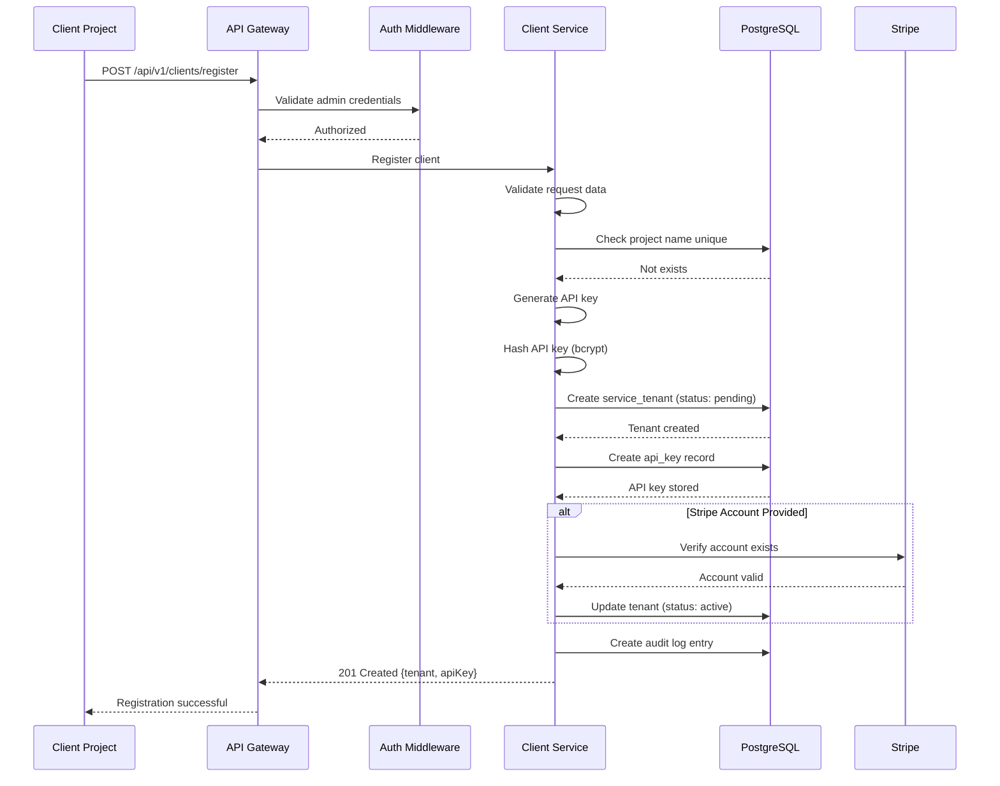

### Subscription Creation Flow

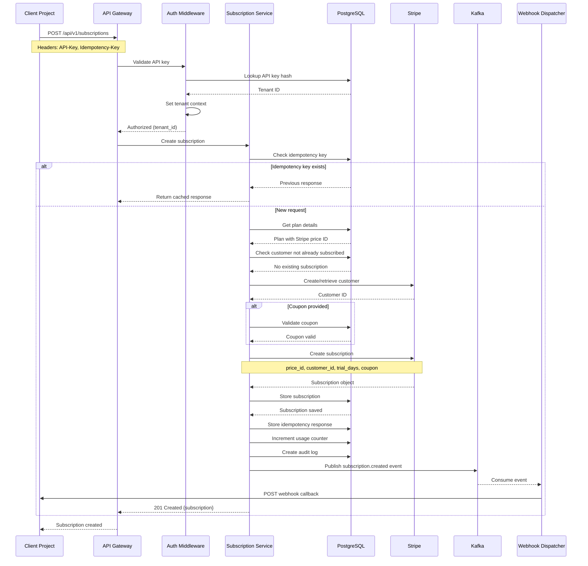

### Payment Processing Flow (Stripe Webhook)

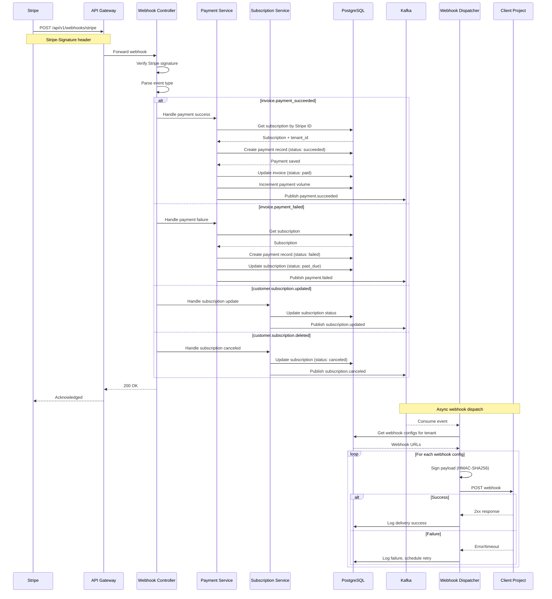

### Webhook Callback to Client Flow

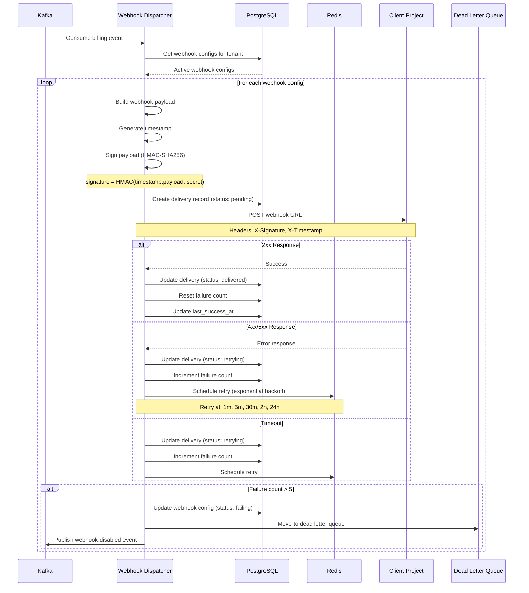

### Plan Change (Upgrade/Downgrade) Flow

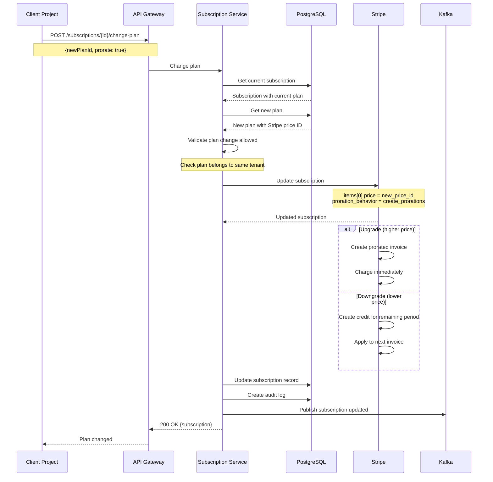

### API Key Rotation Flow

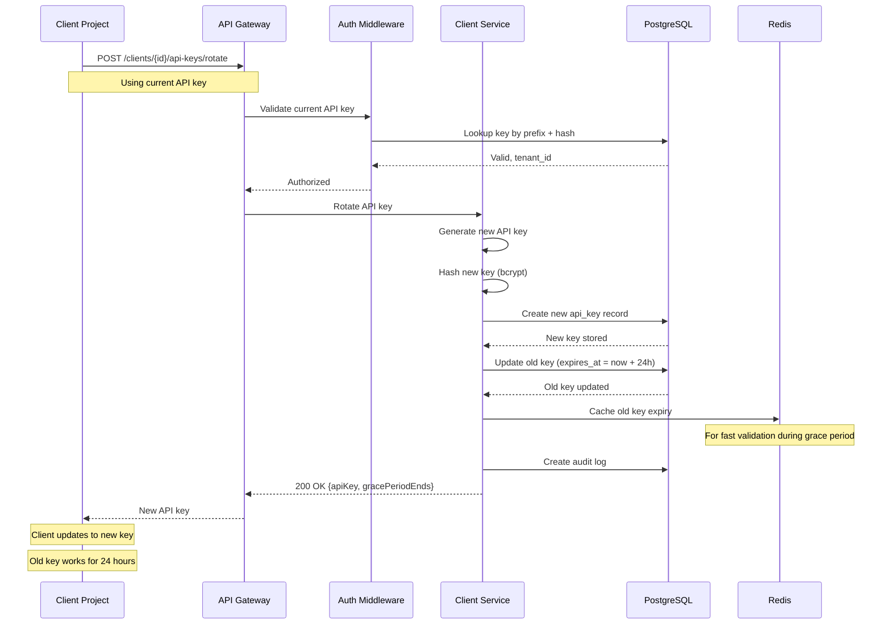

## Key Functions with Formal Specifications

### Function: createSubscription()

```java
@Transactional
public Subscription createSubscription(
        UUID tenantId,
        CreateSubscriptionRequest request)
```

**Preconditions:**
- `tenantId` is a valid UUID of an active service tenant
- `request.externalCustomerId()` is non-empty string
- `request.planId()` is a valid UUID of an active plan belonging to `tenantId`
- If `request.couponCode()` provided, coupon must be valid and applicable to the plan
- If `request.paymentMethodId()` provided, it must be a valid payment method
- No active subscription exists for `(tenantId, externalCustomerId)` pair

**Postconditions:**
- Returns a valid `Subscription` object with status 'TRIALING' or 'ACTIVE'
- Subscription record exists in database with `service_tenant_id = tenantId`
- Payment Service subscription created with matching `payment_service_customer_id`
- Payment Service customer created or retrieved
- If coupon applied, `coupon_id` is set and `redemption_count` incremented
- Usage counter `subscriptions_created` incremented for current period
- Audit log entry created with action 'subscription.created'
- `subscription.created` event published to message queue

**Loop Invariants:** N/A (no loops in main flow)

### Function: processPaymentServiceWebhook()

```java
@Transactional
public void processPaymentServiceWebhook(
        String signature,
        String payload)
```

**Preconditions:**
- `signature` is a valid Payment Service webhook signature header
- `payload` is the raw request body string
- Payment Service webhook signing secret is configured

**Postconditions:**
- If signature invalid: throws `WebhookSignatureException`
- If event type not handled: returns without side effects
- If `payment.succeeded`:
  - Payment record created with status 'SUCCEEDED'
  - Invoice status updated to 'PAID'
  - `payment.succeeded` event published
- If `payment.failed`:
  - Payment record created with status 'FAILED'
  - Subscription status updated to 'PAST_DUE'
  - `payment.failed` event published
- If `payment_method.attached`:
  - Subscription status updated with new payment method
  - `subscription.updated` event published
- All database operations are atomic (transaction)

**Loop Invariants:** N/A

### Function: dispatchWebhook()

```java
public List<WebhookDeliveryResult> dispatchWebhook(
        UUID tenantId,
        WebhookEvent event)
```

**Preconditions:**
- `tenantId` is a valid UUID of an existing service tenant
- `event.type()` is a valid `WebhookEventType`
- `event.payload()` is a valid JSON-serializable object

**Postconditions:**
- Returns list of `WebhookDeliveryResult` for each configured webhook
- For each active webhook config subscribed to `event.type()`:
  - Delivery record created in database
  - HTTP POST sent to webhook URL with signed payload
  - If 2xx response: delivery status = 'DELIVERED', failure_count reset
  - If error/timeout: delivery status = 'RETRYING', retry scheduled
  - If failure_count > MAX_RETRIES: webhook status = 'FAILING', event sent to DLQ
- Webhook signature computed as `HMAC-SHA256(timestamp.payload, secret)`
- All deliveries attempted regardless of individual failures

**Loop Invariants:**
- For each webhook config processed: delivery record exists in database
- Total deliveries attempted equals count of matching webhook configs

### Function: validateCoupon()

```java
public CouponValidation validateCoupon(
        UUID tenantId,
        String code,
        UUID planId)
```

**Preconditions:**
- `tenantId` is a valid UUID of an existing service tenant
- `code` is a non-empty string

**Postconditions:**
- Returns `CouponValidation` object with `valid: boolean`
- If coupon not found: `valid = false`, `errorCode = 'COUPON_NOT_FOUND'`
- If coupon expired: `valid = false`, `errorCode = 'COUPON_EXPIRED'`
- If coupon archived: `valid = false`, `errorCode = 'COUPON_ARCHIVED'`
- If max redemptions reached: `valid = false`, `errorCode = 'COUPON_EXHAUSTED'`
- If `planId` provided and coupon has `appliesToPlans`:
  - If plan not in list: `valid = false`, `errorCode = 'COUPON_NOT_APPLICABLE'`
- If all validations pass:
  - `valid = true`
  - `coupon` contains full coupon details
  - `discountAmount` calculated if `planId` provided

**Loop Invariants:** N/A

### Function: rotateApiKey()

```java
@Transactional
public RotateApiKeyResponse rotateApiKey(UUID tenantId)
```

**Preconditions:**
- `tenantId` is a valid UUID of an active service tenant
- At least one active API key exists for the tenant

**Postconditions:**
- Returns new API key (plaintext, shown only once) and grace period end time
- New API key record created with status 'ACTIVE'
- Old API key(s) updated with `expires_at = now + 24 hours`
- Both old and new keys valid during 24-hour grace period
- After grace period: old keys automatically invalidated
- Audit log entry created with action 'api_key.rotated'
- New key hash stored using BCrypt with cost factor >= 12

**Loop Invariants:** N/A

## Algorithmic Pseudocode

### Subscription Creation Algorithm

```java
ALGORITHM createSubscription(tenantId, request)
INPUT: tenantId: UUID, request: CreateSubscriptionRequest
OUTPUT: Subscription

BEGIN
  // Step 1: Validate idempotency
  IF request.idempotencyKey() EXISTS THEN
    cached ← idempotencyStore.get(tenantId, request.idempotencyKey())
    IF cached EXISTS THEN
      RETURN cached.response()
    END IF
  END IF

  // Step 2: Validate plan exists and is active
  plan ← planRepository.findById(tenantId, request.planId())
  ASSERT plan IS NOT NULL AND plan.status() = PlanStatus.ACTIVE

  // Step 3: Check no existing subscription
  existing ← subscriptionRepository.findByCustomer(tenantId, request.externalCustomerId())
  ASSERT existing IS NULL

  // Step 4: Validate coupon if provided
  coupon ← NULL
  IF request.couponCode() EXISTS THEN
    validation ← validateCoupon(tenantId, request.couponCode(), request.planId())
    ASSERT validation.valid() = TRUE
    coupon ← validation.coupon()
  END IF

  // Step 5: Create or retrieve Payment Service customer
  paymentCustomer ← paymentServiceClient.createCustomer(
    new CreateCustomerRequest(
      tenantId.toString(),
      request.externalCustomerId(),
      request.externalCustomerEmail(),
      null,
      Map.of("tenantId", tenantId, "externalCustomerId", request.externalCustomerId())
    )
  )

  // Step 6: Store subscription in database
  subscription ← subscriptionRepository.save(Subscription.builder()
    .serviceTenantId(tenantId)
    .externalCustomerId(request.externalCustomerId())
    .externalCustomerEmail(request.externalCustomerEmail())
    .planId(plan.id())
    .couponId(coupon?.id())
    .paymentServiceCustomerId(paymentCustomer.id())
    .status(SubscriptionStatus.INCOMPLETE)
    .metadata(request.metadata())
    .build()
  )

  // Step 7: Update coupon redemption count
  IF coupon EXISTS THEN
    couponRepository.incrementRedemption(coupon.id())
  END IF

  // Step 8: Track usage
  usageService.incrementCounter(tenantId, UsageMetric.SUBSCRIPTIONS_CREATED, 1)

  // Step 9: Store idempotency response
  IF request.idempotencyKey() EXISTS THEN
    idempotencyStore.set(tenantId, request.idempotencyKey(), subscription)
  END IF

  // Step 10: Publish event
  eventPublisher.publish(new BillingEvent(
    "subscription.created",
    tenantId,
    Map.of(
      "subscriptionId", subscription.id(),
      "customerId", request.externalCustomerId(),
      "planId", plan.id()
    )
  ))

  // Step 11: Create audit log
  auditLog.create(AuditLog.builder()
    .tenantId(tenantId)
    .action("subscription.created")
    .resourceType("subscription")
    .resourceId(subscription.id())
    .afterState(subscription)
    .build()
  )

  RETURN subscription
END
```

### Webhook Dispatch Algorithm

```java
ALGORITHM dispatchWebhook(tenantId, event)
INPUT: tenantId: UUID, event: WebhookEvent
OUTPUT: List<WebhookDeliveryResult>

BEGIN
  results ← new ArrayList<>()
  
  // Step 1: Get all active webhook configs for tenant
  configs ← webhookConfigRepository.findByTenant(tenantId)
  configs ← configs.stream()
    .filter(c -> c.status() = WebhookStatus.ACTIVE AND event.type() IN c.events())
    .collect(Collectors.toList())

  // Step 2: Process each webhook config
  FOR EACH config IN configs DO
    // Invariant: All previous configs have delivery records
    
    // Step 2.1: Build payload
    payload ← new WebhookPayload(
      UUID.randomUUID(),
      event.type(),
      Instant.now(),
      event.payload()
    )
    
    // Step 2.2: Generate signature
    timestamp ← Instant.now().getEpochSecond()
    signaturePayload ← timestamp + "." + objectMapper.writeValueAsString(payload)
    signature ← HmacUtils.hmacSha256Hex(config.secret(), signaturePayload)
    
    // Step 2.3: Create delivery record
    delivery ← webhookDeliveryRepository.save(WebhookDelivery.builder()
      .webhookConfigId(config.id())
      .eventType(event.type())
      .payload(payload)
      .status(DeliveryStatus.PENDING)
      .build()
    )
    
    // Step 2.4: Send HTTP request
    TRY
      response ← webClient.post()
        .uri(config.url())
        .header("Content-Type", "application/json")
        .header("X-Webhook-Signature", signature)
        .header("X-Webhook-Timestamp", timestamp.toString())
        .bodyValue(payload)
        .retrieve()
        .toEntity(String.class)
        .block(Duration.ofSeconds(30))
      
      IF response.statusCode().is2xxSuccessful() THEN
        // Success
        webhookDeliveryRepository.update(delivery.id(), DeliveryUpdate.builder()
          .status(DeliveryStatus.DELIVERED)
          .responseStatus(response.statusCode().value())
          .deliveredAt(Instant.now())
          .build()
        )
        webhookConfigRepository.update(config.id(), ConfigUpdate.builder()
          .failureCount(0)
          .lastSuccessAt(Instant.now())
          .build()
        )
        results.add(new WebhookDeliveryResult(config.id(), "delivered"))
      ELSE
        // HTTP error
        THROW new HttpException(response.statusCode(), response.body())
      END IF
      
    CATCH error
      // Handle failure
      newFailureCount ← config.failureCount() + 1
      
      IF newFailureCount > MAX_RETRIES THEN
        // Disable webhook
        webhookConfigRepository.update(config.id(), ConfigUpdate.builder()
          .status(WebhookStatus.FAILING)
          .failureCount(newFailureCount)
          .lastFailureAt(Instant.now())
          .lastFailureReason(error.message())
          .build()
        )
        webhookDeliveryRepository.update(delivery.id(), DeliveryUpdate.builder()
          .status(DeliveryStatus.FAILED)
          .responseStatus(error.status())
          .responseBody(error.message())
          .build()
        )
        deadLetterQueue.push(delivery)
      ELSE
        // Schedule retry with exponential backoff
        retryDelay ← Math.pow(2, newFailureCount) * 60 * 1000  // minutes to ms
        webhookDeliveryRepository.update(delivery.id(), DeliveryUpdate.builder()
          .status(DeliveryStatus.RETRYING)
          .attemptCount(delivery.attemptCount() + 1)
          .nextRetryAt(Instant.now().plusMillis(retryDelay))
          .build()
        )
        webhookConfigRepository.update(config.id(), ConfigUpdate.builder()
          .failureCount(newFailureCount)
          .lastFailureAt(Instant.now())
          .lastFailureReason(error.message())
          .build()
        )
      END IF
      
      results.add(new WebhookDeliveryResult(config.id(), "failed", error.message()))
    END TRY
  END FOR
  
  RETURN results
END
```

### API Key Validation Algorithm

```java
ALGORITHM validateApiKey(apiKeyHeader)
INPUT: apiKeyHeader: String (format: "prefix_secretpart")
OUTPUT: ApiKeyValidationResult { valid: boolean, tenantId?: UUID, error?: String }

BEGIN
  // Step 1: Parse API key format
  parts ← apiKeyHeader.split("_")
  IF parts.length < 2 THEN
    RETURN new ApiKeyValidationResult(false, null, "INVALID_KEY_FORMAT")
  END IF
  
  prefix ← parts[0]
  secretPart ← String.join("_", Arrays.copyOfRange(parts, 1, parts.length))
  
  // Step 2: Check cache first
  cacheKey ← "apikey:" + prefix
  cached ← redisTemplate.opsForValue().get(cacheKey)
  IF cached EXISTS AND cached.status() = ApiKeyStatus.REVOKED THEN
    RETURN new ApiKeyValidationResult(false, null, "KEY_REVOKED")
  END IF
  
  // Step 3: Lookup key by prefix
  apiKeys ← apiKeyRepository.findByPrefix(prefix)
  IF apiKeys.isEmpty() THEN
    RETURN new ApiKeyValidationResult(false, null, "KEY_NOT_FOUND")
  END IF
  
  // Step 4: Verify hash for each matching key
  FOR EACH key IN apiKeys DO
    IF passwordEncoder.matches(secretPart, key.keyHash()) THEN
      // Step 5: Check key status
      IF key.status() = ApiKeyStatus.REVOKED THEN
        redisTemplate.opsForValue().set(cacheKey, 
          Map.of("status", "revoked"), 
          Duration.ofHours(1))
        RETURN new ApiKeyValidationResult(false, null, "KEY_REVOKED")
      END IF
      
      IF key.status() = ApiKeyStatus.EXPIRED OR 
         (key.expiresAt() EXISTS AND key.expiresAt().isBefore(Instant.now())) THEN
        RETURN new ApiKeyValidationResult(false, null, "KEY_EXPIRED")
      END IF
      
      // Step 6: Check tenant status
      tenant ← serviceTenantRepository.findById(key.serviceTenantId())
        .orElseThrow()
      IF tenant.status() = TenantStatus.SUSPENDED THEN
        RETURN new ApiKeyValidationResult(false, null, "TENANT_SUSPENDED")
      END IF
      IF tenant.status() != TenantStatus.ACTIVE THEN
        RETURN new ApiKeyValidationResult(false, null, "TENANT_INACTIVE")
      END IF
      
      // Step 7: Update last used timestamp (async)
      CompletableFuture.runAsync(() -> 
        apiKeyRepository.updateLastUsed(key.id(), Instant.now())
      )
      
      RETURN new ApiKeyValidationResult(true, key.serviceTenantId(), null)
    END IF
  END FOR
  
  RETURN new ApiKeyValidationResult(false, null, "INVALID_KEY")
END
```


## Error Handling

### Error Scenario 1: Stripe API Failure

**Condition**: Stripe API returns error during subscription creation or payment processing

**Response**:
- Log full error details with correlation ID
- Map Stripe error codes to service error codes
- Return appropriate HTTP status (502 for Stripe errors)
- Include Stripe error message in response for debugging

**Recovery**:
- Idempotency keys ensure safe retry
- Client can retry with same idempotency key
- No partial state left in database (transaction rollback)

### Error Scenario 2: Webhook Delivery Failure

**Condition**: Client webhook endpoint returns error or times out

**Response**:
- Log delivery attempt with response details
- Update delivery record with failure status
- Increment webhook config failure count

**Recovery**:
- Exponential backoff retry: 1m, 5m, 30m, 2h, 24h
- After 5 failures, mark webhook as 'failing'
- Move to dead letter queue for manual review
- Alert client via email about failing webhook

### Error Scenario 3: Duplicate Subscription Attempt

**Condition**: Client attempts to create subscription for customer who already has one

**Response**:
- Return HTTP 409 Conflict
- Include existing subscription ID in error response
- Log attempt for audit purposes

**Recovery**:
- Client should use existing subscription
- Or cancel existing before creating new one

### Error Scenario 4: Invalid Coupon Application

**Condition**: Coupon code is invalid, expired, or not applicable to plan

**Response**:
- Return HTTP 422 Unprocessable Entity
- Include specific error code (COUPON_EXPIRED, COUPON_NOT_APPLICABLE, etc.)
- Include validation details in response

**Recovery**:
- Client can retry without coupon
- Or use a different valid coupon code

### Error Scenario 5: Rate Limit Exceeded

**Condition**: Client exceeds configured rate limit

**Response**:
- Return HTTP 429 Too Many Requests
- Include `Retry-After` header with seconds to wait
- Include `X-RateLimit-Remaining` and `X-RateLimit-Reset` headers

**Recovery**:
- Client implements exponential backoff
- Client can request rate limit increase
- Usage tracked for billing purposes

### Error Scenario 6: Payment Method Failure

**Condition**: Customer's payment method is declined or invalid

**Response**:
- Create payment record with status 'failed'
- Update subscription status to 'past_due'
- Publish `payment.failed` event to client

**Recovery**:
- Stripe automatic retry (3 attempts over 7 days)
- Client notifies customer to update payment method
- Client can trigger manual retry via API

## Testing Strategy

### Unit Testing Approach

**Coverage Goals**: 90% line coverage, 85% branch coverage

**Key Test Cases**:
- Service layer business logic
- Validation functions
- Coupon discount calculations
- Webhook signature generation/verification
- API key hashing and validation
- Error mapping and handling

**Mocking Strategy (Interface-Based)**:
- **Service Interfaces**: Mock service interfaces (e.g., `PaymentServiceClient`, `SubscriptionService`) using Mockito
- **Repository Interfaces**: Mock repository interfaces using Mockito (Spring Data JPA repositories are already interfaces)
- **Payment Service Client**: Mock `PaymentServiceClient` interface instead of HTTP calls for fast unit tests
- **Event Publisher**: Mock `EventPublisher` interface to verify event publishing without actual Kafka
- **Redis Cache**: Use embedded Redis or mock cache operations
- **Benefits**: Interface-based mocking is fast, doesn't require test infrastructure, and tests business logic in isolation

**Example Unit Test with Interface Mocking**:
```java
package com.billing.service.impl;

import com.billing.service.SubscriptionService;
import com.billing.integration.paymentservice.PaymentServiceClient;
import com.billing.integration.paymentservice.dto.*;

@ExtendWith(MockitoExtension.class)
class SubscriptionServiceImplTest {
    @Mock
    private SubscriptionRepository subscriptionRepository;
    
    @Mock
    private PaymentServiceClient paymentServiceClient;
    
    @Mock
    private EventPublisher eventPublisher;
    
    @InjectMocks
    private SubscriptionServiceImpl subscriptionService;
    
    @Test
    void createSubscription_shouldCreateCustomerInPaymentService() {
        // Given
        CreateSubscriptionRequest request = new CreateSubscriptionRequest(...);
        CustomerResponse mockCustomer = new CustomerResponse(...);
        when(paymentServiceClient.createCustomer(any())).thenReturn(mockCustomer);
        
        // When
        SubscriptionWithSetupUrl result = subscriptionService.create(tenantId, request);
        
        // Then
        verify(paymentServiceClient).createCustomer(any(CreateCustomerRequest.class));
        assertThat(result.subscription().getPaymentServiceCustomerId())
            .isEqualTo(mockCustomer.id());
    }
}
```

**Controller Testing with Service Interface Mocking**:
```java
package com.billing.controller;

import com.billing.service.SubscriptionService;  // Import interface, not implementation

@WebMvcTest(SubscriptionController.class)
class SubscriptionControllerTest {
    @Autowired
    private MockMvc mockMvc;
    
    @MockBean  // Spring Boot's @MockBean for controller tests
    private SubscriptionService subscriptionService;
    
    @Test
    void createSubscription_shouldReturn201() throws Exception {
        // Given
        SubscriptionResponse mockResponse = new SubscriptionResponse(...);
        when(subscriptionService.create(any(), any())).thenReturn(
            new SubscriptionWithSetupUrl(mockResponse, "https://setup.url", "message")
        );
        
        // When & Then
        mockMvc.perform(post("/api/v1/subscriptions")
                .contentType(MediaType.APPLICATION_JSON)
                .content("""
                    {
                        "externalCustomerId": "cust_123",
                        "planId": "plan_uuid"
                    }
                    """))
            .andExpect(status().isCreated())
            .andExpect(jsonPath("$.id").exists());
    }
}
```

**Testing Framework**: JUnit 5 + Mockito + AssertJ

### Property-Based Testing Approach

**Property Test Library**: jqwik (Java QuickCheck)

**Properties to Test**:

1. **Coupon Discount Calculation**
   - For any valid coupon and plan price, discount never exceeds original price
   - Percent discount always results in value between 0 and original price
   - Fixed discount capped at plan price

2. **API Key Generation**
   - Generated keys always match expected format (prefix_secret)
   - Hash verification always succeeds for correct key
   - Hash verification always fails for incorrect key

3. **Webhook Signature**
   - Signature verification succeeds for unmodified payload
   - Signature verification fails for any payload modification
   - Signature verification fails for incorrect secret

4. **Idempotency**
   - Same idempotency key always returns same response
   - Different idempotency keys can create different resources

### Integration Testing Approach

**Test Environment**:
- Docker Compose with PostgreSQL, Redis, Kafka
- Payment Service test mode with test API keys
- Testcontainers for isolated test database per test suite

**Key Integration Tests**:
- Full subscription lifecycle (create, update, cancel)
- Payment Service webhook processing
- Webhook dispatch to mock endpoints
- API key rotation with grace period
- Rate limiting behavior
- Multi-tenant isolation

**Testing Framework**: Spring Boot Test + Testcontainers + REST Assured

### End-to-End Testing

**Scenarios**:
1. Client registration → API key → create plan → create subscription → payment
2. Subscription upgrade/downgrade with proration
3. Failed payment → retry → success
4. Webhook delivery with retries
5. API key rotation during active usage

## Dependency Injection Patterns

### Constructor Injection (Preferred)

**Why Constructor Injection:**
- **Immutability**: Dependencies are final fields, cannot be changed after construction
- **Testability**: Easy to instantiate service with mock dependencies in tests
- **Explicit Dependencies**: All required dependencies visible in constructor signature
- **Null Safety**: Dependencies cannot be null (constructor fails if any dependency missing)
- **Spring Best Practice**: Recommended by Spring Framework team

**Example:**
```java
package com.billing.service.impl;

import com.billing.service.SubscriptionService;
import com.billing.integration.paymentservice.PaymentServiceClient;

@Service
@Transactional
public class SubscriptionServiceImpl implements SubscriptionService {
    private final SubscriptionRepository subscriptionRepository;
    private final PaymentServiceClient paymentServiceClient;
    private final EventPublisher eventPublisher;
    
    // Constructor injection - @Autowired optional for single constructor
    public SubscriptionServiceImpl(
            SubscriptionRepository subscriptionRepository,
            PaymentServiceClient paymentServiceClient,
            EventPublisher eventPublisher) {
        this.subscriptionRepository = subscriptionRepository;
        this.paymentServiceClient = paymentServiceClient;
        this.eventPublisher = eventPublisher;
    }
    
    @Override
    public SubscriptionResponse create(UUID tenantId, CreateSubscriptionRequest request) {
        // All dependencies are guaranteed non-null and immutable
    }
}
```

### Field Injection (Avoid)

**Why Avoid Field Injection:**
- **Mutability**: Fields can be changed after construction
- **Testing Difficulty**: Requires reflection or Spring context to inject mocks
- **Hidden Dependencies**: Not clear what dependencies are required
- **Null Possibility**: Fields can be null if not properly injected

**Anti-Pattern Example (Don't Do This):**
```java
@Service
public class SubscriptionServiceImpl implements SubscriptionService {
    @Autowired  // Avoid field injection
    private SubscriptionRepository subscriptionRepository;
    
    @Autowired
    private PaymentServiceClient paymentServiceClient;
    
    // Hard to test - requires Spring context or reflection
}
```

### Setter Injection (Rare Use Cases)

**When to Use Setter Injection:**
- Optional dependencies (rare in production code)
- Reconfigurable dependencies (very rare)

**Example:**
```java
@Service
public class NotificationService {
    private EmailProvider emailProvider;
    
    @Autowired(required = false)  // Optional dependency
    public void setEmailProvider(EmailProvider emailProvider) {
        this.emailProvider = emailProvider;
    }
}
```

### Circular Dependency Resolution

**Problem**: Service A depends on Service B, Service B depends on Service A

**Solution 1: Refactor** (Preferred)
- Extract common logic into a third service
- Use events instead of direct calls

**Solution 2: Lazy Injection** (If refactoring not possible)
```java
@Service
public class ServiceA {
    private final ServiceB serviceB;
    
    public ServiceA(@Lazy ServiceB serviceB) {
        this.serviceB = serviceB;
    }
}
```

### Interface Injection Pattern

**Pattern**: Always inject interface types, never concrete implementations

**Correct:**
```java
package com.billing.controller;

import com.billing.service.SubscriptionService;  // Import interface from parent package

@RestController
public class SubscriptionController {
    private final SubscriptionService subscriptionService;  // Interface type
    
    public SubscriptionController(SubscriptionService subscriptionService) {
        this.subscriptionService = subscriptionService;
    }
}
```

**Incorrect:**
```java
package com.billing.controller;

import com.billing.service.impl.SubscriptionServiceImpl;  // ❌ NEVER import from impl/

@RestController
public class SubscriptionController {
    private final SubscriptionServiceImpl subscriptionService;  // Concrete type - DON'T DO THIS
    
    public SubscriptionController(SubscriptionServiceImpl subscriptionService) {
        this.subscriptionService = subscriptionService;
    }
}
```

### Repository Injection

**Spring Data JPA repositories are already interfaces:**
```java
public interface SubscriptionRepository extends JpaRepository<Subscription, UUID> {
    Optional<Subscription> findByServiceTenantIdAndExternalCustomerId(
        UUID serviceTenantId, String externalCustomerId);
}

// Inject repository interface directly
@Service
public class SubscriptionServiceImpl implements SubscriptionService {
    private final SubscriptionRepository subscriptionRepository;
    
    public SubscriptionServiceImpl(SubscriptionRepository subscriptionRepository) {
        this.subscriptionRepository = subscriptionRepository;
    }
}
```

## Non-Functional Requirements

### Performance SLOs

| Metric | Target | Measurement |
|--------|--------|-------------|
| API Response Time (p50) | < 100ms | Excluding Stripe calls |
| API Response Time (p95) | < 300ms | Excluding Stripe calls |
| API Response Time (p99) | < 1000ms | Including Stripe calls |
| Webhook Delivery (p95) | < 5s | From event to delivery |
| Stripe Webhook Processing | < 500ms | Acknowledge receipt |
| Database Query Time (p95) | < 50ms | Single table queries |
| Cache Hit Rate | > 95% | For API key validation |

### Scalability Requirements

- **Horizontal Scaling**: Stateless application servers behind load balancer
- **Database**: Read replicas for reporting queries, connection pooling
- **Message Queue**: Partitioned by tenant for parallel processing
- **Rate Limiting**: Distributed rate limiting via Redis
- **Target Load**: 10,000 API requests/minute per tenant
- **Target Tenants**: Support 1,000+ client projects

### Availability Requirements

- **Uptime SLA**: 99.9% (8.76 hours downtime/year)
- **RTO (Recovery Time Objective)**: 4 hours
- **RPO (Recovery Point Objective)**: 1 hour
- **Deployment**: Multi-AZ with automatic failover
- **Database**: Streaming replication with automatic failover
- **Health Checks**: Every 30 seconds with 3 failure threshold

### Security Requirements

1. **Authentication**
   - API keys hashed with bcrypt (cost factor 12)
   - Keys transmitted only over HTTPS
   - Key rotation with 24-hour grace period

2. **Authorization**
   - Row-level security for tenant isolation
   - Tenant ID validated on every request
   - Cross-tenant access attempts logged and alerted

3. **Data Protection**
   - All data encrypted at rest (AES-256)
   - All data encrypted in transit (TLS 1.3)
   - PCI DSS compliance for payment data (via Stripe)
   - No raw card numbers stored

4. **Audit Logging**
   - All API calls logged with correlation ID
   - All data modifications logged with before/after state
   - Logs retained for 2 years
   - Logs encrypted and tamper-evident

5. **Webhook Security**
   - HMAC-SHA256 signatures on all outbound webhooks
   - Timestamp included to prevent replay attacks
   - Signature verification required for Stripe webhooks

### Compliance Requirements

- **PCI DSS**: Level 1 compliance via Stripe (no card data stored)
- **SOC 2 Type II**: Audit logging, access controls, encryption
- **GDPR**: Data export, deletion on request, consent tracking
- **Data Residency**: Configurable per tenant (US, EU regions)

## Dependencies

### External Services

| Service | Purpose | Criticality |
|---------|---------|-------------|
| Payment Service | Payment processing, customer management | Critical |
| PostgreSQL | Primary data store | Critical |
| Redis | Caching, rate limiting, job queues | High |
| Kafka/SQS | Event streaming, async processing | High |

### Internal Dependencies (Maven/Gradle)

| Dependency | Version | Purpose |
|------------|---------|---------|
| Spring Boot | 3.2.x | Framework |
| Java | 17+ | Runtime |
| Spring Boot Starter Web | 3.2.x | REST API |
| Spring Boot Starter Data JPA | 3.2.x | ORM |
| Spring Boot Starter Security | 3.2.x | Security |
| Spring Boot Starter Validation | 3.2.x | Bean validation |
| Spring Data Redis | 3.2.x | Redis integration |
| Spring Kafka | 3.1.x | Kafka integration |
| PostgreSQL Driver | 42.7.x | Database driver |
| Flyway | 10.x | Database migrations |
| Lombok | 1.18.x | Boilerplate reduction |
| MapStruct | 1.5.x | Object mapping |
| Micrometer | 1.12.x | Metrics (Prometheus) |
| SpringDoc OpenAPI | 2.3.x | API documentation |
| BCrypt | (via Spring Security) | Password hashing |
| Jackson | (via Spring Boot) | JSON serialization |
| WebClient | (via Spring WebFlux) | HTTP client |
| JUnit 5 | 5.10.x | Testing framework |
| Mockito | 5.x | Mocking |
| AssertJ | 3.25.x | Fluent assertions |
| Testcontainers | 1.19.x | Integration testing |
| REST Assured | 5.4.x | API testing |
| jqwik | 1.8.x | Property-based testing |

### Infrastructure

- **Container Runtime**: Docker
- **Orchestration**: Kubernetes (EKS/GKE)
- **Load Balancer**: AWS ALB / GCP Load Balancer
- **CDN**: CloudFront (optional, for static assets)
- **Monitoring**: Prometheus + Grafana
- **Logging**: ELK Stack / CloudWatch
- **Secrets**: AWS Secrets Manager / HashiCorp Vault
- **Build Tool**: Maven or Gradle

## Correctness Properties

### Property 1: Tenant Isolation

```
∀ tenant1, tenant2 ∈ ServiceTenants, tenant1.id ≠ tenant2.id:
  ∀ subscription ∈ Subscriptions:
    subscription.service_tenant_id = tenant1.id ⟹
      subscription NOT accessible via tenant2's API key
```

### Property 2: Subscription Uniqueness

```
∀ tenant ∈ ServiceTenants:
  ∀ customer_id ∈ ExternalCustomerIds:
    |{ s ∈ Subscriptions | s.service_tenant_id = tenant.id ∧ 
       s.external_customer_id = customer_id ∧ 
       s.status ∈ ['active', 'trialing', 'past_due'] }| ≤ 1
```

### Property 3: Idempotency

```
∀ request r with idempotency_key k:
  LET response1 = process(r, k)
  LET response2 = process(r, k)
  response1 = response2 ∧ side_effects_count = 1
```

### Property 4: Webhook Signature Validity

```
∀ webhook_payload p, secret s:
  LET signature = HMAC_SHA256(timestamp + '.' + p, s)
  verify(signature, timestamp + '.' + p, s) = true ∧
  verify(signature, timestamp + '.' + modified(p), s) = false
```

### Property 5: Coupon Discount Bounds

```
∀ coupon c, plan p:
  IF c.discount_type = 'percent' THEN
    discount(c, p) = p.price_cents * c.discount_value / 100
    0 ≤ discount(c, p) ≤ p.price_cents
  ELSE IF c.discount_type = 'fixed' THEN
    discount(c, p) = MIN(c.discount_value, p.price_cents)
    0 ≤ discount(c, p) ≤ p.price_cents
```

### Property 6: API Key Security

```
∀ api_key k:
  k.plaintext shown exactly once (at creation/rotation) ∧
  stored_hash = bcrypt(k.plaintext, cost=12) ∧
  bcrypt.verify(k.plaintext, stored_hash) = true ∧
  ∀ other ≠ k.plaintext: bcrypt.verify(other, stored_hash) = false
```

### Property 7: Payment Consistency

```
∀ invoice i:
  i.status = 'paid' ⟹
    ∃ payment p: p.invoice_id = i.id ∧ p.status = 'succeeded' ∧
    p.amount_cents = i.amount_due_cents
```

### Property 8: Webhook Retry Bounds

```
∀ webhook_delivery d:
  d.attempt_count ≤ MAX_RETRIES + 1 ∧
  (d.attempt_count > MAX_RETRIES ⟹ d.status ∈ ['failed', 'delivered'])
```
