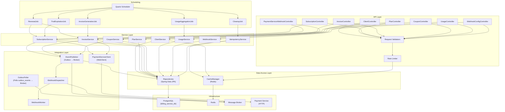
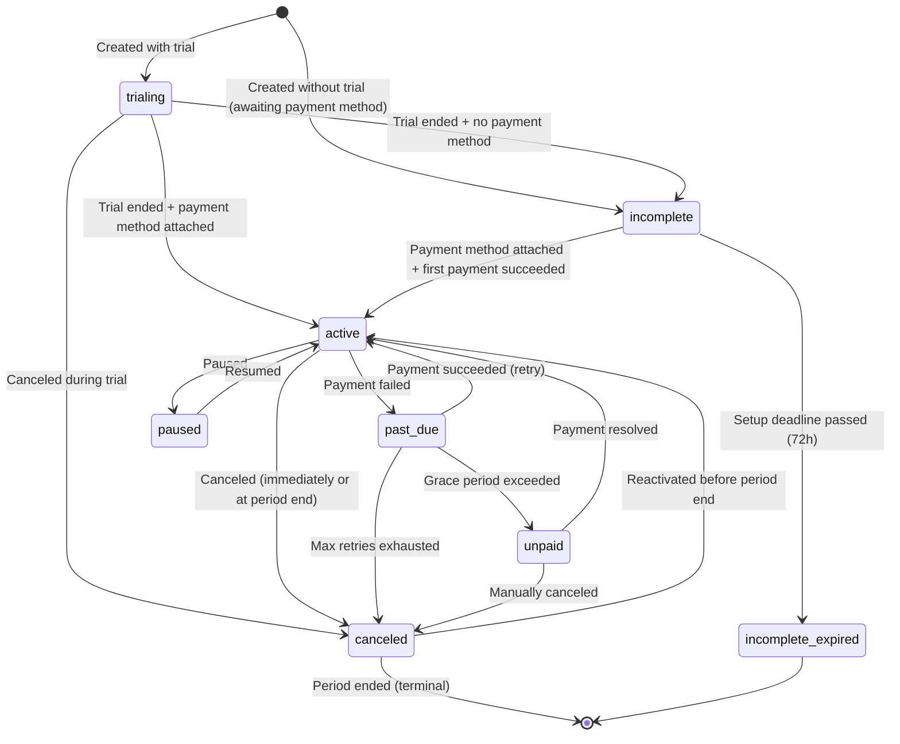
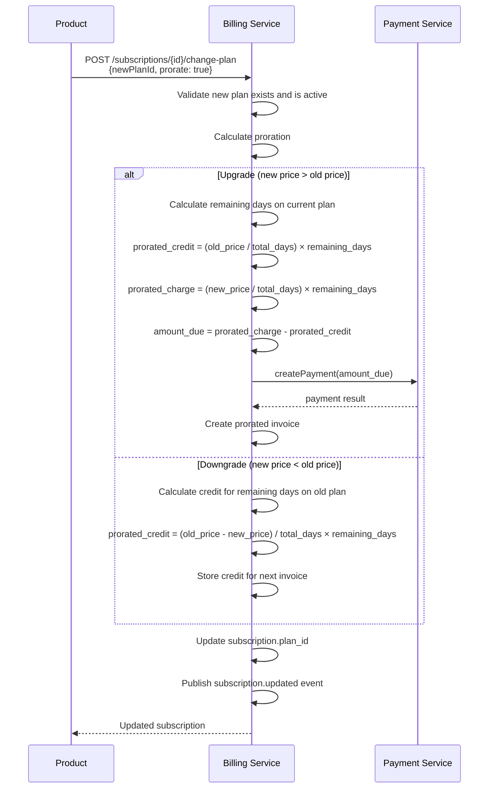
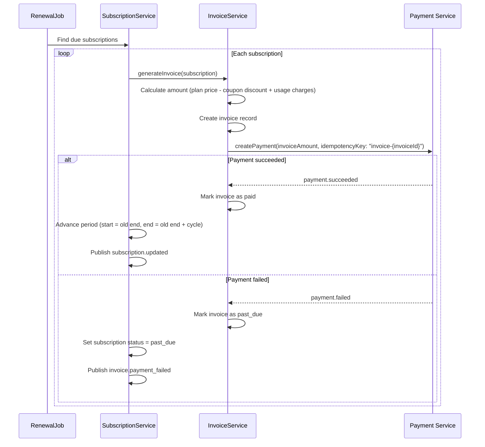

# Billing Service — Architecture Design

## 1. Overview

The Billing Service manages the **subscription billing lifecycle** for all Enviro product lines. It is a **client of the Payment Service** — it orchestrates subscription plans, subscriptions, coupons, invoicing, and usage metering, delegating actual payment execution to the Payment Service via REST API calls.

**Key responsibilities:**
- Subscription plan management (CRUD, versioning, archiving)
- Subscription lifecycle (create, cancel, reactivate, upgrade/downgrade, pause, resume)
- Coupon and discount management
- Invoice generation, payment, voiding, PDF URLs
- Trial period management (trialing → active transitions)
- Proration for mid-cycle plan changes
- Usage metering and billing analytics
- API key lifecycle (rotation, grace period, revocation)
- Outgoing webhook dispatch to client endpoints

**What it does NOT do:**
- Process payments directly (delegates to Payment Service)
- Store card/bank details or interact with payment providers
- Manage provider adapters or provider webhooks

---

## 2. Internal Architecture

The Billing Service follows a **modular monolith** architecture. Internally it has tightly coupled bounded contexts (plans → subscriptions → invoices → coupons) that benefit from shared transactions and in-process communication.

### Layered Architecture



### Package Structure

```
com.enviro.billing/
├── api/
│   ├── controller/
│   │   ├── ClientController.java
│   │   ├── PlanController.java
│   │   ├── SubscriptionController.java
│   │   ├── InvoiceController.java
│   │   ├── CouponController.java
│   │   ├── UsageController.java
│   │   ├── WebhookConfigController.java
│   │   └── PaymentServiceWebhookController.java
│   ├── dto/
│   │   ├── request/
│   │   └── response/
│   ├── mapper/              # MapStruct mappers
│   └── validation/          # Custom validators
├── domain/
│   ├── model/
│   │   ├── ServiceTenant.java
│   │   ├── ApiKey.java
│   │   ├── SubscriptionPlan.java
│   │   ├── Subscription.java
│   │   ├── Invoice.java
│   │   ├── Coupon.java
│   │   ├── WebhookConfig.java
│   │   ├── WebhookDelivery.java
│   │   ├── BillingUsage.java
│   │   ├── AuditLog.java
│   │   └── IdempotencyKey.java
│   ├── enums/
│   │   ├── SubscriptionStatus.java
│   │   ├── InvoiceStatus.java
│   │   ├── CouponDiscountType.java
│   │   ├── CouponDuration.java
│   │   ├── BillingCycle.java
│   │   ├── TenantStatus.java
│   │   └── ApiKeyStatus.java
│   └── event/
├── service/
│   ├── ClientService.java
│   ├── PlanService.java
│   ├── SubscriptionService.java
│   ├── InvoiceService.java
│   ├── CouponService.java
│   ├── UsageService.java
│   ├── WebhookService.java
│   ├── IdempotencyService.java
│   └── impl/                # All implementations
    ├── integration/
    │   ├── payment/
    │   │   ├── PaymentServiceClient.java       # Interface
    │   │   ├── PaymentServiceClientImpl.java   # WebClient implementation
    │   │   ├── PaymentServiceErrorHandler.java # Circuit breaker + retry
    │   │   └── dto/                            # Payment Service DTOs
    │   ├── messaging/
    │   │   ├── EventPublisher.java
    │   │   ├── PaymentEventConsumer.java       # Consumes payment.events
    │   │   └── DlqHandler.java
    │   ├── outbox/
    │   │   ├── OutboxEvent.java                # Entity: id, aggregate_type, aggregate_id, event_type, payload, created_at, published_at
    │   │   ├── OutboxRepository.java           # Spring Data JPA repository
    │   │   └── OutboxPoller.java               # @Scheduled poller: SELECT unpublished → publish to message broker → mark published
    │   └── webhook/
│       ├── WebhookDispatcher.java
│       ├── WebhookWorker.java
│       └── WebhookSigner.java
├── scheduler/
│   ├── RenewalJob.java
│   ├── InvoiceGenerationJob.java
│   ├── TrialExpirationJob.java
│   ├── UsageAggregationJob.java
│   └── CleanupJob.java
├── repository/
├── config/
│   ├── DatabaseConfig.java
│   ├── RedisConfig.java
│   ├── MessagingConfig.java
│   ├── SecurityConfig.java
│   ├── QuartzConfig.java
│   └── PaymentServiceConfig.java
├── security/
│   ├── ApiKeyAuthenticationFilter.java
│   ├── TenantContext.java
│   └── RateLimitFilter.java
├── exception/
│   ├── GlobalExceptionHandler.java
│   ├── BillingException.java
│   ├── PlanNotFoundException.java
│   ├── SubscriptionNotFoundException.java
│   ├── CouponNotFoundException.java
│   ├── InvalidCouponException.java
│   ├── PaymentServiceException.java
│   └── ServiceUnavailableException.java
└── util/
    ├── CryptoUtil.java
    ├── ProrationCalculator.java
    └── InvoiceNumberGenerator.java
```

---

## 3. Service Components

### 3.1 ClientService (Tenant Management)

Manages client project registration and API key lifecycle.

**Operations:**

| Operation | Description |
|-----------|-------------|
| `registerClient` | Create `service_tenant` + generate first API key. Returns plaintext key once. |
| `rotateApiKey` | Generate new key, old key expires in 24h (grace period). Both valid during grace. |
| `revokeApiKey` | Immediately invalidate a specific API key. |
| `listApiKeys` | List all API keys for a tenant (shows prefix, status, last_used_at). |

**API Key Validation Algorithm:**
1. Parse key format (`prefix_secretpart`)
2. Check Redis for revoked status
3. Look up by prefix in `api_keys` table
4. BCrypt verify against stored `key_hash`
5. Check key status (`revoked` → reject, `expired` → reject)
6. Check tenant status (`suspended` → reject)
7. Update `last_used_at` asynchronously (`CompletableFuture.runAsync`)
8. Return `{valid, tenantId}`

### 3.2 PlanService (Subscription Plan CRUD)

Manages subscription plan definitions.

**Operations:**

| Operation | Description |
|-----------|-------------|
| `createPlan` | Create a new plan (name, billingCycle, priceCents, currency, features, limits, trialDays) |
| `getPlan` | Get plan by ID |
| `listPlans` | List plans with status filter and pagination |
| `updatePlan` | Update limited fields: name, description, features, limits, status, sortOrder. **Price and billing cycle are immutable.** |
| `archivePlan` | Soft-delete by setting status to `archived`. Existing subscriptions continue. |

**Plan status lifecycle:**
- `draft` → `active` → `archived`
- Archived plans are hidden from new subscriptions but existing ones continue
- To change pricing: create a new plan, archive the old one

**Versioning approach:** Immutable pricing fields mean a new plan is required for price changes. The old plan is archived. This is simpler than explicit versioning columns and avoids ambiguity about which subscribers see which price.

### 3.3 SubscriptionService

Core subscription lifecycle management.

**Operations:**

| Operation | Description |
|-----------|-------------|
| `createSubscription` | Create subscription + call Payment Service to create customer + return payment setup URL |
| `getSubscription` | Get by ID or external customer ID |
| `listSubscriptions` | Filter by status, planId, customerId, date range; paginated |
| `updateSubscription` | Update metadata, cancelAtPeriodEnd |
| `cancelSubscription` | Cancel immediately or at period end, with reason |
| `reactivateSubscription` | Reactivate a canceled subscription before period ends |
| `changePlan` | Upgrade/downgrade with optional proration |
| `pauseSubscription` | Pause billing (subscription stays active but no charges) |
| `resumeSubscription` | Resume billing from paused state |
| `applyCoupon` | Apply coupon code to existing subscription |

**Pause duration limit:**
Paused subscriptions have a configurable maximum pause duration (default: **90 days**). A scheduled check within the `RenewalJob` identifies subscriptions that have been paused longer than the configured limit and automatically transitions them to `canceled` status with reason `auto_canceled_max_pause_exceeded`. Tenants are notified via the `subscription.canceled` webhook event.

**Subscription creation flow:**
```
1. Validate plan exists and is active
2. Check for existing active subscription for this customer (unique constraint)
3. If couponCode provided → validate coupon
4. Call PaymentServiceClient.createCustomer() → get customerId + paymentSetupUrl
5. Create subscription record (status: TRIALING if trial, else INCOMPLETE)
6. Store payment_service_customer_id
7. If coupon → increment redemption_count
8. Publish subscription.created event
9. Return subscription + paymentSetupUrl
```

**Subscription status state machine:**



### 3.4 InvoiceService

Generates and manages invoices.

**Operations:**

| Operation | Description |
|-----------|-------------|
| `generateInvoice` | Create invoice for a subscription period (called by scheduler) |
| `getInvoice` | Get by ID |
| `listInvoices` | Filter by subscriptionId, status, date range; paginated |
| `getUpcomingInvoice` | Preview next invoice with line items and coupon discount |
| `processPayment` | Call Payment Service to charge the invoice amount |
| `voidInvoice` | Mark as void (cannot be paid) |
| `markUncollectible` | Mark as uncollectible (payment attempts exhausted) |

**Invoice generation logic:**
1. Calculate base amount from plan `price_cents`
2. Apply coupon discount (if active):
   - `percent`: `discount = price_cents × discount_value / 100` (bounded `[0, price_cents]`)
   - `fixed`: `discount = MIN(discount_value, price_cents)` (bounded `[0, price_cents]`)
3. Check coupon duration (`once` → first invoice only, `repeating` → count months, `forever` → always)
4. Calculate usage charges (if usage-based billing)
5. Set `amount_cents`, `amount_due_cents`, `due_date` (period_end + configurable grace days)
6. Set `invoice_number` (e.g., `INV-2026-001`)
7. Generate `invoice_pdf_url` and `hosted_invoice_url`
8. Publish `invoice.created` event

**Invoice status lifecycle:**
- `draft` → `open` → `paid` / `void` / `uncollectible`

### 3.5 CouponService

Manages coupons and discount validation.

**Operations:**

| Operation | Description |
|-----------|-------------|
| `createCoupon` | Create coupon with code, discount type/value, duration, scoping, limits |
| `getCoupon` | Get by ID |
| `listCoupons` | Filter by status, paginated |
| `validateCoupon` | Validate a coupon code against an optional planId |
| `archiveCoupon` | Soft-delete (existing applied coupons continue to work) |

**Validation logic (`validateCoupon`):**
1. Coupon not found → `COUPON_NOT_FOUND`
2. Status = `expired` → `COUPON_EXPIRED`
3. Status = `archived` → `COUPON_ARCHIVED`
4. `valid_until` passed → `COUPON_EXPIRED`
5. `redemption_count >= max_redemptions` → `COUPON_EXHAUSTED`
6. If planId provided and `applies_to_plans` is set → plan must be in list → `COUPON_NOT_APPLICABLE`
7. All pass → return `{valid: true, coupon, discountAmount}`

**Discount bounds (formal property):**
```
∀ coupon, plan:
    if coupon.discount_type = 'percent':
        discount = plan.price_cents × coupon.discount_value / 100
        0 ≤ discount ≤ plan.price_cents
    if coupon.discount_type = 'fixed':
        discount = MIN(coupon.discount_value, plan.price_cents)
        0 ≤ discount ≤ plan.price_cents
```

### 3.6 UsageService

Tracks usage metrics and billing analytics.

**Operations:**

| Operation | Description |
|-----------|-------------|
| `getCurrentPeriod` | Get current period stats for a tenant |
| `getByPeriod` | Get historical stats for a date range |
| `generateReport` | Detailed report with daily breakdown and estimated cost |
| `incrementCounter` | Atomically increment a usage metric (called throughout the system) |

**Metrics tracked:**
- `subscriptions_created`, `subscriptions_canceled`
- `payments_processed`, `payments_failed`
- `total_payment_volume_cents`
- `invoices_generated`
- `webhook_calls`, `api_calls`

**Counter increment points:**
- Subscription created → `SUBSCRIPTIONS_CREATED`
- Subscription canceled → `SUBSCRIPTIONS_CANCELED`
- Payment succeeded → `PAYMENTS_PROCESSED` + `TOTAL_PAYMENT_VOLUME_CENTS`
- Payment failed → `PAYMENTS_FAILED`
- Invoice generated → `INVOICES_GENERATED`
- Webhook dispatched → `WEBHOOK_CALLS`
- API request received → `API_CALLS` (via filter)

### 3.7 WebhookService

Manages outgoing webhook configurations and dispatches events to registered endpoints.

Identical architecture to the Payment Service webhook system (see `docs/shared/system-architecture.md` Section 6).

**Billing Service webhook event types:**
- `subscription.created`, `subscription.updated`, `subscription.canceled`, `subscription.trial_ending`
- `invoice.created`, `invoice.paid`, `invoice.payment_failed`, `invoice.payment_requires_action`

---

## 4. Payment Service Integration

### PaymentServiceClient Interface

```java
public interface PaymentServiceClient {

    // Customer management
    CustomerResponse createCustomer(CreateCustomerRequest request);
    CustomerResponse getCustomer(String customerId);
    CustomerResponse updateCustomer(String customerId, UpdateCustomerRequest request);

    // Payment processing
    PaymentResponse createPayment(CreatePaymentRequest request);
    PaymentResponse getPayment(String paymentId);
    List<PaymentResponse> listPayments(String customerId);

    // Payment methods
    List<PaymentMethodResponse> listPaymentMethods(String customerId);
    PaymentMethodResponse setDefaultPaymentMethod(String methodId, String customerId);

    // Refunds
    RefundResponse createRefund(String paymentId, CreateRefundRequest request);
    RefundResponse getRefund(String refundId);
}
```

### Implementation

```java
@Component
public class PaymentServiceClientImpl implements PaymentServiceClient {

    private final WebClient webClient;
    private final PaymentServiceConfig config;

    public PaymentServiceClientImpl(WebClient.Builder builder,
                                     PaymentServiceConfig config) {
        this.webClient = builder
            .baseUrl(config.getBaseUrl())
            .defaultHeader("X-API-Key", config.getApiKey())
            .defaultHeader("Content-Type", "application/json")
            .build();
        this.config = config;
    }

    @Override
    public PaymentResponse createPayment(CreatePaymentRequest request) {
        return webClient.post()
            .uri("/api/v1/payments")
            .header("Idempotency-Key", request.getIdempotencyKey())
            .bodyValue(request)
            .retrieve()
            .onStatus(HttpStatusCode::isError, this::handleError)
            .bodyToMono(PaymentResponse.class)
            .timeout(config.getTimeout())
            .block();
    }

    // ... other methods follow same pattern
}
```

### Error Handling (Circuit Breaker)

```java
@Component
public class PaymentServiceErrorHandler {

    @CircuitBreaker(name = "paymentService", fallbackMethod = "fallback")
    @Retry(name = "paymentService")
    public <T> T executeWithResilience(Supplier<T> operation) {
        return operation.get();
    }

    // Resilience4j configuration
    // circuitBreaker:
    //   failureRateThreshold: 50
    //   waitDurationInOpenState: 30s
    //   slidingWindowSize: 10
    // retry:
    //   maxAttempts: 3
    //   waitDuration: 1s
    //   exponentialBackoffMultiplier: 2
}
```

### Inbound Webhook Handler

The Billing Service receives Payment Service events at `POST /api/v1/webhooks/payment-service`:

```java
@RestController
public class PaymentServiceWebhookController {

    @PostMapping("/api/v1/webhooks/payment-service")
    public ResponseEntity<Void> handlePaymentWebhook(
            @RequestBody String payload,
            @RequestHeader("X-Webhook-Signature") String signature) {

        // 1. Verify HMAC-SHA256 signature
        // 2. Parse event type
        // 3. Route to handler:
        //    - payment.succeeded → invoiceService.markPaid(...)
        //    - payment.failed → invoiceService.markFailed(...)
        //    - payment.requires_action → notify customer
        //    - payment_method.attached → subscriptionService.activate(...)
        //    - refund.succeeded → apply proration credit
        // 4. Publish billing event to clients
        // 5. Increment usage counters
    }
}
```

### Dual-Event Deduplication (Message Broker + HTTP Webhook)

The Billing Service receives Payment Service events through **two paths**:

1. **Message broker** — `PaymentEventConsumer` subscribes to the `payment.events` topic
2. **HTTP Webhook** — `PaymentServiceWebhookController` receives `POST /api/v1/webhooks/payment-service`

Both paths may deliver the same event (e.g., `payment.succeeded` for the same payment). To prevent double-processing:

**Deduplication strategy:**
- Deduplicate by composite key: `(payment_service_payment_id, event_type)`
- Whichever path delivers the event first processes it normally
- The second delivery detects the event has already been processed (idempotent check) and skips processing
- Detection: before processing, check if the invoice/subscription already reflects the event (e.g., invoice `status = paid` means `payment.succeeded` was already handled)

**Why both paths?**
- **The message broker** provides lower latency and is the primary event channel
- **HTTP webhook** provides a redundant delivery path in case the event consumer is lagging or the Billing Service was restarted and hasn't caught up with the topic
- Together they provide **at-least-once delivery** with idempotent processing

> **Note:** Both the `PaymentEventConsumer` and `PaymentServiceWebhookController` delegate to the same service methods (e.g., `invoiceService.markPaid`), which are themselves idempotent — calling `markPaid` on an already-paid invoice is a no-op.

---

## 5. Proration Logic

### Plan Change (Upgrade / Downgrade)

When a subscriber changes plans mid-cycle:



### Proration Calculation

```java
public class ProrationCalculator {

    public ProrationResult calculate(Subscription subscription,
                                      SubscriptionPlan oldPlan,
                                      SubscriptionPlan newPlan,
                                      LocalDate changeDate) {
        long totalDays = ChronoUnit.DAYS.between(
            subscription.getCurrentPeriodStart(),
            subscription.getCurrentPeriodEnd());
        long remainingDays = ChronoUnit.DAYS.between(
            changeDate,
            subscription.getCurrentPeriodEnd());

        BigDecimal oldDailyRate = BigDecimal.valueOf(oldPlan.getPriceCents())
            .divide(BigDecimal.valueOf(totalDays), 4, RoundingMode.HALF_UP);
        BigDecimal newDailyRate = BigDecimal.valueOf(newPlan.getPriceCents())
            .divide(BigDecimal.valueOf(totalDays), 4, RoundingMode.HALF_UP);

        BigDecimal credit = oldDailyRate.multiply(BigDecimal.valueOf(remainingDays));
        BigDecimal charge = newDailyRate.multiply(BigDecimal.valueOf(remainingDays));

        return new ProrationResult(credit, charge, charge.subtract(credit));
    }
}
```

### Proration Credit Tracking

Downgrade credits are stored in `subscription.metadata` (JSONB) under the key `proration_credit`. When the next invoice is generated, any accumulated credit is deducted from the invoice amount before payment.

**Current approach (v1):** JSONB field on the subscription record. This keeps the schema simple and avoids a separate table for a feature with relatively low cardinality.

**Future consideration (v2):** If credit tracking becomes more complex (e.g., partial credit usage, credit expiry, cross-subscription credits, or credit top-ups), a formal `credits` table will be introduced with proper ledger-style entries (debit/credit amounts, expiry dates, and an immutable audit trail).

---

## 6. Scheduled Jobs

| Job | Schedule | Description |
|-----|----------|-------------|
| `RenewalJob` | Every hour | Find subscriptions where `current_period_end < now()` and status = `active`. Generate invoice and attempt payment. |
| `InvoiceGenerationJob` | Daily at 00:00 UTC | Generate draft invoices for upcoming renewal periods. |
| `TrialExpirationJob` | Every hour | Find subscriptions where `trial_end < now()` and status = `trialing`. Transition to `active` or `incomplete`. Publish `subscription.trial_ending` event 3 days before. |
| `UsageAggregationJob` | Daily at 01:00 UTC | Aggregate daily usage metrics into `billing_usage` table. |
| `CleanupJob` | Daily at 03:00 UTC | Delete expired idempotency keys, old webhook deliveries, etc. |

### Renewal Flow



---

## 7. Event Architecture

### 7.1 Transactional Outbox Pattern

The Billing Service uses the **transactional outbox pattern** to guarantee at-least-once event delivery to the message broker. Instead of publishing events directly after a domain change, the service inserts an `outbox_event` row into the `outbox_events` table **within the same database transaction** as the domain state change.

**Flow:**
1. Service method performs domain change (e.g., `UPDATE subscription SET status = 'canceled'`)
2. In the same transaction: `INSERT INTO outbox_events (aggregate_type, aggregate_id, event_type, payload)`
3. Transaction commits — both the domain change and the outbox event are persisted atomically
4. The `OutboxPoller` (a `@Scheduled` component running every 500ms) queries for unpublished outbox events
5. For each event: publish to the appropriate topic, then mark `published_at = NOW()`
6. If the message broker is temporarily unavailable, the event remains in the outbox and is retried on the next poll cycle

**Why this matters:**
- Without the outbox, a domain change could commit but the event publish could fail (e.g., broker down), resulting in lost events
- With the outbox, events are guaranteed to be published as long as the database is available
- The worst case is **duplicate delivery** (event published but `published_at` not yet updated before a crash), which consumers handle via idempotent processing

**Outbox table definition:** See [Database Schema Design](./database-schema-design.md).

### Event Topics

| Topic | Producer | Consumer | Partitions | Key |
|-------|----------|----------|------------|-----|
| `subscription.events` | SubscriptionService | WebhookDispatcher | 12 | `tenant_id` |
| `invoice.events` | InvoiceService | WebhookDispatcher | 6 | `tenant_id` |
| `billing.events` | Various | Internal processing | 6 | `tenant_id` |
| `payment.events` | Payment Service | PaymentEventConsumer | 12 | `tenant_id` |
| `billing.events.dlq` | DLQ handler | Ops tooling | 3 | `original_key` |
| `payment.events.billing.dlq` | DLQ handler | Ops tooling | 3 | `original_key` |

### Billing Service Event Types

> **Note:** All events listed below are persisted to the `outbox_events` table within the same transaction as the domain change. The `OutboxPoller` publishes them to the corresponding topic asynchronously.

| Event Type | Trigger |
|-----------|---------|
| `subscription.created` | New subscription created |
| `subscription.updated` | Plan change, metadata update, period advance |
| `subscription.canceled` | Subscription canceled |
| `subscription.trial_ending` | 3 days before trial end |
| `invoice.created` | New invoice generated |
| `invoice.paid` | Invoice payment succeeded |
| `invoice.payment_failed` | Invoice payment failed |
| `invoice.payment_requires_action` | 3DS required for invoice payment |

---

## 8. Security Architecture

### API Key Authentication

The Billing Service uses a more sophisticated API key model than the Payment Service:

| Feature | Payment Service | Billing Service |
|---------|----------------|-----------------|
| Key format | Simple api_key + api_secret | `prefix_secretpart` (e.g., `bk_abc123_longSecret`) |
| Multiple keys per tenant | No (single key) | Yes (via `api_keys` table) |
| Key rotation grace period | 24h (admin operation) | 24h (self-service) |
| Key revocation | Admin only | Self-service per key |
| Last used tracking | No | Yes (`last_used_at`) |
| Key prefix for logs | No | Yes (`key_prefix`) |

### Rate Limiting

Redis-based sliding window:
- Default: 500 requests/minute per tenant (configurable via `rate_limit_per_minute`)
- Tenant-specific overrides stored in `service_tenants.rate_limit_per_minute`
- Same response headers as Payment Service

---

## 9. Error Handling

### Error Response Format

```json
{
  "error": {
    "code": "SUBSCRIPTION_NOT_FOUND",
    "message": "Subscription with ID sub_abc123 not found",
    "details": {},
    "requestId": "req_xyz789",
    "timestamp": "2026-03-25T10:30:00Z"
  }
}
```

### Error Codes

| Code | HTTP | Description |
|------|------|-------------|
| `INVALID_API_KEY` | 401 | API key not found or invalid |
| `RATE_LIMIT_EXCEEDED` | 429 | Too many requests |
| `TENANT_SUSPENDED` | 403 | Tenant account is suspended |
| `PLAN_NOT_FOUND` | 404 | Plan ID not found |
| `SUBSCRIPTION_NOT_FOUND` | 404 | Subscription ID not found |
| `INVOICE_NOT_FOUND` | 404 | Invoice ID not found |
| `COUPON_NOT_FOUND` | 404 | Coupon code not found |
| `CUSTOMER_ALREADY_SUBSCRIBED` | 409 | Customer already has active subscription for this tenant |
| `INVALID_COUPON` | 422 | Coupon is expired, archived, or exhausted |
| `COUPON_NOT_APPLICABLE` | 422 | Coupon does not apply to the selected plan |
| `INVALID_SUBSCRIPTION_STATE` | 422 | Operation not valid for current subscription status |
| `PAYMENT_FAILED` | 422 | Payment Service returned a payment failure |
| `PAYMENT_SERVICE_ERROR` | 502 | Payment Service returned an error |
| `PAYMENT_SERVICE_UNAVAILABLE` | 503 | Payment Service is unreachable |
| `VALIDATION_ERROR` | 400 | Request validation failed |

---

## 10. Configuration

### Application Properties

```yaml
server:
  port: 8081
  compression:
    enabled: true

spring:
  application:
    name: billing-service
  datasource:
    url: ${DATABASE_URL:jdbc:postgresql://localhost:5432/billing_service_db}
    username: ${DATABASE_USERNAME:billing_service}
    password: ${DATABASE_PASSWORD}
    hikari:
      maximum-pool-size: 20
      minimum-idle: 5
      connection-timeout: 30000
  jpa:
    hibernate:
      ddl-auto: validate
  flyway:
    enabled: true
    locations: classpath:db/migration
  data:
    redis:
      host: ${REDIS_HOST:localhost}
      port: ${REDIS_PORT:6379}
      password: ${REDIS_PASSWORD:}
      timeout: 2000ms
  # Message broker configuration (broker-specific settings go here)
  # Example connection: ${BROKER_CONNECTION:localhost:9092}
  # Producer: acks=all, retries=3
  # Consumer: group-id=billing-service, auto-offset-reset=earliest

# Payment Service integration
payment-service:
  base-url: ${PAYMENT_SERVICE_URL:http://localhost:8080}
  api-key: ${PAYMENT_SERVICE_API_KEY}
  webhook-secret: ${PAYMENT_SERVICE_WEBHOOK_SECRET}
  timeout: 30s
  retry-attempts: 3
  retry-delay: 1s

management:
  endpoints:
    web:
      exposure:
        include: health, info, metrics, prometheus
  endpoint:
    health:
      show-details: when_authorized
      probes:
        enabled: true

logging:
  level:
    com.enviro.billing: INFO
    org.hibernate.SQL: DEBUG
```

---

## 11. Testing Strategy

### Test Pyramid

| Level | Scope | Tools | Coverage Target |
|-------|-------|-------|-----------------|
| **Unit** | Services, proration calculator, coupon validation | JUnit 5, Mockito, AssertJ | 90% line / 85% branch |
| **Property-based** | Coupon discount bounds, proration calculations, idempotency, key generation | jqwik | Key invariants |
| **Integration** | Repositories, controllers, messaging, Payment Service client | Testcontainers (PostgreSQL, Redis, message broker), WireMock (Payment Service), MockMvc | All endpoints |
| **E2E** | Full subscription lifecycle (register → plan → subscribe → pay → renew → cancel) | Testcontainers + REST Assured | Happy path + error paths |

### Key Property-Based Tests

```java
@Property
void couponDiscountNeverExceedsPlanPrice(
        @ForAll @IntRange(min = 1, max = 100) int discountPercent,
        @ForAll @IntRange(min = 1, max = 999999) int priceCents) {
    int discount = priceCents * discountPercent / 100;
    assertThat(discount).isBetween(0, priceCents);
}

@Property
void prorationCreditPlusChargeEqualsFullPeriodDifference(
        @ForAll @IntRange(min = 100, max = 99999) int oldPrice,
        @ForAll @IntRange(min = 100, max = 99999) int newPrice,
        @ForAll @IntRange(min = 1, max = 365) int totalDays,
        @ForAll @IntRange(min = 1) int remainingDays) {
    Assume.that(remainingDays <= totalDays);
    // credit + (newCharge - credit) ≈ proportional new price
}
```
