# Billing Service — Flow Diagrams

| Field       | Value              |
|-------------|--------------------|
| **Version** | 1.0                |
| **Date**    | 2026-03-25         |
| **Status**  | Draft              |

---

## Table of Contents

1. [Subscription Creation (With Trial)](#1-subscription-creation-with-trial)
2. [Subscription Creation (Without Trial)](#2-subscription-creation-without-trial)
3. [Subscription Renewal (Automated)](#3-subscription-renewal-automated)
4. [Trial Expiration Handling](#4-trial-expiration-handling)
5. [Plan Change (Upgrade/Downgrade with Proration)](#5-plan-change-upgradedowngrade-with-proration)
6. [Coupon Application and Invoice Discounting](#6-coupon-application-and-invoice-discounting)
7. [Invoice Generation and Payment](#7-invoice-generation-and-payment)
8. [Subscription Cancellation Flows](#8-subscription-cancellation-flows)
9. [Subscription Pause and Resume](#9-subscription-pause-and-resume)
10. [Payment Failure and Retry (Dunning)](#10-payment-failure-and-retry-dunning)
11. [API Key Rotation (Grace Period)](#11-api-key-rotation-grace-period)
12. [Billing Service Webhook Dispatch](#12-billing-service-webhook-dispatch)
13. [Payment Service Event Consumption](#13-payment-service-event-consumption)
14. [Subscription Status State Machine](#14-subscription-status-state-machine)
15. [Invoice Status State Machine](#15-invoice-status-state-machine)

---

## 1. Subscription Creation (With Trial)

New subscription for a customer on a plan that has `trial_days > 0`. The subscription starts in `trialing` status — no payment is collected until the trial ends.

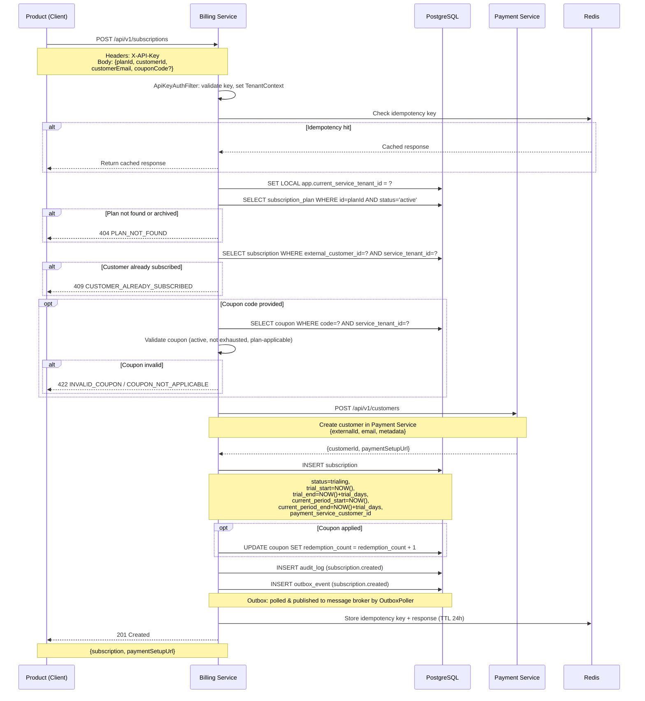
```mermaid
sequenceDiagram
    participant Product as Product (Client)
    participant BS as Billing Service
    participant DB as PostgreSQL
    participant PS as Payment Service
    participant Redis

    Product->>BS: POST /api/v1/subscriptions
    Note over Product,BS: Headers: X-API-Key<br/>Body: {planId, customerId,<br/>customerEmail, couponCode?}

    BS->>BS: ApiKeyAuthFilter: validate key, set TenantContext
    BS->>Redis: Check idempotency key
    alt Idempotency hit
        Redis-->>BS: Cached response
        BS-->>Product: Return cached response
    end

    BS->>DB: SET LOCAL app.current_service_tenant_id = ?
    BS->>DB: SELECT subscription_plan WHERE id=planId AND status='active'

    alt Plan not found or archived
        BS-->>Product: 404 PLAN_NOT_FOUND
    end

    BS->>DB: SELECT subscription WHERE external_customer_id=? AND service_tenant_id=?
    alt Customer already subscribed
        BS-->>Product: 409 CUSTOMER_ALREADY_SUBSCRIBED
    end

    opt Coupon code provided
        BS->>DB: SELECT coupon WHERE code=? AND service_tenant_id=?
        BS->>BS: Validate coupon (active, not exhausted, plan-applicable)
        alt Coupon invalid
            BS-->>Product: 422 INVALID_COUPON / COUPON_NOT_APPLICABLE
        end
    end

    BS->>PS: POST /api/v1/customers
    Note over BS,PS: Create customer in Payment Service<br/>{externalId, email, metadata}
    PS-->>BS: {customerId, paymentSetupUrl}

    BS->>DB: INSERT subscription
    Note over BS,DB: status=trialing,<br/>trial_start=NOW(),<br/>trial_end=NOW()+trial_days,<br/>current_period_start=NOW(),<br/>current_period_end=NOW()+trial_days,<br/>payment_service_customer_id

    opt Coupon applied
        BS->>DB: UPDATE coupon SET redemption_count = redemption_count + 1
    end

    BS->>DB: INSERT audit_log (subscription.created)
    BS->>DB: INSERT outbox_event (subscription.created)
    Note over BS,DB: Outbox: polled & published to message broker by OutboxPoller
    BS->>Redis: Store idempotency key + response (TTL 24h)
    BS-->>Product: 201 Created
    Note over BS,Product: {subscription, paymentSetupUrl}
```

---

## 2. Subscription Creation (Without Trial)

When the plan has `trial_days = 0`, the subscription starts in `incomplete` status, awaiting a payment method and first successful charge.

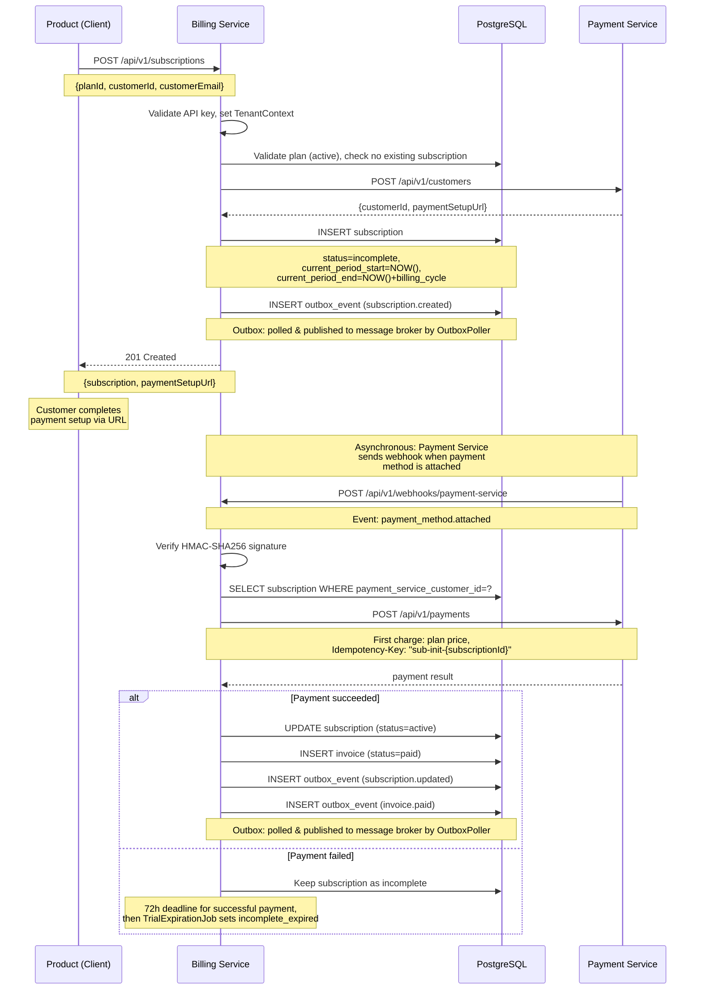
```mermaid
sequenceDiagram
    participant Product as Product (Client)
    participant BS as Billing Service
    participant DB as PostgreSQL
    participant PS as Payment Service

    Product->>BS: POST /api/v1/subscriptions
    Note over Product,BS: {planId, customerId, customerEmail}

    BS->>BS: Validate API key, set TenantContext
    BS->>DB: Validate plan (active), check no existing subscription

    BS->>PS: POST /api/v1/customers
    PS-->>BS: {customerId, paymentSetupUrl}

    BS->>DB: INSERT subscription
    Note over BS,DB: status=incomplete,<br/>current_period_start=NOW(),<br/>current_period_end=NOW()+billing_cycle

    BS->>DB: INSERT outbox_event (subscription.created)
    Note over BS,DB: Outbox: polled & published to message broker by OutboxPoller
    BS-->>Product: 201 Created
    Note over BS,Product: {subscription, paymentSetupUrl}

    Note over Product: Customer completes<br/>payment setup via URL

    Note over PS,BS: Asynchronous: Payment Service<br/>sends webhook when payment<br/>method is attached

    PS->>BS: POST /api/v1/webhooks/payment-service
    Note over PS,BS: Event: payment_method.attached

    BS->>BS: Verify HMAC-SHA256 signature
    BS->>DB: SELECT subscription WHERE payment_service_customer_id=?

    BS->>PS: POST /api/v1/payments
    Note over BS,PS: First charge: plan price,<br/>Idempotency-Key: "sub-init-{subscriptionId}"
    PS-->>BS: payment result

    alt Payment succeeded
        BS->>DB: UPDATE subscription (status=active)
        BS->>DB: INSERT invoice (status=paid)
        BS->>DB: INSERT outbox_event (subscription.updated)
        BS->>DB: INSERT outbox_event (invoice.paid)
        Note over BS,DB: Outbox: polled & published to message broker by OutboxPoller
    else Payment failed
        BS->>DB: Keep subscription as incomplete
        Note over BS: 72h deadline for successful payment,<br/>then TrialExpirationJob sets incomplete_expired
    end
```

---

## 3. Subscription Renewal (Automated)

The `RenewalJob` runs every hour, finding active subscriptions whose current period has ended. It generates an invoice and attempts payment through the Payment Service.

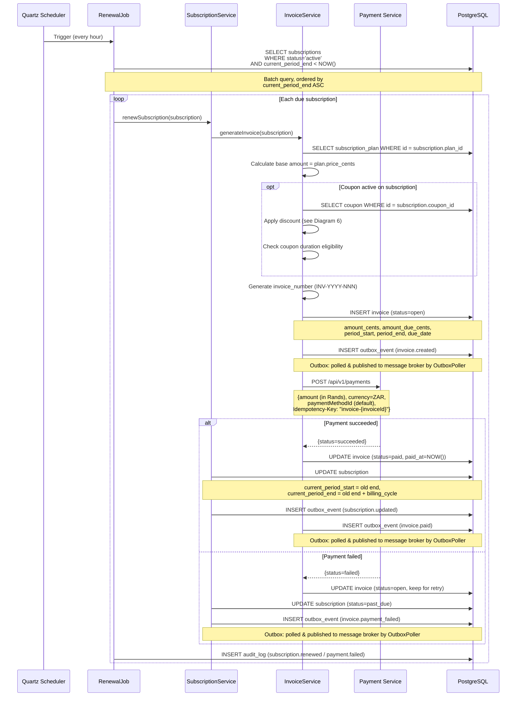
```mermaid
sequenceDiagram
    participant QZ as Quartz Scheduler
    participant RJ as RenewalJob
    participant SS as SubscriptionService
    participant IS as InvoiceService
    participant PS as Payment Service
    participant DB as PostgreSQL

    QZ->>RJ: Trigger (every hour)

    RJ->>DB: SELECT subscriptions<br/>WHERE status='active'<br/>AND current_period_end < NOW()
    Note over RJ,DB: Batch query, ordered by<br/>current_period_end ASC

    loop Each due subscription
        RJ->>SS: renewSubscription(subscription)

        SS->>IS: generateInvoice(subscription)
        IS->>DB: SELECT subscription_plan WHERE id = subscription.plan_id
        IS->>IS: Calculate base amount = plan.price_cents

        opt Coupon active on subscription
            IS->>DB: SELECT coupon WHERE id = subscription.coupon_id
            IS->>IS: Apply discount (see Diagram 6)
            IS->>IS: Check coupon duration eligibility
        end

        IS->>IS: Generate invoice_number (INV-YYYY-NNN)
        IS->>DB: INSERT invoice (status=open)
        Note over IS,DB: amount_cents, amount_due_cents,<br/>period_start, period_end, due_date

        IS->>DB: INSERT outbox_event (invoice.created)
        Note over IS,DB: Outbox: polled & published to message broker by OutboxPoller

        IS->>PS: POST /api/v1/payments
        Note over IS,PS: {amount (in Rands), currency=ZAR,<br/>paymentMethodId (default),<br/>Idempotency-Key: "invoice-{invoiceId}"}

        alt Payment succeeded
            PS-->>IS: {status=succeeded}
            IS->>DB: UPDATE invoice (status=paid, paid_at=NOW())
            SS->>DB: UPDATE subscription
            Note over SS,DB: current_period_start = old end,<br/>current_period_end = old end + billing_cycle
            SS->>DB: INSERT outbox_event (subscription.updated)
            IS->>DB: INSERT outbox_event (invoice.paid)
            Note over IS,DB: Outbox: polled & published to message broker by OutboxPoller

        else Payment failed
            PS-->>IS: {status=failed}
            IS->>DB: UPDATE invoice (status=open, keep for retry)
            SS->>DB: UPDATE subscription (status=past_due)
            SS->>DB: INSERT outbox_event (invoice.payment_failed)
            Note over SS,DB: Outbox: polled & published to message broker by OutboxPoller
        end

        RJ->>DB: INSERT audit_log (subscription.renewed / payment.failed)
    end
```

---

## 4. Trial Expiration Handling

The `TrialExpirationJob` runs every hour, managing trial-to-active transitions and sending pre-expiry notifications.

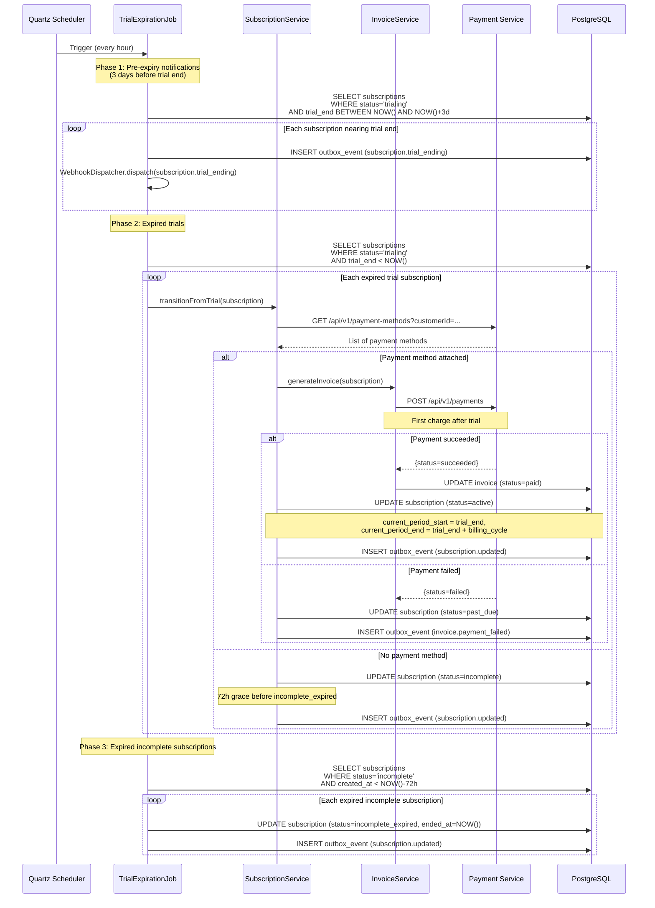
```mermaid
sequenceDiagram
    participant QZ as Quartz Scheduler
    participant TJ as TrialExpirationJob
    participant SS as SubscriptionService
    participant IS as InvoiceService
    participant PS as Payment Service
    participant DB as PostgreSQL

    QZ->>TJ: Trigger (every hour)

    Note over TJ: Phase 1: Pre-expiry notifications<br/>(3 days before trial end)
    TJ->>DB: SELECT subscriptions<br/>WHERE status='trialing'<br/>AND trial_end BETWEEN NOW() AND NOW()+3d

    loop Each subscription nearing trial end
        TJ->>DB: INSERT outbox_event (subscription.trial_ending)
        TJ->>TJ: WebhookDispatcher.dispatch(subscription.trial_ending)
    end

    Note over TJ: Phase 2: Expired trials
    TJ->>DB: SELECT subscriptions<br/>WHERE status='trialing'<br/>AND trial_end < NOW()

    loop Each expired trial subscription
        TJ->>SS: transitionFromTrial(subscription)

        SS->>PS: GET /api/v1/payment-methods?customerId=...
        PS-->>SS: List of payment methods

        alt Payment method attached
            SS->>IS: generateInvoice(subscription)
            IS->>PS: POST /api/v1/payments
            Note over IS,PS: First charge after trial

            alt Payment succeeded
                PS-->>IS: {status=succeeded}
                IS->>DB: UPDATE invoice (status=paid)
                SS->>DB: UPDATE subscription (status=active)
                Note over SS,DB: current_period_start = trial_end,<br/>current_period_end = trial_end + billing_cycle
                SS->>DB: INSERT outbox_event (subscription.updated)
            else Payment failed
                PS-->>IS: {status=failed}
                SS->>DB: UPDATE subscription (status=past_due)
                SS->>DB: INSERT outbox_event (invoice.payment_failed)
            end

        else No payment method
            SS->>DB: UPDATE subscription (status=incomplete)
            Note over SS: 72h grace before incomplete_expired
            SS->>DB: INSERT outbox_event (subscription.updated)
        end
    end

    Note over TJ: Phase 3: Expired incomplete subscriptions
    TJ->>DB: SELECT subscriptions<br/>WHERE status='incomplete'<br/>AND created_at < NOW()-72h

    loop Each expired incomplete subscription
        TJ->>DB: UPDATE subscription (status=incomplete_expired, ended_at=NOW())
        TJ->>DB: INSERT outbox_event (subscription.updated)
    end
```

---

## 5. Plan Change (Upgrade/Downgrade with Proration)

When a subscriber changes plans mid-cycle, the Billing Service calculates proration and either charges the difference (upgrade) or credits it (downgrade).

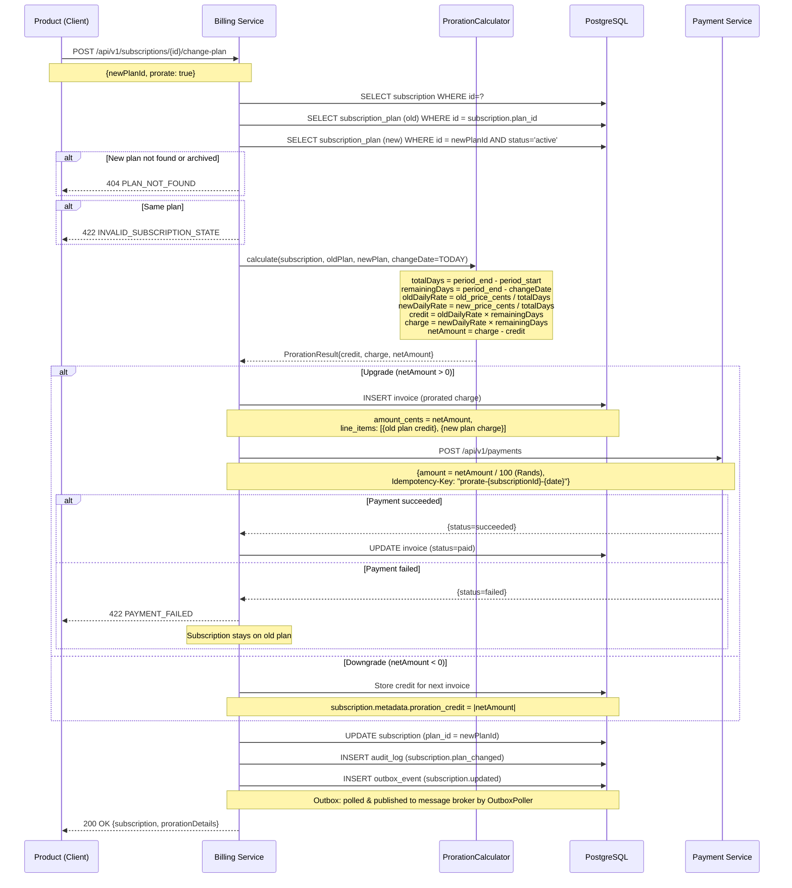
```mermaid
sequenceDiagram
    participant Product as Product (Client)
    participant BS as Billing Service
    participant PC as ProrationCalculator
    participant DB as PostgreSQL
    participant PS as Payment Service

    Product->>BS: POST /api/v1/subscriptions/{id}/change-plan
    Note over Product,BS: {newPlanId, prorate: true}

    BS->>DB: SELECT subscription WHERE id=?
    BS->>DB: SELECT subscription_plan (old) WHERE id = subscription.plan_id
    BS->>DB: SELECT subscription_plan (new) WHERE id = newPlanId AND status='active'

    alt New plan not found or archived
        BS-->>Product: 404 PLAN_NOT_FOUND
    end

    alt Same plan
        BS-->>Product: 422 INVALID_SUBSCRIPTION_STATE
    end

    BS->>PC: calculate(subscription, oldPlan, newPlan, changeDate=TODAY)
    Note over PC: totalDays = period_end - period_start<br/>remainingDays = period_end - changeDate<br/>oldDailyRate = old_price_cents / totalDays<br/>newDailyRate = new_price_cents / totalDays<br/>credit = oldDailyRate × remainingDays<br/>charge = newDailyRate × remainingDays<br/>netAmount = charge - credit

    PC-->>BS: ProrationResult{credit, charge, netAmount}

    alt Upgrade (netAmount > 0)
        BS->>DB: INSERT invoice (prorated charge)
        Note over BS,DB: amount_cents = netAmount,<br/>line_items: [{old plan credit}, {new plan charge}]

        BS->>PS: POST /api/v1/payments
        Note over BS,PS: {amount = netAmount / 100 (Rands),<br/>Idempotency-Key: "prorate-{subscriptionId}-{date}"}

        alt Payment succeeded
            PS-->>BS: {status=succeeded}
            BS->>DB: UPDATE invoice (status=paid)
        else Payment failed
            PS-->>BS: {status=failed}
            BS-->>Product: 422 PAYMENT_FAILED
            Note over BS: Subscription stays on old plan
        end

    else Downgrade (netAmount < 0)
        BS->>DB: Store credit for next invoice
        Note over BS,DB: subscription.metadata.proration_credit = |netAmount|
    end

    BS->>DB: UPDATE subscription (plan_id = newPlanId)
    BS->>DB: INSERT audit_log (subscription.plan_changed)
    BS->>DB: INSERT outbox_event (subscription.updated)
    Note over BS,DB: Outbox: polled & published to message broker by OutboxPoller
    BS-->>Product: 200 OK {subscription, prorationDetails}
```

---

## 6. Coupon Application and Invoice Discounting

How coupons are validated and applied during invoice generation. Shows both percent and fixed discount types with duration handling.

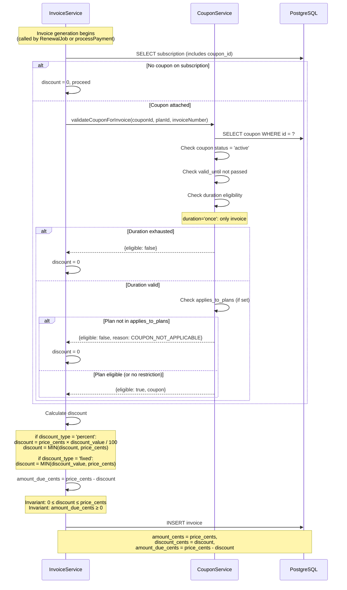
```mermaid
sequenceDiagram
    participant IS as InvoiceService
    participant CS as CouponService
    participant DB as PostgreSQL

    Note over IS: Invoice generation begins<br/>(called by RenewalJob or processPayment)

    IS->>DB: SELECT subscription (includes coupon_id)

    alt No coupon on subscription
        IS->>IS: discount = 0, proceed
    else Coupon attached
        IS->>CS: validateCouponForInvoice(couponId, planId, invoiceNumber)

        CS->>DB: SELECT coupon WHERE id = ?
        CS->>CS: Check coupon status = 'active'
        CS->>CS: Check valid_until not passed

        CS->>CS: Check duration eligibility
        Note over CS: duration='once': only invoice #1<br/>duration='repeating': invoice # <= duration_months<br/>duration='forever': always applicable

        alt Duration exhausted
            CS-->>IS: {eligible: false}
            IS->>IS: discount = 0
        else Duration valid
            CS->>CS: Check applies_to_plans (if set)
            alt Plan not in applies_to_plans
                CS-->>IS: {eligible: false, reason: COUPON_NOT_APPLICABLE}
                IS->>IS: discount = 0
            else Plan eligible (or no restriction)
                CS-->>IS: {eligible: true, coupon}
            end
        end
    end

    IS->>IS: Calculate discount
    Note over IS: if discount_type = 'percent':<br/>  discount = price_cents × discount_value / 100<br/>  discount = MIN(discount, price_cents)<br/><br/>if discount_type = 'fixed':<br/>  discount = MIN(discount_value, price_cents)

    IS->>IS: amount_due_cents = price_cents - discount
    Note over IS: Invariant: 0 ≤ discount ≤ price_cents<br/>Invariant: amount_due_cents ≥ 0

    IS->>DB: INSERT invoice
    Note over IS,DB: amount_cents = price_cents,<br/>discount_cents = discount,<br/>amount_due_cents = price_cents - discount
```

---

## 7. Invoice Generation and Payment

Full invoice lifecycle from generation through payment attempt and outcome handling.

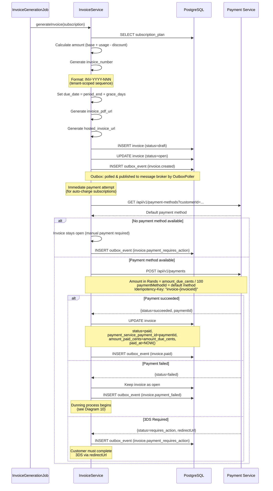
```mermaid
sequenceDiagram
    participant IJ as InvoiceGenerationJob
    participant IS as InvoiceService
    participant DB as PostgreSQL
    participant PS as Payment Service

    IJ->>IS: generateInvoice(subscription)

    IS->>DB: SELECT subscription_plan
    IS->>IS: Calculate amount (base + usage - discount)
    IS->>IS: Generate invoice_number
    Note over IS: Format: INV-YYYY-NNN<br/>(tenant-scoped sequence)

    IS->>IS: Set due_date = period_end + grace_days
    IS->>IS: Generate invoice_pdf_url
    IS->>IS: Generate hosted_invoice_url

    IS->>DB: INSERT invoice (status=draft)

    IS->>DB: UPDATE invoice (status=open)
    IS->>DB: INSERT outbox_event (invoice.created)
    Note over IS,DB: Outbox: polled & published to message broker by OutboxPoller

    Note over IS: Immediate payment attempt<br/>(for auto-charge subscriptions)

    IS->>PS: GET /api/v1/payment-methods?customerId=...
    PS-->>IS: Default payment method

    alt No payment method available
        IS->>IS: Invoice stays open (manual payment required)
        IS->>DB: INSERT outbox_event (invoice.payment_requires_action)
    else Payment method available
        IS->>PS: POST /api/v1/payments
        Note over IS,PS: Amount in Rands = amount_due_cents / 100<br/>paymentMethodId = default method<br/>Idempotency-Key: "invoice-{invoiceId}"

        alt Payment succeeded
            PS-->>IS: {status=succeeded, paymentId}
            IS->>DB: UPDATE invoice
            Note over IS,DB: status=paid,<br/>payment_service_payment_id=paymentId,<br/>amount_paid_cents=amount_due_cents,<br/>paid_at=NOW()
            IS->>DB: INSERT outbox_event (invoice.paid)

        else Payment failed
            PS-->>IS: {status=failed}
            IS->>DB: Keep invoice as open
            IS->>DB: INSERT outbox_event (invoice.payment_failed)
            Note over IS: Dunning process begins<br/>(see Diagram 10)

        else 3DS Required
            PS-->>IS: {status=requires_action, redirectUrl}
            IS->>DB: INSERT outbox_event (invoice.payment_requires_action)
            Note over IS: Customer must complete<br/>3DS via redirectUrl
        end
    end
```

---

## 8. Subscription Cancellation Flows

Two cancellation modes: immediate and at-period-end. Also shows reactivation before the period ends.

### 8.1 Cancel at Period End (Graceful)

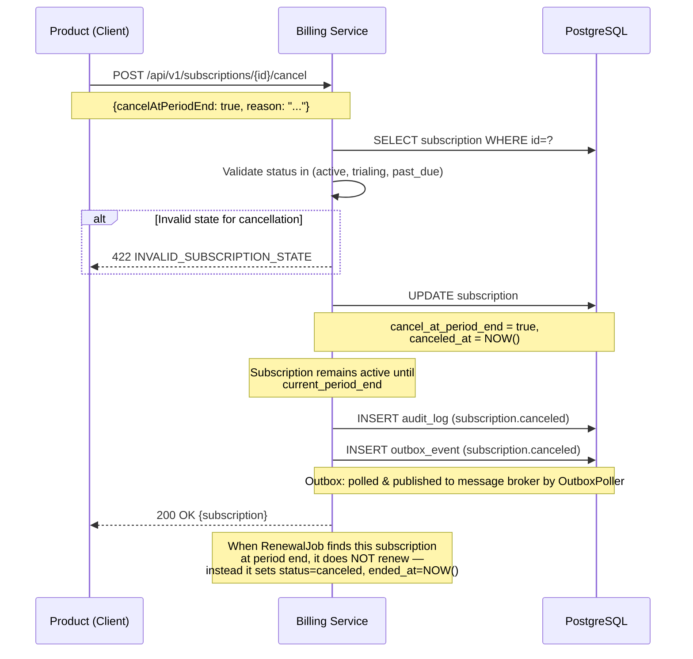
```mermaid
sequenceDiagram
    participant Product as Product (Client)
    participant BS as Billing Service
    participant DB as PostgreSQL

    Product->>BS: POST /api/v1/subscriptions/{id}/cancel
    Note over Product,BS: {cancelAtPeriodEnd: true, reason: "..."}

    BS->>DB: SELECT subscription WHERE id=?
    BS->>BS: Validate status in (active, trialing, past_due)

    alt Invalid state for cancellation
        BS-->>Product: 422 INVALID_SUBSCRIPTION_STATE
    end

    BS->>DB: UPDATE subscription
    Note over BS,DB: cancel_at_period_end = true,<br/>canceled_at = NOW()
    Note over BS: Subscription remains active until<br/>current_period_end

    BS->>DB: INSERT audit_log (subscription.canceled)
    BS->>DB: INSERT outbox_event (subscription.canceled)
    Note over BS,DB: Outbox: polled & published to message broker by OutboxPoller
    BS-->>Product: 200 OK {subscription}

    Note over BS: When RenewalJob finds this subscription<br/>at period end, it does NOT renew —<br/>instead it sets status=canceled, ended_at=NOW()
```

### 8.2 Cancel Immediately

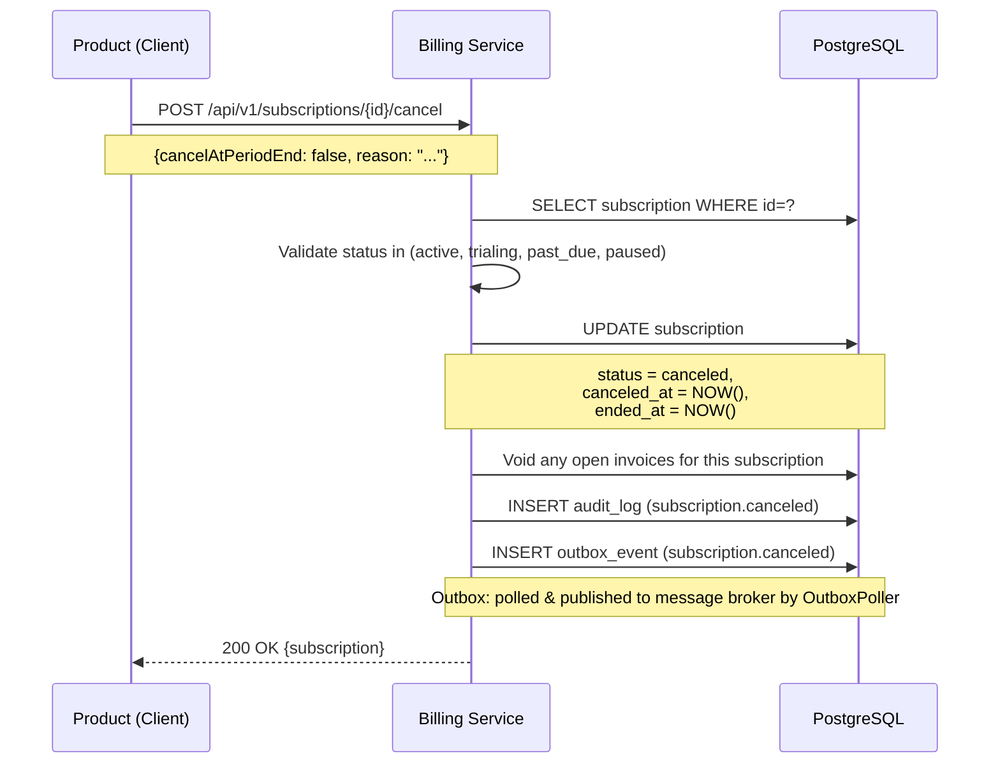
```mermaid
sequenceDiagram
    participant Product as Product (Client)
    participant BS as Billing Service
    participant DB as PostgreSQL

    Product->>BS: POST /api/v1/subscriptions/{id}/cancel
    Note over Product,BS: {cancelAtPeriodEnd: false, reason: "..."}

    BS->>DB: SELECT subscription WHERE id=?
    BS->>BS: Validate status in (active, trialing, past_due, paused)

    BS->>DB: UPDATE subscription
    Note over BS,DB: status = canceled,<br/>canceled_at = NOW(),<br/>ended_at = NOW()

    BS->>DB: Void any open invoices for this subscription
    BS->>DB: INSERT audit_log (subscription.canceled)
    BS->>DB: INSERT outbox_event (subscription.canceled)
    Note over BS,DB: Outbox: polled & published to message broker by OutboxPoller
    BS-->>Product: 200 OK {subscription}
```

### 8.3 Reactivate Before Period End

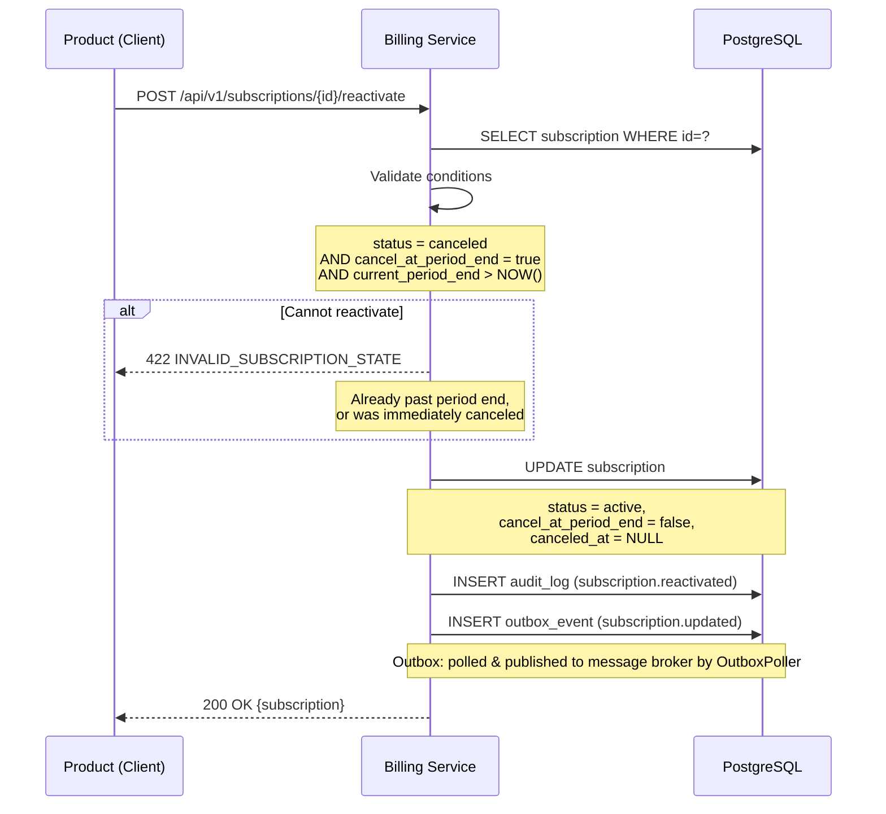
```mermaid
sequenceDiagram
    participant Product as Product (Client)
    participant BS as Billing Service
    participant DB as PostgreSQL

    Product->>BS: POST /api/v1/subscriptions/{id}/reactivate

    BS->>DB: SELECT subscription WHERE id=?

    BS->>BS: Validate conditions
    Note over BS: status = canceled<br/>AND cancel_at_period_end = true<br/>AND current_period_end > NOW()

    alt Cannot reactivate
        BS-->>Product: 422 INVALID_SUBSCRIPTION_STATE
        Note over BS: Already past period end,<br/>or was immediately canceled
    end

    BS->>DB: UPDATE subscription
    Note over BS,DB: status = active,<br/>cancel_at_period_end = false,<br/>canceled_at = NULL

    BS->>DB: INSERT audit_log (subscription.reactivated)
    BS->>DB: INSERT outbox_event (subscription.updated)
    Note over BS,DB: Outbox: polled & published to message broker by OutboxPoller
    BS-->>Product: 200 OK {subscription}
```

---

## 9. Subscription Pause and Resume

Pause billing without canceling. The subscription remains in the system but no charges are collected.

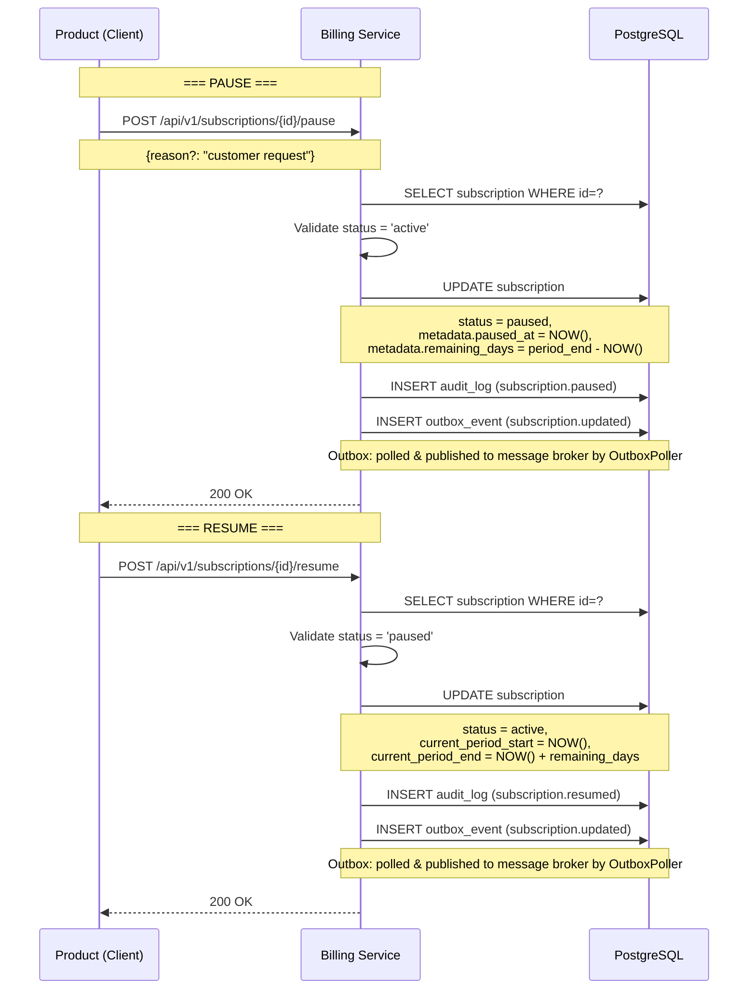
```mermaid
sequenceDiagram
    participant Product as Product (Client)
    participant BS as Billing Service
    participant DB as PostgreSQL

    Note over Product,BS: === PAUSE ===
    Product->>BS: POST /api/v1/subscriptions/{id}/pause
    Note over Product,BS: {reason?: "customer request"}

    BS->>DB: SELECT subscription WHERE id=?
    BS->>BS: Validate status = 'active'

    BS->>DB: UPDATE subscription
    Note over BS,DB: status = paused,<br/>metadata.paused_at = NOW(),<br/>metadata.remaining_days = period_end - NOW()

    BS->>DB: INSERT audit_log (subscription.paused)
    BS->>DB: INSERT outbox_event (subscription.updated)
    Note over BS,DB: Outbox: polled & published to message broker by OutboxPoller
    BS-->>Product: 200 OK

    Note over Product,BS: === RESUME ===
    Product->>BS: POST /api/v1/subscriptions/{id}/resume

    BS->>DB: SELECT subscription WHERE id=?
    BS->>BS: Validate status = 'paused'

    BS->>DB: UPDATE subscription
    Note over BS,DB: status = active,<br/>current_period_start = NOW(),<br/>current_period_end = NOW() + remaining_days

    BS->>DB: INSERT audit_log (subscription.resumed)
    BS->>DB: INSERT outbox_event (subscription.updated)
    Note over BS,DB: Outbox: polled & published to message broker by OutboxPoller
    BS-->>Product: 200 OK
```

> **Max pause duration:** Paused subscriptions have a configurable maximum pause duration (default: **90 days**). The `RenewalJob` includes a check for subscriptions where `metadata.paused_at + max_pause_duration < NOW()`. These are automatically transitioned to `canceled` with reason `auto_canceled_max_pause_exceeded`, and a `subscription.canceled` event is published.

---

## 10. Payment Failure and Retry (Dunning)

When a subscription renewal payment fails, the Billing Service implements a dunning process: automated retries with escalating intervals before marking the subscription as unpaid.

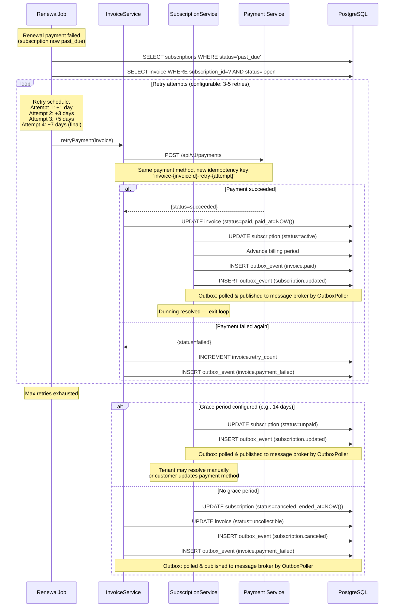
```mermaid
sequenceDiagram
    participant RJ as RenewalJob
    participant IS as InvoiceService
    participant SS as SubscriptionService
    participant PS as Payment Service
    participant DB as PostgreSQL

    Note over RJ: Renewal payment failed<br/>(subscription now past_due)

    RJ->>DB: SELECT subscriptions WHERE status='past_due'
    RJ->>DB: SELECT invoice WHERE subscription_id=? AND status='open'

    loop Retry attempts (configurable: 3-5 retries)
        Note over RJ: Retry schedule:<br/>Attempt 1: +1 day<br/>Attempt 2: +3 days<br/>Attempt 3: +5 days<br/>Attempt 4: +7 days (final)

        RJ->>IS: retryPayment(invoice)
        IS->>PS: POST /api/v1/payments
        Note over IS,PS: Same payment method, new idempotency key:<br/>"invoice-{invoiceId}-retry-{attempt}"

        alt Payment succeeded
            PS-->>IS: {status=succeeded}
            IS->>DB: UPDATE invoice (status=paid, paid_at=NOW())
            SS->>DB: UPDATE subscription (status=active)
            SS->>DB: Advance billing period
            SS->>DB: INSERT outbox_event (invoice.paid)
            SS->>DB: INSERT outbox_event (subscription.updated)
            Note over SS,DB: Outbox: polled & published to message broker by OutboxPoller
            Note over SS: Dunning resolved — exit loop
        else Payment failed again
            PS-->>IS: {status=failed}
            IS->>DB: INCREMENT invoice.retry_count
            IS->>DB: INSERT outbox_event (invoice.payment_failed)
        end
    end

    Note over RJ: Max retries exhausted

    alt Grace period configured (e.g., 14 days)
        SS->>DB: UPDATE subscription (status=unpaid)
        SS->>DB: INSERT outbox_event (subscription.updated)
        Note over SS,DB: Outbox: polled & published to message broker by OutboxPoller
        Note over SS: Tenant may resolve manually<br/>or customer updates payment method

    else No grace period
        SS->>DB: UPDATE subscription (status=canceled, ended_at=NOW())
        IS->>DB: UPDATE invoice (status=uncollectible)
        SS->>DB: INSERT outbox_event (subscription.canceled)
        IS->>DB: INSERT outbox_event (invoice.payment_failed)
        Note over IS,DB: Outbox: polled & published to message broker by OutboxPoller
    end
```

---

## 11. API Key Rotation (Grace Period)

Self-service API key rotation with a 24-hour grace period where both old and new keys are valid.

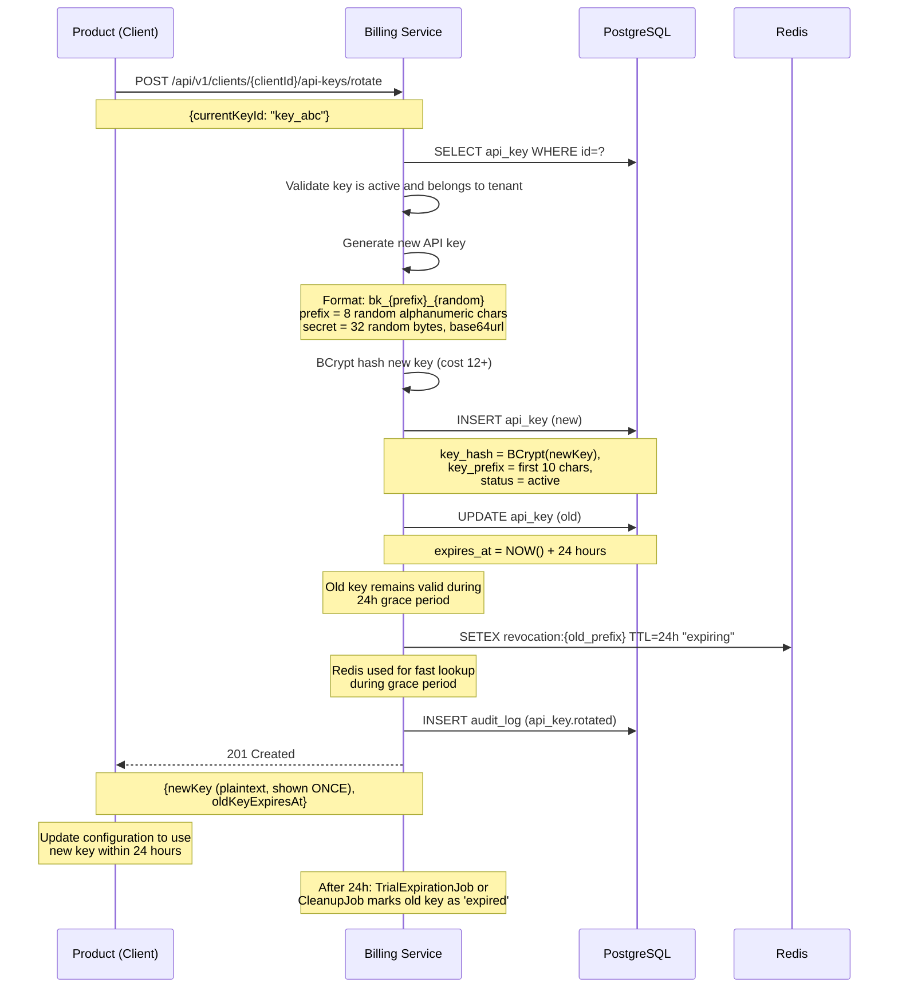
```mermaid
sequenceDiagram
    participant Product as Product (Client)
    participant BS as Billing Service
    participant DB as PostgreSQL
    participant Redis

    Product->>BS: POST /api/v1/clients/{clientId}/api-keys/rotate
    Note over Product,BS: {currentKeyId: "key_abc"}

    BS->>DB: SELECT api_key WHERE id=?
    BS->>BS: Validate key is active and belongs to tenant

    BS->>BS: Generate new API key
    Note over BS: Format: bk_{prefix}_{random}<br/>prefix = 8 random alphanumeric chars<br/>secret = 32 random bytes, base64url

    BS->>BS: BCrypt hash new key (cost 12+)

    BS->>DB: INSERT api_key (new)
    Note over BS,DB: key_hash = BCrypt(newKey),<br/>key_prefix = first 10 chars,<br/>status = active

    BS->>DB: UPDATE api_key (old)
    Note over BS,DB: expires_at = NOW() + 24 hours
    Note over BS: Old key remains valid during<br/>24h grace period

    BS->>Redis: SETEX revocation:{old_prefix} TTL=24h "expiring"
    Note over BS: Redis used for fast lookup<br/>during grace period

    BS->>DB: INSERT audit_log (api_key.rotated)
    BS-->>Product: 201 Created
    Note over BS,Product: {newKey (plaintext, shown ONCE),<br/>oldKeyExpiresAt}

    Note over Product: Update configuration to use<br/>new key within 24 hours

    Note over BS: After 24h: TrialExpirationJob or<br/>CleanupJob marks old key as 'expired'
```

---

## 12. Billing Service Webhook Dispatch

The Billing Service dispatches its own outgoing webhooks to client-registered endpoints for billing events. Identical architecture to the Payment Service webhook dispatch system.

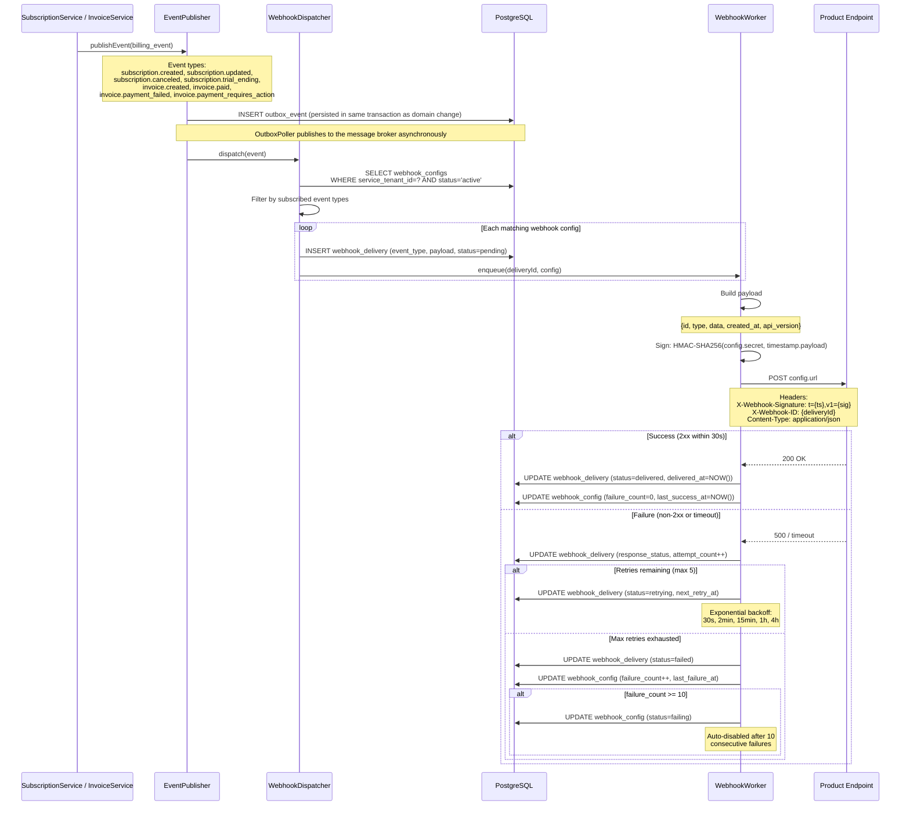
```mermaid
sequenceDiagram
    participant Service as SubscriptionService / InvoiceService
    participant EP as EventPublisher
    participant WD as WebhookDispatcher
    participant DB as PostgreSQL
    participant WW as WebhookWorker
    participant Product as Product Endpoint

    Service->>EP: publishEvent(billing_event)
    Note over EP: Event types:<br/>subscription.created, subscription.updated,<br/>subscription.canceled, subscription.trial_ending,<br/>invoice.created, invoice.paid,<br/>invoice.payment_failed, invoice.payment_requires_action

    EP->>DB: INSERT outbox_event (persisted in same transaction as domain change)
    Note over EP,DB: OutboxPoller publishes to the message broker asynchronously
    EP->>WD: dispatch(event)

    WD->>DB: SELECT webhook_configs<br/>WHERE service_tenant_id=? AND status='active'
    WD->>WD: Filter by subscribed event types

    loop Each matching webhook config
        WD->>DB: INSERT webhook_delivery (event_type, payload, status=pending)
        WD->>WW: enqueue(deliveryId, config)
    end

    WW->>WW: Build payload
    Note over WW: {id, type, data, created_at, api_version}

    WW->>WW: Sign: HMAC-SHA256(config.secret, timestamp.payload)
    WW->>Product: POST config.url
    Note over WW,Product: Headers:<br/>X-Webhook-Signature: t={ts},v1={sig}<br/>X-Webhook-ID: {deliveryId}<br/>Content-Type: application/json

    alt Success (2xx within 30s)
        Product-->>WW: 200 OK
        WW->>DB: UPDATE webhook_delivery (status=delivered, delivered_at=NOW())
        WW->>DB: UPDATE webhook_config (failure_count=0, last_success_at=NOW())

    else Failure (non-2xx or timeout)
        Product-->>WW: 500 / timeout
        WW->>DB: UPDATE webhook_delivery (response_status, attempt_count++)

        alt Retries remaining (max 5)
            WW->>DB: UPDATE webhook_delivery (status=retrying, next_retry_at)
            Note over WW: Exponential backoff:<br/>30s, 2min, 15min, 1h, 4h
        else Max retries exhausted
            WW->>DB: UPDATE webhook_delivery (status=failed)
            WW->>DB: UPDATE webhook_config (failure_count++, last_failure_at)
            alt failure_count >= 10
                WW->>DB: UPDATE webhook_config (status=failing)
                Note over WW: Auto-disabled after 10<br/>consecutive failures
            end
        end
    end
```

---

## 13. Payment Service Event Consumption

The Billing Service consumes events from the Payment Service via both HTTP webhooks and event topics. This diagram shows the inbound event routing.

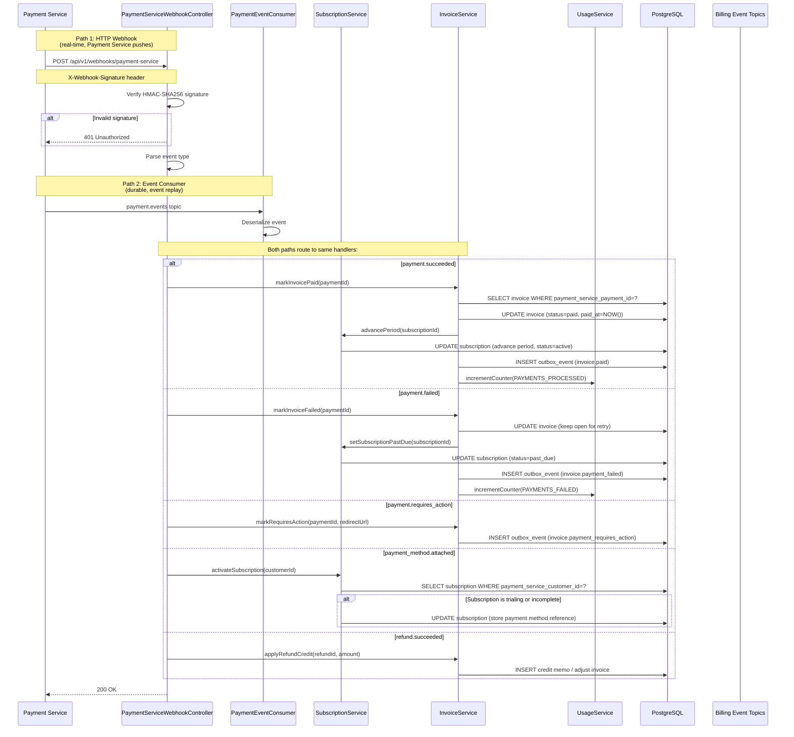
```mermaid
sequenceDiagram
    participant PS as Payment Service
    participant PSWH as PaymentServiceWebhookController
    participant KFC as PaymentEventConsumer
    participant SS as SubscriptionService
    participant IS as InvoiceService
    participant US as UsageService
    participant DB as PostgreSQL
    participant Broker as Billing Event Topics

    Note over PS,PSWH: Path 1: HTTP Webhook<br/>(real-time, Payment Service pushes)
    PS->>PSWH: POST /api/v1/webhooks/payment-service
    Note over PS,PSWH: X-Webhook-Signature header

    PSWH->>PSWH: Verify HMAC-SHA256 signature
    alt Invalid signature
        PSWH-->>PS: 401 Unauthorized
    end
    PSWH->>PSWH: Parse event type

    Note over PS,KFC: Path 2: Event Consumer<br/>(durable, event replay)
    PS->>KFC: payment.events topic
    KFC->>KFC: Deserialize event

    Note over PSWH,IS: Both paths route to same handlers:

    alt payment.succeeded
        PSWH->>IS: markInvoicePaid(paymentId)
        IS->>DB: SELECT invoice WHERE payment_service_payment_id=?
        IS->>DB: UPDATE invoice (status=paid, paid_at=NOW())
        IS->>SS: advancePeriod(subscriptionId)
        SS->>DB: UPDATE subscription (advance period, status=active)
        IS->>DB: INSERT outbox_event (invoice.paid)
        IS->>US: incrementCounter(PAYMENTS_PROCESSED)

    else payment.failed
        PSWH->>IS: markInvoiceFailed(paymentId)
        IS->>DB: UPDATE invoice (keep open for retry)
        IS->>SS: setSubscriptionPastDue(subscriptionId)
        SS->>DB: UPDATE subscription (status=past_due)
        IS->>DB: INSERT outbox_event (invoice.payment_failed)
        IS->>US: incrementCounter(PAYMENTS_FAILED)

    else payment.requires_action
        PSWH->>IS: markRequiresAction(paymentId, redirectUrl)
        IS->>DB: INSERT outbox_event (invoice.payment_requires_action)

    else payment_method.attached
        PSWH->>SS: activateSubscription(customerId)
        SS->>DB: SELECT subscription WHERE payment_service_customer_id=?
        alt Subscription is trialing or incomplete
            SS->>DB: UPDATE subscription (store payment method reference)
        end

    else refund.succeeded
        PSWH->>IS: applyRefundCredit(refundId, amount)
        IS->>DB: INSERT credit memo / adjust invoice
    end

    PSWH-->>PS: 200 OK
```

---

## 14. Subscription Status State Machine

Complete subscription status state machine with all transitions and triggers.

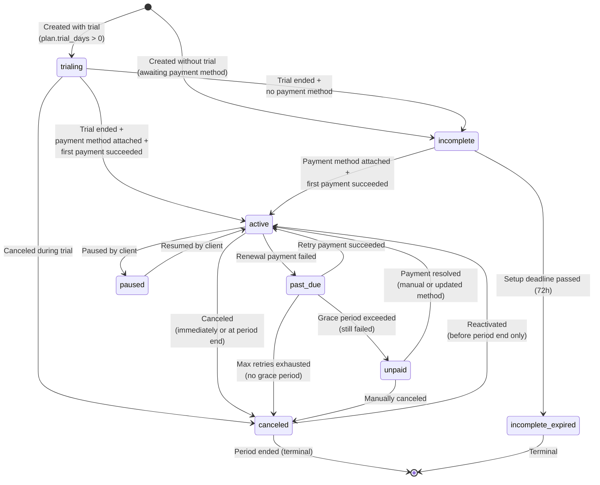
```mermaid
stateDiagram-v2
    [*] --> trialing : Created with trial<br/>(plan.trial_days > 0)
    [*] --> incomplete : Created without trial<br/>(awaiting payment method)

    trialing --> active : Trial ended +<br/>payment method attached +<br/>first payment succeeded
    trialing --> incomplete : Trial ended +<br/>no payment method
    trialing --> canceled : Canceled during trial

    incomplete --> active : Payment method attached +<br/>first payment succeeded
    incomplete --> incomplete_expired : Setup deadline passed (72h)

    active --> past_due : Renewal payment failed
    active --> canceled : Canceled<br/>(immediately or at period end)
    active --> paused : Paused by client

    past_due --> active : Retry payment succeeded
    past_due --> canceled : Max retries exhausted<br/>(no grace period)
    past_due --> unpaid : Grace period exceeded<br/>(still failed)

    paused --> active : Resumed by client

    unpaid --> active : Payment resolved<br/>(manual or updated method)
    unpaid --> canceled : Manually canceled

    canceled --> active : Reactivated<br/>(before period end only)
    canceled --> [*] : Period ended (terminal)

    incomplete_expired --> [*] : Terminal
```

**State characteristics:**

| Status | Billable | Access | Renewable |
|--------|----------|--------|-----------|
| `trialing` | No | Yes | N/A (trial period) |
| `incomplete` | No | No | N/A (awaiting setup) |
| `active` | Yes | Yes | Yes |
| `past_due` | Retrying | Configurable | Retrying |
| `paused` | No | Configurable | No |
| `unpaid` | No | No | No |
| `canceled` | No | Until period end | No |
| `incomplete_expired` | No | No | No (terminal) |

---

## 15. Invoice Status State Machine

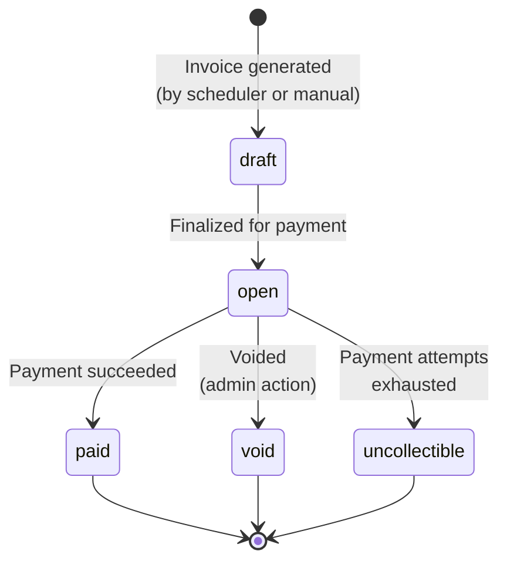
```mermaid
stateDiagram-v2
    [*] --> draft : Invoice generated<br/>(by scheduler or manual)

    draft --> open : Finalized for payment

    open --> paid : Payment succeeded
    open --> void : Voided<br/>(admin action)
    open --> uncollectible : Payment attempts<br/>exhausted

    paid --> [*]
    void --> [*]
    uncollectible --> [*]
```

**Invoice status transitions:**

| From | To | Trigger |
|------|----|---------|
| `draft` | `open` | Invoice finalized (automatic during generation or manual) |
| `open` | `paid` | Payment Service confirms payment succeeded |
| `open` | `void` | Admin voids the invoice (e.g., subscription canceled, billing error) |
| `open` | `uncollectible` | All payment retries exhausted (dunning complete) |
| `paid` | Terminal | No further transitions |
| `void` | Terminal | No further transitions |
| `uncollectible` | Terminal | No further transitions |

**Invoice invariants:**
- `amount_paid_cents <= amount_cents` — paid amount never exceeds total
- `amount_due_cents = amount_cents - amount_paid_cents` — due amount is always the remainder
- A `void` invoice cannot be paid
- An `uncollectible` invoice cannot be retried (new invoice required)

---

## Related Documents

- [Architecture Design](./architecture-design.md) — Service components, proration logic, scheduled jobs
- [Database Schema Design](./database-schema-design.md) — Table definitions, RLS policies
- [API Specification](./api-specification.yaml) — OpenAPI 3.0 spec
- [Compliance & Security Guide](./compliance-security-guide.md) — POPIA, API key security, audit logging
- [Payment Service Flow Diagrams](../payment-service/payment-flow-diagrams.md) — Payment processing flows
- [System Architecture](../shared/system-architecture.md) — Inter-service communication
