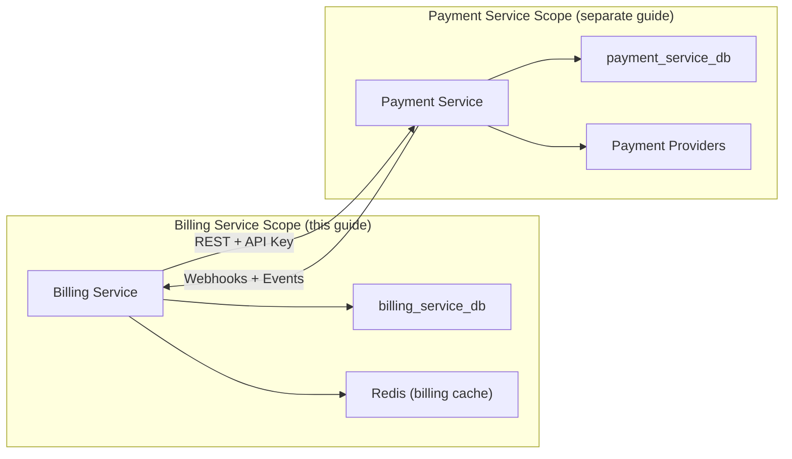
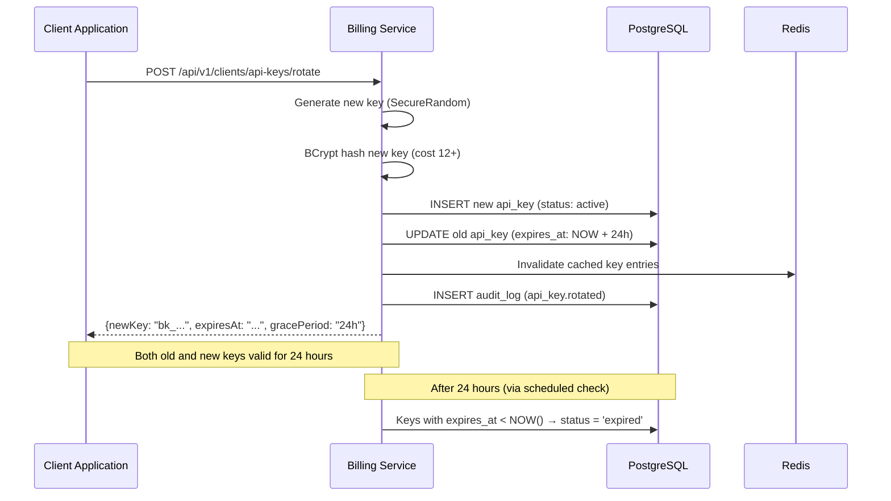
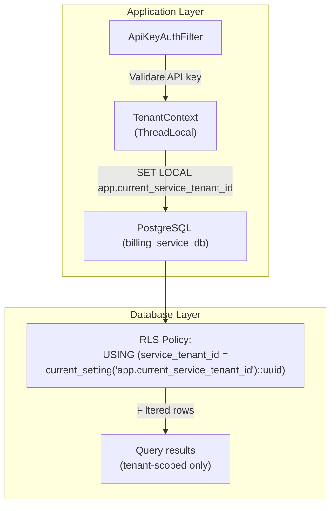
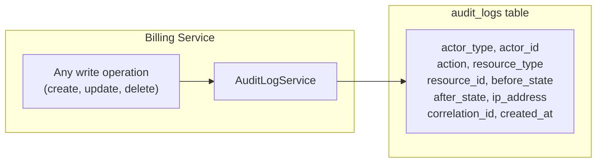
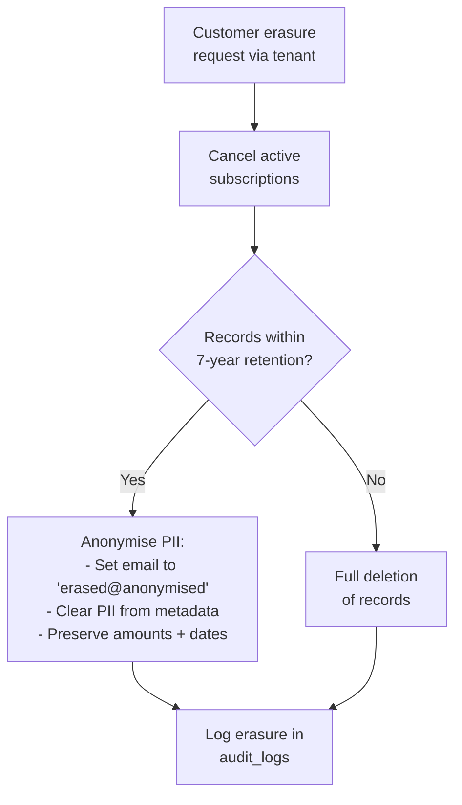

# Billing Service — Compliance & Security Guide

| Field            | Value                                      |
|------------------|--------------------------------------------|
| **Version**      | 1.0                                        |
| **Date**         | 2026-03-25                                 |
| **Status**       | Draft                                      |
| **Reviewers**    | Security Team, Compliance, Legal           |

---

## Table of Contents

1. [Scope & Relationship to Payment Service](#1-scope--relationship-to-payment-service)
2. [Regulatory Applicability](#2-regulatory-applicability)
   - 2.1 [South African VAT / SARS Compliance](#21-south-african-vat--sars-compliance)
3. [POPIA Compliance](#3-popia-compliance)
4. [Encryption](#4-encryption)
5. [API Key Security](#5-api-key-security)
6. [Multi-Tenancy & Data Isolation (RLS)](#6-multi-tenancy--data-isolation-rls)
7. [Webhook Security](#7-webhook-security)
8. [Audit Logging](#8-audit-logging)
9. [Data Retention & Disposal](#9-data-retention--disposal)
10. [Secret & Key Management](#10-secret--key-management)
11. [Security Testing](#11-security-testing)
12. [Compliance Checklist](#12-compliance-checklist)

---

## 1. Scope & Relationship to Payment Service

This guide covers **Billing Service-specific** compliance and security controls. The Billing Service does **not** process card data, interact with payment providers, or handle PCI-scoped information directly. Instead, it delegates payment execution to the Payment Service.

### What This Guide Covers

- POPIA obligations for subscription, invoice, coupon, and usage data
- API key security (BCrypt hashing, prefix-based lookup, rotation, revocation)
- RLS policies across 13 billing tables
- Audit logging via the dedicated `audit_logs` table
- Data retention for billing entities (subscriptions, invoices, coupons, usage)
- Outgoing webhook security for billing events

### What the Payment Service Compliance Guide Covers

For the following shared/payment-specific topics, refer to the [Payment Service Compliance & Security Guide](../payment-service/compliance-security-guide.md):

- PCI DSS SAQ-A compliance and scope reduction
- 3D Secure implementation
- Inbound provider webhook signature verification
- Payment token encryption
- Incident response procedures
- OWASP Top 10 mitigations (applicable to both services)

### Security Boundary



---

## 2. Regulatory Applicability

| Regulation | Applicability to Billing Service | Notes |
|------------|----------------------------------|-------|
| **POPIA** | **High** — Processes customer emails, subscription metadata, invoice records | Primary compliance concern |
| **SARB / Tax Act** | **High** — Invoice and subscription records are financial records | 7-year retention for financial data |
| **PCI DSS** | **Not directly applicable** — No card data handled | Payment data delegated to Payment Service |
| **ECTA** | **Medium** — Electronic billing and invoicing | Invoice format, terms, and delivery |
| **Consumer Protection Act** | **Medium** — Subscription terms, cancellation rights | Trial periods, cancellation flows |

### PCI DSS Exemption

The Billing Service is **out of PCI DSS scope** because it:

- Never receives, processes, or stores cardholder data (PAN, CVV, PIN)
- Never communicates directly with payment providers
- References payments only by `payment_service_payment_id` (an opaque UUID)
- Delegates all payment processing to the PCI-compliant Payment Service

The only payment-related data stored is:

| Data | Storage | Classification |
|------|---------|----------------|
| `payment_service_payment_id` | `invoices` table | Non-sensitive reference |
| `payment_service_customer_id` | `subscriptions` table | Non-sensitive reference |
| Invoice amounts (cents) | `invoices` table | Financial data (not PCI) |

---

## 2.1 South African VAT / SARS Compliance

The Billing Service generates invoices that are subject to South African Revenue Service (SARS) requirements. All invoices must comply with the Value-Added Tax Act (No. 89 of 1991).

### VAT Requirements for Invoices

| Requirement | Implementation |
|-------------|----------------|
| **VAT rate** | 15% standard rate applied to all taxable supplies. Stored as `tax_rate` on each invoice. |
| **VAT shown separately** | Every invoice stores `subtotal_cents`, `discount_cents`, `tax_amount_cents`, and `amount_cents` (total). Tax is calculated as `(subtotal_cents - discount_cents) × tax_rate` and shown as a separate line. |
| **Sequential invoice numbering** | Invoices are assigned a sequential, tenant-scoped `invoice_number` (e.g., `INV-2026-000001`). Gaps in numbering must be accounted for (voided invoices retain their number). |
| **Invoice line items** | The `invoice_line_items` table provides a SARS-compliant breakdown: description, quantity, unit price, subtotal, tax rate, and tax amount per line. |
| **Seller and buyer details** | Tenant settings store the seller's VAT registration number, trading name, and address. Customer details are captured on the subscription. |
| **Retention** | Invoice records (including line items) retained for 7 years per the Tax Administration Act. `ON DELETE RESTRICT` on financial tables prevents premature deletion. |

### Tax Calculation Flow

```
subtotal_cents       = SUM(line_items.subtotal_cents)
discount_cents       = coupon discount (if applicable)
taxable_amount_cents = subtotal_cents - discount_cents
tax_amount_cents     = ROUND(taxable_amount_cents × tax_rate)
amount_cents         = taxable_amount_cents + tax_amount_cents
```

> **Note**: The `tax_rate` field defaults to `0.15` (15% VAT) but is stored per invoice to support future rate changes or zero-rated supplies without retroactively affecting historical invoices.

---

## 3. POPIA Compliance

### 3.1 Personal Information Processed

| Data Element | Classification | Purpose | Table | Retention |
|-------------|----------------|---------|-------|-----------|
| Customer email | Personal info | Subscription identification, notifications | `subscriptions` | 7 years after end |
| External customer ID | Indirect identifier | Link subscriptions to client's users | `subscriptions` | 7 years after end |
| Invoice amounts | Financial info | Billing records | `invoices` | 7 years |
| Subscription metadata | Varies (may contain PII) | Client-defined context | `subscriptions` | 7 years after end |
| IP address | Personal info | Audit logging, security | `audit_logs` | 2 years |
| User agent | Personal info | Audit logging, security | `audit_logs` | 2 years |
| API key prefix | Not personal info | Key identification in logs | `api_keys` | Until revoked + 90d |
| Coupon codes | Not personal info | Discount tracking | `coupons` | Indefinite (archived) |

### 3.2 POPIA Principles Applied

| POPIA Condition | Implementation |
|-----------------|----------------|
| **Accountability** | Data processing documented in this guide; DPO appointed by Enviro |
| **Processing limitation** | Only process data necessary for billing operations |
| **Purpose specification** | Data collected solely for subscription management and invoicing |
| **Further processing** | No data shared beyond the Payment Service (for payment execution) |
| **Information quality** | Data validated on input; stale subscriptions cleaned up by scheduled jobs |
| **Openness** | Privacy policy covers billing data processing |
| **Security safeguards** | Encryption, RLS, API key hashing, audit logging |
| **Data subject participation** | Customers can request data export/deletion via their tenant |

### 3.3 Data Subject Rights

| Right | Implementation |
|-------|----------------|
| **Right to access** | Export all subscription/invoice data for a given `external_customer_id` (via tenant API) |
| **Right to correction** | Customer email can be updated via subscription update |
| **Right to deletion** | Anonymise PII in subscription and invoice records after retention period; cancel active subscriptions |
| **Right to object** | Cancel subscriptions, revoke consent for billing |

### 3.4 Data Minimisation

- **Metadata is tenant-controlled**: The `metadata` JSONB field on subscriptions stores whatever the tenant provides. The Billing Service does not require PII in metadata.
- **No marketing data**: The service does not collect or process data for marketing purposes.
- **Email masking in application logs**: Customer emails masked as `j***@example.com` in structured logs.
- **Coupon codes are not PII**: Coupon codes are business identifiers, not personal information.

### 3.5 Cross-Border Data Transfer

- The Billing Service runs on SA-based infrastructure
- The Payment Service (its only external dependency) also runs in SA
- No billing data is transferred outside South Africa
- If the Billing Service is deployed to cloud regions outside SA in the future, a POPIA cross-border assessment is required

---

## 4. Encryption

### 4.1 Encryption in Transit

| Connection | Protocol | Minimum Version | Notes |
|-----------|----------|-----------------|-------|
| Clients / Products → Billing Service | TLS | 1.2 | TLS 1.3 preferred |
| Billing Service → Payment Service | TLS | 1.2 | mTLS where supported |
| Billing Service → PostgreSQL | TLS | 1.2 | `sslmode=verify-full` |
| Billing Service → Redis | TLS | 1.2 | `ssl=true` |
| Billing Service → Message Broker | TLS + SASL | 1.2 | SASL_SSL protocol |

Weak cipher suites disabled (no RC4, DES, 3DES, MD5). Certificate validation enforced on all outbound connections.

### 4.2 Encryption at Rest

| Data Store | Encryption Method | Key Management |
|-----------|-------------------|----------------|
| PostgreSQL (`billing_service_db`) | Transparent Data Encryption (TDE) or volume encryption | Cloud KMS / LUKS |
| Redis | Volume-level encryption | Cloud KMS / LUKS |
| Message Broker | Volume-level encryption | Cloud KMS / LUKS |
| Backups | AES-256 encrypted backups | Separate backup encryption key |

### 4.3 Application-Level Encryption

| Field | Encryption | Notes |
|-------|-----------|-------|
| `api_keys.key_hash` | BCrypt (cost 12+) | One-way hash, not reversible |
| `webhook_configs.secret_hash` | AES-256-GCM | Webhook shared secrets encrypted before storage |
| `service_tenants.settings` (sensitive fields) | AES-256-GCM | Provider credentials within settings encrypted |
| `audit_logs.before_state` / `after_state` | Not encrypted | Contains operational data, not secrets. PII masked before storage. |

**Key rotation**: Encrypted values include a key version identifier, enabling gradual re-encryption during key rotation without downtime (same pattern as the Payment Service).

---

## 5. API Key Security

The Billing Service uses a more sophisticated API key model than the Payment Service, supporting multiple keys per tenant with self-service rotation and revocation.

### 5.1 Key Format

```
bk_{prefix}_{secret}

Example: bk_abc12345_a7f8b3c2d1e4f5a6b7c8d9e0f1a2b3c4d5e6f7a8
```

| Component | Length | Purpose |
|-----------|--------|---------|
| `bk_` | 3 chars | Service identifier (billing key) |
| `prefix` | 8-10 chars | Stored in plaintext for log identification and DB lookup |
| `secret` | 40+ chars | Cryptographically random, hashed with BCrypt |

### 5.2 Key Storage

```mermaid
graph TB
    subgraph "Key Generation (one-time)"
        G1["Generate cryptographically<br/>random key (SecureRandom)"]
        G2["Extract prefix (first 8-10 chars)"]
        G3["BCrypt hash full key (cost 12+)"]
        G4["Store prefix + hash in api_keys table"]
        G5["Return plaintext to caller<br/>(shown ONCE, never stored)"]
        G1 --> G2 --> G3 --> G4 --> G5
    end

    subgraph "Key Validation (every request)"
        V1["Parse prefix from X-API-Key header"]
        V2["Lookup by prefix in api_keys table"]
        V3["BCrypt verify full key against stored hash"]
        V4["Check key status (active/revoked/expired)"]
        V5["Check tenant status (active/suspended)"]
        V6["Set TenantContext + RLS variable"]
        V1 --> V2 --> V3 --> V4 --> V5 --> V6
    end
```



### 5.3 Key Lifecycle

| Stage | Process | Security Control |
|-------|---------|-----------------|
| **Generation** | `SecureRandom` generates 48+ character key | CSPRNG, not predictable |
| **Delivery** | Plaintext returned in API response body (HTTPS only) | Shown exactly once |
| **Storage** | `key_hash = BCrypt(key, cost=12+)`, `key_prefix` in plaintext | One-way hash, prefix for lookup |
| **Validation** | Prefix-based lookup → BCrypt verify → status check | Constant-time comparison via BCrypt |
| **Rotation** | New key issued; old key gets `expires_at = NOW() + 24h` | 24h grace period, both keys valid |
| **Revocation** | Key status set to `revoked`, `revoked_at` recorded | Immediate invalidation |
| **Audit** | All lifecycle events logged in `audit_logs` | `api_key.created`, `api_key.rotated`, `api_key.revoked` |

### 5.4 Rotation Flow



### 5.5 Security Properties

- **Prefix-based lookup**: Avoids iterating all keys for BCrypt verification (O(1) lookup, then O(1) verify)
- **BCrypt cost 12+**: ~250ms verification time — resistant to brute force
- **No plaintext storage**: Even a full database compromise doesn't reveal API keys
- **Grace period**: 24h rotation window prevents service disruption during key rollover
- **Revocation cache**: Revoked key prefixes cached in Redis for fast rejection without DB query
- **Last-used tracking**: `last_used_at` updated asynchronously to detect unused/stale keys

### 5.6 Rate Limiting

Redis-based sliding window rate limiter:

| Parameter | Value | Configurable |
|-----------|-------|-------------|
| Default limit | 500 requests/minute per tenant | Yes, per `service_tenants.rate_limit_per_minute` |
| Response headers | `X-RateLimit-Limit`, `X-RateLimit-Remaining`, `X-RateLimit-Reset` | N/A |
| Exceeded response | HTTP 429 with `Retry-After` header | N/A |

---

## 6. Multi-Tenancy & Data Isolation (RLS)

### 6.1 Row-Level Security Architecture

The Billing Service enforces data isolation at the **database level** using PostgreSQL Row-Level Security (RLS), providing defence-in-depth beyond application-level `WHERE` clauses.



### 6.2 RLS Policy Summary

| Table | RLS Enabled | Policy | INSERT Policy |
|-------|-------------|--------|---------------|
| `service_tenants` | **No** | Admin-only table | N/A |
| `api_keys` | Yes | `service_tenant_id = current_setting('app.current_service_tenant_id')::uuid` | No (admin creates) |
| `subscription_plans` | Yes | `service_tenant_id = ...` | Yes (`WITH CHECK`) |
| `subscriptions` | Yes | `service_tenant_id = ...` | Yes (`WITH CHECK`) |
| `invoices` | Yes | `service_tenant_id = ...` | Yes (`WITH CHECK`) |
| `coupons` | Yes | `service_tenant_id = ...` | Yes (`WITH CHECK`) |
| `webhook_configs` | Yes | `service_tenant_id = ...` | Yes (`WITH CHECK`) |
| `webhook_deliveries` | **No** | Accessed via FK to `webhook_configs` (RLS on parent) | N/A |
| `billing_usage` | Yes | `service_tenant_id = ...` | No (system-generated) |
| `audit_logs` | Yes | `service_tenant_id = ... OR service_tenant_id IS NULL` | No (system-generated) |
| `idempotency_keys` | Yes | `service_tenant_id = ...` | No (system-generated) |
| `invoice_line_items` | Yes | `service_tenant_id = ...` (via FK to invoices) | Yes (`WITH CHECK`) |
| `coupon_plan_assignments` | Yes | `service_tenant_id = ...` (via FK to coupons) | Yes (`WITH CHECK`) |

### 6.3 RLS Session Variable

The Billing Service uses a **different** RLS variable than the Payment Service:

| Service | Variable | Set By |
|---------|----------|--------|
| Payment Service | `app.current_tenant_id` | `ApiKeyAuthFilter` |
| Billing Service | `app.current_service_tenant_id` | `ApiKeyAuthenticationFilter` |

This distinction ensures that even if the two services share a PostgreSQL cluster (not recommended), their RLS policies operate independently.

### 6.4 Security Properties

- **Guaranteed isolation**: Even if application code omits a `WHERE service_tenant_id = ?` clause, RLS silently filters rows
- **Cross-tenant access prevention**: Accessing another tenant's subscription returns empty results (not 403, preventing enumeration)
- **Admin bypass**: Admin operations (cross-tenant reports, scheduled jobs) use a separate DB role without RLS restrictions
- **INSERT protection**: `FOR INSERT WITH CHECK` policies on key tables prevent inserting rows for the wrong tenant
- **Audit log visibility**: `audit_logs` policy allows `service_tenant_id IS NULL` for system-generated entries visible to admins

---

## 7. Webhook Security

The Billing Service dispatches outgoing webhooks to tenant-registered endpoints for billing events (subscriptions, invoices). It does **not** receive inbound provider webhooks — that is the Payment Service's responsibility.

### 7.1 Outgoing Webhook Signing

All outgoing webhook payloads are signed with the tenant's configured webhook secret:

| Control | Implementation |
|---------|---------------|
| **HMAC-SHA256 signing** | Payload signed: `HMAC-SHA256(timestamp + "." + body, secret)` |
| **Signature header** | `X-Webhook-Signature: t={timestamp},v1={hmac}` |
| **Timestamp inclusion** | Prevents replay attacks on the consumer side |
| **Unique delivery ID** | `X-Webhook-ID` header for deduplication |
| **HTTPS required** | Webhook URLs must use HTTPS (enforced on registration) |
| **Secret storage** | Webhook secrets stored as AES-256-GCM encrypted values in `webhook_configs.secret_hash` |

### 7.2 Webhook Event Types

| Event Type | Trigger | Payload Includes |
|-----------|---------|-----------------|
| `subscription.created` | New subscription created | Subscription details, plan, coupon |
| `subscription.updated` | Plan change, period advance | Updated subscription, change details |
| `subscription.canceled` | Subscription canceled | Subscription, cancellation reason |
| `subscription.trial_ending` | 3 days before trial end | Subscription, trial end date |
| `invoice.created` | New invoice generated | Invoice details, line items |
| `invoice.paid` | Invoice payment succeeded | Invoice, payment reference |
| `invoice.payment_failed` | Invoice payment failed | Invoice, failure reason |
| `invoice.payment_requires_action` | 3DS required | Invoice, action URL |

### 7.3 Delivery Reliability

| Control | Implementation |
|---------|---------------|
| **Retry policy** | Exponential backoff: 30s, 2min, 15min, 1h, 4h (5 retries max, ~5.5h total) |
| **Auto-disable** | Endpoint status set to `failing` after 10+ consecutive failures |
| **Dead letter queue** | Failed deliveries (exhausted retries) published to `billing.events.dlq` topic |
| **Delivery tracking** | Every attempt recorded in `webhook_deliveries` with status, response code, response body |
| **Idempotent consumption** | `X-Webhook-ID` header enables consumers to deduplicate |

### 7.4 Inbound Webhooks from Payment Service

The Billing Service receives events from the Payment Service at `POST /api/v1/webhooks/payment-service`:

| Control | Implementation |
|---------|---------------|
| **Signature verification** | HMAC-SHA256 using shared secret (`PAYMENT_SERVICE_WEBHOOK_SECRET`) |
| **Constant-time comparison** | `MessageDigest.isEqual()` prevents timing attacks |
| **Quick response** | Return 200 immediately; process asynchronously |
| **Idempotent processing** | Deduplicate by `payment_service_payment_id + event_type` |
| **Event routing** | `payment.succeeded` → mark invoice paid; `payment.failed` → mark invoice failed |

---

## 8. Audit Logging

### 8.1 Audit Trail Architecture

The Billing Service uses a dedicated `audit_logs` table (distinct from the Payment Service's `payment_events` approach). This provides a structured, queryable audit trail with before/after state capture.



### 8.2 Audit Log Fields

| Field | Description | Example |
|-------|-------------|---------|
| `actor_type` | Who performed the action | `user`, `system`, `api_key` |
| `actor_id` | Identifier of the actor | API key prefix, `scheduler`, `payment-service` |
| `action` | What occurred | `subscription.created`, `invoice.paid` |
| `resource_type` | Entity type affected | `subscription`, `invoice`, `coupon`, `api_key`, `plan` |
| `resource_id` | UUID of affected entity | UUID |
| `before_state` | Entity state before change (null for creates) | JSONB snapshot |
| `after_state` | Entity state after change (null for deletes) | JSONB snapshot |
| `ip_address` | Request source IP | `inet` |
| `user_agent` | Request user agent | String |
| `correlation_id` | Distributed tracing ID | Matches `X-Correlation-ID` header |

### 8.3 Audited Actions

| Category | Actions |
|----------|---------|
| **Subscriptions** | `subscription.created`, `subscription.canceled`, `subscription.reactivated`, `subscription.plan_changed`, `subscription.paused`, `subscription.resumed` |
| **Invoices** | `invoice.created`, `invoice.paid`, `invoice.voided`, `invoice.marked_uncollectible` |
| **Plans** | `plan.created`, `plan.updated`, `plan.archived` |
| **Coupons** | `coupon.created`, `coupon.archived` |
| **API Keys** | `api_key.created`, `api_key.rotated`, `api_key.revoked` |
| **Tenants** | `tenant.created`, `tenant.suspended`, `tenant.activated` |
| **Webhooks** | `webhook.configured`, `webhook.disabled`, `webhook.auto_disabled` |

### 8.4 Audit Log Security

- **Append-only**: The `audit_logs` table is insert-only — no updates or deletes except by the retention cleanup job
- **RLS-protected**: Tenants can only see their own audit entries (plus `service_tenant_id IS NULL` for system entries)
- **PII masking in state snapshots**: Customer emails masked in `before_state`/`after_state` JSONB (`j***@example.com`). Full values available only via the main entity tables (subject to RLS).
- **Correlation ID**: Every audit entry includes a `correlation_id` for cross-service tracing (linking billing audit entries to Payment Service `payment_events`)
- **Immutability enforced**: Application code uses a `@ReadOnly` repository for audit logs; no `update()` or `delete()` methods exposed

### 8.5 Comparison with Payment Service Audit Approach

| Aspect | Payment Service | Billing Service |
|--------|----------------|-----------------|
| **Table** | `payment_events` | `audit_logs` |
| **Before/after state** | No (event payload only) | Yes (before_state, after_state) |
| **Actor tracking** | Implicit (tenant via RLS) | Explicit (actor_type, actor_id) |
| **IP address** | No | Yes |
| **Correlation ID** | No | Yes |
| **Purpose** | Event sourcing + audit | Pure audit trail |

The Billing Service's richer audit model is justified by its broader set of entities (plans, subscriptions, invoices, coupons, API keys) and the need for detailed change tracking for financial compliance.

---

## 9. Data Retention & Disposal

### 9.1 Retention Schedule

| Data Category | Table | Retention Period | Legal Basis |
|---------------|-------|-----------------|-------------|
| Subscription records | `subscriptions` | 7 years after end | SARB, Tax Act |
| Invoice records | `invoices` | 7 years | SARB, Tax Act (financial records) |
| Subscription plans | `subscription_plans` | Indefinite (archived, not deleted) | Referenced by historical subscriptions |
| Coupon definitions | `coupons` | Indefinite (archived, not deleted) | Referenced by historical subscriptions |
| API keys | `api_keys` | Until revoked + 90 days | Security audit trail |
| Webhook configurations | `webhook_configs` | Life of tenant | Active configuration |
| Webhook deliveries | `webhook_deliveries` | 90 days | Debugging |
| Billing usage metrics | `billing_usage` | 2 years | Analytics and reporting |
| Audit logs | `audit_logs` | 2 years | POPIA, regulatory compliance |
| Idempotency keys | `idempotency_keys` | 24 hours (auto-expire) | Short-lived operational cache |
| Tenant records | `service_tenants` | Life of relationship + 2 years | POPIA |

### 9.2 Automated Cleanup

Cleanup is performed by the `CleanupJob` (Quartz scheduler, daily at 03:00 UTC):

```sql
-- Idempotency keys: expire after 24 hours
DELETE FROM idempotency_keys WHERE expires_at < NOW();

-- Webhook deliveries: remove after 90 days
DELETE FROM webhook_deliveries WHERE created_at < NOW() - INTERVAL '90 days';

-- Audit logs: remove after 2 years
DELETE FROM audit_logs WHERE created_at < NOW() - INTERVAL '2 years';

-- Billing usage: remove after 2 years
DELETE FROM billing_usage WHERE period_end < (CURRENT_DATE - INTERVAL '2 years');

-- Revoked API keys: remove 90 days after revocation
DELETE FROM api_keys 
WHERE status = 'revoked' 
  AND revoked_at < NOW() - INTERVAL '90 days';
```

### 9.3 Right to Erasure (POPIA)

When a customer requests deletion (via tenant):

1. **Check active subscriptions** — Cancel all active/trialing subscriptions for the customer
2. **Check invoices within retention** — For invoices within the 7-year retention window: **anonymise** PII (customer email, metadata containing PII) while preserving amounts, dates, and invoice numbers
3. **Check subscriptions within retention** — Anonymise `external_customer_email` and PII in `metadata` JSONB
4. **Records outside retention** — Full deletion
5. **Audit the erasure** — Log erasure request and actions in `audit_logs` (with `action = 'customer.data_erased'`)



> **Financial records cannot be fully deleted** during the SARB/Tax Act retention period. Anonymisation (removing PII while keeping amounts, dates, and invoice numbers) is the compliant approach.

---

## 10. Secret & Key Management

### 10.1 Secrets Inventory

| Secret | Environment Variable | Rotation Frequency |
|--------|---------------------|--------------------|
| Payment Service API key | `PAYMENT_SERVICE_API_KEY` | Aligned with Payment Service tenant key rotation |
| Payment Service webhook secret | `PAYMENT_SERVICE_WEBHOOK_SECRET` | Quarterly |
| PostgreSQL password | `DATABASE_PASSWORD` | Quarterly |
| Redis password | `REDIS_PASSWORD` | Quarterly |
| Message broker credentials | `BROKER_USERNAME`, `BROKER_PASSWORD` | Quarterly |
| Application encryption key | `APP_ENCRYPTION_KEY` | Annually |

### 10.2 Secret Storage

Same hierarchy as the Payment Service (refer to [Payment Service Compliance Guide, Section 8.2](../payment-service/compliance-security-guide.md#82-secret-storage-hierarchy)):

1. **HashiCorp Vault** (preferred) — Dynamic secrets, automatic rotation, audit trail
2. **Kubernetes Secrets** (encrypted at rest) + External Secrets Operator
3. **Cloud KMS** (AWS KMS, Azure Key Vault, GCP KMS)

**Not acceptable**: Secrets in `application.yml`, Docker images, environment files in source control, or CI/CD logs.

### 10.3 Secret Injection (Kubernetes)

```yaml
apiVersion: apps/v1
kind: Deployment
metadata:
  name: billing-service
spec:
  template:
    spec:
      containers:
        - name: billing-service
          env:
            - name: PAYMENT_SERVICE_API_KEY
              valueFrom:
                secretKeyRef:
                  name: payment-service-credentials
                  key: api-key
            - name: PAYMENT_SERVICE_WEBHOOK_SECRET
              valueFrom:
                secretKeyRef:
                  name: payment-service-credentials
                  key: webhook-secret
            - name: DATABASE_PASSWORD
              valueFrom:
                secretKeyRef:
                  name: billing-postgres-credentials
                  key: password
            - name: APP_ENCRYPTION_KEY
              valueFrom:
                secretKeyRef:
                  name: billing-encryption
                  key: master-key
```

---

## 11. Security Testing

### 11.1 Testing Schedule

Same schedule as the Payment Service (refer to [Payment Service Compliance Guide, Section 13.1](../payment-service/compliance-security-guide.md#131-testing-schedule)):

| Test Type | Frequency | Scope |
|-----------|-----------|-------|
| **Static analysis (SAST)** | Every build | Source code (SonarQube, Checkmarx) |
| **Dependency scanning** | Every build | Third-party libraries (OWASP Dep Check, Snyk) |
| **Dynamic analysis (DAST)** | Monthly | Running application (OWASP ZAP) |
| **Penetration testing** | Annually | Full service including webhook endpoints |
| **Secret scanning** | Every commit | Git pre-commit hooks (gitleaks, truffleHog) |
| **Container scanning** | Every build | Docker images (Trivy) |

### 11.2 Billing-Specific Security Tests

| Test Case | Expected Result |
|-----------|----------------|
| Request without `X-API-Key` | 401 Unauthorized |
| Request with invalid API key | 401 Unauthorized |
| Request with revoked API key | 401 Unauthorized |
| Request with expired API key (past grace period) | 401 Unauthorized |
| Request during rotation grace period (old key) | 200 OK (still valid) |
| Request during rotation grace period (new key) | 200 OK |
| Access another tenant's subscription by ID | 404 Not Found (not 403) |
| Access another tenant's invoice by ID | 404 Not Found (not 403) |
| Create subscription with another tenant's plan | 404 Not Found (RLS hides plan) |
| Apply coupon from another tenant | 404 `COUPON_NOT_FOUND` |
| Payment Service webhook with invalid signature | 401 Unauthorized |
| Replay a valid Payment Service webhook | Deduplicated (idempotent) |
| SQL injection in metadata fields | Parameterised query prevents execution |
| XSS in customer email field | Input validation rejects |
| Brute-force API key guessing | Rate-limited after threshold |
| Create coupon with `discount_value > 100` for percent type | 400 Validation error (DB CHECK constraint) |
| Create subscription for already-subscribed customer | 409 `CUSTOMER_ALREADY_SUBSCRIBED` |

### 11.3 API Key Security Tests

| Test Case | Expected Result |
|-----------|----------------|
| Generate key — verify BCrypt cost | `BCrypt.costOf(hash) >= 12` |
| Generate key — verify prefix extraction | Prefix matches first 8-10 chars of plaintext |
| Rotate key — old key valid within 24h | Authentication succeeds |
| Rotate key — old key invalid after 24h | 401 Unauthorized |
| Revoke key — immediate rejection | 401 Unauthorized |
| Multiple keys per tenant — both valid | Each key authenticates independently |
| Key never appears in logs | Grep application logs for full key — no matches |
| Key never returned in GET responses | API responses show prefix only, never full key |

---

## 12. Compliance Checklist

### Pre-Launch Checklist

#### POPIA

- [ ] Privacy impact assessment completed for billing data processing
- [ ] Data processing agreement in place with Payment Service (internal SLA)
- [ ] Privacy policy covers subscription, invoice, and usage data processing
- [ ] Data retention schedule implemented (automated cleanup jobs)
- [ ] Data subject access/deletion process documented and tested
- [ ] Customer email masking verified in application logs
- [ ] Metadata JSONB — no mandatory PII fields required by the service

#### API Key Security

- [ ] BCrypt cost factor >= 12 verified
- [ ] Key plaintext never stored (only hash + prefix)
- [ ] Key plaintext never appears in logs, responses (except initial generation)
- [ ] Rotation grace period (24h) tested end-to-end
- [ ] Revocation immediately invalidates key
- [ ] Rate limiting operational per tenant
- [ ] `last_used_at` tracking operational

#### Multi-Tenancy (RLS)

- [ ] RLS enabled on all 11 tenant-scoped tables
- [ ] `FOR INSERT WITH CHECK` policies on subscription_plans, subscriptions, invoices, coupons, webhook_configs
- [ ] Admin operations use separate DB role (no RLS)
- [ ] Cross-tenant access returns 404 (not 403) — tested for all entity types
- [ ] `app.current_service_tenant_id` variable set correctly in `ApiKeyAuthenticationFilter`

#### Encryption

- [ ] TLS 1.2+ enforced on all connections
- [ ] Database encryption at rest enabled
- [ ] AES-256-GCM for webhook secrets
- [ ] BCrypt for API key hashing
- [ ] Secret management solution deployed (Vault / K8s Secrets)

#### Audit & Monitoring

- [ ] `audit_logs` capturing all write operations
- [ ] Before/after state snapshots verified for accuracy
- [ ] PII masking in state snapshots verified
- [ ] Correlation IDs propagated from requests to audit entries
- [ ] Log retention policies configured (2-year cleanup)
- [ ] Centralised logging and monitoring operational (ELK / Loki)
- [ ] Alerting configured for: authentication failures, rate limit breaches, webhook delivery failures

#### Data Retention

- [ ] `CleanupJob` scheduled and tested
- [ ] Idempotency key expiry (24h) verified
- [ ] Webhook delivery cleanup (90d) verified
- [ ] Audit log cleanup (2y) verified
- [ ] Billing usage cleanup (2y) verified
- [ ] API key cleanup (revoked + 90d) verified
- [ ] POPIA erasure process tested (anonymisation within retention, deletion outside)

#### Webhook Security

- [ ] Outgoing webhooks signed with HMAC-SHA256
- [ ] Webhook URLs validated (HTTPS required)
- [ ] Auto-disable after consecutive failures operational
- [ ] Dead letter queue receiving exhausted deliveries
- [ ] Payment Service webhook signature verification tested
- [ ] Constant-time signature comparison verified

#### Testing

- [ ] SAST in CI/CD pipeline
- [ ] Dependency scanning in CI/CD pipeline
- [ ] Secret scanning pre-commit hooks
- [ ] All billing-specific security tests passing
- [ ] All API key security tests passing
- [ ] Container image scanning operational

---

## Related Documents

- [Architecture Design](./architecture-design.md) — Security architecture, API key authentication flow
- [Database Schema Design](./database-schema-design.md) — RLS policies, table definitions, CHECK constraints
- [API Specification](./api-specification.yaml) — Security schemes, authentication headers
- [Billing Flow Diagrams](./billing-flow-diagrams.md) — Webhook dispatch flows
- [Payment Service Compliance Guide](../payment-service/compliance-security-guide.md) — PCI DSS, 3DS, POPIA for payments, incident response
- [System Architecture](../shared/system-architecture.md) — Cross-service security, webhook architecture
- [Correctness Properties](../shared/correctness-properties.md) — Formal invariants for both services
