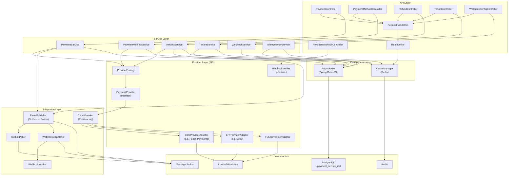
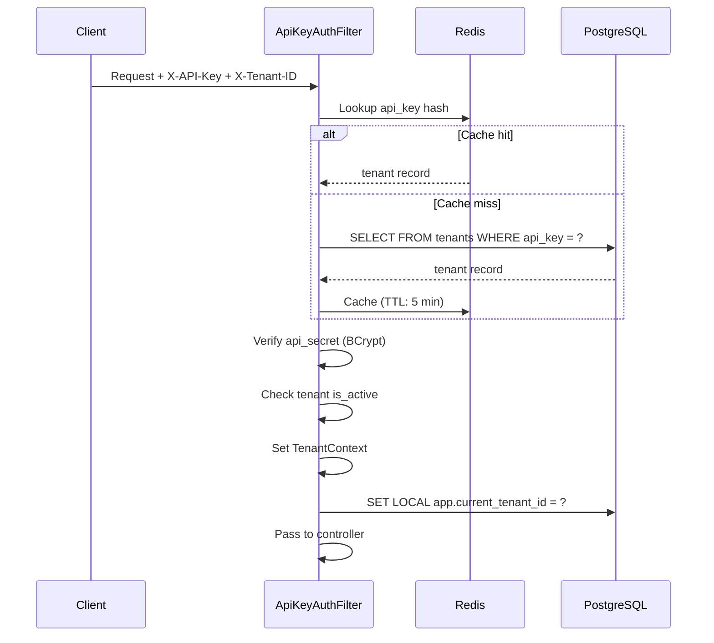
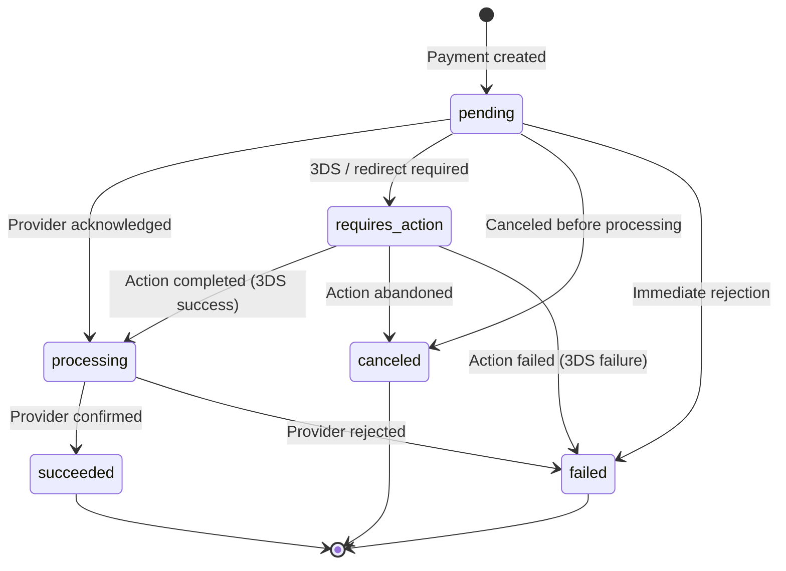
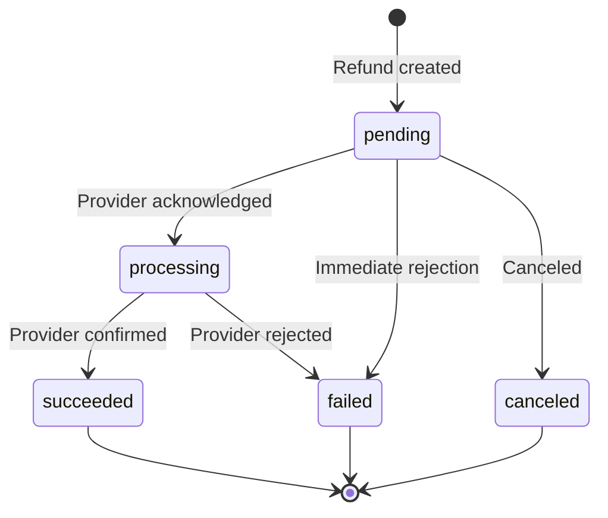

# Payment Service — Architecture Design

## 1. Overview

The Payment Service is the lower-level service in the Payment Gateway Platform. It provides a **provider-agnostic abstraction** over external payment processors, exposing a unified REST API for payment creation, refunds, payment method management, and outgoing webhook dispatch.

**Key responsibilities:**
- Process one-time and recurring payments via pluggable provider adapters
- Manage tokenised payment methods (cards, bank accounts, digital wallets)
- Process full and partial refunds
- Receive and verify incoming webhooks from payment providers
- Dispatch outgoing webhooks to registered client endpoints
- Manage tenant registration, configuration, and API key rotation
- Enforce idempotency on all mutating operations

**What it does NOT do:**
- Subscription lifecycle management (Billing Service)
- Plan/coupon/discount logic (Billing Service)
- Invoice generation or PDF hosting (Billing Service)
- Usage metering (Billing Service)

---

## 2. Internal Architecture

The Payment Service follows a **modular monolith** architecture using hexagonal (ports-and-adapters) principles. All provider-specific logic is isolated behind Service Provider Interface (SPI) boundaries.

### Layered Architecture



### Package Structure

```
com.enviro.payment/
├── api/
│   ├── controller/          # REST controllers
│   ├── dto/
│   │   ├── request/         # Inbound DTOs (records)
│   │   └── response/        # Outbound DTOs (records)
│   ├── mapper/              # MapStruct mappers
│   └── validation/          # Custom validators (@ValidCurrency, @ValidAmount)
├── domain/
│   ├── model/               # JPA entities (Payment, Refund, PaymentMethod, Tenant, etc.)
│   ├── enums/               # PaymentStatus, RefundStatus, PaymentMethodType, etc.
│   └── event/               # Domain event records
├── service/
│   ├── PaymentService.java          # Interface
│   ├── PaymentMethodService.java    # Interface
│   ├── RefundService.java           # Interface
│   ├── TenantService.java           # Interface
│   ├── WebhookService.java          # Interface
│   ├── IdempotencyService.java      # Interface
│   └── impl/                        # All implementations
├── provider/
│   ├── PaymentProvider.java         # SPI interface
│   ├── WebhookVerifier.java         # SPI interface
│   ├── ProviderFactory.java         # Strategy + Factory
│   ├── ProviderRoutingService.java  # Provider selection logic (routes by payment type, tenant config)
│   ├── ProviderCapability.java      # Enum: ONE_TIME, RECURRING, REFUND, TOKENIZE, etc.
│   ├── model/                       # Provider-agnostic models (ProviderPaymentRequest, etc.)
│   └── adapter/
│       ├── peach/                   # Peach Payments adapter (reference impl)
│       │   ├── PeachPaymentProvider.java
│       │   ├── PeachWebhookVerifier.java
│       │   ├── PeachMapper.java
│       │   └── PeachConfig.java
│       └── ozow/                    # Ozow adapter (reference impl)
│           ├── OzowPaymentProvider.java
│           ├── OzowWebhookVerifier.java
│           ├── OzowMapper.java
│           └── OzowConfig.java
├── integration/
│   ├── messaging/
│   │   ├── EventPublisher.java
│   │   └── EventConsumer.java       # DLQ handler
│   ├── outbox/
│   │   ├── OutboxEvent.java         # Outbox entity
│   │   ├── OutboxRepository.java
│   │   └── OutboxPoller.java        # Polls outbox table, relays to message broker
│   ├── circuitbreaker/
│   │   └── ProviderCircuitBreaker.java  # Resilience4j circuit breaker for provider calls
│   └── webhook/
│       ├── WebhookDispatcher.java
│       ├── WebhookWorker.java
│       └── WebhookSigner.java
├── repository/                      # Spring Data JPA repositories
├── config/
│   ├── DatabaseConfig.java
│   ├── RedisConfig.java
│   ├── MessagingConfig.java
│   ├── SecurityConfig.java
│   └── WebClientConfig.java
├── security/
│   ├── ApiKeyAuthenticationFilter.java
│   ├── TenantContext.java
│   └── RateLimitFilter.java
├── exception/
│   ├── GlobalExceptionHandler.java
│   ├── PaymentException.java
│   ├── PaymentNotFoundException.java
│   ├── TenantNotFoundException.java
│   ├── ProcessorException.java
│   ├── IdempotencyConflictException.java
│   └── InvalidPaymentMethodException.java
└── util/
    ├── CryptoUtil.java
    ├── WebhookSignatureUtil.java
    └── RetryUtil.java
```

---

## 3. Provider Abstraction Layer (SPI)

### PaymentProvider Interface

```java
public interface PaymentProvider {

    /** Unique identifier for this provider (e.g., "peach_payments", "ozow") */
    String getProviderId();

    /** Capabilities this provider supports */
    Set<ProviderCapability> getCapabilities();

    /** Initiate a payment */
    ProviderPaymentResponse createPayment(ProviderPaymentRequest request);

    /** Query payment status from the provider */
    ProviderPaymentStatus getPaymentStatus(String providerPaymentId);

    /** Cancel a pending payment (if supported) */
    ProviderCancelResponse cancelPayment(String providerPaymentId);

    /** Create a refund */
    ProviderRefundResponse createRefund(ProviderRefundRequest request);

    /** Query refund status */
    ProviderRefundStatus getRefundStatus(String providerRefundId);

    /** Create / tokenise a payment method */
    ProviderPaymentMethod createPaymentMethod(ProviderPaymentMethodRequest request);

    /** Retrieve a payment method from the provider */
    ProviderPaymentMethod getPaymentMethod(String providerMethodId);

    /** Delete a payment method from the provider */
    void deletePaymentMethod(String providerMethodId);
}
```

### ProviderCapability Enum

```java
public enum ProviderCapability {
    ONE_TIME_PAYMENT,       // Single payments
    RECURRING_PAYMENT,      // Token-based recurring charges
    REFUND_FULL,            // Full refunds
    REFUND_PARTIAL,         // Partial refunds
    TOKENIZE_CARD,          // Card tokenisation
    TOKENIZE_BANK_ACCOUNT,  // Bank account tokenisation
    THREE_D_SECURE,         // 3DS authentication
    REDIRECT_FLOW,          // Redirect-based payment (hosted checkout)
    WEBHOOK_NOTIFICATIONS,  // Provider sends webhooks
    DIGITAL_WALLET,         // Apple Pay, Google Pay, Samsung Pay
    BNPL                    // Buy Now Pay Later
}
```

### WebhookVerifier Interface

```java
public interface WebhookVerifier {

    /** Provider ID this verifier handles */
    String getProviderId();

    /** Verify the webhook signature/hash */
    boolean verifySignature(String payload, Map<String, String> headers);

    /** Parse the raw webhook into a normalised event */
    ProviderWebhookEvent parseEvent(String payload, Map<String, String> headers);
}
```

### ProviderFactory

```java
@Component
public class ProviderFactory {

    private final Map<String, PaymentProvider> providers;
    private final Map<String, WebhookVerifier> verifiers;

    public ProviderFactory(List<PaymentProvider> providerList,
                           List<WebhookVerifier> verifierList) {
        this.providers = providerList.stream()
            .collect(Collectors.toMap(PaymentProvider::getProviderId, Function.identity()));
        this.verifiers = verifierList.stream()
            .collect(Collectors.toMap(WebhookVerifier::getProviderId, Function.identity()));
    }

    public PaymentProvider getProvider(String providerId) {
        return Optional.ofNullable(providers.get(providerId))
            .orElseThrow(() -> new ProcessorException("Unknown provider: " + providerId));
    }

    public WebhookVerifier getVerifier(String providerId) {
        return Optional.ofNullable(verifiers.get(providerId))
            .orElseThrow(() -> new ProcessorException("No webhook verifier for: " + providerId));
    }

    public Set<String> getAvailableProviders() {
        return Collections.unmodifiableSet(providers.keySet());
    }

    public boolean supportsCapability(String providerId, ProviderCapability capability) {
        return getProvider(providerId).getCapabilities().contains(capability);
    }
}
```

New providers are added by:
1. Implementing `PaymentProvider` and `WebhookVerifier`
2. Annotating with `@Component`
3. Spring auto-discovers them via constructor injection into `ProviderFactory`
4. No factory code changes needed

---

## 4. Service Components

### PaymentService

**Responsibilities:** Create payments, query payment status, cancel payments, handle provider callbacks.

**Key flows:**
- **Create Payment:** Validate → check idempotency → resolve provider → call `provider.createPayment()` → persist → publish event → return
- **Provider Callback:** Verify signature → parse event → update payment status → publish event → trigger webhook dispatch
- **Cancel Payment:** Validate current status → call `provider.cancelPayment()` → update status → publish event

**Transactional guarantees:**
- `@Transactional` on all mutating operations
- Atomicity: either the full create (DB record + provider call + status update) succeeds, or it fully rolls back
- Event publishing uses the **Transactional Outbox Pattern**: events are written to an `outbox_events` table within the same transaction as the business entity change. A separate poller/CDC process relays them to the message broker, guaranteeing at-least-once delivery even if the broker is temporarily unavailable.

### PaymentMethodService

**Responsibilities:** CRUD for tokenised payment methods.

**Operations:**
| Operation | Description |
|-----------|-------------|
| `createPaymentMethod` | Tokenise via provider, store metadata (brand, last4, expiry) |
| `getPaymentMethod` | Retrieve by ID with tenant isolation |
| `listPaymentMethods` | List for a customer (by `customer_id`) |
| `updatePaymentMethod` | Update metadata (not the token itself) |
| `deletePaymentMethod` | Soft-delete locally + delete from provider |
| `setDefaultPaymentMethod` | Set `is_default = true` for one method, `false` for all others for that customer |

**PCI compliance:** Never stores full card numbers. Only stores tokenised references and card metadata (brand, last4, expiry_month, expiry_year, fingerprint).

### RefundService

**Responsibilities:** Create refunds, track refund status.

**Constraints:**
- `SUM(succeeded refunds for a payment) ≤ payment.amount` (enforced in service layer)
- Refund currency must match original payment currency
- Only `succeeded` payments can be refunded

### Provider Circuit Breaker

All outbound calls to payment providers are wrapped in a **Resilience4j circuit breaker** to prevent cascading failures when a provider is degraded or down.

**Configuration:**
| Parameter | Value |
|-----------|-------|
| Failure rate threshold | 50% |
| Slow call duration threshold | 5 seconds |
| Slow call rate threshold | 80% |
| Minimum number of calls | 10 |
| Wait duration in open state | 30 seconds |
| Permitted calls in half-open | 5 |

**Fallback behavior:**
- When the circuit is open, requests return `PROVIDER_TIMEOUT` (504) immediately
- The circuit is per-provider (e.g., `peach_payments` and `ozow` have independent circuits)
- Metrics are exposed via `/actuator/circuitbreakerevents`

### TenantService

**Responsibilities:** Register tenants, manage configuration, rotate API keys.

**Operations:**
| Operation | Description |
|-----------|-------------|
| `registerTenant` | Create tenant record, generate `api_key` + `api_secret_hash` |
| `getTenant` | Retrieve tenant details |
| `updateTenant` | Update name, processor config, rate limits |
| `rotateApiKey` | Generate new key, invalidate old (returns plaintext once) |
| `suspendTenant` | Set `is_active = false` |
| `activateTenant` | Set `is_active = true` |

**Processor config:** Each tenant stores provider credentials in a `processor_config` JSONB column:
```json
{
  "peach_payments": {
    "entity_id": "...",
    "access_token": "...",
    "webhook_secret": "..."
  },
  "ozow": {
    "site_code": "...",
    "private_key": "...",
    "api_key": "..."
  }
}
```

### WebhookService

**Responsibilities:** Manage webhook endpoint configurations, dispatch events.

**Operations:**
| Operation | Description |
|-----------|-------------|
| `createWebhookConfig` | Register a new endpoint URL + subscribed events + shared secret |
| `listWebhookConfigs` | List all configs for a tenant |
| `updateWebhookConfig` | Update URL, events, or active status |
| `deleteWebhookConfig` | Remove a webhook endpoint |
| `dispatchEvent` | Find matching configs → create `webhook_log` → enqueue for delivery |

### IdempotencyService

**Responsibilities:** Prevent duplicate payment/refund processing.

**Flow:**
1. Check Redis cache for idempotency key
2. If found → verify request hash matches → return cached response
3. If found but hash differs → throw `IdempotencyConflictException` (409)
4. If not found → check PostgreSQL (cache miss)
5. If not in DB → proceed with operation, store key + response in both Redis and PostgreSQL
6. Keys expire after 24 hours

---

## 5. Event Architecture

### Event Topics

| Topic | Producer | Consumer | Partitions | Key |
|-------|----------|----------|------------|-----|
| `payment.events` | PaymentService | Billing Service, WebhookDispatcher | 12 | `tenant_id` |
| `refund.events` | RefundService | Billing Service, WebhookDispatcher | 6 | `tenant_id` |
| `payment-method.events` | PaymentMethodService | Billing Service, WebhookDispatcher | 6 | `tenant_id` |
| `payment.events.dlq` | DLQ handler | Ops tooling | 3 | `original_key` |

### Event Envelope (CloudEvents)

```json
{
  "specversion": "1.0",
  "id": "evt_a1b2c3d4-e5f6-7890-abcd-ef1234567890",
  "source": "payment-service",
  "type": "payment.succeeded",
  "time": "2026-03-25T10:30:00Z",
  "datacontenttype": "application/json",
  "subject": "pay_...",
  "tenantid": "tn_...",
  "traceparent": "00-abc123-def456-01",
  "data": {
    "id": "pay_...",
    "tenant_id": "tn_...",
    "amount": 15000,
    "currency": "ZAR",
    "status": "succeeded",
    "provider": "peach_payments",
    "customer_email": "user@example.co.za"
  }
}
```

### Event Types

| Event Type | Trigger |
|-----------|---------|
| `payment.created` | Payment record created, pending provider response |
| `payment.processing` | Provider acknowledged, processing |
| `payment.succeeded` | Provider confirmed success |
| `payment.failed` | Provider reported failure |
| `payment.canceled` | Payment canceled before completion |
| `payment.requires_action` | 3DS or redirect required |
| `refund.created` | Refund initiated |
| `refund.processing` | Provider processing refund |
| `refund.succeeded` | Refund completed |
| `refund.failed` | Refund failed |
| `payment_method.attached` | New payment method tokenised |
| `payment_method.detached` | Payment method removed |
| `payment_method.updated` | Payment method metadata updated |
| `payment_method.expired` | Card expiry reached |

---

## 6. Security Architecture

### Authentication Flow



### Rate Limiting

Redis-based sliding window rate limiter:
- Default: 500 requests/minute per tenant (configurable per tenant)
- Response headers: `X-RateLimit-Limit`, `X-RateLimit-Remaining`, `X-RateLimit-Reset`
- Exceeded: HTTP 429 with `Retry-After` header

### Encryption

| Data | At Rest | In Transit |
|------|---------|-----------|
| Provider credentials | AES-256-GCM (application-level) | TLS 1.2+ (1.3 preferred) |
| API key secrets | BCrypt (cost 12+) | TLS 1.2+ (1.3 preferred) |
| Card metadata (last4, brand) | PostgreSQL TDE / volume encryption | TLS 1.2+ (1.3 preferred) |
| Webhook shared secrets | AES-256-GCM | TLS 1.2+ (1.3 preferred) |
| All API traffic | — | TLS 1.2 minimum, 1.3 preferred |

---

## 7. Configuration

### Application Properties

```yaml
server:
  port: 8080
  compression:
    enabled: true

spring:
  application:
    name: payment-service
  datasource:
    url: ${DATABASE_URL:jdbc:postgresql://localhost:5432/payment_service_db}
    username: ${DATABASE_USERNAME:payment_service}
    password: ${DATABASE_PASSWORD}
    hikari:
      maximum-pool-size: 20
      minimum-idle: 5
      connection-timeout: 30000
  jpa:
    hibernate:
      ddl-auto: validate
    properties:
      hibernate.default_schema: public
  flyway:
    enabled: true
    locations: classpath:db/migration
  data:
    redis:
      host: ${REDIS_HOST:localhost}
      port: ${REDIS_PORT:6379}
      password: ${REDIS_PASSWORD:}
      timeout: 2000ms
  # Message broker configuration (broker-specific settings go here)
  # Example connection: ${BROKER_CONNECTION:localhost:9092}
  # Producer: acks=all, retries=3, key-serializer=StringSerializer, value-serializer=JsonSerializer
  # Consumer: group-id=payment-service, auto-offset-reset=earliest

management:
  endpoints:
    web:
      exposure:
        include: health, info, metrics, prometheus
  endpoint:
    health:
      show-details: when_authorized
      probes:
        enabled: true

logging:
  level:
    com.enviro.payment: INFO
    org.hibernate.SQL: DEBUG
```

### Profiles

| Profile | Purpose | Providers |
|---------|---------|-----------|
| `default` / `local` | Local development | WireMock stubs |
| `dev` | Development environment | Provider sandbox APIs |
| `staging` | Pre-production | Provider sandbox APIs |
| `prod` | Production | Live provider APIs |

---

## 8. Error Handling

### Error Response Format

```json
{
  "error": {
    "code": "PAYMENT_NOT_FOUND",
    "message": "Payment with ID pay_abc123 not found",
    "details": {},
    "requestId": "req_xyz789",
    "timestamp": "2026-03-25T10:30:00Z"
  }
}
```

### Error Codes

| Code | HTTP Status | Description |
|------|-------------|-------------|
| `INVALID_API_KEY` | 401 | API key not found or invalid |
| `TENANT_SUSPENDED` | 403 | Tenant account is suspended |
| `RATE_LIMIT_EXCEEDED` | 429 | Too many requests |
| `PAYMENT_NOT_FOUND` | 404 | Payment ID not found |
| `REFUND_NOT_FOUND` | 404 | Refund ID not found |
| `PAYMENT_METHOD_NOT_FOUND` | 404 | Payment method ID not found |
| `TENANT_NOT_FOUND` | 404 | Tenant ID not found |
| `IDEMPOTENCY_CONFLICT` | 409 | Idempotency key reused with different params |
| `INVALID_PAYMENT_STATE` | 422 | Operation not valid for current payment status |
| `REFUND_EXCEEDS_AMOUNT` | 422 | Total refunds would exceed payment amount |
| `PROVIDER_ERROR` | 502 | Payment provider returned an error |
| `PROVIDER_TIMEOUT` | 504 | Payment provider did not respond in time |
| `VALIDATION_ERROR` | 400 | Request validation failed |

---

## 9. Entity Relationship Diagram

```mermaid
erDiagram
    tenants ||--o{ payments : "has"
    tenants ||--o{ payment_methods : "has"
    tenants ||--o{ refunds : "has"
    tenants ||--o{ payment_events : "has"
    tenants ||--o{ webhook_configs : "has"
    tenants ||--o{ webhook_logs : "has"
    tenants ||--o{ idempotency_keys : "has"

    payments ||--o{ refunds : "has"
    payments ||--o{ payment_events : "references"
    payments ||--o{ webhook_logs : "references"
    payment_methods ||--o{ payments : "used by"
    payment_methods ||--o{ payment_events : "references"

    webhook_logs ||--o{ webhook_deliveries : "has"

    refunds ||--o{ payment_events : "references"
    refunds ||--o{ webhook_logs : "references"

    tenants {
        uuid id PK
        varchar name
        varchar api_key UK
        varchar api_secret_hash
        jsonb processor_config
        integer rate_limit_per_minute
        boolean is_active
        timestamp created_at
        timestamp updated_at
    }

    payments {
        uuid id PK
        uuid tenant_id FK
        uuid payment_method_id FK
        varchar idempotency_key UK
        varchar provider
        varchar provider_payment_id
        decimal amount
        varchar currency
        varchar status
        varchar payment_type
        jsonb metadata
        text description
        varchar customer_id
        varchar customer_email
        varchar customer_name
        timestamp processed_at
        timestamp created_at
        timestamp updated_at
    }

    payment_methods {
        uuid id PK
        uuid tenant_id FK
        varchar customer_id
        varchar provider
        varchar provider_method_id
        varchar method_type
        jsonb card_details
        jsonb bank_details
        boolean is_default
        boolean is_active
        timestamp expires_at
        timestamp created_at
        timestamp updated_at
    }

    refunds {
        uuid id PK
        uuid payment_id FK
        uuid tenant_id FK
        varchar idempotency_key UK
        varchar provider_refund_id
        decimal amount
        varchar currency
        varchar status
        text reason
        jsonb metadata
        timestamp processed_at
        timestamp created_at
        timestamp updated_at
    }

    payment_events {
        uuid id PK
        uuid tenant_id FK
        uuid payment_id FK
        uuid refund_id FK
        uuid payment_method_id FK
        varchar event_type
        varchar status
        jsonb payload
        timestamp created_at
    }

    webhook_configs {
        uuid id PK
        uuid tenant_id FK
        varchar url
        varchar secret
        jsonb events
        boolean is_active
        timestamp created_at
        timestamp updated_at
    }

    webhook_logs {
        uuid id PK
        uuid tenant_id FK
        uuid payment_id FK
        uuid refund_id FK
        varchar event_type
        varchar status
        jsonb payload
        timestamp created_at
    }

    webhook_deliveries {
        uuid id PK
        uuid webhook_log_id FK
        varchar url
        integer attempt_number
        integer response_status
        text response_body
        text error_message
        timestamp attempted_at
        timestamp next_retry_at
    }

    idempotency_keys {
        uuid tenant_id PK_FK
        varchar key PK
        varchar request_path
        varchar request_hash
        integer response_status
        jsonb response_body
        timestamp expires_at
        timestamp created_at
    }
```

---

## 10. State Machines

### Payment Status



**Valid transitions:**
| From | To |
|------|----|
| `pending` | `processing`, `requires_action`, `canceled`, `failed` |
| `requires_action` | `processing`, `canceled`, `failed` |
| `processing` | `succeeded`, `failed` |

### Refund Status



---

## 11. Testing Strategy

### Test Pyramid

| Level | Scope | Tools | Coverage Target |
|-------|-------|-------|-----------------|
| **Unit** | Services, mappers, validators | JUnit 5, Mockito, AssertJ | 90% line / 85% branch |
| **Property-based** | Amount calculations, idempotency, signatures | jqwik | Key invariants |
| **Integration** | Repositories, controllers, messaging | Testcontainers (PostgreSQL, Redis, message broker), MockMvc | All endpoints |
| **Contract** | Provider adapter contracts | WireMock, Pact | All provider methods |
| **E2E** | Full payment lifecycle | Testcontainers + REST Assured | Happy path + error paths |

### Test Package Structure

```
src/test/java/com/enviro/payment/
├── unit/
│   ├── service/impl/        # Service unit tests
│   ├── provider/adapter/    # Provider adapter unit tests
│   ├── mapper/              # MapStruct mapper tests
│   └── util/                # Utility tests
├── property/                # jqwik property-based tests
├── integration/
│   ├── controller/          # MockMvc endpoint tests
│   ├── repository/          # Testcontainers DB tests
│   └── messaging/           # Messaging integration tests
├── contract/
│   └── provider/            # WireMock contract tests
└── e2e/                     # Full lifecycle tests
```

### Property-Based Test Examples

```java
@Property
void refundAmountNeverExceedsPaymentAmount(
        @ForAll @BigDecimalRange(min = "0.01", max = "999999.99") BigDecimal paymentAmount,
        @ForAll @IntRange(min = 1, max = 10) int refundCount) {
    // Sum of all refunds must never exceed original payment amount
}

@Property
void idempotencyKeyAlwaysReturnsSameResult(
        @ForAll @StringLength(min = 1, max = 255) String key,
        @ForAll @BigDecimalRange(min = "0.01", max = "999999.99") BigDecimal amount) {
    // Same key + same params = same result
}

@Property
void webhookSignatureIsVerifiable(
        @ForAll @StringLength(min = 10, max = 1000) String payload,
        @ForAll @StringLength(min = 32, max = 64) String secret) {
    // sign(payload, secret) is always verifiable with verify(payload, signature, secret)
}
```
