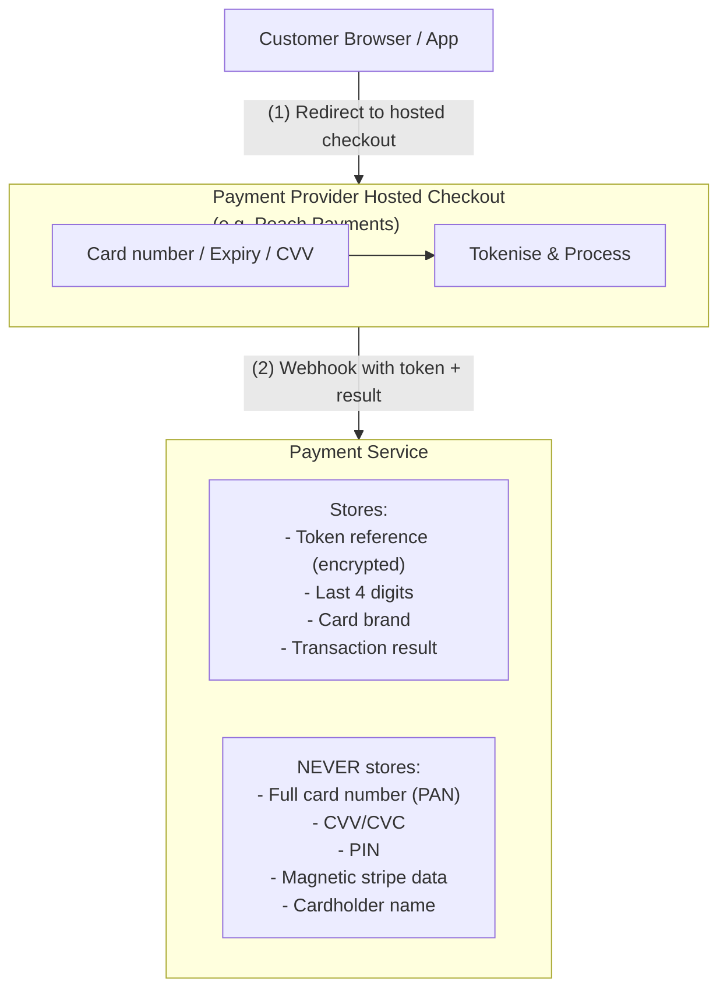
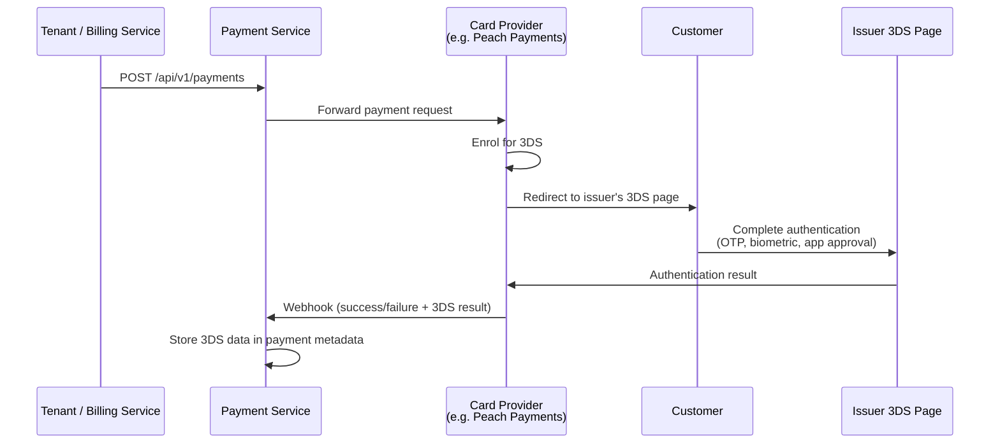
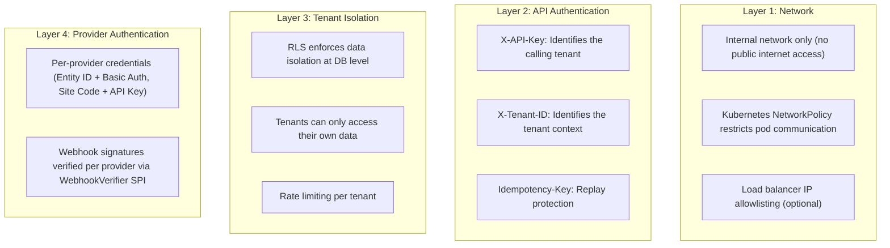
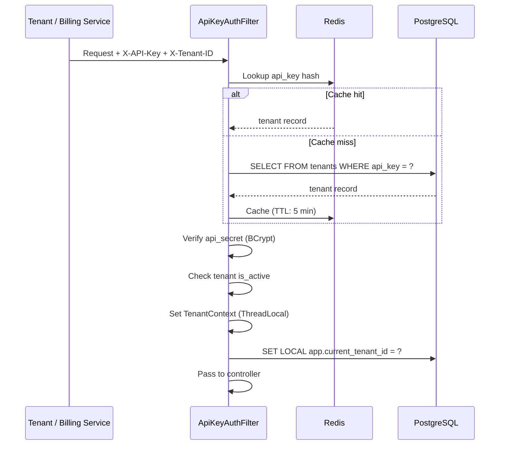
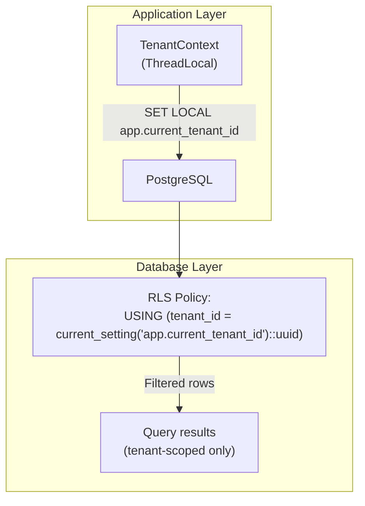

# Payment Service — Compliance & Security Guide

| Field            | Value                                      |
|------------------|--------------------------------------------|
| **Version**      | 1.0                                        |
| **Date**         | 2026-03-25                                 |
| **Status**       | Draft                                      |
| **Reviewers**    | Security Team, Compliance, Legal           |

---

## Table of Contents

1. [Regulatory Landscape](#1-regulatory-landscape)
2. [PCI DSS Compliance (SAQ-A)](#2-pci-dss-compliance-saq-a)
3. [3D Secure Implementation](#3-3d-secure-implementation)
4. [POPIA Compliance](#4-popia-compliance)
5. [Encryption](#5-encryption)
6. [Authentication & Access Control](#6-authentication--access-control)
7. [Multi-Tenancy & Data Isolation (RLS)](#7-multi-tenancy--data-isolation-rls)
8. [Secret & Key Management](#8-secret--key-management)
9. [Webhook Security](#9-webhook-security)
10. [Audit Logging](#10-audit-logging)
11. [Data Retention & Disposal](#11-data-retention--disposal)
12. [Incident Response](#12-incident-response)
13. [Security Testing](#13-security-testing)
14. [Compliance Checklist](#14-compliance-checklist)

---

## 1. Regulatory Landscape

Operating a payment service in South Africa requires compliance with multiple regulatory frameworks:

| Regulation                                       | Authority                          | Relevance to Payment Service                      |
|--------------------------------------------------|------------------------------------|---------------------------------------------------|
| **PCI DSS**                                      | PCI Security Standards Council     | Mandatory — we handle card payment tokens          |
| **POPIA** (Protection of Personal Information Act) | Information Regulator (SA)       | We process customer emails, IPs, payment metadata |
| **NPA** (National Payment System Act 78 of 1998) | SARB                               | Regulates payment systems and participants         |
| **ECTA** (Electronic Communications & Transactions Act) | DCDT                         | Legal framework for electronic transactions        |
| **FICA** (Financial Intelligence Centre Act)     | FIC                                | Anti-money laundering, KYC (provider-level)        |
| **Consumer Protection Act**                      | NCC                                | Consumer rights in electronic transactions         |

### Scope

This guide covers **technical compliance controls implemented by the Payment Service**. Business-level obligations (merchant agreements, provider contracts, regulatory registrations) are handled by legal and compliance teams.

For billing-specific compliance (API key security, subscription data retention, billing audit logging), see the [Billing Service Compliance & Security Guide](../billing-service/compliance-security-guide.md).

---

## 2. PCI DSS Compliance (SAQ-A)

### 2.1 Scope Reduction Strategy

The Payment Service is designed to **minimise PCI DSS scope** by never directly handling raw cardholder data (CHD). This qualifies the service for **PCI DSS SAQ-A** (the simplest compliance level).



### 2.2 What We Store vs. What We Don't

| Data Element                  | Stored? | Where                          | Notes                                    |
|-------------------------------|---------|--------------------------------|------------------------------------------|
| Full Primary Account Number   | **No**  | —                              | Never touches our systems                |
| Card Verification Value (CVV) | **No**  | —                              | Entered on provider's hosted page only   |
| PIN / PIN block               | **No**  | —                              | Not applicable (card-not-present)        |
| Magnetic stripe data          | **No**  | —                              | Not applicable (card-not-present)        |
| Cardholder name               | **No**  | —                              | Not stored                               |
| Expiry month/year             | **Yes** | `payment_methods.card_details` | For display only, not sensitive per PCI  |
| Token reference               | **Yes** | `payment_methods.provider_method_id` | AES-256-GCM encrypted at rest     |
| Last 4 digits                 | **Yes** | `payment_methods.card_details` | For customer identification              |
| Card brand (Visa, MC, etc.)   | **Yes** | `payment_methods.card_details` | For UI display and routing               |
| Card fingerprint              | **Yes** | `payment_methods.card_details` | For duplicate card detection             |

### 2.3 SAQ-A Requirements

| SAQ-A Requirement                                      | Implementation                                                       |
|--------------------------------------------------------|----------------------------------------------------------------------|
| All payment processing outsourced to PCI-validated providers | All card providers must be PCI DSS Level 1 (e.g., Peach Payments) |
| No electronic storage of cardholder data               | Only tokens, last-4, brand, fingerprint stored                       |
| Hosted checkout — no card input on our pages           | Provider's hosted checkout or redirect flow                          |
| Confirm PCI DSS compliance of providers annually       | Verify each card provider's AOC annually                             |
| Maintain information security policies                 | This document + internal security policies                           |
| Restrict physical access to systems                    | Cloud-hosted, no physical servers                                    |

### 2.4 Tokenisation

- **Initial payment**: Customer enters card details on the provider's hosted checkout (e.g., Peach Payments)
- **Token creation**: Provider returns a token (e.g., `registrationId`) after successful payment
- **Token storage**: We encrypt the token with AES-256-GCM and store in `payment_methods.provider_method_id` alongside `last_four`, `card_brand`, `customer_id`
- **Recurring charges**: Token used to charge via provider API without customer re-entering card details
- **Token lifecycle**: Valid until card expires, is replaced, or customer/tenant requests deletion
- **Token deletion**: Soft-delete locally (`is_active=false`) + delete from provider

### 2.5 EFT Providers and PCI DSS

EFT providers (e.g., Ozow) process bank transfer payments — **outside PCI DSS scope entirely**. Bank credentials are handled on the provider's hosted payment page and never touch our systems.

---

## 3. 3D Secure Implementation

3D Secure (3DS) is **mandatory** for card-not-present (CNP) transactions in South Africa. It provides additional authentication by requiring the cardholder to verify their identity with the card issuer.

### 3.1 3D Secure Flow



### 3.2 3D Secure Versions

| Version  | Status                  | Notes                                           |
|----------|-------------------------|-------------------------------------------------|
| 3DS 1.0  | Deprecated              | No longer supported by most SA issuers          |
| 3DS 2.0  | **Current standard**    | Better UX, frictionless authentication support  |
| 3DS 2.1  | Supported               | Enhanced data exchange, risk-based auth         |
| 3DS 2.2  | Supported               | SCA (Strong Customer Authentication) compliant  |

The card provider (e.g., Peach Payments) handles 3DS version negotiation with the card issuer. The Payment Service does not implement 3DS logic directly.

### 3.3 3D Secure Outcomes and Liability Shift

| Outcome           | Meaning                                              | Liability Shift |
|--------------------|------------------------------------------------------|-----------------|
| `AUTHENTICATED`    | Cardholder successfully authenticated                | To issuer       |
| `ATTEMPT`          | Authentication attempted but not completed           | To issuer       |
| `FRICTIONLESS`     | Risk-based auth approved without challenge           | To issuer       |
| `FAILED`           | Authentication failed                                | To merchant     |
| `UNAVAILABLE`      | 3DS not available for this card/issuer               | To merchant     |

### 3.4 What We Store

3DS authentication results are stored in the payment's `metadata` JSONB field:

```json
{
  "threeDSecure": {
    "version": "2.2.0",
    "eci": "05",
    "authenticationResult": "AUTHENTICATED",
    "dsTransId": "f25084f0-5b16-4c0a-ae5d-b24808571712"
  }
}
```

This data is critical for **dispute resolution** — authenticated transactions with liability shift protect Enviro from chargebacks.

---

## 4. POPIA Compliance

The Protection of Personal Information Act (POPIA) governs how the Payment Service collects, processes, stores, and shares personal information.

### 4.1 Personal Information Processed by the Payment Service

| Data Element            | Classification     | Purpose                                | Retention         |
|-------------------------|--------------------|----------------------------------------|--------------------|
| Customer email          | Personal info      | Payment receipts, notifications        | Life of account    |
| Customer name           | Personal info      | Payment display                        | Life of account    |
| Customer ID (external)  | Indirect identifier| Link payments to tenant's customers    | Life of account    |
| Payment amounts         | Financial info     | Transaction processing                 | 7 years (SARB)     |
| IP address              | Personal info      | Security logging, fraud detection      | 90 days            |
| Payment token           | Pseudonymised      | Recurring charges                      | Until card expires |
| Last 4 card digits      | Not personal info  | Customer identification                | With token         |

### 4.2 POPIA Principles Applied

| POPIA Condition             | Implementation                                                        |
|-----------------------------|-----------------------------------------------------------------------|
| **Accountability**          | Data processing activities documented; DPO appointed by Enviro        |
| **Processing limitation**   | Only process data necessary for payment operations                    |
| **Purpose specification**   | Data collected solely for payment processing                          |
| **Further processing**      | No data shared beyond payment providers and the Billing Service       |
| **Information quality**     | Data validated on input; stale tokens marked inactive                 |
| **Openness**                | Privacy policy covers payment data processing                         |
| **Security safeguards**     | Encryption, RLS, access controls, audit logging                       |
| **Data subject participation** | Customers can request data export/deletion via tenant              |

### 4.3 Data Subject Rights

| Right                        | Implementation                                                     |
|------------------------------|--------------------------------------------------------------------|
| **Right to access**          | Export all payment data for a given customer ID (via tenant API)   |
| **Right to correction**      | Customer email/name can be updated via tenant                      |
| **Right to deletion**        | Soft-delete + anonymise after retention period                     |
| **Right to object**          | Deactivate payment tokens, stop recurring charges                  |

### 4.4 Cross-Border Data Transfer

- Payment providers (Peach Payments, Ozow) process data within South Africa
- The Payment Service runs on SA-based infrastructure
- No cardholder or personal data is transferred outside SA unless required by card schemes (Visa/Mastercard) for authorisation — handled by providers
- When onboarding a new provider, verify SA data processing or obtain POPIA cross-border authorisation

### 4.5 Data Minimisation

- **Do not store** what providers store (full card numbers, bank credentials)
- **Mask in logs**: Customer emails masked (`j***@example.com`), tokens truncated
- **Metadata is optional**: Tenants decide what metadata to include; we store but don't require PII
- **No marketing data**: The service does not collect data for marketing purposes

---

## 5. Encryption

### 5.1 Encryption in Transit

| Connection                           | Protocol    | Minimum Version | Notes                          |
|--------------------------------------|-------------|-----------------|--------------------------------|
| Tenants / Billing Service → Payment Service | TLS  | 1.2             | TLS 1.3 preferred              |
| Payment Service → Payment Providers  | TLS         | 1.2             | Enforced by providers          |
| Payment Service → PostgreSQL         | TLS         | 1.2             | `sslmode=verify-full`          |
| Payment Service → Redis              | TLS         | 1.2             | `ssl=true`                     |
| Payment Service → Message Broker     | TLS + SASL  | 1.2             | SASL_SSL protocol              |

**Configuration:**
- Weak cipher suites disabled (no RC4, DES, 3DES, MD5)
- Certificate validation enforced on all outbound connections
- Internal service-to-service (Payment Service ↔ Billing Service) uses mTLS where supported

### 5.2 Encryption at Rest

| Data Store       | Encryption Method                    | Key Management               |
|------------------|--------------------------------------|------------------------------|
| PostgreSQL       | Transparent Data Encryption (TDE) or volume encryption | Cloud KMS / LUKS |
| Redis            | Volume-level encryption              | Cloud KMS / LUKS             |
| Message Broker     | Volume-level encryption              | Cloud KMS / LUKS             |
| Backups          | AES-256 encrypted backups            | Separate backup encryption key |
| Log files        | Volume-level encryption              | Cloud KMS / LUKS             |

### 5.3 Application-Level Encryption

Sensitive fields are additionally encrypted at the application level before storage:

| Field                                    | Encryption             | Notes                                     |
|------------------------------------------|------------------------|-------------------------------------------|
| `payment_methods.provider_method_id`     | AES-256-GCM            | Provider token encrypted before DB write  |
| `tenants.api_secret_hash`               | BCrypt (cost 12+)      | One-way hash, not reversible              |
| `tenants.processor_config`              | AES-256-GCM            | Provider credentials encrypted            |
| `webhook_configs.secret`                | AES-256-GCM            | Webhook shared secrets encrypted          |
| `payment_events.payload` (webhook raw)  | AES-256-GCM            | Raw webhook payloads for audit            |

**Key rotation**: Each encrypted value is stored with a key version identifier (`_v1`, `_v2`), enabling gradual re-encryption during key rotation without downtime.

---

## 6. Authentication & Access Control

### 6.1 Authentication Layers



### 6.2 API Key Authentication Flow



### 6.3 API Key Lifecycle

| Stage         | Process                                                            |
|---------------|--------------------------------------------------------------------|
| **Issuance**  | Admin generates key pair, registers in `tenants` table             |
| **Storage**   | API secret stored as BCrypt hash; plaintext delivered securely     |
| **Rotation**  | New key issued; old key remains valid for 24h grace period         |
| **Revocation**| Tenant marked `is_active = false`; all requests rejected           |
| **Audit**     | All key lifecycle events logged in `payment_events`                |

### 6.4 Rate Limiting

Redis-based sliding window rate limiter:
- Default: 500 requests/minute per tenant (configurable per tenant)
- Response headers: `X-RateLimit-Limit`, `X-RateLimit-Remaining`, `X-RateLimit-Reset`
- Exceeded: HTTP 429 with `Retry-After` header
- Tenant-specific overrides stored in `tenants.rate_limit_per_minute`

---

## 7. Multi-Tenancy & Data Isolation (RLS)

### 7.1 Row-Level Security Architecture

The Payment Service enforces data isolation at the **database level** using PostgreSQL Row-Level Security (RLS). This provides defence-in-depth beyond application-level filtering.



### 7.2 RLS Policy Summary

| Table               | RLS Enabled | Policy                                                    |
|---------------------|-------------|-----------------------------------------------------------|
| `tenants`           | No          | Admin-only table                                          |
| `payments`          | Yes         | `tenant_id = current_setting('app.current_tenant_id')`    |
| `payment_methods`   | Yes         | `tenant_id = current_setting('app.current_tenant_id')`    |
| `refunds`           | Yes         | `tenant_id = current_setting('app.current_tenant_id')`    |
| `payment_events`    | Yes         | `tenant_id = current_setting('app.current_tenant_id')`    |
| `webhook_configs`   | Yes         | `tenant_id = current_setting('app.current_tenant_id')`    |
| `webhook_logs`      | Yes         | `tenant_id = current_setting('app.current_tenant_id')`    |
| `webhook_deliveries`| No          | Accessed via FK to webhook_logs                           |
| `idempotency_keys`  | Yes         | `tenant_id = current_setting('app.current_tenant_id')`    |

### 7.3 Security Properties

- **Guaranteed isolation**: Even if application code omits a `WHERE tenant_id = ?` clause, RLS silently filters rows
- **Cross-tenant access prevention**: Attempting to access another tenant's payment returns empty results (not 403, preventing enumeration)
- **Admin bypass**: Admin operations (e.g., cross-tenant reports) use a separate DB role without RLS restrictions
- **INSERT protection**: `FOR INSERT WITH CHECK` policies prevent inserting rows for the wrong tenant

---

## 8. Secret & Key Management

### 8.1 Secrets Inventory

| Secret                        | Environment Variable              | Rotation Frequency               |
|-------------------------------|-----------------------------------|---------------------------------|
| Peach Payments credentials    | `PEACH_ENTITY_ID`, `PEACH_API_USERNAME`, `PEACH_API_PASSWORD` | Quarterly |
| Peach webhook secret          | `PEACH_WEBHOOK_SECRET`            | Quarterly                        |
| Ozow credentials              | `OZOW_SITE_CODE`, `OZOW_PRIVATE_KEY`, `OZOW_API_KEY` | Quarterly          |
| PostgreSQL password            | `DATABASE_PASSWORD`               | Quarterly                        |
| Redis password                 | `REDIS_PASSWORD`                  | Quarterly                        |
| Message broker credentials  | `BROKER_USERNAME`, `BROKER_PASSWORD` | Quarterly                        |
| Application encryption key    | `APP_ENCRYPTION_KEY`              | Annually                         |

> **Pattern for new providers**: Add environment variables following `{PROVIDER}_{CREDENTIAL}` naming convention (e.g., `YOCO_API_KEY`).

### 8.2 Secret Storage Hierarchy

**Recommended** (in order of preference):

1. **HashiCorp Vault** — Dynamic secrets, automatic rotation, audit trail, leasing
2. **Kubernetes Secrets** (encrypted at rest) + External Secrets Operator for Vault integration
3. **Cloud KMS** (AWS KMS, Azure Key Vault, GCP KMS)

**Not acceptable:**
- Secrets in `application.yml` / `application.properties` (plaintext)
- Secrets in Docker images or environment files committed to source control
- Secrets in CI/CD pipeline logs

### 8.3 Secret Injection Pattern (Kubernetes)

```yaml
apiVersion: apps/v1
kind: Deployment
metadata:
  name: payment-service
spec:
  template:
    spec:
      containers:
        - name: payment-service
          env:
            # Peach Payments (card provider)
            - name: PEACH_ENTITY_ID
              valueFrom:
                secretKeyRef:
                  name: provider-peach-credentials
                  key: entity-id
            - name: PEACH_API_USERNAME
              valueFrom:
                secretKeyRef:
                  name: provider-peach-credentials
                  key: username
            - name: PEACH_API_PASSWORD
              valueFrom:
                secretKeyRef:
                  name: provider-peach-credentials
                  key: password
            # Ozow (EFT provider)
            - name: OZOW_PRIVATE_KEY
              valueFrom:
                secretKeyRef:
                  name: provider-ozow-credentials
                  key: private-key
            # Infrastructure
            - name: DATABASE_PASSWORD
              valueFrom:
                secretKeyRef:
                  name: postgres-credentials
                  key: password
```

### 8.4 Key Rotation Procedure

1. Generate new secret/key
2. Update the secret store (Vault / K8s Secret)
3. Roll the deployment (pods pick up new secret on restart)
4. For API keys with grace periods: keep old key active for 24 hours
5. After grace period, deactivate old key
6. Log the rotation event

---

## 9. Webhook Security

### 9.1 Inbound Provider Webhooks

All provider webhooks arrive at `POST /api/v1/webhooks/{providerCode}` and are dispatched to the correct `WebhookVerifier` implementation.

**Security controls:**

| Control                          | Implementation                                           |
|----------------------------------|----------------------------------------------------------|
| **Signature verification**       | Every webhook verified via SPI before processing         |
| **Constant-time comparison**     | `MessageDigest.isEqual()` prevents timing attacks        |
| **IP allowlisting** (optional)   | Restrict webhook endpoints to provider IP ranges         |
| **Idempotent processing**        | Deduplicated by `provider_payment_id + event_type`       |
| **Quick response**               | Return 200 immediately; process asynchronously           |
| **Raw payload storage**          | Encrypted raw payload stored in `payment_events`         |
| **Replay protection**            | Check timestamp if provided; reject stale events         |
| **Error isolation**              | Webhook failures don't affect API availability           |

### 9.2 Outgoing Webhooks to Tenants

The Payment Service dispatches events to tenant-registered webhook endpoints:

| Control                          | Implementation                                           |
|----------------------------------|----------------------------------------------------------|
| **HMAC-SHA256 signing**          | All outgoing payloads signed with tenant's shared secret |
| **Signature format**             | `X-Webhook-Signature: t={timestamp},v1={hmac}`          |
| **Timestamp inclusion**          | Prevents replay attacks on tenant side                   |
| **Unique delivery ID**           | `X-Webhook-ID` header for deduplication                  |
| **Secret hashing**               | Webhook secrets stored as AES-256-GCM encrypted values   |
| **Endpoint validation**          | HTTPS required for webhook URLs                          |
| **Auto-disable**                 | Endpoints auto-disabled after 10+ consecutive failures   |

### 9.3 Webhook Processing Pipeline

```mermaid
graph LR
    Provider["Provider"] --> WC["ProviderWebhookController"]
    WC --> V["1. Read raw body"]
    V --> S["2. Verify signature<br/>(WebhookVerifier SPI)"]
    S --> R["3. Return 200 OK"]
    R --> P["4. Store in payment_events"]
    P --> M["5. Parse + map status"]
    M --> U["6. Update payment/refund"]
    U --> K["7. Publish event to broker"]
    K --> D["8. Dispatch to tenants"]
```



---

## 10. Audit Logging

### 10.1 Audit via payment_events Table

The Payment Service uses the `payment_events` table as its audit trail. Every significant action generates an event record.

**Event record fields:**

| Field              | Description                                          |
|--------------------|------------------------------------------------------|
| `id`               | Unique event ID (UUID)                               |
| `tenant_id`        | Owning tenant                                        |
| `payment_id`       | Related payment (nullable)                           |
| `refund_id`        | Related refund (nullable)                            |
| `payment_method_id`| Related payment method (nullable)                    |
| `event_type`       | What occurred (see below)                            |
| `status`           | Resulting status                                     |
| `payload`          | JSONB with event-specific details                    |
| `created_at`       | Timestamp (UTC)                                      |

### 10.2 Audited Event Types

| Category          | Event Types                                                         |
|-------------------|----------------------------------------------------------------------|
| **Payments**      | `payment.created`, `payment.processing`, `payment.succeeded`, `payment.failed`, `payment.canceled`, `payment.requires_action`, `payment.disputed` |
| **Refunds**       | `refund.created`, `refund.processing`, `refund.succeeded`, `refund.failed` |
| **Payment Methods** | `payment_method.attached`, `payment_method.detached`, `payment_method.updated`, `payment_method.expired` |
| **Webhooks**      | `webhook.received`, `webhook.signature_failed`, `webhook.duplicate`, `webhook.processed` |
| **Tenants**       | `tenant.created`, `tenant.updated`, `tenant.suspended`, `tenant.activated`, `tenant.key_rotated` |

### 10.3 Log Security

- `payment_events` is **append-only** — no updates or deletes (except retention cleanup)
- RLS ensures tenants can only see their own events
- **PII masking in application logs**: Customer emails masked (`j***@example.com`), tokens truncated
- **Full values in DB**: `payment_events.payload` stores encrypted full data for compliance
- **Log forwarding**: Application logs forwarded to centralised logging (ELK / Loki)

---

## 11. Data Retention & Disposal

### 11.1 Retention Schedule

| Data Category           | Table                | Retention Period          | Legal Basis                    |
|-------------------------|----------------------|---------------------------|--------------------------------|
| Payment records         | `payments`           | 7 years                   | SARB, Tax Act                  |
| Refund records          | `refunds`            | 7 years                   | SARB, Tax Act                  |
| Payment methods (tokens)| `payment_methods`    | Until card expiry + 90d   | PCI DSS minimisation           |
| Payment events          | `payment_events`     | 2 years                   | Dispute resolution             |
| Webhook configs         | `webhook_configs`    | Life of tenant            | Active configuration           |
| Webhook logs/deliveries | `webhook_logs`, `webhook_deliveries` | 90 days   | Debugging                      |
| Idempotency keys        | `idempotency_keys`   | 24 hours                  | Operational                    |
| Tenant records          | `tenants`            | Life of relationship + 2y | POPIA                          |

### 11.2 Automated Cleanup

```sql
-- Run daily via scheduled job
DELETE FROM idempotency_keys WHERE expires_at < NOW();
DELETE FROM webhook_deliveries WHERE attempted_at < NOW() - INTERVAL '90 days';
DELETE FROM webhook_logs WHERE created_at < NOW() - INTERVAL '90 days';
DELETE FROM payment_events WHERE created_at < NOW() - INTERVAL '2 years';
```

### 11.3 Right to Erasure (POPIA)

When a customer requests deletion (via tenant):

1. Check for active payment methods — deactivate all tokens
2. Delete tokens from payment providers (`provider.deletePaymentMethod()`)
3. For payment records within 7-year retention: **anonymise** PII (email, name, metadata) while preserving transaction amounts and dates
4. For records outside retention: full deletion
5. Log erasure request and actions in `payment_events`

> **Financial records cannot be fully deleted** during the SARB retention period. Anonymisation (removing PII while keeping amounts/dates) is the compliant approach.

---

## 12. Incident Response

### 12.1 Payment Security Incident Classification

| Severity     | Definition                                                      | Response Time      |
|--------------|-----------------------------------------------------------------|--------------------|
| **Critical** | Suspected data breach, unauthorised access to payment tokens    | Immediate          |
| **High**     | Webhook signature bypass, API key compromise                    | Within 1 hour      |
| **Medium**   | Unusual payment patterns, rate limit bypass attempts            | Within 4 hours     |
| **Low**      | Failed authentication attempts, minor config issues             | Next business day  |

### 12.2 Incident Response Steps

1. **Detect**: Automated alerting on security events (failed signature verifications, unusual volumes, error spikes)
2. **Contain**: Revoke compromised API keys, block suspicious IPs, disable affected provider integration if needed
3. **Assess**: Determine scope — which transactions, tenants, and providers are affected
4. **Notify**: Inform affected tenants. If cardholder data involved, notify payment providers and card schemes within required timeframes
5. **Remediate**: Patch vulnerability, rotate compromised credentials, update security controls
6. **Report**: Document in post-mortem. If POPIA-reportable (personal info breach), notify Information Regulator within 72 hours

### 12.3 POPIA Breach Notification

If personal information is compromised:
- Notify the **Information Regulator** as soon as reasonably possible (target: 72 hours)
- Notify **affected data subjects** via tenants
- Notification must include: nature of breach, estimated affected individuals, measures taken

---

## 13. Security Testing

### 13.1 Testing Schedule

| Test Type                     | Frequency      | Scope                                     |
|-------------------------------|----------------|-------------------------------------------|
| **Static analysis (SAST)**    | Every build    | Source code (SonarQube, Checkmarx)        |
| **Dependency scanning**       | Every build    | Third-party libraries (OWASP Dep Check, Snyk) |
| **Dynamic analysis (DAST)**   | Monthly        | Running application (OWASP ZAP)          |
| **Penetration testing**       | Annually       | Full service including webhook endpoints  |
| **Secret scanning**           | Every commit   | Git pre-commit hooks (gitleaks, truffleHog)|
| **Container scanning**        | Every build    | Docker images (Trivy)                    |

### 13.2 OWASP Top 10 Mitigations

| OWASP Risk                        | Mitigation                                                    |
|-----------------------------------|---------------------------------------------------------------|
| A01 - Broken Access Control       | RLS, API key scoping, tenant isolation                        |
| A02 - Cryptographic Failures      | TLS 1.2+, AES-256-GCM at rest, no plaintext secrets          |
| A03 - Injection                   | Parameterised queries (JPA/Hibernate), input validation       |
| A04 - Insecure Design             | Hexagonal architecture, threat modelling                      |
| A05 - Security Misconfiguration   | Hardened Spring Boot defaults, no debug endpoints in prod     |
| A06 - Vulnerable Components       | Automated dependency scanning, regular updates               |
| A07 - Authentication Failures     | BCrypt key hashing, constant-time comparison, key rotation    |
| A08 - Data Integrity Failures     | Webhook signature verification, idempotency enforcement       |
| A09 - Logging & Monitoring        | payment_events audit trail, centralised monitoring            |
| A10 - SSRF                        | No user-controlled URLs in outbound requests (except webhooks, which are admin-configured) |

### 13.3 Payment-Specific Security Tests

| Test Case                                    | Expected Result                              |
|----------------------------------------------|----------------------------------------------|
| Request without `X-API-Key`                  | 401 Unauthorized                             |
| Request with invalid API key                 | 401 Unauthorized                             |
| Access another tenant's payment by ID        | 404 Not Found (not 403)                      |
| Submit webhook with invalid signature        | 401 Unauthorized, logged as `webhook.signature_failed` |
| Replay a valid webhook                       | Deduplicated (idempotent, logged as `webhook.duplicate`) |
| Submit refund exceeding payment amount       | 422 `REFUND_EXCEEDS_AMOUNT`                  |
| SQL injection in metadata fields             | Parameterised query prevents execution       |
| XSS in customer email                        | Input validation rejects                     |
| Brute-force API key guessing                 | Rate-limited, IP blocked after threshold     |
| Provider token decryption with wrong key     | Decryption fails, exception logged           |

---

## 14. Compliance Checklist

### Pre-Launch Checklist

#### PCI DSS (SAQ-A)

- [ ] Verify current PCI DSS AOC for all card payment providers
- [ ] Confirm no raw card data stored, processed, or transmitted
- [ ] Verify hosted checkout integration (no iframes with card fields on our pages)
- [ ] Confirm tokenisation for all recurring card charges
- [ ] Document data flow diagram showing card data stays with providers
- [ ] Complete SAQ-A questionnaire

#### 3D Secure

- [ ] All card providers support 3DS 2.x
- [ ] 3DS authentication results stored in payment metadata
- [ ] Liability shift outcomes tracked for dispute resolution

#### POPIA

- [ ] Privacy impact assessment completed for payment processing
- [ ] Data processing agreements in place with each payment provider
- [ ] Privacy policy covers payment data processing
- [ ] Data retention schedule implemented
- [ ] Data subject access/deletion process documented
- [ ] Cross-border data transfer assessment completed (confirm SA-only)

#### Encryption & Security

- [ ] TLS 1.2+ enforced on all connections
- [ ] Database encryption at rest enabled
- [ ] AES-256-GCM for tokens and sensitive fields
- [ ] BCrypt for API key hashing
- [ ] Secret management solution deployed (Vault / K8s Secrets)
- [ ] Webhook signature verification for all providers

#### Multi-Tenancy

- [ ] RLS enabled on all tenant-scoped tables
- [ ] INSERT policies prevent cross-tenant data insertion
- [ ] Admin operations use separate DB role
- [ ] Cross-tenant access returns 404 (not 403)

#### Audit & Monitoring

- [ ] payment_events audit trail operational
- [ ] Log retention policies configured
- [ ] PII masking in application logs verified
- [ ] Centralised logging and monitoring operational
- [ ] Alerting for security events configured
- [ ] Incident response plan documented

#### Testing

- [ ] SAST in CI/CD pipeline
- [ ] Dependency scanning in CI/CD pipeline
- [ ] Secret scanning pre-commit hooks
- [ ] Initial penetration test completed
- [ ] Payment-specific security tests passing
- [ ] Container image scanning operational

---

## Related Documents

- [Architecture Design](./architecture-design.md) — Security architecture, authentication flow
- [Database Schema Design](./database-schema-design.md) — RLS policies, encryption columns
- [API Specification](./api-specification.yaml) — Security schemes, authentication headers
- [Payment Flow Diagrams](./payment-flow-diagrams.md) — Webhook verification flows
- [Provider Integration Guide](./provider-integration-guide.md) — Provider webhook security
- [Billing Service Compliance Guide](../billing-service/compliance-security-guide.md) — Billing-specific compliance
- [System Architecture](../shared/system-architecture.md) — Cross-service security
