# Payment Service — Flow Diagrams

| Field       | Value              |
|-------------|--------------------|
| **Version** | 1.0                |
| **Date**    | 2026-03-25         |
| **Status**  | Draft              |

---

## Table of Contents

1. [One-Time Card Payment (Redirect Flow)](#1-one-time-card-payment-redirect-flow)
2. [One-Time EFT Payment (Bank Redirect Flow)](#2-one-time-eft-payment-bank-redirect-flow)
3. [Recurring Token Charge](#3-recurring-token-charge)
4. [Refund Processing](#4-refund-processing)
5. [Provider Webhook Handling (Generic)](#5-provider-webhook-handling-generic)
6. [Card Provider Webhook (HMAC Signature)](#6-card-provider-webhook-hmac-signature)
7. [EFT Provider Webhook (Hash Verification)](#7-eft-provider-webhook-hash-verification)
8. [Outgoing Webhook Dispatch](#8-outgoing-webhook-dispatch)
9. [Idempotency Flow](#9-idempotency-flow)
10. [Payment Method CRUD](#10-payment-method-crud)
11. [Payment Status State Machine](#11-payment-status-state-machine)
12. [Refund Status State Machine](#12-refund-status-state-machine)

---

## 1. One-Time Card Payment (Redirect Flow)

Standard card payment where the customer is redirected to complete 3D Secure authentication via the resolved card provider.

> **Reference implementation:** The example uses Peach Payments as the card provider. Any provider implementing the `PaymentProvider` SPI follows the same sequence.

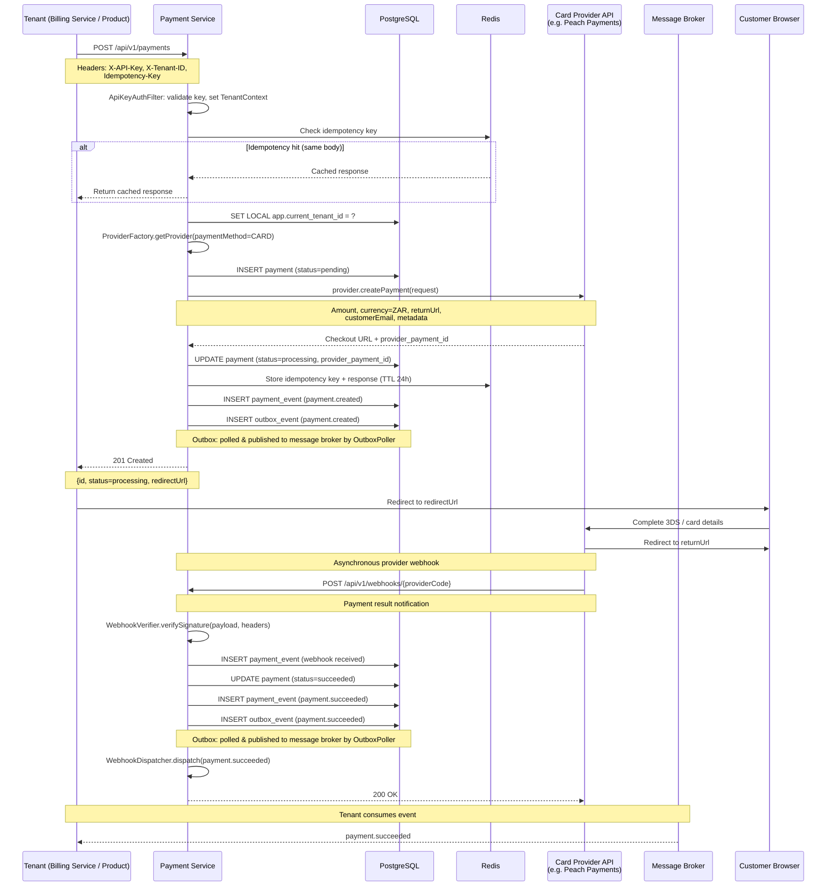

---

## 2. One-Time EFT Payment (Bank Redirect Flow)

Instant EFT payment where the customer is redirected to their bank's online banking portal via the resolved EFT provider.

> **Reference implementation:** The example uses Ozow as the EFT provider. Any provider implementing the `PaymentProvider` SPI follows the same sequence.

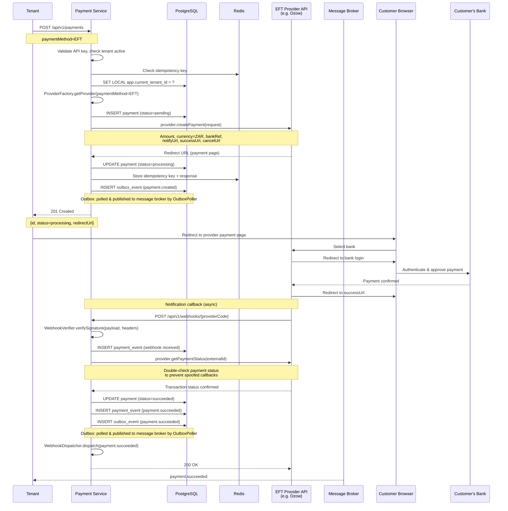

---

## 3. Recurring Token Charge

Server-to-server charge using a stored payment method token. Initiated by the Billing Service (or any tenant) for subscription renewals.

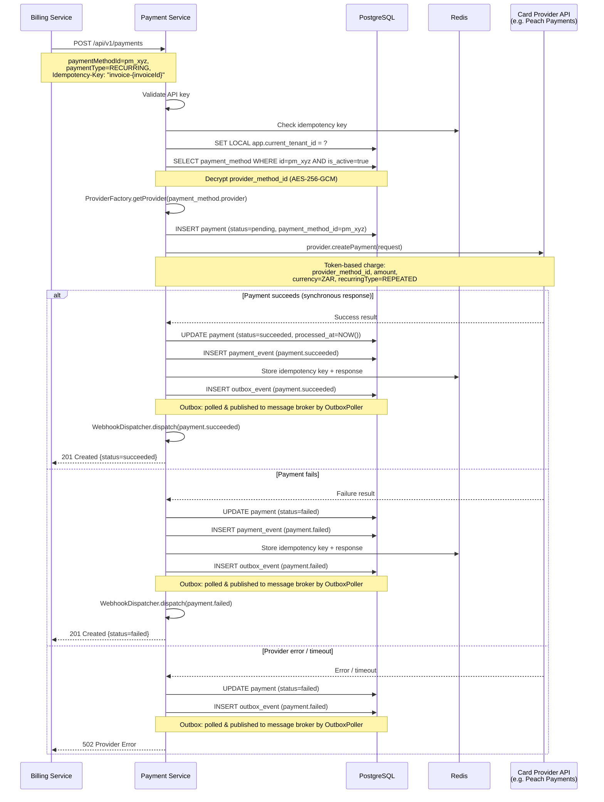

---

## 4. Refund Processing

Full and partial refunds routed to the same provider that processed the original payment.

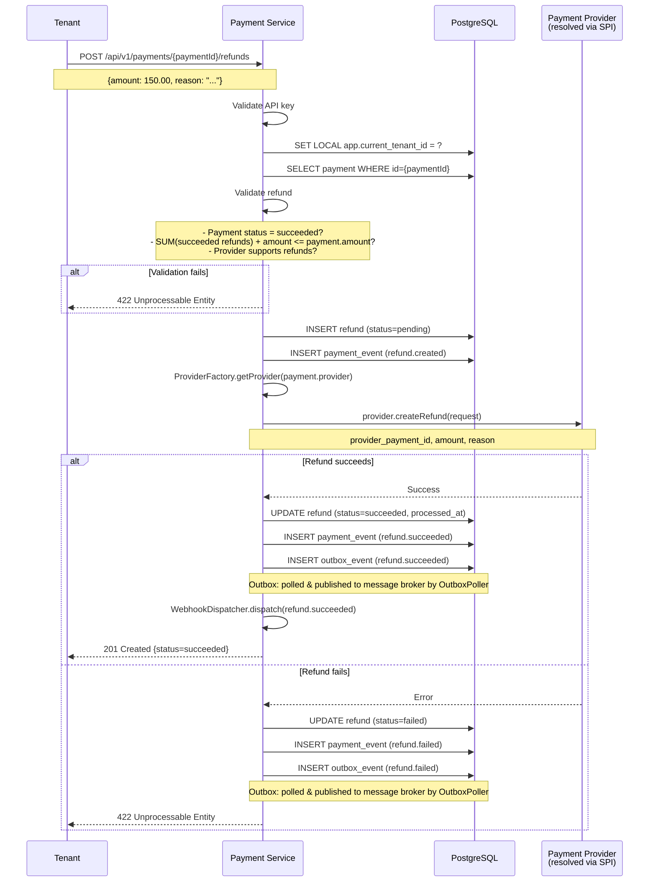

---

## 5. Provider Webhook Handling (Generic)

All provider webhooks follow the same generic flow through the `ProviderWebhookController`, dispatched to the correct adapter via the `providerCode` path parameter.

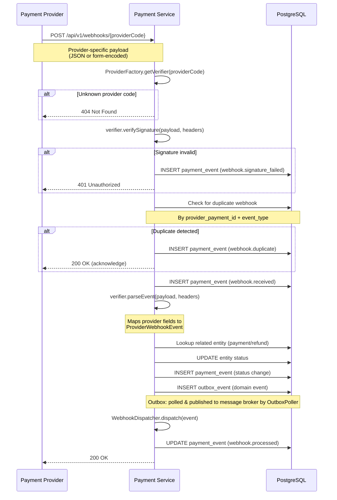

---

## 6. Card Provider Webhook (HMAC Signature)

Detailed webhook processing for a provider using HMAC-SHA256 signature verification (e.g., Peach Payments).

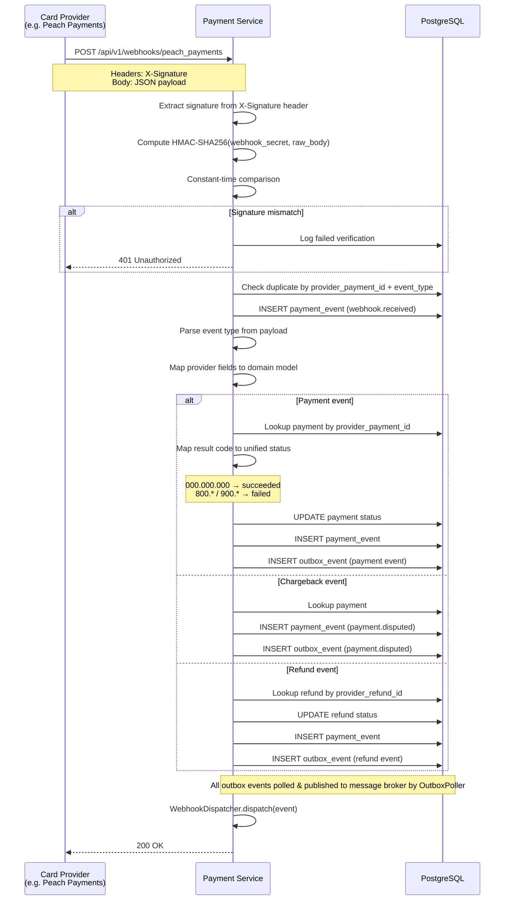

---

## 7. EFT Provider Webhook (Hash Verification)

Detailed webhook processing for a provider using SHA512 hash verification (e.g., Ozow).

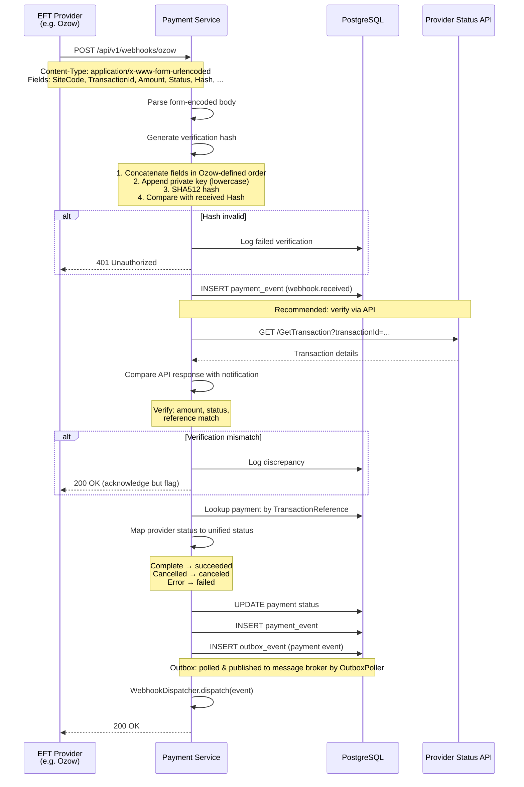

---

## 8. Outgoing Webhook Dispatch

The Payment Service dispatches events to registered tenant webhook endpoints. This flow runs after any domain event is published.

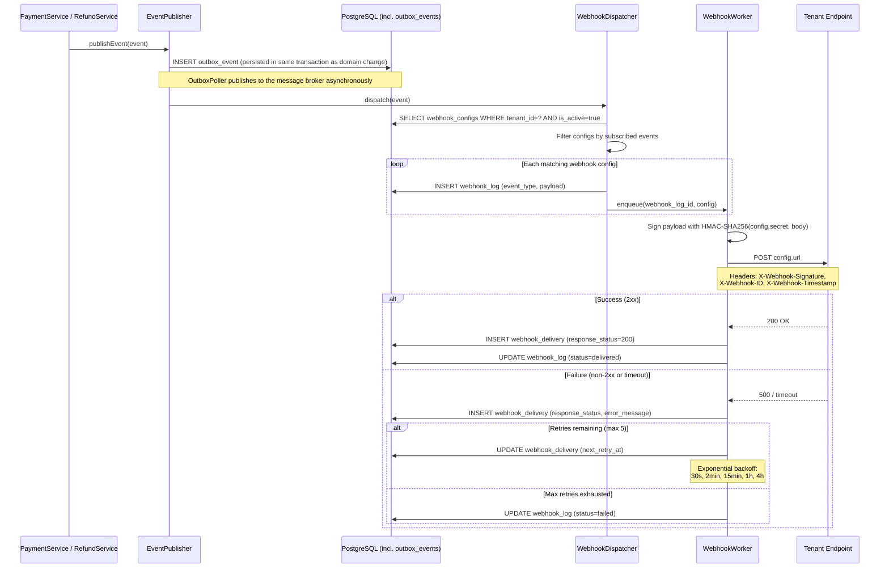

---

## 9. Idempotency Flow

How duplicate requests are detected and handled using Redis + PostgreSQL.

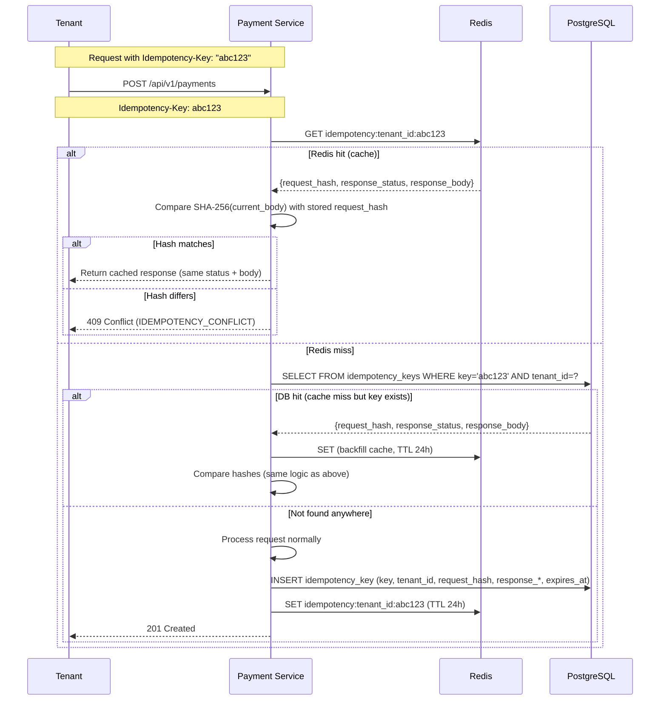

---

## 10. Payment Method CRUD

Payment method management lifecycle (tokenise, list, update, delete).

### 10.1 Create (Tokenise) Payment Method

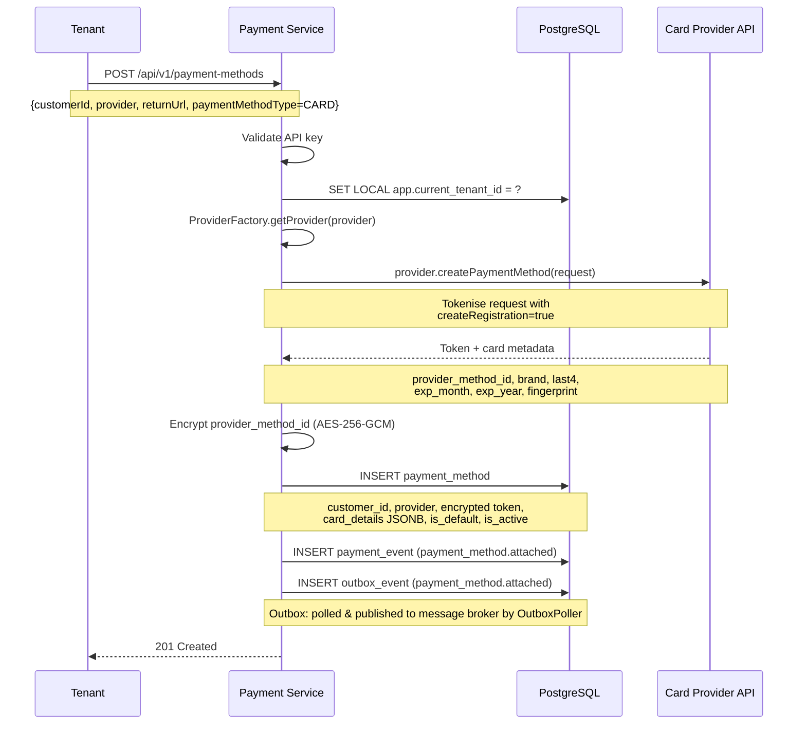

### 10.2 Delete Payment Method

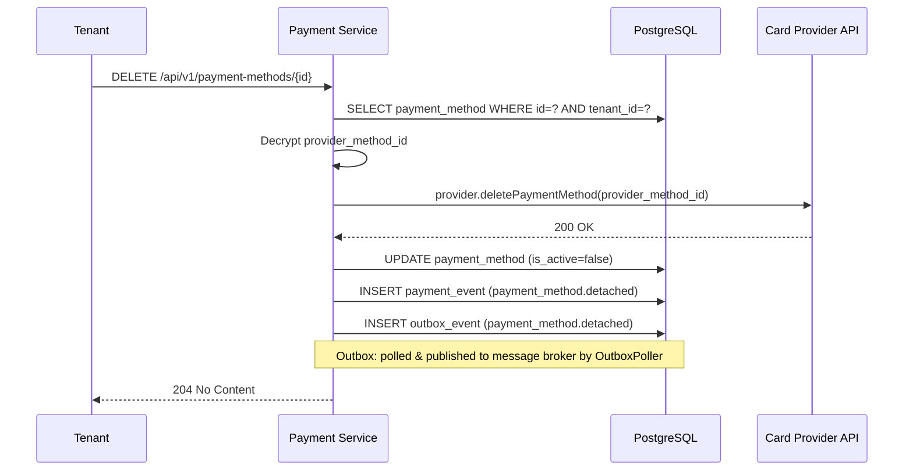

---

## 11. Payment Status State Machine

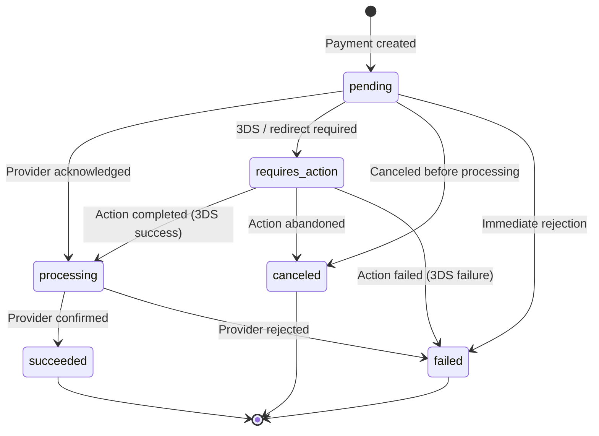

**Valid transitions:**

| From | To |
|------|----|
| `pending` | `processing`, `requires_action`, `canceled`, `failed` |
| `requires_action` | `processing`, `canceled`, `failed` |
| `processing` | `succeeded`, `failed` |
| `succeeded` | Terminal (no further transitions) |
| `failed` | Terminal |
| `canceled` | Terminal |

---

## 12. Refund Status State Machine

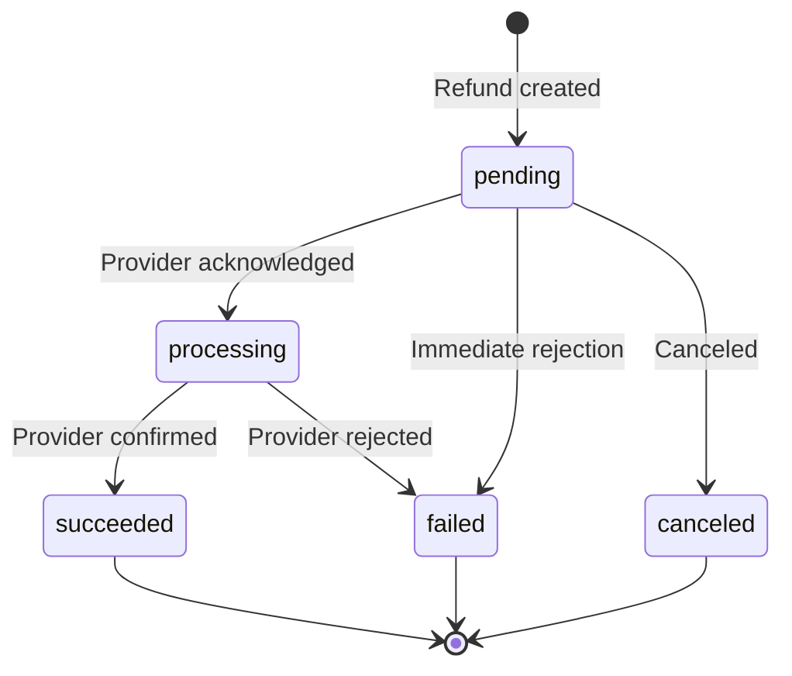

**Refund constraints:**
- `SUM(succeeded refunds for a payment) <= payment.amount` — enforced in `RefundService`
- Refund currency must match original payment currency
- Only `succeeded` payments can be refunded
- Refunds route to the same provider that processed the original payment

---

## Related Documents

- [Architecture Design](./architecture-design.md) — SPI contract, service components, ER diagram
- [Database Schema Design](./database-schema-design.md) — Table definitions, RLS policies
- [API Specification](./api-specification.yaml) — OpenAPI 3.0 spec
- [Provider Integration Guide](./provider-integration-guide.md) — SPI contract, reference implementations
- [Compliance & Security Guide](./compliance-security-guide.md) — PCI DSS, 3DS, POPIA
