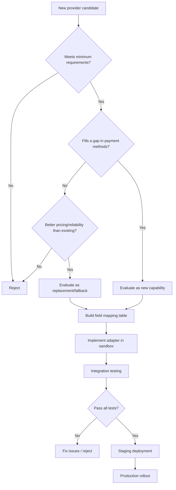
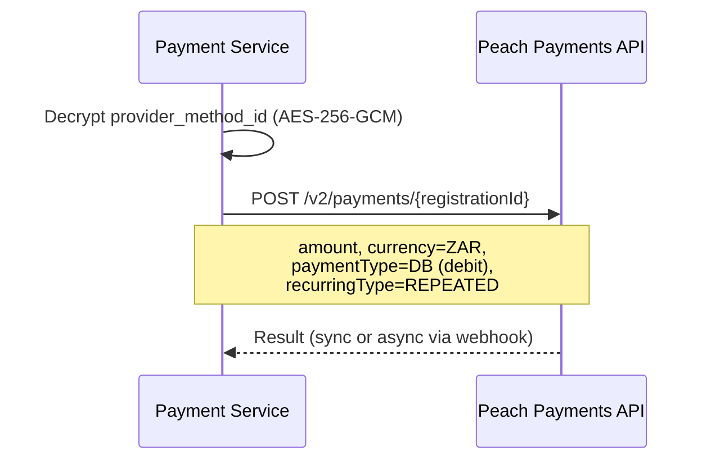
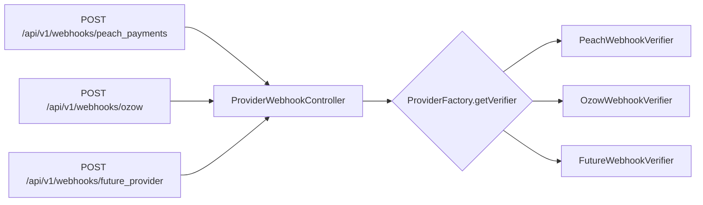
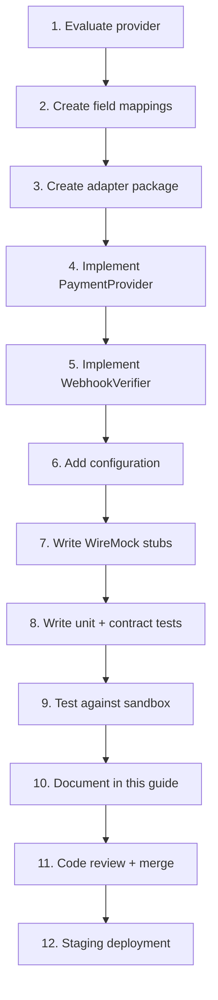
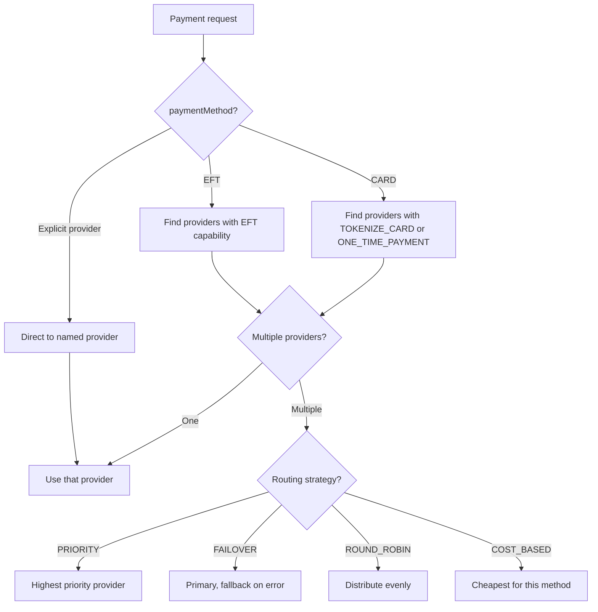

# Payment Service — Provider Integration Guide

| Field            | Value                  |
|------------------|------------------------|
| **Version**      | 1.0                   |
| **Date**         | 2026-03-25            |
| **Status**       | Draft                 |

---

## Table of Contents

1. [Purpose](#1-purpose)
2. [Provider Evaluation Framework](#2-provider-evaluation-framework)
3. [SPI Contract — What a Provider Must Implement](#3-spi-contract--what-a-provider-must-implement)
4. [Provider Configuration Template](#4-provider-configuration-template)
5. [Reference Implementation: Peach Payments (Card Provider)](#5-reference-implementation-peach-payments-card-provider)
6. [Reference Implementation: Ozow (EFT Provider)](#6-reference-implementation-ozow-eft-provider)
7. [Feature Comparison Matrix (Reference Providers)](#7-feature-comparison-matrix-reference-providers)
8. [API Field Mapping Template](#8-api-field-mapping-template)
9. [Webhook & Notification Integration](#9-webhook--notification-integration)
10. [Testing Strategy per Provider](#10-testing-strategy-per-provider)
11. [Adding a New Provider — Step-by-Step](#11-adding-a-new-provider--step-by-step)
12. [Routing & Fallback Strategy](#12-routing--fallback-strategy)
13. [Amount Handling — Provider Adapter Responsibility](#13-amount-handling--provider-adapter-responsibility)
14. [Future Provider Candidates](#14-future-provider-candidates)

---

## 1. Purpose

This document serves as a **guide for evaluating, integrating, and maintaining payment providers** within the Payment Service. Providers are pluggable modules that implement the `PaymentProvider` SPI — they can be added, replaced, or removed without affecting core domain logic.

The document includes:
- An evaluation framework for assessing new providers
- The SPI contract every provider adapter must satisfy
- **Worked examples** using Peach Payments (card) and Ozow (EFT) as reference implementations
- Templates for field mappings, webhook integration, and configuration
- Step-by-step guide for adding new providers

> **Key principle:** Peach Payments and Ozow are reference implementations chosen for SA market coverage. They can be replaced, supplemented, or removed without changes to the service layer, domain model, database schema, or API contract.

---

## 2. Provider Evaluation Framework

### 2.1 Evaluation Checklist

| Category                  | Question                                                                | Weight   |
|---------------------------|-------------------------------------------------------------------------|----------|
| **Payment Methods**       | Which payment methods does the provider support?                        | Critical |
| **SA Compliance**         | Is the provider licensed/registered in South Africa?                    | Critical |
| **PCI DSS**               | What PCI DSS level is the provider? Does hosted checkout reduce scope?  | Critical |
| **3D Secure**             | Does the provider support 3DS 2.x (mandatory for SA card payments)?    | Critical |
| **API Style**             | REST? Form POST? GraphQL? Is it well-documented?                        | High     |
| **Tokenisation**          | Does the provider support tokenisation for recurring payments?          | High     |
| **Recurring Support**     | Can the provider charge tokens server-to-server?                        | High     |
| **Webhook Support**       | Does the provider send async notifications? What format?                | High     |
| **Webhook Verification**  | What signature mechanism? HMAC? SHA hash? JWT?                          | High     |
| **Refund Support**        | Merchant-initiated refunds via API?                                     | High     |
| **Java SDK**              | Official Java/Spring SDK? Or custom HTTP client required?               | Medium   |
| **Sandbox / Test Mode**   | Is a sandbox environment available? Does it support webhooks?           | Medium   |
| **Pricing**               | Transaction fees, monthly fees, setup fees?                             | Medium   |
| **Settlement**            | Settlement frequency and timing?                                        | Medium   |
| **ZAR Support**           | Is ZAR the primary or well-supported currency?                          | Medium   |
| **Multi-Currency**        | Does the provider support currencies beyond ZAR?                        | Low      |
| **Go-Live Process**       | What is the activation/review process?                                  | Low      |
| **Support Quality**       | Dedicated support? SLA? Community resources?                            | Low      |

### 2.2 Minimum Requirements

A provider **must** meet these requirements to be integrated:

1. Supports at least one payment method needed by consuming products
2. Provides an API (REST or HTTP) for payment initiation
3. Provides async notification/webhook for payment results
4. Provides a mechanism for verifying webhook authenticity
5. Has a test/sandbox mode for development
6. Is compliant with South African financial regulations (SARB, FIC Act)
7. Supports ZAR as a transaction currency

### 2.3 Evaluation Decision Flow



---

## 3. SPI Contract — What a Provider Must Implement

Every provider adapter implements two interfaces: `PaymentProvider` (payment operations) and `WebhookVerifier` (webhook security).

### 3.1 PaymentProvider Interface

```java
public interface PaymentProvider {

    /** Unique identifier for this provider (e.g., "peach_payments", "ozow") */
    String getProviderId();

    /** Capabilities this provider supports */
    Set<ProviderCapability> getCapabilities();

    /** Initiate a payment — returns redirect URL or direct result */
    ProviderPaymentResponse createPayment(ProviderPaymentRequest request);

    /** Query payment status from the provider */
    ProviderPaymentStatus getPaymentStatus(String providerPaymentId);

    /** Cancel a pending payment (if supported) */
    ProviderCancelResponse cancelPayment(String providerPaymentId);

    /** Create a refund */
    ProviderRefundResponse createRefund(ProviderRefundRequest request);

    /** Query refund status */
    ProviderRefundStatus getRefundStatus(String providerRefundId);

    /** Create / tokenise a payment method */
    ProviderPaymentMethod createPaymentMethod(ProviderPaymentMethodRequest request);

    /** Retrieve a payment method from the provider */
    ProviderPaymentMethod getPaymentMethod(String providerMethodId);

    /** Delete a payment method from the provider */
    void deletePaymentMethod(String providerMethodId);
}
```

### 3.2 WebhookVerifier Interface

```java
public interface WebhookVerifier {

    /** Provider ID this verifier handles */
    String getProviderId();

    /** Verify the webhook signature/hash */
    boolean verifySignature(String payload, Map<String, String> headers);

    /** Parse the raw webhook into a normalised domain event */
    ProviderWebhookEvent parseEvent(String payload, Map<String, String> headers);
}
```

### 3.3 ProviderCapability Enum

```java
public enum ProviderCapability {
    ONE_TIME_PAYMENT,       // Single payments
    RECURRING_PAYMENT,      // Token-based recurring charges
    REFUND_FULL,            // Full refunds
    REFUND_PARTIAL,         // Partial refunds
    TOKENIZE_CARD,          // Card tokenisation
    TOKENIZE_BANK_ACCOUNT,  // Bank account tokenisation
    THREE_D_SECURE,         // 3DS authentication
    REDIRECT_FLOW,          // Redirect-based payment (hosted checkout)
    WEBHOOK_NOTIFICATIONS,  // Provider sends webhooks
    DIGITAL_WALLET,         // Apple Pay, Google Pay, Samsung Pay
    BNPL                    // Buy Now Pay Later
}
```

### 3.4 Required vs Optional Capabilities

| Capability              | Required? | Notes                                                           |
|-------------------------|-----------|------------------------------------------------------------------|
| `createPayment`         | Yes       | Core payment initiation                                          |
| `getPaymentStatus`      | Yes       | Status query for reconciliation                                  |
| `verifySignature`       | Yes       | Security requirement — all webhooks must be verified             |
| `parseEvent`            | Yes       | Webhook processing — maps to unified domain events               |
| `createRefund`          | Yes       | Throw `UnsupportedOperationException` if not available           |
| `cancelPayment`         | Optional  | Throw `UnsupportedOperationException` if not supported           |
| `createPaymentMethod`   | Optional  | Only for providers supporting tokenisation                       |
| `getPaymentMethod`      | Optional  | Only for providers supporting tokenisation                       |
| `deletePaymentMethod`   | Optional  | Only for providers supporting tokenisation                       |

### 3.5 ProviderFactory (Auto-Discovery)

```java
@Component
public class ProviderFactory {

    private final Map<String, PaymentProvider> providers;
    private final Map<String, WebhookVerifier> verifiers;

    public ProviderFactory(List<PaymentProvider> providerList,
                           List<WebhookVerifier> verifierList) {
        this.providers = providerList.stream()
            .collect(Collectors.toMap(PaymentProvider::getProviderId, Function.identity()));
        this.verifiers = verifierList.stream()
            .collect(Collectors.toMap(WebhookVerifier::getProviderId, Function.identity()));
    }

    public PaymentProvider getProvider(String providerId) {
        return Optional.ofNullable(providers.get(providerId))
            .orElseThrow(() -> new ProcessorException("Unknown provider: " + providerId));
    }

    public WebhookVerifier getVerifier(String providerId) {
        return Optional.ofNullable(verifiers.get(providerId))
            .orElseThrow(() -> new ProcessorException("No webhook verifier for: " + providerId));
    }

    public boolean supportsCapability(String providerId, ProviderCapability capability) {
        return getProvider(providerId).getCapabilities().contains(capability);
    }
}
```

New providers are added by:
1. Implementing `PaymentProvider` and `WebhookVerifier`
2. Annotating both classes with `@Component`
3. Spring auto-discovers them via constructor injection into `ProviderFactory`
4. **No factory code changes needed** — the provider `VARCHAR` column in `payments` accommodates any provider code

---

## 4. Provider Configuration Template

Each provider is registered in `application.yml` under `payment.providers.<provider-code>`:

```yaml
payment:
  providers:
    <provider-code>:                   # e.g., "peach_payments", "ozow"
      enabled: true                    # Feature flag — disable without removing code
      display-name: "Provider Name"    # Human-readable name
      base-url: https://api.provider.example.com
      auth:
        type: BASIC | API_KEY | OAUTH2 | HMAC | CUSTOM
        credentials:
          # Provider-specific credential keys (from environment variables)
          key1: ${ENV_VAR_1}
          key2: ${ENV_VAR_2}
      webhook-secret: ${PROVIDER_WEBHOOK_SECRET}
      supported-methods:
        - CARD
        - EFT
        # ... PaymentMethodType values
      timeout:
        connect: 5000                  # Connection timeout (ms)
        read: 30000                    # Read timeout (ms)
      retry:
        max-attempts: 3
        initial-delay: 1000            # ms
        max-delay: 30000               # ms
```

**Configuration injection pattern:**

```java
@ConfigurationProperties(prefix = "payment.providers.peach-payments")
public record PeachConfig(
    boolean enabled,
    String displayName,
    String baseUrl,
    AuthConfig auth,
    String webhookSecret,
    List<String> supportedMethods,
    TimeoutConfig timeout,
    RetryConfig retry
) {}
```

---

## 5. Reference Implementation: Peach Payments (Card Provider)

> This section documents Peach Payments as a **worked example** of integrating a card-based provider. The same patterns apply to any card provider.

### 5.1 Provider Overview

| Attribute              | Details                                                        |
|------------------------|----------------------------------------------------------------|
| **Headquarters**       | Cape Town, South Africa                                        |
| **Founded**            | 2012                                                           |
| **Markets**            | South Africa, Kenya, Mauritius, and other African countries    |
| **PCI DSS**            | Level 1 Service Provider                                       |
| **Developer Portal**   | https://developer.peachpayments.com                            |
| **API Type**           | RESTful API (Payments API v2)                                  |
| **Java SDK**           | None — custom HTTP client via Spring `WebClient`               |
| **Sandbox**            | Full sandbox environment with test credentials                 |

### 5.2 Supported Payment Methods

| Method              | Type        | ProviderCapability            | Use Case                       |
|---------------------|-------------|-------------------------------|--------------------------------|
| Visa / Mastercard   | Card        | `ONE_TIME_PAYMENT`, `RECURRING_PAYMENT`, `TOKENIZE_CARD`, `THREE_D_SECURE` | Standard card payment |
| American Express    | Card        | `ONE_TIME_PAYMENT`, `THREE_D_SECURE` | Premium card payment |
| Diners Club         | Card        | `ONE_TIME_PAYMENT`, `THREE_D_SECURE` | Premium card payment |
| MoreTyme / Payflex  | BNPL        | `BNPL`, `REDIRECT_FLOW`      | Split payment over instalments |
| Apple Pay / Samsung Pay | Wallet  | `DIGITAL_WALLET`              | Mobile wallet payment          |
| SnapScan / Zapper   | QR Code     | `REDIRECT_FLOW`               | Scan-to-pay                    |

### 5.3 API Architecture

**Style**: RESTful API with JSON request/response bodies.

**Base URLs**:
- Live: `https://api-v2.peachpayments.com`
- Sandbox: `https://testapi-v2.peachpayments.com`

**Authentication model**:
```
Authorization: Basic <base64(username:password)>
Header: entityId=<entity_id>
```

**Configuration**:
```yaml
payment:
  providers:
    peach_payments:
      enabled: true
      display-name: "Peach Payments"
      base-url: ${PEACH_BASE_URL:https://testapi-v2.peachpayments.com}
      auth:
        type: BASIC
        credentials:
          entity-id: ${PEACH_ENTITY_ID}
          username: ${PEACH_API_USERNAME}
          password: ${PEACH_API_PASSWORD}
      webhook-secret: ${PEACH_WEBHOOK_SECRET}
      supported-methods:
        - CARD
        - BNPL
        - WALLET
        - QR_CODE
      timeout:
        connect: 5000
        read: 30000
```

### 5.4 Adapter Implementation Sketch

```java
@Component
public class PeachPaymentProvider implements PaymentProvider {

    private final WebClient webClient;
    private final PeachConfig config;
    private final PeachMapper mapper;

    @Override
    public String getProviderId() {
        return "peach_payments";
    }

    @Override
    public Set<ProviderCapability> getCapabilities() {
        return Set.of(
            ONE_TIME_PAYMENT, RECURRING_PAYMENT, REFUND_FULL, REFUND_PARTIAL,
            TOKENIZE_CARD, THREE_D_SECURE, REDIRECT_FLOW, WEBHOOK_NOTIFICATIONS,
            DIGITAL_WALLET, BNPL
        );
    }

    @Override
    public ProviderPaymentResponse createPayment(ProviderPaymentRequest request) {
        PeachCheckoutRequest peachRequest = mapper.toProviderRequest(request);
        // POST to Peach Payments API
        PeachCheckoutResponse response = webClient.post()
            .uri("/v2/checkout")
            .header("entityId", config.auth().credentials().get("entity-id"))
            .bodyValue(peachRequest)
            .retrieve()
            .bodyToMono(PeachCheckoutResponse.class)
            .timeout(Duration.ofMillis(config.timeout().read()))
            .block();
        return mapper.toDomainResponse(response);
    }

    // ... other methods follow same pattern
}
```

### 5.5 Recurring Payments / Tokenisation

Peach Payments supports recurring payments through **card tokenisation**:

1. **Initial tokenisation**: During the first payment, the customer's card is tokenised via Checkout with `createRegistration=true`.
2. **Token storage**: Peach returns a `registrationId` (token) that represents the card. We encrypt this with AES-256-GCM before storing in `payment_methods.provider_method_id`.
3. **Recurring charges**: Use the token to charge the card without customer interaction (server-to-server).
4. **Credentials**: Separate recurring payment API credentials (Recurring ID + Access Token) from the Dashboard.

**Recurring charge flow:**


**Limitations**:
- Only card payments can be tokenised (not BNPL/wallet/QR)
- Subscription lifecycle (billing cycles, plans) is the Billing Service's responsibility
- Retry logic on failed recurring charges is our responsibility

### 5.6 Webhook Integration

| Aspect               | Details                                                      |
|----------------------|--------------------------------------------------------------|
| Delivery method      | HTTP POST with JSON body                                     |
| Signature            | HMAC-SHA256 in `X-Peach-Signature` header                   |
| Retry policy         | Automatic retries on failure                                 |
| Events               | Payment success, failure, chargeback, refund status changes  |

**Verification logic (PeachWebhookVerifier):**
```java
@Component
public class PeachWebhookVerifier implements WebhookVerifier {

    private final PeachConfig config;

    @Override
    public String getProviderId() {
        return "peach_payments";
    }

    @Override
    public boolean verifySignature(String payload, Map<String, String> headers) {
        String receivedSignature = headers.get("x-peach-signature");
        if (receivedSignature == null) return false;

        String computed = HmacUtils.hmacSha256Hex(
            config.webhookSecret(), payload);
        return MessageDigest.isEqual(
            computed.getBytes(), receivedSignature.getBytes());
    }

    @Override
    public ProviderWebhookEvent parseEvent(String payload, Map<String, String> headers) {
        PeachWebhookPayload peach = objectMapper.readValue(payload, PeachWebhookPayload.class);
        return ProviderWebhookEvent.builder()
            .providerPaymentId(peach.getId())
            .status(mapResultCode(peach.getResult().getCode()))
            .amount(peach.getAmount())
            .currency(peach.getCurrency())
            .rawPayload(payload)
            .build();
    }

    private PaymentStatus mapResultCode(String code) {
        if (code.startsWith("000.000.") || code.startsWith("000.100.1"))
            return PaymentStatus.SUCCEEDED;
        if (code.startsWith("000.200."))
            return PaymentStatus.PROCESSING;
        return PaymentStatus.FAILED;
    }
}
```

### 5.7 Result Code Mapping

| Peach Result Code Pattern | Unified Status   | Meaning                          |
|--------------------------|------------------|----------------------------------|
| `000.000.000`            | `SUCCEEDED`      | Transaction approved             |
| `000.100.1*`             | `SUCCEEDED`      | Successfully processed           |
| `000.200.*`              | `PROCESSING`     | Pending / awaiting redirect      |
| `000.200.101`            | `CANCELLED`      | Cancelled by customer            |
| `800.*`                  | `FAILED`         | Rejected by issuer               |
| `900.*`                  | `FAILED`         | Technical error                  |

### 5.8 Sandbox & Testing

| Aspect              | Details                                                      |
|---------------------|--------------------------------------------------------------|
| Environment         | Separate sandbox URLs and credentials                        |
| Test cards          | `4711100000000000` (success), `4711100000000001` (decline)   |
| Webhook testing     | Webhooks fire in sandbox mode                                |
| Limitations         | No real money movement; all transactions are simulated       |

### 5.9 Pricing (Estimated)

| Fee Type                  | Amount                                    |
|---------------------------|-------------------------------------------|
| Setup fee                 | None (standard)                           |
| Monthly fee               | Varies by plan                            |
| Card transaction fee      | ~2.9% + R2.00 per transaction             |
| Recurring transaction fee | Same as card transaction                  |

### 5.10 Strengths & Weaknesses

**Strengths**: Comprehensive payment methods (card, BNPL, wallet, QR), robust API documentation, tokenisation support, multi-country expansion potential, PCI DSS Level 1, Checkout SDK.

**Weaknesses**: No EFT support, complex authentication model, no official Java SDK (custom `WebClient` required), higher transaction fees vs EFT, formal go-live review process.

---

## 6. Reference Implementation: Ozow (EFT Provider)

> This section documents Ozow as a **worked example** of integrating an EFT/bank-based provider. The same patterns apply to any EFT provider.

### 6.1 Provider Overview

| Attribute              | Details                                                        |
|------------------------|----------------------------------------------------------------|
| **Headquarters**       | Johannesburg, South Africa                                     |
| **Founded**            | 2014                                                           |
| **Markets**            | South Africa (ZAR only)                                        |
| **Developer Portal**   | https://hub.ozow.com/docs                                      |
| **API Type**           | HTTP form POST (initiation) + REST API (status queries)        |
| **Java SDK**           | None — custom HTTP client via Spring `WebClient`               |
| **Sandbox**            | Test mode via `IsTest=true` flag                               |

### 6.2 Supported Payment Methods

| Method                 | Type        | ProviderCapability            | Use Case                       |
|------------------------|-------------|-------------------------------|--------------------------------|
| All SA banks (FNB, Standard Bank, ABSA, Nedbank, Capitec, etc.) | EFT | `ONE_TIME_PAYMENT`, `REDIRECT_FLOW` | Direct bank payment |
| Capitec Pay            | API-direct  | `ONE_TIME_PAYMENT`            | Direct Capitec app integration |
| PayShap                | Instant     | `ONE_TIME_PAYMENT`            | Real-time payment rail (SARB)  |

### 6.3 API Architecture

**Style**: HTTP form POST for payment initiation, REST API for status queries.

**Base URLs**:
- Payment initiation: `https://pay.ozow.com`
- API (status queries): `https://api.ozow.com`

**Authentication model**:
```
# Payment initiation: SHA512 hash of concatenated fields + private key
HashCheck = SHA512(lowercase(field1 + field2 + ... + privateKey))

# API calls: API key in HTTP header
ApiKey: <merchant_api_key>
```

**Configuration**:
```yaml
payment:
  providers:
    ozow:
      enabled: true
      display-name: "Ozow"
      base-url: ${OZOW_BASE_URL:https://api.ozow.com}
      payment-url: ${OZOW_PAYMENT_URL:https://pay.ozow.com}
      auth:
        type: API_KEY
        credentials:
          site-code: ${OZOW_SITE_CODE}
          private-key: ${OZOW_PRIVATE_KEY}
          api-key: ${OZOW_API_KEY}
      webhook-secret: ${OZOW_PRIVATE_KEY}  # Ozow uses private key for hash verification
      supported-methods:
        - EFT
        - CAPITEC_PAY
        - PAYSHAP
      timeout:
        connect: 5000
        read: 30000
```

### 6.4 Adapter Implementation Sketch

```java
@Component
public class OzowPaymentProvider implements PaymentProvider {

    private final WebClient webClient;
    private final OzowConfig config;
    private final OzowMapper mapper;

    @Override
    public String getProviderId() {
        return "ozow";
    }

    @Override
    public Set<ProviderCapability> getCapabilities() {
        return Set.of(
            ONE_TIME_PAYMENT, REFUND_FULL, REDIRECT_FLOW, WEBHOOK_NOTIFICATIONS
        );
    }

    @Override
    public ProviderPaymentResponse createPayment(ProviderPaymentRequest request) {
        OzowPaymentRequest ozowRequest = mapper.toProviderRequest(request);

        // Generate hash check
        String hashInput = String.join("",
            config.siteCode(), request.getCountryCode(),
            request.getCurrency(), request.getAmount().toPlainString(),
            request.getReference(), request.getBankReference(),
            // ... remaining fields in Ozow-defined order
            config.privateKey()
        ).toLowerCase();
        String hashCheck = DigestUtils.sha512Hex(hashInput);
        ozowRequest.setHashCheck(hashCheck);

        // Form POST to Ozow payment URL
        // Returns redirect URL for customer bank selection
        return mapper.toDomainResponse(ozowRequest, paymentUrl);
    }

    @Override
    public ProviderPaymentMethod createPaymentMethod(ProviderPaymentMethodRequest request) {
        throw new UnsupportedOperationException("Ozow does not support tokenisation");
    }

    // ... other unsupported methods throw UnsupportedOperationException
}
```

### 6.5 Recurring Payments

Ozow **does not support recurring payments or tokenisation**. Each payment requires active customer participation (redirect to bank portal).

**Implication for the Billing Service**: Subscriptions using EFT follow an invoice-based model where customers are notified via webhook/email and pay each invoice manually via an Ozow payment link.

### 6.6 Webhook Integration

| Aspect               | Details                                                      |
|----------------------|--------------------------------------------------------------|
| Delivery method      | HTTP POST with form-encoded body                             |
| Signature            | SHA512 hash of response fields + private key                 |
| Retry policy         | Not explicitly documented; API verification recommended      |
| Events               | Payment complete, cancelled, error                           |

**Verification logic (OzowWebhookVerifier):**
```java
@Component
public class OzowWebhookVerifier implements WebhookVerifier {

    private final OzowConfig config;

    @Override
    public String getProviderId() {
        return "ozow";
    }

    @Override
    public boolean verifySignature(String payload, Map<String, String> headers) {
        // 1. Parse form-encoded fields
        Map<String, String> fields = parseFormEncoded(payload);

        // 2. Concatenate fields in Ozow-defined order (excluding Hash)
        String hashInput = String.join("",
            fields.get("SiteCode"),
            fields.get("TransactionId"),
            fields.get("TransactionReference"),
            fields.get("Amount"),
            fields.get("Status"),
            fields.get("CurrencyCode"),
            fields.get("IsTest"),
            fields.get("StatusMessage"),
            config.privateKey()
        ).toLowerCase();

        // 3. SHA512 hash
        String computed = DigestUtils.sha512Hex(hashInput);

        // 4. Compare with Hash field
        return MessageDigest.isEqual(
            computed.getBytes(), fields.get("Hash").toLowerCase().getBytes());
    }

    @Override
    public ProviderWebhookEvent parseEvent(String payload, Map<String, String> headers) {
        Map<String, String> fields = parseFormEncoded(payload);
        return ProviderWebhookEvent.builder()
            .providerPaymentId(fields.get("TransactionId"))
            .reference(fields.get("TransactionReference"))
            .status(mapOzowStatus(fields.get("Status")))
            .amount(new BigDecimal(fields.get("Amount")))
            .currency(fields.get("CurrencyCode"))
            .rawPayload(payload)
            .build();
    }

    private PaymentStatus mapOzowStatus(String status) {
        return switch (status) {
            case "Complete" -> PaymentStatus.SUCCEEDED;
            case "Cancelled" -> PaymentStatus.CANCELLED;
            case "Error" -> PaymentStatus.FAILED;
            case "Abandoned" -> PaymentStatus.CANCELLED;
            default -> PaymentStatus.FAILED;
        };
    }
}
```

**Recommended double-check**: After hash verification, query the Ozow API to confirm the transaction status:
```java
// GET https://api.ozow.com/GetTransaction?transactionId={id}
// Verify amount, status, and reference match the webhook payload
```

### 6.7 Sandbox & Testing

| Aspect              | Details                                                      |
|---------------------|--------------------------------------------------------------|
| Environment         | Same endpoint with `IsTest=true`                             |
| Test flow           | Redirects to page where you select success/failure outcome   |
| Webhook testing     | Notification responses NOT sent for test transactions        |
| Limitations         | No bank authentication step; manual outcome selection        |

### 6.8 Pricing (Estimated)

| Fee Type                  | Amount                                    |
|---------------------------|-------------------------------------------|
| Setup fee                 | None                                      |
| Monthly fee               | None                                      |
| EFT transaction fee       | ~1.5% – 2% per transaction               |
| Settlement                | Next business day (standard)              |

### 6.9 Strengths & Weaknesses

**Strengths**: Best-in-class EFT coverage for SA, direct bank API integrations (Capitec Pay, PayShap), lower transaction fees than cards, simple integration model, instant confirmation.

**Weaknesses**: No tokenisation/recurring support, ZAR-only, no webhook testing in sandbox, form POST API style, limited metadata fields (5 optional), no official Java SDK.

---

## 7. Feature Comparison Matrix (Reference Providers)

> When evaluating a new provider, create a similar comparison against this baseline.

| Feature                          | Peach Payments | Ozow         | Notes                                           |
|----------------------------------|:--------------:|:------------:|--------------------------------------------------|
| Card Payments (Visa/MC)          | Yes            | No           | Peach's primary strength                         |
| Instant EFT                      | No             | Yes          | Ozow's core strength                             |
| Capitec Pay / Nedbank / Absa Pay | No             | Yes          | Direct bank API integrations                     |
| PayShap                          | No             | Yes          | South Africa's real-time payment rail            |
| BNPL (Buy Now Pay Later)         | Yes            | No           | Via Peach Payments partners                      |
| Mobile Wallet                    | Yes            | No           | Apple Pay, Samsung Pay                           |
| QR Code Payments                 | Yes            | No           | SnapScan, Zapper                                 |
| Tokenisation                     | Yes            | No           | Required for recurring card payments             |
| Recurring Billing                | Yes            | No           | Via tokenised card charges                       |
| Refunds                          | Yes            | Yes          | Both support merchant-initiated refunds          |
| Hosted Checkout                  | Yes            | No           | Peach offers embeddable checkout                 |
| Multi-Currency                   | Yes            | No           | Ozow is ZAR-only                                 |
| 3D Secure                        | Yes (auto)     | N/A          | Mandatory for SA card payments                   |
| Java SDK                         | No             | No           | Both require custom `WebClient` implementation   |

---

## 8. API Field Mapping Template

When integrating a new provider, create a field mapping table following this template.

### 8.1 Payment Creation — Field Mapping

| Our Unified Field     | Peach Payments              | Ozow                   | New Provider   |
|-----------------------|-----------------------------|------------------------|----------------|
| `amount`              | `amount` (Rands)            | `Amount` (Rands)       | _fill in_      |
| `currency`            | `currency`                  | `CurrencyCode`         | _fill in_      |
| `description`         | `descriptor` / `customParameters` | `Optional1`      | _fill in_      |
| `productId`           | `customParameters.productId`| `Optional2`            | _fill in_      |
| `customerId`          | `customer.merchantCustomerId` | `Customer`           | _fill in_      |
| `paymentMethod`       | (endpoint/paymentBrand)     | (N/A — always EFT)    | _fill in_      |
| `returnUrl`           | `shopperResultUrl`          | `SuccessUrl`           | _fill in_      |
| `cancelUrl`           | (shopperResultUrl+status)   | `CancelUrl`            | _fill in_      |
| `idempotencyKey`      | `merchantTransactionId`     | `TransactionReference` | _fill in_      |
| `bankReference`       | N/A                         | `BankReference`        | _fill in_      |
| `metadata`            | `customParameters`          | `Optional1-5`          | _fill in_      |

### 8.2 Payment Status — Field Mapping

| Our Unified Status    | Peach Result Code           | Ozow Status            | New Provider   |
|-----------------------|-----------------------------|------------------------|----------------|
| `PENDING`             | Initial state               | (not returned)         | _fill in_      |
| `PROCESSING`          | `000.200.*`                 | (redirect)             | _fill in_      |
| `SUCCEEDED`           | `000.000.000` / `000.100.1*`| `Complete`            | _fill in_      |
| `FAILED`              | `800.*` / `900.*`           | `Error`                | _fill in_      |
| `CANCELLED`           | `000.200.101`               | `Cancelled`            | _fill in_      |

### 8.3 Webhook/Notification — Field Mapping

| Our Unified Field     | Peach Field                 | Ozow Field             | New Provider   |
|-----------------------|-----------------------------|------------------------|----------------|
| `externalId`          | `id`                        | `TransactionId`        | _fill in_      |
| `amount`              | `amount`                    | `Amount`               | _fill in_      |
| `status`              | `result.code` (mapped)      | `Status`               | _fill in_      |
| `statusMessage`       | `result.description`        | `StatusMessage`        | _fill in_      |
| `reference`           | `merchantTransactionId`     | `TransactionReference` | _fill in_      |

---

## 9. Webhook & Notification Integration

### 9.1 Generic Webhook Endpoint

All provider webhooks are received at a single parameterised endpoint:
```
POST /api/v1/webhooks/{providerCode}
```

The `ProviderWebhookController` dispatches to the correct adapter based on `providerCode`:



### 9.2 Common Signature Mechanisms

| Mechanism               | Example Providers       | Verification Approach                          |
|-------------------------|-------------------------|------------------------------------------------|
| HMAC-SHA256             | Peach Payments          | Compare HMAC of body against header signature  |
| SHA512 Hash             | Ozow                    | Hash concatenated fields + private key         |
| HMAC-SHA512             | (various)               | Similar to HMAC-SHA256 with SHA512             |
| JWT                     | (various)               | Verify JWT signature with provider public key  |
| IP Whitelist            | (various)               | Accept only from known provider IPs            |

### 9.3 Webhook Processing Security Requirements

1. **Always verify signatures** before processing any webhook data
2. **Use constant-time comparison** (`MessageDigest.isEqual`) to prevent timing attacks
3. **Log failed verifications** as `payment_event` records for audit
4. **Deduplicate** by checking `provider_payment_id + event_type` before processing
5. **Return 200 quickly** — process asynchronously if webhook handling is slow
6. **Double-check via API** for EFT providers (recommended for Ozow)
7. **Persist events via the transactional outbox** — after processing a webhook, domain events (e.g., `payment.succeeded`) are inserted into the `outbox_events` table within the same database transaction as the status change. The `OutboxPoller` then publishes them to the message broker asynchronously. This guarantees at-least-once delivery even if the broker is temporarily unavailable. See [Architecture Design — Transactional Outbox Pattern](./architecture-design.md).

### 9.4 Mapping Provider Events to Unified Domain Events

| Provider Event Category    | Unified Domain Event            |
|----------------------------|---------------------------------|
| Payment success            | `payment.succeeded`             |
| Payment failure            | `payment.failed`                |
| Payment cancelled          | `payment.canceled`              |
| Payment pending            | `payment.processing`            |
| 3DS required               | `payment.requires_action`       |
| Refund completed           | `refund.succeeded`              |
| Refund failed              | `refund.failed`                 |
| Chargeback / Dispute       | `payment.disputed`              |
| Card tokenised             | `payment_method.attached`       |

---

## 10. Testing Strategy per Provider

### 10.1 Test Layers

| Testing Level       | Approach                                                     | Runs In      |
|---------------------|--------------------------------------------------------------|--------------|
| Unit tests          | Mock provider APIs with Mockito; test mapper logic           | CI (always)  |
| Contract tests      | WireMock stubs simulate provider responses                   | CI (always)  |
| Integration tests   | Testcontainers (PostgreSQL, Redis, message broker) + WireMock         | CI (always)  |
| Sandbox tests       | Automated tests against provider sandbox environments        | CI (nightly) |
| E2E (manual)        | Full payment flow in staging with sandbox credentials        | Pre-release  |

### 10.2 WireMock Stubs per Provider

Each provider adapter must include WireMock stubs for:

| Scenario                         | Expected Response               |
|----------------------------------|---------------------------------|
| Successful payment creation      | Checkout URL + provider ID      |
| Failed payment (declined)        | Error code + description        |
| Payment status query (succeeded) | Confirmed status                |
| Payment status query (pending)   | Pending status                  |
| Webhook payload (success)        | Valid signed JSON/form payload  |
| Webhook payload (failure)        | Valid signed failure payload    |
| Refund success                   | Refund confirmation             |
| Refund failure                   | Error response                  |
| Tokenisation success             | Token + card metadata           |
| Health check                     | 200 OK / 503                    |

### 10.3 Provider Contract Test Example

```java
@WireMockTest
class PeachPaymentProviderContractTest {

    @Test
    void createPayment_shouldReturnCheckoutUrl() {
        stubFor(post(urlPathEqualTo("/v2/checkout"))
            .willReturn(aResponse()
                .withStatus(200)
                .withHeader("Content-Type", "application/json")
                .withBodyFile("peach/checkout-success.json")));

        ProviderPaymentResponse response = provider.createPayment(testRequest);

        assertThat(response.getRedirectUrl()).isNotBlank();
        assertThat(response.getProviderPaymentId()).isNotBlank();
        assertThat(response.getStatus()).isEqualTo(ProviderPaymentStatus.PENDING);
    }

    @Test
    void createPayment_shouldHandleDecline() {
        stubFor(post(urlPathEqualTo("/v2/checkout"))
            .willReturn(aResponse()
                .withStatus(200)
                .withBodyFile("peach/checkout-declined.json")));

        ProviderPaymentResponse response = provider.createPayment(testRequest);

        assertThat(response.getStatus()).isEqualTo(ProviderPaymentStatus.FAILED);
        assertThat(response.getErrorCode()).isNotBlank();
    }
}
```

---

## 11. Adding a New Provider — Step-by-Step

### 11.1 Process Overview



### 11.2 Detailed Steps

1. **Evaluate** the provider using the checklist in [Section 2](#2-provider-evaluation-framework)
2. **Create field mappings** using the template in [Section 8](#8-api-field-mapping-template)
3. **Create a new package**: `com.enviro.payment.provider.adapter.<code>/`
4. **Implement `PaymentProvider`**: Map all supported operations (see [Section 3](#3-spi-contract--what-a-provider-must-implement))
5. **Implement `WebhookVerifier`**: Handle the provider's specific signature mechanism
6. **Add configuration**: Provider entry in `application.yml` following the template in [Section 4](#4-provider-configuration-template)
7. **Register supported methods**: The `ProviderFactory` auto-discovers via Spring `@Component` scanning
8. **Write WireMock stubs**: For unit/integration testing (see [Section 10](#10-testing-strategy-per-provider))
9. **Test against sandbox**: Verify end-to-end flow
10. **Document**: Add a reference implementation section to this guide

### 11.3 Required Files

```
src/main/java/.../provider/adapter/<code>/
├── <Code>PaymentProvider.java          # Implements PaymentProvider SPI
├── <Code>WebhookVerifier.java          # Implements WebhookVerifier SPI
├── <Code>ApiClient.java                # HTTP client for provider API
├── <Code>Mapper.java                   # Maps provider DTOs ↔ domain objects
├── <Code>Config.java                   # @ConfigurationProperties
└── dto/
    ├── <Code>PaymentRequest.java       # Provider-specific request DTO
    ├── <Code>PaymentResponse.java      # Provider-specific response DTO
    └── <Code>WebhookPayload.java       # Provider-specific webhook payload

src/test/resources/__files/<code>/
├── checkout-success.json               # WireMock stub: successful payment
├── checkout-declined.json              # WireMock stub: declined payment
├── webhook-success.json                # WireMock stub: success webhook
└── webhook-failure.json                # WireMock stub: failure webhook
```

> **No changes required** to the domain layer, API layer, database schema, or existing provider implementations.

---

## 12. Routing & Fallback Strategy

### 12.1 Default Routing

The `ProviderRoutingService` resolves which provider handles a payment based on the requested `paymentMethod`. Each provider declares its supported methods via `getCapabilities()`.

**Example routing (reference providers):**

| Payment Method       | Resolved Provider   | Notes                                      |
|----------------------|---------------------|--------------------------------------------|
| CARD                 | Peach Payments      | Any card-capable provider can be registered |
| BNPL                 | Peach Payments      | Provider must support BNPL flow            |
| EFT                  | Ozow                | Any EFT-capable provider can be registered |
| PAYSHAP              | Ozow                | RTC rail, via EFT provider                 |
| WALLET               | Peach Payments      | Apple Pay, Samsung Pay                     |

### 12.2 Routing Resolution Flow



### 12.3 Conflict Resolution Strategies

| Strategy          | Description                                          | Use Case                           |
|-------------------|------------------------------------------------------|------------------------------------|
| `PRIORITY`        | Use the provider with the highest configured priority | Default — predictable routing      |
| `FAILOVER`        | Use primary; fall back to secondary on failure        | High availability                  |
| `ROUND_ROBIN`     | Distribute requests across providers                  | Load distribution                  |
| `COST_BASED`      | Route to the cheapest provider for the method         | Cost optimisation                  |

### 12.4 Cost Optimisation Guidance

EFT transactions are generally cheaper than card transactions in South Africa. Products can optimise costs by:
1. Offering EFT as the default/preferred payment method for one-time payments
2. Using card payments for recurring subscriptions (tokenisation required)
3. Monitoring provider fee reports via usage analytics

### 12.5 Circuit Breaker per Provider

Each provider adapter is wrapped by a **Resilience4j circuit breaker** to prevent cascading failures when a provider is degraded or unreachable. The circuit breaker operates independently per provider, so a Peach Payments outage does not affect Ozow routing.

**Default configuration per provider:**

| Parameter                  | Value      |
|----------------------------|------------|
| Failure rate threshold     | 50%        |
| Slow call threshold        | 80%        |
| Slow call duration         | 5 seconds  |
| Sliding window type        | COUNT_BASED|
| Sliding window size        | 20 calls   |
| Min calls before evaluation| 10         |
| Wait duration in open state| 30 seconds |
| Permitted calls in half-open| 5         |

**Behaviour by state:**

| Circuit State | Routing Behaviour                                                                |
|---------------|----------------------------------------------------------------------------------|
| **CLOSED**    | Normal — all requests route to the provider                                      |
| **OPEN**      | Fast-fail — return 502 immediately (or fall back to secondary provider if FAILOVER strategy is configured) |
| **HALF_OPEN** | Probe — allow a limited number of calls to test recovery                         |

**Integration with routing strategies:**
- When the **FAILOVER** routing strategy is configured (Section 12.3), an open circuit on the primary provider automatically routes to the secondary provider.
- When **PRIORITY** routing is configured, an open circuit returns 502 Provider Error to the caller.
- Circuit breaker metrics are exposed via the `/actuator/circuitbreakerevents` endpoint for monitoring.

See [Architecture Design — Circuit Breaker](./architecture-design.md) for the Resilience4j Spring Boot configuration.

---

## 13. Amount Handling — Provider Adapter Responsibility

The Payment Service stores amounts in `DECIMAL(19,4)` in major units (Rands). The Billing Service stores amounts in `INTEGER` (cents). Provider APIs may expect either format.

**It is the adapter's responsibility** to convert between the internal representation and the provider's expected format:

| Direction                     | Conversion                                    |
|-------------------------------|-----------------------------------------------|
| Service → Provider (Peach)    | No conversion needed (Peach expects Rands)    |
| Service → Provider (Ozow)    | No conversion needed (Ozow expects Rands)     |
| Billing Service → Payment Service | Billing sends cents; PS API accepts Rands → Billing converts: `amountDueCents / 100` |
| Provider → Service (webhook) | Map provider amount to `DECIMAL(19,4)` Rands  |

**Adapter pattern for a provider expecting cents:**
```java
// If a future provider expects amounts in cents:
BigDecimal amountInCents = request.getAmount()
    .multiply(BigDecimal.valueOf(100))
    .setScale(0, RoundingMode.HALF_UP);
```

---

## 14. Future Provider Candidates

| Provider   | Category     | Rationale for Evaluation                                        |
|------------|-------------|------------------------------------------------------------------|
| Payfast    | Card + EFT  | Wide SA adoption, similar feature set to Peach, competitive pricing |
| Stitch     | Open Banking | Account-to-account payments, programmable banking APIs          |
| Yoco       | Card + POS  | Growing SA fintech, online payment APIs, mobile POS             |
| iVeri      | Card        | Long-standing SA card processor                                 |
| Stripe     | Card + Global | Evaluate if/when Stripe expands ZAR local acquiring in SA     |

---

## Appendix: Provider Contact Information

| Provider         | Developer Docs                                  | Support                                          |
|------------------|------------------------------------------------|--------------------------------------------------|
| Peach Payments   | https://developer.peachpayments.com            | https://support.peachpayments.com                |
| Ozow             | https://hub.ozow.com/docs                      | support@ozow.com                                 |

---

## Related Documents

- [Architecture Design](./architecture-design.md) — SPI contract, ProviderFactory, package structure
- [Database Schema Design](./database-schema-design.md) — `provider` VARCHAR column, payment_methods table
- [Payment Flow Diagrams](./payment-flow-diagrams.md) — Visual flows showing provider interaction points
- [API Specification](./api-specification.yaml) — Provider webhook endpoint, payment creation
- [Compliance & Security Guide](./compliance-security-guide.md) — PCI DSS, webhook signature security
