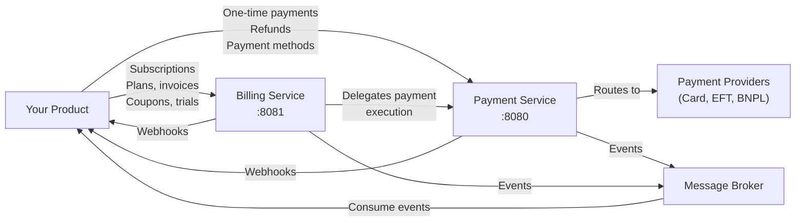
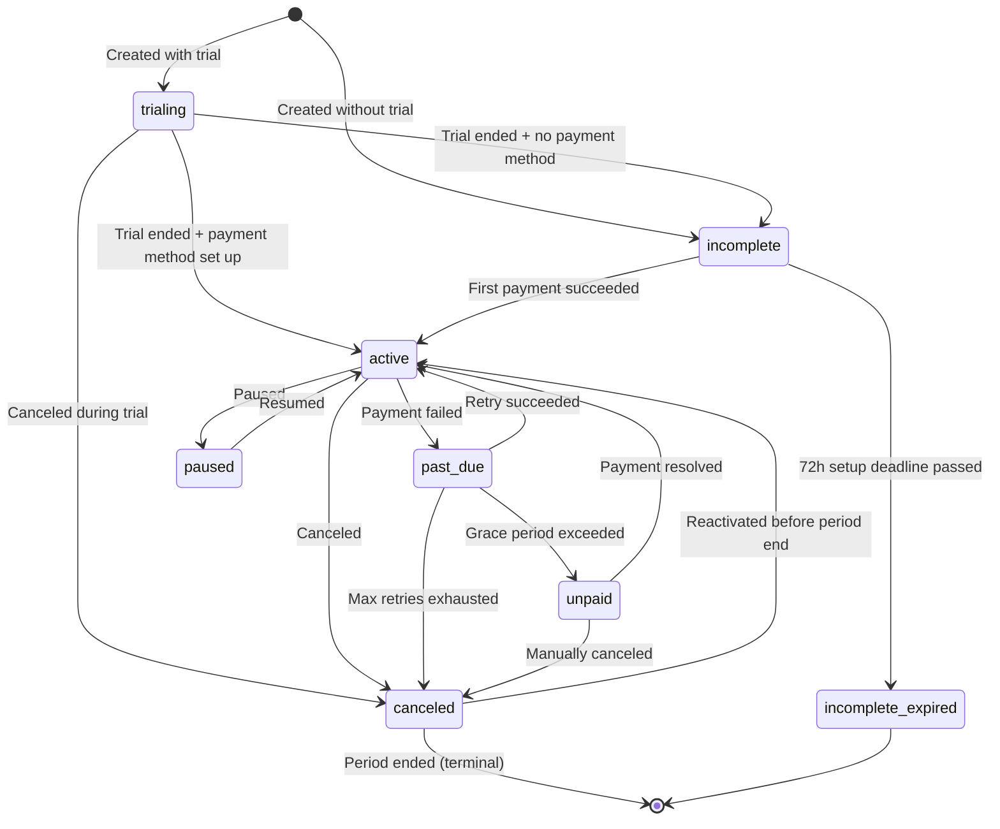

# Integration Guide — Payment Gateway Platform

| Field            | Value                  |
|------------------|------------------------|
| **Version**      | 1.0                   |
| **Date**         | 2026-03-25            |
| **Status**       | Draft                 |
| **Audience**     | Internal Product Teams |

---

## Table of Contents

1. [Overview](#1-overview)
2. [Getting Started](#2-getting-started)
3. [Authentication](#3-authentication)
4. [Idempotency](#4-idempotency)
5. [Payment Service Integration](#5-payment-service-integration)
6. [Billing Service Integration](#6-billing-service-integration)
7. [Event Streams](#7-event-streams)
8. [Webhook Consumption](#8-webhook-consumption)
9. [Error Handling](#9-error-handling)
10. [Rate Limits](#10-rate-limits)
11. [Testing & Sandbox](#11-testing--sandbox)
12. [Code Examples](#12-code-examples)
13. [Migration Checklist](#13-migration-checklist)

---

## 1. Overview

The Payment Gateway Platform provides two services for Enviro product lines:

| Service | Purpose | When to Use |
|---------|---------|-------------|
| **Payment Service** | Process one-time payments, manage refunds, store payment methods | You need to charge a customer once (e.g., ad-hoc purchase, top-up) |
| **Billing Service** | Manage subscription plans, recurring billing, invoices, coupons, trials | You need recurring charges, subscription management, or billing analytics |

### Architecture at a Glance



### What the Platform Handles

- Provider selection and routing based on payment method
- Tokenisation and secure card storage (PCI-compliant)
- 3D Secure orchestration for card payments
- Subscription lifecycle (create, renew, cancel, upgrade/downgrade, pause/resume)
- Invoice generation and payment
- Coupon/discount management
- Trial period management
- Webhook ingestion from providers + outgoing webhook dispatch
- Event publishing for payment and billing lifecycle
- Idempotency enforcement to prevent duplicate operations
- Retry and circuit breaker logic

### What Your Product Is Responsible For

- Customer-facing checkout UI / payment form
- Deciding when to charge (e.g., after order confirmation)
- Consuming events or webhooks to update your own state
- Handling business logic for payment success/failure
- Managing your own customer records

---

## 2. Getting Started

### 2.1 Determine Your Integration Path

| Scenario | Service(s) | Credentials Needed |
|----------|-----------|-------------------|
| One-time payments only | Payment Service | Payment Service API key + tenant ID |
| Subscriptions + recurring billing | Billing Service | Billing Service API key |
| Both one-time and recurring | Both services | Separate credentials for each |

> **Note**: If you use the Billing Service for subscriptions, it handles Payment Service calls on your behalf. You do not need to call the Payment Service directly for subscription-related payments.

### 2.2 Request Credentials

**Payment Service credentials** — Contact the platform engineering team:

| Credential | Purpose |
|-----------|---------|
| `api_key` | Identifies your product (`X-API-Key` header) |
| `api_secret` | Used to compute HMAC signatures (`X-Signature` header) |
| `tenant_id` | Your unique tenant identifier (`X-Tenant-ID` header) |

**Billing Service credentials** — Self-service after initial registration:

| Credential | Purpose |
|-----------|---------|
| `api_key` | Full API key in `bk_{prefix}_{secret}` format (`X-API-Key` header) |

Each environment (dev, staging, production) has separate credentials.

### 2.3 Base URLs

| Environment | Payment Service | Billing Service |
|-------------|----------------|-----------------|
| Local | `http://localhost:8080/api/v1` | `http://localhost:8081/api/v1` |
| Staging | `https://payments-staging.internal.enviro.co.za/api/v1` | `https://billing-staging.internal.enviro.co.za/api/v1` |
| Production | `https://payments.internal.enviro.co.za/api/v1` | `https://billing.internal.enviro.co.za/api/v1` |

### 2.4 Prerequisites

- API credentials provisioned for your product
- Event consumer configured for relevant topics (see [Section 7](#7-event-streams))
- TLS client support (HTTPS required for staging and production)
- Webhook endpoint configured (if using outgoing webhooks)

---

## 3. Authentication

The two services use **different authentication models**:

| Aspect | Payment Service | Billing Service |
|--------|----------------|-----------------|
| **Headers** | `X-API-Key` + `X-Tenant-ID` + `X-Timestamp` + `X-Signature` | `X-API-Key` only |
| **Key format** | Simple API key + separate secret | `bk_{prefix}_{secret}` (combined) |
| **HMAC signing** | Required (request body signed) | Not required |
| **Multiple keys** | One key per tenant | Multiple keys per tenant |
| **Self-service rotation** | No (admin operation) | Yes (API endpoint) |

### 3.1 Payment Service Authentication

Every request must include three headers plus an HMAC signature:

```
X-API-Key: ak_prod_a1b2c3d4e5f6
X-Tenant-ID: 550e8400-e29b-41d4-a716-446655440000
X-Timestamp: 1711360200
X-Signature: a3f1b2c4d5e6...
```

**Computing the HMAC signature:**

```
Signature = HMAC-SHA256(
    key   = api_secret,
    message = HTTP_METHOD + "\n" + REQUEST_PATH + "\n" + TIMESTAMP + "\n" + BODY_HASH
)
```

Where:
- `HTTP_METHOD`: Uppercase (e.g., `POST`, `GET`)
- `REQUEST_PATH`: Full path including query string (e.g., `/api/v1/payments?status=SUCCEEDED`)
- `TIMESTAMP`: Same value as `X-Timestamp` header
- `BODY_HASH`: SHA-256 hex digest of the raw request body. For GET requests with no body, use SHA-256 of empty string: `e3b0c44298fc1c149afbf4c8996fb92427ae41e4649b934ca495991b7852b855`

**Validation rules:**
- `X-Timestamp` must be within **5 minutes** of server clock (replay protection)
- Computed signature must match `X-Signature`
- API key must be active and associated with the specified tenant

### 3.2 Billing Service Authentication

Every request must include a single API key header:

```
X-API-Key: bk_abc12345_a7f8b3c2d1e4f5a6b7c8d9e0f1a2b3c4d5e6f7a8
```

The key prefix (`bk_abc12345`) is used for lookup; the full key is verified against a BCrypt hash. No HMAC signing is required.

**Key rotation** (self-service):

```bash
curl -X POST /api/v1/clients/api-keys/rotate \
  -H "X-API-Key: bk_abc12345_currentSecret"
```

Response includes the new key (shown once) and a 24-hour grace period during which both old and new keys are valid.

---

## 4. Idempotency

All mutating endpoints (`POST`, `PATCH`) on **both services** require an `Idempotency-Key` header to prevent duplicate operations.

### 4.1 How It Works

1. Include a unique `Idempotency-Key` header (UUID recommended, max 64 characters)
2. First request with this key: processed normally
3. Same key + same body: cached response returned (same HTTP status and body)
4. Same key + different body: HTTP `409 Conflict`
5. Keys expire after **24 hours**

### 4.2 Recommended Key Strategies

| Strategy | Example | Best For |
|----------|---------|----------|
| Entity ID-based | `order_12345_payment` | One-time payments tied to orders |
| UUID v4 | `550e8400-e29b-41d4-a716-446655440000` | General purpose |
| Composite | `sub_789_renewal_2026-04` | Subscription renewals |
| Invoice-based | `invoice-{invoiceId}` | Invoice payments (used internally by Billing Service) |

### 4.3 Example

```bash
# First request — processes normally, returns 201
curl -X POST /api/v1/payments \
  -H "Idempotency-Key: order_12345_payment" \
  -d '{"amount": 100.00, ...}'
# Response: 201 Created

# Retry with same key and body — returns cached 201
curl -X POST /api/v1/payments \
  -H "Idempotency-Key: order_12345_payment" \
  -d '{"amount": 100.00, ...}'
# Response: 201 Created (cached, no duplicate charge)

# Same key but different body — returns 409
curl -X POST /api/v1/payments \
  -H "Idempotency-Key: order_12345_payment" \
  -d '{"amount": 200.00, ...}'
# Response: 409 Conflict
```

---

## 5. Payment Service Integration

Use the Payment Service for **one-time payments**, **refunds**, and **payment method management**.

For full request/response schemas, see the [Payment Service API Specification](../payment-service/api-specification.yaml).

### 5.1 API Endpoints

| Method | Path | Description |
|--------|------|-------------|
| `POST` | `/payments` | Create a payment |
| `GET` | `/payments` | List payments (paginated) |
| `GET` | `/payments/{paymentId}` | Get payment details |
| `POST` | `/payments/{paymentId}/refunds` | Create a refund |
| `GET` | `/payments/{paymentId}/refunds` | List refunds for a payment |
| `GET` | `/payments/{paymentId}/refunds/{refundId}` | Get refund details |
| `POST` | `/payment-methods` | Register a payment method |
| `GET` | `/payment-methods` | List payment methods |
| `GET` | `/payment-methods/{id}` | Get payment method details |
| `DELETE` | `/payment-methods/{id}` | Deactivate a payment method |

### 5.2 One-Time Card Payment

Card payments route to the configured card provider (e.g., Peach Payments). The flow uses the provider's hosted checkout to keep your product out of PCI scope.

```bash
curl -X POST https://payments.internal.enviro.co.za/api/v1/payments \
  -H "Content-Type: application/json" \
  -H "X-API-Key: ak_prod_a1b2c3d4e5f6" \
  -H "X-Tenant-ID: your-tenant-uuid" \
  -H "X-Timestamp: 1711360200" \
  -H "X-Signature: computed_signature" \
  -H "Idempotency-Key: ord_abc123_pay" \
  -d '{
    "amount": 299.99,
    "currency": "ZAR",
    "paymentMethod": "CARD",
    "customerEmail": "jane@example.com",
    "customerId": "cust_456",
    "returnUrl": "https://yourapp.enviro.co.za/payment/complete",
    "cancelUrl": "https://yourapp.enviro.co.za/payment/cancel",
    "metadata": {
      "orderId": "ord_abc123",
      "description": "Premium feature purchase"
    }
  }'
```

**Response:**

```json
{
  "paymentId": "pay_f47ac10b-58cc-4372-a567-0e02b2c3d479",
  "status": "PENDING_REDIRECT",
  "provider": "card-provider",
  "redirectUrl": "https://provider.example.com/checkout/...",
  "amount": 299.99,
  "currency": "ZAR",
  "paymentMethod": "CARD",
  "createdAt": "2026-03-25T10:30:00Z"
}
```

**Flow:**

1. **Create payment** (server-side) — receive `redirectUrl`
2. **Redirect customer** to `redirectUrl` (client-side)
3. Customer completes 3D Secure / card details on the provider's hosted page
4. Customer is redirected to your `returnUrl`
5. **Listen for events**: the `payment.events` topic (type `payment.succeeded` or `payment.failed`) or poll `GET /payments/{paymentId}`

> **Important: HTTP 201 does not mean payment succeeded.** Token-based recurring charges (e.g., subscription renewals triggered by the Billing Service) may return HTTP `201 Created` even when the payment `status` is `failed`. This is because the *payment record* was successfully created — the provider simply declined the charge. **Always check the `status` field in the response body** rather than relying on the HTTP status code alone. For redirect-based flows (card/EFT), `status` will be `PENDING_REDIRECT` on 201.

### 5.3 EFT Payment

EFT payments route to the configured EFT provider (e.g., Ozow). Same flow as card payments but without 3D Secure.

```bash
curl -X POST https://payments.internal.enviro.co.za/api/v1/payments \
  -H "Content-Type: application/json" \
  -H "X-API-Key: ..." \
  -H "X-Tenant-ID: ..." \
  -H "X-Timestamp: ..." \
  -H "X-Signature: ..." \
  -H "Idempotency-Key: ord_def456_pay" \
  -d '{
    "amount": 500.00,
    "currency": "ZAR",
    "paymentMethod": "EFT",
    "customerEmail": "john@example.com",
    "customerId": "cust_789",
    "returnUrl": "https://yourapp.enviro.co.za/payment/complete",
    "cancelUrl": "https://yourapp.enviro.co.za/payment/cancel",
    "metadata": {"orderId": "ord_def456"}
  }'
```

> **Note**: EFT providers typically do not support tokenisation or recurring payments. EFT is one-time only. See the [Provider Integration Guide](../payment-service/provider-integration-guide.md) for provider capabilities.

### 5.4 Payment Methods

| Method | Provider Type | Notes |
|--------|--------------|-------|
| `CARD` | Card provider (e.g., Peach Payments) | Visa, Mastercard, Amex. 3DS required. |
| `BNPL` | Card provider (e.g., Peach Payments) | Buy Now Pay Later |
| `WALLET` | Card provider (e.g., Peach Payments) | Mobile wallets |
| `QR_CODE` | Card provider (e.g., Peach Payments) | QR code payments |
| `EFT` | EFT provider (e.g., Ozow) | Instant EFT (all major SA banks) |
| `CAPITEC_PAY` | EFT provider (e.g., Ozow) | Capitec banking app |
| `PAYSHAP` | EFT provider (e.g., Ozow) | PayShap instant payment |

### 5.5 Refunds

```bash
curl -X POST /api/v1/payments/{paymentId}/refunds \
  -H "Content-Type: application/json" \
  -H "Idempotency-Key: refund_ord_abc123" \
  -H "X-API-Key: ..." \
  -H "X-Tenant-ID: ..." \
  -H "X-Timestamp: ..." \
  -H "X-Signature: ..." \
  -d '{
    "amount": 150.00,
    "reason": "Customer requested refund"
  }'
```

**Refund rules:**
- Full or partial refunds supported
- Total refunded amount cannot exceed the original payment amount
- Refunds route to the same provider that processed the original payment
- Refunds on `PENDING` or `FAILED` payments are rejected

---

## 6. Billing Service Integration

Use the Billing Service for **subscription management**, **recurring billing**, **invoices**, **coupons**, and **trials**.

For full request/response schemas, see the [Billing Service API Specification](../billing-service/api-specification.yaml).

### 6.1 API Endpoints

| Method | Path | Description |
|--------|------|-------------|
| **Plans** | | |
| `POST` | `/plans` | Create a subscription plan |
| `GET` | `/plans` | List plans |
| `GET` | `/plans/{planId}` | Get plan details |
| `PATCH` | `/plans/{planId}` | Update plan (name, description, features — not price) |
| `POST` | `/plans/{planId}/archive` | Archive a plan |
| **Subscriptions** | | |
| `POST` | `/subscriptions` | Create a subscription |
| `GET` | `/subscriptions` | List subscriptions |
| `GET` | `/subscriptions/{id}` | Get subscription details |
| `PATCH` | `/subscriptions/{id}` | Update subscription metadata |
| `POST` | `/subscriptions/{id}/cancel` | Cancel a subscription |
| `POST` | `/subscriptions/{id}/reactivate` | Reactivate a canceled subscription |
| `POST` | `/subscriptions/{id}/change-plan` | Upgrade/downgrade (with proration) |
| `POST` | `/subscriptions/{id}/pause` | Pause billing |
| `POST` | `/subscriptions/{id}/resume` | Resume billing |
| `POST` | `/subscriptions/{id}/coupon` | Apply a coupon |
| **Invoices** | | |
| `GET` | `/invoices` | List invoices |
| `GET` | `/invoices/{id}` | Get invoice details |
| `GET` | `/subscriptions/{id}/upcoming-invoice` | Preview next invoice |
| **Coupons** | | |
| `POST` | `/coupons` | Create a coupon |
| `GET` | `/coupons` | List coupons |
| `GET` | `/coupons/{id}` | Get coupon details |
| `POST` | `/coupons/{id}/validate` | Validate a coupon |
| `POST` | `/coupons/{id}/archive` | Archive a coupon |
| **Usage** | | |
| `GET` | `/usage/current` | Current period usage |
| `GET` | `/usage/report` | Historical usage report |

### 6.2 Create a Subscription

```bash
curl -X POST https://billing.internal.enviro.co.za/api/v1/subscriptions \
  -H "Content-Type: application/json" \
  -H "X-API-Key: bk_abc12345_yourSecretKey" \
  -H "Idempotency-Key: sub_create_cust456" \
  -d '{
    "externalCustomerId": "cust_456",
    "externalCustomerEmail": "jane@example.com",
    "planId": "plan-uuid-here",
    "couponCode": "WELCOME20",
    "metadata": {
      "source": "signup_flow",
      "referrer": "google"
    }
  }'
```

**Response:**

```json
{
  "id": "sub_c3d4e5f6-7890-abcd-ef12-345678901234",
  "status": "trialing",
  "planId": "plan-uuid-here",
  "externalCustomerId": "cust_456",
  "currentPeriodStart": "2026-03-25T00:00:00Z",
  "currentPeriodEnd": "2026-04-25T00:00:00Z",
  "trialStart": "2026-03-25T00:00:00Z",
  "trialEnd": "2026-04-08T00:00:00Z",
  "couponId": "coupon-uuid",
  "paymentSetupUrl": "https://provider.example.com/checkout/...",
  "createdAt": "2026-03-25T10:40:00Z"
}
```

**Flow:**

1. **Create subscription** — Billing Service creates a Payment Service customer, returns `paymentSetupUrl`
2. **Redirect customer** to `paymentSetupUrl` to set up payment method (card tokenisation)
3. If plan has trial: subscription starts as `trialing`, billing begins after trial ends
4. If no trial: subscription is `incomplete` until first payment succeeds, then `active`
5. **Listen for events**: `subscription.events` topic or outgoing webhooks

### 6.3 Subscription Lifecycle



### 6.4 Cancel a Subscription

```bash
curl -X POST /api/v1/subscriptions/{id}/cancel \
  -H "X-API-Key: bk_abc12345_yourSecretKey" \
  -H "Idempotency-Key: sub_cancel_xyz" \
  -d '{
    "reason": "Customer requested cancellation",
    "cancelAtPeriodEnd": true
  }'
```

When `cancelAtPeriodEnd` is `true`, the subscription remains active until the current billing period ends, then transitions to `canceled`.

### 6.5 Plan Change (Upgrade / Downgrade)

```bash
curl -X POST /api/v1/subscriptions/{id}/change-plan \
  -H "X-API-Key: bk_abc12345_yourSecretKey" \
  -H "Idempotency-Key: sub_change_plan_xyz" \
  -d '{
    "newPlanId": "premium-plan-uuid",
    "prorate": true
  }'
```

When `prorate` is `true`:
- **Upgrade**: Customer is charged the prorated difference immediately
- **Downgrade**: Credit is applied to the next invoice

### 6.6 Coupons

```bash
# Create a coupon
curl -X POST /api/v1/coupons \
  -H "X-API-Key: bk_abc12345_yourSecretKey" \
  -H "Idempotency-Key: coupon_create_welcome20" \
  -d '{
    "code": "WELCOME20",
    "name": "Welcome 20% Off",
    "discountType": "percent",
    "discountValue": 20,
    "duration": "repeating",
    "durationMonths": 3,
    "maxRedemptions": 1000,
    "appliesToPlans": ["plan-uuid-1", "plan-uuid-2"]
  }'

# Apply coupon to subscription
curl -X POST /api/v1/subscriptions/{id}/coupon \
  -H "X-API-Key: bk_abc12345_yourSecretKey" \
  -d '{"couponCode": "WELCOME20"}'
```

### 6.7 Automatic Renewal

Renewals are fully automated. When a subscription period ends:

1. Billing Service generates an invoice (applying coupon discounts if active)
2. Billing Service calls Payment Service to charge the tokenised payment method
3. On success: invoice marked `paid`, subscription period advanced
4. On failure: subscription moves to `past_due`, retry logic applies (dunning)

Your product simply listens for `subscription.updated`, `invoice.paid`, or `invoice.payment_failed` events.

---

## 7. Event Streams

Both services publish events to a message broker. This is the **recommended** way to track payment and billing lifecycle — prefer events over polling.

### 7.1 Topics

**Payment Service topics:**

| Topic | Description | Key |
|-------|-------------|-----|
| `payment.events` | All payment lifecycle events | `tenant_id` |
| `refund.events` | All refund lifecycle events | `tenant_id` |
| `payment-method.events` | Payment method changes | `tenant_id` |

**Billing Service topics:**

| Topic | Description | Key |
|-------|-------------|-----|
| `subscription.events` | Subscription lifecycle events | `tenant_id` |
| `invoice.events` | Invoice lifecycle events | `tenant_id` |
| `billing.events` | General billing events | `tenant_id` |

**Dead letter queues (ops tooling only):**

| Topic | Source |
|-------|--------|
| `payment.events.dlq` | Failed payment event processing |
| `billing.events.dlq` | Failed billing event processing |
| `payment.events.billing.dlq` | Failed billing-side consumption of payment events |

### 7.2 Event Schema (CloudEvents 1.0)

All events follow the [CloudEvents](https://cloudevents.io/) specification:

```json
{
  "specversion": "1.0",
  "id": "evt_a1b2c3d4-e5f6-7890-abcd-ef1234567890",
  "source": "payment-service",
  "type": "payment.succeeded",
  "time": "2026-03-25T14:30:00Z",
  "datacontenttype": "application/json",
  "subject": "pay_f47ac10b-58cc-4372-a567-0e02b2c3d479",
  "tenantid": "550e8400-e29b-41d4-a716-446655440000",
  "data": {
    "paymentId": "pay_f47ac10b-58cc-4372-a567-0e02b2c3d479",
    "amount": 299.99,
    "currency": "ZAR",
    "status": "SUCCEEDED",
    "provider": "card-provider",
    "paymentMethod": "CARD",
    "metadata": {
      "customerId": "cust_123",
      "orderId": "ord_456"
    }
  }
}
```

**Billing Service event example:**

```json
{
  "specversion": "1.0",
  "id": "evt_b2c3d4e5-f6a7-8901-bcde-f23456789012",
  "source": "billing-service",
  "type": "subscription.created",
  "time": "2026-03-25T10:40:00Z",
  "datacontenttype": "application/json",
  "subject": "sub_c3d4e5f6-7890-abcd-ef12-345678901234",
  "tenantid": "550e8400-e29b-41d4-a716-446655440000",
  "data": {
    "subscriptionId": "sub_c3d4e5f6-7890-abcd-ef12-345678901234",
    "externalCustomerId": "cust_456",
    "planId": "plan-uuid-here",
    "status": "trialing",
    "currentPeriodStart": "2026-03-25T00:00:00Z",
    "currentPeriodEnd": "2026-04-25T00:00:00Z",
    "trialEnd": "2026-04-08T00:00:00Z"
  }
}
```

### 7.3 Event Types Reference

**Payment Service events:**

| Event Type | Trigger |
|-----------|---------|
| `payment.created` | Payment initiated |
| `payment.processing` | Payment submitted to provider |
| `payment.succeeded` | Payment completed successfully |
| `payment.failed` | Payment declined or failed |
| `payment.canceled` | Payment canceled |
| `payment.requires_action` | 3DS or other customer action needed |
| `refund.created` | Refund initiated |
| `refund.processing` | Refund submitted to provider |
| `refund.succeeded` | Refund completed |
| `refund.failed` | Refund failed |
| `payment_method.attached` | Payment method added |
| `payment_method.detached` | Payment method removed |

**Billing Service events:**

| Event Type | Trigger |
|-----------|---------|
| `subscription.created` | New subscription created |
| `subscription.updated` | Plan change, period advance, metadata update |
| `subscription.canceled` | Subscription canceled |
| `subscription.trial_ending` | 3 days before trial end |
| `invoice.created` | New invoice generated |
| `invoice.paid` | Invoice payment succeeded |
| `invoice.payment_failed` | Invoice payment failed |
| `invoice.payment_requires_action` | 3DS required for invoice payment |

### 7.4 Key Event Fields

| Field | Description |
|-------|-------------|
| `id` | Globally unique event ID (use for deduplication) |
| `source` | `payment-service` or `billing-service` |
| `type` | Event type |
| `time` | ISO 8601 timestamp |
| `subject` | Entity ID this event relates to |
| `tenantid` | Tenant identifier (filter events by your tenant) |
| `data.metadata` | Your custom metadata passed during creation |

### 7.5 Consumer Best Practices

| Practice | Reason |
|----------|--------|
| **Deduplicate by event `id`** | At-least-once delivery means events may arrive more than once |
| **Use manual commit** | Only commit after successful processing |
| **Process idempotently** | Your handler must be safe to run multiple times for the same event |
| **Filter by `tenantid`** | If multiple products share a consumer group, filter by your tenant |
| **Use `metadata` for correlation** | Pass your entity IDs (orderId, etc.) so you can correlate events back to your domain |
| **Handle unknown event types** | New event types may be added — ignore unrecognised types gracefully |
| **Store consumer offsets externally** | For disaster recovery |

---

## 8. Webhook Consumption

Both services can dispatch HTTP webhooks to your registered endpoints as an alternative (or supplement) to event streams.

### 8.1 Registering Webhook Endpoints

**Payment Service** — configured by admin during tenant registration.

**Billing Service** — self-service via API:

```bash
curl -X POST /api/v1/webhooks \
  -H "X-API-Key: bk_abc12345_yourSecretKey" \
  -H "Idempotency-Key: webhook_register" \
  -d '{
    "url": "https://yourapp.enviro.co.za/webhooks/billing",
    "events": ["subscription.created", "invoice.paid", "invoice.payment_failed"],
    "secret": "your_webhook_shared_secret"
  }'
```

### 8.2 Webhook Payload Format

```json
{
  "id": "evt_a1b2c3d4",
  "type": "invoice.paid",
  "timestamp": "2026-03-25T14:30:00Z",
  "data": {
    "invoiceId": "inv_xyz",
    "subscriptionId": "sub_abc",
    "amountCents": 29999,
    "currency": "ZAR",
    "status": "paid"
  }
}
```

### 8.3 Verifying Webhook Signatures

Both services sign outgoing webhooks with HMAC-SHA256:

**Signature header format:**
```
X-Webhook-Signature: t=1711360200,v1=a3f1b2c4d5e6f7a8b9c0d1e2f3a4b5c6d7e8f9a0b1c2d3e4f5a6b7c8d9e0f1a2
X-Webhook-ID: del_unique_delivery_id
```

**Verification algorithm:**

```java
// 1. Extract timestamp and signature from header
String header = request.getHeader("X-Webhook-Signature");
// Parse: t=<timestamp>,v1=<signature>
String timestamp = extractField(header, "t");
String receivedSignature = extractField(header, "v1");

// 2. Construct the signed message
String signedPayload = timestamp + "." + rawRequestBody;

// 3. Compute expected signature
Mac mac = Mac.getInstance("HmacSHA256");
mac.init(new SecretKeySpec(webhookSecret.getBytes(), "HmacSHA256"));
String expectedSignature = bytesToHex(mac.doFinal(signedPayload.getBytes()));

// 4. Compare using constant-time comparison
boolean valid = MessageDigest.isEqual(
    receivedSignature.getBytes(),
    expectedSignature.getBytes()
);

// 5. Check timestamp freshness (reject if > 5 minutes old)
long timestampAge = Instant.now().getEpochSecond() - Long.parseLong(timestamp);
if (timestampAge > 300) {
    // Reject — possible replay attack
}
```

### 8.4 Webhook Delivery Guarantees

| Aspect | Behaviour |
|--------|-----------|
| **Delivery model** | At-least-once (may receive duplicates) |
| **Deduplication** | Use `X-Webhook-ID` header to detect duplicates |
| **Retry policy** | Exponential backoff: 30s, 2min, 15min, 1h, 4h (5 retries max, ~5.5h total) |
| **Success criteria** | Your endpoint must return HTTP 2xx within 30 seconds |
| **Auto-disable** | Endpoint disabled after 10+ consecutive failures |
| **Re-enable** | Update the webhook config via API or contact admin |

---

## 9. Error Handling

### 9.1 Error Response Format

Both services use the same error structure:

```json
{
  "error": {
    "code": "PAYMENT_FAILED",
    "message": "Payment was declined by the card issuer",
    "details": {},
    "requestId": "req_xyz789",
    "timestamp": "2026-03-25T10:30:00Z"
  }
}
```

### 9.2 Common Error Codes (Both Services)

| HTTP | Code | Description |
|------|------|-------------|
| 400 | `VALIDATION_ERROR` | Request body validation failed |
| 401 | `INVALID_API_KEY` | API key not found, invalid, revoked, or expired |
| 404 | Resource not found | Entity ID does not exist (or belongs to another tenant) |
| 409 | `IDEMPOTENCY_CONFLICT` | Same key used with different request body |
| 429 | `RATE_LIMIT_EXCEEDED` | Too many requests — respect `Retry-After` header |
| 500 | `INTERNAL_ERROR` | Unexpected server error |

### 9.3 Payment Service Error Codes

| HTTP | Code | Description |
|------|------|-------------|
| 401 | `INVALID_SIGNATURE` | HMAC signature verification failed |
| 401 | `TIMESTAMP_EXPIRED` | Request timestamp outside 5-minute window |
| 422 | `PAYMENT_FAILED` | Payment declined by provider |
| 422 | `REFUND_EXCEEDS_AMOUNT` | Refund amount exceeds original payment |
| 422 | `INVALID_PAYMENT_STATE` | Operation not allowed for current status |
| 503 | `PROVIDER_UNAVAILABLE` | Payment provider is temporarily down |

### 9.4 Billing Service Error Codes

| HTTP | Code | Description |
|------|------|-------------|
| 403 | `TENANT_SUSPENDED` | Tenant account is suspended |
| 404 | `PLAN_NOT_FOUND` | Plan ID not found |
| 404 | `SUBSCRIPTION_NOT_FOUND` | Subscription ID not found |
| 404 | `COUPON_NOT_FOUND` | Coupon code not found |
| 409 | `CUSTOMER_ALREADY_SUBSCRIBED` | Customer already has active subscription |
| 422 | `INVALID_COUPON` | Coupon expired, archived, or exhausted |
| 422 | `COUPON_NOT_APPLICABLE` | Coupon does not apply to selected plan |
| 422 | `INVALID_SUBSCRIPTION_STATE` | Operation not valid for current status |
| 422 | `PAYMENT_FAILED` | Payment Service returned a payment failure |
| 502 | `PAYMENT_SERVICE_ERROR` | Payment Service returned an error |
| 503 | `PAYMENT_SERVICE_UNAVAILABLE` | Payment Service unreachable |

### 9.5 Retry Guidelines

| Error Type | Retry? | Strategy |
|-----------|--------|----------|
| 400 (validation) | No | Fix the request |
| 401 (auth) | No | Check credentials / rotation |
| 404 (not found) | No | Check the entity ID |
| 409 (idempotency) | No | Use a new idempotency key |
| 422 (business logic) | No | Address the business rule violation |
| 429 (rate limit) | Yes | Wait for `Retry-After` header duration |
| 500 (server error) | Yes | Exponential backoff (max 3 retries) |
| 502 / 503 (upstream) | Yes | Exponential backoff (max 3 retries) |

---

## 10. Rate Limits

### Payment Service

| Scope | Limit |
|-------|-------|
| Per tenant | 500 requests/minute (configurable per tenant) |

### Billing Service

| Scope | Limit |
|-------|-------|
| Per tenant | 500 requests/minute (configurable via `service_tenants.rate_limit_per_minute`) |

Both services return rate limit headers:

```
X-RateLimit-Limit: 500
X-RateLimit-Remaining: 423
X-RateLimit-Reset: 1711360260
```

When rate-limited, the API returns HTTP `429` with a `Retry-After` header.

---

## 11. Testing & Sandbox

### 11.1 Sandbox Environments

Staging environments connect to provider sandbox/test modes:

| Provider | Sandbox Configuration |
|----------|----------------------|
| Peach Payments (card) | Routes to `https://testapi-v2.peachpayments.com` |
| Ozow (EFT) | Uses `IsTest=true` flag (same URL, test mode) |

No real money is charged in sandbox mode.

### 11.2 Test Card Numbers

Test card numbers are provider-specific. Examples for Peach Payments sandbox:

| Card Number | Scenario |
|-------------|----------|
| `4200 0000 0000 0000` | Successful payment |
| `4200 0000 0000 0018` | Payment declined |
| `4200 0000 0000 0026` | 3D Secure challenge |

Use any future expiry date and any 3-digit CVV. Consult your card provider's documentation for their specific test cards.

### 11.3 EFT Provider Test Mode

EFT test modes do not process real bank transactions. Some providers (e.g., Ozow) do **not send notification callbacks** for test transactions — poll `GET /payments/{paymentId}` to verify test results.

### 11.4 Local Development

For local development without provider connectivity:

```bash
# Start local infrastructure (PostgreSQL, message broker, Redis, WireMock stubs)
docker-compose -f docker-compose.dev.yml up -d

# Payment Service (port 8080)
./mvnw spring-boot:run -pl payment-service -Dspring.profiles.active=local

# Billing Service (port 8081)
./mvnw spring-boot:run -pl billing-service -Dspring.profiles.active=local
```

WireMock stubs simulate provider responses. See the repository's `docker-compose.dev.yml` for the full local stack.

### 11.5 Integration Testing Checklist

- [ ] Create a payment (card + EFT) — verify redirect URL works
- [ ] Handle payment success and failure events
- [ ] Test idempotency (retry same request, verify no duplicate)
- [ ] Create a subscription with trial
- [ ] Verify trial-to-active transition
- [ ] Test subscription cancellation (immediate + at period end)
- [ ] Test plan change with proration
- [ ] Apply and validate a coupon
- [ ] Verify webhook signature verification
- [ ] Test error handling for all expected error codes

---

## 12. Code Examples

### 12.1 Java — Payment Service Client

```java
import javax.crypto.Mac;
import javax.crypto.spec.SecretKeySpec;
import java.net.http.HttpClient;
import java.net.http.HttpRequest;
import java.net.http.HttpResponse;
import java.nio.charset.StandardCharsets;
import java.security.MessageDigest;
import java.time.Instant;

public class PaymentServiceClient {

    private final String baseUrl;
    private final String apiKey;
    private final String apiSecret;
    private final String tenantId;
    private final HttpClient httpClient;

    public PaymentServiceClient(String baseUrl, String apiKey,
                                 String apiSecret, String tenantId) {
        this.baseUrl = baseUrl;
        this.apiKey = apiKey;
        this.apiSecret = apiSecret;
        this.tenantId = tenantId;
        this.httpClient = HttpClient.newHttpClient();
    }

    public HttpResponse<String> createPayment(String body, String idempotencyKey)
            throws Exception {
        String path = "/api/v1/payments";
        String timestamp = String.valueOf(Instant.now().getEpochSecond());
        String bodyHash = sha256Hex(body);
        String message = "POST\n" + path + "\n" + timestamp + "\n" + bodyHash;
        String signature = hmacSha256(apiSecret, message);

        HttpRequest request = HttpRequest.newBuilder()
            .uri(java.net.URI.create(baseUrl + path))
            .header("Content-Type", "application/json")
            .header("X-API-Key", apiKey)
            .header("X-Tenant-ID", tenantId)
            .header("X-Timestamp", timestamp)
            .header("X-Signature", signature)
            .header("Idempotency-Key", idempotencyKey)
            .POST(HttpRequest.BodyPublishers.ofString(body))
            .build();

        return httpClient.send(request, HttpResponse.BodyHandlers.ofString());
    }

    private String hmacSha256(String key, String data) throws Exception {
        Mac mac = Mac.getInstance("HmacSHA256");
        mac.init(new SecretKeySpec(key.getBytes(StandardCharsets.UTF_8), "HmacSHA256"));
        return bytesToHex(mac.doFinal(data.getBytes(StandardCharsets.UTF_8)));
    }

    private String sha256Hex(String data) throws Exception {
        MessageDigest digest = MessageDigest.getInstance("SHA-256");
        return bytesToHex(digest.digest(data.getBytes(StandardCharsets.UTF_8)));
    }

    private String bytesToHex(byte[] bytes) {
        StringBuilder sb = new StringBuilder();
        for (byte b : bytes) sb.append(String.format("%02x", b));
        return sb.toString();
    }
}
```

### 12.2 Java — Billing Service Client

```java
import java.net.http.HttpClient;
import java.net.http.HttpRequest;
import java.net.http.HttpResponse;

public class BillingServiceClient {

    private final String baseUrl;
    private final String apiKey;
    private final HttpClient httpClient;

    public BillingServiceClient(String baseUrl, String apiKey) {
        this.baseUrl = baseUrl;
        this.apiKey = apiKey;
        this.httpClient = HttpClient.newHttpClient();
    }

    public HttpResponse<String> createSubscription(String body, String idempotencyKey)
            throws Exception {
        HttpRequest request = HttpRequest.newBuilder()
            .uri(java.net.URI.create(baseUrl + "/api/v1/subscriptions"))
            .header("Content-Type", "application/json")
            .header("X-API-Key", apiKey)
            .header("Idempotency-Key", idempotencyKey)
            .POST(HttpRequest.BodyPublishers.ofString(body))
            .build();

        return httpClient.send(request, HttpResponse.BodyHandlers.ofString());
    }

    public HttpResponse<String> getSubscription(String subscriptionId) throws Exception {
        HttpRequest request = HttpRequest.newBuilder()
            .uri(java.net.URI.create(baseUrl + "/api/v1/subscriptions/" + subscriptionId))
            .header("X-API-Key", apiKey)
            .GET()
            .build();

        return httpClient.send(request, HttpResponse.BodyHandlers.ofString());
    }
}
```

### 12.3 Python — Payment Service

```python
import hashlib
import hmac
import json
import time
import requests

class PaymentServiceClient:
    def __init__(self, base_url, api_key, api_secret, tenant_id):
        self.base_url = base_url
        self.api_key = api_key
        self.api_secret = api_secret
        self.tenant_id = tenant_id

    def _auth_headers(self, method, path, body=""):
        timestamp = str(int(time.time()))
        body_hash = hashlib.sha256(body.encode("utf-8")).hexdigest()
        message = f"{method.upper()}\n{path}\n{timestamp}\n{body_hash}"
        signature = hmac.new(
            self.api_secret.encode("utf-8"),
            message.encode("utf-8"),
            hashlib.sha256,
        ).hexdigest()
        return {
            "X-API-Key": self.api_key,
            "X-Tenant-ID": self.tenant_id,
            "X-Timestamp": timestamp,
            "X-Signature": signature,
            "Content-Type": "application/json",
        }

    def create_payment(self, payment_data, idempotency_key):
        path = "/api/v1/payments"
        body = json.dumps(payment_data)
        headers = self._auth_headers("POST", path, body)
        headers["Idempotency-Key"] = idempotency_key
        return requests.post(self.base_url + path, headers=headers, data=body)
```

### 12.4 Python — Billing Service

```python
import json
import requests

class BillingServiceClient:
    def __init__(self, base_url, api_key):
        self.base_url = base_url
        self.headers = {
            "X-API-Key": api_key,
            "Content-Type": "application/json",
        }

    def create_subscription(self, subscription_data, idempotency_key):
        headers = {**self.headers, "Idempotency-Key": idempotency_key}
        return requests.post(
            f"{self.base_url}/api/v1/subscriptions",
            headers=headers,
            data=json.dumps(subscription_data),
        )

    def get_subscription(self, subscription_id):
        return requests.get(
            f"{self.base_url}/api/v1/subscriptions/{subscription_id}",
            headers=self.headers,
        )

    def cancel_subscription(self, subscription_id, reason, at_period_end=True):
        return requests.post(
            f"{self.base_url}/api/v1/subscriptions/{subscription_id}/cancel",
            headers=self.headers,
            data=json.dumps({
                "reason": reason,
                "cancelAtPeriodEnd": at_period_end,
            }),
        )
```

### 12.5 Java — Event Consumer

```java
@Component
public class PaymentGatewayEventConsumer {

    private final ObjectMapper objectMapper;

    // Broker-specific listener annotation goes here (e.g., @KafkaListener, @RabbitListener, @SqsListener)
    // topics: "payment.events", "subscription.events", "invoice.events"
    public void handleEvent(String message) {
        try {
            JsonNode event = objectMapper.readTree(message);
            String eventId = event.get("id").asText();
            String eventType = event.get("type").asText();
            JsonNode data = event.get("data");

            // Deduplication: check if already processed
            if (eventStore.isProcessed(eventId)) {
                return;
            }

            switch (eventType) {
                // Payment Service events
                case "payment.succeeded" -> handlePaymentSuccess(data);
                case "payment.failed" -> handlePaymentFailure(data);

                // Billing Service events
                case "subscription.created" -> handleSubscriptionCreated(data);
                case "subscription.canceled" -> handleSubscriptionCanceled(data);
                case "invoice.paid" -> handleInvoicePaid(data);
                case "invoice.payment_failed" -> handleInvoicePaymentFailed(data);

                default -> log.debug("Ignoring unknown event type: {}", eventType);
            }

            eventStore.markProcessed(eventId);
            // Acknowledge the message (broker-specific)
        } catch (Exception e) {
            log.error("Failed to process event", e);
            // Don't acknowledge — message will be redelivered
        }
    }
}
```

### 12.6 cURL — Common Operations

```bash
# === Payment Service ===

# Create a card payment
curl -X POST "${PS_URL}/payments" \
  -H "Content-Type: application/json" \
  -H "X-API-Key: ${PS_API_KEY}" \
  -H "X-Tenant-ID: ${TENANT_ID}" \
  -H "X-Timestamp: $(date +%s)" \
  -H "X-Signature: ${COMPUTED_SIGNATURE}" \
  -H "Idempotency-Key: $(uuidgen)" \
  -d '{"amount": 299.99, "currency": "ZAR", "paymentMethod": "CARD", "customerEmail": "jane@example.com", "returnUrl": "https://myapp.enviro.co.za/done"}'

# Get payment status
curl "${PS_URL}/payments/pay_uuid_here" \
  -H "X-API-Key: ${PS_API_KEY}" \
  -H "X-Tenant-ID: ${TENANT_ID}" \
  -H "X-Timestamp: $(date +%s)" \
  -H "X-Signature: ${COMPUTED_SIGNATURE}"

# === Billing Service ===

# Create a subscription plan
curl -X POST "${BS_URL}/plans" \
  -H "Content-Type: application/json" \
  -H "X-API-Key: ${BS_API_KEY}" \
  -H "Idempotency-Key: $(uuidgen)" \
  -d '{"name": "Premium Monthly", "billingCycle": "monthly", "priceCents": 29999, "currency": "ZAR", "features": {"max_users": 10}, "trialDays": 14}'

# Create a subscription
curl -X POST "${BS_URL}/subscriptions" \
  -H "Content-Type: application/json" \
  -H "X-API-Key: ${BS_API_KEY}" \
  -H "Idempotency-Key: sub_create_$(uuidgen)" \
  -d '{"externalCustomerId": "cust_456", "externalCustomerEmail": "jane@example.com", "planId": "plan-uuid"}'

# Cancel a subscription at period end
curl -X POST "${BS_URL}/subscriptions/sub-uuid/cancel" \
  -H "Content-Type: application/json" \
  -H "X-API-Key: ${BS_API_KEY}" \
  -d '{"reason": "Customer requested", "cancelAtPeriodEnd": true}'

# Rotate API key
curl -X POST "${BS_URL}/clients/api-keys/rotate" \
  -H "X-API-Key: ${BS_API_KEY}"
```

---

## 13. Migration Checklist

Use this checklist when onboarding your product to the Payment Gateway Platform.

### Phase 1: Setup

- [ ] Determine integration path (Payment Service only, Billing Service only, or both)
- [ ] Request credentials for dev, staging, and production environments
- [ ] Configure authentication in your HTTP client (HMAC for Payment Service, API key for Billing Service)
- [ ] Set up event consumer for relevant topics
- [ ] Implement event deduplication logic
- [ ] Register webhook endpoints (if using outgoing webhooks)

### Phase 2: Payment Service Integration

- [ ] Implement payment creation flow (card and/or EFT)
- [ ] Handle redirect URL flow (redirect customer, handle return)
- [ ] Implement idempotency key generation strategy
- [ ] Handle all Payment Service error codes
- [ ] Implement refund flow (if applicable)
- [ ] Test webhook signature verification (if using outgoing webhooks)

### Phase 3: Billing Service Integration

- [ ] Create subscription plans for your product
- [ ] Implement subscription creation flow
- [ ] Handle subscription lifecycle events (`subscription.created`, `subscription.canceled`, etc.)
- [ ] Handle invoice events (`invoice.paid`, `invoice.payment_failed`)
- [ ] Implement coupon management (if applicable)
- [ ] Implement subscription cancellation and reactivation
- [ ] Test plan change / upgrade / downgrade flow

### Phase 4: Testing

- [ ] Test full payment flow in sandbox (card + EFT)
- [ ] Test full subscription lifecycle (create → trial → active → renew → cancel)
- [ ] Test error scenarios (declined cards, provider downtime, rate limits)
- [ ] Test idempotency (retry same request, verify no duplicate charges)
- [ ] Test event consumption and deduplication
- [ ] Test webhook signature verification
- [ ] Load test against staging environment

### Phase 5: Go Live

- [ ] Switch to production credentials
- [ ] Verify production message broker connectivity
- [ ] Monitor first production transactions / subscriptions
- [ ] Set up alerting for payment failures, subscription issues
- [ ] Confirm webhook delivery operational
- [ ] Document your integration for your team

---

## Related Documents

### Payment Service

- [Architecture Design](../payment-service/architecture-design.md)
- [API Specification (OpenAPI)](../payment-service/api-specification.yaml)
- [Database Schema Design](../payment-service/database-schema-design.md)
- [Payment Flow Diagrams](../payment-service/payment-flow-diagrams.md)
- [Provider Integration Guide](../payment-service/provider-integration-guide.md)
- [Compliance & Security Guide](../payment-service/compliance-security-guide.md)

### Billing Service

- [Architecture Design](../billing-service/architecture-design.md)
- [API Specification (OpenAPI)](../billing-service/api-specification.yaml)
- [Database Schema Design](../billing-service/database-schema-design.md)
- [Billing Flow Diagrams](../billing-service/billing-flow-diagrams.md)
- [Compliance & Security Guide](../billing-service/compliance-security-guide.md)

### Shared

- [System Architecture](./system-architecture.md)
- [Correctness Properties](./correctness-properties.md)
