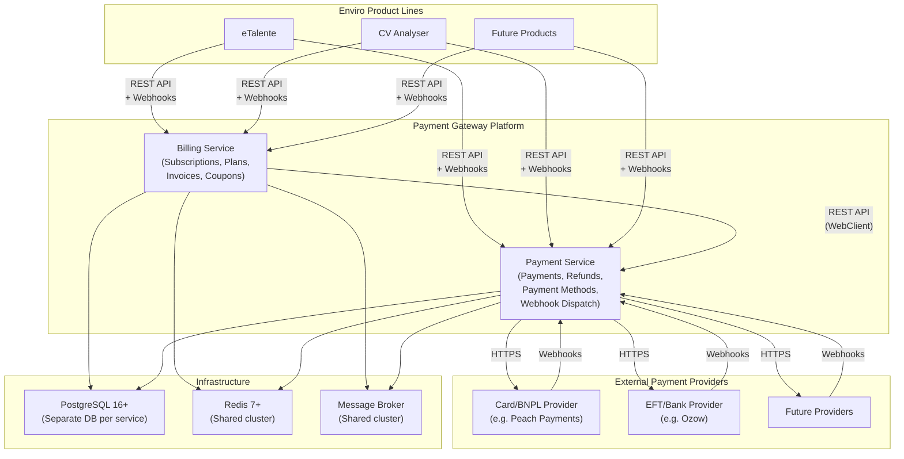
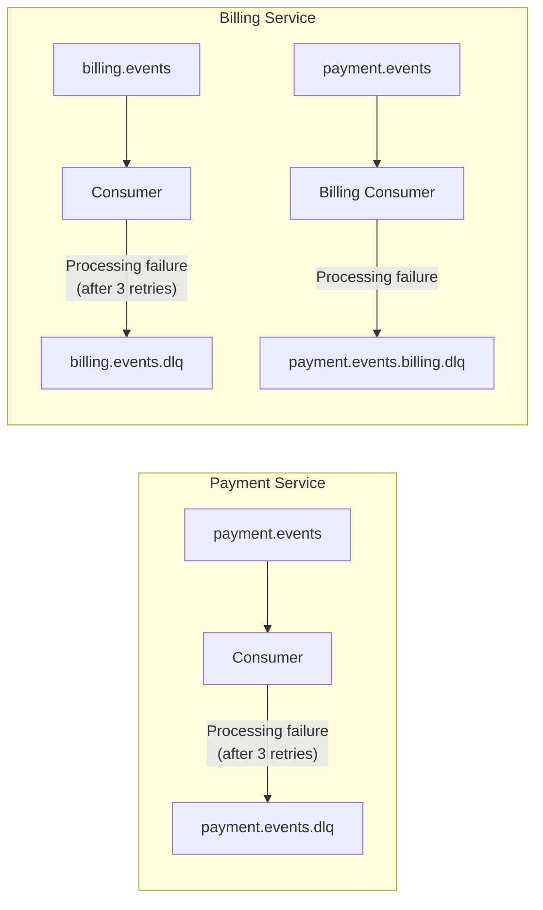
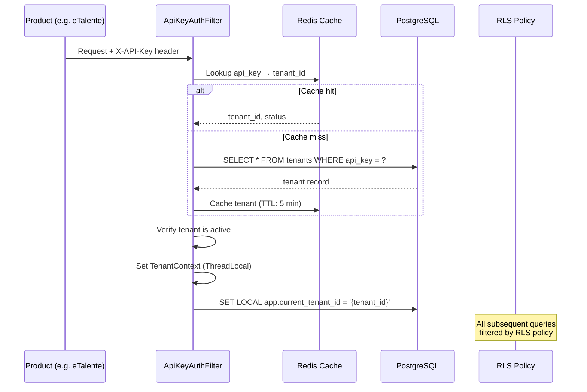
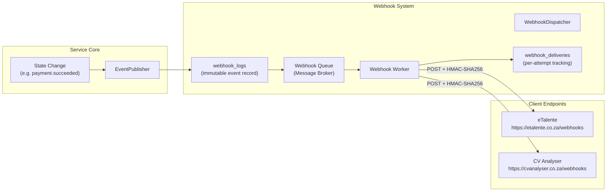
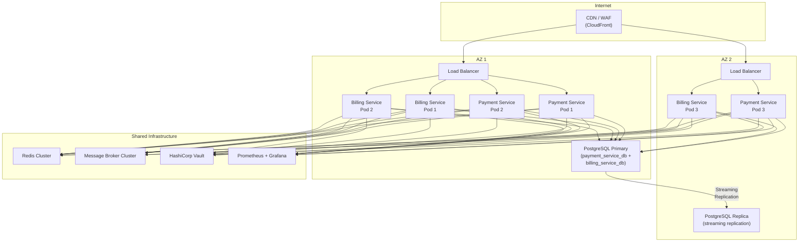

# System Architecture — Payment Gateway Platform

## 1. Executive Summary

The Payment Gateway Platform is an internal, centralised platform comprising **two independent services** that together provide payment processing and subscription billing capabilities for all Enviro product lines.

| Service | Responsibility | Port |
|---------|---------------|------|
| **Payment Service** | Provider-agnostic payment processing, refunds, payment method management, outgoing webhook dispatch | `8080` |
| **Billing Service** | Subscription plans, subscriptions, coupons, invoicing, usage metering, billing analytics | `8081` |

The **Payment Service** is the lower-level abstraction: it talks to external payment providers (card processors, EFT gateways, BNPL platforms) and exposes a unified API. The **Billing Service** is a client of the Payment Service — it orchestrates recurring billing, plan management, and invoicing by delegating actual payment execution to the Payment Service.

### Target Market

South Africa. ZAR is the default currency. Compliance requirements include PCI DSS (SAQ-A via hosted checkout / tokenisation), POPIA (Protection of Personal Information Act), 3D Secure (mandatory for SA card-not-present), and SARB (South African Reserve Bank) regulations.

### Design Principles

| # | Principle | Implication |
|---|-----------|-------------|
| 1 | **Provider-agnostic** | All provider-specific logic is behind SPI boundaries. Peach Payments and Ozow are reference implementations only — never hardcoded architectural choices. |
| 2 | **Multi-tenant** | Every data table carries a tenant identifier. PostgreSQL Row-Level Security (RLS) enforces isolation at the database level. |
| 3 | **Event-driven** | State changes are published to event topics via a message broker. Both services dispatch HTTP webhooks to downstream consumers. |
| 4 | **Modular monolith per service** | Each service is internally organised into bounded modules (hexagonal / ports-and-adapters) but deployed as a single unit. |
| 5 | **Idempotent by default** | All mutating API endpoints accept an `Idempotency-Key` header. Cached responses avoid duplicate processing. |
| 6 | **SA-compliant** | PCI DSS, POPIA, 3DS, SARB built into the architecture — not bolted on. |

---

## 2. Technology Stack

Both services share the same core technology stack:

| Layer | Technology | Version | Notes |
|-------|-----------|---------|-------|
| Language | Java | 21 (LTS) | Virtual threads, pattern matching, sealed classes |
| Framework | Spring Boot | 3.x | WebMVC, Security, Data JPA, Validation, Actuator |
| Primary Database | PostgreSQL | 16+ | Row-Level Security, JSONB, partial indexes |
| Cache | Redis | 7+ | Idempotency, rate limiting, tenant resolution, session cache |
| Message Broker | TBD | — | Event streaming, Dead Letter Queues (broker choice pending — e.g., Kafka, RabbitMQ, Amazon SQS/SNS) |
| HTTP Client | Spring WebClient | (WebFlux) | Billing → Payment Service calls; Payment → Provider calls |
| ORM | Spring Data JPA / Hibernate | 6.x | DDL via Flyway, validate-only at runtime |
| Migrations | Flyway | 10.x | Versioned SQL migrations per service |
| Scheduling | Quartz | 2.x | Subscription renewal, invoice generation, usage aggregation |
| Mapping | MapStruct | 1.5.x | DTO ↔ Entity mapping |
| Observability | Micrometer + Prometheus + Grafana | — | Metrics, dashboards |
| Tracing | OpenTelemetry | — | Distributed tracing across both services |
| API Docs | SpringDoc OpenAPI | 2.3.x | Auto-generated Swagger UI per service |
| Testing | JUnit 5 + Testcontainers + WireMock + jqwik | — | Unit, integration, property-based, contract |
| Build | Maven | 3.9.x | Multi-module parent POM |
| Container | Docker + Docker Compose | — | Local dev and CI |
| Orchestration | Kubernetes | — | Production deployment |
| Secrets | HashiCorp Vault / K8s Secrets | — | Provider credentials, DB passwords, API keys |

---

## 3. System Context



### Service Boundaries

| Concern | Payment Service | Billing Service |
|---------|----------------|-----------------|
| **Owns** | Payment execution, refund execution, payment method tokenisation, provider abstraction (SPI), incoming provider webhooks, outgoing client webhooks, tenant registration | Subscription plans, subscriptions, coupons/discounts, invoices, proration, trial management, usage metering, billing analytics, API key lifecycle |
| **Calls** | External payment providers (Peach, Ozow, etc.) | Payment Service (via REST) |
| **Called by** | Billing Service, Enviro products | Enviro products |
| **Database** | `payment_service_db` | `billing_service_db` |
| **Event topics (publishes)** | `payment.events`, `refund.events`, `payment-method.events` | `subscription.events`, `invoice.events`, `billing.events` |
| **Event topics (consumes)** | DLQ: `payment.events.dlq` | `payment.events` (for async payment results), DLQ: `billing.events.dlq` |

---

## 4. Inter-Service Communication

### Synchronous: Billing → Payment Service (REST)

The Billing Service calls the Payment Service via Spring WebClient with the following contract:

```yaml
# Billing Service application.yml
payment-service:
  base-url: ${PAYMENT_SERVICE_URL:http://payment-service:8080}
  api-key: ${PAYMENT_SERVICE_API_KEY}
  webhook-secret: ${PAYMENT_SERVICE_WEBHOOK_SECRET}
  timeout: 30s
  retry-attempts: 3
  retry-delay: 1s
```

**Operations the Billing Service invokes on the Payment Service:**

| Operation | Method | Path | When |
|-----------|--------|------|------|
| Create Customer | POST | `/api/v1/customers` | Subscription creation |
| Get Customer | GET | `/api/v1/customers/{id}` | Subscription lookup |
| Create Payment | POST | `/api/v1/payments` | Invoice payment, renewal charge |
| Get Payment | GET | `/api/v1/payments/{id}` | Status check |
| List Payment Methods | GET | `/api/v1/payment-methods?customerId=X` | Show customer's saved methods |
| Set Default Method | POST | `/api/v1/payment-methods/{id}/set-default` | Customer preference change |
| Create Refund | POST | `/api/v1/payments/{paymentId}/refunds` | Proration credit, dispute |
| Get Refund | GET | `/api/v1/refunds/{id}` | Status check |

**Error handling:**
- `TimeoutException` / `ResourceAccessException` → queue for retry (max 5 retries), throw `ServiceUnavailableException`
- 4xx → map to `BillingException`, surface to caller
- 5xx → retry with exponential backoff, then `PaymentServiceException`
- Circuit breaker wraps all calls (Resilience4j)

### Asynchronous: Payment Service → Billing Service (Webhooks + Message Broker)

When a payment reaches a terminal state, the Payment Service:
1. Publishes an event to the `payment.events` topic
2. Dispatches an HTTP webhook to all registered webhook endpoints (including the Billing Service's inbound webhook)

The Billing Service receives Payment Service webhooks at:
```
POST /api/v1/webhooks/payment-service
```

**Events the Billing Service handles:**

| Payment Service Event | Billing Service Action |
|----------------------|----------------------|
| `payment.succeeded` | Mark invoice as `paid`, advance subscription period |
| `payment.failed` | Mark invoice as `past_due`, increment retry counter |
| `payment.requires_action` | Notify customer (3DS required) |
| `payment_method.attached` | Activate subscription (if `INCOMPLETE`) |
| `payment_method.detached` | Warn if subscription relies on this method |
| `payment_method.updated` | Update cached method details |
| `refund.succeeded` | Apply proration credit |
| `refund.failed` | Alert, log for manual review |

### Dead Letter Queues

Both services implement DLQ patterns for the message broker:



DLQ messages are:
- Logged with full context (event ID, error, stack trace, attempt count)
- Alertable via Prometheus metrics (`broker_dlq_messages_total`)
- Manually replayable via admin tooling

---

## 5. Multi-Tenancy Architecture

Both services use the same multi-tenancy model: **shared database, shared schema, tenant isolation via `tenant_id` column + PostgreSQL Row-Level Security (RLS)**.

### Tenant Resolution Flow



### Row-Level Security

Each tenant-scoped table has RLS enabled:

```sql
-- Example: payments table in Payment Service
ALTER TABLE payments ENABLE ROW LEVEL SECURITY;
ALTER TABLE payments FORCE ROW LEVEL SECURITY;

CREATE POLICY tenant_isolation_payments ON payments
    USING (tenant_id = current_setting('app.current_tenant_id')::uuid);

CREATE POLICY tenant_isolation_payments_insert ON payments
    FOR INSERT WITH CHECK (tenant_id = current_setting('app.current_tenant_id')::uuid);
```

**Formal invariant:** For any two tenants `t1 ≠ t2`:
```
data(operation, t1) ∩ data(operation, t2) = ∅
```

### Tenant Lifecycle

| State | Description | API Access |
|-------|-------------|------------|
| `pending` | Registered, awaiting activation | Blocked |
| `active` | Operational | Full access |
| `suspended` | Temporarily disabled (e.g. non-payment) | Blocked |
| `deleted` | Soft-deleted | Blocked |

---

## 6. Outgoing Webhook Dispatch System

Both services dispatch HTTP webhooks to registered client endpoints. The mechanism is identical in both services.

> **Transactional Outbox**: Events are first persisted to an `outbox_events` table within the same database transaction as the domain state change. An `OutboxPoller` then asynchronously reads unpublished events and dispatches them to the webhook system (via the message broker or directly). This ensures at-least-once delivery even if the broker is temporarily unavailable — no event is lost because the outbox record survives in the database.

### Architecture



### Webhook Payload Format

```json
{
  "id": "evt_a1b2c3d4-e5f6-7890-abcd-ef1234567890",
  "type": "payment.succeeded",
  "created": 1711324800,
  "data": {
    "id": "pay_...",
    "amount": 15000,
    "currency": "ZAR",
    "status": "succeeded"
  }
}
```

### Signature

All outgoing webhooks are signed with HMAC-SHA256 using the per-endpoint shared secret:

```
X-Webhook-Signature: sha256=<hex(HMAC-SHA256(payload, secret))>
X-Event-Type: payment.succeeded
X-Webhook-ID: evt_a1b2c3d4-e5f6-7890-abcd-ef1234567890
```

### Retry Strategy

| Attempt | Delay | Cumulative |
|---------|-------|-----------|
| 1 | 30 seconds | 30s |
| 2 | 2 minutes | ~2.5 min |
| 3 | 15 minutes | ~17.5 min |
| 4 | 1 hour | ~1h 17min |
| 5 | 4 hours | ~5h 17min |
| After 5 | Permanently failed | ~5.5 h |

- **Retry on:** 5xx, 408, 429, network timeout, connection error
- **No retry on:** 2xx (success), 4xx (except 408/429)
- **Max retries:** 5 attempts over ~5.5 hours
- **Tracking:** Each attempt creates a `webhook_deliveries` row with `response_status`, `response_body`, `error_message`, `next_retry_at`

### Webhook Event Types

**Payment Service events:**
- `payment.created`, `payment.processing`, `payment.succeeded`, `payment.failed`, `payment.canceled`, `payment.requires_action`
- `refund.created`, `refund.processing`, `refund.succeeded`, `refund.failed`
- `payment_method.attached`, `payment_method.detached`, `payment_method.updated`, `payment_method.expired`

**Billing Service events:**
- `subscription.created`, `subscription.updated`, `subscription.canceled`, `subscription.trial_ending`
- `invoice.created`, `invoice.paid`, `invoice.payment_failed`, `invoice.payment_requires_action`

---

## 7. Redis Architecture

Redis serves as a shared cluster across both services with the following usage patterns:

| Usage | Key Pattern | TTL | Service |
|-------|------------|-----|---------|
| **API key → tenant resolution** | `tenant:apikey:{hash}` | 5 min | Both |
| **Idempotency check** | `idempotency:{tenant_id}:{key}` | 24 h | Both |
| **Rate limiting** | `ratelimit:{tenant_id}:{window}` | 1 min | Both |
| **Revoked key cache** | `apikey:revoked:{prefix}` | 24 h (grace period) | Billing |
| **Processor config cache** | `processor:config:{tenant_id}` | 10 min | Payment |
| **Webhook retry schedule** | `webhook:retry:{delivery_id}` | Until next retry | Both |

### Configuration

```yaml
spring:
  data:
    redis:
      host: ${REDIS_HOST:localhost}
      port: ${REDIS_PORT:6379}
      password: ${REDIS_PASSWORD}
      timeout: 2000ms
      lettuce:
        pool:
          max-active: 20
          max-idle: 10
          min-idle: 5
```

---

## 8. Deployment Architecture

### Production Topology



### Kubernetes Resources

Each service has its own Deployment:

```yaml
# Payment Service
apiVersion: apps/v1
kind: Deployment
metadata:
  name: payment-service
spec:
  replicas: 3
  template:
    spec:
      containers:
        - name: payment-service
          image: enviro/payment-service:latest
          ports:
            - containerPort: 8080
          resources:
            requests: { memory: "512Mi", cpu: "500m" }
            limits: { memory: "1Gi", cpu: "1000m" }
          livenessProbe:
            httpGet: { path: /actuator/health/liveness, port: 8080 }
            initialDelaySeconds: 30
            periodSeconds: 10
          readinessProbe:
            httpGet: { path: /actuator/health/readiness, port: 8080 }
            initialDelaySeconds: 20
            periodSeconds: 5
          env:
            - name: SPRING_DATASOURCE_URL
              valueFrom: { secretKeyRef: { name: payment-db-secret, key: url } }
            - name: REDIS_HOST
              valueFrom: { configMapKeyRef: { name: infra-config, key: redis-host } }
            - name: BROKER_CONNECTION
              valueFrom: { configMapKeyRef: { name: infra-config, key: broker-connection } }
```

```yaml
# Billing Service
apiVersion: apps/v1
kind: Deployment
metadata:
  name: billing-service
spec:
  replicas: 3
  template:
    spec:
      containers:
        - name: billing-service
          image: enviro/billing-service:latest
          ports:
            - containerPort: 8081
          resources:
            requests: { memory: "512Mi", cpu: "500m" }
            limits: { memory: "1Gi", cpu: "1000m" }
          env:
            - name: PAYMENT_SERVICE_URL
              value: "http://payment-service:8080"
            - name: PAYMENT_SERVICE_API_KEY
              valueFrom: { secretKeyRef: { name: billing-ps-secret, key: api-key } }
```

### Environments

| Environment | Payment Providers | Database | Purpose |
|-------------|------------------|----------|---------|
| **Local** | WireMock stubs | Docker Compose PostgreSQL | Developer workstations |
| **Dev** | Provider sandbox APIs | Shared dev PostgreSQL | Integration testing |
| **Staging** | Provider sandbox APIs | Staging PostgreSQL | Pre-production validation |
| **Production** | Live provider APIs | Production PostgreSQL (AZ-replicated) | Live traffic |

---

## 9. Observability

### Health Checks

Both services expose Spring Actuator endpoints:

| Endpoint | Purpose |
|----------|---------|
| `/actuator/health` | Composite health (DB, Redis, message broker) |
| `/actuator/health/liveness` | K8s liveness probe |
| `/actuator/health/readiness` | K8s readiness probe |
| `/actuator/info` | Build info, git commit |
| `/actuator/prometheus` | Prometheus metrics scrape |

### Key Metrics

| Metric | Type | Labels |
|--------|------|--------|
| `payment_requests_total` | Counter | `status`, `provider`, `tenant_id` |
| `payment_request_duration_seconds` | Histogram | `provider`, `operation` |
| `webhook_dispatch_total` | Counter | `event_type`, `status` |
| `webhook_dispatch_duration_seconds` | Histogram | `event_type` |
| `broker_dlq_messages_total` | Counter | `topic`, `error_type` |
| `subscription_events_total` | Counter | `event_type`, `tenant_id` |
| `invoice_payment_attempts_total` | Counter | `status`, `tenant_id` |
| `redis_cache_hits_total` | Counter | `cache_name` |
| `redis_cache_misses_total` | Counter | `cache_name` |
| `payment_service_client_duration_seconds` | Histogram | `operation`, `status` |
| `circuit_breaker_state` | Gauge | `name` |

### Distributed Tracing

OpenTelemetry propagates trace context across:
- Enviro Product → Billing Service → Payment Service → External Provider
- Message broker headers carry `traceparent`
- Webhook dispatch includes `X-Correlation-ID` header

### Alerting Rules (Examples)

| Alert | Condition | Severity |
|-------|-----------|----------|
| PaymentFailureRateHigh | `rate(payment_requests_total{status="failed"}[5m]) > 0.1` | Critical |
| WebhookDeliveryBacklog | `webhook_deliveries_pending > 1000` | Warning |
| DLQMessagesAccumulating | `increase(broker_dlq_messages_total[1h]) > 10` | Warning |
| PaymentServiceLatencyHigh | `histogram_quantile(0.95, payment_service_client_duration_seconds) > 5` | Warning |
| RedisConnectionFailure | `redis_connection_active == 0` | Critical |

---

## 10. Performance SLOs

| Metric | Target |
|--------|--------|
| Payment Service API p50 | < 200ms |
| Payment Service API p95 | < 500ms (depends on provider) |
| Payment Service API p99 | < 2000ms |
| Billing Service API p50 | < 100ms (excl. Payment Service calls) |
| Billing Service API p95 | < 300ms (excl. Payment Service calls) |
| Billing Service API p99 | < 1000ms (incl. Payment Service calls) |
| Webhook delivery p95 | < 5s |
| Payment Service webhook ack | < 500ms |
| DB query p95 | < 50ms |
| Redis cache hit rate | > 95% |
| System availability | 99.9% uptime |

### Scalability Targets

- 10,000 API requests/minute per tenant
- 1,000+ tenants
- Stateless app servers, horizontal scaling
- RTO: 4 hours, RPO: 1 hour

---

## 11. Key Design Decisions

| # | Decision | Rationale | Trade-off |
|---|----------|-----------|-----------|
| 1 | **Two services, not one** | Payment processing and billing/subscription management have different change rates, failure modes, and scaling needs. A payment outage should not prevent plan management. | Increased operational complexity (2 deployments, inter-service calls). |
| 2 | **Modular monolith per service** | Each service has tight internal coupling (e.g., invoice → subscription → plan). Splitting further into microservices adds overhead without clear benefit for a small team. | Cannot scale individual modules independently within a service. |
| 3 | **Provider-agnostic SPI** | Business must be free to add/swap providers without code changes to core logic. Strategy + Factory pattern with Spring auto-discovery. | Providers with unique features may require SPI extensions. |
| 4 | **PostgreSQL RLS for tenant isolation** | Database-level enforcement is stronger than application-level filtering — no code bug can leak data across tenants. | Slight query overhead; requires `SET LOCAL` on every request. |
| 5 | **Redis for caching + rate limiting** | Tenant resolution and idempotency checks happen on every request — must be sub-millisecond. PostgreSQL alone can't sustain this at scale. | Redis becomes a critical dependency; needs cluster mode for HA. |
| 6 | **Outgoing webhook dispatch** | Products need real-time notifications without polling. A message broker alone requires products to run consumers, which is heavy. HTTP webhooks are universally consumable. | Webhook delivery is at-least-once; clients must handle duplicates. |
| 7 | **Separate databases per service** | Payment and billing data have different retention, compliance, and backup requirements. Separate DBs enable independent scaling and migration. | Cross-service joins impossible; must use API calls. |
| 8 | **ZAR default, SA compliance built-in** | Primary market is South Africa. PCI DSS SAQ-A, POPIA, 3DS mandatory. Building for SA first; international expansion via provider SPI. | Some product-design docs reference USD/Stripe — adapted for SA. |
| 9 | **Java 21 with virtual threads** | Virtual threads simplify concurrent I/O (provider calls, webhook dispatch) without reactive programming complexity. | Requires Java 21 runtime; some libraries may not be virtual-thread-safe. |
| 10 | **Dead Letter Queues** | Failed messages must not block processing. DLQ captures failures for investigation and replay without data loss. | DLQ requires monitoring and manual/automated replay tooling. |

---

## 12. Risks and Mitigations

| Risk | Impact | Likelihood | Mitigation |
|------|--------|-----------|------------|
| Payment provider outage | Cannot process payments | Medium | Multi-provider SPI with fallback routing; circuit breaker per provider |
| Payment Service outage | Billing Service cannot charge | Medium | Retry queue with exponential backoff; cached payment status in Billing DB; graceful degradation (subscription stays active, charges retry) |
| Redis outage | Rate limiting and caching fail | Low | Fallback to PostgreSQL for tenant resolution; reject requests if rate limiting unavailable (fail-closed) |
| Message broker outage | Events not delivered | Low | Outbox pattern (events persisted to DB first, then published); webhook dispatch continues via DB polling |
| Tenant data leak | Regulatory violation, trust loss | Very Low (with RLS) | PostgreSQL RLS + application-level checks + audit logging + penetration testing |
| Provider API changes | Integration breaks | Medium | Contract tests per provider; adapter isolation via SPI; sandbox integration tests in CI |
| DLQ accumulation | Unprocessed events pile up | Medium | Prometheus alerts on DLQ depth; automated replay for transient failures; ops playbook for manual investigation |

---

## 13. Document Index

This document is the system-level overview. Detailed design for each service is in the corresponding subdirectory:

### Payment Service (`docs/payment-service/`)
- `architecture-design.md` — Internal architecture, component design, SPI contract
- `database-schema-design.md` — All Payment Service tables, DDL, indexes, migrations
- `api-specification.yaml` — OpenAPI 3.0 specification for all Payment Service endpoints
- `payment-flow-diagrams.md` — Sequence and state diagrams for payment flows
- `provider-integration-guide.md` — SPI contract, Peach Payments and Ozow reference implementations
- `compliance-security-guide.md` — PCI DSS, 3DS, POPIA, encryption for payment data

### Billing Service (`docs/billing-service/`)
- `architecture-design.md` — Internal architecture, component design, Payment Service integration
- `database-schema-design.md` — All Billing Service tables, DDL, indexes, migrations
- `api-specification.yaml` — OpenAPI 3.0 specification for all Billing Service endpoints
- `billing-flow-diagrams.md` — Sequence and state diagrams for subscription and billing flows
- `compliance-security-guide.md` — RLS, POPIA, audit logging, data retention

### Shared (`docs/shared/`)
- `system-architecture.md` — This document
- `integration-guide.md` — Consumer onboarding guide for both services
- `correctness-properties.md` — Formal invariants and correctness properties
