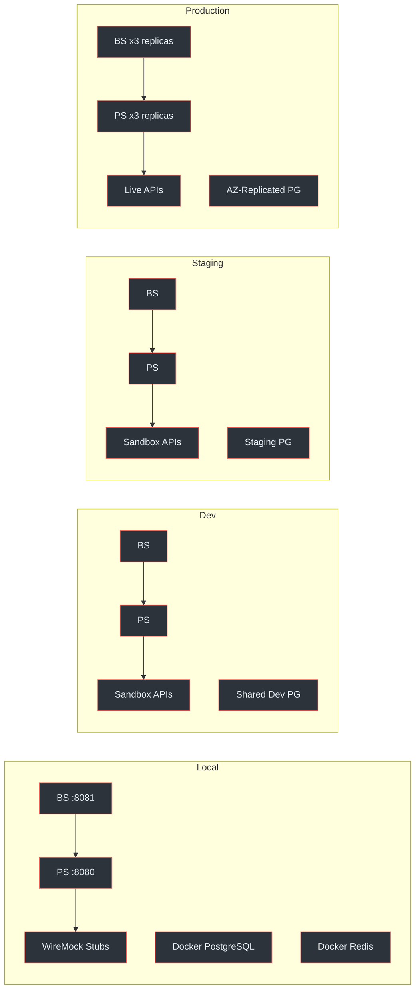
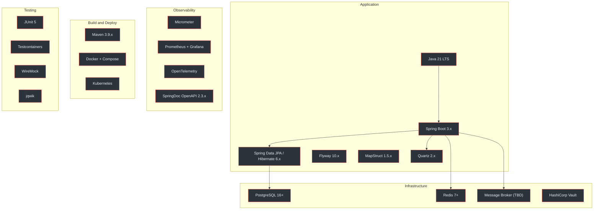
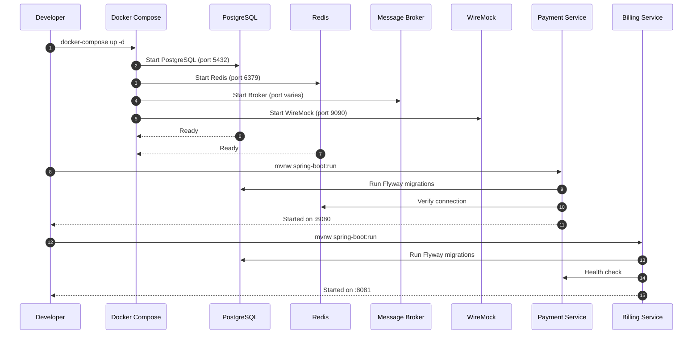
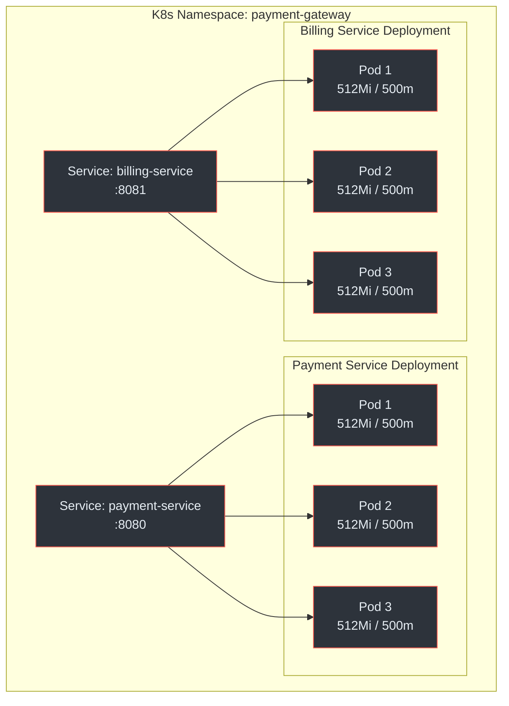

# Environment Setup

This page covers the four deployment environments, the technology stack, local development setup with Docker Compose, and infrastructure configuration for both the Payment Service and Billing Service.

## At a Glance

| Attribute | Detail |
|---|---|
| **Environments** | Local, Dev, Staging, Production |
| **Language** | Java 21 (LTS) with virtual threads |
| **Framework** | Spring Boot 3.x (WebMVC, Security, Data JPA, Actuator) |
| **Build** | Maven 3.9.x multi-module |
| **Database** | PostgreSQL 16+ (separate DB per service) |
| **Cache** | Redis 7+ (shared cluster) |
| **Migrations** | Flyway 10.x (versioned SQL) |
| **Container** | Docker + Docker Compose (local/CI) |
| **Orchestration** | Kubernetes (staging/production) |
| **Scheduling** | Quartz 2.x (Billing Service only) |
| **Observability** | Micrometer + Prometheus + Grafana + OpenTelemetry |

(docs/shared/system-architecture.md:32-54)

---

## Environment Matrix

The platform runs across four environments, each with different provider connectivity and infrastructure.



<!-- Sources: docs/shared/system-architecture.md:487-493, docs/shared/integration-guide.md:114-118 -->

| Environment | Payment Providers | Database | Purpose | Credentials |
|---|---|---|---|---|
| <span class="ok">Local</span> | WireMock stubs | Docker Compose PostgreSQL | Developer workstations | Local test keys |
| <span class="ok">Dev</span> | Provider sandbox APIs | Shared dev PostgreSQL | Integration testing | Dev API keys |
| <span class="warn">Staging</span> | Provider sandbox APIs | Staging PostgreSQL | Pre-production validation | Staging API keys |
| <span class="fail">Production</span> | Live provider APIs | AZ-replicated PostgreSQL | Live traffic | Production API keys |

(docs/shared/system-architecture.md:487-493)

### Base URLs per Environment

| Environment | Payment Service | Billing Service |
|---|---|---|
| Local | `http://localhost:8080/api/v1` | `http://localhost:8081/api/v1` |
| Dev | `https://payments-dev.enviro.co.za/api/v1` | `https://billing-dev.enviro.co.za/api/v1` |
| Staging | `https://payments-staging.enviro.co.za/api/v1` | `https://billing-staging.enviro.co.za/api/v1` |
| Production | `https://payments.enviro.co.za/api/v1` | `https://billing.enviro.co.za/api/v1` |

(docs/payment-service/api-specification.yaml:28-36, docs/billing-service/api-specification.yaml:28-36)

---

## Technology Stack

The full technology stack shared by both services:



<!-- Sources: docs/shared/system-architecture.md:32-54 -->

### Stack Detail

| Layer | Technology | Version | Notes |
|---|---|---|---|
| Language | Java | 21 (LTS) | Virtual threads, pattern matching, sealed classes |
| Framework | Spring Boot | 3.x | WebMVC, Security, Data JPA, Validation, Actuator |
| ORM | Hibernate | 6.x | DDL via Flyway, validate-only at runtime |
| Migrations | Flyway | 10.x | Versioned SQL migrations per service |
| Mapping | MapStruct | 1.5.x | DTO-to-entity mapping |
| HTTP Client | Spring WebClient | (WebFlux) | BS-to-PS calls, PS-to-provider calls |
| Scheduling | Quartz | 2.x | Billing Service only: renewals, invoice generation, trials |
| Database | PostgreSQL | 16+ | RLS, JSONB, partial indexes. Separate DB per service. |
| Cache | Redis | 7+ | Idempotency, rate limiting, tenant resolution |
| Broker | TBD | -- | Kafka / RabbitMQ / SQS. Event streaming + DLQ. |
| Secrets | Vault | -- | Provider credentials, DB passwords. K8s Secrets fallback. |
| API Docs | SpringDoc | 2.3.x | Auto-generated Swagger UI per service |
| Build | Maven | 3.9.x | Multi-module parent POM |
| Testing | JUnit 5 + Testcontainers + WireMock + jqwik | -- | Unit, integration, property-based, contract |

(docs/shared/system-architecture.md:32-54, docs/payment-service/architecture-design.md:24-26)

---

## Local Development Setup

The local environment uses Docker Compose for infrastructure and WireMock for provider simulation. No real payment provider connectivity is needed.

### Prerequisites

| Requirement | Minimum Version |
|---|---|
| Java JDK | 21 (LTS) |
| Maven | 3.9.x |
| Docker | 24+ |
| Docker Compose | v2+ |
| Git | 2.x |

### Quick Start

```bash
# 1. Clone the repository
git clone https://github.com/enviro/payment-gateway.git
cd payment-gateway

# 2. Start infrastructure (PostgreSQL, Redis, Message Broker, WireMock)
docker-compose -f docker-compose.dev.yml up -d

# 3. Verify infrastructure is running
docker-compose -f docker-compose.dev.yml ps

# 4. Run Payment Service (port 8080)
./mvnw spring-boot:run -pl payment-service -Dspring.profiles.active=local

# 5. In a separate terminal, run Billing Service (port 8081)
./mvnw spring-boot:run -pl billing-service -Dspring.profiles.active=local

# 6. Verify both services are healthy
curl http://localhost:8080/actuator/health
curl http://localhost:8081/actuator/health
```

(docs/shared/integration-guide.md:917-931)

### Infrastructure Startup Sequence



<!-- Sources: docs/shared/integration-guide.md:917-931, docs/shared/system-architecture.md:487-493 -->

---

## Infrastructure Components

### Docker Compose Services

The `docker-compose.dev.yml` file provisions all dependencies for local development:

| Service | Image | Port | Purpose |
|---|---|---|---|
| `postgres` | `postgres:16` | 5432 | Both databases (`payment_service_db`, `billing_service_db`) |
| `redis` | `redis:7-alpine` | 6379 | Shared cache cluster |
| `broker` | TBD | varies | Message broker for events and DLQ |
| `wiremock` | `wiremock/wiremock` | 9090 | Simulates external payment provider responses |

(docs/shared/system-architecture.md:32-54, docs/shared/integration-guide.md:921-931)

### PostgreSQL Configuration

Each service connects to its own database on the shared PostgreSQL instance:

```yaml
# Payment Service (application-local.yml)
spring:
  datasource:
    url: jdbc:postgresql://localhost:5432/payment_service_db
    username: ${DB_USER:payment_user}
    password: ${DB_PASSWORD:local_password}
  jpa:
    hibernate:
      ddl-auto: validate   # Flyway handles DDL
    properties:
      hibernate.default_schema: public

# Billing Service (application-local.yml)
spring:
  datasource:
    url: jdbc:postgresql://localhost:5432/billing_service_db
    username: ${DB_USER:billing_user}
    password: ${DB_PASSWORD:local_password}
```

Flyway runs automatically on startup, applying all versioned migrations from each service's `src/main/resources/db/migration/` directory.

(docs/shared/system-architecture.md:39-44, docs/payment-service/architecture-design.md:24-26)

### Redis Configuration

Both services connect to the same Redis instance locally:

```yaml
spring:
  data:
    redis:
      host: ${REDIS_HOST:localhost}
      port: ${REDIS_PORT:6379}
      password: ${REDIS_PASSWORD:}
      timeout: 2000ms
      lettuce:
        pool:
          max-active: 20
          max-idle: 10
          min-idle: 5
```

(docs/shared/system-architecture.md:358-372)

### WireMock (Provider Simulation)

WireMock stubs simulate payment provider responses for local development. This allows end-to-end testing without external provider connectivity.

| Provider | Stub Path | Simulated Behaviour |
|---|---|---|
| Card (Peach Payments) | `wiremock/peach/` | Checkout creation, payment status, webhooks |
| EFT (Ozow) | `wiremock/ozow/` | Payment initiation, notification callbacks |

WireMock runs on port `9090` and is configured via JSON mapping files in the repository's `wiremock/` directory.

(docs/shared/integration-guide.md:917-931, docs/payment-service/architecture-design.md:130-146)

---

## Spring Profiles

Each environment uses a Spring profile to control configuration:

| Profile | Activated By | Description |
|---|---|---|
| `local` | `-Dspring.profiles.active=local` | Docker Compose infra, WireMock providers, debug logging |
| `dev` | K8s ConfigMap | Shared dev infra, provider sandbox mode |
| `staging` | K8s ConfigMap | Staging infra, provider sandbox mode, production-like config |
| `production` | K8s ConfigMap | Production infra, live providers, strict security |

### Profile-Specific Configuration

| Setting | Local | Dev | Staging | Production |
|---|---|---|---|---|
| DB Host | `localhost:5432` | `dev-pg.internal` | `stg-pg.internal` | `prod-pg.internal` |
| Redis Host | `localhost:6379` | `dev-redis.internal` | `stg-redis.internal` | `prod-redis.internal` |
| Provider Mode | WireMock | Sandbox | Sandbox | Live |
| Log Level | `DEBUG` | `INFO` | `INFO` | `WARN` |
| TLS Required | No | Yes | Yes | Yes |
| Swagger UI | Enabled | Enabled | Enabled | Disabled |

(docs/shared/system-architecture.md:487-493, docs/payment-service/api-specification.yaml:28-36)

---

## Build and Test Commands

### Maven Commands

```bash
# Full build (all modules)
./mvnw clean install

# Build without tests
./mvnw clean install -DskipTests

# Run Payment Service tests only
./mvnw test -pl payment-service

# Run Billing Service tests only
./mvnw test -pl billing-service

# Run integration tests (requires Docker for Testcontainers)
./mvnw verify -pl payment-service -Pintegration-test
./mvnw verify -pl billing-service -Pintegration-test

# Generate API docs
./mvnw springdoc-openapi:generate -pl payment-service
./mvnw springdoc-openapi:generate -pl billing-service
```

(docs/shared/system-architecture.md:50-52, docs/payment-service/architecture-design.md:106-108)

### Project Structure

```
payment-gateway/
  pom.xml                          # Parent POM (Maven multi-module)
  payment-service/
    pom.xml
    src/main/java/com/enviro/payment/
    src/main/resources/
      application.yml
      application-local.yml
      db/migration/                # Flyway migrations
    src/test/
  billing-service/
    pom.xml
    src/main/java/com/enviro/billing/
    src/main/resources/
      application.yml
      application-local.yml
      db/migration/                # Flyway migrations
    src/test/
  docker-compose.dev.yml           # Local infrastructure
  wiremock/                        # Provider stubs
  docs/                            # Design documents
```

(docs/payment-service/architecture-design.md:108-183, docs/billing-service/architecture-design.md:113-200)

---

## Health Checks and Verification

Both services expose Spring Actuator endpoints for health verification:

| Endpoint | Purpose |
|---|---|
| `/actuator/health` | Composite health (DB, Redis, broker) |
| `/actuator/health/liveness` | Kubernetes liveness probe |
| `/actuator/health/readiness` | Kubernetes readiness probe |
| `/actuator/info` | Build info and git commit |
| `/actuator/prometheus` | Prometheus metrics scrape endpoint |

(docs/shared/system-architecture.md:498-508)

### Verifying Local Setup

```bash
# Check Payment Service health
curl -s http://localhost:8080/actuator/health | jq .

# Expected: {"status":"UP","components":{"db":{"status":"UP"},"redis":{"status":"UP"}}}

# Check Billing Service health
curl -s http://localhost:8081/actuator/health | jq .

# Check Swagger UI
# Payment Service: http://localhost:8080/swagger-ui.html
# Billing Service: http://localhost:8081/swagger-ui.html
```

---

## Kubernetes Configuration (Staging / Production)

In non-local environments, both services are deployed to Kubernetes with the following resource configuration:



<!-- Sources: docs/shared/system-architecture.md:422-483 -->

### Resource Limits

| Resource | Per Pod |
|---|---|
| CPU Request | 500m |
| CPU Limit | 1000m |
| Memory Request | 512Mi |
| Memory Limit | 1Gi |
| Replicas | 3 per service |

### Health Probes

| Probe | Path | Initial Delay | Period |
|---|---|---|---|
| Liveness | `/actuator/health/liveness` | 30s | 10s |
| Readiness | `/actuator/health/readiness` | 20s | 5s |

(docs/shared/system-architecture.md:422-483)

### Secrets Management

| Secret | Source | Used By |
|---|---|---|
| DB connection URL | HashiCorp Vault / K8s Secret | Both services |
| DB password | HashiCorp Vault / K8s Secret | Both services |
| Redis password | K8s ConfigMap | Both services |
| Provider API credentials | HashiCorp Vault | Payment Service |
| Inter-service API key | K8s Secret | Billing Service |
| Webhook signing secrets | HashiCorp Vault | Both services |

(docs/shared/system-architecture.md:54, docs/shared/system-architecture.md:422-458)

---

## Sandbox Provider Configuration

Non-production environments connect to provider sandbox/test modes:

| Provider | Sandbox Endpoint | Config |
|---|---|---|
| Peach Payments (Card) | `https://testapi-v2.peachpayments.com` | Sandbox API key |
| Ozow (EFT) | Same production URL with `IsTest=true` | Test mode flag |

(docs/shared/integration-guide.md:890-914)

### Test Card Numbers

| Card Number | Scenario |
|---|---|
| `4200 0000 0000 0000` | Successful payment |
| `4200 0000 0000 0018` | Payment declined |
| `4200 0000 0000 0026` | 3D Secure challenge |

Use any future expiry date and any 3-digit CVV. Provider-specific test cards may vary; consult the provider's sandbox documentation.

(docs/shared/integration-guide.md:900-910)

::: tip
EFT test modes do not process real bank transactions. Some providers (e.g. Ozow) do not send notification callbacks for test transactions. Poll `GET /payments/{paymentId}` to verify test results.
:::

(docs/shared/integration-guide.md:912-914)

---

## Related Pages

| Page | Description |
|---|---|
| [Platform Overview](./platform-overview) | Architecture overview, service boundaries, and deployment topology |
| [Integration Quickstart](./integration-quickstart) | Authentication, first payment, webhooks, and error handling |
| [Payment Service Architecture](../02-architecture/payment-service/) | Internal architecture, SPI contract, and provider adapters |
| [Billing Service Architecture](../02-architecture/billing-service/) | Subscription lifecycle, scheduling, and invoice generation |
| [Inter-Service Communication](../02-architecture/inter-service-communication) | Sync/async communication patterns between services |
| [Security and Compliance](../03-deep-dive/security-compliance/) | PCI DSS, POPIA, 3DS, encryption, and audit logging |
| [Contributor Onboarding](../onboarding/contributor) | Getting started as a contributor to the platform |
