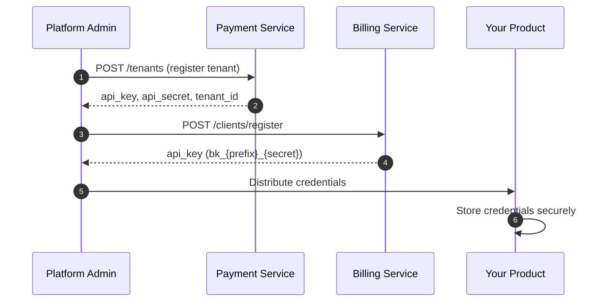
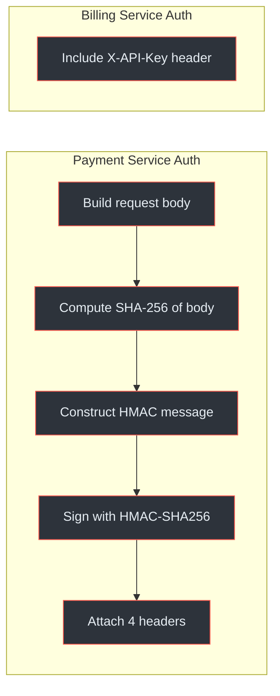
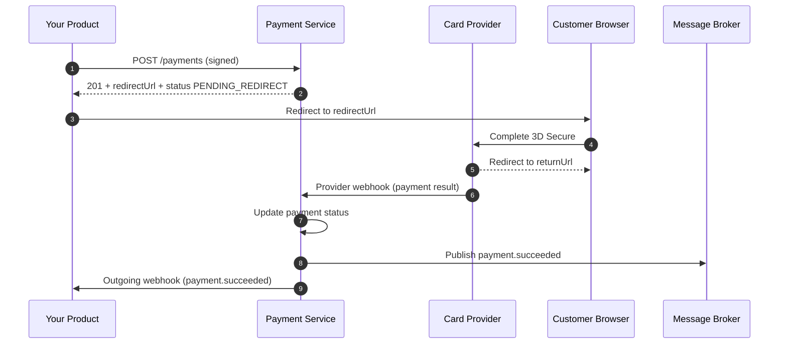
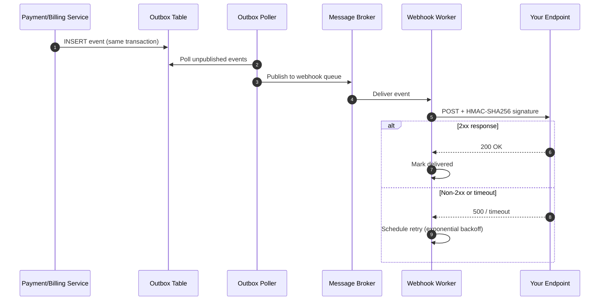
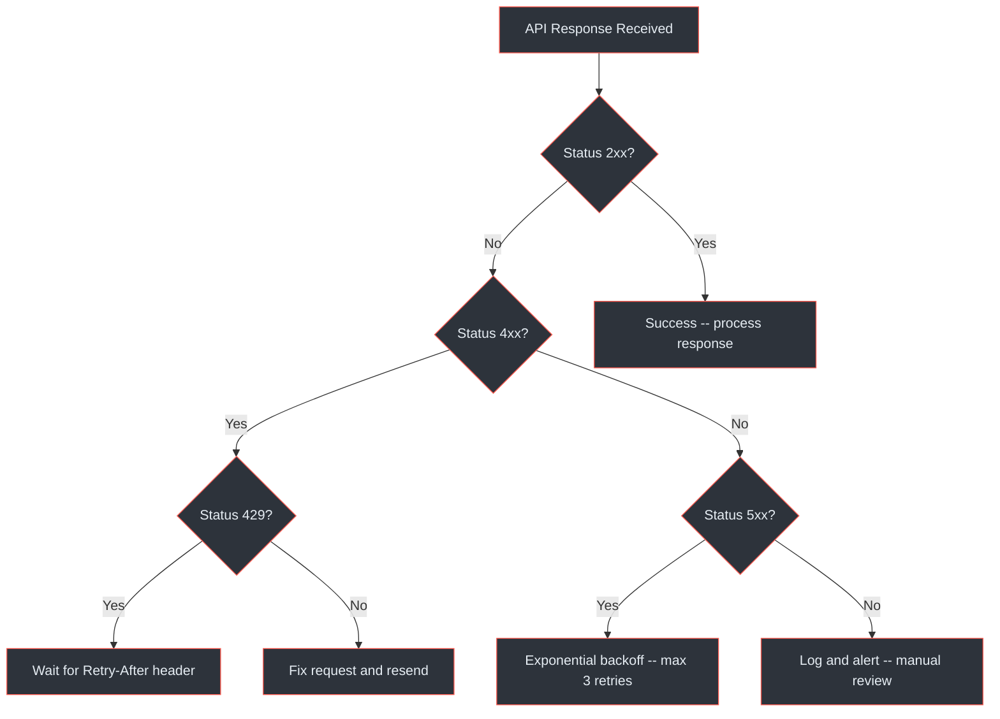

# Integration Quickstart

This guide walks product teams through the complete integration journey: registering as a client, authenticating requests, processing a first payment, receiving webhooks, and handling errors. Both the Payment Service and Billing Service are covered.

## At a Glance

| Step | Action | Service |
|---|---|---|
| 1 | Register as a client and receive credentials | Both |
| 2 | Configure authentication headers | Both |
| 3 | Create a payment or subscription | Payment / Billing |
| 4 | Register a webhook endpoint | Both |
| 5 | Verify webhook signatures | Both |
| 6 | Handle errors and retries | Both |

(docs/shared/integration-guide.md:82-126)

---

## Step 1 -- Client Registration

Before calling any API, your product must be registered as a tenant. Each service has its own credential model.



<!-- Sources: docs/shared/integration-guide.md:96-110, docs/billing-service/api-specification.yaml:58-80 -->

### Credential Summary

| Credential | Payment Service | Billing Service |
|---|---|---|
| **API Key** | `ak_prod_a1b2c3d4e5f6` | `bk_{prefix}_{secret}` |
| **API Secret** | Separate value for HMAC signing | Embedded in the key itself |
| **Tenant ID** | UUID, passed in `X-Tenant-ID` header | Resolved from API key automatically |
| **Environments** | Separate keys per environment | Separate keys per environment |
| **Rotation** | Admin operation | Self-service via `POST /clients/api-keys/rotate` |

(docs/shared/integration-guide.md:96-110, docs/billing-service/api-specification.yaml:58-80)

### Base URLs

| Environment | Payment Service | Billing Service |
|---|---|---|
| <span class="ok">Local</span> | `http://localhost:8080/api/v1` | `http://localhost:8081/api/v1` |
| <span class="warn">Staging</span> | `https://payments-staging.internal.enviro.co.za/api/v1` | `https://billing-staging.internal.enviro.co.za/api/v1` |
| <span class="fail">Production</span> | `https://payments.internal.enviro.co.za/api/v1` | `https://billing.internal.enviro.co.za/api/v1` |

(docs/shared/integration-guide.md:114-118)

---

## Step 2 -- Authentication

The two services use **different authentication models**. Understanding the difference is critical before writing any integration code.



<!-- Sources: docs/shared/integration-guide.md:129-190 -->

### Payment Service -- HMAC-SHA256

Every request to the Payment Service requires **four headers**:

| Header | Value | Purpose |
|---|---|---|
| `X-API-Key` | Your API key | Identifies your product |
| `X-Tenant-ID` | Your tenant UUID | Selects the tenant context |
| `X-Timestamp` | Unix epoch seconds | Replay protection (5-minute window) |
| `X-Signature` | HMAC-SHA256 hex string | Request integrity verification |

(docs/shared/integration-guide.md:133-139)

**Signature computation:**

```
Signature = HMAC-SHA256(
    key     = api_secret,
    message = HTTP_METHOD + "\n"
            + REQUEST_PATH + "\n"
            + TIMESTAMP + "\n"
            + SHA256(request_body)
)
```

(docs/shared/integration-guide.md:152-165)

**Validation rules:**

- Timestamp must be within **5 minutes** of server clock
- Signature must match the computed value exactly
- API key must be active and associated with the specified tenant

(docs/shared/integration-guide.md:167-170)

#### Java -- Signing a Request

```java
public class PaymentServiceClient {
    private final String apiKey;
    private final String apiSecret;
    private final String tenantId;

    public HttpRequest signRequest(String method, String path,
                                    String body, String idempotencyKey) throws Exception {
        String timestamp = String.valueOf(Instant.now().getEpochSecond());
        String bodyHash = sha256Hex(body);
        String message = method + "\n" + path + "\n" + timestamp + "\n" + bodyHash;
        String signature = hmacSha256(apiSecret, message);

        return HttpRequest.newBuilder()
            .uri(URI.create(baseUrl + path))
            .header("Content-Type", "application/json")
            .header("X-API-Key", apiKey)
            .header("X-Tenant-ID", tenantId)
            .header("X-Timestamp", timestamp)
            .header("X-Signature", signature)
            .header("Idempotency-Key", idempotencyKey)
            .method(method, HttpRequest.BodyPublishers.ofString(body))
            .build();
    }

    private String hmacSha256(String key, String data) throws Exception {
        Mac mac = Mac.getInstance("HmacSHA256");
        mac.init(new SecretKeySpec(
            key.getBytes(StandardCharsets.UTF_8), "HmacSHA256"));
        return bytesToHex(mac.doFinal(data.getBytes(StandardCharsets.UTF_8)));
    }

    private String sha256Hex(String data) throws Exception {
        MessageDigest digest = MessageDigest.getInstance("SHA-256");
        return bytesToHex(digest.digest(data.getBytes(StandardCharsets.UTF_8)));
    }

    private String bytesToHex(byte[] bytes) {
        StringBuilder sb = new StringBuilder();
        for (byte b : bytes) sb.append(String.format("%02x", b));
        return sb.toString();
    }
}
```

(docs/shared/integration-guide.md:952-1017)

#### cURL -- Signing a Request

```bash
# Variables
API_KEY="ak_prod_a1b2c3d4e5f6"
API_SECRET="your_api_secret"
TENANT_ID="550e8400-e29b-41d4-a716-446655440000"
TIMESTAMP=$(date +%s)
BODY='{"amount":299.99,"currency":"ZAR","paymentMethod":"CARD"}'

# Compute body hash and signature
BODY_HASH=$(echo -n "$BODY" | sha256sum | awk '{print $1}')
MESSAGE="POST\n/api/v1/payments\n${TIMESTAMP}\n${BODY_HASH}"
SIGNATURE=$(echo -ne "$MESSAGE" | openssl dgst -sha256 -hmac "$API_SECRET" | awk '{print $2}')

curl -X POST https://payments.internal.enviro.co.za/api/v1/payments \
  -H "Content-Type: application/json" \
  -H "X-API-Key: ${API_KEY}" \
  -H "X-Tenant-ID: ${TENANT_ID}" \
  -H "X-Timestamp: ${TIMESTAMP}" \
  -H "X-Signature: ${SIGNATURE}" \
  -H "Idempotency-Key: $(uuidgen)" \
  -d "$BODY"
```

(docs/shared/integration-guide.md:1190-1211)

### Billing Service -- API Key

Every request to the Billing Service requires a **single header**:

```
X-API-Key: bk_abc12345_a7f8b3c2d1e4f5a6b7c8d9e0f1a2b3c4d5e6f7a8
```

The prefix (`bk_abc12345`) is used for fast lookup; the full key is verified against a BCrypt hash server-side. No HMAC signing is required.

(docs/shared/integration-guide.md:172-180)

#### Key Rotation (Self-Service)

```bash
curl -X POST /api/v1/clients/api-keys/rotate \
  -H "X-API-Key: bk_abc12345_currentSecret"
```

The response includes the new key (shown **once**). Both old and new keys remain valid for a **24-hour grace period**.

(docs/shared/integration-guide.md:182-189)

---

## Step 3 -- First Payment (End-to-End)

This section walks through a complete card payment from request to confirmation.



<!-- Sources: docs/shared/integration-guide.md:259-308, docs/payment-service/api-specification.yaml:56-80 -->

### 3a. Create the Payment

```bash
curl -X POST https://payments.internal.enviro.co.za/api/v1/payments \
  -H "Content-Type: application/json" \
  -H "X-API-Key: ak_prod_a1b2c3d4e5f6" \
  -H "X-Tenant-ID: 550e8400-e29b-41d4-a716-446655440000" \
  -H "X-Timestamp: 1711360200" \
  -H "X-Signature: computed_signature_here" \
  -H "Idempotency-Key: ord_abc123_pay" \
  -d '{
    "amount": 299.99,
    "currency": "ZAR",
    "paymentMethod": "CARD",
    "customerEmail": "jane@example.com",
    "customerId": "cust_456",
    "returnUrl": "https://yourapp.enviro.co.za/payment/complete",
    "cancelUrl": "https://yourapp.enviro.co.za/payment/cancel",
    "metadata": {
      "orderId": "ord_abc123",
      "description": "Premium feature purchase"
    }
  }'
```

(docs/shared/integration-guide.md:264-283)

### 3b. Response

```json
{
  "paymentId": "pay_f47ac10b-58cc-4372-a567-0e02b2c3d479",
  "status": "PENDING_REDIRECT",
  "provider": "card-provider",
  "redirectUrl": "https://provider.example.com/checkout/...",
  "amount": 299.99,
  "currency": "ZAR",
  "paymentMethod": "CARD",
  "createdAt": "2026-03-25T10:30:00Z"
}
```

::: warning
**HTTP 201 does not mean payment succeeded.** The `status` field may be `PENDING_REDIRECT`, `PROCESSING`, or even `FAILED` for token-based charges. Always check the `status` field in the response body rather than relying on the HTTP status code alone.
:::

(docs/shared/integration-guide.md:286-309)

### 3c. Redirect and Confirm

1. Redirect the customer's browser to `redirectUrl`
2. Customer completes 3D Secure on the provider's hosted page
3. Customer is redirected back to your `returnUrl`
4. Listen for events on the `payment.events` topic or poll `GET /payments/{paymentId}`

### Supported Payment Methods

| Method | Provider Type | Notes |
|---|---|---|
| `CARD` | Card (e.g. Peach Payments) | Visa, Mastercard, Amex. 3DS required. |
| `EFT` | EFT (e.g. Ozow) | Instant EFT, all major SA banks |
| `BNPL` | Card (e.g. Peach Payments) | Buy Now Pay Later |
| `WALLET` | Card (e.g. Peach Payments) | Mobile wallets |
| `QR_CODE` | Card (e.g. Peach Payments) | QR code payments |
| `CAPITEC_PAY` | EFT (e.g. Ozow) | Capitec banking app |
| `PAYSHAP` | EFT (e.g. Ozow) | PayShap instant payment |

(docs/shared/integration-guide.md:339-347, docs/payment-service/api-specification.yaml:22-24)

### Idempotency

All mutating endpoints require an `Idempotency-Key` header (UUID recommended, max 64 chars). Keys expire after 24 hours.

| Scenario | Result |
|---|---|
| Same key + same body | Cached response returned (same HTTP status) |
| Same key + different body | `409 Conflict` |
| Key expired (>24h) | Treated as a new request |

(docs/shared/integration-guide.md:193-234)

---

## Step 4 -- Webhook Setup

Both services dispatch HTTP webhooks signed with HMAC-SHA256 to your registered endpoints.



<!-- Sources: docs/shared/system-architecture.md:256-330, docs/shared/integration-guide.md:699-787 -->

### Registering an Endpoint

**Payment Service** -- Configured by the platform admin during tenant registration.

**Billing Service** -- Self-service via API:

```bash
curl -X POST https://billing.internal.enviro.co.za/api/v1/webhooks \
  -H "X-API-Key: bk_abc12345_yourSecretKey" \
  -H "Idempotency-Key: webhook_register_001" \
  -d '{
    "url": "https://yourapp.enviro.co.za/webhooks/billing",
    "events": [
      "subscription.created",
      "invoice.paid",
      "invoice.payment_failed"
    ],
    "secret": "your_webhook_shared_secret"
  }'
```

(docs/shared/integration-guide.md:704-718)

### Retry Policy

| Attempt | Delay | Cumulative |
|---|---|---|
| 1 | 30 seconds | 30s |
| 2 | 2 minutes | ~2.5 min |
| 3 | 15 minutes | ~17.5 min |
| 4 | 1 hour | ~1h 17min |
| 5 | 4 hours | ~5h 17min |
| After 5 | Permanently failed | -- |

(docs/shared/system-architecture.md:317-324)

- Retries on: `5xx`, `408`, `429`, network timeout, connection error
- No retry on: `2xx` (success), `4xx` (except `408`/`429`)
- Endpoint auto-disabled after **10+ consecutive failures**

---

## Step 5 -- Webhook Signature Verification

Every outgoing webhook includes a signature header for verification:

```
X-Webhook-Signature: t=1711360200,v1=a3f1b2c4d5e6f7a8...
X-Webhook-ID: del_unique_delivery_id
```

(docs/shared/integration-guide.md:741-745)

### Verification Algorithm (Java)

```java
public boolean verifyWebhookSignature(HttpServletRequest request,
                                       String rawBody,
                                       String webhookSecret) {
    // 1. Parse the signature header
    String header = request.getHeader("X-Webhook-Signature");
    String timestamp = extractField(header, "t");
    String receivedSignature = extractField(header, "v1");

    // 2. Construct the signed payload
    String signedPayload = timestamp + "." + rawBody;

    // 3. Compute expected signature
    Mac mac = Mac.getInstance("HmacSHA256");
    mac.init(new SecretKeySpec(
        webhookSecret.getBytes(StandardCharsets.UTF_8), "HmacSHA256"));
    String expectedSignature = bytesToHex(
        mac.doFinal(signedPayload.getBytes(StandardCharsets.UTF_8)));

    // 4. Constant-time comparison (prevents timing attacks)
    boolean valid = MessageDigest.isEqual(
        receivedSignature.getBytes(),
        expectedSignature.getBytes());

    // 5. Reject stale timestamps (>5 minutes = possible replay)
    long age = Instant.now().getEpochSecond() - Long.parseLong(timestamp);
    return valid && age <= 300;
}
```

(docs/shared/integration-guide.md:748-775)

### Delivery Guarantees

| Aspect | Behaviour |
|---|---|
| Delivery model | At-least-once (may receive duplicates) |
| Deduplication | Use `X-Webhook-ID` header to detect duplicates |
| Success criteria | Return HTTP `2xx` within 30 seconds |
| Auto-disable | After 10+ consecutive failures |

(docs/shared/integration-guide.md:779-787)

---

## Step 6 -- Error Handling

Both services return errors in a consistent JSON format:

```json
{
  "error": {
    "code": "PAYMENT_FAILED",
    "message": "Payment was declined by the card issuer",
    "details": {},
    "requestId": "req_xyz789",
    "timestamp": "2026-03-25T10:30:00Z"
  }
}
```

(docs/shared/integration-guide.md:793-806)

### Common Error Codes (Both Services)

| HTTP | Code | Retryable | Action |
|---|---|---|---|
| 400 | `VALIDATION_ERROR` | No | Fix the request body |
| 401 | `INVALID_API_KEY` | No | Check credentials or rotation status |
| 404 | Resource not found | No | Verify the entity ID |
| 409 | `IDEMPOTENCY_CONFLICT` | No | Use a new idempotency key |
| 429 | `RATE_LIMIT_EXCEEDED` | Yes | Wait for `Retry-After` header duration |
| 500 | `INTERNAL_ERROR` | Yes | Exponential backoff (max 3 retries) |

(docs/shared/integration-guide.md:808-818)

### Payment Service Error Codes

| HTTP | Code | Description |
|---|---|---|
| 401 | `INVALID_SIGNATURE` | HMAC signature verification failed |
| 401 | `TIMESTAMP_EXPIRED` | Request timestamp outside 5-minute window |
| 422 | `PAYMENT_FAILED` | Payment declined by provider |
| 422 | `REFUND_EXCEEDS_AMOUNT` | Refund amount exceeds original payment |
| 422 | `INVALID_PAYMENT_STATE` | Operation not allowed for current status |
| 503 | `PROVIDER_UNAVAILABLE` | Payment provider is temporarily down |

(docs/shared/integration-guide.md:819-828)

### Billing Service Error Codes

| HTTP | Code | Description |
|---|---|---|
| 403 | `TENANT_SUSPENDED` | Tenant account is suspended |
| 409 | `CUSTOMER_ALREADY_SUBSCRIBED` | Customer already has active subscription |
| 422 | `INVALID_COUPON` | Coupon expired, archived, or exhausted |
| 422 | `COUPON_NOT_APPLICABLE` | Coupon does not apply to selected plan |
| 422 | `INVALID_SUBSCRIPTION_STATE` | Operation not valid for current status |
| 502 | `PAYMENT_SERVICE_ERROR` | Payment Service returned an error |
| 503 | `PAYMENT_SERVICE_UNAVAILABLE` | Payment Service is unreachable |

(docs/shared/integration-guide.md:831-844)

### Retry Decision Flow



<!-- Sources: docs/shared/integration-guide.md:846-857 -->

### Rate Limits

Both services enforce per-tenant rate limits (default: 500 requests/minute). Rate limit headers are returned on every response:

```
X-RateLimit-Limit: 500
X-RateLimit-Remaining: 423
X-RateLimit-Reset: 1711360260
```

When rate-limited, the API returns HTTP `429` with a `Retry-After` header.

(docs/shared/integration-guide.md:861-883)

---

## Event Types Reference

Events are the recommended way to track payment and billing lifecycle. Both services publish CloudEvents 1.0 messages.

### Payment Service Events

| Event Type | Trigger |
|---|---|
| `payment.created` | Payment initiated |
| `payment.processing` | Payment submitted to provider |
| `payment.succeeded` | Payment completed successfully |
| `payment.failed` | Payment declined or failed |
| `payment.canceled` | Payment canceled |
| `payment.requires_action` | 3DS or other customer action needed |
| `refund.created` | Refund initiated |
| `refund.succeeded` | Refund completed |
| `refund.failed` | Refund failed |
| `payment_method.attached` | Payment method added |
| `payment_method.detached` | Payment method removed |

(docs/shared/integration-guide.md:643-659)

### Billing Service Events

| Event Type | Trigger |
|---|---|
| `subscription.created` | New subscription created |
| `subscription.updated` | Plan change, period advance, metadata update |
| `subscription.canceled` | Subscription canceled |
| `subscription.trial_ending` | 3 days before trial end |
| `invoice.created` | New invoice generated |
| `invoice.paid` | Invoice payment succeeded |
| `invoice.payment_failed` | Invoice payment failed |
| `invoice.payment_requires_action` | 3DS required for invoice payment |

(docs/shared/integration-guide.md:661-672)

---

## Integration Checklist

Use this checklist to verify your integration is complete before going live.

- [ ] Credentials provisioned for all target environments
- [ ] Authentication working (HMAC for PS, API key for BS)
- [ ] Idempotency keys generated for all mutating requests
- [ ] Payment creation tested (card and/or EFT) with redirect flow
- [ ] Webhook endpoint registered and receiving events
- [ ] Webhook signature verification implemented
- [ ] Event deduplication logic in place (using event `id` or `X-Webhook-ID`)
- [ ] All expected error codes handled
- [ ] Rate limiting respected (`Retry-After` header)
- [ ] Subscription lifecycle tested (if using Billing Service)
- [ ] Load tested against staging environment

(docs/shared/integration-guide.md:1241-1290)

---

## Related Pages

| Page | Description |
|---|---|
| [Platform Overview](./platform-overview) | Architecture overview, service boundaries, and shared infrastructure |
| [Environment Setup](./environment-setup) | Local development setup, Docker Compose, and environment configuration |
| [Payment Service Architecture](../02-architecture/payment-service/) | Internal architecture, SPI contract, and provider adapters |
| [Billing Service Architecture](../02-architecture/billing-service/) | Subscription lifecycle, scheduling, and invoice generation |
| [Security and Compliance](../03-deep-dive/security-compliance/) | PCI DSS, POPIA, 3DS, encryption, and audit logging |
| [Authentication](../03-deep-dive/security-compliance/authentication) | Detailed authentication flow and HMAC implementation |
| [Provider Integrations](../03-deep-dive/provider-integrations) | Peach Payments and Ozow adapter details |
| [Contributor Onboarding](../onboarding/contributor) | Getting started as a contributor to the platform |
