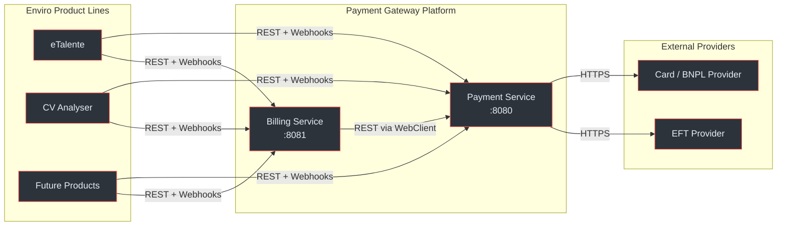
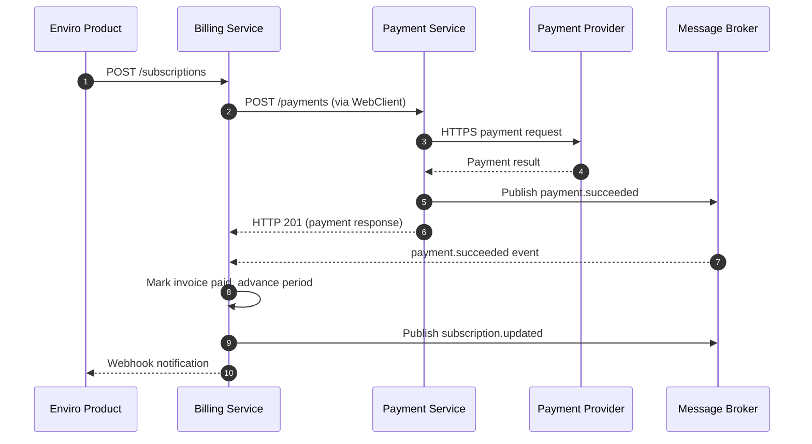
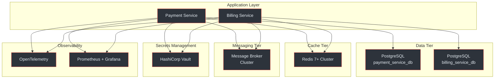
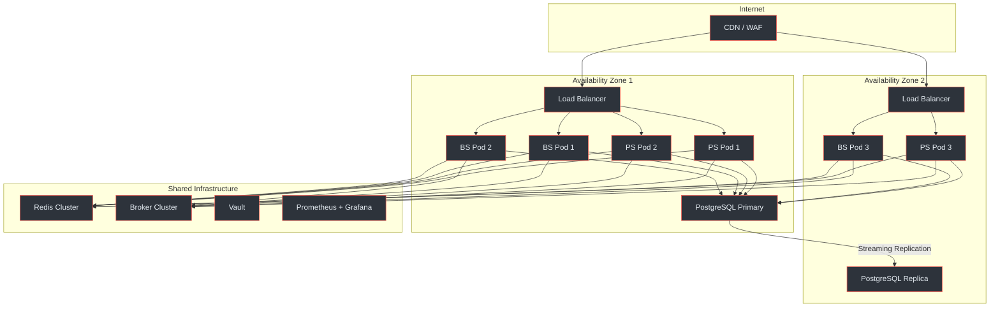
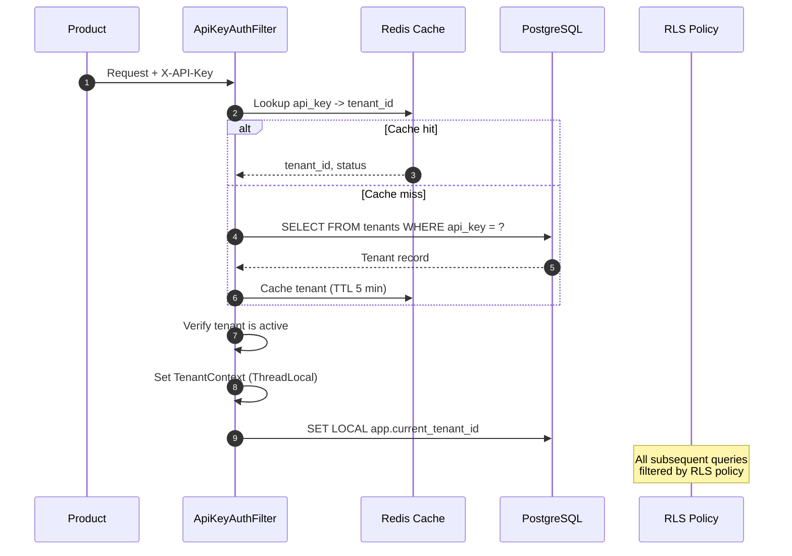

# Platform Overview

The Payment Gateway Platform is an internal, centralised platform comprising two independent services that provide payment processing and subscription billing capabilities for all Enviro product lines. This page covers the two-service architecture, service responsibilities, deployment topology, and shared infrastructure.

## At a Glance

| Attribute | Detail |
|---|---|
| **Services** | Payment Service `:8080`, Billing Service `:8081` |
| **Target Market** | South Africa (ZAR default) |
| **Compliance** | PCI DSS SAQ-A, POPIA, 3D Secure, SARB |
| **Language / Framework** | Java 21 (virtual threads), Spring Boot 3.x |
| **Database** | PostgreSQL 16+ (separate DB per service) |
| **Cache** | Redis 7+ (shared cluster) |
| **Message Broker** | TBD (Kafka / RabbitMQ / SQS) |
| **Secrets** | HashiCorp Vault / K8s Secrets |
| **Orchestration** | Kubernetes (3 replicas per service, 2 AZs) |
| **Design Pattern** | Modular monolith per service (hexagonal / ports-and-adapters) |

(docs/shared/system-architecture.md:3-27)

---

## Two-Service Architecture

The platform splits payment processing from subscription billing into two independently deployable services. Each service owns its own database, event topics, and failure domain.



<!-- Sources: docs/shared/system-architecture.md:60-94, docs/shared/integration-guide.md:41-56 -->

The **Payment Service** is the lower-level abstraction that communicates directly with external payment providers (card processors, EFT gateways, BNPL platforms). The **Billing Service** is a client of the Payment Service and never talks to providers directly.

(docs/shared/system-architecture.md:12)

---

## Service Responsibility Matrix

| Concern | Payment Service | Billing Service |
|---|---|---|
| **Port** | `:8080` | `:8081` |
| **Owns** | Payment execution, refunds, payment method tokenisation, provider abstraction (SPI), incoming provider webhooks, outgoing client webhooks, tenant registration | Subscription plans, subscriptions, coupons/discounts, invoices, proration, trials, usage metering, billing analytics, API key lifecycle |
| **Calls** | External payment providers (Peach, Ozow, etc.) | Payment Service (via REST) |
| **Called By** | Billing Service, Enviro products | Enviro products |
| **Database** | `payment_service_db` | `billing_service_db` |
| **Event Topics (publishes)** | `payment.events`, `refund.events`, `payment-method.events` | `subscription.events`, `invoice.events`, `billing.events` |
| **Event Topics (consumes)** | DLQ: `payment.events.dlq` | `payment.events`, DLQ: `billing.events.dlq` |
| **Authentication** | HMAC-SHA256 (4 headers) | API key (`bk_{prefix}_{secret}`) |
| **Amount Format** | DECIMAL(19,4) Rands | INTEGER cents |

(docs/shared/system-architecture.md:96-106, docs/payment-service/api-specification.yaml:22-24, docs/billing-service/api-specification.yaml:22-23)

---

## Inter-Service Communication

The Billing Service communicates with the Payment Service through two channels: synchronous REST calls (outbound) and asynchronous event consumption (inbound).



<!-- Sources: docs/shared/system-architecture.md:109-166, docs/billing-service/architecture-design.md:437-498 -->

### Synchronous Operations (Billing to Payment Service)

| Operation | Method | Path | Trigger |
|---|---|---|---|
| Create Customer | `POST` | `/api/v1/customers` | Subscription creation |
| Create Payment | `POST` | `/api/v1/payments` | Invoice payment, renewal |
| Get Payment | `GET` | `/api/v1/payments/{id}` | Status check |
| List Payment Methods | `GET` | `/api/v1/payment-methods?customerId=X` | Show saved methods |
| Set Default Method | `POST` | `/api/v1/payment-methods/{id}/set-default` | Preference change |
| Create Refund | `POST` | `/api/v1/payments/{paymentId}/refunds` | Proration credit |

(docs/shared/system-architecture.md:128-138)

### Error handling for inter-service calls uses Resilience4j circuit breakers with exponential backoff. The circuit is configured at 50% failure rate threshold with a 30-second open-state duration.

(docs/billing-service/architecture-design.md:500-522)

---

## Shared Infrastructure

Both services share a common infrastructure layer. Each component serves a distinct purpose in the platform.



<!-- Sources: docs/shared/system-architecture.md:32-54, docs/shared/system-architecture.md:346-372 -->

### Component Summary

| Component | Version | Usage |
|---|---|---|
| **PostgreSQL** | 16+ | Separate DB per service. Row-Level Security for tenant isolation. JSONB for flexible metadata. Flyway migrations. |
| **Redis** | 7+ | Shared cluster. Idempotency cache (24h TTL), API key resolution (5 min TTL), rate limiting (1 min window), processor config cache (10 min TTL). |
| **Message Broker** | TBD | Event streaming between services. Dead Letter Queues for failed processing. Partitioned by `tenant_id`. |
| **HashiCorp Vault** | -- | Provider credentials, DB passwords, API key secrets. K8s Secrets as fallback. |
| **OpenTelemetry** | -- | Distributed tracing across Product to Billing to Payment to Provider. `traceparent` propagation via HTTP headers and broker messages. |
| **Prometheus + Grafana** | -- | Metrics scraping via `/actuator/prometheus`. Dashboards for payment rates, webhook delivery, DLQ depth, latency percentiles. |

(docs/shared/system-architecture.md:346-372, docs/shared/system-architecture.md:496-524)

### Redis Key Patterns

| Usage | Key Pattern | TTL | Service |
|---|---|---|---|
| Tenant resolution | `tenant:apikey:{hash}` | 5 min | Both |
| Idempotency | `idempotency:{tenant_id}:{key}` | 24 h | Both |
| Rate limiting | `ratelimit:{tenant_id}:{window}` | 1 min | Both |
| Revoked key cache | `apikey:revoked:{prefix}` | 24 h | Billing |
| Processor config | `processor:config:{tenant_id}` | 10 min | Payment |
| Webhook retry | `webhook:retry:{delivery_id}` | Until next retry | Both |

(docs/shared/system-architecture.md:348-356)

---

## Deployment Topology

Production runs on Kubernetes across two Availability Zones with 3 replicas per service for high availability.



<!-- Sources: docs/shared/system-architecture.md:378-418 -->

### Kubernetes Resource Configuration

Each service deployment is configured with resource requests and limits, along with health probes:

| Resource | Payment Service | Billing Service |
|---|---|---|
| **Replicas** | 3 | 3 |
| **CPU Request** | 500m | 500m |
| **CPU Limit** | 1000m | 1000m |
| **Memory Request** | 512Mi | 512Mi |
| **Memory Limit** | 1Gi | 1Gi |
| **Liveness Probe** | `/actuator/health/liveness` | `/actuator/health/liveness` |
| **Readiness Probe** | `/actuator/health/readiness` | `/actuator/health/readiness` |
| **Liveness Delay** | 30s (period: 10s) | 30s (period: 10s) |
| **Readiness Delay** | 20s (period: 5s) | 20s (period: 5s) |

(docs/shared/system-architecture.md:422-483)

### Environment Matrix

| Environment | Payment Providers | Database | Purpose |
|---|---|---|---|
| <span class="ok">Local</span> | WireMock stubs | Docker Compose PostgreSQL | Developer workstations |
| <span class="ok">Dev</span> | Provider sandbox APIs | Shared dev PostgreSQL | Integration testing |
| <span class="warn">Staging</span> | Provider sandbox APIs | Staging PostgreSQL | Pre-production validation |
| <span class="fail">Production</span> | Live provider APIs | Production PostgreSQL (AZ-replicated) | Live traffic |

(docs/shared/system-architecture.md:487-493)

---

## Multi-Tenancy

Both services enforce tenant isolation at the database level through PostgreSQL Row-Level Security (RLS). Every data table carries a `tenant_id` column, and all queries are automatically filtered by the current tenant context.



<!-- Sources: docs/shared/system-architecture.md:197-222 -->

**Formal invariant:** For any two tenants `t1` and `t2` where `t1 != t2`:

```
data(operation, t1) INTERSECT data(operation, t2) = EMPTY
```

(docs/shared/system-architecture.md:240-243)

### Tenant Lifecycle States

| State | Description | API Access |
|---|---|---|
| `pending` | Registered, awaiting activation | <span class="fail">Blocked</span> |
| `active` | Operational | <span class="ok">Full access</span> |
| `suspended` | Temporarily disabled | <span class="fail">Blocked</span> |
| `deleted` | Soft-deleted | <span class="fail">Blocked</span> |

(docs/shared/system-architecture.md:247-253)

---

## Performance SLOs

| Metric | Target |
|---|---|
| Payment Service API p50 | < 200ms |
| Payment Service API p95 | < 500ms |
| Payment Service API p99 | < 2000ms |
| Billing Service API p50 | < 100ms (excl. PS calls) |
| Billing Service API p95 | < 300ms (excl. PS calls) |
| Webhook delivery p95 | < 5s |
| DB query p95 | < 50ms |
| Redis cache hit rate | > 95% |
| System availability | 99.9% uptime |

(docs/shared/system-architecture.md:546-559)

### Scalability Targets

- 10,000 API requests/minute per tenant
- 1,000+ tenants
- Stateless app servers with horizontal scaling
- RTO: 4 hours, RPO: 1 hour

(docs/shared/system-architecture.md:563-566)

---

## Key Design Decisions

| Decision | Rationale | Trade-off |
|---|---|---|
| Two services, not one | Different change rates, failure modes, and scaling needs | Increased operational complexity |
| Modular monolith per service | Tight internal coupling within each service | Cannot scale individual modules independently |
| Provider-agnostic SPI | Freedom to add/swap providers without core code changes | Unique provider features may require SPI extensions |
| PostgreSQL RLS for isolation | Database-level enforcement is stronger than app-level filtering | Slight query overhead; requires `SET LOCAL` per request |
| Redis for caching + rate limiting | Sub-millisecond tenant resolution and idempotency checks | Redis becomes a critical dependency |
| Separate databases per service | Different retention, compliance, and backup requirements | Cross-service joins impossible |
| Java 21 virtual threads | Simplifies concurrent I/O without reactive complexity | Requires Java 21 runtime |

(docs/shared/system-architecture.md:570-583)

---

## Related Pages

| Page | Description |
|---|---|
| [Integration Quickstart](./integration-quickstart) | Step-by-step guide to authenticate and make your first payment |
| [Environment Setup](./environment-setup) | Local development setup, Docker Compose, and environment configuration |
| [Payment Service Architecture](../02-architecture/payment-service/) | Deep dive into Payment Service internal architecture and SPI |
| [Billing Service Architecture](../02-architecture/billing-service/) | Deep dive into Billing Service internal architecture and scheduling |
| [Inter-Service Communication](../02-architecture/inter-service-communication) | Detailed coverage of sync/async communication patterns |
| [Event System](../02-architecture/event-system) | Event schemas, topics, and the transactional outbox pattern |
| [Security and Compliance](../03-deep-dive/security-compliance/) | PCI DSS, POPIA, 3DS, encryption, and audit logging |
| [Contributor Onboarding](../onboarding/contributor) | Getting started as a contributor to the platform |
