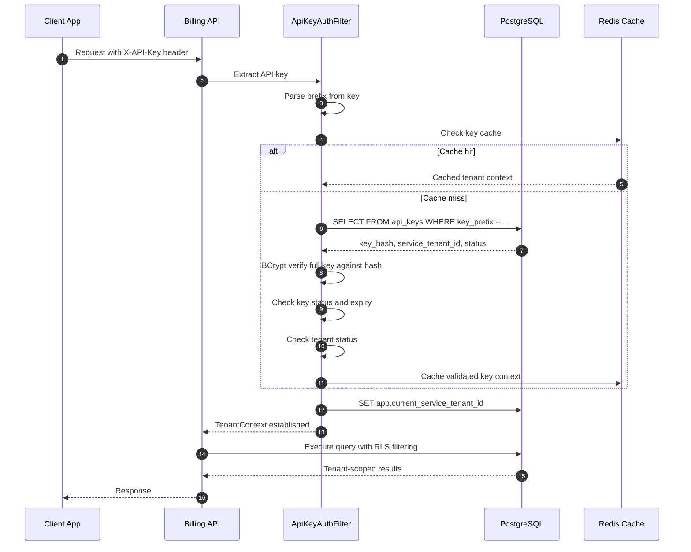
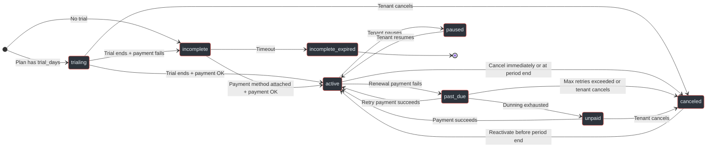
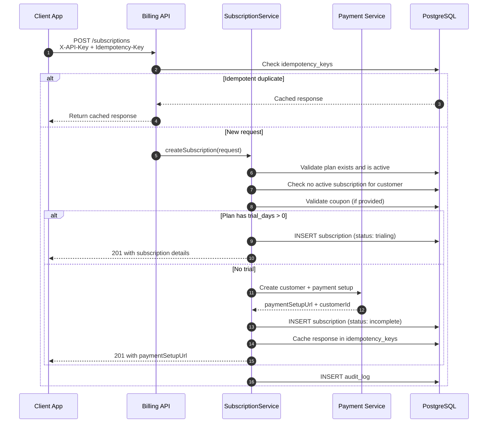
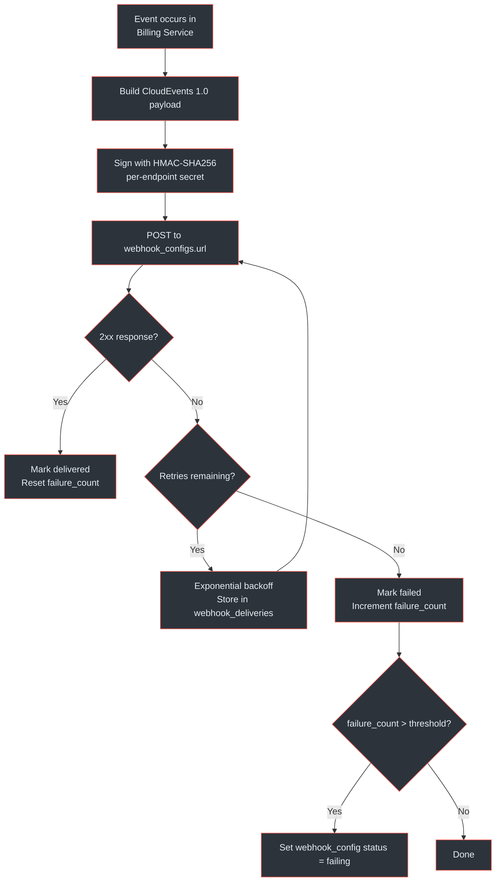

# API Reference

## At a Glance

| Metric | Value |
|--------|-------|
| Base URL | `/api/v1` |
| Total endpoints | 35+ |
| Endpoint groups | 8 (Clients, Plans, Subscriptions, Invoices, Coupons, Usage, Webhooks, Health) |
| Auth (tenant endpoints) | `X-API-Key` header (`bk_{prefix}_{secret}`) |
| Auth (admin endpoints) | Bearer JWT (`AdminAuth`) |
| Pagination | `page`, `size`, `sort` query params |
| Default page size | 20 (max 100) |
| Rate limit | 500 req/min per tenant (configurable) |
| Idempotency | `Idempotency-Key` header (24h TTL) |
| Monetary values | INTEGER cents (ZAR default) |
| Content type | `application/json` |

> Full OpenAPI 3.0.3 spec: `docs/billing-service/api-specification.yaml`
> Architecture context: `docs/billing-service/architecture-design.md`

---

## Authentication

The Billing Service uses two authentication schemes depending on the endpoint type.

### API Key Authentication (Tenant Endpoints)

All tenant-scoped endpoints require an `X-API-Key` header. The key format is `bk_{prefix}_{secret}` — the prefix enables O(1) database lookup, and the full key is verified against a BCrypt hash (cost 12+). (`docs/billing-service/compliance-security-guide.md:231-244`)

```
X-API-Key: bk_abc12345_a7f8b3c2d1e4f5a6b7c8d9e0f1a2b3c4d5e6f7a8
```

| Component | Length | Purpose |
|-----------|--------|---------|
| `bk_` | 3 chars | Service identifier (billing key) |
| `prefix` | 8-10 chars | Stored in plaintext for log ID and DB lookup |
| `secret` | 40+ chars | Cryptographically random, BCrypt hashed |

### Admin Authentication (Client Management)

Client registration, API key rotation, and key revocation require a Bearer JWT token issued by the platform admin system. (`docs/billing-service/api-specification.yaml:1904-1908`)

```
Authorization: Bearer <admin-jwt-token>
```


<!-- Sources: docs/billing-service/compliance-security-guide.md:247-267, docs/billing-service/api-specification.yaml:1086-1092, docs/billing-service/architecture-design.md -->

---

## Endpoint Inventory

### Clients <span class="warn">Admin</span>

Client registration and API key management. All endpoints require `AdminAuth` (Bearer JWT).

| Method | Path | Operation | Description |
|--------|------|-----------|-------------|
| POST | `/clients/register` | `registerClient` | Register a new client project (returns API key, shown once) |
| POST | `/clients/{clientId}/api-keys/rotate` | `rotateApiKey` | Generate new key, old key valid for 24h grace period |
| DELETE | `/clients/{clientId}/api-keys/{keyId}` | `revokeApiKey` | Immediately invalidate a specific API key |
| GET | `/clients/{clientId}/api-keys` | `listApiKeys` | List API key summaries (prefix, status, usage — no secrets) |

(`docs/billing-service/api-specification.yaml:58-148`)

### Plans

Subscription plan CRUD. Price and billing cycle are **immutable after creation** — archive the old plan and create a new one to change pricing.

| Method | Path | Operation | Description |
|--------|------|-----------|-------------|
| POST | `/plans` | `createPlan` | Create a new subscription plan |
| GET | `/plans` | `listPlans` | List plans (filterable by status, paginated) |
| GET | `/plans/{planId}` | `getPlan` | Get plan details |
| PUT | `/plans/{planId}` | `updatePlan` | Update metadata (name, description, features, limits, status, sortOrder) |
| DELETE | `/plans/{planId}` | `archivePlan` | Soft-delete: sets status to `archived`, existing subscriptions continue |

(`docs/billing-service/api-specification.yaml:150-273`)

### Subscriptions

Full subscription lifecycle management. One active subscription per customer per tenant.

| Method | Path | Operation | Description |
|--------|------|-----------|-------------|
| POST | `/subscriptions` | `createSubscription` | Create subscription (idempotent, Idempotency-Key required) |
| GET | `/subscriptions` | `listSubscriptions` | List with filters: status, planId, customerId, date range |
| GET | `/subscriptions/{subscriptionId}` | `getSubscription` | Get subscription details |
| PUT | `/subscriptions/{subscriptionId}` | `updateSubscription` | Update metadata or `cancelAtPeriodEnd` flag |
| GET | `/subscriptions/customer/{externalCustomerId}` | `getSubscriptionByCustomer` | Look up by customer ID |
| POST | `/subscriptions/{subscriptionId}/cancel` | `cancelSubscription` | Cancel immediately or at period end |
| POST | `/subscriptions/{subscriptionId}/reactivate` | `reactivateSubscription` | Reactivate before period ends |
| POST | `/subscriptions/{subscriptionId}/change-plan` | `changePlan` | Upgrade/downgrade with optional proration |
| POST | `/subscriptions/{subscriptionId}/pause` | `pauseSubscription` | Pause billing (no charges made) |
| POST | `/subscriptions/{subscriptionId}/resume` | `resumeSubscription` | Resume from paused state |
| POST | `/subscriptions/{subscriptionId}/apply-coupon` | `applyCoupon` | Apply a coupon code to the subscription |

(`docs/billing-service/api-specification.yaml:275-582`)

### Invoices

Invoice management with SARS-compliant tax fields and line items.

| Method | Path | Operation | Description |
|--------|------|-----------|-------------|
| GET | `/invoices` | `listInvoices` | List invoices with filters: subscriptionId, status, due date range |
| GET | `/invoices/{invoiceId}` | `getInvoice` | Get invoice with line items and tax breakdown |
| GET | `/subscriptions/{subscriptionId}/invoices` | `listInvoicesForSubscription` | List invoices for a specific subscription |
| GET | `/subscriptions/{subscriptionId}/upcoming-invoice` | `getUpcomingInvoice` | Preview next invoice with line items and coupon discount |
| POST | `/invoices/{invoiceId}/void` | `voidInvoice` | Mark as void (cannot be paid) |
| POST | `/invoices/{invoiceId}/mark-uncollectible` | `markUncollectible` | Mark after all payment attempts exhausted |

(`docs/billing-service/api-specification.yaml:584-728`)

### Coupons

Coupon and discount management. Supports percent (1-100) and fixed (cents) discount types.

| Method | Path | Operation | Description |
|--------|------|-----------|-------------|
| POST | `/coupons` | `createCoupon` | Create coupon with type, duration, plan scoping |
| GET | `/coupons` | `listCoupons` | List coupons (filterable by status) |
| GET | `/coupons/{couponId}` | `getCoupon` | Get coupon details |
| DELETE | `/coupons/{couponId}` | `archiveCoupon` | Soft-delete; existing subscriptions keep the discount |
| POST | `/coupons/validate` | `validateCoupon` | Check if code is valid and applicable to a plan |

(`docs/billing-service/api-specification.yaml:730-855`)

### Usage

Billing usage analytics per tenant.

| Method | Path | Operation | Description |
|--------|------|-----------|-------------|
| GET | `/usage` | `getCurrentUsage` | Current period usage metrics |
| GET | `/usage/report` | `getUsageReport` | Historical report with daily/weekly/monthly granularity |

(`docs/billing-service/api-specification.yaml:857-908`)

### Webhooks

Outgoing webhook configuration and the inbound Payment Service webhook receiver.

| Method | Path | Operation | Description |
|--------|------|-----------|-------------|
| POST | `/webhook-configs` | `createWebhookConfig` | Create a webhook endpoint |
| GET | `/webhook-configs` | `listWebhookConfigs` | List all webhook configurations |
| PUT | `/webhook-configs/{configId}` | `updateWebhookConfig` | Update URL, events, or status |
| DELETE | `/webhook-configs/{configId}` | `deleteWebhookConfig` | Delete a webhook configuration |
| POST | `/webhook-configs/{configId}/test` | `testWebhookConfig` | Send a test event to verify connectivity |
| POST | `/webhooks/payment-service` | `receivePaymentServiceWebhook` | Internal: receive Payment Service events (HMAC-SHA256 verified) |

(`docs/billing-service/api-specification.yaml:910-1057`)

### Health

Unauthenticated health check endpoints for orchestration and load balancers.

| Method | Path | Operation | Description |
|--------|------|-----------|-------------|
| GET | `/health` | `healthCheck` | Liveness probe |
| GET | `/health/ready` | `readinessCheck` | Readiness probe (checks DB, Redis, dependencies) |

(`docs/billing-service/api-specification.yaml:1059-1081`)

---

## Subscription Lifecycle

Subscriptions move through 8 statuses with specific allowed transitions. The state machine enforces business rules: only one active subscription per customer, reactivation only before period end, and mandatory payment setup for non-trial subscriptions.


<!-- Sources: docs/billing-service/database-schema-design.md:485-496, docs/billing-service/api-specification.yaml:1465-1467 -->

---

## Request and Response Patterns

### Pagination

All list endpoints support pagination via query parameters. (`docs/billing-service/api-specification.yaml:1129-1149`)

| Parameter | Type | Default | Constraints |
|-----------|------|---------|-------------|
| `page` | integer | 0 | >= 0 (zero-indexed) |
| `size` | integer | 20 | 1-100 |
| `sort` | string | `createdAt,desc` | Field name + direction |

**Paginated response shape:**

```json
{
  "content": [ ... ],
  "page": 0,
  "size": 20,
  "totalElements": 142,
  "totalPages": 8
}
```

### Idempotency

POST endpoints that create resources accept an `Idempotency-Key` header. Duplicate requests with the same key and matching request body return the cached response. Keys expire after 24 hours. (`docs/billing-service/api-specification.yaml:1093-1100`)

```
Idempotency-Key: sub_create_cust12345_2026-03-26
```

### Rate Limiting

Each tenant has a configurable rate limit (default: 500 requests/minute), enforced via a Redis sliding window algorithm. The limit is stored in `service_tenants.rate_limit_per_minute`. (`docs/billing-service/database-schema-design.md:284`, `docs/shared/integration-guide.md`)

### Error Response Format

All errors follow a consistent structure. (`docs/billing-service/api-specification.yaml:1855-1871`)

```json
{
  "error": {
    "code": "VALIDATION_ERROR",
    "message": "Plan with this name already exists for this tenant",
    "details": {
      "field": "name",
      "rejectedValue": "Premium Plan"
    },
    "requestId": "req_abc123",
    "timestamp": "2026-03-26T10:30:00Z"
  }
}
```

### Standard HTTP Status Codes

| Status | Meaning | Used By |
|--------|---------|---------|
| `200` | Success | GET, PUT, POST (actions) |
| `201` | Created | POST (resource creation) |
| `204` | No Content | DELETE |
| `400` | Validation Error | Invalid request body or parameters |
| `401` | Unauthorized | Missing or invalid API key / JWT |
| `404` | Not Found | Resource does not exist or is not visible to this tenant |
| `409` | Conflict | Duplicate resource (plan name, coupon code, active subscription) |
| `422` | Invalid State | Operation not valid for current resource state |
| `429` | Rate Limited | Tenant exceeded `rate_limit_per_minute` |
| `503` | Service Unavailable | Readiness check failed |

(`docs/billing-service/api-specification.yaml:1873-1897`)

---

## Subscription Creation Flow

Creating a subscription involves validation, Payment Service integration, and conditional trial setup. The flow demonstrates idempotency handling and the interaction between services.


<!-- Sources: docs/billing-service/api-specification.yaml:275-312, docs/billing-service/architecture-design.md, docs/billing-service/database-schema-design.md:425-483 -->

---

## Key Request/Response Examples

### Create Subscription

**Request:**
```http
POST /api/v1/subscriptions
X-API-Key: bk_abc12345_a7f8b3c2d1e4f5...
Idempotency-Key: sub_create_cust123_2026-03
Content-Type: application/json

{
  "externalCustomerId": "cust_12345",
  "externalCustomerEmail": "user@example.co.za",
  "planId": "550e8400-e29b-41d4-a716-446655440000",
  "couponCode": "SUMMER2026",
  "metadata": {
    "department": "engineering"
  }
}
```

**Response (201):**
```json
{
  "id": "660e8400-e29b-41d4-a716-446655440001",
  "externalCustomerId": "cust_12345",
  "externalCustomerEmail": "user@example.co.za",
  "plan": {
    "id": "550e8400-e29b-41d4-a716-446655440000",
    "name": "Premium Plan",
    "billingCycle": "monthly",
    "priceCents": 49900,
    "currency": "ZAR"
  },
  "status": "trialing",
  "currentPeriodStart": "2026-03-26T00:00:00Z",
  "currentPeriodEnd": "2026-04-26T00:00:00Z",
  "trialStart": "2026-03-26T00:00:00Z",
  "trialEnd": "2026-04-09T00:00:00Z",
  "cancelAtPeriodEnd": false,
  "paymentSetupUrl": null,
  "createdAt": "2026-03-26T10:30:00Z"
}
```

(`docs/billing-service/api-specification.yaml:1334-1446`)

### Cancel Subscription

**Request:**
```http
POST /api/v1/subscriptions/{subscriptionId}/cancel
X-API-Key: bk_abc12345_...
Content-Type: application/json

{
  "immediately": false,
  "reason": "too_expensive",
  "feedback": "Found a more affordable alternative"
}
```

(`docs/billing-service/api-specification.yaml:424-450`)

### Validate Coupon

**Request:**
```http
POST /api/v1/coupons/validate
X-API-Key: bk_abc12345_...
Content-Type: application/json

{
  "code": "SUMMER2026",
  "planId": "550e8400-e29b-41d4-a716-446655440000"
}
```

**Response (200):**
```json
{
  "valid": true,
  "coupon": {
    "id": "770e8400-...",
    "code": "SUMMER2026",
    "discountType": "percent",
    "discountValue": 20,
    "duration": "repeating",
    "durationMonths": 3
  },
  "discountAmountCents": 9980,
  "errorCode": null
}
```

Validation error codes: `COUPON_NOT_FOUND`, `COUPON_EXPIRED`, `COUPON_EXHAUSTED`, `COUPON_NOT_APPLICABLE`
(`docs/billing-service/api-specification.yaml:1658-1681`)

### Invoice with Line Items

**Response (200):**
```json
{
  "id": "880e8400-...",
  "invoiceNumber": "INV-tenant1-202603-0042",
  "subtotalCents": 49900,
  "discountCents": 9980,
  "taxRate": 15.00,
  "taxAmountCents": 5988,
  "amountCents": 45908,
  "amountDueCents": 45908,
  "amountPaidCents": 0,
  "currency": "ZAR",
  "status": "open",
  "lineItems": [
    {
      "id": "990e8400-...",
      "description": "Premium Plan -- Monthly subscription",
      "quantity": 1,
      "unitAmountCents": 49900,
      "taxRate": 15.00,
      "taxAmountCents": 5988,
      "totalCents": 45908
    }
  ],
  "periodStart": "2026-03-01T00:00:00Z",
  "periodEnd": "2026-04-01T00:00:00Z",
  "dueDate": "2026-03-08T00:00:00Z"
}
```

(`docs/billing-service/api-specification.yaml:1469-1535`, `docs/billing-service/compliance-security-guide.md:115-134`)

---

## Webhook Events

The Billing Service dispatches outgoing webhooks to configured endpoints. Events follow the CloudEvents 1.0 specification. Webhook payloads are signed with HMAC-SHA256 using the per-endpoint shared secret. (`docs/billing-service/compliance-security-guide.md`, `docs/shared/integration-guide.md`)

### Supported Event Types

| Event | Trigger |
|-------|---------|
| `subscription.created` | New subscription created |
| `subscription.canceled` | Subscription canceled |
| `subscription.reactivated` | Canceled subscription reactivated |
| `subscription.plan_changed` | Plan upgrade/downgrade |
| `subscription.paused` | Subscription paused |
| `subscription.resumed` | Subscription resumed |
| `invoice.created` | New invoice generated |
| `invoice.paid` | Invoice payment successful |
| `invoice.voided` | Invoice voided |
| `invoice.payment_failed` | Invoice payment attempt failed |
| `coupon.created` | New coupon created |
| `coupon.archived` | Coupon archived |

### Webhook Delivery Flow


<!-- Sources: docs/billing-service/database-schema-design.md:702-770, docs/billing-service/compliance-security-guide.md, docs/shared/integration-guide.md -->

---

## Payment Service Integration

The Billing Service communicates with the Payment Service for payment execution. It never processes card data directly.

| Direction | Mechanism | Auth | Purpose |
|-----------|-----------|------|---------|
| Billing → Payment | REST (WebClient + Resilience4j) | API Key | Customer creation, payment initiation |
| Payment → Billing | Webhook POST | HMAC-SHA256 | Payment success/failure notifications |

The inbound webhook endpoint (`POST /webhooks/payment-service`) verifies signatures using the HMAC-SHA256 4-header pattern from the Payment Service. (`docs/shared/integration-guide.md`, `docs/billing-service/api-specification.yaml:1037-1057`)

---

## Security Summary

| Control | Implementation |
|---------|----------------|
| API key hashing | BCrypt cost 12+, prefix-based O(1) lookup |
| Key rotation | 24h grace period, both old and new keys valid |
| Tenant isolation | PostgreSQL RLS on 11 of 13 tables |
| Webhook signing | HMAC-SHA256 per-endpoint shared secret |
| Rate limiting | Redis sliding window, 500 req/min default |
| Idempotency | `Idempotency-Key` header, 24h TTL, request hash matching |
| Audit logging | All state changes logged with before/after JSONB snapshots |
| PII masking | Emails masked in logs as `j***@example.com` |
| Encryption in transit | TLS 1.2+ on all connections |
| Secret storage | Webhook secrets AES-256-GCM encrypted at rest |

(`docs/billing-service/compliance-security-guide.md:191-224`)

---

## Related Pages

| Page | Description |
|------|-------------|
| [Billing Service Schema](./schema) | Database schema covering all 13 tables |
| [Payment Service API](../payment-service/api) | Payment Service API reference |
| [Payment Service Schema](../payment-service/schema) | Payment Service database schema |
| [Inter-Service Communication](../inter-service-communication) | REST and webhook integration between services |
| [Event System](../event-system) | Transactional outbox and CloudEvents architecture |
| [Authentication Deep Dive](../../03-deep-dive/security-compliance/authentication) | API key format, BCrypt hashing, HMAC patterns |
| [Subscription Lifecycle](../../03-deep-dive/data-flows/subscription-lifecycle) | Detailed subscription state machine and flows |
| [Correctness Invariants](../../03-deep-dive/correctness-invariants) | Idempotency, RLS, and data integrity guarantees |
| [Integration Quickstart](../../01-getting-started/integration-quickstart) | Getting started with the Billing Service |
