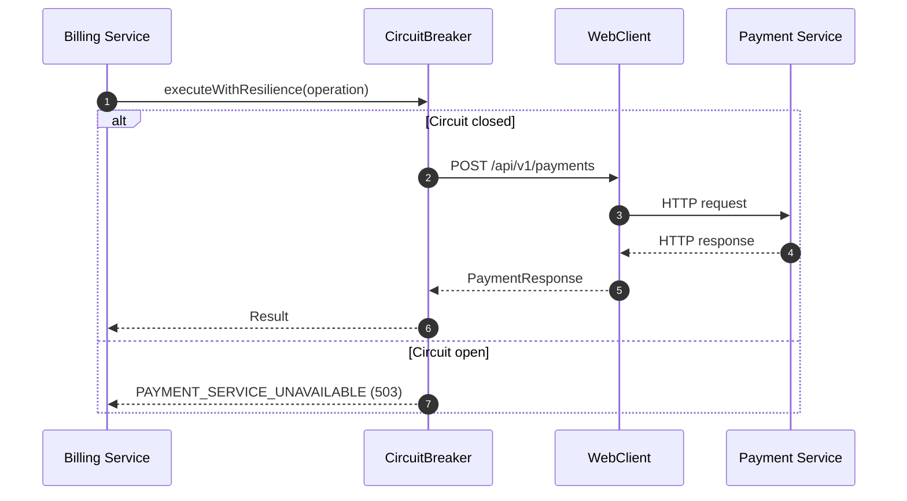
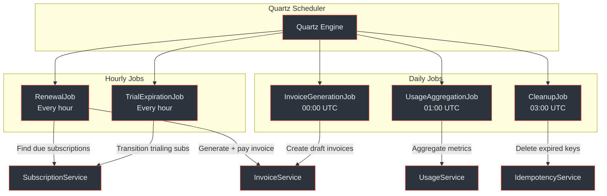
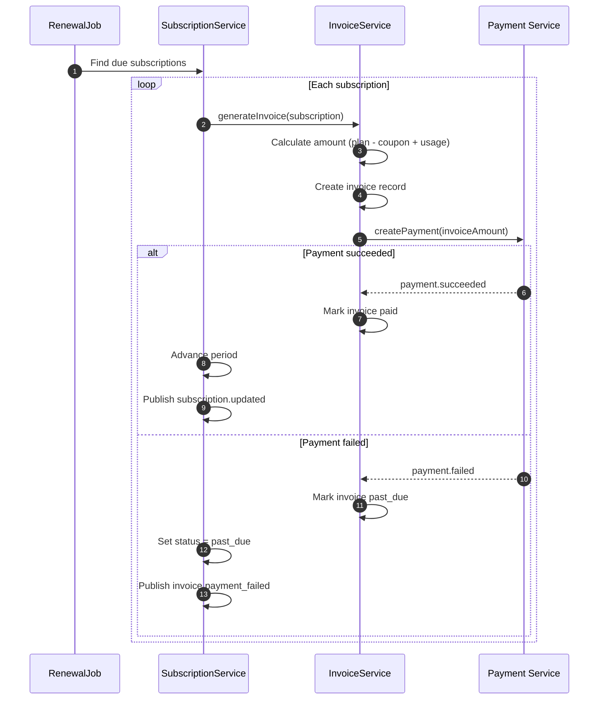
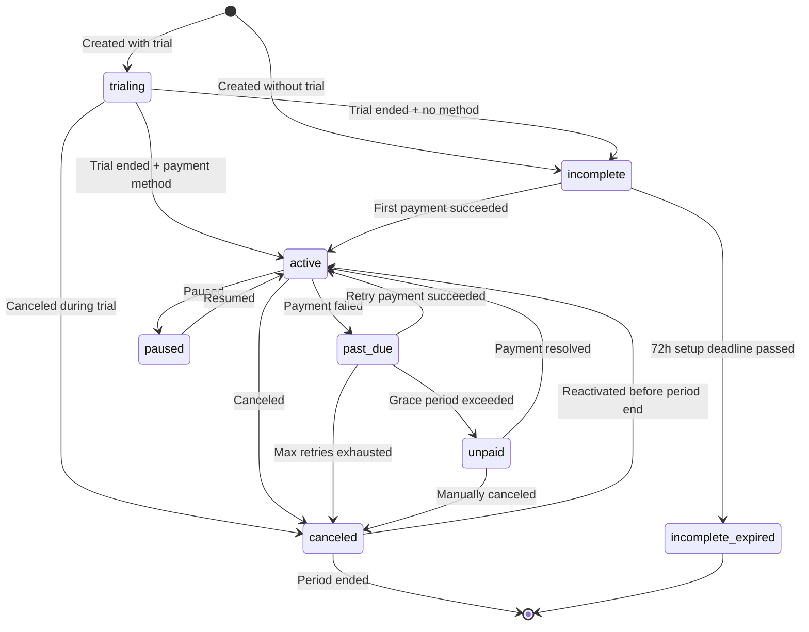

# Billing Service Architecture

The Billing Service manages the subscription billing lifecycle for all Enviro product lines. It is a client of the Payment Service and never communicates directly with payment providers. It orchestrates subscription plans, subscriptions, coupons, invoicing, and usage metering.

## At a Glance

| Attribute | Detail |
|---|---|
| **Port** | `:8081` |
| **Package Root** | `com.enviro.billing` |
| **Architecture** | Modular monolith |
| **Database** | `billing_service_db` (PostgreSQL 16+) |
| **Tables** | 13 (RLS on 11 of 13) |
| **Auth Model** | API key (`bk_{prefix}_{secret}`, BCrypt) |
| **Amount Format** | `INTEGER` cents |
| **Event Topics** | `subscription.events`, `invoice.events`, `billing.events` |
| **DLQs** | `billing.events.dlq`, `payment.events.billing.dlq` |
| **Consumes** | `payment.events` (from Payment Service) |
| **Scheduled Jobs** | 5 Quartz jobs |
| **Payment Delegation** | REST via Spring `WebClient` with Resilience4j circuit breaker |

(docs/billing-service/architecture-design.md:1-22)

---

## Four-Layer Architecture

The Billing Service is organised into four layers plus a scheduling subsystem. Internally, bounded contexts (plans, subscriptions, invoices, coupons) share transactions and in-process communication.

```mermaid
graph TB
    subgraph "Layer 1: API"
        CC["ClientController"]
        PLC["PlanController"]
        SC["SubscriptionController"]
        IC["InvoiceController"]
        COC["CouponController"]
        UC["UsageController"]
        WHC["WebhookConfigController"]
        PSWH["PS WebhookController"]
    end

    subgraph "Layer 2: Service"
        CS["ClientService"]
        PLS["PlanService"]
        SS["SubscriptionService"]
        IS["InvoiceService"]
        COS["CouponService"]
        US["UsageService"]
        WHS["WebhookService"]
    end

    subgraph "Layer 3: Integration"
        PSC["PaymentServiceClient"]
        EP["EventPublisher"]
        OP["OutboxPoller"]
        WD["WebhookDispatcher"]
    end

    subgraph "Layer 4: Scheduling"
        RJ["RenewalJob"]
        IJ["InvoiceGenerationJob"]
        TJ["TrialExpirationJob"]
        UJ["UsageAggregationJob"]
        CJ["CleanupJob"]
    end

    CC --> CS
    PLC --> PLS
    SC --> SS
    IC --> IS
    COC --> COS
    UC --> US
    WHC --> WHS
    PSWH --> SS & IS

    SS & IS --> PSC
    SS & IS & COS --> EP --> WD
    OP -->|"publish"| EP

    RJ --> SS & IS
    IJ --> IS
    TJ --> SS
    UJ --> US

    style CC fill:#2d333b,stroke:#FF5A4F,color:#e6edf3
    style PLC fill:#2d333b,stroke:#FF5A4F,color:#e6edf3
    style SC fill:#2d333b,stroke:#FF5A4F,color:#e6edf3
    style IC fill:#2d333b,stroke:#FF5A4F,color:#e6edf3
    style COC fill:#2d333b,stroke:#FF5A4F,color:#e6edf3
    style UC fill:#2d333b,stroke:#FF5A4F,color:#e6edf3
    style WHC fill:#2d333b,stroke:#FF5A4F,color:#e6edf3
    style PSWH fill:#2d333b,stroke:#FF5A4F,color:#e6edf3
    style CS fill:#2d333b,stroke:#FF5A4F,color:#e6edf3
    style PLS fill:#2d333b,stroke:#FF5A4F,color:#e6edf3
    style SS fill:#2d333b,stroke:#FF5A4F,color:#e6edf3
    style IS fill:#2d333b,stroke:#FF5A4F,color:#e6edf3
    style COS fill:#2d333b,stroke:#FF5A4F,color:#e6edf3
    style US fill:#2d333b,stroke:#FF5A4F,color:#e6edf3
    style WHS fill:#2d333b,stroke:#FF5A4F,color:#e6edf3
    style PSC fill:#2d333b,stroke:#FF5A4F,color:#e6edf3
    style EP fill:#2d333b,stroke:#FF5A4F,color:#e6edf3
    style OP fill:#2d333b,stroke:#FF5A4F,color:#e6edf3
    style WD fill:#2d333b,stroke:#FF5A4F,color:#e6edf3
    style RJ fill:#2d333b,stroke:#FF5A4F,color:#e6edf3
    style IJ fill:#2d333b,stroke:#FF5A4F,color:#e6edf3
    style TJ fill:#2d333b,stroke:#FF5A4F,color:#e6edf3
    style UJ fill:#2d333b,stroke:#FF5A4F,color:#e6edf3
    style CJ fill:#2d333b,stroke:#FF5A4F,color:#e6edf3
```

<!-- Sources: docs/billing-service/architecture-design.md:31-111 -->

### Layer Responsibilities

| Layer | Packages | Responsibility |
|---|---|---|
| **API** | `api.controller`, `api.dto`, `api.mapper`, `api.validation` | REST endpoints, request validation, rate limiting, DTO mapping |
| **Service** | `service`, `service.impl` | Business logic, subscription lifecycle, invoice generation, coupon validation |
| **Integration** | `integration.payment`, `integration.messaging`, `integration.outbox`, `integration.webhook` | Payment Service client, event publishing, outbox polling, webhook dispatch |
| **Scheduling** | `scheduler` | Quartz jobs for renewal, trial expiry, usage aggregation, cleanup |

(docs/billing-service/architecture-design.md:113-213)

---

## Payment Service Client

The Billing Service delegates all payment execution to the Payment Service via a Spring `WebClient` with Resilience4j circuit breaker and retry.

<!-- Sources: docs/billing-service/architecture-design.md:437-522 -->

### PaymentServiceClient Operations

| Operation | Method | Path | Trigger |
|---|---|---|---|
| Create Customer | `POST` | `/api/v1/customers` | Subscription creation |
| Create Payment | `POST` | `/api/v1/payments` | Invoice payment, renewal |
| Get Payment | `GET` | `/api/v1/payments/{id}` | Status check |
| List Payment Methods | `GET` | `/api/v1/payment-methods?customerId=X` | Show saved methods |
| Set Default Method | `POST` | `/api/v1/payment-methods/{id}/set-default` | Preference change |
| Create Refund | `POST` | `/api/v1/payments/{paymentId}/refunds` | Proration credit |

### Circuit Breaker Configuration

| Parameter | Value |
|---|---|
| **Failure rate threshold** | 50% |
| **Wait duration (open state)** | 30 seconds |
| **Sliding window size** | 10 |
| **Retry max attempts** | 3 |
| **Retry wait duration** | 1 second |
| **Retry backoff multiplier** | 2x exponential |

(docs/billing-service/architecture-design.md:500-522)

---

## Scheduled Jobs

The Billing Service uses Quartz Scheduler for five recurring jobs that drive the subscription lifecycle.

<!-- Sources: docs/billing-service/architecture-design.md:649-657 -->

### Job Details

| Job | Schedule | Description |
|---|---|---|
| `RenewalJob` | Every hour | Find subscriptions where `current_period_end < now()` and status = `active`. Generate invoice and attempt payment. Also auto-cancels subscriptions paused > 90 days. |
| `InvoiceGenerationJob` | Daily 00:00 UTC | Generate draft invoices for upcoming renewal periods. |
| `TrialExpirationJob` | Every hour | Find subscriptions where `trial_end < now()` and status = `trialing`. Transition to `active` or `incomplete`. Publishes `subscription.trial_ending` event 3 days before expiry. |
| `UsageAggregationJob` | Daily 01:00 UTC | Aggregate daily usage metrics into the `billing_usage` table. |
| `CleanupJob` | Daily 03:00 UTC | Delete expired idempotency keys, old webhook deliveries (90 days), old audit logs (2 years). |

(docs/billing-service/architecture-design.md:649-657)

### Renewal Flow

<!-- Sources: docs/billing-service/architecture-design.md:659-686 -->

---

## Subscription Lifecycle

The subscription status state machine governs all valid transitions. Status transitions are enforced in the service layer.

<!-- Sources: docs/billing-service/architecture-design.md:298-329 -->

### Status Summary

| Status | Description | Can Transition To |
|---|---|---|
| `trialing` | In trial period | `active`, `incomplete`, `canceled` |
| `incomplete` | Awaiting first payment | `active`, `incomplete_expired` |
| `active` | Operational, billing active | `past_due`, `canceled`, `paused` |
| `past_due` | Payment failed, retrying | `active`, `canceled`, `unpaid` |
| `paused` | Billing paused (max 90 days) | `active` |
| `unpaid` | Grace period exceeded | `active`, `canceled` |
| `canceled` | Canceled (may reactivate before period end) | `active`, terminal |
| `incomplete_expired` | Setup deadline passed | Terminal |

---

## Coupon and Discount Logic

Coupons support two discount types (`percent`, `fixed`) and three duration modes (`once`, `repeating`, `forever`).

### Discount Calculation

| Type | Formula | Bound |
|---|---|---|
| `percent` | `plan.price_cents * discount_value / 100` | `[0, plan.price_cents]` |
| `fixed` | `MIN(discount_value, plan.price_cents)` | `[0, plan.price_cents]` |

**Duration modes:**
- `once` -- applies to first invoice only
- `repeating` -- applies for `duration_months` invoices
- `forever` -- applies to every invoice

(docs/billing-service/architecture-design.md:366-394)

### Validation Flow

1. Coupon exists? No -- `COUPON_NOT_FOUND`
2. Status = `expired`? -- `COUPON_EXPIRED`
3. Status = `archived`? -- `COUPON_ARCHIVED`
4. `valid_until` passed? -- `COUPON_EXPIRED`
5. `redemption_count >= max_redemptions`? -- `COUPON_EXHAUSTED`
6. Plan-scoped and plan not in `coupon_plan_assignments`? -- `COUPON_NOT_APPLICABLE`
7. All pass -- `{valid: true, discountAmount}`

(docs/billing-service/architecture-design.md:376-394)

---

## Proration Logic

When a subscriber changes plans mid-cycle, the Billing Service calculates prorated amounts based on remaining days.

### Upgrade (new price > old price)

1. Calculate `remaining_days = period_end - change_date`
2. `prorated_credit = (old_price / total_days) * remaining_days`
3. `prorated_charge = (new_price / total_days) * remaining_days`
4. `amount_due = prorated_charge - prorated_credit`
5. Charge the difference immediately via Payment Service

### Downgrade (new price < old price)

1. Calculate credit for remaining days
2. Store credit in `subscription.metadata` JSONB under `proration_credit` key
3. Apply credit to next invoice

(docs/billing-service/architecture-design.md:575-646)

---

## Cents-Based Monetary Model

The Billing Service stores all monetary amounts as `INTEGER` cents to avoid floating-point precision issues. Conversion to Rands happens at the boundary when calling the Payment Service.

| Context | Type | Unit | Example |
|---|---|---|---|
| Billing Service DB | `INTEGER` | Cents | `15000` (R150.00) |
| Payment Service DB | `DECIMAL(19,4)` | Rands | `150.0000` |
| BS to PS conversion | `cents / 100` | Rands | `15000 / 100 = 150.00` |

(docs/billing-service/database-schema-design.md:29, docs/shared/system-architecture.md:128-138)

---

## Dual-Event Deduplication

The Billing Service receives Payment Service events through two redundant paths:

1. **Message broker** -- `PaymentEventConsumer` subscribes to `payment.events`
2. **HTTP webhook** -- `POST /api/v1/webhooks/payment-service`

Both delegate to the same idempotent service methods. Deduplication key: `(payment_service_payment_id, event_type)`. Whichever path delivers first processes normally; the second is a no-op.

(docs/billing-service/architecture-design.md:551-571)

---

## Related Pages

| Page | Description |
|---|---|
| [Billing Service Schema](./schema) | 13 tables, SARS invoice numbering, audit logs |
| [Billing Service API](./api) | Full API reference with endpoints and error codes |
| [Payment Service Architecture](../payment-service/) | Payment Service internal design and provider SPI |
| [Inter-Service Communication](../inter-service-communication) | REST calls, amount conversion, and circuit breaker patterns |
| [Event System](../event-system) | Transactional outbox, topics, webhooks, and DLQ monitoring |
| [Platform Overview](../../01-getting-started/platform-overview) | High-level two-service architecture |
| [Security and Compliance](../../03-deep-dive/security-compliance/) | API key auth, POPIA, and tenant isolation |
