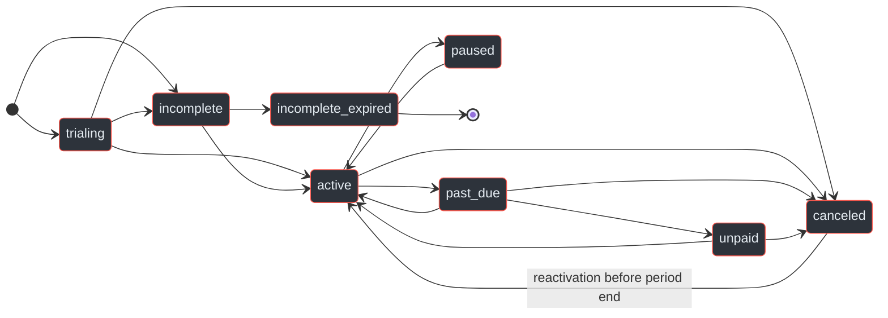
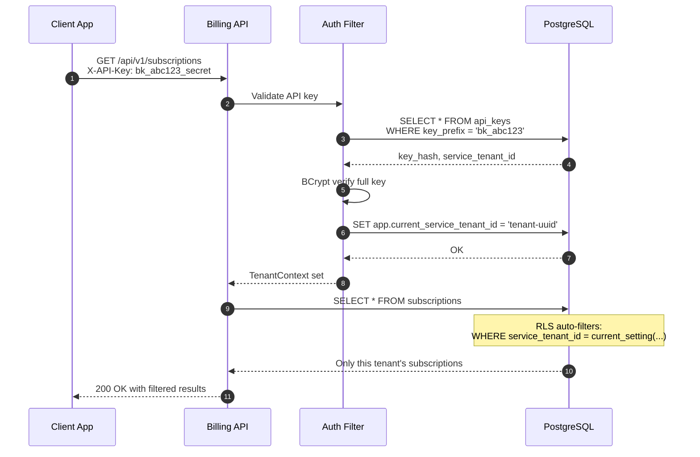
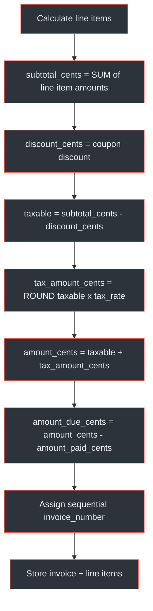
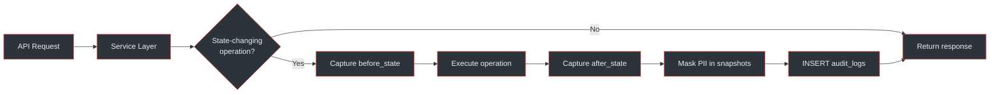

# Database Schema

## At a Glance

| Metric | Value |
|--------|-------|
| Database | PostgreSQL 16+ (`billing_service_db`) |
| Total tables | 13 |
| RLS-enabled tables | 11 of 13 |
| RLS session variable | `app.current_service_tenant_id` |
| Primary keys | UUID (`gen_random_uuid()`) |
| Monetary model | INTEGER cents (`*_cents` columns) |
| Default currency | ZAR (ISO 4217) |
| Timestamps | `TIMESTAMP WITH TIME ZONE`, default `NOW()` |
| Migration tool | Flyway (V001 through V010) |
| Soft deletes | Status-based (`archived` / `deleted`), no boolean flags |

> All 13 tables are managed through Flyway versioned migrations.
> Financial tables use `ON DELETE RESTRICT` to enforce the 7-year SARS retention requirement.
> (`docs/billing-service/database-schema-design.md:25-34`)

---

## Entity Relationship Diagram

The billing database centres on `service_tenants` as the root entity. Every tenant-scoped table carries a `service_tenant_id` foreign key that doubles as the RLS partition key.

```mermaid
erDiagram
    service_tenants ||--o{ api_keys : "has"
    service_tenants ||--o{ subscription_plans : "has"
    service_tenants ||--o{ subscriptions : "has"
    service_tenants ||--o{ invoices : "has"
    service_tenants ||--o{ coupons : "has"
    service_tenants ||--o{ webhook_configs : "has"
    service_tenants ||--o{ billing_usage : "has"
    service_tenants ||--o{ audit_logs : "has"
    service_tenants ||--o{ idempotency_keys : "has"

    subscription_plans ||--o{ subscriptions : "used by"
    subscriptions ||--o{ invoices : "generates"
    coupons ||--o{ subscriptions : "applied to"
    coupons ||--o{ coupon_plan_assignments : "scoped to"
    subscription_plans ||--o{ coupon_plan_assignments : "scoped by"
    invoices ||--o{ invoice_line_items : "has"
    webhook_configs ||--o{ webhook_deliveries : "has"

    service_tenants {
        uuid id PK
        varchar project_name
        varchar contact_email
        varchar payment_service_tenant_id
        varchar status
        integer rate_limit_per_minute
        jsonb settings
    }

    api_keys {
        uuid id PK
        uuid service_tenant_id FK
        varchar key_hash
        varchar key_prefix
        varchar status
        timestamp expires_at
        timestamp last_used_at
    }

    subscription_plans {
        uuid id PK
        uuid service_tenant_id FK
        varchar name
        varchar billing_cycle
        integer price_cents
        varchar currency
        jsonb features
        jsonb limits
        integer trial_days
        varchar status
    }

    subscriptions {
        uuid id PK
        uuid service_tenant_id FK
        varchar external_customer_id
        uuid plan_id FK
        uuid coupon_id FK
        varchar status
        timestamp current_period_start
        timestamp current_period_end
        boolean cancel_at_period_end
    }

    invoices {
        uuid id PK
        uuid service_tenant_id FK
        uuid subscription_id FK
        varchar invoice_number
        integer subtotal_cents
        integer discount_cents
        integer tax_amount_cents
        integer amount_cents
        varchar status
    }

    invoice_line_items {
        uuid id PK
        uuid invoice_id FK
        varchar description
        integer quantity
        integer unit_amount_cents
        integer amount_cents
        boolean proration
    }

    coupons {
        uuid id PK
        uuid service_tenant_id FK
        varchar code
        varchar discount_type
        integer discount_value
        varchar duration
        integer max_redemptions
        varchar status
    }

    coupon_plan_assignments {
        uuid id PK
        uuid coupon_id FK
        uuid plan_id FK
    }

    webhook_configs {
        uuid id PK
        uuid service_tenant_id FK
        varchar url
        jsonb events
        varchar status
        integer failure_count
    }

    webhook_deliveries {
        uuid id PK
        uuid webhook_config_id FK
        varchar event_type
        jsonb payload
        varchar status
        integer attempt_count
    }

    billing_usage {
        uuid id PK
        uuid service_tenant_id FK
        date period_start
        date period_end
        bigint total_payment_volume_cents
        integer api_calls
    }

    audit_logs {
        uuid id PK
        uuid service_tenant_id FK
        varchar actor_type
        varchar action
        varchar resource_type
        uuid resource_id
        jsonb before_state
        jsonb after_state
    }

    idempotency_keys {
        uuid service_tenant_id PK_FK
        varchar key PK
        varchar request_path
        integer response_status
        jsonb response_body
        timestamp expires_at
    }
```
<!-- Sources: docs/billing-service/database-schema-design.md:40-265 -->

---

## Table Catalogue

### service_tenants

Registered client projects. Each tenant maps to a corresponding tenant in the Payment Service via `payment_service_tenant_id`. This is the **only admin-only table** — it has no RLS policy. (`docs/billing-service/database-schema-design.md:271-297`)

| Column | Type | Constraints | Notes |
|--------|------|-------------|-------|
| `id` | UUID | PK, `gen_random_uuid()` | |
| `project_name` | VARCHAR(255) | NOT NULL | |
| `contact_email` | VARCHAR(255) | NOT NULL | |
| `payment_service_tenant_id` | VARCHAR(255) | | Link to Payment Service |
| `status` | VARCHAR(50) | CHECK: pending, active, suspended, deleted | Default `pending` |
| `rate_limit_per_minute` | INTEGER | NOT NULL | Default 500 |
| `settings` | JSONB | NOT NULL | Per-tenant config (currency, timezone, webhook retry, invoice settings) |
| `created_at` | TIMESTAMPTZ | NOT NULL | Default `NOW()` |
| `updated_at` | TIMESTAMPTZ | NOT NULL | Default `NOW()` |

The `settings` JSONB supports keys like `defaultCurrency`, `timezone`, `webhookRetryPolicy`, `invoiceSettings`, and `featureFlags`. (`docs/billing-service/database-schema-design.md:299-317`)

### api_keys

API keys for tenant authentication. Supports multiple keys per tenant with rotation and revocation. Key format is `bk_{prefix}_{secret}` — the prefix enables O(1) lookup, while the full key is BCrypt-hashed (cost 12+). (`docs/billing-service/compliance-security-guide.md:231-244`)

| Column | Type | Constraints | Notes |
|--------|------|-------------|-------|
| `id` | UUID | PK | |
| `service_tenant_id` | UUID | FK → service_tenants, CASCADE | |
| `key_hash` | VARCHAR(255) | NOT NULL | BCrypt hash (cost 12+) |
| `key_prefix` | VARCHAR(10) | NOT NULL | First 8-10 chars for log ID and DB lookup |
| `name` | VARCHAR(255) | | Human-readable label |
| `status` | VARCHAR(50) | CHECK: active, revoked, expired | Default `active` |
| `expires_at` | TIMESTAMPTZ | | Set during rotation (24h grace period) |
| `last_used_at` | TIMESTAMPTZ | | Updated on each successful auth |
| `created_at` | TIMESTAMPTZ | NOT NULL | |
| `revoked_at` | TIMESTAMPTZ | | Set when key is revoked |

RLS policy: `service_tenant_id = current_setting('app.current_service_tenant_id')::uuid`
(`docs/billing-service/database-schema-design.md:321-355`)

### subscription_plans

Plan definitions. **Price and billing cycle are immutable after creation** — to change pricing, archive the old plan and create a new one. This ensures historical invoice integrity. (`docs/billing-service/database-schema-design.md:359-402`)

| Column | Type | Constraints | Notes |
|--------|------|-------------|-------|
| `id` | UUID | PK | |
| `service_tenant_id` | UUID | FK → service_tenants, CASCADE | |
| `name` | VARCHAR(255) | NOT NULL, UNIQUE per tenant | |
| `description` | TEXT | | |
| `billing_cycle` | VARCHAR(50) | CHECK: monthly, quarterly, yearly | Default `monthly` |
| `price_cents` | INTEGER | NOT NULL, >= 0 | Immutable after creation |
| `currency` | VARCHAR(3) | NOT NULL | Default `ZAR` |
| `features` | JSONB | NOT NULL | e.g. `{"max_users": 10}` |
| `limits` | JSONB | NOT NULL | e.g. `{"api_calls_per_day": 1000}` |
| `trial_days` | INTEGER | NOT NULL | Default 0 |
| `status` | VARCHAR(50) | CHECK: draft, active, archived | Default `active` |
| `sort_order` | INTEGER | NOT NULL | Default 0 |
| `created_at` | TIMESTAMPTZ | NOT NULL | |
| `updated_at` | TIMESTAMPTZ | NOT NULL | |

### subscriptions

Active subscription records. One active subscription per customer per tenant, enforced by a partial unique index that excludes terminal states (`canceled`, `incomplete_expired`). (`docs/billing-service/database-schema-design.md:425-483`)

| Column | Type | Constraints | Notes |
|--------|------|-------------|-------|
| `id` | UUID | PK | |
| `service_tenant_id` | UUID | FK → service_tenants, RESTRICT | 7-year retention |
| `external_customer_id` | VARCHAR(255) | NOT NULL | Customer ID from client system |
| `external_customer_email` | VARCHAR(255) | | POPIA: personal info |
| `plan_id` | UUID | FK → subscription_plans | |
| `coupon_id` | UUID | FK → coupons | |
| `payment_service_customer_id` | VARCHAR(255) | | Payment Service customer reference |
| `status` | VARCHAR(50) | CHECK: 8 valid statuses | Default `incomplete` |
| `current_period_start` | TIMESTAMPTZ | | |
| `current_period_end` | TIMESTAMPTZ | | |
| `cancel_at_period_end` | BOOLEAN | NOT NULL | Default FALSE |
| `canceled_at` | TIMESTAMPTZ | | |
| `cancellation_reason` | VARCHAR(255) | | |
| `cancellation_feedback` | TEXT | | |
| `trial_start` | TIMESTAMPTZ | | |
| `trial_end` | TIMESTAMPTZ | | |
| `metadata` | JSONB | NOT NULL | Client-defined context |
| `created_at` | TIMESTAMPTZ | NOT NULL | |
| `updated_at` | TIMESTAMPTZ | NOT NULL | |

### invoices

Invoice records with SARS-compliant tax fields. Linked to subscriptions via `ON DELETE RESTRICT`. Sequential invoice numbering per tenant (format: `INV-{tenant}-{YYYYMM}-{seq}`). (`docs/billing-service/database-schema-design.md:499-559`)

| Column | Type | Constraints | Notes |
|--------|------|-------------|-------|
| `id` | UUID | PK | |
| `service_tenant_id` | UUID | FK → service_tenants, RESTRICT | |
| `subscription_id` | UUID | FK → subscriptions, RESTRICT | |
| `invoice_number` | VARCHAR(100) | | Sequential per tenant (SARS) |
| `subtotal_cents` | INTEGER | NOT NULL, >= 0 | Pre-discount, pre-tax |
| `discount_cents` | INTEGER | NOT NULL, >= 0 | Coupon discount applied |
| `tax_rate` | DECIMAL(5,4) | NOT NULL | Default 0.15 (15% SA VAT) |
| `tax_amount_cents` | INTEGER | NOT NULL, >= 0 | `(subtotal - discount) * tax_rate` |
| `amount_cents` | INTEGER | NOT NULL, >= 0 | Total including tax |
| `amount_due_cents` | INTEGER | NOT NULL, >= 0 | Remaining owed |
| `amount_paid_cents` | INTEGER | NOT NULL, >= 0 | Amount collected |
| `currency` | VARCHAR(3) | NOT NULL | Default `ZAR` |
| `status` | VARCHAR(50) | CHECK: draft, open, paid, void, uncollectible | Default `draft` |
| `payment_service_payment_id` | VARCHAR(255) | | Opaque reference to Payment Service |
| `retry_count` | INTEGER | NOT NULL | Dunning attempt counter |
| `due_date` | TIMESTAMPTZ | | |
| `paid_at` | TIMESTAMPTZ | | |
| `voided_at` | TIMESTAMPTZ | | |
| `created_at` | TIMESTAMPTZ | NOT NULL | |
| `updated_at` | TIMESTAMPTZ | NOT NULL | |

### invoice_line_items

Individual line items on invoices. Required for SARS tax invoice compliance — each item must show description, quantity, unit price, and VAT. Supports proration line items for mid-cycle plan changes. (`docs/billing-service/database-schema-design.md:569-608`)

| Column | Type | Constraints | Notes |
|--------|------|-------------|-------|
| `id` | UUID | PK | |
| `service_tenant_id` | UUID | FK → service_tenants, RESTRICT | |
| `invoice_id` | UUID | FK → invoices, RESTRICT | |
| `description` | VARCHAR(500) | NOT NULL | |
| `quantity` | INTEGER | NOT NULL, > 0 | Default 1 |
| `unit_amount_cents` | INTEGER | NOT NULL, >= 0 | |
| `amount_cents` | INTEGER | NOT NULL, >= 0 | `quantity * unit_amount_cents` |
| `tax_rate` | DECIMAL(5,4) | NOT NULL | Default 0.15 |
| `tax_amount_cents` | INTEGER | NOT NULL, >= 0 | |
| `period_start` | TIMESTAMPTZ | | |
| `period_end` | TIMESTAMPTZ | | |
| `proration` | BOOLEAN | NOT NULL | Default FALSE |
| `metadata` | JSONB | NOT NULL | |
| `created_at` | TIMESTAMPTZ | NOT NULL | |

### coupons

Discount coupon definitions. Supports **percent** (1-100) and **fixed** (cents) discount types with three duration modes: `once`, `repeating` (N months), and `forever`. (`docs/billing-service/database-schema-design.md:612-665`)

| Column | Type | Constraints | Notes |
|--------|------|-------------|-------|
| `id` | UUID | PK | |
| `service_tenant_id` | UUID | FK → service_tenants, CASCADE | |
| `code` | VARCHAR(50) | NOT NULL, UNIQUE per tenant | |
| `name` | VARCHAR(255) | | |
| `discount_type` | VARCHAR(50) | CHECK: percent, fixed | |
| `discount_value` | INTEGER | NOT NULL, > 0 | Percent: 1-100; Fixed: cents |
| `currency` | VARCHAR(3) | | Default `ZAR` |
| `duration` | VARCHAR(50) | CHECK: once, repeating, forever | Default `once` |
| `duration_months` | INTEGER | | Required if `repeating` |
| `max_redemptions` | INTEGER | | NULL = unlimited |
| `redemption_count` | INTEGER | NOT NULL | Default 0 |
| `valid_from` | TIMESTAMPTZ | NOT NULL | Default `NOW()` |
| `valid_until` | TIMESTAMPTZ | | |
| `status` | VARCHAR(50) | CHECK: active, expired, archived | Default `active` |
| `created_at` | TIMESTAMPTZ | NOT NULL | |

### coupon_plan_assignments

Join table linking coupons to the plans they apply to. If a coupon has no rows here, it applies to **all plans** for that tenant. (`docs/billing-service/database-schema-design.md:671-698`)

| Column | Type | Constraints | Notes |
|--------|------|-------------|-------|
| `id` | UUID | PK | |
| `service_tenant_id` | UUID | FK → service_tenants, CASCADE | |
| `coupon_id` | UUID | FK → coupons, CASCADE | |
| `plan_id` | UUID | FK → subscription_plans, CASCADE | |
| `created_at` | TIMESTAMPTZ | NOT NULL | |

Unique constraint on `(coupon_id, plan_id)` prevents duplicate assignments.

### webhook_configs

Outgoing webhook endpoint configurations. Tracks delivery health per endpoint — consecutive failures auto-disable the webhook (`status = 'failing'`). (`docs/billing-service/database-schema-design.md:702-739`)

| Column | Type | Constraints | Notes |
|--------|------|-------------|-------|
| `id` | UUID | PK | |
| `service_tenant_id` | UUID | FK → service_tenants, CASCADE | |
| `url` | VARCHAR(500) | NOT NULL | |
| `events` | JSONB | NOT NULL | Event types to subscribe to |
| `secret_hash` | VARCHAR(255) | NOT NULL | AES-256-GCM encrypted shared secret |
| `status` | VARCHAR(50) | CHECK: active, disabled, failing | Default `active` |
| `failure_count` | INTEGER | NOT NULL | Resets to 0 on success |
| `last_success_at` | TIMESTAMPTZ | | |
| `last_failure_at` | TIMESTAMPTZ | | |
| `last_failure_reason` | TEXT | | |
| `created_at` | TIMESTAMPTZ | NOT NULL | |
| `updated_at` | TIMESTAMPTZ | NOT NULL | |

### webhook_deliveries

Per-attempt webhook delivery tracking. This table has **no RLS** — it is accessed through the `webhook_config_id` foreign key relationship. (`docs/billing-service/database-schema-design.md:743-770`)

| Column | Type | Constraints | Notes |
|--------|------|-------------|-------|
| `id` | UUID | PK | |
| `webhook_config_id` | UUID | FK → webhook_configs, CASCADE | |
| `event_type` | VARCHAR(100) | NOT NULL | |
| `payload` | JSONB | NOT NULL | |
| `response_status` | INTEGER | | HTTP status code |
| `response_body` | TEXT | | |
| `attempt_count` | INTEGER | NOT NULL | Default 1 |
| `status` | VARCHAR(50) | CHECK: pending, delivered, failed, retrying | Default `pending` |
| `next_retry_at` | TIMESTAMPTZ | | |
| `delivered_at` | TIMESTAMPTZ | | |
| `created_at` | TIMESTAMPTZ | NOT NULL | |

### billing_usage

Aggregate usage metrics per tenant per period. One row per tenant per period, updated incrementally via counter operations. Uses `BIGINT` for `total_payment_volume_cents` to prevent overflow on high-volume tenants. (`docs/billing-service/database-schema-design.md:774-808`)

| Column | Type | Constraints | Notes |
|--------|------|-------------|-------|
| `id` | UUID | PK | |
| `service_tenant_id` | UUID | FK → service_tenants, CASCADE | |
| `period_start` | DATE | NOT NULL, UNIQUE per tenant | |
| `period_end` | DATE | NOT NULL | |
| `subscriptions_created` | INTEGER | NOT NULL | Default 0 |
| `subscriptions_canceled` | INTEGER | NOT NULL | Default 0 |
| `payments_processed` | INTEGER | NOT NULL | Default 0 |
| `payments_failed` | INTEGER | NOT NULL | Default 0 |
| `total_payment_volume_cents` | BIGINT | NOT NULL | Default 0 |
| `invoices_generated` | INTEGER | NOT NULL | Default 0 |
| `webhook_calls` | INTEGER | NOT NULL | Default 0 |
| `api_calls` | INTEGER | NOT NULL | Default 0 |

### audit_logs

Immutable audit trail for all significant actions. Captures **before and after state** as JSONB snapshots (PII masked before storage). Rows are never updated or deleted except by the 2-year retention policy. (`docs/billing-service/database-schema-design.md:812-861`)

| Column | Type | Constraints | Notes |
|--------|------|-------------|-------|
| `id` | UUID | PK | |
| `service_tenant_id` | UUID | FK → service_tenants, RESTRICT | NULL for system events |
| `actor_type` | VARCHAR(50) | NOT NULL | `user`, `system`, `api_key` |
| `actor_id` | VARCHAR(255) | | |
| `action` | VARCHAR(100) | NOT NULL | e.g. `subscription.created` |
| `resource_type` | VARCHAR(100) | NOT NULL | e.g. `subscription` |
| `resource_id` | UUID | | |
| `before_state` | JSONB | | NULL for create actions |
| `after_state` | JSONB | | NULL for delete actions |
| `ip_address` | INET | | |
| `user_agent` | TEXT | | |
| `correlation_id` | VARCHAR(255) | | Distributed tracing ID |
| `created_at` | TIMESTAMPTZ | NOT NULL | |

**Audited actions include:**
- `subscription.created`, `subscription.canceled`, `subscription.reactivated`, `subscription.plan_changed`
- `invoice.created`, `invoice.paid`, `invoice.voided`, `invoice.marked_uncollectible`
- `plan.created`, `plan.updated`, `plan.archived`
- `coupon.created`, `coupon.archived`
- `api_key.created`, `api_key.rotated`, `api_key.revoked`
- `tenant.created`, `tenant.suspended`, `tenant.activated`

### idempotency_keys

Caches responses for idempotent operations. Composite primary key on `(service_tenant_id, key)`. Keys auto-expire after 24 hours. (`docs/billing-service/database-schema-design.md:864-891`)

| Column | Type | Constraints | Notes |
|--------|------|-------------|-------|
| `service_tenant_id` | UUID | PK, FK → service_tenants, CASCADE | |
| `key` | VARCHAR(255) | PK | Client-provided idempotency key |
| `request_path` | VARCHAR(255) | NOT NULL | |
| `request_hash` | VARCHAR(64) | NOT NULL | SHA-256 of request body |
| `response_status` | INTEGER | | Cached HTTP status |
| `response_body` | JSONB | | Cached response |
| `created_at` | TIMESTAMPTZ | NOT NULL | |
| `expires_at` | TIMESTAMPTZ | NOT NULL | Default `NOW() + 24h` |

---

## Subscription Status State Machine

Subscriptions move through 8 possible statuses with defined transitions. Terminal states are `canceled` and `incomplete_expired`, though `canceled` allows reactivation before the period ends.


<!-- Sources: docs/billing-service/database-schema-design.md:485-496 -->

---

## Row-Level Security

PostgreSQL RLS enforces tenant isolation at the database level. Every query executes with `app.current_service_tenant_id` set as a session variable, and RLS policies filter rows automatically.

| Table | RLS | Policy Variable | Notes |
|-------|-----|-----------------|-------|
| `service_tenants` | <span class="fail">No</span> | Admin-only | No tenant context needed |
| `api_keys` | <span class="ok">Yes</span> | `app.current_service_tenant_id` | SELECT + INSERT policies |
| `subscription_plans` | <span class="ok">Yes</span> | `app.current_service_tenant_id` | SELECT + INSERT policies |
| `subscriptions` | <span class="ok">Yes</span> | `app.current_service_tenant_id` | SELECT + INSERT policies |
| `invoices` | <span class="ok">Yes</span> | `app.current_service_tenant_id` | SELECT + INSERT policies |
| `invoice_line_items` | <span class="ok">Yes</span> | `app.current_service_tenant_id` | SELECT + INSERT policies |
| `coupons` | <span class="ok">Yes</span> | `app.current_service_tenant_id` | SELECT + INSERT policies |
| `coupon_plan_assignments` | <span class="ok">Yes</span> | `app.current_service_tenant_id` | SELECT policy only |
| `webhook_configs` | <span class="ok">Yes</span> | `app.current_service_tenant_id` | SELECT + INSERT policies |
| `webhook_deliveries` | <span class="fail">No</span> | N/A | Accessed via `webhook_config_id` FK |
| `billing_usage` | <span class="ok">Yes</span> | `app.current_service_tenant_id` | SELECT policy only |
| `audit_logs` | <span class="ok">Yes</span> | `app.current_service_tenant_id` | OR `service_tenant_id IS NULL` for system events |
| `idempotency_keys` | <span class="ok">Yes</span> | `app.current_service_tenant_id` | SELECT policy only |

> The Billing Service uses `app.current_service_tenant_id` — distinct from the Payment Service's `app.current_tenant_id`. (`docs/billing-service/database-schema-design.md:895-911`, `docs/billing-service/compliance-security-guide.md:227-229`)


<!-- Sources: docs/billing-service/compliance-security-guide.md:247-267, docs/billing-service/database-schema-design.md:345-350 -->

---

## SARS Invoice Numbering and Tax Calculation

South African tax invoices must comply with SARS (Value-Added Tax Act No. 89 of 1991). The schema supports this through sequential numbering, per-line-item tax breakdown, and separate VAT fields. (`docs/billing-service/compliance-security-guide.md:109-134`)

**Invoice number format:** `INV-{tenant}-{YYYYMM}-{seq}`

- Numbers are sequential per tenant
- Voided invoices retain their number (no gaps in numbering allowed)
- The `invoice_line_items` table provides SARS-required detail: description, quantity, unit price, and VAT per line


<!-- Sources: docs/billing-service/compliance-security-guide.md:115-134, docs/billing-service/database-schema-design.md:499-562 -->

> The `tax_rate` defaults to `0.15` (15% SA VAT) but is stored per invoice to support future rate changes or zero-rated supplies without retroactively affecting historical records. (`docs/billing-service/compliance-security-guide.md:134`)

---

## Audit Log Flow

Every significant action in the Billing Service is captured in the `audit_logs` table with before/after JSONB state snapshots. PII is masked before storage (e.g., emails appear as `j***@example.com`). (`docs/billing-service/compliance-security-guide.md:221`, `docs/billing-service/database-schema-design.md:812-861`)


<!-- Sources: docs/billing-service/database-schema-design.md:854-861, docs/billing-service/compliance-security-guide.md:215-221 -->

---

## Data Retention

| Table | Retention | Rationale |
|-------|-----------|-----------|
| `service_tenants` | Indefinite | Active configuration |
| `api_keys` | Until revoked + 90 days | Security audit trail |
| `subscription_plans` | Indefinite (archived, not deleted) | Referenced by historical subscriptions |
| `subscriptions` | 7 years after end | Financial records (SA tax law) |
| `invoices` | 7 years | Financial records (SARS) |
| `invoice_line_items` | 7 years | Part of invoice record |
| `coupons` | Indefinite (archived, not deleted) | Referenced by historical subscriptions |
| `coupon_plan_assignments` | Lifetime of coupon | Cascade-deleted with coupon |
| `webhook_configs` | Until deleted | Active configuration |
| `webhook_deliveries` | 90 days | Debugging only |
| `billing_usage` | 2 years | Analytics and reporting |
| `audit_logs` | 2 years | POPIA regulatory compliance |
| `idempotency_keys` | 24 hours (auto-expire) | Short-lived cache |

Automated cleanup runs daily via a Quartz scheduled job (`CleanupJob`):
(`docs/billing-service/database-schema-design.md:935-960`)

```sql
-- Run daily via Quartz scheduled job (CleanupJob)
DELETE FROM idempotency_keys WHERE expires_at < NOW();
DELETE FROM webhook_deliveries WHERE created_at < NOW() - INTERVAL '90 days';
DELETE FROM audit_logs WHERE created_at < NOW() - INTERVAL '2 years';
DELETE FROM billing_usage WHERE period_end < (CURRENT_DATE - INTERVAL '2 years');
```

---

## Flyway Migration Order

| Version | Migration File | Description |
|---------|----------------|-------------|
| V001 | `V001__create_service_tenants.sql` | Service tenants table |
| V002 | `V002__create_api_keys.sql` | API keys table + RLS |
| V003 | `V003__create_subscription_plans.sql` | Subscription plans table + RLS |
| V004 | `V004__create_subscriptions.sql` | Subscriptions table + RLS |
| V005 | `V005__create_invoices.sql` | Invoices table + RLS |
| V005b | `V005b__create_invoice_line_items.sql` | Invoice line items table + RLS |
| V006 | `V006__create_coupons.sql` | Coupons table + RLS |
| V006b | `V006b__create_coupon_plan_assignments.sql` | Coupon-plan join table + RLS |
| V007 | `V007__create_webhook_configs.sql` | Webhook configs table + RLS |
| V007b | `V007b__create_webhook_deliveries.sql` | Webhook deliveries table (no RLS) |
| V008 | `V008__create_billing_usage.sql` | Billing usage table + RLS |
| V009 | `V009__create_audit_logs.sql` | Audit logs table + RLS |
| V010 | `V010__create_idempotency_keys.sql` | Idempotency keys table + RLS |

(`docs/billing-service/database-schema-design.md:915-931`)

---

## Related Pages

| Page | Description |
|------|-------------|
| [Billing Service API Reference](./api) | All 35+ API endpoints, authentication, error handling |
| [Payment Service Schema](../payment-service/schema) | Payment Service database schema for comparison |
| [Payment Service API](../payment-service/api) | Payment Service API reference |
| [Inter-Service Communication](../inter-service-communication) | How Billing and Payment services communicate |
| [Event System](../event-system) | Transactional outbox and event architecture |
| [Authentication Deep Dive](../../03-deep-dive/security-compliance/authentication) | API key and HMAC authentication patterns |
| [Subscription Lifecycle](../../03-deep-dive/data-flows/subscription-lifecycle) | Full subscription state machine and flows |
| [Correctness Invariants](../../03-deep-dive/correctness-invariants) | Data integrity guarantees and constraints |
| [Integration Quickstart](../../01-getting-started/integration-quickstart) | Getting started with the Billing Service API |
