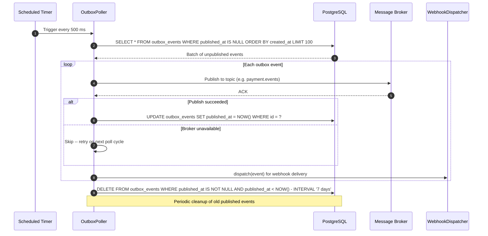
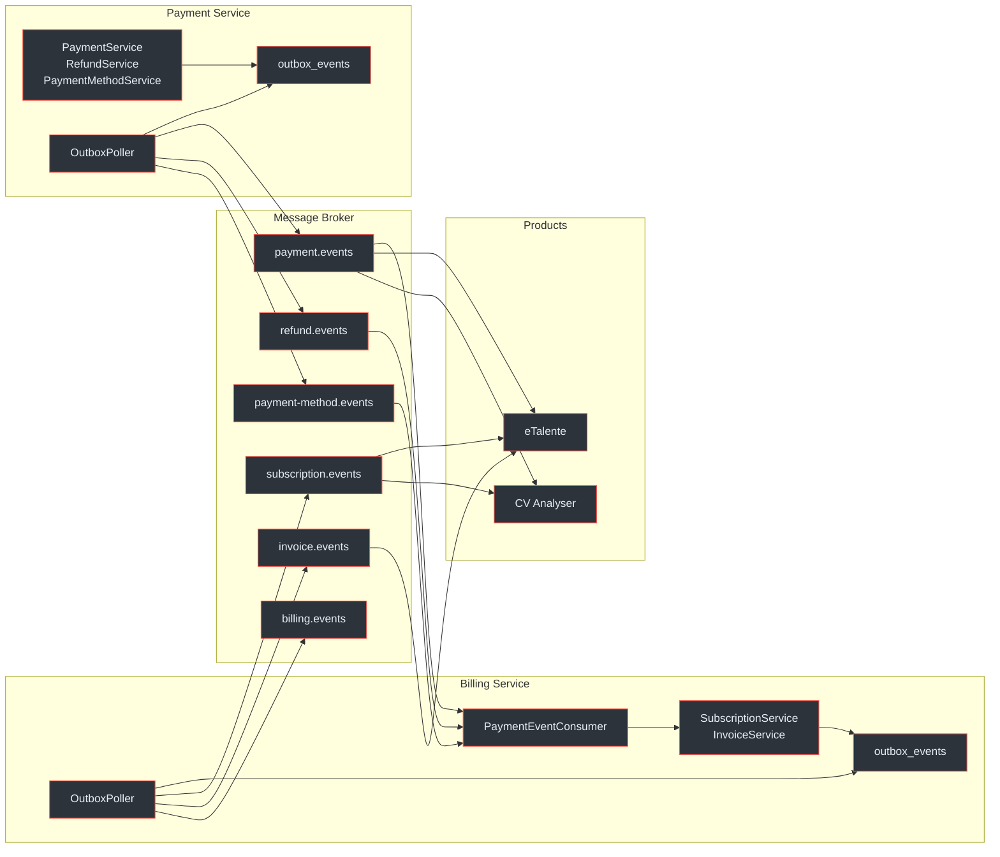
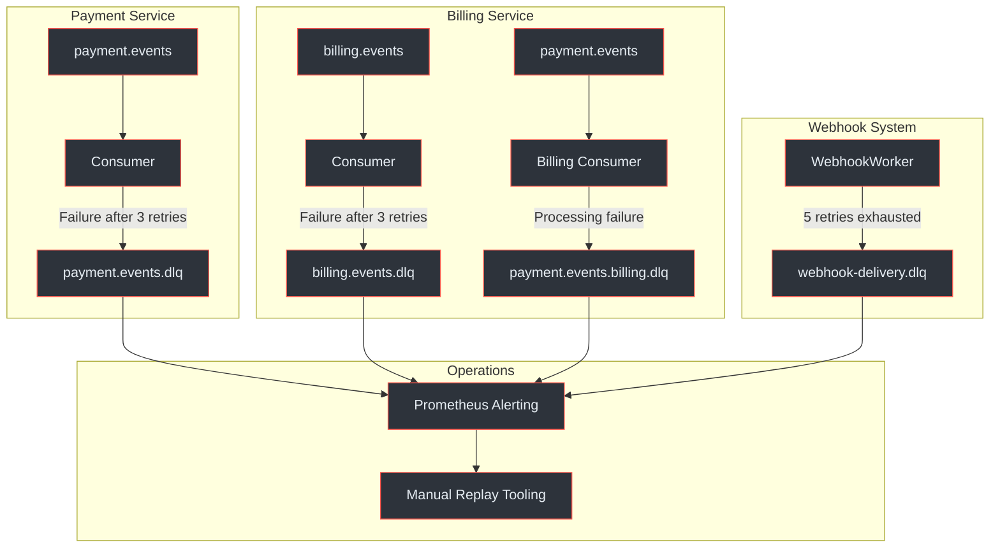
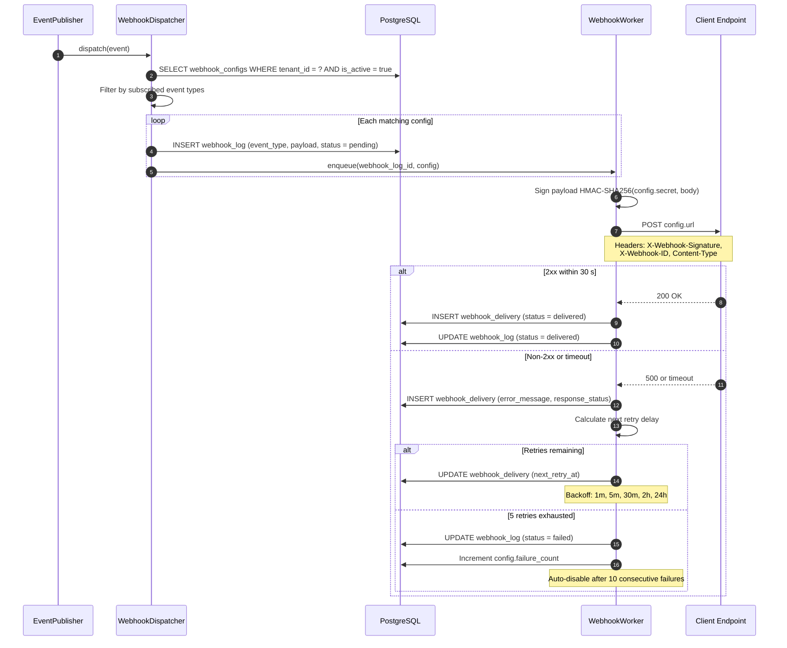

# Event System and Webhooks

The Payment Gateway Platform is **event-driven by design**. Every state change -- payment succeeded, subscription renewed, refund completed -- produces an event that flows through a transactional outbox, a message broker, and optionally an HTTP webhook to downstream consumers. This page covers the full event lifecycle from database commit to client delivery.

## At-a-Glance

| Aspect | Detail |
|---|---|
| Delivery guarantee | At-least-once (consumers must be idempotent) |
| Outbox pattern | Events written to `outbox_events` in the same DB transaction as the domain change |
| Polling interval | 500 ms (`@Scheduled` poller) |
| Envelope format | CloudEvents 1.0 (JSON) |
| Broker topics | 6 event topics + 3 dead letter queues |
| Webhook signing | HMAC-SHA256 per-endpoint shared secret |
| Webhook retries | 5 attempts -- exponential backoff over ~5.5 hours |
| Delivery tracking | `webhook_deliveries` table with per-attempt records |
| DLQ alerting | `broker_dlq_messages_total` Prometheus counter |

## Transactional Outbox Pattern

Both services use the **transactional outbox pattern** to guarantee that no event is lost, even if the message broker is temporarily unavailable (`docs/billing-service/architecture-design.md:692-708`, `docs/payment-service/architecture-design.md:320`).

### Why the Outbox Exists

Without the outbox, a domain change could commit to the database while the subsequent event publish fails (broker down, network partition). The result: **silent data loss** -- the payment succeeded but nobody was notified. The outbox eliminates this by making the event write part of the same atomic database transaction.

### How It Works

1. A service method performs a domain change (e.g. `UPDATE payment SET status = 'succeeded'`).
2. In the **same transaction**: `INSERT INTO outbox_events (aggregate_type, aggregate_id, event_type, payload)`.
3. The transaction commits -- both the domain change and the outbox row are persisted atomically.
4. The `OutboxPoller` (a `@Scheduled` component at 500 ms intervals) queries for unpublished rows.
5. For each row: publish to the appropriate broker topic, then set `published_at = NOW()`.
6. If the broker is unavailable, the row stays in the outbox and is retried on the next cycle.

**Worst case:** duplicate delivery (event published but `published_at` not updated before a crash). Consumers handle this through idempotent processing (`docs/billing-service/architecture-design.md:707`).

### Outbox Polling Cycle



<!-- Sources: docs/billing-service/architecture-design.md:692-708, docs/payment-service/architecture-design.md:148-154, docs/payment-service/payment-flow-diagrams.md:441-444 -->

### Outbox Table Schema

| Column | Type | Description |
|---|---|---|
| `id` | `UUID` | Primary key |
| `aggregate_type` | `VARCHAR` | Entity type (e.g. `payment`, `subscription`) |
| `aggregate_id` | `UUID` | Entity ID |
| `event_type` | `VARCHAR` | Event type (e.g. `payment.succeeded`) |
| `payload` | `JSONB` | Full CloudEvents envelope |
| `created_at` | `TIMESTAMP` | When the event was written |
| `published_at` | `TIMESTAMP` | When the event was published (NULL until published) |

(`docs/billing-service/architecture-design.md:175-177`)

## Message Broker Topics

The platform uses six event topics partitioned by `tenant_id` for ordered, tenant-scoped delivery (`docs/shared/system-architecture.md:104-105`, `docs/shared/integration-guide.md:564-578`).

### Payment Service Topics

| Topic | Producer | Consumers | Partitions | Key |
|---|---|---|---|---|
| `payment.events` | PaymentService | Billing Service, WebhookDispatcher, Products | 12 | `tenant_id` |
| `refund.events` | RefundService | Billing Service, WebhookDispatcher, Products | 6 | `tenant_id` |
| `payment-method.events` | PaymentMethodService | Billing Service, WebhookDispatcher | 6 | `tenant_id` |

### Billing Service Topics

| Topic | Producer | Consumers | Partitions | Key |
|---|---|---|---|---|
| `subscription.events` | SubscriptionService | WebhookDispatcher, Products | 12 | `tenant_id` |
| `invoice.events` | InvoiceService | WebhookDispatcher, Products | 6 | `tenant_id` |
| `billing.events` | Various | Internal processing | 6 | `tenant_id` |

### Event Type Reference

**Payment Service events** (`docs/payment-service/architecture-design.md:461-476`):

| Event Type | Trigger |
|---|---|
| `payment.created` | Payment record created |
| `payment.processing` | Provider acknowledged |
| `payment.succeeded` | Provider confirmed success |
| `payment.failed` | Provider reported failure |
| `payment.canceled` | Payment canceled before completion |
| `payment.requires_action` | 3DS or redirect required |
| `refund.created` | Refund initiated |
| `refund.processing` | Provider processing refund |
| `refund.succeeded` | Refund completed |
| `refund.failed` | Refund failed |
| `payment_method.attached` | New payment method tokenised |
| `payment_method.detached` | Payment method removed |
| `payment_method.updated` | Metadata updated |
| `payment_method.expired` | Card expiry reached |

**Billing Service events** (`docs/billing-service/architecture-design.md:727-735`):

| Event Type | Trigger |
|---|---|
| `subscription.created` | New subscription created |
| `subscription.updated` | Plan change, period advance, metadata update |
| `subscription.canceled` | Subscription canceled |
| `subscription.trial_ending` | 3 days before trial end |
| `invoice.created` | New invoice generated |
| `invoice.paid` | Invoice payment succeeded |
| `invoice.payment_failed` | Invoice payment failed |
| `invoice.payment_requires_action` | 3DS required for invoice payment |

### Event Flow Across Services



<!-- Sources: docs/shared/system-architecture.md:104-105, docs/shared/integration-guide.md:564-578, docs/payment-service/architecture-design.md:427-432, docs/billing-service/architecture-design.md:713-720 -->

## CloudEvents Envelope Format

All events conform to the **CloudEvents 1.0** specification (`docs/shared/integration-guide.md:588-614`, `docs/payment-service/architecture-design.md:434-457`).

```json
{
  "specversion": "1.0",
  "id": "evt_a1b2c3d4-e5f6-7890-abcd-ef1234567890",
  "source": "payment-service",
  "type": "payment.succeeded",
  "time": "2026-03-25T14:30:00Z",
  "datacontenttype": "application/json",
  "subject": "pay_f47ac10b-58cc-4372-a567-0e02b2c3d479",
  "tenantid": "550e8400-e29b-41d4-a716-446655440000",
  "traceparent": "00-abc123-def456-01",
  "data": {
    "paymentId": "pay_f47ac10b-...",
    "amount": 299.99,
    "currency": "ZAR",
    "status": "SUCCEEDED",
    "provider": "card-provider",
    "paymentMethod": "CARD"
  }
}
```

### Key Fields

| Field | Purpose |
|---|---|
| `id` | Globally unique event ID -- use for **deduplication** |
| `source` | `payment-service` or `billing-service` |
| `type` | Dot-delimited event type (e.g. `payment.succeeded`) |
| `time` | ISO 8601 timestamp of when the event occurred |
| `subject` | Entity ID the event relates to |
| `tenantid` | Tenant identifier for filtering |
| `traceparent` | OpenTelemetry trace context for distributed tracing |
| `data` | Domain-specific payload |

## Dead Letter Queues

Failed messages are routed to DLQs rather than blocking the consumer (`docs/shared/system-architecture.md:169-191`, `docs/shared/integration-guide.md:580-587`).

### DLQ Topology

| DLQ Topic | Source | Owner |
|---|---|---|
| `payment.events.dlq` | Failed payment event processing in Payment Service | Payment Service ops |
| `billing.events.dlq` | Failed billing event processing in Billing Service | Billing Service ops |
| `webhook-delivery.dlq` | Failed webhook deliveries after all retries exhausted | Both services |



<!-- Sources: docs/shared/system-architecture.md:169-191, docs/shared/integration-guide.md:580-587, docs/payment-service/architecture-design.md:432 -->

### DLQ Message Contents

Each DLQ message includes full context for investigation:

- Original event ID and payload
- Error message and stack trace
- Consumer group and partition
- Attempt count (typically 3 before DLQ routing)
- Timestamp of final failure

### DLQ Monitoring and Alerting

The `broker_dlq_messages_total` Prometheus counter tracks DLQ arrivals by topic and error type (`docs/shared/system-architecture.md:519`):

| Alert | Condition | Severity |
|---|---|---|
| DLQMessagesAccumulating | `increase(broker_dlq_messages_total[1h]) > 10` | Warning |

### Manual Replay Procedures

1. **Identify** -- query the DLQ topic for accumulated messages; inspect error and payload.
2. **Triage** -- classify as transient (e.g. temporary DB lock) or permanent (e.g. schema mismatch).
3. **Fix** -- for permanent failures, deploy a fix before replaying.
4. **Replay** -- re-publish the message to the original topic using admin tooling.
5. **Verify** -- confirm the consumer processed the replayed message and the entity state is correct.
6. **Purge** -- remove the replayed message from the DLQ.

## Outgoing HTTP Webhook Dispatch

Both services dispatch HTTP webhooks to registered client endpoints as a push-based alternative to broker consumption (`docs/shared/system-architecture.md:256-329`, `docs/payment-service/architecture-design.md:397-408`).

### Webhook Registration

Endpoints are registered per-tenant with a shared secret for signature verification:

| Field | Description |
|---|---|
| `url` | HTTPS endpoint to receive POST requests |
| `events` | Array of subscribed event types (e.g. `["payment.succeeded", "refund.succeeded"]`) |
| `secret` | Shared secret for HMAC-SHA256 signing |
| `is_active` | Whether the endpoint is currently active |

Payment Service endpoints are configured by admin during tenant registration. Billing Service endpoints are self-service via the `POST /api/v1/webhooks` API (`docs/shared/integration-guide.md:706-718`).

### Payload Signing (HMAC-SHA256)

Every outgoing webhook is signed using the per-endpoint shared secret (`docs/shared/system-architecture.md:306-313`):

```
X-Webhook-Signature: t=1711360200,v1=a3f1b2c4d5e6...
X-Webhook-ID: del_unique_delivery_id
X-Event-Type: payment.succeeded
```

**Signing algorithm:**

1. Construct the signed message: `timestamp + "." + rawPayloadBody`
2. Compute `HMAC-SHA256(secret, signedMessage)`
3. Encode as hex
4. Set header: `t={timestamp},v1={hex_signature}`

Consumers verify by recomputing the HMAC and comparing in constant time. Timestamps older than 5 minutes are rejected to prevent replay attacks (`docs/shared/integration-guide.md:748-775`).

### Webhook Dispatch with Retry



<!-- Sources: docs/shared/system-architecture.md:263-329, docs/payment-service/payment-flow-diagrams.md:428-474, docs/billing-service/billing-flow-diagrams.md:696-748 -->

### Retry Schedule

| Attempt | Delay | Cumulative |
|---|---|---|
| 1 | 1 minute | 1 m |
| 2 | 5 minutes | 6 m |
| 3 | 30 minutes | 36 m |
| 4 | 2 hours | ~2.5 h |
| 5 | 24 hours | ~26.5 h |
| After 5 | Permanently failed | -- |

**Retry triggers:** HTTP 5xx, 408 (timeout), 429 (rate limited), network timeout, connection error.

**No retry:** HTTP 2xx (success), HTTP 4xx (except 408/429) -- client errors indicate a permanent problem.

### Webhook Delivery Tracking

Every delivery attempt is recorded in the `webhook_deliveries` table (`docs/payment-service/architecture-design.md:752-762`, `docs/shared/system-architecture.md:329`):

| Column | Type | Description |
|---|---|---|
| `id` | `UUID` | Primary key |
| `webhook_log_id` | `UUID` | FK to the webhook log entry |
| `url` | `VARCHAR` | Target endpoint URL |
| `attempt_number` | `INTEGER` | 1-based attempt counter |
| `response_status` | `INTEGER` | HTTP status code received (NULL on timeout) |
| `response_body` | `TEXT` | Response body (truncated to 1 KB) |
| `error_message` | `TEXT` | Error description for failed attempts |
| `attempted_at` | `TIMESTAMP` | When this attempt was made |
| `next_retry_at` | `TIMESTAMP` | Scheduled time for next retry (NULL if delivered or failed) |

### Auto-Disable Threshold

Webhook endpoints are automatically disabled after **10 consecutive delivery failures** across any events. The `webhook_config.status` is set to `failing`, and no further deliveries are attempted until the endpoint is re-enabled via the API or admin tooling (`docs/billing-service/billing-flow-diagrams.md:742-744`).

## Consumer Best Practices

Guidance for products consuming events from the platform (`docs/shared/integration-guide.md:685-696`):

| Practice | Reason |
|---|---|
| Deduplicate by event `id` | At-least-once delivery means events may arrive more than once |
| Use manual commit | Only commit offset after successful processing |
| Process idempotently | Handlers must be safe to run multiple times for the same event |
| Filter by `tenantid` | If multiple products share a consumer group |
| Use `metadata` for correlation | Pass entity IDs (orderId, etc.) to correlate events back to your domain |
| Handle unknown event types | New types may be added -- ignore unrecognised types gracefully |
| Store consumer offsets externally | For disaster recovery |

## Related Pages

| Page | Relevance |
|---|---|
| [Platform Overview](../01-getting-started/platform-overview) | High-level service responsibilities |
| [Integration Quickstart](../01-getting-started/integration-quickstart) | Client onboarding and event consumption guide |
| [Inter-Service Communication](./inter-service-communication) | REST client, circuit breaker, deduplication |
| [Payment Service Architecture](./payment-service/) | SPI layer, outbox in Payment Service |
| [Payment Service Schema](./payment-service/schema) | `outbox_events`, `webhook_logs`, `webhook_deliveries` tables |
| [Billing Service Architecture](./billing-service/) | Outbox in Billing Service, scheduled jobs |
| [Billing Service Schema](./billing-service/schema) | `outbox_events`, `webhook_configs`, `webhook_deliveries` tables |
| [Provider Integrations](../03-deep-dive/provider-integrations) | Inbound provider webhooks |
| [Authentication](../03-deep-dive/security-compliance/authentication) | HMAC signing, API key models |
| [Data Flows](../03-deep-dive/data-flows/) | End-to-end event flow diagrams |
| [Observability](../03-deep-dive/observability) | DLQ alerting, webhook metrics, distributed tracing |
