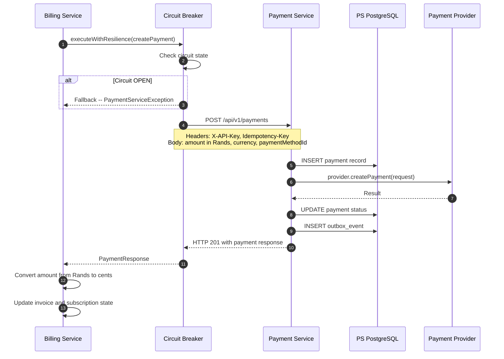
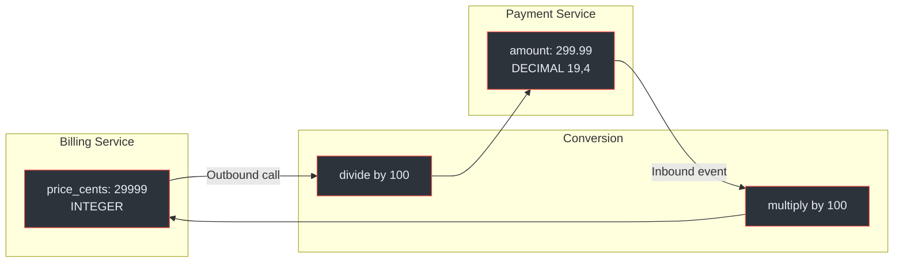
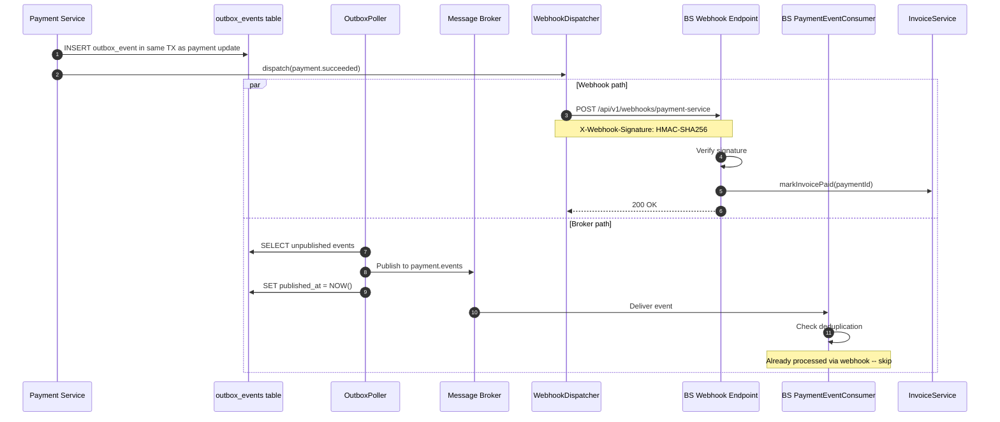
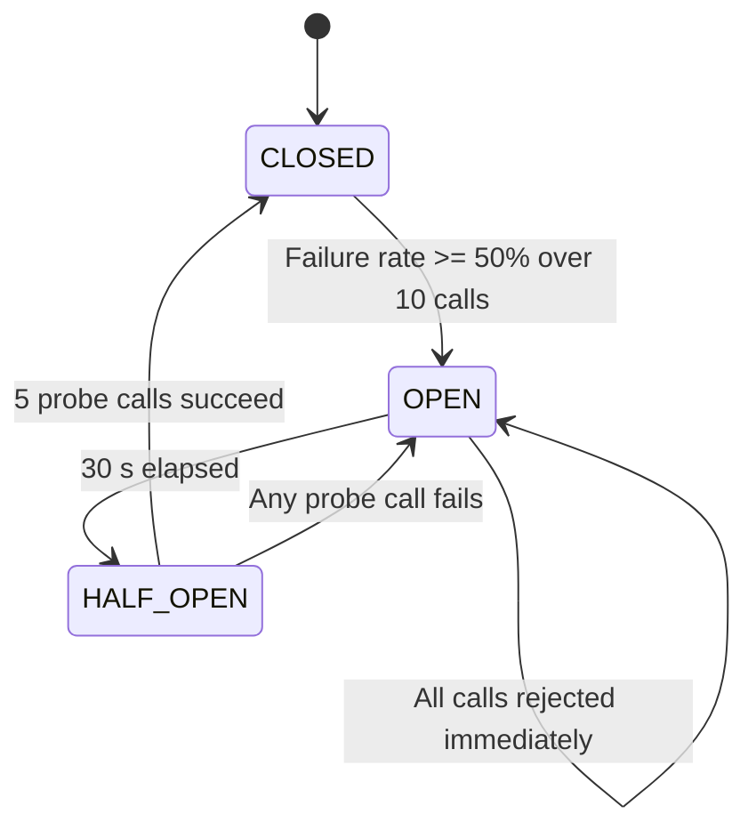
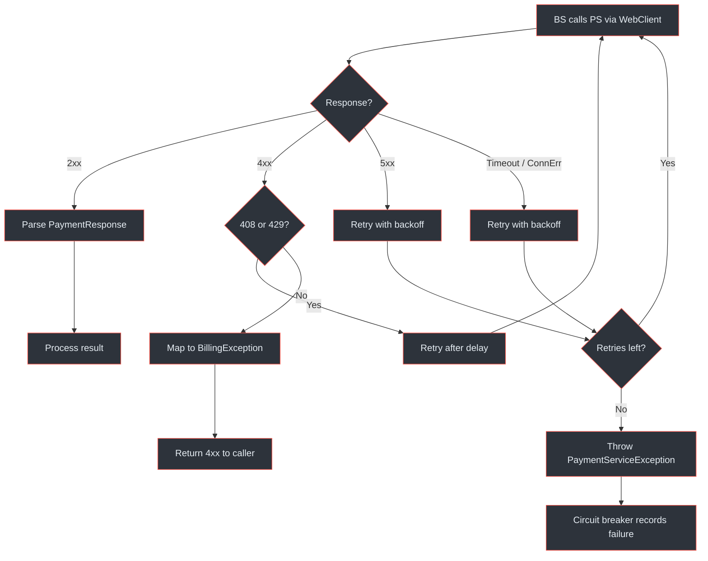

# Inter-Service Communication

The Payment Gateway Platform comprises two cooperating services. The **Billing Service** is a client of the **Payment Service** -- it delegates payment execution via synchronous REST calls and receives asynchronous results through webhooks and event topics. This page details every communication path, resilience mechanism, and data-translation boundary between them.

## At-a-Glance

| Aspect | Detail |
|---|---|
| Sync protocol | REST over HTTP/1.1 via Spring WebClient |
| Async channels | `payment.events` topic + HTTP webhook `POST /api/v1/webhooks/payment-service` |
| Auth model | `X-API-Key` header with shared secret; HMAC-SHA256 webhook signatures |
| Monetary boundary | Payment Service stores `DECIMAL(19,4)` Rands; Billing Service stores `INTEGER` cents |
| Circuit breaker | Resilience4j -- 50 % failure threshold, 30 s open-state wait, per-provider |
| Retry policy | 3 attempts, 1 s base delay, exponential multiplier of 2 |
| Deduplication | Composite key `(payment_service_payment_id, event_type)` checked before processing |
| Idempotency | Every mutating call carries an `Idempotency-Key` header (e.g. `invoice-{invoiceId}`) |

## REST Client Integration

The Billing Service calls the Payment Service through a **Spring WebClient** configured at startup. Configuration lives in `application.yml` under the `payment-service` key (`docs/billing-service/architecture-design.md:840`).

```yaml
# Billing Service application.yml
payment-service:
  base-url: ${PAYMENT_SERVICE_URL:http://payment-service:8080}
  api-key: ${PAYMENT_SERVICE_API_KEY}
  webhook-secret: ${PAYMENT_SERVICE_WEBHOOK_SECRET}
  timeout: 30s
  retry-attempts: 3
  retry-delay: 1s
```

### PaymentServiceClient Interface

The interface (`docs/billing-service/architecture-design.md:442`) defines every operation the Billing Service may invoke:

| Operation | HTTP | Path | Trigger |
|---|---|---|---|
| Create Customer | `POST` | `/api/v1/customers` | Subscription creation |
| Get Customer | `GET` | `/api/v1/customers/{id}` | Lookup |
| Create Payment | `POST` | `/api/v1/payments` | Invoice payment, renewal |
| Get Payment | `GET` | `/api/v1/payments/{id}` | Status check |
| List Payment Methods | `GET` | `/api/v1/payment-methods?customerId=X` | Show saved methods |
| Set Default Method | `POST` | `/api/v1/payment-methods/{id}/set-default` | Preference change |
| Create Refund | `POST` | `/api/v1/payments/{paymentId}/refunds` | Proration credit |
| Get Refund | `GET` | `/api/v1/refunds/{id}` | Status check |

### PaymentServiceClientImpl

The implementation (`docs/billing-service/architecture-design.md:467`) uses `WebClient.Builder` with pre-configured base URL and default headers:

```java
this.webClient = builder
    .baseUrl(config.getBaseUrl())
    .defaultHeader("X-API-Key", config.getApiKey())
    .defaultHeader("Content-Type", "application/json")
    .build();
```

Each call follows a uniform pattern -- `.retrieve()`, error status mapping, `.bodyToMono()`, `.timeout()`, and `.block()`. The `Idempotency-Key` header is set per-request to prevent duplicate charges (e.g. `"invoice-{invoiceId}"`) (`docs/billing-service/architecture-design.md:487`).

### Synchronous REST Call Sequence



<!-- Sources: docs/billing-service/architecture-design.md:467-498, docs/payment-service/payment-flow-diagrams.md:163-214, docs/shared/system-architecture.md:112-143 -->

## Monetary Unit Conversion Boundary

The two services use **different monetary representations**, creating a conversion boundary that every integration call must respect.

| Service | Storage type | Unit | Example |
|---|---|---|---|
| Payment Service | `DECIMAL(19,4)` | Rands | `299.9900` |
| Billing Service | `INTEGER` | Cents | `29999` |

**Conversion rules:**

- **BS to PS (outbound):** `amountRands = priceCents / 100.0` -- the Billing Service divides cents by 100 before calling `createPayment` (`docs/billing-service/billing-flow-diagrams.md:189`).
- **PS to BS (inbound):** event payload `amount` arrives in Rands; the Billing Service multiplies by 100 and rounds to the nearest integer cent.
- **Invariant:** `Math.round(amountRands * 100) == originalCents` must hold after a round-trip.



<!-- Sources: docs/billing-service/billing-flow-diagrams.md:189, docs/billing-service/architecture-design.md:484, docs/shared/system-architecture.md:112-143 -->

## Async Event Propagation

When a payment reaches a terminal state, the Payment Service publishes events through two parallel channels, and the Billing Service consumes both (`docs/billing-service/architecture-design.md:553-569`).

### Dual-Path Delivery

| Channel | Component | Latency | Durability |
|---|---|---|---|
| Message broker | `PaymentEventConsumer` subscribes to `payment.events` | Low | High -- durable topic with offsets |
| HTTP webhook | `PaymentServiceWebhookController` at `POST /api/v1/webhooks/payment-service` | Very low | Medium -- retried up to 5 times |

Both paths deliver the same event. Whichever arrives first is processed; the second is detected as a duplicate and skipped.

### Event Types Handled by the Billing Service

| Payment Service Event | Billing Service Action |
|---|---|
| `payment.succeeded` | Mark invoice `paid`, advance subscription period |
| `payment.failed` | Mark invoice `past_due`, increment retry counter |
| `payment.requires_action` | Notify customer (3DS required) |
| `payment_method.attached` | Activate subscription if `INCOMPLETE` |
| `payment_method.detached` | Warn if subscription relies on this method |
| `refund.succeeded` | Apply proration credit |
| `refund.failed` | Alert, log for manual review |

### Async Event Flow Sequence



<!-- Sources: docs/billing-service/architecture-design.md:553-571, docs/payment-service/payment-flow-diagrams.md:428-474, docs/shared/system-architecture.md:145-167 -->

## Event Deduplication

Because events arrive via two paths, the Billing Service must deduplicate. The strategy uses the composite key `(payment_service_payment_id, event_type)` (`docs/billing-service/architecture-design.md:561`).

**Algorithm:**

1. Extract `paymentId` and `eventType` from the incoming event.
2. Before processing, check whether the target entity already reflects the event (e.g. invoice `status = paid` means `payment.succeeded` was already handled).
3. If already processed, return `200 OK` (webhook) or skip (consumer) without side effects.
4. If not yet processed, delegate to the idempotent service method.

Both `PaymentEventConsumer` and `PaymentServiceWebhookController` delegate to the **same service methods** -- `invoiceService.markPaid()`, `subscriptionService.activate()` -- which are themselves idempotent. Calling `markPaid` on an already-paid invoice is a no-op (`docs/billing-service/architecture-design.md:571`).

## Circuit Breaker Configuration

All Payment Service calls from the Billing Service are wrapped in a **Resilience4j circuit breaker** (`docs/billing-service/architecture-design.md:502-521`, `docs/payment-service/architecture-design.md:348-364`).

### Parameters

| Parameter | Value |
|---|---|
| Failure rate threshold | 50% |
| Slow call duration threshold | 5 s |
| Slow call rate threshold | 80% |
| Minimum number of calls (sliding window) | 10 |
| Wait duration in open state | 30 s |
| Permitted calls in half-open state | 5 |
| Retry max attempts | 3 |
| Retry base wait | 1 s |
| Retry backoff multiplier | 2 |

### State Machine



<!-- Sources: docs/billing-service/architecture-design.md:502-521, docs/payment-service/architecture-design.md:348-364, docs/shared/system-architecture.md:140-143 -->

### Fallback Behaviour

When the circuit is **OPEN**:

- Synchronous calls throw `PaymentServiceException` immediately -- no network request is made.
- The Billing Service catches this and throws `ServiceUnavailableException` (HTTP 503) to upstream callers (`docs/billing-service/architecture-design.md:207`).
- For scheduled jobs (e.g. `RenewalJob`), the failed subscription is skipped and retried in the next hourly cycle.
- Metrics are exposed at `/actuator/circuitbreakerevents` and via the `circuit_breaker_state` Prometheus gauge (`docs/shared/system-architecture.md:524`).

## Retry and Error Handling

### Error Classification

| Error | Retry? | Action |
|---|---|---|
| `TimeoutException` | Yes (3x) | Queue for retry, throw `ServiceUnavailableException` |
| `ResourceAccessException` | Yes (3x) | Queue for retry, throw `ServiceUnavailableException` |
| HTTP 4xx (except 408/429) | No | Map to `BillingException`, surface to caller |
| HTTP 408 / 429 | Yes | Respect `Retry-After` header |
| HTTP 5xx | Yes (3x) | Exponential backoff, then `PaymentServiceException` |

### Retry Sequence

Retries use exponential backoff with a multiplier of 2 (`docs/billing-service/architecture-design.md:519`):

| Attempt | Delay |
|---|---|
| 1 | 1 s |
| 2 | 2 s |
| 3 | 4 s |
| After 3 | Circuit breaker evaluates; call may be rejected |

For **scheduled payment retries** (dunning), the Billing Service uses a longer schedule (`docs/billing-service/billing-flow-diagrams.md:607-608`):

| Attempt | Delay | Idempotency Key |
|---|---|---|
| 1 | +1 day | `invoice-{id}-retry-1` |
| 2 | +3 days | `invoice-{id}-retry-2` |
| 3 | +5 days | `invoice-{id}-retry-3` |
| 4 (final) | +7 days | `invoice-{id}-retry-4` |

### Full Error Handling Flow



<!-- Sources: docs/billing-service/architecture-design.md:502-521, docs/shared/system-architecture.md:140-143, docs/billing-service/billing-flow-diagrams.md:594-644 -->

## Observability

Both services expose metrics that track inter-service communication health (`docs/shared/system-architecture.md:512-524`):

| Metric | Type | Purpose |
|---|---|---|
| `payment_service_client_duration_seconds` | Histogram | Latency of BS-to-PS calls by operation and status |
| `circuit_breaker_state` | Gauge | Current state (0=closed, 1=open, 2=half-open) |
| `webhook_dispatch_total` | Counter | Outgoing webhook delivery attempts by event type |
| `webhook_dispatch_duration_seconds` | Histogram | Time to deliver each webhook |
| `broker_dlq_messages_total` | Counter | Messages landing in dead letter queues |

**Alert rules** (`docs/shared/system-architecture.md:536-541`):

| Alert | Condition | Severity |
|---|---|---|
| PaymentServiceLatencyHigh | p95 > 5 s | Warning |
| DLQMessagesAccumulating | increase > 10 / hour | Warning |
| RedisConnectionFailure | active connections = 0 | Critical |

## Related Pages

| Page | Relevance |
|---|---|
| [Platform Overview](../01-getting-started/platform-overview) | High-level service responsibilities |
| [Integration Quickstart](../01-getting-started/integration-quickstart) | Client onboarding guide |
| [Event System and Webhooks](./event-system) | Outbox pattern, DLQs, webhook dispatch |
| [Payment Service Architecture](./payment-service/) | SPI layer, provider adapters |
| [Payment Service Schema](./payment-service/schema) | `payments`, `outbox_events` tables |
| [Billing Service Architecture](./billing-service/) | Scheduled jobs, proration |
| [Billing Service Schema](./billing-service/schema) | `subscriptions`, `invoices` tables |
| [Provider Integrations](../03-deep-dive/provider-integrations) | Peach Payments, Ozow adapters |
| [Authentication](../03-deep-dive/security-compliance/authentication) | API key and HMAC models |
| [Data Flows](../03-deep-dive/data-flows/) | End-to-end payment and subscription flows |
| [Observability](../03-deep-dive/observability) | Metrics, tracing, alerting |
