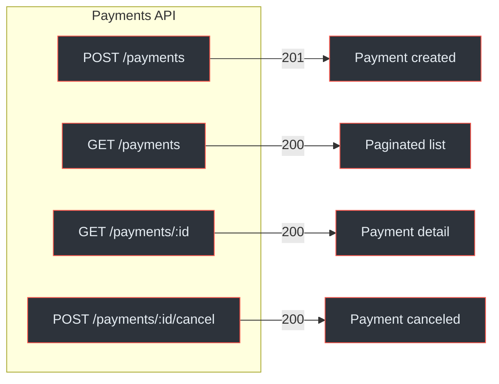
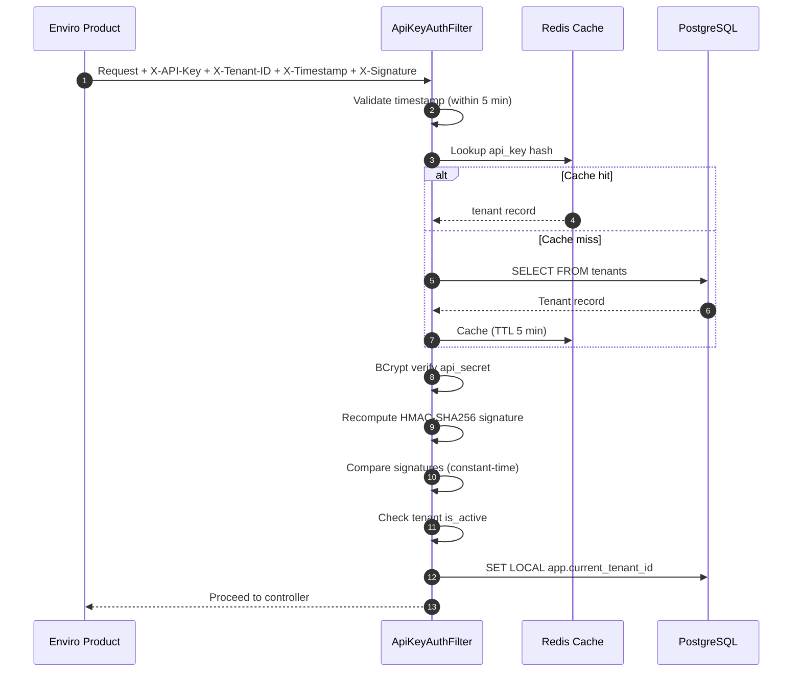
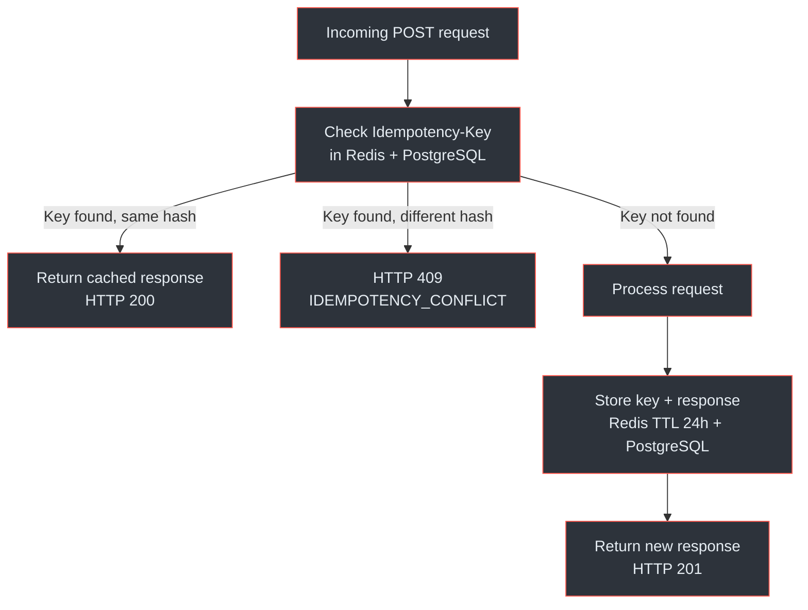
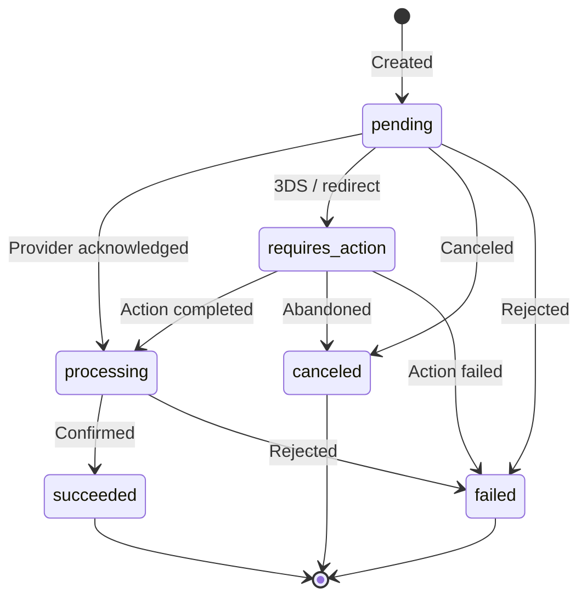

# Payment Service API Reference

The Payment Service exposes a RESTful API at `/api/v1` for payment processing, refund management, payment method tokenisation, tenant administration, and webhook configuration.

## At a Glance

| Attribute | Detail |
|---|---|
| **Base URL** | `https://payments.enviro.co.za/api/v1` |
| **Auth (tenant)** | HMAC-SHA256 with 4 headers |
| **Auth (admin)** | Bearer JWT |
| **Content Type** | `application/json` |
| **Amount Unit** | Rands (major currency unit), `DECIMAL` |
| **Idempotency** | Required on all POST creating payments/refunds |
| **Pagination** | `page`, `size`, `sort` query params |
| **Rate Limit** | 500 req/min per tenant (configurable) |
| **Endpoint Groups** | Payments, Payment Methods, Refunds, Tenants, Webhooks, Provider Webhooks, Health |

(docs/payment-service/api-specification.yaml:1-53)

---

## Authentication

### Tenant Authentication (HMAC-SHA256)

All tenant-scoped endpoints require 4 headers:

| Header | Description |
|---|---|
| `X-API-Key` | Tenant API key |
| `X-Tenant-ID` | Tenant UUID |
| `X-Timestamp` | ISO 8601 timestamp |
| `X-Signature` | HMAC-SHA256 signature |

The signature is computed over `<method>\n<path>\n<timestamp>\n<body>` using the tenant's API secret.

(docs/shared/integration-guide.md:78-120)

### Admin Authentication (Bearer JWT)

Tenant management endpoints (`/tenants/*`) use Bearer JWT:

```
Authorization: Bearer <admin_jwt_token>
```

(docs/payment-service/api-specification.yaml:1292-1296)

---

## Endpoint Reference

### Payments



<!-- Sources: docs/payment-service/api-specification.yaml:56-182 -->

| Method | Path | Description | Auth | Idempotency |
|---|---|---|---|---|
| `POST` | `/payments` | Create a payment | Tenant | Required |
| `GET` | `/payments` | List payments (paginated, filterable) | Tenant | -- |
| `GET` | `/payments/{paymentId}` | Get payment by ID | Tenant | -- |
| `POST` | `/payments/{paymentId}/cancel` | Cancel a pending/requires_action payment | Tenant | -- |

**Create payment request:**

```json
{
  "amount": 150.00,
  "currency": "ZAR",
  "provider": "peach_payments",
  "paymentType": "one_time",
  "customerEmail": "user@example.co.za",
  "customerName": "John Doe",
  "description": "Monthly subscription - Premium plan",
  "returnUrl": "https://etalente.co.za/payment/success",
  "metadata": {
    "orderId": "ORD-12345",
    "productLine": "etalente"
  }
}
```

(docs/payment-service/api-specification.yaml:737-789)

**Payment response:**

```json
{
  "id": "a1b2c3d4-e5f6-7890-abcd-ef1234567890",
  "tenantId": "tn_abc123",
  "amount": 150.00,
  "currency": "ZAR",
  "status": "processing",
  "provider": "peach_payments",
  "paymentType": "one_time",
  "customerEmail": "user@example.co.za",
  "customerName": "John Doe",
  "redirectUrl": "https://checkout.peachpayments.com/...",
  "createdAt": "2026-03-25T10:30:00Z"
}
```

**List payments query params:** `customerEmail`, `status`, `paymentType`, `provider`, `fromDate`, `toDate`, `page`, `size`, `sort`

(docs/payment-service/api-specification.yaml:93-136)

### Payment Methods

| Method | Path | Description | Auth |
|---|---|---|---|
| `POST` | `/payment-methods` | Tokenise a new payment method | Tenant |
| `GET` | `/payment-methods?customerId=X` | List methods for a customer | Tenant |
| `GET` | `/payment-methods/{id}` | Get method by ID | Tenant |
| `PUT` | `/payment-methods/{id}` | Update method metadata | Tenant |
| `DELETE` | `/payment-methods/{id}` | Soft-delete method | Tenant |
| `POST` | `/payment-methods/{id}/set-default?customerId=X` | Set as default | Tenant |

(docs/payment-service/api-specification.yaml:183-322)

**Method types:** `card`, `bank_account`, `digital_wallet`

**Payment method response includes:**
- `cardDetails`: `{brand, last4, expMonth, expYear, fingerprint}` (for cards)
- `bankDetails`: `{bankName, accountType, last4, branchCode}` (for bank accounts)
- `isDefault`, `isActive`, `expiresAt`

### Refunds

| Method | Path | Description | Auth | Idempotency |
|---|---|---|---|---|
| `POST` | `/payments/{paymentId}/refunds` | Create a full or partial refund | Tenant | Required |
| `GET` | `/payments/{paymentId}/refunds` | List refunds for a payment | Tenant | -- |
| `GET` | `/refunds/{refundId}` | Get refund by ID | Tenant | -- |

(docs/payment-service/api-specification.yaml:324-407)

**Create refund request:**

```json
{
  "amount": 50.00,
  "reason": "Customer requested cancellation",
  "metadata": {}
}
```

**Constraint:** `SUM(succeeded refunds for payment) + new amount <= payment.amount`. Violation returns HTTP 422 with `REFUND_EXCEEDS_AMOUNT`.

### Tenants (Admin)

| Method | Path | Description | Auth |
|---|---|---|---|
| `POST` | `/tenants` | Register a new tenant | Admin |
| `GET` | `/tenants/{tenantId}` | Get tenant details | Admin |
| `PUT` | `/tenants/{tenantId}` | Update tenant config | Admin |
| `POST` | `/tenants/{tenantId}/rotate-api-key` | Rotate API key (24h grace) | Admin |

(docs/payment-service/api-specification.yaml:409-498)

**Register tenant response (credentials shown once):**

```json
{
  "id": "tn_abc123",
  "name": "eTalente",
  "apiKey": "pk_live_abc123...",
  "apiSecret": "sk_live_xyz789...",
  "isActive": true,
  "createdAt": "2026-03-25T10:00:00Z"
}
```

### Webhooks

| Method | Path | Description | Auth |
|---|---|---|---|
| `POST` | `/webhooks` | Create webhook config | Tenant |
| `GET` | `/webhooks` | List webhook configs | Tenant |
| `PUT` | `/webhooks/{webhookId}` | Update webhook config | Tenant |
| `DELETE` | `/webhooks/{webhookId}` | Delete webhook config | Tenant |

(docs/payment-service/api-specification.yaml:500-592)

**Create webhook config request:**

```json
{
  "url": "https://etalente.co.za/webhooks/payments",
  "events": ["payment.succeeded", "payment.failed", "refund.succeeded"]
}
```

### Provider Webhooks

| Method | Path | Description | Auth |
|---|---|---|---|
| `POST` | `/webhooks/provider/{providerCode}` | Receive provider webhook | Provider signature |

This is a public endpoint. Authentication is via the provider's own signature mechanism (not API key).

(docs/payment-service/api-specification.yaml:594-634)

### Health

| Method | Path | Description | Auth |
|---|---|---|---|
| `GET` | `/health` | Service health check | None |
| `GET` | `/health/ready` | Readiness probe (DB, Redis, broker) | None |

(docs/payment-service/api-specification.yaml:636-662)

---

## Authentication Flow



<!-- Sources: docs/payment-service/architecture-design.md:482-505, docs/shared/integration-guide.md:78-120 -->

---

## Idempotency

All `POST` endpoints that create payments or refunds require an `Idempotency-Key` header. Keys expire after 24 hours.



<!-- Sources: docs/payment-service/architecture-design.md:409-419, docs/shared/integration-guide.md:142-188 -->

---

## Error Handling

### Error Response Format

```json
{
  "error": {
    "code": "PAYMENT_NOT_FOUND",
    "message": "Payment with ID pay_abc123 not found",
    "details": {},
    "requestId": "req_xyz789",
    "timestamp": "2026-03-25T10:30:00Z"
  }
}
```

(docs/payment-service/architecture-design.md:596-608)

### Error Codes

| Code | HTTP | Description |
|---|---|---|
| `VALIDATION_ERROR` | 400 | Request validation failed |
| `INVALID_API_KEY` | 401 | API key not found or invalid |
| `TENANT_SUSPENDED` | 403 | Tenant account is suspended |
| `PAYMENT_NOT_FOUND` | 404 | Payment ID not found |
| `REFUND_NOT_FOUND` | 404 | Refund ID not found |
| `PAYMENT_METHOD_NOT_FOUND` | 404 | Payment method ID not found |
| `TENANT_NOT_FOUND` | 404 | Tenant ID not found |
| `IDEMPOTENCY_CONFLICT` | 409 | Idempotency key reused with different params |
| `INVALID_PAYMENT_STATE` | 422 | Operation not valid for current payment status |
| `REFUND_EXCEEDS_AMOUNT` | 422 | Total refunds would exceed payment amount |
| `RATE_LIMIT_EXCEEDED` | 429 | Too many requests |
| `PROVIDER_ERROR` | 502 | Payment provider returned an error |
| `PROVIDER_TIMEOUT` | 504 | Payment provider did not respond in time |

(docs/payment-service/architecture-design.md:610-627)

### Rate Limiting Headers

| Header | Description |
|---|---|
| `X-RateLimit-Limit` | Maximum requests per window |
| `X-RateLimit-Remaining` | Remaining requests in current window |
| `X-RateLimit-Reset` | Seconds until window resets |
| `Retry-After` | Seconds to wait (only on 429) |

(docs/payment-service/architecture-design.md:508-512)

---

## Pagination

All list endpoints return paginated responses using Spring Data conventions:

| Parameter | Default | Range |
|---|---|---|
| `page` | `0` | `>= 0` |
| `size` | `20` | `1 - 100` |
| `sort` | `createdAt,desc` | Any sortable field |

(docs/payment-service/api-specification.yaml:712-733)

**Response envelope:**

```json
{
  "content": [],
  "page": 0,
  "size": 20,
  "totalElements": 142,
  "totalPages": 8,
  "last": false
}
```

---

## Payment Statuses



<!-- Sources: docs/payment-service/architecture-design.md:780-809 -->

---

## Related Pages

| Page | Description |
|---|---|
| [Payment Service Architecture](./index) | Four-layer design, provider SPI, circuit breakers |
| [Payment Service Schema](./schema) | Database tables, RLS, indexes, and migration strategy |
| [Billing Service API](../billing-service/api) | Billing Service endpoint reference |
| [Integration Quickstart](../../01-getting-started/integration-quickstart) | Step-by-step guide to make your first payment |
| [Inter-Service Communication](../inter-service-communication) | How Billing Service calls Payment Service |
| [Event System](../event-system) | Webhook dispatch, event schemas, and retry behaviour |
| [Security and Compliance](../../03-deep-dive/security-compliance/) | HMAC-SHA256 details, PCI DSS, POPIA |
