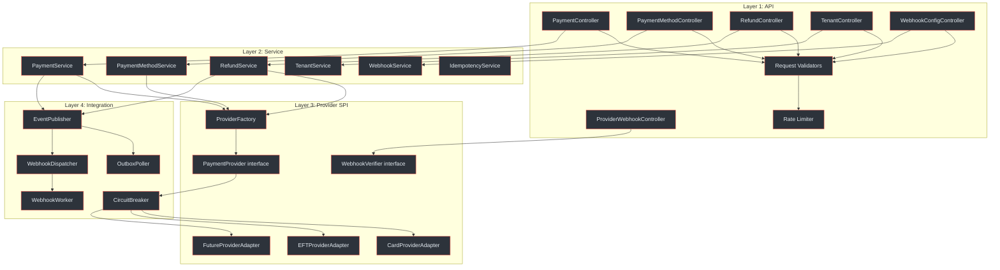
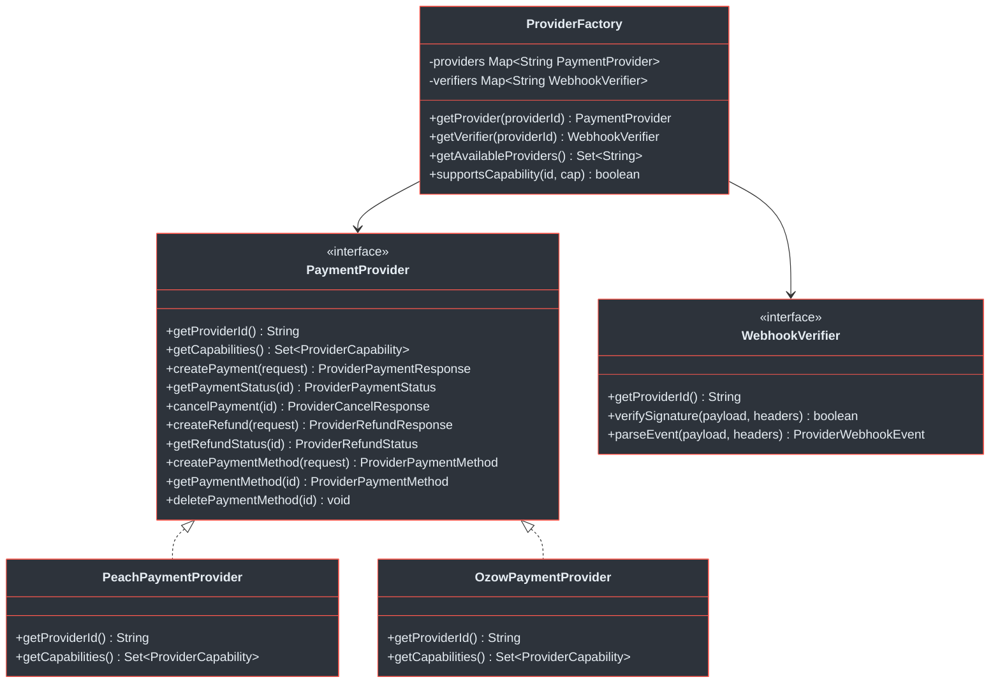
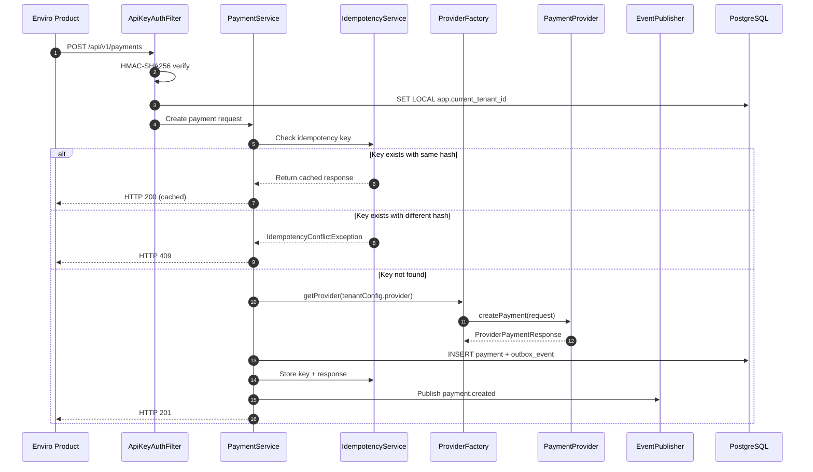
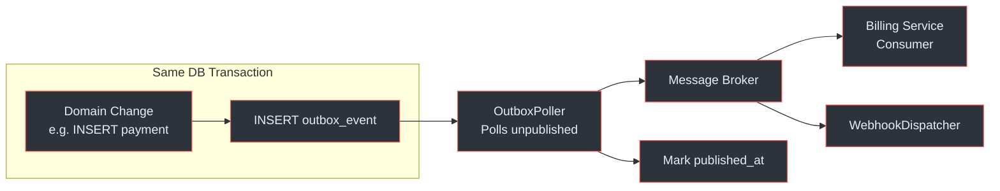
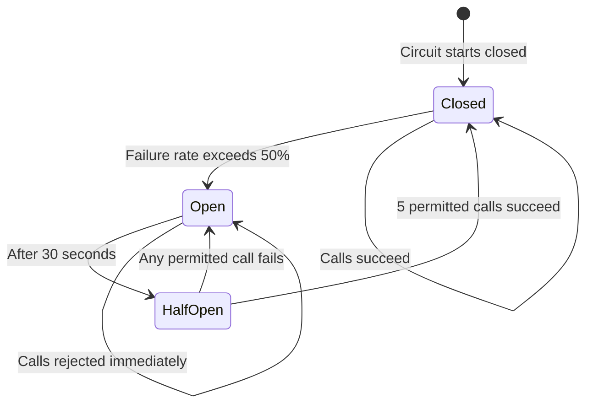
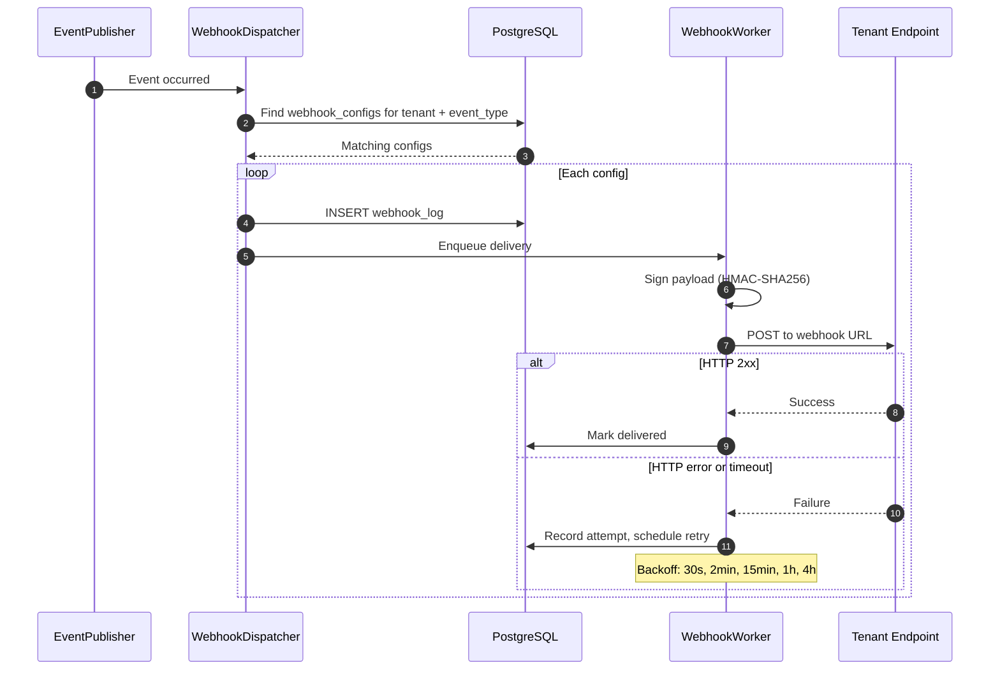
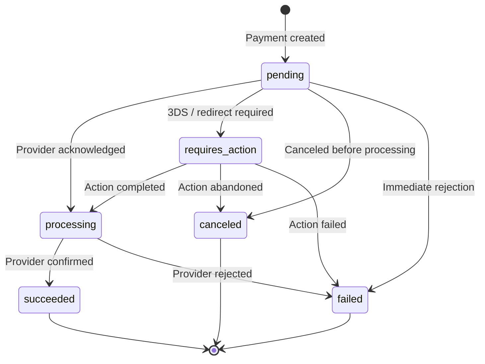

# Payment Service Architecture

The Payment Service is the lower-level abstraction in the Payment Gateway Platform. It provides a provider-agnostic REST API for payment creation, refunds, payment method tokenisation, and outgoing webhook dispatch. All provider-specific logic is isolated behind a Service Provider Interface (SPI) boundary.

## At a Glance

| Attribute | Detail |
|---|---|
| **Port** | `:8080` |
| **Package Root** | `com.enviro.payment` |
| **Architecture** | Modular monolith (hexagonal / ports-and-adapters) |
| **Database** | `payment_service_db` (PostgreSQL 16+) |
| **Tables** | 9 (RLS on 7 of 9) |
| **Auth Model** | HMAC-SHA256 (4 headers) |
| **Amount Format** | `DECIMAL(19,4)` Rands |
| **Event Topics** | `payment.events`, `refund.events`, `payment-method.events` |
| **DLQ** | `payment.events.dlq` |
| **Provider Pattern** | Strategy + Factory with Spring auto-discovery |
| **Circuit Breaker** | Resilience4j (50% threshold, 30s open, 5 half-open calls) |

(docs/payment-service/architecture-design.md:1-22)

---

## Four-Layer Architecture

The Payment Service is organised into four distinct layers. Each layer has a single responsibility and communicates only with its immediate neighbours.



<!-- Sources: docs/payment-service/architecture-design.md:30-104, docs/payment-service/architecture-design.md:106-184 -->

### Layer Responsibilities

| Layer | Packages | Responsibility |
|---|---|---|
| **API** | `api.controller`, `api.dto`, `api.mapper`, `api.validation` | REST endpoints, request validation, rate limiting, DTO mapping |
| **Service** | `service`, `service.impl` | Business logic, idempotency enforcement, transactional guarantees |
| **Provider SPI** | `provider`, `provider.adapter.*` | Provider abstraction, capability-based routing, adapter implementations |
| **Integration** | `integration.messaging`, `integration.outbox`, `integration.circuitbreaker`, `integration.webhook` | Event publishing, outbox polling, circuit breakers, webhook dispatch |

(docs/payment-service/architecture-design.md:106-184)

---

## Provider SPI Pattern

The provider layer uses a **Strategy + Factory** pattern with Spring auto-discovery. New providers are added by implementing `PaymentProvider` and `WebhookVerifier`, annotating with `@Component`, and restarting the service. No factory code changes are needed.



<!-- Sources: docs/payment-service/architecture-design.md:188-296 -->

### Provider Capabilities

| Capability | Description |
|---|---|
| `ONE_TIME_PAYMENT` | Single payments |
| `RECURRING_PAYMENT` | Token-based recurring charges |
| `REFUND_FULL` | Full refunds |
| `REFUND_PARTIAL` | Partial refunds |
| `TOKENIZE_CARD` | Card tokenisation |
| `TOKENIZE_BANK_ACCOUNT` | Bank account tokenisation |
| `THREE_D_SECURE` | 3DS authentication |
| `REDIRECT_FLOW` | Redirect-based payment (hosted checkout) |
| `WEBHOOK_NOTIFICATIONS` | Provider sends webhooks |
| `DIGITAL_WALLET` | Apple Pay, Google Pay, Samsung Pay |
| `BNPL` | Buy Now Pay Later |

(docs/payment-service/architecture-design.md:229-243)

### Adding a New Provider

1. Implement `PaymentProvider` and `WebhookVerifier` interfaces
2. Annotate both classes with `@Component`
3. Spring auto-discovers them via constructor injection into `ProviderFactory`
4. No factory code changes needed

(docs/payment-service/architecture-design.md:298-303)

---

## Payment Creation Flow



<!-- Sources: docs/payment-service/architecture-design.md:308-321, docs/payment-service/architecture-design.md:409-419 -->

All mutating operations in the Payment Service use `@Transactional`. The payment record and outbox event are written in the same database transaction, guaranteeing atomicity. The `OutboxPoller` relays events to the message broker asynchronously.

(docs/payment-service/architecture-design.md:317-321)

---

## Transactional Outbox Pattern

Events are never published directly to the message broker from within a business transaction. Instead, an `outbox_events` row is inserted in the same transaction as the domain change. The `OutboxPoller` picks up unpublished events and forwards them to the broker.



<!-- Sources: docs/payment-service/architecture-design.md:317-321, docs/billing-service/architecture-design.md:692-708 -->

**Guarantee:** At-least-once delivery. If the broker is unavailable, events remain in the outbox and are retried on the next poll cycle. Consumers must be idempotent.

---

## Circuit Breaker Configuration

All outbound calls to payment providers are wrapped in a Resilience4j circuit breaker to prevent cascading failures.

| Parameter | Value |
|---|---|
| **Failure rate threshold** | 50% |
| **Slow call duration threshold** | 5 seconds |
| **Slow call rate threshold** | 80% |
| **Minimum number of calls** | 10 |
| **Wait duration in open state** | 30 seconds |
| **Permitted calls in half-open** | 5 |

(docs/payment-service/architecture-design.md:347-365)



<!-- Sources: docs/payment-service/architecture-design.md:347-365 -->

**Fallback behaviour:** When the circuit is open, requests return `PROVIDER_TIMEOUT` (504) immediately. Each provider has an independent circuit (e.g., `peach_payments` and `ozow` have separate breakers). Metrics are exposed via `/actuator/circuitbreakerevents`.

---

## Webhook Dispatch

When a payment-related event occurs, the `WebhookDispatcher` finds all matching webhook configurations for the tenant and enqueues delivery attempts.



<!-- Sources: docs/payment-service/architecture-design.md:396-408, docs/shared/integration-guide.md:640-680 -->

### Webhook Signature Format

All outgoing webhooks are signed with the tenant's shared secret using HMAC-SHA256:

```
X-Webhook-Signature: t=<timestamp>,v1=<signature>
```

The signature is computed over `<timestamp>.<payload_body>`. Tenants verify by recomputing the HMAC and comparing with the `v1` value.

(docs/shared/integration-guide.md:640-680)

### Retry Schedule

| Attempt | Delay |
|---|---|
| 1 | 30 seconds |
| 2 | 2 minutes |
| 3 | 15 minutes |
| 4 | 1 hour |
| 5 | 4 hours |

After 5 failed attempts, the webhook log status is set to `exhausted` and no further retries are scheduled.

---

## Payment State Machine



<!-- Sources: docs/payment-service/architecture-design.md:780-801 -->

### Valid Transitions

| From | To |
|---|---|
| `pending` | `processing`, `requires_action`, `canceled`, `failed` |
| `requires_action` | `processing`, `canceled`, `failed` |
| `processing` | `succeeded`, `failed` |

(docs/payment-service/architecture-design.md:803-809)

---

## Service Component Summary

| Component | Key Responsibility |
|---|---|
| **PaymentService** | Create payments, query status, cancel, handle provider callbacks |
| **PaymentMethodService** | CRUD for tokenised payment methods (PCI-compliant, metadata only) |
| **RefundService** | Create refunds with amount constraint: `SUM(succeeded refunds) <= payment.amount` |
| **TenantService** | Register tenants, rotate API keys, manage provider config |
| **WebhookService** | Manage endpoint configs, dispatch events to subscribers |
| **IdempotencyService** | Prevent duplicate processing via Redis + PostgreSQL dual-layer cache |

(docs/payment-service/architecture-design.md:306-419)

---

## Related Pages

| Page | Description |
|---|---|
| [Payment Service Schema](./schema) | Database tables, RLS policies, indexes, and Flyway migrations |
| [Payment Service API](./api) | Full API reference with endpoints, auth, and error codes |
| [Billing Service Architecture](../billing-service/) | Billing Service internal architecture and scheduling |
| [Inter-Service Communication](../inter-service-communication) | Sync REST calls and async event propagation between services |
| [Event System](../event-system) | Transactional outbox, topics, webhooks, and DLQ monitoring |
| [Platform Overview](../../01-getting-started/platform-overview) | High-level two-service architecture and deployment topology |
| [Security and Compliance](../../03-deep-dive/security-compliance/) | PCI DSS, POPIA, encryption, and tenant isolation |
