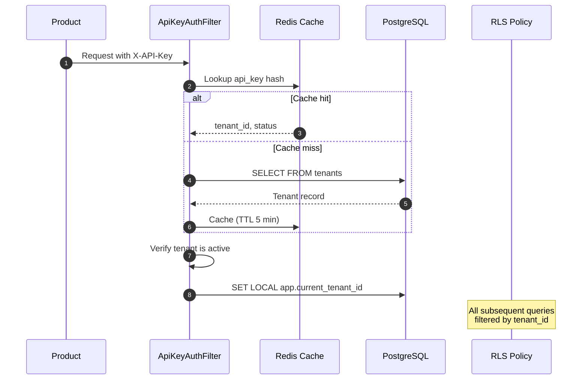
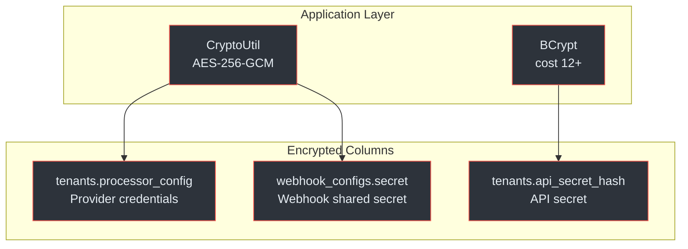
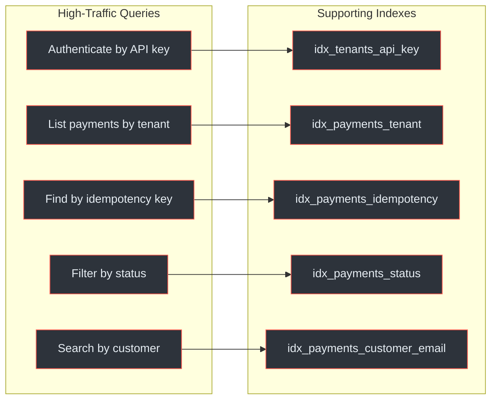

# Payment Service Schema

The Payment Service uses a dedicated PostgreSQL 16+ database (`payment_service_db`) with 9 tables. All tenant-scoped tables enforce Row-Level Security (RLS) policies using `app.current_tenant_id`.

## At a Glance

| Attribute | Detail |
|---|---|
| **Database** | `payment_service_db` |
| **Tables** | 9 |
| **RLS-Enabled** | 7 of 9 |
| **RLS Variable** | `app.current_tenant_id` |
| **Primary Keys** | UUID (`gen_random_uuid()`) |
| **Amount Type** | `DECIMAL(19,4)` with `CHECK (amount > 0)` |
| **Currency** | `VARCHAR(3)` ISO 4217, default `ZAR` |
| **Migration Tool** | Flyway (9 versioned scripts) |
| **Encryption** | AES-256-GCM for provider credentials, BCrypt (cost 12+) for API secrets |
| **Retention** | Financial records 7 years, events 2 years, webhooks 90 days, idempotency 24h |

(docs/payment-service/database-schema-design.md:1-32)

---

## Entity Relationship Diagram

```mermaid
erDiagram
    tenants ||--o{ payments : "has"
    tenants ||--o{ payment_methods : "has"
    tenants ||--o{ refunds : "has"
    tenants ||--o{ payment_events : "has"
    tenants ||--o{ webhook_configs : "has"
    tenants ||--o{ webhook_logs : "has"
    tenants ||--o{ idempotency_keys : "has"

    payments ||--o{ refunds : "has"
    payments ||--o{ payment_events : "references"
    payments ||--o{ webhook_logs : "references"
    payment_methods ||--o{ payments : "used by"

    webhook_logs ||--o{ webhook_deliveries : "has"

    tenants {
        uuid id PK
        varchar name
        varchar api_key UK
        varchar api_secret_hash
        jsonb processor_config
        integer rate_limit_per_minute
        boolean is_active
    }

    payments {
        uuid id PK
        uuid tenant_id FK
        uuid payment_method_id FK
        varchar idempotency_key UK
        varchar provider
        decimal amount
        varchar currency
        varchar status
        varchar payment_type
        jsonb metadata
    }

    payment_methods {
        uuid id PK
        uuid tenant_id FK
        varchar customer_id
        varchar provider
        varchar method_type
        jsonb card_details
        jsonb bank_details
        boolean is_default
        boolean is_active
    }

    refunds {
        uuid id PK
        uuid payment_id FK
        uuid tenant_id FK
        varchar idempotency_key UK
        decimal amount
        varchar currency
        varchar status
        text reason
    }

    payment_events {
        uuid id PK
        uuid tenant_id FK
        uuid payment_id FK
        uuid refund_id FK
        varchar event_type
        varchar status
        jsonb payload
    }

    webhook_configs {
        uuid id PK
        uuid tenant_id FK
        varchar url
        varchar secret
        jsonb events
        boolean is_active
    }

    webhook_logs {
        uuid id PK
        uuid tenant_id FK
        uuid payment_id FK
        varchar event_type
        varchar status
        jsonb payload
    }

    webhook_deliveries {
        uuid id PK
        uuid webhook_log_id FK
        varchar url
        integer attempt_number
        integer response_status
    }

    idempotency_keys {
        uuid tenant_id PK_FK
        varchar key PK
        varchar request_hash
        integer response_status
        jsonb response_body
        timestamp expires_at
    }
```

<!-- Sources: docs/payment-service/database-schema-design.md:37-179 -->

---

## Table Definitions

### tenants

Stores registered client projects (e.g., eTalente, CV Analyser) and their per-provider configuration. This is the only admin-only table without RLS.

| Column | Type | Constraints | Description |
|---|---|---|---|
| `id` | `UUID` | PK, `gen_random_uuid()` | Tenant identifier |
| `name` | `VARCHAR(255)` | NOT NULL | Project name |
| `api_key` | `VARCHAR(255)` | NOT NULL, UNIQUE | Public API key |
| `api_secret_hash` | `VARCHAR(255)` | NOT NULL | BCrypt hash (cost 12+) |
| `processor_config` | `JSONB` | NOT NULL, default `{}` | Per-provider credentials (AES-256-GCM encrypted) |
| `rate_limit_per_minute` | `INTEGER` | NOT NULL, default `60` | Tenant-specific rate limit |
| `is_active` | `BOOLEAN` | NOT NULL, default `TRUE` | Soft-delete flag |
| `created_at` | `TIMESTAMPTZ` | NOT NULL, default `NOW()` | Creation timestamp |
| `updated_at` | `TIMESTAMPTZ` | NOT NULL, default `NOW()` | Last update timestamp |

(docs/payment-service/database-schema-design.md:185-210)

### payments

Core payment records. Each payment belongs to one tenant and optionally references one payment method. The `(tenant_id, idempotency_key)` composite unique constraint prevents duplicate payments.

| Column | Type | Constraints |
|---|---|---|
| `id` | `UUID` | PK |
| `tenant_id` | `UUID` | FK `tenants(id)` ON DELETE RESTRICT |
| `payment_method_id` | `UUID` | FK `payment_methods(id)` ON DELETE SET NULL |
| `idempotency_key` | `VARCHAR(255)` | NOT NULL, UNIQUE per tenant |
| `provider` | `VARCHAR(50)` | NOT NULL |
| `provider_payment_id` | `VARCHAR(255)` | Nullable |
| `amount` | `DECIMAL(19,4)` | NOT NULL, `CHECK (amount > 0)` |
| `currency` | `VARCHAR(3)` | NOT NULL, default `ZAR` |
| `status` | `VARCHAR(50)` | CHECK IN (`pending`, `processing`, `succeeded`, `failed`, `canceled`, `requires_action`) |
| `payment_type` | `VARCHAR(50)` | CHECK IN (`one_time`, `recurring`) |
| `metadata` | `JSONB` | NOT NULL, default `{}` |
| `customer_id` | `VARCHAR(255)` | Nullable |
| `customer_email` | `VARCHAR(255)` | NOT NULL |
| `customer_name` | `VARCHAR(255)` | NOT NULL |
| `processed_at` | `TIMESTAMPTZ` | Nullable |

(docs/payment-service/database-schema-design.md:232-281)

### payment_methods

Tokenised payment methods. Full card/account details are stored by the provider; only metadata (brand, last4, expiry) is kept locally. Sensitive JSONB fields are encrypted with AES-256-GCM.

**Method types:** `card`, `bank_account`, `digital_wallet`

**`card_details` JSONB:**
```json
{
  "brand": "visa",
  "last4": "4242",
  "exp_month": 12,
  "exp_year": 2028,
  "fingerprint": "fp_abc123"
}
```

**`bank_details` JSONB:**
```json
{
  "bank_name": "FNB",
  "account_type": "cheque",
  "last4": "7890",
  "branch_code": "250655"
}
```

(docs/payment-service/database-schema-design.md:293-351)

### refunds

Refund records linked to a parent payment. The service layer enforces `SUM(succeeded refunds) <= payment.amount`.

| Column | Type | Key Constraint |
|---|---|---|
| `id` | `UUID` | PK |
| `payment_id` | `UUID` | FK `payments(id)` ON DELETE RESTRICT |
| `tenant_id` | `UUID` | FK `tenants(id)` ON DELETE RESTRICT |
| `idempotency_key` | `VARCHAR(255)` | UNIQUE per tenant |
| `amount` | `DECIMAL(19,4)` | `CHECK (amount > 0)` |
| `status` | `VARCHAR(50)` | CHECK IN (`pending`, `processing`, `succeeded`, `failed`, `canceled`) |

(docs/payment-service/database-schema-design.md:355-406)

### payment_events

Immutable event log for audit and replay. Rows are never updated or deleted except by the retention policy (2-year TTL).

**Event types:** `payment.created`, `payment.processing`, `payment.succeeded`, `payment.failed`, `payment.canceled`, `payment.requires_action`, `refund.created`, `refund.processing`, `refund.succeeded`, `refund.failed`, `payment_method.attached`, `payment_method.detached`, `payment_method.updated`, `payment_method.expired`

(docs/payment-service/database-schema-design.md:410-448)

### webhook_configs

Outgoing webhook endpoint configurations. Tenants register URLs and select which event types to receive. The `secret` column stores the HMAC-SHA256 shared secret, encrypted at rest with AES-256-GCM.

(docs/payment-service/database-schema-design.md:452-485)

### webhook_logs and webhook_deliveries

`webhook_logs` holds one row per event generated. `webhook_deliveries` holds one row per delivery attempt per endpoint, with retry scheduling.

| `webhook_logs.status` | Description |
|---|---|
| `pending` | Not yet attempted |
| `delivered` | 2xx received from endpoint |
| `failed` | Currently retrying |
| `exhausted` | Retries exceeded (max 5) |

(docs/payment-service/database-schema-design.md:489-553)

### idempotency_keys

Composite PK `(tenant_id, key)`. Keys auto-expire after 24 hours. The `request_hash` column (SHA-256) detects conflicting reuse of the same key with different parameters.

(docs/payment-service/database-schema-design.md:557-591)

---

## Row-Level Security

All tenant-scoped queries are filtered by RLS policies using a session variable set per request by `ApiKeyAuthenticationFilter`.



<!-- Sources: docs/payment-service/database-schema-design.md:600-619, docs/payment-service/architecture-design.md:482-505 -->

### RLS Summary

| Table | RLS | Policy |
|---|---|---|
| `tenants` | <span class="fail">No</span> | Admin-only table |
| `payments` | <span class="ok">Yes</span> | `tenant_id = current_setting('app.current_tenant_id')::uuid` |
| `payment_methods` | <span class="ok">Yes</span> | Same |
| `refunds` | <span class="ok">Yes</span> | Same |
| `payment_events` | <span class="ok">Yes</span> | Same |
| `webhook_configs` | <span class="ok">Yes</span> | Same |
| `webhook_logs` | <span class="ok">Yes</span> | Same |
| `webhook_deliveries` | <span class="fail">No</span> | FK to RLS-protected `webhook_logs` |
| `idempotency_keys` | <span class="ok">Yes</span> | Same |

The `SET LOCAL` scoping ensures the tenant context is automatically cleared at transaction end.

(docs/payment-service/database-schema-design.md:600-619)

---

## Encryption at Rest



<!-- Sources: docs/payment-service/architecture-design.md:514-523, docs/payment-service/database-schema-design.md:226-228 -->

| Data | Method | Storage Format |
|---|---|---|
| Provider credentials (`processor_config`) | AES-256-GCM | `enc:AES256:<ciphertext>` in JSONB values |
| Webhook shared secrets | AES-256-GCM | Encrypted at application layer |
| API secret | BCrypt (cost 12+) | One-way hash in `api_secret_hash` |
| Card metadata (last4, brand) | PostgreSQL TDE / volume encryption | Plain in JSONB (no full card numbers stored) |

(docs/payment-service/architecture-design.md:514-523)

---

## Index Strategy



<!-- Sources: docs/payment-service/database-schema-design.md:729-751 -->

### Full Index Inventory

| Query Pattern | Table | Index | Type |
|---|---|---|---|
| Authenticate by API key | `tenants` | `idx_tenants_api_key` | B-tree |
| List payments by tenant | `payments` | `idx_payments_tenant` | B-tree |
| Find by idempotency key | `payments` | `idx_payments_idempotency` | B-tree |
| Find by provider ID | `payments` | `idx_payments_provider_id` | Partial (WHERE NOT NULL) |
| Filter by status | `payments` | `idx_payments_status` | B-tree |
| Search by customer email | `payments` | `idx_payments_customer_email` | B-tree |
| Find by customer ID | `payments` | `idx_payments_customer_id` | Partial (WHERE NOT NULL) |
| Recent payments | `payments` | `idx_payments_created` | B-tree DESC |
| Filter by metadata | `payments` | `idx_payments_metadata` | GIN |
| List methods by customer | `payment_methods` | `idx_payment_methods_customer` | B-tree |
| Active methods only | `payment_methods` | `idx_payment_methods_is_active` | Partial |
| Refunds for a payment | `refunds` | `idx_refunds_payment` | B-tree |
| Refunds by payment + status | `refunds` | `idx_refunds_payment_status` | Composite |
| Events for a payment | `payment_events` | `idx_payment_events_payment` | Partial |
| Pending retries | `webhook_deliveries` | `idx_webhook_deliveries_retry` | Partial |
| Expired keys | `idempotency_keys` | `idx_idempotency_expires` | B-tree |

(docs/payment-service/database-schema-design.md:729-751)

---

## Flyway Migration Order

| Version | File | Description |
|---|---|---|
| V001 | `V001__create_tenants.sql` | Tenants table |
| V002 | `V002__create_payment_methods.sql` | Payment methods + RLS |
| V003 | `V003__create_payments.sql` | Payments + RLS |
| V004 | `V004__create_refunds.sql` | Refunds + RLS |
| V005 | `V005__create_payment_events.sql` | Payment events + RLS |
| V006 | `V006__create_webhook_configs.sql` | Webhook configs + RLS |
| V007 | `V007__create_webhook_logs.sql` | Webhook logs + RLS |
| V007b | `V007b__create_webhook_deliveries.sql` | Webhook deliveries |
| V008 | `V008__create_idempotency_keys.sql` | Idempotency keys + RLS |

(docs/payment-service/database-schema-design.md:622-636)

---

## Data Retention

| Table | Retention | Rationale |
|---|---|---|
| `tenants` | Indefinite | Active configuration |
| `payments` | 7 years | Financial records (SA tax law) |
| `payment_methods` | Until deactivated + 90 days | PCI compliance |
| `refunds` | 7 years | Financial records |
| `payment_events` | 2 years | Audit trail |
| `webhook_configs` | Until deleted | Active configuration |
| `webhook_logs` | 90 days | Debugging and replay |
| `webhook_deliveries` | 90 days | Debugging |
| `idempotency_keys` | 24 hours | Auto-expire |

(docs/payment-service/database-schema-design.md:704-725)

**Automated cleanup (daily Quartz job):**

```sql
DELETE FROM idempotency_keys WHERE expires_at < NOW();
DELETE FROM webhook_deliveries WHERE attempted_at < NOW() - INTERVAL '90 days';
DELETE FROM webhook_logs WHERE created_at < NOW() - INTERVAL '90 days';
DELETE FROM payment_events WHERE created_at < NOW() - INTERVAL '2 years';
```

---

## Amount Handling

All monetary values use `DECIMAL(19,4)` in the database and `BigDecimal` in Java. Amounts are stored in major units (Rands), not cents.

**Rules:**
1. Never use `double` or `float` for money
2. Internal storage: full precision (4 decimal places)
3. Provider conversion happens in the adapter layer (some providers expect major units with 2 decimal places)
4. Rounding: `RoundingMode.HALF_UP` for display, `RoundingMode.UNNECESSARY` for exact calculations

(docs/payment-service/database-schema-design.md:753-771)

---

## Related Pages

| Page | Description |
|---|---|
| [Payment Service Architecture](./index) | Four-layer design, provider SPI, circuit breakers |
| [Payment Service API](./api) | Full API reference with endpoints and error codes |
| [Billing Service Schema](../billing-service/schema) | 13 tables, cents-based amounts, SARS invoice numbering |
| [Inter-Service Communication](../inter-service-communication) | Amount conversion between Rands and cents at service boundary |
| [Event System](../event-system) | Outbox pattern, event topics, and DLQ monitoring |
| [Tenant Isolation](../../03-deep-dive/security-compliance/tenant-isolation) | RLS enforcement and multi-tenancy patterns |
| [Platform Overview](../../01-getting-started/platform-overview) | High-level architecture and shared infrastructure |
