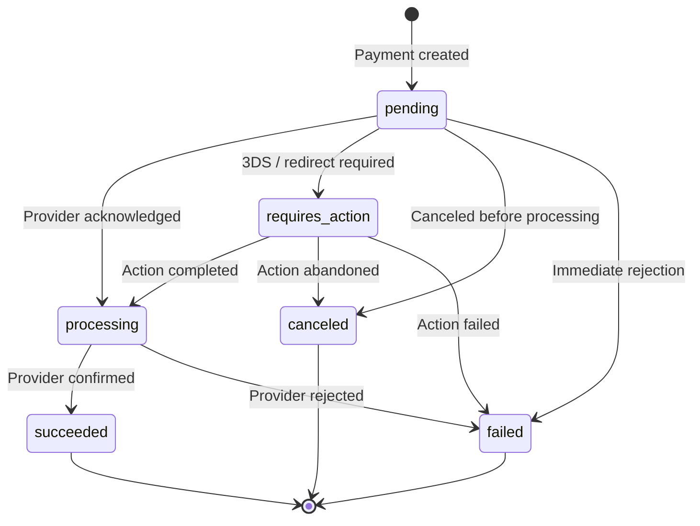
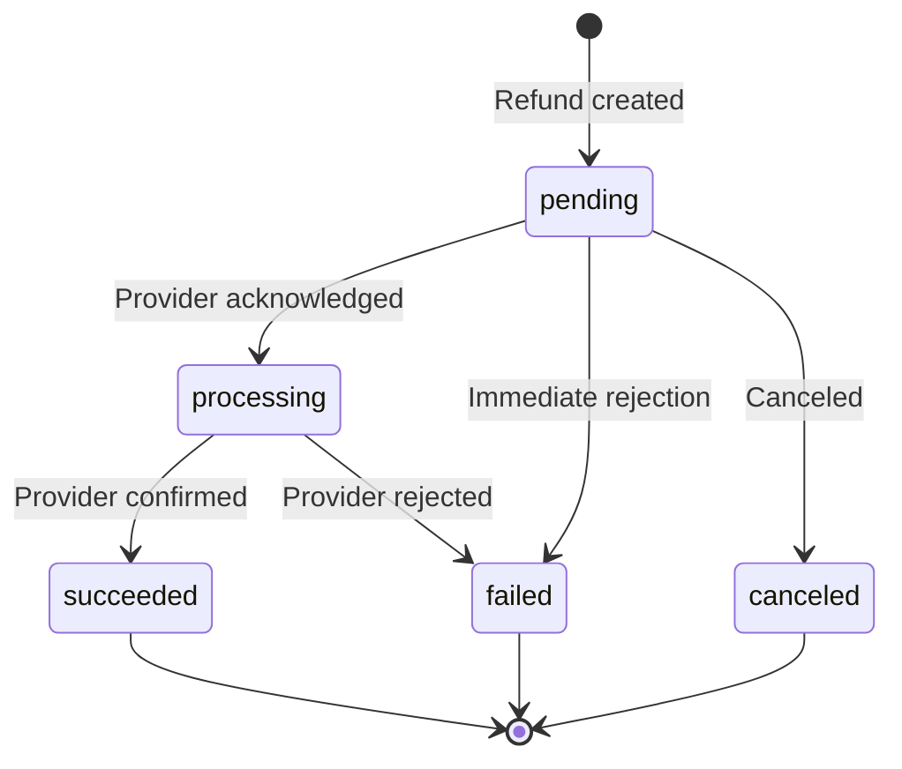
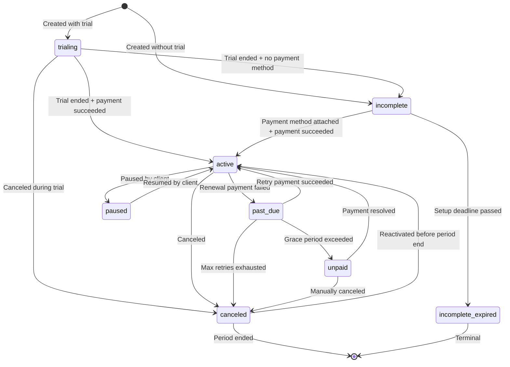
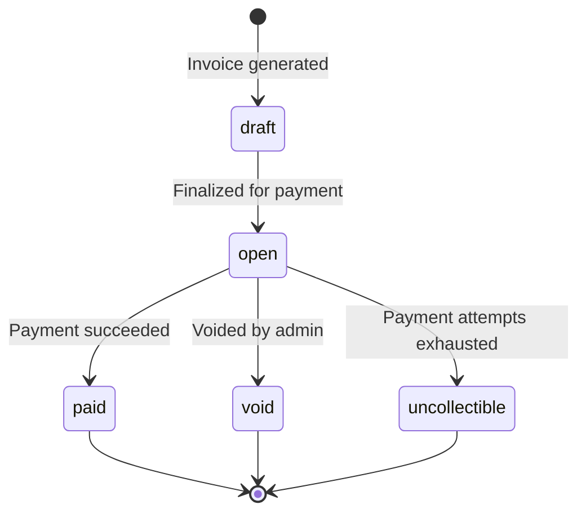
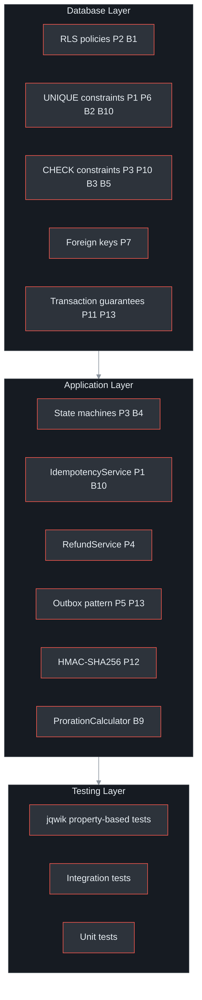

# Correctness Invariants

The Payment Gateway Platform defines **23 formal correctness properties** that must hold at all times. These properties serve as design contracts, test oracles, audit criteria, and incident analysis tools. Every code change must preserve these invariants; violations indicate bugs or security issues.

## At a Glance

| Attribute | Detail |
|---|---|
| **Payment Service invariants** | 13 (P1 -- P13) |
| **Billing Service invariants** | 10 (B1 -- B10) |
| **Verification framework** | jqwik (Java QuickCheck) property-based testing |
| **Enforcement layers** | Database constraints, application logic, integration tests |
| **Notation** | Semi-formal (universal/existential quantifiers, logical connectives) |
| **Amount representation (PS)** | `DECIMAL(19,4)` Rands with `BigDecimal` |
| **Amount representation (BS)** | `INTEGER` cents |
| **Tenant isolation** | PostgreSQL Row-Level Security in both services |

(docs/shared/correctness-properties.md:1-47)

---

## Notation Reference

| Symbol | Meaning |
|---|---|
| `\forall` | For all |
| `\exists` | There exists |
| `\exists!` | There exists exactly one |
| `\Rightarrow` | Implies |
| `\wedge` | Logical AND |
| `\vee` | Logical OR |
| `\cap` | Intersection |
| `\emptyset` | Empty set |

(docs/shared/correctness-properties.md:36-47)

---

## Payment Service Invariants (P1 -- P13)

### P1: Payment Idempotency

For any two payment requests with the same idempotency key, tenant, and parameters, the result is identical and the payment is created exactly once.

```
forall p1, p2 in Payments:
  (p1.idempotencyKey = p2.idempotencyKey AND
   p1.tenantId = p2.tenantId AND
   params(p1) = params(p2))
  => result(p1) = result(p2) AND sideEffectsCount = 1
```

| Layer | Mechanism |
|---|---|
| **DB** | UNIQUE constraint on `(tenant_id, key)` in `idempotency_keys` |
| **Application** | `IdempotencyService` checks Redis cache, then PostgreSQL fallback |
| **Test** | Submit same request twice, assert same response and single DB record |

(docs/shared/correctness-properties.md:52-69)

### P2: Tenant Isolation

No operation on behalf of one tenant can read, modify, or produce data belonging to another tenant.

| Layer | Mechanism |
|---|---|
| **DB** | PostgreSQL RLS: `USING (tenant_id = current_setting('app.current_tenant_id')::uuid)` |
| **Application** | `TenantContext` ThreadLocal set by `ApiKeyAuthFilter`; `SET LOCAL` on every connection |
| **Test** | Create data as tenant A, query as tenant B, assert empty results |

(docs/shared/correctness-properties.md:74-87)

### P3: Payment Status Transitions

Payment status changes follow a well-defined state machine. No invalid transition is allowed.

```
Valid transitions:
  pending       -> {processing, requires_action, canceled, failed}
  requires_action -> {processing, canceled, failed}
  processing    -> {succeeded, failed}
  succeeded     -> terminal
  failed        -> terminal
  canceled      -> terminal
```

| Layer | Mechanism |
|---|---|
| **Application** | `PaymentStatus.canTransitionTo(newStatus)` validates before update |
| **DB** | `CHECK` constraint on status column |
| **Test** | Enumerate all status pairs, assert only valid transitions succeed |

(docs/shared/correctness-properties.md:93-113, docs/payment-service/payment-flow-diagrams.md:584-603)

### P4: Refund Amount Constraint

The total refunded amount (including in-flight refunds) never exceeds the original payment amount.

```
forall payment in Payments:
  SUM(refunds WHERE paymentId = payment.id AND status IN {processing, succeeded}).amount
    <= payment.amount
```

| Layer | Mechanism |
|---|---|
| **Application** | `RefundService.calculateRefundableAmount()` checks before creating refund |
| **DB** | Validated within transaction (`SELECT SUM` + `INSERT` atomically) |
| **Test** | Property-based: random payment amounts and refund sequences, assert invariant holds |

(docs/shared/correctness-properties.md:119-131, docs/payment-service/architecture-design.md:342-345)

### P5: Webhook Delivery Guarantee

For every payment that reaches a terminal state, at least one webhook delivery attempt is enqueued.

| Layer | Mechanism |
|---|---|
| **Application** | Status update and outbox event INSERT in the same database transaction |
| **Outbox** | `OutboxPoller` reads unpublished events and enqueues delivery |
| **Test** | Complete payment, assert `outbox_events` and `webhook_logs` entries exist |

(docs/shared/correctness-properties.md:137-150)

### P6: Provider Payment ID Uniqueness

Provider-assigned payment identifiers are unique within a given provider. No two distinct payment records reference the same provider transaction.

| Layer | Mechanism |
|---|---|
| **DB** | UNIQUE index on `(provider, provider_payment_id)` WHERE NOT NULL |
| **Application** | Webhook deduplication by `provider_payment_id + event_type` |

(docs/shared/correctness-properties.md:156-171)

### P7: Payment Method Ownership

Every payment method belongs to exactly one tenant. No orphaned or shared payment methods exist.

| Layer | Mechanism |
|---|---|
| **DB** | `NOT NULL` foreign key `tenant_id -> tenants(id)` + RLS |
| **Test** | Attempt insert with invalid `tenant_id`, assert FK violation |

(docs/shared/correctness-properties.md:177-188)

### P8: Webhook Retry Exponential Backoff

Webhook retry delays follow exponential backoff. Each retry waits at least twice as long as the previous.

```
forall delivery in WebhookDeliveries:
  (delivery.attemptNumber > 1) =>
  delivery.nextRetryAt >= delivery.attemptedAt + baseDelay * 2^(attemptNumber - 2)
```

| Layer | Mechanism |
|---|---|
| **Application** | `WebhookWorker` calculates `nextRetryAt` using configurable backoff multiplier |
| **Test** | Verify delay sequence for attempts 1..N |

(docs/shared/correctness-properties.md:194-207)

### P9: Idempotency Key Expiration

Idempotency keys expire after 24 hours, after which the same key may be reused for a new request.

| Layer | Mechanism |
|---|---|
| **DB** | `expires_at` column with default `NOW() + INTERVAL '24 hours'` |
| **Application** | `CleanupJob` deletes expired keys daily |
| **Test** | Create key, advance time 25h, assert key no longer blocks new request |

(docs/shared/correctness-properties.md:213-225, docs/payment-service/architecture-design.md:413-419)

### P10: Monetary Precision

All monetary amounts in the Payment Service use `DECIMAL(19,4)` (Rands) with exact arithmetic. Floating-point types are never used for monetary calculations.

| Layer | Mechanism |
|---|---|
| **DB** | `DECIMAL(19,4)` column type with `CHECK (amount > 0)` |
| **Application** | `BigDecimal` with explicit `RoundingMode` for all monetary operations |
| **Test** | Property-based: random arithmetic operations, assert no precision loss |

(docs/shared/correctness-properties.md:231-248)

### P11: Payment Creation Atomicity

Payment creation either fully succeeds (record + provider call + status + outbox event in the same transaction) or fully rolls back with no side effects.

| Layer | Mechanism |
|---|---|
| **Application** | `@Transactional` on `createPayment()`; outbox INSERT in same transaction |
| **DB** | PostgreSQL transaction guarantees |
| **Test** | Simulate provider failure mid-transaction, assert no orphaned records |

(docs/shared/correctness-properties.md:254-267)

### P12: Webhook Signature Integrity

Webhook signatures are cryptographically verified using HMAC-SHA256 with constant-time comparison, preventing both tampering and timing attacks.

| Layer | Mechanism |
|---|---|
| **Application** | `MessageDigest.isEqual()` for constant-time comparison |
| **SPI** | `WebhookVerifier` interface; each provider implements its own verification |
| **Test** | Verify valid signature -> true, tampered payload -> false, wrong secret -> false |

(docs/shared/correctness-properties.md:274-286)

### P13: Transactional Outbox Guarantee

For every domain state change, an outbox event is persisted within the same database transaction. The `OutboxPoller` guarantees at-least-once publishing to the message broker.

| Layer | Mechanism |
|---|---|
| **DB** | `outbox_events` table with `published_at IS NULL` filter for pending events |
| **Application** | Domain service persists outbox event in same `@Transactional` method |
| **OutboxPoller** | Scheduled job reads unpublished events, publishes, marks `published_at` |
| **Test** | Commit domain change with broker down, assert outbox event persisted, start broker, assert event eventually published |

(docs/shared/correctness-properties.md:292-312)

---

## Payment Status State Machine


<!-- Sources: docs/payment-service/payment-flow-diagrams.md:584-603, docs/shared/correctness-properties.md:94-104 -->

---

## Refund Status State Machine


<!-- Sources: docs/payment-service/payment-flow-diagrams.md:620-634 -->

---

## Billing Service Invariants (B1 -- B10)

### B1: Tenant Isolation (Billing)

Identical guarantee to P2, enforced via `app.current_service_tenant_id` RLS variable on the Billing Service database.

| Layer | Mechanism |
|---|---|
| **DB** | RLS on 9 tables using `current_setting('app.current_service_tenant_id')::uuid` |
| **Application** | `TenantContext` set by `ApiKeyAuthenticationFilter` |
| **Test** | Create subscription as tenant A, query as tenant B, assert 404 |

(docs/shared/correctness-properties.md:320-334)

### B2: Subscription Uniqueness

Each customer has at most one active-family subscription per tenant, preventing duplicate billing.

| Layer | Mechanism |
|---|---|
| **DB** | Partial unique index on `(service_tenant_id, external_customer_id)` WHERE status NOT IN terminal states |
| **Application** | `SubscriptionService` checks for existing active subscription before creation |
| **Test** | Attempt second subscription for same customer, assert 409; cancel first, create new, assert success |

(docs/shared/correctness-properties.md:340-356)

### B3: Coupon Discount Bounds

A coupon discount never exceeds the plan price (no negative invoices) and is always non-negative.

```
Percent: discount = price_cents * discount_value / 100, clamped to [0, price_cents]
Fixed:   discount = MIN(discount_value, price_cents)
```

| Layer | Mechanism |
|---|---|
| **DB** | `CHECK (discount_value > 0)`, `CHECK (discount_value BETWEEN 1 AND 100)` for percent |
| **Application** | `InvoiceService.calculateDiscount()` clamps result to `[0, price_cents]` |
| **Test** | Property-based: random `(discountValue, priceCents)` pairs, assert `0 <= discount <= priceCents` |

(docs/shared/correctness-properties.md:362-379)

### B4: Subscription Status Transitions

Subscription status changes follow a well-defined state machine.

```
Valid transitions:
  trialing           -> {active, incomplete, canceled}
  incomplete         -> {active, incomplete_expired}
  active             -> {past_due, canceled, paused}
  past_due           -> {active, canceled, unpaid}
  paused             -> {active}
  unpaid             -> {active, canceled}
  canceled           -> {active}  (reactivation before period end only)
  incomplete_expired -> terminal
```

| Layer | Mechanism |
|---|---|
| **Application** | `SubscriptionStatus.canTransitionTo(newStatus)` validates before update |
| **Test** | Enumerate all status pairs, assert only valid transitions succeed |

(docs/shared/correctness-properties.md:385-404, docs/billing-service/billing-flow-diagrams.md:826-854)

### B5: Invoice Amount Invariants

Invoice amounts are always non-negative, paid amount never exceeds total, and due amount is correctly derived.

```
forall invoice in Invoices:
  amount_cents >= 0
  amount_due_cents >= 0
  amount_paid_cents >= 0
  amount_paid_cents <= amount_cents
  amount_due_cents = amount_cents - amount_paid_cents
```

| Layer | Mechanism |
|---|---|
| **DB** | `CHECK (amount_cents >= 0)`, `CHECK (amount_due_cents >= 0)`, `CHECK (amount_paid_cents >= 0)` |
| **Application** | `InvoiceService` recalculates `amount_due_cents` on every payment update |
| **Test** | Property-based: random invoice/payment sequences, assert invariant holds |

(docs/shared/correctness-properties.md:410-426)

### B6: API Key Security

API keys are delivered exactly once as plaintext, then stored only as a BCrypt hash. The hash is computationally irreversible.

| Layer | Mechanism |
|---|---|
| **Application** | `ClientService.registerClient()` / `rotateApiKey()` returns plaintext once; stores hash only |
| **DB** | `key_hash` column -- no plaintext column exists |
| **Test** | Generate key, verify BCrypt cost >= 12, verify original -> true, random -> false |

(docs/shared/correctness-properties.md:432-447)

### B7: Payment Consistency (Invoice-Payment Linkage)

An invoice is marked `paid` only when a corresponding payment in the Payment Service has succeeded.

| Layer | Mechanism |
|---|---|
| **Application** | `InvoiceService.markPaid()` only called from Payment Service webhook handler (`payment.succeeded`) |
| **Integration** | Billing Service verifies payment status via Payment Service API before marking paid |
| **Test** | Mock Payment Service failure, assert invoice remains `open` |

(docs/shared/correctness-properties.md:453-468)

### B8: Webhook Retry Bounds

Webhook deliveries never exceed the maximum retry count. After exhausting retries, the delivery is terminal.

| Layer | Mechanism |
|---|---|
| **Application** | `WebhookWorker` checks `attemptCount > MAX_RETRIES` before scheduling retry |
| **Test** | Simulate MAX_RETRIES failures, assert status = `failed` and no further retries scheduled |

(docs/shared/correctness-properties.md:474-486)

### B9: Proration Correctness

Proration calculations produce correct directional results: upgrades charge more, downgrades credit, same-price changes net zero.

```
forall planChange(subscription, oldPlan, newPlan, changeDate):
  credit >= 0 AND charge >= 0
  (newPlan.price > oldPlan.price) => netCharge > 0
  (newPlan.price < oldPlan.price) => netCharge < 0
  (newPlan.price = oldPlan.price) => netCharge = 0
```

| Layer | Mechanism |
|---|---|
| **Application** | `ProrationCalculator.calculate()` with `BigDecimal` and `HALF_UP` rounding |
| **Test** | Property-based: random (oldPrice, newPrice, totalDays, remainingDays), assert directional correctness |

(docs/shared/correctness-properties.md:492-511, docs/billing-service/architecture-design.md:612-637)

### B10: Idempotency (Billing)

Same guarantee as P1, applied to Billing Service operations. Uses `app.current_service_tenant_id` scoping.

| Layer | Mechanism |
|---|---|
| **DB** | Composite primary key `(service_tenant_id, key)` in `idempotency_keys` (tenant-scoped) |
| **Application** | `IdempotencyService` checks before processing |
| **Test** | Property-based: submit same billing request twice, assert same response |

(docs/shared/correctness-properties.md:517-531)

---

## Subscription Status State Machine


<!-- Sources: docs/billing-service/billing-flow-diagrams.md:826-854, docs/shared/correctness-properties.md:385-399 -->

**Subscription state characteristics:**

| Status | Billable | Access | Renewable |
|---|---|---|---|
| `trialing` | No | Yes | N/A |
| `incomplete` | No | No | N/A |
| `active` | Yes | Yes | Yes |
| `past_due` | Retrying | Configurable | Retrying |
| `paused` | No | Configurable | No |
| `unpaid` | No | No | No |
| `canceled` | No | Until period end | No |
| `incomplete_expired` | No | No | Terminal |

(docs/billing-service/billing-flow-diagrams.md:858-867)

---

## Invoice Status State Machine


<!-- Sources: docs/billing-service/billing-flow-diagrams.md:873-886 -->

---

## Invariant Enforcement Summary

The following diagram shows how invariants are enforced across the three layers: database, application, and testing.


<!-- Sources: docs/shared/correctness-properties.md:52-531 -->

---

## Property-Based Testing with jqwik

All invariants are verified with [jqwik](https://jqwik.net/) (Java QuickCheck), which generates random inputs to find edge cases that manual tests miss.

### Payment Service Properties

```java
@Property
void paymentAmountAlwaysPositive(
        @ForAll @BigRange(min = "0.01", max = "999999.99") BigDecimal amount) {
    // P10: All monetary amounts are positive DECIMAL(19,4)
    assertThat(amount).isPositive();
    CreatePaymentRequest request = new CreatePaymentRequest(amount, "ZAR", "CARD");
}

@Property
void refundNeverExceedsPaymentAmount(
        @ForAll @BigRange(min = "0.01", max = "9999.99") BigDecimal paymentAmount,
        @ForAll @BigRange(min = "0.01", max = "9999.99") BigDecimal refundAmount) {
    // P4: Refund amount constraint
    if (refundAmount.compareTo(paymentAmount) > 0) {
        assertThrows(RefundExceedsAmountException.class, () ->
            refundService.createRefund(paymentId, refundAmount));
    }
}

@Property
void idempotencyKeyReturnsConsistentResults(
        @ForAll("validPaymentRequests") CreatePaymentRequest request) {
    // P1: Payment idempotency
    PaymentResponse r1 = paymentService.createPayment(tenantId, request);
    PaymentResponse r2 = paymentService.createPayment(tenantId, request);
    assertThat(r1.getId()).isEqualTo(r2.getId());
    assertThat(r1.getStatus()).isEqualTo(r2.getStatus());
}
```

(docs/shared/correctness-properties.md:630-658)

### Billing Service Properties

```java
@Property
void couponDiscountNeverExceedsPlanPrice(
        @ForAll @IntRange(min = 1, max = 100) int discountPercent,
        @ForAll @IntRange(min = 1, max = 999999) int priceCents) {
    // B3: Coupon discount bounds
    int discount = priceCents * discountPercent / 100;
    assertThat(discount).isBetween(0, priceCents);
}

@Property
void prorationDirectionallyCorrect(
        @ForAll @IntRange(min = 100, max = 99999) int oldPrice,
        @ForAll @IntRange(min = 100, max = 99999) int newPrice,
        @ForAll @IntRange(min = 1, max = 365) int totalDays,
        @ForAll @IntRange(min = 1) int remainingDays) {
    // B9: Proration correctness
    Assume.that(remainingDays <= totalDays);
    ProrationResult result = ProrationCalculator.calculate(
        oldPrice, newPrice, totalDays, remainingDays);
    if (newPrice > oldPrice) assertThat(result.netCharge()).isPositive();
    else if (newPrice < oldPrice) assertThat(result.netCharge()).isNegative();
    else assertThat(result.netCharge()).isZero();
}

@Property
void invoiceAmountsAlwaysConsistent(
        @ForAll @IntRange(min = 0, max = 999999) int amountCents,
        @ForAll @IntRange(min = 0) int amountPaidCents) {
    // B5: Invoice amount invariants
    Assume.that(amountPaidCents <= amountCents);
    int amountDueCents = amountCents - amountPaidCents;
    assertThat(amountDueCents).isGreaterThanOrEqualTo(0);
    assertThat(amountPaidCents).isLessThanOrEqualTo(amountCents);
}
```

(docs/shared/correctness-properties.md:663-727)

### Cross-Service Properties

```java
@Property
void centToRandRoundTrip(@ForAll @IntRange(min = 1, max = 99999999) int cents) {
    // X1: Amount unit conversion round-trip
    BigDecimal rands = BigDecimal.valueOf(cents)
        .divide(BigDecimal.valueOf(100), 4, RoundingMode.HALF_UP);
    int backToCents = rands.multiply(BigDecimal.valueOf(100))
        .setScale(0, RoundingMode.HALF_UP)
        .intValueExact();
    assertThat(backToCents).isEqualTo(cents);
}
```

(docs/shared/correctness-properties.md:732-742)

---

## Formal Specifications

### createPayment (Payment Service)

| Aspect | Specification |
|---|---|
| **Preconditions** | Valid active tenant, `amount > 0`, currency = `ZAR`, valid payment method, non-empty idempotency key, valid HTTPS return URL |
| **Success postconditions** | Payment record created (`pending`/`pending_redirect`), provider called via SPI, `payment_events` record created, outbox event persisted, idempotency key stored (TTL 24h) |
| **Idempotent replay** | Same key + same params -> cached response (no new side effects) |
| **Conflict** | Same key + different params -> `IdempotencyConflictException` |
| **Failure** | Full rollback: no payment record, no outbox event |

(docs/shared/correctness-properties.md:749-777)

### createSubscription (Billing Service)

| Aspect | Specification |
|---|---|
| **Preconditions** | Valid active service tenant, non-empty `externalCustomerId`, valid active plan, no existing active subscription for customer |
| **Success postconditions** | Subscription created (`trialing` if trial, `incomplete` otherwise), Payment Service customer created, coupon applied if provided, audit log entry, outbox event persisted |
| **Failure** | Full rollback: no subscription, no coupon redemption, no outbox event |

(docs/shared/correctness-properties.md:782-807)

---

## Related Pages

| Page | Relevance |
|---|---|
| [Platform Overview](../01-getting-started/platform-overview) | System context and service boundaries |
| [Payment Service Architecture](../02-architecture/payment-service/) | State machines, SPI contract, circuit breaker config |
| [Billing Service Architecture](../02-architecture/billing-service/) | Proration logic, scheduled jobs, webhook handling |
| [Inter-Service Communication](../02-architecture/inter-service-communication) | Outbox pattern, event delivery guarantees |
| [Event System](../02-architecture/event-system) | CloudEvents schema, DLQ patterns |
| [Security and Compliance](./security-compliance/) | Encryption, RLS, POPIA, PCI DSS |
| [Data Flows](./data-flows/) | End-to-end payment and subscription flows |
| [Provider Integrations](./provider-integrations) | SPI contract, webhook verification |
