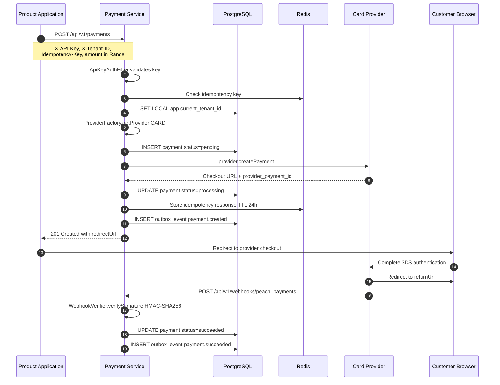
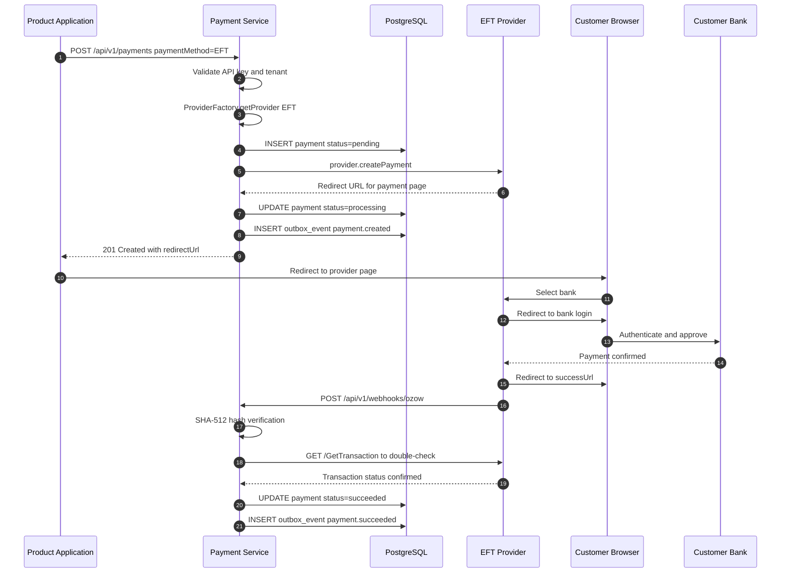
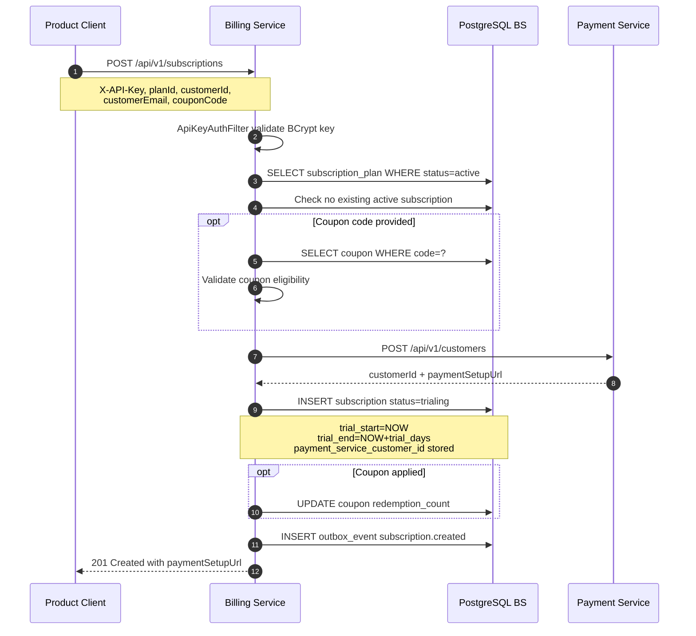
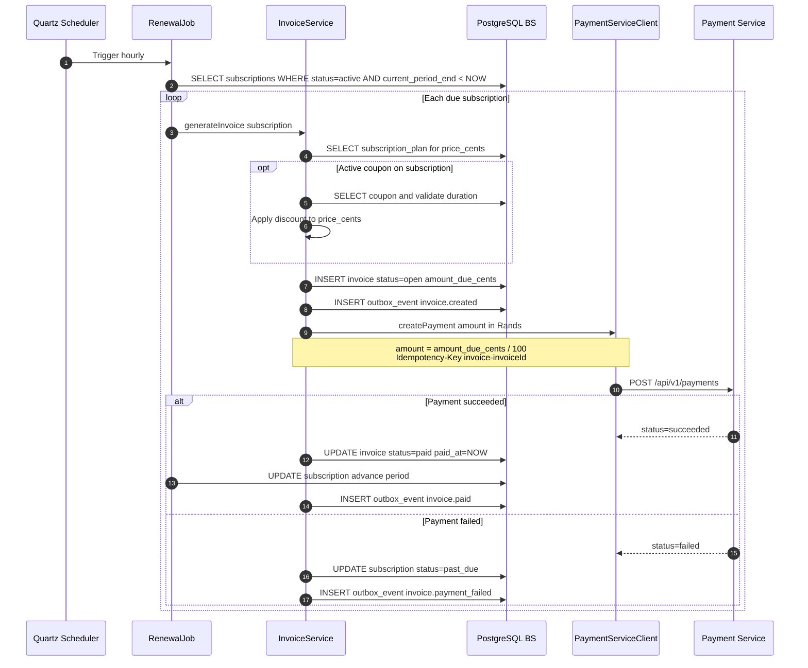
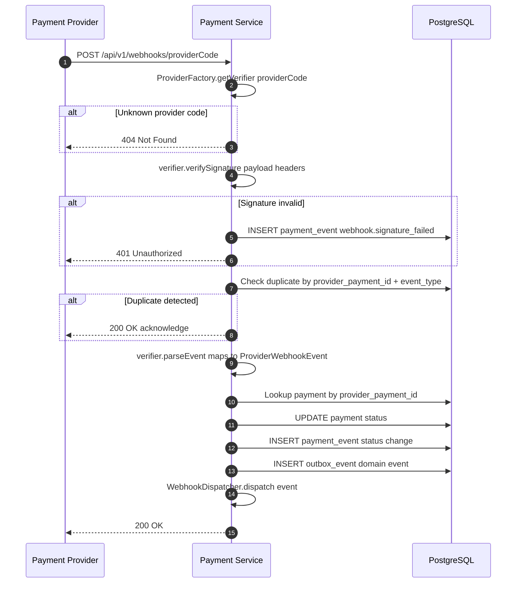
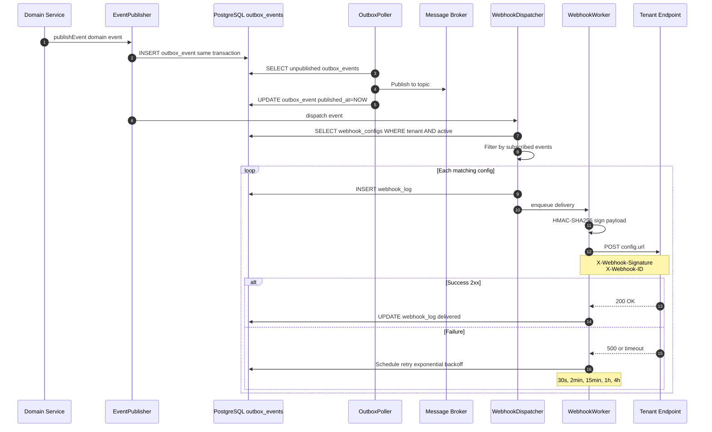
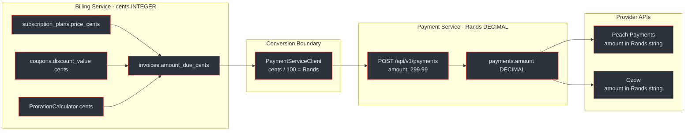
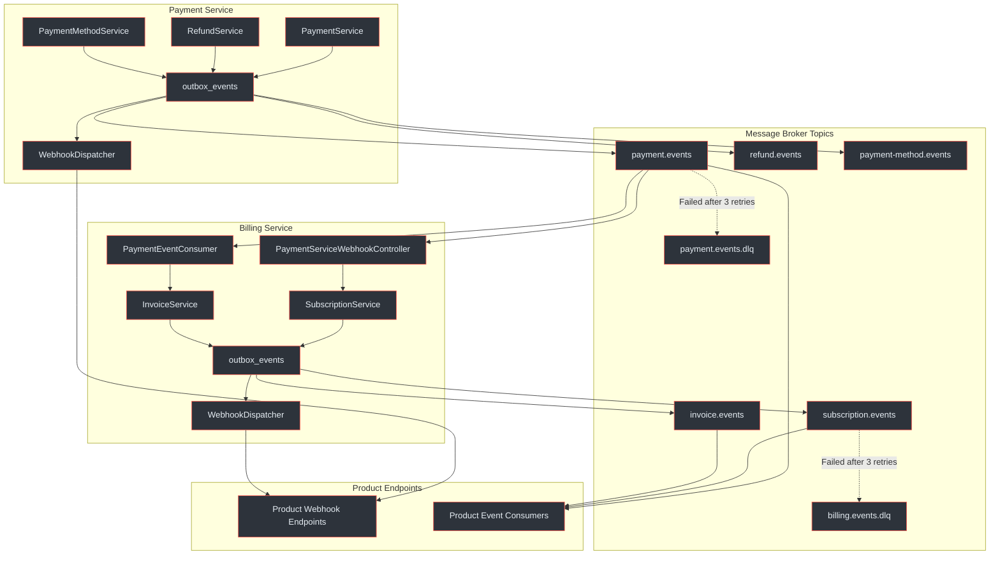

# Data Flows Overview

This page maps the six primary data flows through the Payment Gateway Platform, showing how requests propagate from product applications through the Billing Service and Payment Service to external providers and back.

## At a Glance

| Flow | Initiator | Services Involved | Provider | Sync/Async | Key Boundary |
|------|-----------|-------------------|----------|------------|--------------|
| One-time card payment | Product | PS | Card (e.g. Peach Payments) | Redirect + async webhook | Rands to cents at PS API |
| EFT payment via Ozow | Product | PS | EFT (e.g. Ozow) | Redirect + async webhook | Rands to cents at PS API |
| Subscription creation | Product | BS, PS | Card (tokenisation) | Sync REST | BS delegates to PS |
| Recurring billing | Quartz RenewalJob | BS, PS | Card (token charge) | Sync REST | Cents to Rands at BS PaymentServiceClient |
| Provider webhook processing | Provider | PS | N/A (inbound) | Async POST | Provider format to domain model |
| Outgoing webhook dispatch | OutboxPoller | PS or BS | N/A (outbound) | Async POST | Domain event to webhook payload |

---

## Flow 1: One-Time Card Payment

A product application initiates a card payment. The Payment Service resolves the card provider via `ProviderFactory`, creates a payment record, and returns a redirect URL for 3D Secure authentication. The provider notifies completion asynchronously via webhook.

<!-- Sources: docs/payment-service/payment-flow-diagrams.md (lines 34-90), docs/payment-service/architecture-design.md (lines 264-296), docs/shared/integration-guide.md (lines 259-309) -->

**Key details:**

- The `amount` field in the API request is a `DECIMAL` in **Rands** (e.g. `299.99`) (`docs/shared/integration-guide.md:272`)
- Internally the Payment Service stores amounts as `DECIMAL` on the `payments` table (`docs/payment-service/architecture-design.md:672`)
- The `ProviderFactory` resolves the correct adapter via `getProvider(paymentMethod=CARD)` (`docs/payment-service/architecture-design.md:278`)
- Idempotency is enforced via Redis + PostgreSQL dual-layer caching with 24h TTL (`docs/payment-service/architecture-design.md:413-419`)
- All outbox events are written in the same transaction as the domain change (`docs/payment-service/architecture-design.md:320`)

---

## Flow 2: EFT Payment via Ozow

EFT payments follow a similar redirect pattern but route through the EFT provider. The customer selects their bank, authenticates via online banking, and the provider confirms asynchronously. Ozow uses SHA-512 hash verification instead of HMAC-SHA256.

<!-- Sources: docs/payment-service/payment-flow-diagrams.md (lines 100-156), docs/payment-service/payment-flow-diagrams.md (lines 377-424) -->

**EFT-specific safeguards:**

- Ozow webhooks arrive as `application/x-www-form-urlencoded` rather than JSON (`docs/payment-service/payment-flow-diagrams.md:389`)
- The Payment Service performs a secondary API verification (`GET /GetTransaction`) to prevent spoofed callbacks (`docs/payment-service/payment-flow-diagrams.md:144-146`)
- EFT providers do not support tokenisation or recurring payments (`docs/shared/integration-guide.md:335`)

---

## Flow 3: Subscription Creation

The Billing Service orchestrates subscription creation. It creates a customer record in the Payment Service, persists the subscription, and returns a `paymentSetupUrl` for the customer to attach a payment method.

<!-- Sources: docs/billing-service/billing-flow-diagrams.md (lines 36-90), docs/billing-service/architecture-design.md (lines 286-296), docs/billing-service/database-schema-design.md (lines 430-483) -->

**Subscription creation notes:**

- A partial unique index enforces one active subscription per customer per tenant (`docs/billing-service/database-schema-design.md:458-460`)
- The `payment_service_customer_id` links the BS subscription to the PS customer record (`docs/billing-service/database-schema-design.md:464-465`)
- Plans with `trial_days > 0` start as `trialing`; plans with `trial_days = 0` start as `incomplete` (`docs/billing-service/billing-flow-diagrams.md:33,96`)
- Coupon validation checks: active status, expiry, redemption limit, and plan-scope (`docs/billing-service/architecture-design.md:376-383`)

---

## Flow 4: Recurring Billing / Renewal

The `RenewalJob` (Quartz, hourly) finds active subscriptions past their `current_period_end`. It delegates to `InvoiceService` for invoice generation, which calls the Payment Service via `PaymentServiceClient` using the stored token.

<!-- Sources: docs/billing-service/billing-flow-diagrams.md (lines 154-210), docs/billing-service/architecture-design.md (lines 466-498), docs/billing-service/database-schema-design.md (lines 505-559) -->

**Currency conversion boundary:**

The Billing Service stores all monetary amounts in **cents** (`INTEGER`) internally. When calling the Payment Service, the `PaymentServiceClient` converts cents to Rands (`amount_due_cents / 100`) because the Payment Service API accepts `DECIMAL` amounts in Rands (`docs/billing-service/billing-flow-diagrams.md:189`, `docs/billing-service/architecture-design.md:484`).

---

## Flow 5: Provider Webhook Processing

External providers POST webhook notifications to `ProviderWebhookController`. The controller resolves the correct `WebhookVerifier` via `ProviderFactory`, validates the signature, maps the provider payload to a domain event, and updates the payment status.

<!-- Sources: docs/payment-service/payment-flow-diagrams.md (lines 276-318), docs/payment-service/architecture-design.md (lines 246-258), docs/payment-service/payment-flow-diagrams.md (lines 322-373) -->

**Provider-specific verification:**

| Provider | Verification Method | Reference |
|----------|-------------------|-----------|
| Peach Payments (card) | HMAC-SHA256 with `X-Signature` header | `docs/payment-service/payment-flow-diagrams.md:336-337` |
| Ozow (EFT) | SHA-512 hash of concatenated fields + private key | `docs/payment-service/payment-flow-diagrams.md:392-393` |

---

## Flow 6: Outgoing Webhook Dispatch

After any domain event is persisted, the `EventPublisher` writes an `outbox_event` in the same transaction. The `OutboxPoller` publishes events to the message broker. The `WebhookDispatcher` finds matching webhook configurations and enqueues deliveries to the `WebhookWorker`, which signs and POSTs to tenant endpoints with exponential backoff.

<!-- Sources: docs/payment-service/payment-flow-diagrams.md (lines 432-474), docs/shared/system-architecture.md (lines 256-330), docs/billing-service/architecture-design.md (lines 692-708) -->

**Retry schedule:**

| Attempt | Delay | Cumulative |
|---------|-------|------------|
| 1 | 30 seconds | 30s |
| 2 | 2 minutes | ~2.5 min |
| 3 | 15 minutes | ~17.5 min |
| 4 | 1 hour | ~1h 17min |
| 5 | 4 hours | ~5h 17min |
| After 5 | Permanently failed | ~5.5 h total |

After 10 consecutive failures across deliveries, the webhook config is auto-disabled (`status=failing`) (`docs/billing-service/billing-flow-diagrams.md:741-744`).

---

## Data Transformation Boundary Map

Monetary amounts cross a critical transformation boundary between the Billing Service (which stores cents as `INTEGER`) and the Payment Service API (which accepts Rands as `DECIMAL`). The diagram below maps where conversions occur.

<!-- Sources: docs/billing-service/database-schema-design.md (lines 29, 510-514), docs/billing-service/architecture-design.md (lines 484-494), docs/payment-service/architecture-design.md (lines 672) -->

**Conversion rules:**

| Direction | From | To | Formula | Location |
|-----------|------|----|---------|----------|
| BS to PS | `amount_due_cents` (INTEGER) | `amount` (DECIMAL Rands) | `cents / 100` | `PaymentServiceClient.createPayment` |
| PS to Provider | `amount` (DECIMAL Rands) | Provider-specific string | Provider adapter formats | `PeachMapper` / `OzowMapper` |
| Webhook payload | `amount` stored value | JSON field | Cents in BS webhooks, Rands in PS webhooks | `WebhookWorker` |

**Invariant:** No floating-point arithmetic is used for monetary calculations. The Billing Service operates exclusively in integer cents. The Payment Service stores amounts as `DECIMAL` (arbitrary precision). Conversion to Rands happens only at the `PaymentServiceClient` boundary (`docs/billing-service/architecture-design.md:484`).

---

## Event Flow Topology

All six flows converge on a shared event infrastructure. This diagram shows the complete event topology across both services.

<!-- Sources: docs/shared/system-architecture.md (lines 104-106, 169-192), docs/payment-service/architecture-design.md (lines 427-433), docs/billing-service/architecture-design.md (lines 711-720) -->

**Dual-path deduplication:** The Billing Service receives Payment Service events through both the message broker (`PaymentEventConsumer`) and HTTP webhook (`PaymentServiceWebhookController`). Deduplication uses the composite key `(payment_service_payment_id, event_type)` -- whichever path delivers first processes; the second is a no-op (`docs/billing-service/architecture-design.md:560-571`).

---

## Related Pages

| Page | Description |
|------|-------------|
| [Integration Quickstart](../../01-getting-started/integration-quickstart) | Step-by-step onboarding for product teams |
| [Payment Service Architecture](../../02-architecture/payment-service/) | Internal architecture, SPI contract, ER diagram |
| [Billing Service Architecture](../../02-architecture/billing-service/) | Service components, proration, scheduled jobs |
| [Inter-Service Communication](../../02-architecture/inter-service-communication) | REST contracts, circuit breaker, retry policies |
| [Event System](../../02-architecture/event-system) | Topics, CloudEvents schema, DLQ handling |
| [Subscription Lifecycle](./subscription-lifecycle) | Deep dive into subscription states, dunning, proration |
| [Provider Integrations](../provider-integrations) | Peach Payments and Ozow adapter details |
| [Authentication](../security-compliance/authentication) | API key models, HMAC signing, RLS |
| [Correctness Invariants](../correctness-invariants) | Formal properties and data integrity rules |
| [Observability](../observability) | Metrics, tracing, alerting rules |
