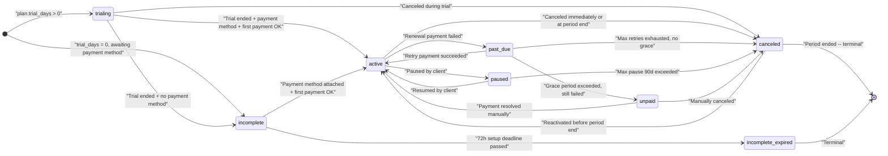
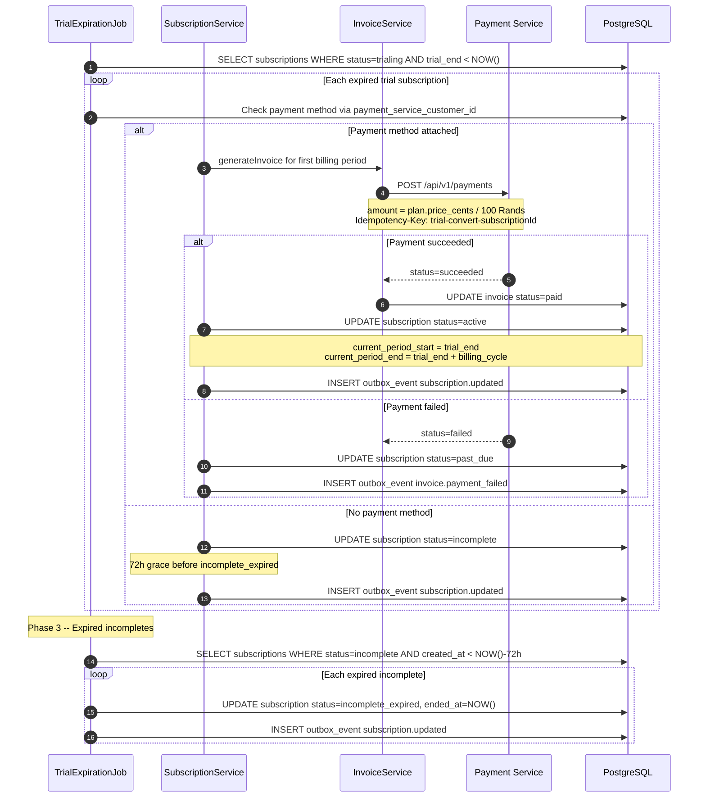
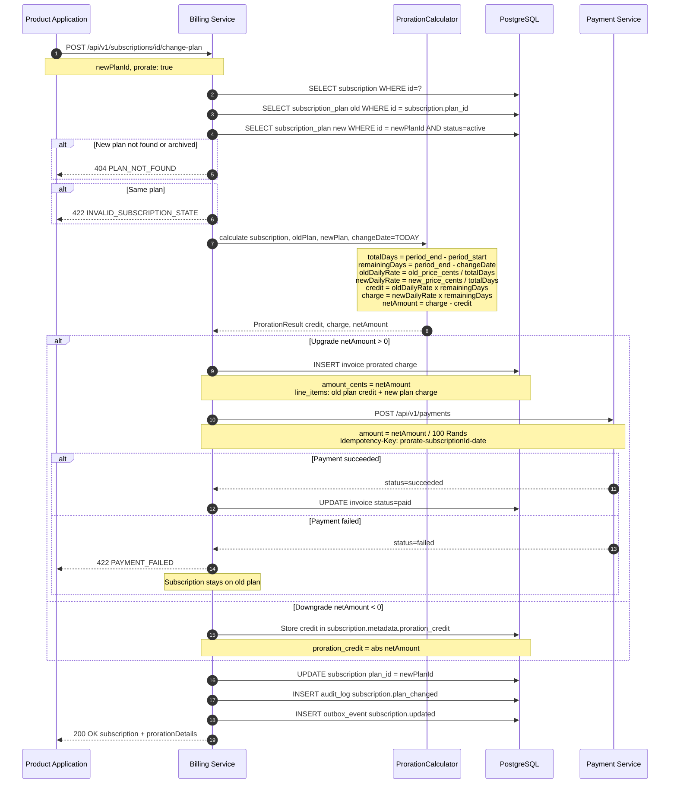
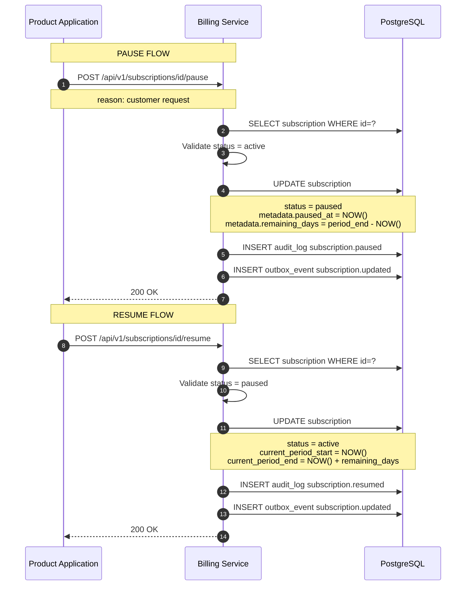
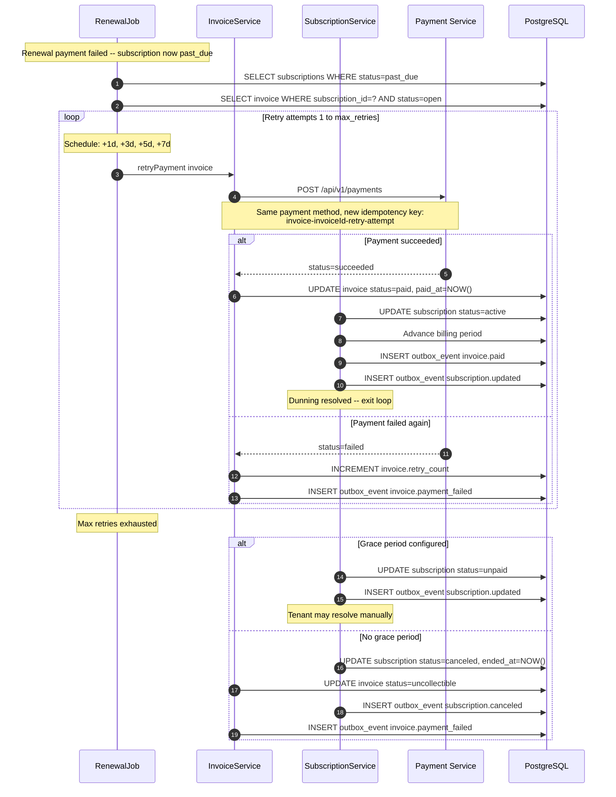
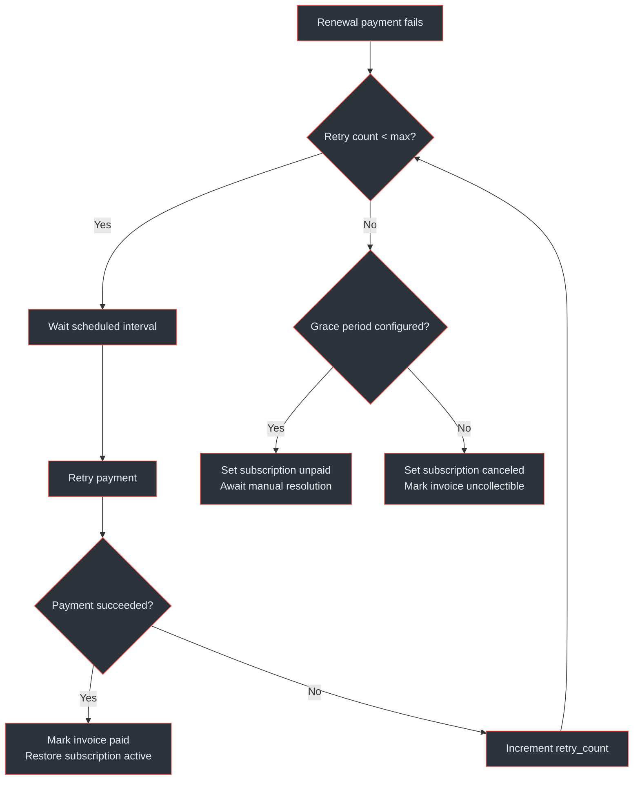
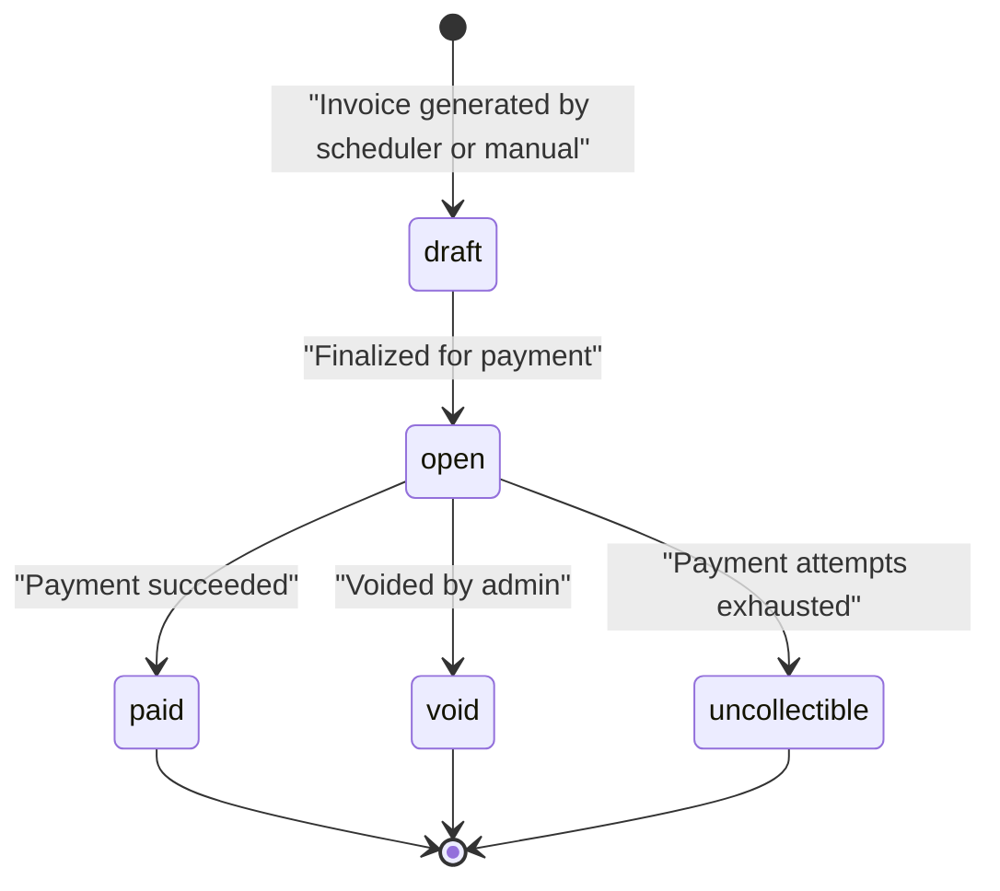

# Subscription Lifecycle

This page covers the full lifecycle of a subscription in the Billing Service -- from creation through trial, activation, plan changes, pause/resume, payment failure recovery, and eventual cancellation or expiry.

## At a Glance

| Aspect | Detail |
|--------|--------|
| States | `trialing`, `incomplete`, `active`, `past_due`, `paused`, `unpaid`, `canceled`, `incomplete_expired` |
| Trial management | Configurable per-plan `trial_days`; auto-convert on trial end via `TrialExpirationJob` (hourly) |
| Plan change | Upgrade charges immediately; downgrade credits at next renewal; `ProrationCalculator` handles mid-cycle math |
| Pause / resume | Max 90 days (configurable); remaining days stored in `metadata`; resume recalculates `current_period_end` |
| Dunning | Retry schedule +1d, +3d, +5d, +7d (3-5 retries configurable); transitions through `past_due` to `unpaid` or `canceled` |
| Coupons | `percent` or `fixed`; duration `once`, `repeating` (N months), `forever`; plan-scoped via join table |
| Invoice lifecycle | `draft` to `open` to `paid` / `void` / `uncollectible` |
| Currency | All amounts stored as `INTEGER` cents (`price_cents`, `amount_due_cents`); converted to Rands at Payment Service boundary |

---

## Subscription State Machine

The complete state machine governs every subscription from creation to termination. Eight states with well-defined transitions ensure predictable billing behaviour.



<!-- Sources: docs/billing-service/billing-flow-diagrams.md:821-854, docs/billing-service/architecture-design.md:298-329 -->

### State Characteristics

| Status | Billable | Feature Access | Renewable | Typical Duration |
|--------|----------|----------------|-----------|------------------|
| `trialing` | No | Yes | N/A | `plan.trial_days` (e.g. 14d) |
| `incomplete` | No | No | N/A | Up to 72 hours |
| `active` | Yes | Yes | Yes | Billing cycle (monthly/yearly) |
| `past_due` | Retrying | Configurable per tenant | Retrying | Up to ~16 days (retry schedule) |
| `paused` | No | Configurable per tenant | No | Up to 90 days (default max) |
| `unpaid` | No | No | No | Until manual resolution |
| `canceled` | No | Until `current_period_end` | No | Remainder of paid period |
| `incomplete_expired` | No | No | No | Terminal |

---

## Trial Management

Trials are configured at the plan level via `subscription_plans.trial_days` (`docs/billing-service/database-schema-design.md:95`). When a subscription is created against a plan with `trial_days > 0`, it enters `trialing` status.

### Trial Creation

On creation, the Billing Service sets (`docs/billing-service/billing-flow-diagrams.md:77-82`):

- `status = trialing`
- `trial_start = NOW()`
- `trial_end = NOW() + trial_days`
- `current_period_start = NOW()`
- `current_period_end = NOW() + trial_days`

No payment is collected during the trial. The product receives a `paymentSetupUrl` so the customer can attach a payment method in advance.

### Trial Expiration Flow

The `TrialExpirationJob` runs hourly and handles three phases (`docs/billing-service/architecture-design.md:655`):

1. **Pre-expiry notification** -- 3 days before `trial_end`, publishes `subscription.trial_ending` event
2. **Trial conversion** -- when `trial_end < NOW()`, attempts first charge if payment method is attached
3. **Incomplete cleanup** -- subscriptions stuck in `incomplete` for more than 72 hours transition to `incomplete_expired`



<!-- Sources: docs/billing-service/billing-flow-diagrams.md:220-277, docs/billing-service/architecture-design.md:649-656 -->

---

## Plan Change with Proration

Mid-cycle plan changes use the `ProrationCalculator` (`docs/billing-service/architecture-design.md:612-636`) to compute fair charges. The API endpoint is `POST /api/v1/subscriptions/{id}/change-plan` with body `{newPlanId, prorate: true}`.

### Proration Calculation

The calculator operates on integer cents throughout to avoid floating-point errors (`docs/billing-service/architecture-design.md:626-634`):

```
totalDays     = current_period_end - current_period_start
remainingDays = current_period_end - changeDate
oldDailyRate  = old_plan.price_cents / totalDays   (BigDecimal, HALF_UP, scale 4)
newDailyRate  = new_plan.price_cents / totalDays   (BigDecimal, HALF_UP, scale 4)
credit        = oldDailyRate * remainingDays
charge        = newDailyRate * remainingDays
netAmount     = charge - credit
```

| Scenario | netAmount | Behaviour |
|----------|-----------|-----------|
| Upgrade | `> 0` | Immediate prorated invoice + charge via Payment Service |
| Downgrade | `< 0` | Credit stored in `subscription.metadata.proration_credit`; deducted from next invoice |
| Same price | `= 0` | Plan updated, no financial transaction |

### Proration Sequence



<!-- Sources: docs/billing-service/billing-flow-diagrams.md:281-339, docs/billing-service/architecture-design.md:575-645 -->

### Proration Credit Tracking

Downgrade credits are stored in `subscription.metadata` (JSONB) under the `proration_credit` key (`docs/billing-service/architecture-design.md:639-645`). When the next invoice is generated, any accumulated credit is deducted from the invoice amount before payment. This is the v1 approach -- a formal `credits` ledger table is planned for v2 if requirements grow (partial credit usage, expiry, cross-subscription credits).

---

## Pause and Resume

Pausing preserves the subscription without collecting charges. The API endpoints are `POST /api/v1/subscriptions/{id}/pause` and `POST /api/v1/subscriptions/{id}/resume` (`docs/billing-service/billing-flow-diagrams.md:557-583`).

### Pause Mechanics

When paused:
- `status` changes to `paused`
- `metadata.paused_at = NOW()`
- `metadata.remaining_days = current_period_end - NOW()`
- The `RenewalJob` skips paused subscriptions entirely

### Resume Mechanics

When resumed:
- `status` changes to `active`
- `current_period_start = NOW()`
- `current_period_end = NOW() + remaining_days`
- Billing resumes from where it left off -- the customer does not lose paid time

### Max Pause Duration

Paused subscriptions have a configurable maximum of **90 days** (default). The `RenewalJob` includes a check (`docs/billing-service/architecture-design.md:282-283`): if `metadata.paused_at + max_pause_duration < NOW()`, the subscription is auto-canceled with reason `auto_canceled_max_pause_exceeded` and a `subscription.canceled` event is published.



<!-- Sources: docs/billing-service/billing-flow-diagrams.md:546-586, docs/billing-service/architecture-design.md:278-283 -->

---

## Cancellation Flows

Two cancellation modes are supported (`docs/billing-service/billing-flow-diagrams.md:457-542`):

### Cancel at Period End (Graceful)

`POST /api/v1/subscriptions/{id}/cancel` with `{cancelAtPeriodEnd: true, reason: "..."}`:

- Sets `cancel_at_period_end = true` and `canceled_at = NOW()`
- Subscription remains `active` with full feature access until `current_period_end`
- When the `RenewalJob` encounters this subscription at period end, it does **not** renew -- instead it sets `status = canceled` and `ended_at = NOW()`
- Valid from states: `active`, `trialing`, `past_due`

### Cancel Immediately

`POST /api/v1/subscriptions/{id}/cancel` with `{cancelAtPeriodEnd: false, reason: "..."}`:

- Sets `status = canceled`, `canceled_at = NOW()`, `ended_at = NOW()`
- All open invoices for this subscription are voided
- Valid from states: `active`, `trialing`, `past_due`, `paused`

### Reactivation

`POST /api/v1/subscriptions/{id}/reactivate` (`docs/billing-service/billing-flow-diagrams.md:515-542`):

- Only valid when `status = canceled` AND `cancel_at_period_end = true` AND `current_period_end > NOW()`
- Restores `status = active`, clears `cancel_at_period_end` and `canceled_at`
- Cannot reactivate an immediately-canceled subscription or one past its period end

---

## Dunning and Payment Retry

When a renewal payment fails, the subscription enters `past_due` and the dunning process begins (`docs/billing-service/billing-flow-diagrams.md:590-645`). The goal is to recover payment before resorting to cancellation.

### Retry Schedule

| Attempt | Delay After Failure | Cumulative Wait |
|---------|-------------------|-----------------|
| 1 | +1 day | Day 1 |
| 2 | +3 days | Day 4 |
| 3 | +5 days | Day 9 |
| 4 (final) | +7 days | Day 16 |

The number of retries is configurable (3-5 per tenant). Each retry uses a unique idempotency key: `invoice-{invoiceId}-retry-{attempt}`.

### Dunning Outcome Paths

After max retries are exhausted:

- **Grace period configured** -- subscription moves to `unpaid`; tenant or customer can resolve manually (e.g. update payment method)
- **No grace period** -- subscription moves to `canceled`, invoice marked `uncollectible`



<!-- Sources: docs/billing-service/billing-flow-diagrams.md:590-645, docs/billing-service/architecture-design.md:649-686 -->

### Dunning Decision Flowchart



<!-- Sources: docs/billing-service/billing-flow-diagrams.md:590-645 -->

---

## Coupon Application

Coupons provide discounts on subscription invoices. The coupon model supports flexible scoping and duration rules (`docs/billing-service/database-schema-design.md:152-176`).

### Coupon Schema

| Field | Type | Description |
|-------|------|-------------|
| `discount_type` | `VARCHAR` | `percent` or `fixed` |
| `discount_value` | `INTEGER` | Percentage (0-100) or fixed amount in cents |
| `duration` | `VARCHAR` | `once` (first invoice only), `repeating` (N months), `forever` |
| `duration_months` | `INTEGER` | Number of months for `repeating` duration |
| `max_redemptions` | `INTEGER` | Total allowed redemptions across all subscriptions |
| `redemption_count` | `INTEGER` | Current redemption count |
| `valid_from` / `valid_until` | `TIMESTAMP` | Time-bound validity window |

### Plan Scoping

Coupons can be restricted to specific plans via the `coupon_plan_assignments` join table (`docs/billing-service/database-schema-design.md:170-176`). If no plan assignments exist, the coupon applies to all plans.

### Discount Calculation

Applied during invoice generation by `InvoiceService` with validation from `CouponService` (`docs/billing-service/billing-flow-diagrams.md:343-391`):

```
if discount_type = 'percent':
    discount = price_cents * discount_value / 100
    discount = MIN(discount, price_cents)

if discount_type = 'fixed':
    discount = MIN(discount_value, price_cents)

amount_due_cents = price_cents - discount

Invariant: 0 <= discount <= price_cents
Invariant: amount_due_cents >= 0
```

### Duration Eligibility

| Duration | Rule |
|----------|------|
| `once` | Applied only to invoice number 1 for the subscription |
| `repeating` | Applied to invoices where invoice number is less than or equal to `duration_months` |
| `forever` | Applied to every invoice for the lifetime of the subscription |

### Coupon Validation Flow

The `CouponService.validateCoupon` method (`docs/billing-service/architecture-design.md:376-383`) performs:

1. Coupon exists and status is `active`
2. `valid_until` has not passed
3. `redemption_count < max_redemptions`
4. Duration eligibility check for the current invoice
5. Plan scoping check (if `coupon_plan_assignments` exist, the subscription plan must be in the list)

---

## Invoice Generation

Invoices are the financial record for each billing event. They are generated by the `InvoiceGenerationJob` (daily) and on-demand during renewals and plan changes (`docs/billing-service/architecture-design.md:331-358`).

### Invoice Lifecycle



<!-- Sources: docs/billing-service/billing-flow-diagrams.md:871-898 -->

### Invoice Fields

Key fields from the `invoices` table (`docs/billing-service/database-schema-design.md:125-150`):

| Field | Type | Purpose |
|-------|------|---------|
| `subtotal_cents` | `INTEGER` | Base plan price before discounts |
| `discount_cents` | `INTEGER` | Coupon discount applied |
| `tax_rate` / `tax_amount_cents` | `DECIMAL` / `INTEGER` | SA tax compliance |
| `amount_cents` | `INTEGER` | Total after discount, before tax |
| `amount_due_cents` | `INTEGER` | Amount remaining to collect |
| `amount_paid_cents` | `INTEGER` | Amount successfully collected |
| `retry_count` | `INTEGER` | Number of payment retry attempts |
| `invoice_number` | `VARCHAR` | Format `INV-YYYY-NNN` (tenant-scoped sequence) |
| `period_start` / `period_end` | `TIMESTAMP` | Billing period covered |

### Invoice Line Items

Each invoice contains one or more line items (`docs/billing-service/database-schema-design.md:178-193`) supporting:

- Base subscription charge
- Prorated credits and charges (flagged with `proration = true`)
- Usage-based charges
- Tax line items

### Invoice Invariants

- `amount_paid_cents <= amount_cents` -- paid amount never exceeds total
- `amount_due_cents = amount_cents - amount_paid_cents` -- due is always the remainder
- A `void` invoice cannot be paid
- An `uncollectible` invoice cannot be retried (new invoice required)

---

## Related Pages

| Page | Relevance |
|------|-----------|
| [Data Flows Overview](./) | All six primary data flows including subscription creation and recurring billing |
| [Payment Service Architecture](../../02-architecture/payment-service/) | Payment processing that the Billing Service delegates to |
| [Billing Service Architecture](../../02-architecture/billing-service/) | Internal service components, scheduled jobs, event architecture |
| [Inter-Service Communication](../../02-architecture/inter-service-communication) | Outbox pattern, dual-path event delivery, deduplication |
| [Event System](../../02-architecture/event-system) | Event topics, CloudEvents schema, DLQ handling |
| [Provider Integrations](../provider-integrations) | Card and EFT provider adapters used for payment execution |
| [Security and Authentication](../security-compliance/authentication) | API key validation, HMAC webhook signatures |
| [Correctness Invariants](../correctness-invariants) | Formal properties including discount bounds and currency invariants |
| [Observability](../observability) | Metrics, logging, and alerting for billing operations |
