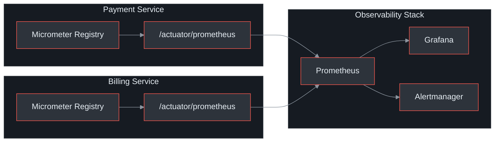
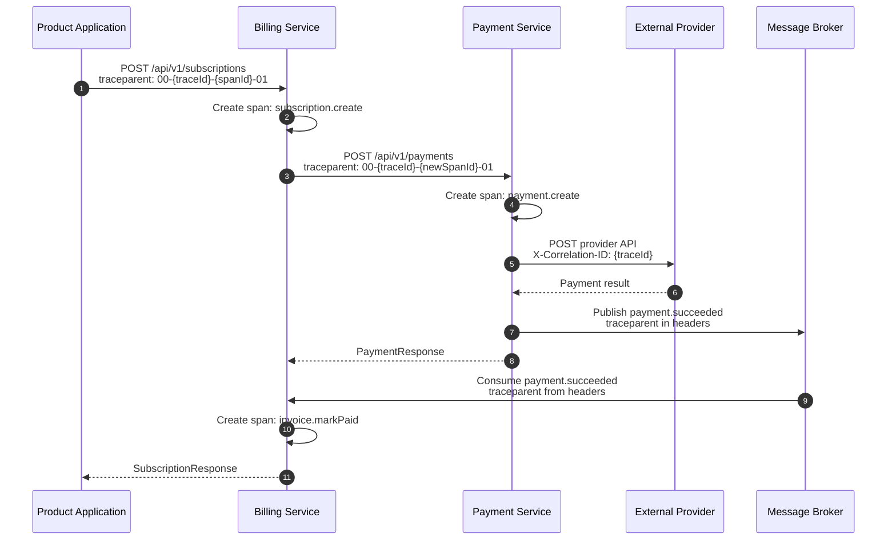
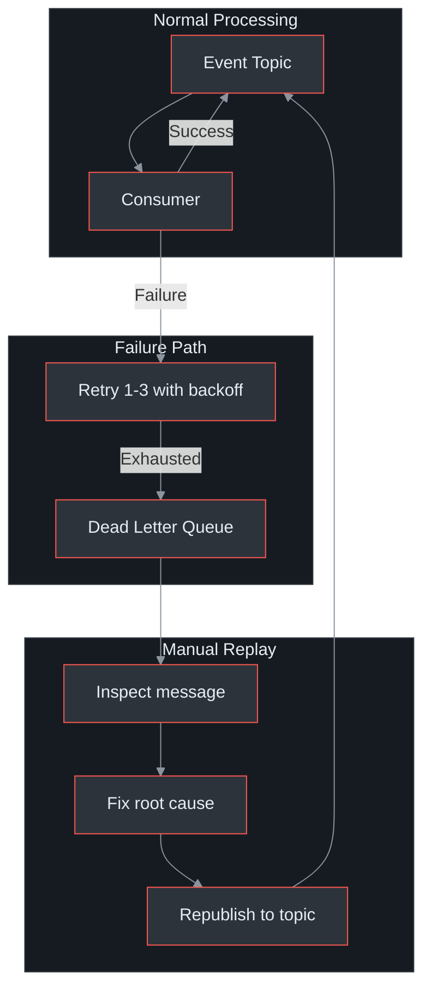
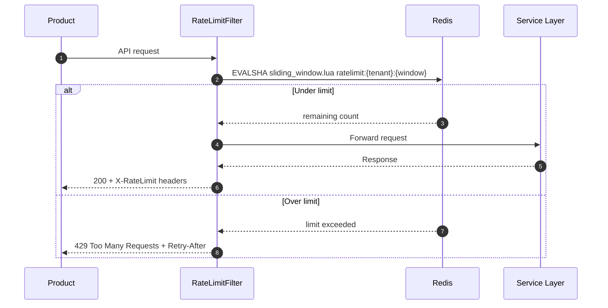
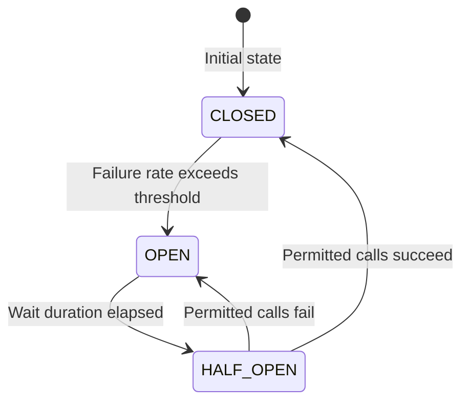

# Observability

The Payment Gateway Platform uses **Micrometer + Prometheus** for metrics, **OpenTelemetry** for distributed tracing, and **structured JSON logs** with correlation IDs for log aggregation. Both services expose Spring Actuator endpoints for health checks and metrics scraping.

## At a Glance

| Attribute | Detail |
|---|---|
| **Metrics library** | Micrometer with Prometheus registry |
| **Tracing** | OpenTelemetry (W3C `traceparent` propagation) |
| **Dashboards** | Grafana (Prometheus data source) |
| **Alerting** | Prometheus Alertmanager rules |
| **Health endpoints** | `/health` (liveness), `/health/ready` (readiness) |
| **Actuator endpoints** | `/actuator/health`, `/actuator/prometheus`, `/actuator/info` |
| **Log format** | Structured JSON with trace/span/correlation IDs |
| **Rate limiting** | Redis sliding window, per-tenant, per-endpoint |
| **Circuit breaker** | Resilience4j with Micrometer metrics export |
| **DLQ monitoring** | Prometheus counter `broker_dlq_messages_total` |

(docs/shared/system-architecture.md:496-541)

---

## Metrics Architecture

Both services use Micrometer to export metrics to Prometheus via the `/actuator/prometheus` scrape endpoint.


<!-- Sources: docs/shared/system-architecture.md:496-508, docs/payment-service/architecture-design.md:351-364 -->

---

## Key Metrics

### Counters

| Metric | Labels | Purpose |
|---|---|---|
| `payment_requests_total` | `status`, `provider`, `tenant_id` | Total payment attempts segmented by outcome |
| `webhook_dispatch_total` | `event_type`, `status` | Webhook delivery attempts and outcomes |
| `broker_dlq_messages_total` | `topic`, `error_type` | Messages routed to dead letter queues |
| `subscription_events_total` | `event_type`, `tenant_id` | Subscription lifecycle events |
| `invoice_payment_attempts_total` | `status`, `tenant_id` | Invoice payment attempt outcomes |
| `redis_cache_hits_total` | `cache_name` | Redis cache hit count |
| `redis_cache_misses_total` | `cache_name` | Redis cache miss count |

### Histograms and Timers

| Metric | Labels | Purpose |
|---|---|---|
| `payment_request_duration_seconds` | `provider`, `operation` | Payment processing latency distribution |
| `webhook_dispatch_duration_seconds` | `event_type` | Webhook delivery time distribution |
| `payment_service_client_duration_seconds` | `operation`, `status` | Billing-to-Payment Service call latency |

### Gauges

| Metric | Labels | Purpose |
|---|---|---|
| `circuit_breaker_state` | `name` | Circuit breaker state (0=closed, 1=open, 2=half-open) |

(docs/shared/system-architecture.md:512-524)

---

## Business Metrics

Derived from the raw counters and histograms above, these business metrics power operational dashboards:

| Business Metric | PromQL Expression | Target |
|---|---|---|
| **Payment success rate** | `rate(payment_requests_total{status="succeeded"}[5m]) / rate(payment_requests_total[5m])` | > 95% |
| **Avg payment latency** | `rate(payment_request_duration_seconds_sum[5m]) / rate(payment_request_duration_seconds_count[5m])` | < 200ms (p50) |
| **Webhook delivery rate** | `rate(webhook_dispatch_total{status="delivered"}[5m]) / rate(webhook_dispatch_total[5m])` | > 99% |
| **Subscription churn** | `rate(subscription_events_total{event_type="subscription.canceled"}[24h])` | Monitor trend |
| **DLQ growth rate** | `increase(broker_dlq_messages_total[1h])` | < 10/hour |
| **Cache hit ratio** | `redis_cache_hits_total / (redis_cache_hits_total + redis_cache_misses_total)` | > 95% |

(docs/shared/system-architecture.md:512-524, docs/shared/system-architecture.md:547-558)

---

## Distributed Tracing

OpenTelemetry propagates trace context across the full request path using the W3C `traceparent` header.


<!-- Sources: docs/shared/system-architecture.md:528-531 -->

**Trace context propagation points:**

| Boundary | Mechanism |
|---|---|
| HTTP requests | W3C `traceparent` header (auto-injected by OpenTelemetry) |
| Message broker messages | `traceparent` in message headers |
| Webhook dispatch | `X-Correlation-ID` header containing the trace ID |
| Provider API calls | `X-Correlation-ID` header for support correlation |

(docs/shared/system-architecture.md:528-531)

---

## Grafana Dashboard Layout

Suggested dashboard panels organized by operational concern:

### Payment Operations Dashboard

| Row | Panel | Visualization | Query |
|---|---|---|---|
| 1 | Payment success rate | Stat (gauge) | `payment_requests_total{status="succeeded"} / payment_requests_total` |
| 1 | Payment volume | Time series | `rate(payment_requests_total[5m])` |
| 1 | Avg latency (p50/p95/p99) | Time series | `histogram_quantile(0.95, payment_request_duration_seconds)` |
| 2 | Payments by provider | Pie chart | `sum by (provider) (payment_requests_total)` |
| 2 | Payments by status | Bar chart | `sum by (status) (payment_requests_total)` |
| 3 | Circuit breaker state | State timeline | `circuit_breaker_state` |
| 3 | Provider latency heatmap | Heatmap | `payment_request_duration_seconds_bucket` |

### Billing Operations Dashboard

| Row | Panel | Visualization | Query |
|---|---|---|---|
| 1 | Active subscriptions | Stat | `subscription_events_total{event_type="subscription.activated"}` |
| 1 | Churn rate | Time series | `rate(subscription_events_total{event_type="subscription.canceled"}[24h])` |
| 2 | Invoice payment success | Gauge | `invoice_payment_attempts_total{status="succeeded"} / invoice_payment_attempts_total` |
| 2 | Revenue by tenant | Bar chart | `sum by (tenant_id) (invoice_payment_attempts_total{status="succeeded"})` |
| 3 | DLQ depth | Time series | `broker_dlq_messages_total` |
| 3 | Webhook delivery rate | Gauge | `webhook_dispatch_total{status="delivered"} / webhook_dispatch_total` |

### Infrastructure Dashboard

| Row | Panel | Visualization | Query |
|---|---|---|---|
| 1 | Redis cache hit ratio | Gauge | `redis_cache_hits_total / (redis_cache_hits_total + redis_cache_misses_total)` |
| 1 | Redis connection pool | Time series | `redis_connection_active` |
| 2 | DB query latency | Heatmap | `db_query_duration_seconds_bucket` |
| 2 | DB connection pool | Time series | `hikaricp_connections_active` |
| 3 | JVM heap usage | Time series | `jvm_memory_used_bytes{area="heap"}` |
| 3 | GC pause time | Time series | `jvm_gc_pause_seconds_sum` |

---

## Alerting Rules

Prometheus Alertmanager rules for critical operational conditions:

| Alert | Condition | Severity | Action |
|---|---|---|---|
| `PaymentFailureRateHigh` | `rate(payment_requests_total{status="failed"}[5m]) > 0.1` | Critical | Page on-call; check provider status |
| `WebhookDeliveryBacklog` | `webhook_deliveries_pending > 1000` | Warning | Investigate delivery pipeline |
| `DLQMessagesAccumulating` | `increase(broker_dlq_messages_total[1h]) > 10` | Warning | Inspect DLQ, replay or fix |
| `PaymentServiceLatencyHigh` | `histogram_quantile(0.95, payment_service_client_duration_seconds) > 5` | Warning | Check Payment Service health |
| `RedisConnectionFailure` | `redis_connection_active == 0` | Critical | Redis cluster may be down |
| `CircuitBreakerOpen` | `circuit_breaker_state{name="paymentService"} == 1` | Warning | Provider degraded; check fallback |

(docs/shared/system-architecture.md:535-541)

**Example Alertmanager rule:**

```yaml
groups:
  - name: payment-gateway
    rules:
      - alert: PaymentFailureRateHigh
        expr: |
          rate(payment_requests_total{status="failed"}[5m])
          / rate(payment_requests_total[5m]) > 0.1
        for: 5m
        labels:
          severity: critical
        annotations:
          summary: "Payment failure rate exceeds 10%"
          description: "{{ $labels.provider }} failure rate is {{ $value | humanizePercentage }}"
```

---

## DLQ Monitoring and Replay

Both services route failed messages to dead letter queues after exhausting retries (3 attempts with exponential backoff).


<!-- Sources: docs/shared/system-architecture.md:169-192 -->

**DLQ topics:**

| DLQ Topic | Source | Contains |
|---|---|---|
| `payment.events.dlq` | Payment Service consumer failures | Failed payment event processing |
| `billing.events.dlq` | Billing Service consumer failures | Failed billing event processing |
| `payment.events.billing.dlq` | Billing Service consuming Payment Service events | Failed cross-service event processing |

**DLQ message metadata:**

Each DLQ message includes: original event ID, error message, stack trace, attempt count, and original topic. This context enables rapid root-cause identification without searching logs.

(docs/shared/system-architecture.md:169-192)

**Replay procedure:**

1. **Check DLQ depth** -- query `broker_dlq_messages_total` or inspect the queue directly
2. **Inspect messages** -- read the DLQ topic, examine error context and original event payload
3. **Identify root cause** -- transient failure (retry safe) vs. permanent failure (code fix needed)
4. **Fix if needed** -- deploy code fix for permanent failures
5. **Republish** -- move messages from DLQ back to the original topic for reprocessing
6. **Verify** -- confirm DLQ depth returns to zero and events are processed successfully

---

## Redis Rate Limiting

Both services implement sliding-window rate limiting via Redis to protect against abuse and ensure fair resource allocation.

| Dimension | Key Pattern | Default Limit | Window |
|---|---|---|---|
| **Per-tenant** | `ratelimit:{tenant_id}:{window}` | 10,000 req/min | 1 minute sliding |
| **Per-endpoint** | `ratelimit:{tenant_id}:{endpoint}:{window}` | Varies by endpoint | 1 minute sliding |
| **Global** | `ratelimit:global:{window}` | Configurable | 1 minute sliding |

(docs/shared/system-architecture.md:346-356)

**Rate limit response headers:**

| Header | Description |
|---|---|
| `X-RateLimit-Limit` | Maximum requests allowed in the window |
| `X-RateLimit-Remaining` | Requests remaining in the current window |
| `X-RateLimit-Reset` | Unix timestamp when the window resets |
| `Retry-After` | Seconds to wait (only on 429 responses) |

**Fallback behavior:** If Redis is unavailable, rate limiting fails closed (requests are rejected) to prevent uncontrolled load on downstream services.

(docs/shared/system-architecture.md:344-372)

**Rate limiting flow:**


<!-- Sources: docs/shared/system-architecture.md:344-372 -->

---

## Health Check Endpoints

Both services expose identical health check endpoints (unauthenticated) for Kubernetes probes and load balancer health checks.

| Endpoint | Probe Type | Checks | Response |
|---|---|---|---|
| `/health` | Liveness | Application is running | `200` with component status |
| `/health/ready` | Readiness | DB + Redis + message broker connected | `200` or `503` |
| `/actuator/health` | Composite | All health indicators | Detailed component breakdown |
| `/actuator/info` | Informational | Build info, git commit | Version metadata |
| `/actuator/prometheus` | Metrics | N/A | Prometheus scrape format |

(docs/payment-service/api-specification.yaml:637-662, docs/billing-service/api-specification.yaml:1059-1080)

**Health response structure (Payment Service):**

```json
{
  "status": "UP",
  "components": {
    "db": { "status": "UP", "details": { "database": "PostgreSQL" } },
    "redis": { "status": "UP" },
    "messageBroker": { "status": "UP" },
    "diskSpace": { "status": "UP" }
  }
}
```

**Readiness vs. liveness:**

- **Liveness** (`/health`): Is the JVM running? If this fails, Kubernetes restarts the pod.
- **Readiness** (`/health/ready`): Can the service handle requests? If this fails, the pod is removed from the load balancer but not restarted. Checks database connectivity, Redis availability, and message broker connection.

(docs/shared/system-architecture.md:498-508)

---

## Circuit Breaker Monitoring

Resilience4j circuit breakers protect outbound calls to payment providers and the Payment Service (from Billing Service). All circuit breaker state transitions are exported as Micrometer metrics.

**Payment Service -- provider circuit breaker:**

| Parameter | Value |
|---|---|
| Failure rate threshold | 50% |
| Slow call duration threshold | 5 seconds |
| Slow call rate threshold | 80% |
| Minimum calls before evaluation | 10 |
| Wait duration in open state | 30 seconds |
| Permitted calls in half-open | 5 |

(docs/payment-service/architecture-design.md:351-364)

**Billing Service -- Payment Service client circuit breaker:**

| Parameter | Value |
|---|---|
| Failure rate threshold | 50% |
| Wait duration in open state | 30 seconds |
| Sliding window size | 10 |
| Retry max attempts | 3 |
| Retry wait duration | 1 second (exponential x2) |

(docs/billing-service/architecture-design.md:502-521)


<!-- Sources: docs/payment-service/architecture-design.md:347-364, docs/billing-service/architecture-design.md:500-521 -->

**Fallback behavior:**

- **Payment Service**: When a provider circuit is open, requests return `PROVIDER_TIMEOUT` (504) immediately. Each provider has an independent circuit.
- **Billing Service**: When the Payment Service circuit is open, invoice payment attempts are deferred with retry scheduling.

(docs/payment-service/architecture-design.md:361-364)

**Metrics exposed:**

| Metric | Description |
|---|---|
| `resilience4j_circuitbreaker_state` | Current state (0=closed, 1=open, 2=half-open) |
| `resilience4j_circuitbreaker_calls_total` | Total calls by outcome (successful, failed, ignored) |
| `resilience4j_circuitbreaker_failure_rate` | Current failure rate percentage |
| `resilience4j_circuitbreaker_slow_call_rate` | Current slow call rate percentage |

Accessible via `/actuator/circuitbreakerevents` for detailed event history.

---

## Log Aggregation Strategy

Both services emit structured JSON logs with embedded trace context for correlation across the distributed system.

**Log format:**

```json
{
  "timestamp": "2026-03-26T10:15:30.123Z",
  "level": "INFO",
  "logger": "com.enviro.payment.service.PaymentService",
  "message": "Payment created successfully",
  "traceId": "abc123def456",
  "spanId": "789ghi012",
  "tenantId": "550e8400-e29b-41d4-a716-446655440000",
  "paymentId": "660e8400-e29b-41d4-a716-446655440001",
  "provider": "peach_payments",
  "correlationId": "abc123def456",
  "service": "payment-service",
  "environment": "production"
}
```

**Correlation strategy:**

| Field | Source | Propagation |
|---|---|---|
| `traceId` | OpenTelemetry | Automatic via `traceparent` header |
| `spanId` | OpenTelemetry | Automatic per operation |
| `tenantId` | `TenantContext` ThreadLocal | Set by `ApiKeyAuthFilter` on every request |
| `correlationId` | Same as `traceId` | Included in webhook `X-Correlation-ID` header |

**Log levels by category:**

| Category | Level | Examples |
|---|---|---|
| Payment lifecycle | INFO | Payment created, status changed, refund processed |
| Webhook delivery | INFO/WARN | Delivery attempt, retry scheduled, delivery failed |
| Provider communication | DEBUG/WARN | Request/response (sanitized), timeout, error |
| Security events | WARN/ERROR | Invalid signature, unauthorized access, rate limit exceeded |
| DLQ events | ERROR | Message routed to DLQ with full context |
| Circuit breaker | WARN | State transition (closed -> open, open -> half-open) |

---

## Performance SLOs

| Metric | Target |
|---|---|
| Payment Service API p50 | < 200ms |
| Payment Service API p95 | < 500ms (provider-dependent) |
| Payment Service API p99 | < 2000ms |
| Billing Service API p50 | < 100ms (excl. Payment Service calls) |
| Billing Service API p95 | < 300ms (excl. Payment Service calls) |
| Billing Service API p99 | < 1000ms (incl. Payment Service calls) |
| Webhook delivery p95 | < 5s |
| Payment Service webhook ack | < 500ms |
| DB query p95 | < 50ms |
| Redis cache hit rate | > 95% |
| System availability | 99.9% uptime |

(docs/shared/system-architecture.md:547-559)

---

## Related Pages

| Page | Relevance |
|---|---|
| [Platform Overview](../01-getting-started/platform-overview) | System context and service boundaries |
| [Payment Service Architecture](../02-architecture/payment-service/) | Circuit breaker config, provider SPI |
| [Billing Service Architecture](../02-architecture/billing-service/) | Resilience4j config, scheduled jobs |
| [Inter-Service Communication](../02-architecture/inter-service-communication) | Event delivery, DLQ patterns |
| [Event System](../02-architecture/event-system) | CloudEvents schema, broker topology |
| [Security and Compliance](./security-compliance/) | Authentication, encryption, audit logging |
| [Data Flows](./data-flows/) | End-to-end request flows |
| [Correctness Invariants](./correctness-invariants) | Formal properties verified by testing |
| [Provider Integrations](./provider-integrations) | Provider-specific monitoring |
