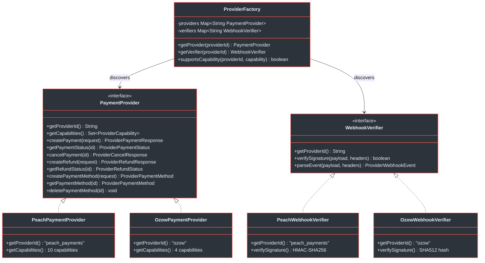
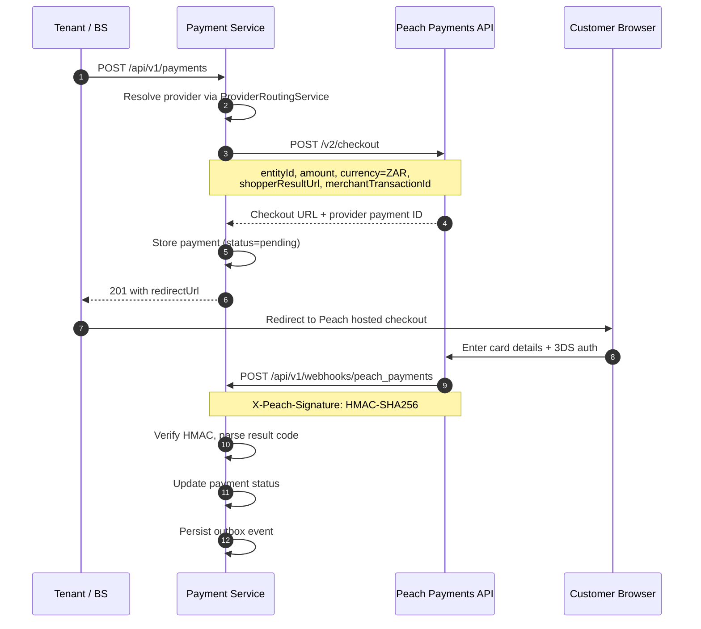
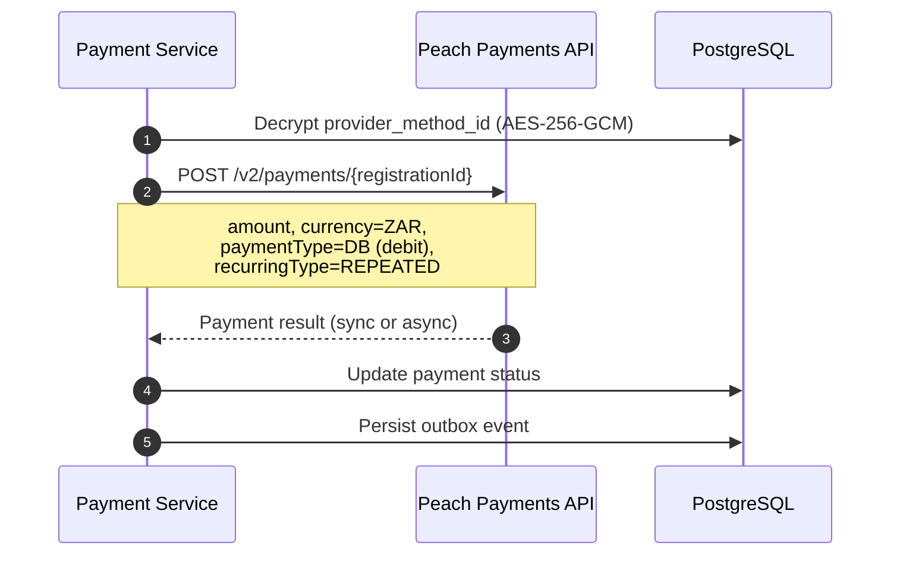
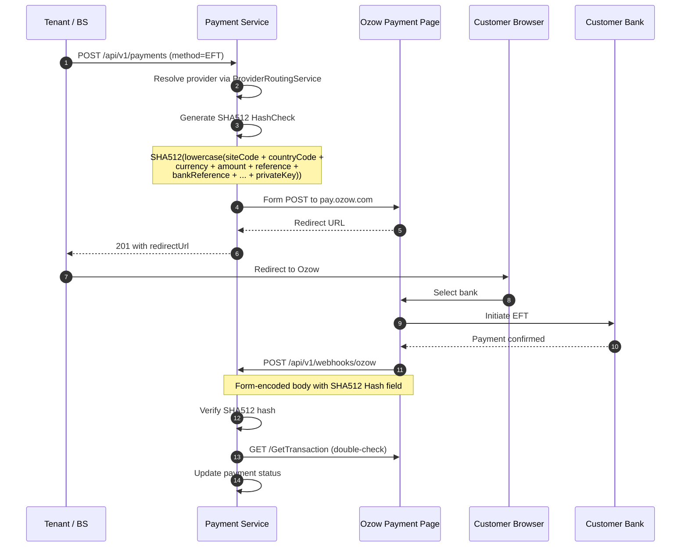
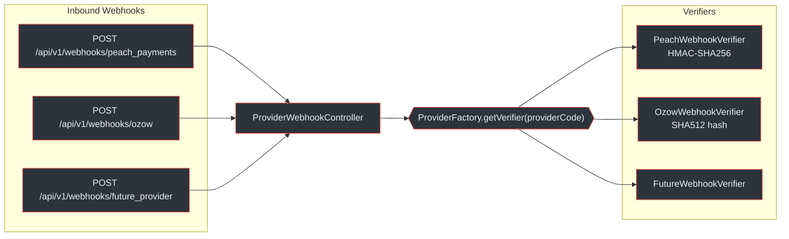
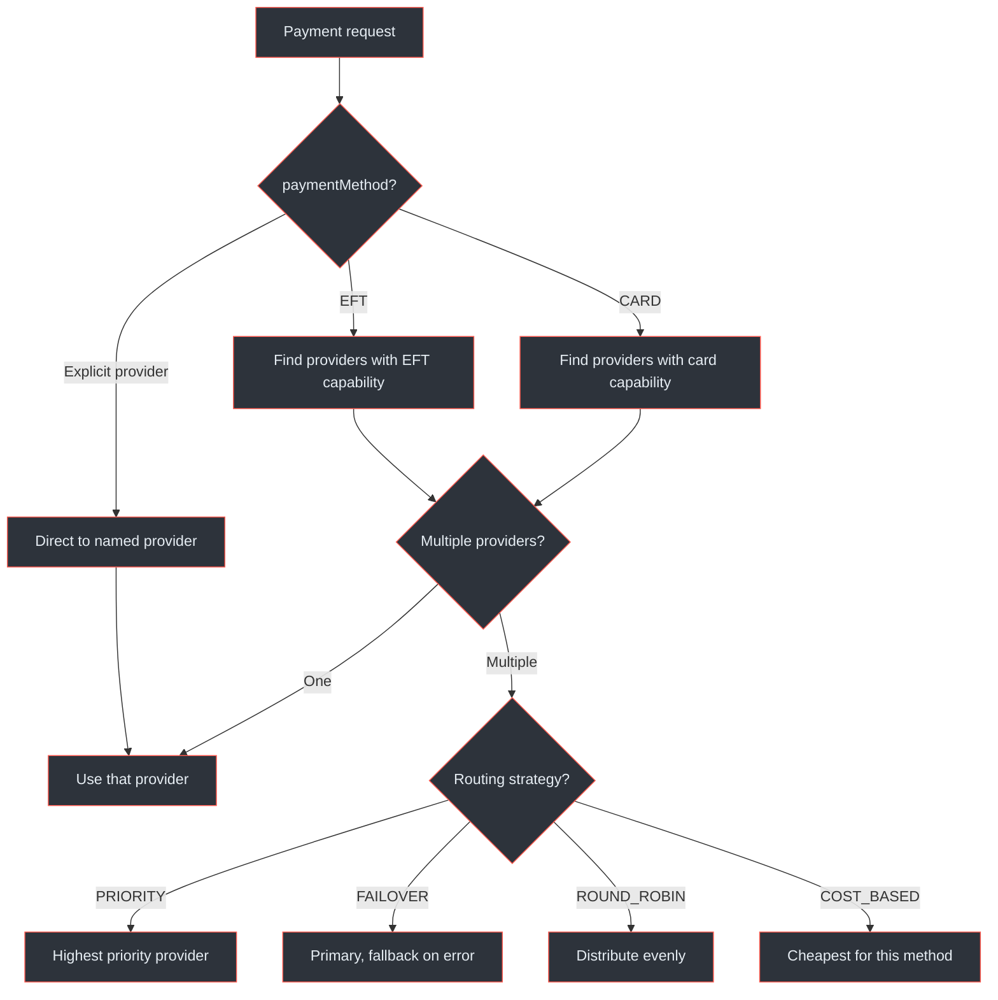
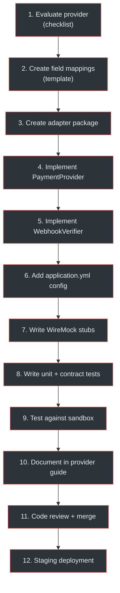

# Provider Integrations

The Payment Service isolates all provider-specific logic behind a Service Provider Interface (SPI). This page covers the SPI contract, the two reference provider implementations (Peach Payments and Ozow), and the process for adding new providers.

## At a Glance

| Attribute | Detail |
|---|---|
| **SPI Interfaces** | `PaymentProvider`, `WebhookVerifier` |
| **Discovery** | `ProviderFactory` with Spring auto-wiring |
| **Reference Providers** | Peach Payments (card, BNPL, wallet, QR), Ozow (EFT) |
| **Webhook Endpoint** | `POST /api/v1/webhooks/{providerCode}` |
| **Routing** | `ProviderRoutingService` with PRIORITY, FAILOVER, ROUND_ROBIN, COST_BASED strategies |
| **Circuit Breaker** | Resilience4j per provider (50% failure threshold, 30s open state) |
| **Amount Format** | DECIMAL(19,4) Rands internally; adapter converts if provider expects different format |

(docs/payment-service/provider-integration-guide.md:30-41)

---

## SPI Class Hierarchy

Every provider adapter implements two interfaces. The `ProviderFactory` auto-discovers all `@Component` implementations via Spring constructor injection.



<!-- Sources: docs/payment-service/provider-integration-guide.md:109-225, docs/payment-service/architecture-design.md:220-280 -->

(docs/payment-service/provider-integration-guide.md:109-144)

---

## ProviderCapability Enum

The `ProviderCapability` enum defines the complete set of features a provider can support:

| Capability | Description | Required |
|---|---|---|
| `ONE_TIME_PAYMENT` | Single payments | Yes |
| `RECURRING_PAYMENT` | Token-based recurring charges | No |
| `REFUND_FULL` | Full refunds | Yes (throw if unsupported) |
| `REFUND_PARTIAL` | Partial refunds | No |
| `TOKENIZE_CARD` | Card tokenisation | No |
| `TOKENIZE_BANK_ACCOUNT` | Bank account tokenisation | No |
| `THREE_D_SECURE` | 3DS authentication | No |
| `REDIRECT_FLOW` | Redirect-based payment | No |
| `WEBHOOK_NOTIFICATIONS` | Provider sends webhooks | Yes |
| `DIGITAL_WALLET` | Apple Pay, Google Pay, Samsung Pay | No |
| `BNPL` | Buy Now Pay Later | No |

(docs/payment-service/provider-integration-guide.md:164-177)

---

## Provider Capability Comparison

The following matrix compares the two reference providers. When evaluating a new provider, build a similar comparison against this baseline.

| Feature | Peach Payments | Ozow | Notes |
|---|---|---|---|
| Card Payments (Visa/MC) | <span class="ok">Yes</span> | <span class="fail">No</span> | Peach's primary strength |
| Instant EFT | <span class="fail">No</span> | <span class="ok">Yes</span> | Ozow's core strength |
| Capitec Pay / PayShap | <span class="fail">No</span> | <span class="ok">Yes</span> | Direct bank API integrations |
| BNPL (Buy Now Pay Later) | <span class="ok">Yes</span> | <span class="fail">No</span> | Via Peach partners (MoreTyme/Payflex) |
| Mobile Wallet | <span class="ok">Yes</span> | <span class="fail">No</span> | Apple Pay, Samsung Pay |
| QR Code Payments | <span class="ok">Yes</span> | <span class="fail">No</span> | SnapScan, Zapper |
| Tokenisation | <span class="ok">Yes</span> | <span class="fail">No</span> | Required for recurring card payments |
| Recurring Billing | <span class="ok">Yes</span> | <span class="fail">No</span> | Via tokenised card charges |
| Refunds | <span class="ok">Yes</span> | <span class="ok">Yes</span> | Both support merchant-initiated refunds |
| 3D Secure | <span class="ok">Yes (auto)</span> | <span class="warn">N/A</span> | Mandatory for SA card payments |
| Multi-Currency | <span class="ok">Yes</span> | <span class="fail">No</span> | Ozow is ZAR-only |
| Java SDK | <span class="fail">No</span> | <span class="fail">No</span> | Both require custom `WebClient` |
| Transaction Fee | <span class="warn">~2.9% + R2</span> | <span class="ok">~1.5-2%</span> | EFT generally cheaper |

(docs/payment-service/provider-integration-guide.md:738-758)

---

## Peach Payments Reference Implementation

Peach Payments is a PCI DSS Level 1 card provider headquartered in Cape Town, supporting card, BNPL, wallet, and QR code payments.

### Payment Flow



<!-- Sources: docs/payment-service/provider-integration-guide.md:352-392, docs/payment-service/payment-flow-diagrams.md:30-80 -->

### Recurring / Tokenisation Flow

Peach supports recurring charges via card tokenisation. The initial payment creates a `registrationId` token, which is AES-256-GCM encrypted before storage.



<!-- Sources: docs/payment-service/provider-integration-guide.md:396-418 -->

### Webhook Verification

Peach webhooks use HMAC-SHA256 with the shared secret. The signature is delivered in the `X-Peach-Signature` header.

| Aspect | Detail |
|---|---|
| **Mechanism** | HMAC-SHA256 |
| **Header** | `X-Peach-Signature` |
| **Comparison** | Constant-time via `MessageDigest.isEqual()` |
| **Result Code Mapping** | `000.000.*` / `000.100.1*` = SUCCEEDED, `000.200.*` = PROCESSING, `800.*` / `900.*` = FAILED |

(docs/payment-service/provider-integration-guide.md:420-471)

---

## Ozow Reference Implementation

Ozow is a Johannesburg-based EFT provider offering direct bank payments across all major SA banks, Capitec Pay, and PayShap.

### Payment Flow



<!-- Sources: docs/payment-service/provider-integration-guide.md:577-627, docs/payment-service/payment-flow-diagrams.md:100-150 -->

### Webhook Verification

Ozow uses a SHA512 hash of concatenated response fields plus the private key. A GET double-check against the Ozow API is recommended after hash verification.

| Aspect | Detail |
|---|---|
| **Mechanism** | SHA512 hash of concatenated fields + private key |
| **Verification Steps** | 1. Parse form-encoded fields, 2. Concatenate in Ozow-defined order, 3. SHA512, 4. Compare to `Hash` field |
| **Double-Check** | `GET /GetTransaction?transactionId={id}` to confirm amount, status, reference |
| **Status Mapping** | `Complete` = SUCCEEDED, `Cancelled` / `Abandoned` = CANCELLED, `Error` = FAILED |

(docs/payment-service/provider-integration-guide.md:636-710)

### Limitations

Ozow **does not support tokenisation or recurring payments**. Each payment requires active customer participation via bank redirect. For subscriptions using EFT, the Billing Service sends invoice payment links that customers pay manually.

(docs/payment-service/provider-integration-guide.md:630-633)

---

## Webhook Routing Architecture

All provider webhooks arrive at a single parameterised endpoint and are dispatched to the correct verifier via `ProviderFactory`.



<!-- Sources: docs/payment-service/provider-integration-guide.md:806-823, docs/payment-service/architecture-design.md:320-350 -->

### Provider Event to Domain Event Mapping

| Provider Event Category | Unified Domain Event |
|---|---|
| Payment success | `payment.succeeded` |
| Payment failure | `payment.failed` |
| Payment cancelled | `payment.canceled` |
| Payment pending | `payment.processing` |
| 3DS required | `payment.requires_action` |
| Refund completed | `refund.succeeded` |
| Refund failed | `refund.failed` |
| Chargeback / Dispute | `payment.disputed` |
| Card tokenised | `payment_method.attached` |

(docs/payment-service/provider-integration-guide.md:845-858)

---

## Provider Routing and Fallback

The `ProviderRoutingService` resolves which provider handles a payment based on the requested payment method and configured routing strategy.



<!-- Sources: docs/payment-service/provider-integration-guide.md:985-1018 -->

### Default Routing Table

| Payment Method | Resolved Provider | Notes |
|---|---|---|
| CARD | Peach Payments | Any card-capable provider can be registered |
| BNPL | Peach Payments | Provider must support BNPL flow |
| EFT | Ozow | Any EFT-capable provider can be registered |
| PAYSHAP | Ozow | RTC rail, via EFT provider |
| WALLET | Peach Payments | Apple Pay, Samsung Pay |

(docs/payment-service/provider-integration-guide.md:993-999)

### Circuit Breaker per Provider

Each provider adapter is wrapped by a Resilience4j circuit breaker to prevent cascading failures.

| Parameter | Value |
|---|---|
| Failure rate threshold | 50% |
| Slow call threshold | 80% |
| Slow call duration | 5 seconds |
| Sliding window type | COUNT_BASED |
| Sliding window size | 20 calls |
| Min calls before evaluation | 10 |
| Wait duration in open state | 30 seconds |
| Permitted calls in half-open | 5 |

(docs/payment-service/provider-integration-guide.md:1040-1065)

---

## Adding a New Provider

New providers are integrated without modifying any existing code. The process requires implementing two interfaces and adding configuration.



<!-- Sources: docs/payment-service/provider-integration-guide.md:928-981 -->

### Required Files

```
src/main/java/.../provider/adapter/<code>/
  <Code>PaymentProvider.java          # Implements PaymentProvider SPI
  <Code>WebhookVerifier.java          # Implements WebhookVerifier SPI
  <Code>ApiClient.java                # HTTP client for provider API
  <Code>Mapper.java                   # Maps provider DTOs <> domain objects
  <Code>Config.java                   # @ConfigurationProperties
  dto/
    <Code>PaymentRequest.java         # Provider-specific request DTO
    <Code>PaymentResponse.java        # Provider-specific response DTO
    <Code>WebhookPayload.java         # Provider-specific webhook payload

src/test/resources/__files/<code>/
  checkout-success.json               # WireMock stub: successful payment
  checkout-declined.json              # WireMock stub: declined payment
  webhook-success.json                # WireMock stub: success webhook
  webhook-failure.json                # WireMock stub: failure webhook
```

No changes required to the domain layer, API layer, database schema, or existing provider implementations. Spring auto-discovers new `@Component` beans via `ProviderFactory` constructor injection.

(docs/payment-service/provider-integration-guide.md:963-981)

### Amount Handling

The Payment Service stores amounts in `DECIMAL(19,4)` Rands. Both Peach and Ozow expect Rands, so no conversion is needed for the reference providers. For a future provider that expects cents, the adapter must convert:

| Direction | Conversion |
|---|---|
| Service to Provider (Peach) | No conversion (Rands to Rands) |
| Service to Provider (Ozow) | No conversion (Rands to Rands) |
| Billing Service to Payment Service | BS converts cents to Rands: `amountDueCents / 100` |
| Provider to Service (webhook) | Map provider amount to DECIMAL(19,4) Rands |

(docs/payment-service/provider-integration-guide.md:1070-1089)

---

## Related Pages

| Page | Description |
|---|---|
| [Payment Service Architecture](../02-architecture/payment-service/) | Internal architecture, SPI layer, service components |
| [Payment Service Schema](../02-architecture/payment-service/schema) | Database tables, RLS policies, JSONB schemas |
| [Payment Service API](../02-architecture/payment-service/api) | OpenAPI specification, endpoint reference |
| [Security and Compliance](./security-compliance/) | PCI DSS, POPIA, encryption, webhook security |
| [Authentication](./security-compliance/authentication) | HMAC-SHA256 vs API key authentication models |
| [Data Flows](./data-flows/) | End-to-end payment and subscription flows |
| [Correctness Invariants](./correctness-invariants) | Formal properties including webhook delivery guarantee (P5) |
| [Observability](./observability) | Circuit breaker metrics, provider latency dashboards |
