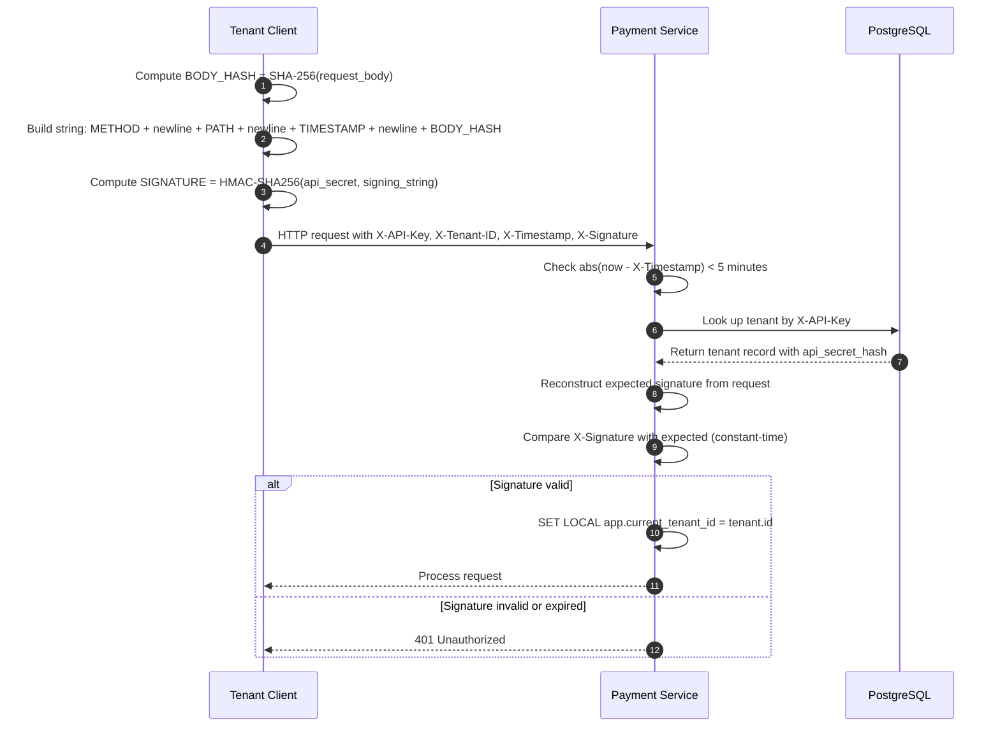
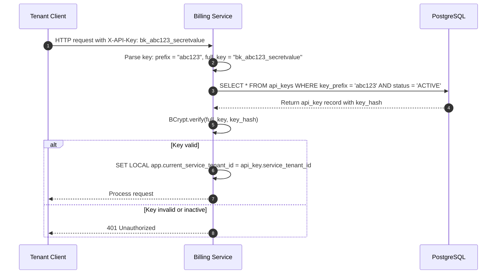
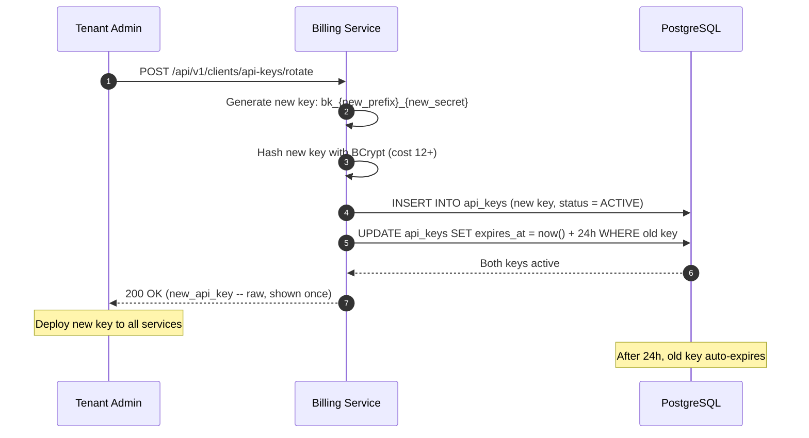
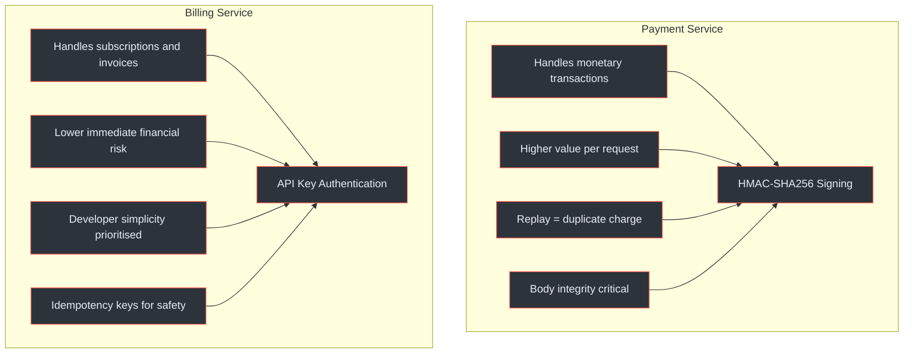
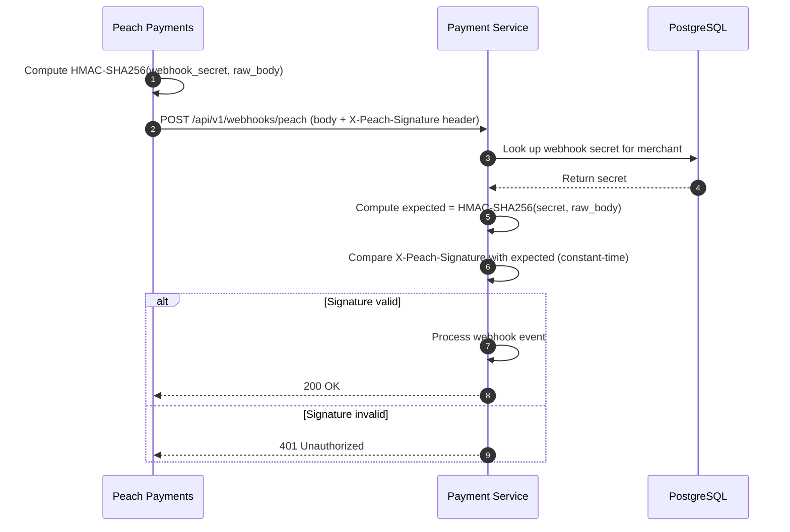
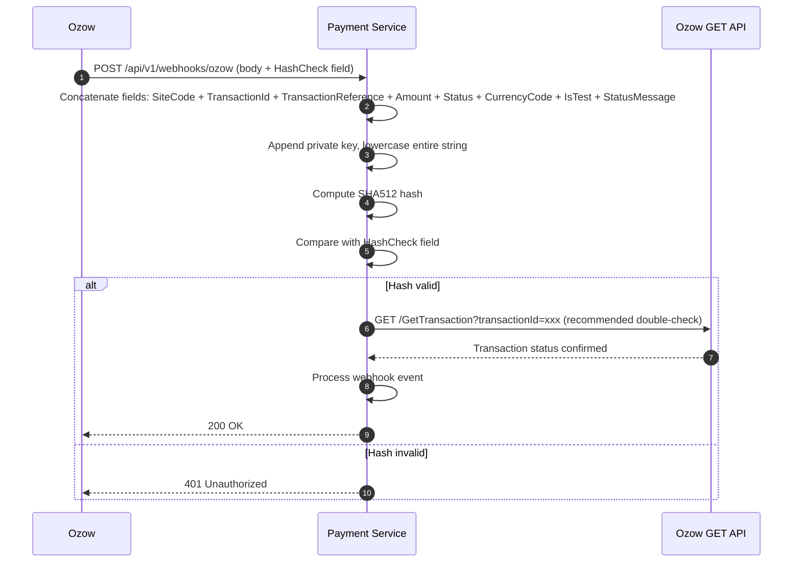
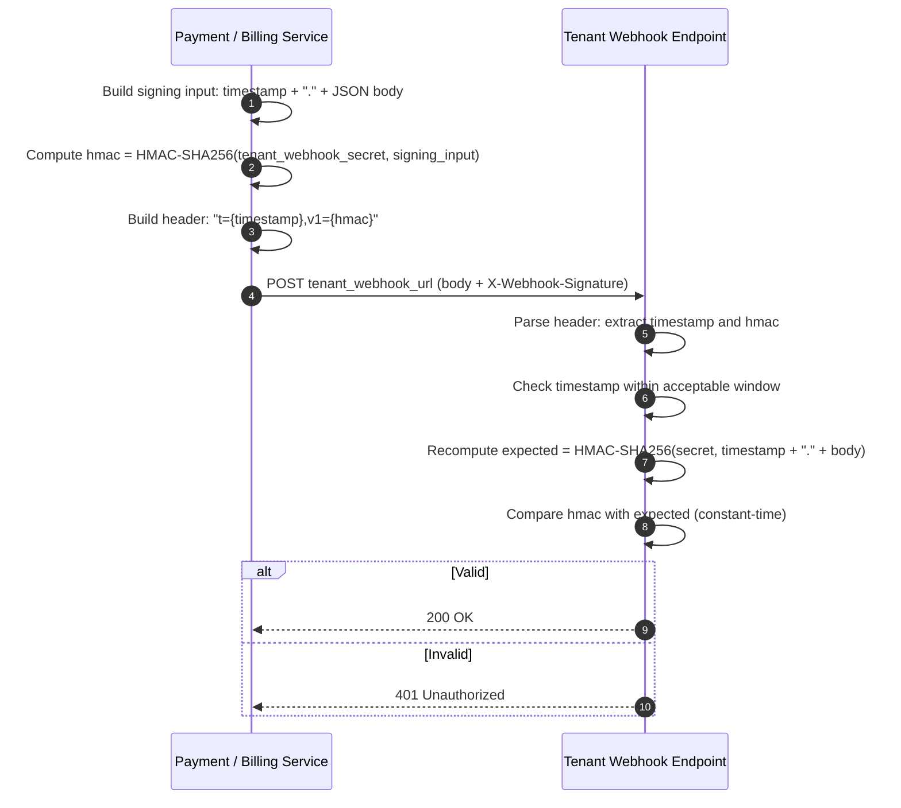

# Authentication

The Payment Gateway Platform uses two distinct authentication models: HMAC-SHA256 signed requests for the Payment Service and API key-based authentication for the Billing Service. Each model is optimised for its service's threat model and operational requirements.

## At a Glance

| Attribute | Payment Service (HMAC) | Billing Service (API Key) |
|---|---|---|
| **Auth mechanism** | HMAC-SHA256 signature | BCrypt-hashed API key |
| **Required headers** | `X-API-Key`, `X-Tenant-ID`, `X-Timestamp`, `X-Signature` | `X-API-Key` |
| **Replay protection** | <span class="ok">5-minute window on X-Timestamp</span> | <span class="fail">None (relies on TLS + idempotency)</span> |
| **Key format** | `api_key` + `api_secret` (separate values) | `bk_{prefix}_{secret}` (single value) |
| **Key storage** | `tenants.api_secret_hash` (BCrypt cost 12+) | `api_keys.key_hash` (BCrypt cost 12+) |
| **Multiple keys** | <span class="fail">No</span> | <span class="ok">Yes</span> |
| **Self-service rotation** | <span class="fail">No (admin only)</span> | <span class="ok">Yes (24h grace period)</span> |
| **Body integrity** | <span class="ok">SHA-256 hash of body included in signature</span> | <span class="fail">No body verification</span> |

(docs/shared/integration-guide.md:45-68, docs/shared/integration-guide.md:112-138)

---

## Payment Service: HMAC-SHA256

### Request Signing Flow

Every request to the Payment Service must include four authentication headers. The signature binds the HTTP method, path, timestamp, and request body together, ensuring integrity and preventing replay attacks.



<!-- Sources: docs/shared/integration-guide.md:45-68, docs/payment-service/architecture-design.md:312-340 -->

### Signature Construction

The HMAC-SHA256 signature is constructed from a canonical string that binds all security-relevant parts of the request:

```
Signature = HMAC-SHA256(
    key   = api_secret,
    data  = METHOD + "\n" + PATH + "\n" + TIMESTAMP + "\n" + BODY_HASH
)

where BODY_HASH = hex(SHA-256(request_body))
```

| Component | Example | Purpose |
|---|---|---|
| `METHOD` | `POST` | Prevents method substitution |
| `PATH` | `/api/v1/payments` | Prevents endpoint substitution |
| `TIMESTAMP` | `1711468800` (Unix epoch) | Replay protection (5-min window) |
| `BODY_HASH` | `e3b0c44298fc...` (SHA-256 hex) | Body integrity verification |

(docs/shared/integration-guide.md:52-65)

### Required Headers

| Header | Value | Validated |
|---|---|---|
| `X-API-Key` | Tenant's API key identifier | <span class="ok">DB lookup</span> |
| `X-Tenant-ID` | UUID of the tenant | <span class="ok">Must match API key's tenant</span> |
| `X-Timestamp` | Unix epoch seconds | <span class="ok">Within 5 minutes of server time</span> |
| `X-Signature` | HMAC-SHA256 hex string | <span class="ok">Constant-time comparison</span> |

(docs/shared/integration-guide.md:45-51)

### Replay Protection

The 5-minute timestamp window prevents captured requests from being replayed later. Combined with idempotency keys, this provides strong protection against both replay attacks and duplicate processing.

| Attack | Mitigation |
|---|---|
| Replay after 5 minutes | <span class="ok">X-Timestamp rejected as expired</span> |
| Replay within 5 minutes | <span class="ok">Idempotency key prevents duplicate processing</span> |
| Body tampering | <span class="ok">BODY_HASH mismatch fails signature verification</span> |
| Path substitution | <span class="ok">PATH included in signature</span> |
| Method substitution | <span class="ok">METHOD included in signature</span> |

(docs/shared/integration-guide.md:60-68, docs/payment-service/architecture-design.md:335-345)

---

## Billing Service: API Key

### Authentication Flow

The Billing Service uses a simpler authentication model: a single `X-API-Key` header containing the full API key. The key format `bk_{prefix}_{secret}` allows efficient DB lookup via the prefix, followed by BCrypt verification of the full key.



<!-- Sources: docs/shared/integration-guide.md:112-138, docs/billing-service/architecture-design.md:265-289 -->

### Key Format

The `bk_{prefix}_{secret}` format serves two purposes: the prefix enables O(1) database lookup without scanning all keys, and the secret portion provides the authentication proof.

| Component | Example | Purpose |
|---|---|---|
| `bk_` | Fixed prefix | Identifies as a Billing Service key |
| `{prefix}` | `abc123` | Database lookup index (stored plaintext) |
| `{secret}` | `x7kQ9...` | Authentication proof (only stored as BCrypt hash) |

(docs/shared/integration-guide.md:115-125, docs/billing-service/database-schema-design.md:108-118)

### Key Rotation

The Billing Service supports self-service key rotation with a 24-hour grace period during which both the old and new keys are valid. This prevents downtime during key transitions.



<!-- Sources: docs/billing-service/architecture-design.md:285-305, docs/shared/integration-guide.md:135-155 -->

### Multiple Keys per Tenant

Unlike the Payment Service (one key pair per tenant), the Billing Service supports multiple active keys per tenant. This enables scenarios such as separate keys for different environments (staging vs production) or different integrating systems.

(docs/billing-service/database-schema-design.md:108-118)

---

## Why Different Auth Models?

The two services use different authentication models because they face different threat landscapes and developer experience requirements.



<!-- Sources: docs/shared/integration-guide.md:45-68, docs/shared/integration-guide.md:112-138 -->

### Security Property Comparison

| Property | Payment Service (HMAC) | Billing Service (API Key) |
|---|---|---|
| **Authentication** | <span class="ok">Key + secret + signature</span> | <span class="ok">Key (contains secret)</span> |
| **Replay protection** | <span class="ok">5-min timestamp window</span> | <span class="warn">None (TLS + idempotency)</span> |
| **Body integrity** | <span class="ok">SHA-256 hash in signature</span> | <span class="fail">Not verified</span> |
| **Path binding** | <span class="ok">Path in signature</span> | <span class="fail">Not verified</span> |
| **Method binding** | <span class="ok">Method in signature</span> | <span class="fail">Not verified</span> |
| **Integration complexity** | <span class="warn">Higher (signing logic required)</span> | <span class="ok">Lower (single header)</span> |
| **Key rotation** | <span class="warn">Admin-only</span> | <span class="ok">Self-service, 24h grace</span> |
| **Multiple keys** | <span class="fail">No</span> | <span class="ok">Yes</span> |
| **Secret exposure risk** | <span class="ok">Secret never sent over wire</span> | <span class="warn">Full key sent in header (TLS-protected)</span> |

(docs/shared/integration-guide.md:45-155, docs/payment-service/architecture-design.md:312-345)

---

## Provider Webhook Verification

When payment providers send webhook notifications to the Payment Service, the platform must verify that the webhook genuinely originated from the provider and was not tampered with in transit. Each provider uses a different verification scheme.

### Peach Payments

Peach Payments signs webhooks using HMAC-SHA256. The signature is sent in the `X-Peach-Signature` header and is computed over the raw JSON payload using the merchant's webhook secret.



<!-- Sources: docs/payment-service/provider-integration-guide.md:312-338, docs/shared/integration-guide.md:680-705 -->

### Ozow

Ozow uses a different approach: SHA512 hash of concatenated response fields plus the merchant's private key, all lowercased. Additionally, Ozow recommends a double-check via their `GET /GetTransaction` API to confirm the transaction status independently.



<!-- Sources: docs/payment-service/provider-integration-guide.md:450-490, docs/shared/integration-guide.md:720-755 -->

### Provider Verification Comparison

| Property | Peach Payments | Ozow |
|---|---|---|
| **Algorithm** | HMAC-SHA256 | SHA512 (hash, not HMAC) |
| **Signature location** | `X-Peach-Signature` header | `HashCheck` field in body |
| **Input** | Raw JSON body | Concatenated specific fields + private key |
| **Case sensitivity** | Signature is hex-encoded | Entire input lowercased before hashing |
| **Double-check** | <span class="warn">Not required</span> | <span class="ok">Recommended GET /GetTransaction</span> |
| **Replay protection** | <span class="warn">Relies on idempotency</span> | <span class="ok">GET double-check confirms current state</span> |
| **Verification function** | `HmacUtils.hmacSha256Hex(secret, payload)` | `DigestUtils.sha512Hex(concatenated.toLowerCase())` |

(docs/payment-service/provider-integration-guide.md:312-490, docs/shared/integration-guide.md:680-755)

---

## Outgoing Webhook Signing

When the platform sends webhooks to tenant endpoints, it signs the payload so that tenants can verify the webhook originated from the platform and was not tampered with.

### Signature Format

Outgoing webhooks use the `X-Webhook-Signature` header with the format:

```
X-Webhook-Signature: t={timestamp},v1={hmac}
```

Where:
- `{timestamp}` is the Unix epoch seconds when the webhook was sent
- `{hmac}` is `HMAC-SHA256(webhook_secret, timestamp + "." + body)`



<!-- Sources: docs/shared/integration-guide.md:820-855, docs/payment-service/architecture-design.md:480-510 -->

### Tenant-Side Verification Steps

| Step | Action | Purpose |
|---|---|---|
| 1 | Parse `X-Webhook-Signature` header | Extract `t` (timestamp) and `v1` (signature) |
| 2 | Check timestamp freshness | Reject if older than acceptable window (e.g., 5 minutes) |
| 3 | Reconstruct signing input | `t + "." + raw_request_body` |
| 4 | Compute expected HMAC | `HMAC-SHA256(webhook_secret, signing_input)` |
| 5 | Constant-time compare | Compare computed HMAC with `v1` value |
| 6 | Return 200 or reject | Accept only if all checks pass |

(docs/shared/integration-guide.md:840-860)

### Webhook Secret Storage

Webhook secrets are stored encrypted in both services:

| Service | Table | Column | Encryption |
|---|---|---|---|
| Payment Service | `webhook_configs` | `secret` | AES-256-GCM (app-level) |
| Billing Service | `webhook_configs` | `secret` | AES-256-GCM (app-level) |

Both tables are RLS-protected, ensuring each tenant can only access their own webhook configuration.

(docs/payment-service/database-schema-design.md:140-152, docs/billing-service/database-schema-design.md:135-145)

---

## Related Pages

| Page | Description |
|---|---|
| [Security and Compliance Overview](./index) | Regulatory landscape, encryption architecture, PCI DSS, POPIA |
| [Tenant Isolation](./tenant-isolation) | PostgreSQL RLS policies, session variables, cross-service tenant mapping |
| [Payment Service Schema](../../02-architecture/payment-service/schema) | Full table definitions including auth-related columns |
| [Billing Service Schema](../../02-architecture/billing-service/schema) | Full table definitions including api_keys table |
| [Inter-Service Communication](../../02-architecture/inter-service-communication) | Cross-service authentication and tenant context propagation |
| [Provider Integrations](../provider-integrations) | Full provider webhook handling details |
| [Correctness Invariants](../correctness-invariants) | Formal properties P12 (webhook integrity), B6 (key rotation) |
| [Integration Quickstart](../../01-getting-started/integration-quickstart) | Step-by-step guide to authenticating API requests |
