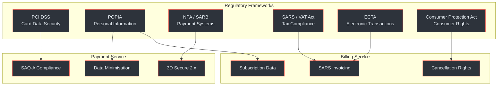
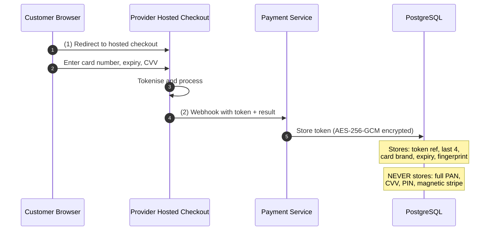
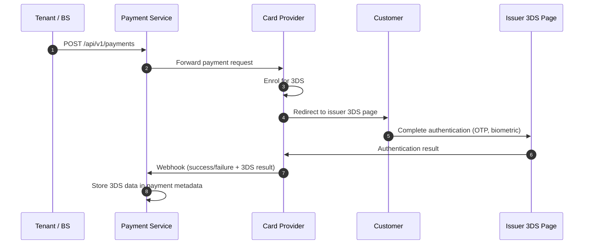
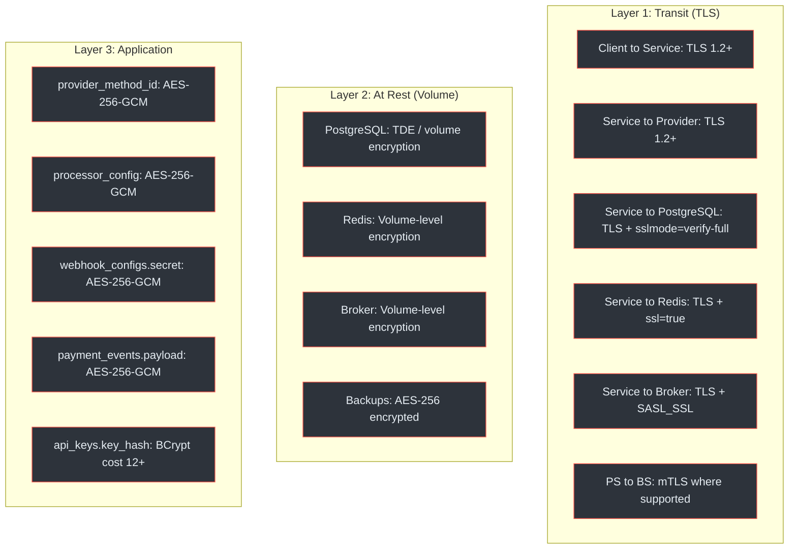

# Security and Compliance

The Payment Gateway Platform operates under multiple South African regulatory frameworks. This page provides an overview of compliance posture, encryption architecture, and security controls across both services.

## At a Glance

| Attribute | Detail |
|---|---|
| **PCI DSS Level** | SAQ-A (no raw card data stored or processed) |
| **Data Protection** | POPIA (Protection of Personal Information Act) |
| **Card Auth** | 3D Secure 2.x (mandatory for SA CNP transactions) |
| **Financial Regulator** | SARB (National Payment System Act) |
| **Tax Compliance** | SARS VAT Act (15% standard rate, SARS-compliant invoices) |
| **Encryption at Rest** | AES-256-GCM (app-level), TDE/volume encryption (DB) |
| **Encryption in Transit** | TLS 1.2+ (1.3 preferred), mTLS for inter-service |
| **Key Hashing** | BCrypt (cost 12+) for API keys |
| **Request Signing** | HMAC-SHA256 (PS), SHA512 hash (Ozow webhooks) |

(docs/payment-service/compliance-security-guide.md:33-48, docs/billing-service/compliance-security-guide.md:80-98)

---

## Regulatory Landscape



<!-- Sources: docs/payment-service/compliance-security-guide.md:33-48, docs/billing-service/compliance-security-guide.md:80-98 -->

### Compliance Matrix

| Regulation | Authority | Payment Service | Billing Service |
|---|---|---|---|
| **PCI DSS** | PCI SSC | <span class="ok">SAQ-A (tokenisation only)</span> | <span class="ok">Out of scope</span> |
| **POPIA** | Information Regulator | <span class="warn">Customer email, IP, token</span> | <span class="warn">Customer email, invoices, metadata</span> |
| **NPA / SARB** | SARB | <span class="ok">Provider-level compliance</span> | <span class="ok">Not directly applicable</span> |
| **SARS / VAT** | SARS | <span class="ok">7-year payment retention</span> | <span class="ok">SARS-compliant invoices</span> |
| **ECTA** | DCDT | <span class="ok">Electronic transaction framework</span> | <span class="ok">Invoice format compliance</span> |
| **CPA** | NCC | <span class="ok">Consumer rights</span> | <span class="warn">Trial periods, cancellation flows</span> |

(docs/payment-service/compliance-security-guide.md:35-43, docs/billing-service/compliance-security-guide.md:82-88)

---

## PCI DSS SAQ-A

The platform minimises PCI scope by never handling raw cardholder data. All card input occurs on provider-hosted checkout pages.



<!-- Sources: docs/payment-service/compliance-security-guide.md:58-73 -->

### What Is Stored vs. What Is Not

| Data Element | Stored | Encryption | Purpose |
|---|---|---|---|
| Full PAN | <span class="fail">Never</span> | -- | Never touches our systems |
| CVV/CVC | <span class="fail">Never</span> | -- | Entered on provider page only |
| PIN / Magnetic stripe | <span class="fail">Never</span> | -- | Not applicable (CNP) |
| Cardholder name | <span class="fail">Never</span> | -- | Not stored |
| Token reference | <span class="ok">Yes</span> | AES-256-GCM | `payment_methods.provider_method_id` |
| Last 4 digits | <span class="ok">Yes</span> | Plaintext | Customer identification |
| Card brand | <span class="ok">Yes</span> | Plaintext | UI display and routing |
| Expiry month/year | <span class="ok">Yes</span> | Plaintext | Display only (not sensitive per PCI) |
| Card fingerprint | <span class="ok">Yes</span> | Plaintext | Duplicate card detection |

(docs/payment-service/compliance-security-guide.md:78-89)

---

## 3D Secure

3D Secure is mandatory for card-not-present transactions in South Africa. The card provider handles 3DS version negotiation with the issuer.



<!-- Sources: docs/payment-service/compliance-security-guide.md:123-139 -->

### 3DS Outcomes and Liability Shift

| Outcome | Meaning | Liability Shift |
|---|---|---|
| `AUTHENTICATED` | Cardholder successfully authenticated | To issuer |
| `ATTEMPT` | Authentication attempted but not completed | To issuer |
| `FRICTIONLESS` | Risk-based auth approved without challenge | To issuer |
| `FAILED` | Authentication failed | To merchant |
| `UNAVAILABLE` | 3DS not available for this card/issuer | To merchant |

(docs/payment-service/compliance-security-guide.md:153-161)

---

## POPIA Data Protection

Both services implement POPIA principles for personal information protection. The key principle is data minimisation: store only what is necessary for payment processing and billing.

### Personal Information by Service

| Data Element | Service | Classification | Retention |
|---|---|---|---|
| Customer email | Both | Personal info | Life of account (PS) / 7 years (BS) |
| Customer name | PS | Personal info | Life of account |
| IP address | Both | Personal info | 90 days (PS) / 2 years (BS) |
| Payment amounts | PS | Financial info | 7 years (SARB) |
| Payment token | PS | Pseudonymised | Until card expiry |
| Invoice amounts | BS | Financial info | 7 years (SARS) |
| Subscription metadata | BS | Varies (may contain PII) | 7 years after end |
| API key prefix | BS | Not personal info | Until revoked + 90d |

(docs/payment-service/compliance-security-guide.md:187-196, docs/billing-service/compliance-security-guide.md:142-151)

### Data Subject Rights

| Right | Payment Service | Billing Service |
|---|---|---|
| **Access** | Export payment data by customer ID | Export subscription/invoice data by customer ID |
| **Correction** | Update customer email/name | Update customer email via subscription |
| **Deletion** | Anonymise after retention; soft-delete tokens | Anonymise after retention; cancel subscriptions |
| **Objection** | Deactivate tokens, stop recurring charges | Cancel subscriptions, revoke billing consent |

(docs/payment-service/compliance-security-guide.md:211-218, docs/billing-service/compliance-security-guide.md:167-174)

---

## Encryption Architecture

### Encryption Layers



<!-- Sources: docs/payment-service/compliance-security-guide.md:237-272, docs/billing-service/compliance-security-guide.md:193-223 -->

### Application-Level Encryption Summary

| Field | Method | Service | Key Rotation |
|---|---|---|---|
| `payment_methods.provider_method_id` | AES-256-GCM | PS | Key version ID, gradual re-encryption |
| `tenants.api_secret_hash` | BCrypt (cost 12+) | PS | N/A (one-way hash) |
| `tenants.processor_config` | AES-256-GCM | PS | Key version ID |
| `webhook_configs.secret` | AES-256-GCM | Both | Key version ID |
| `payment_events.payload` | AES-256-GCM | PS | Key version ID |
| `api_keys.key_hash` | BCrypt (cost 12+) | BS | N/A (one-way hash) |

(docs/payment-service/compliance-security-guide.md:264-274, docs/billing-service/compliance-security-guide.md:216-223)

---

## SARS-Compliant Invoicing

The Billing Service generates invoices that comply with SARS VAT Act (No. 89 of 1991) requirements.

### Tax Calculation

```
subtotal_cents       = SUM(line_items.subtotal_cents)
discount_cents       = coupon discount (if applicable)
taxable_amount_cents = subtotal_cents - discount_cents
tax_amount_cents     = ROUND(taxable_amount_cents x 0.15)
amount_cents         = taxable_amount_cents + tax_amount_cents
```

### Invoice Requirements

| Requirement | Implementation |
|---|---|
| VAT rate | 15% standard rate stored per invoice (`tax_rate` field) |
| VAT shown separately | `subtotal_cents`, `discount_cents`, `tax_amount_cents`, `amount_cents` stored independently |
| Sequential numbering | Tenant-scoped `invoice_number` (e.g., `INV-2026-000001`); voided invoices retain their number |
| Line items | `invoice_line_items` table: description, quantity, unit price, subtotal, tax rate, tax amount |
| Seller/buyer details | Tenant settings store VAT registration number, trading name, address |
| Retention | 7 years per Tax Administration Act; `ON DELETE RESTRICT` on financial tables |

(docs/billing-service/compliance-security-guide.md:109-134)

---

## Data Retention Schedule

| Data Category | Table | Service | Retention | Legal Basis |
|---|---|---|---|---|
| Payment records | `payments` | PS | 7 years | SARB, Tax Act |
| Refund records | `refunds` | PS | 7 years | SARB, Tax Act |
| Payment methods | `payment_methods` | PS | Until card expiry + 90d | PCI DSS minimisation |
| Payment events | `payment_events` | PS | 2 years | Dispute resolution |
| Webhook logs | `webhook_logs`, `webhook_deliveries` | PS | 90 days | Debugging |
| Idempotency keys | `idempotency_keys` | Both | 24 hours | Operational |
| Tenant records | `tenants` / `service_tenants` | Both | Life of relationship + 2y | POPIA |
| Invoices | `invoices`, `invoice_line_items` | BS | 7 years | SARS, Tax Act |
| Subscriptions | `subscriptions` | BS | 7 years after end | SARB |
| Audit logs | `audit_logs` | BS | 2 years | Compliance |

(docs/payment-service/compliance-security-guide.md:570-579, docs/billing-service/compliance-security-guide.md:420-445)

---

## Related Pages

| Page | Description |
|---|---|
| [Tenant Isolation](./tenant-isolation) | PostgreSQL RLS policies, session variables, cross-service tenant mapping |
| [Authentication](./authentication) | HMAC-SHA256 vs API key models, webhook verification |
| [Provider Integrations](../provider-integrations) | Webhook signature verification per provider |
| [Correctness Invariants](../correctness-invariants) | Formal properties P2, P12, B1, B6 covering security guarantees |
| [Data Flows](../data-flows/) | End-to-end flows showing security controls at each step |
| [Payment Service Architecture](../../02-architecture/payment-service/) | Security architecture layers |
| [Billing Service Architecture](../../02-architecture/billing-service/) | API key security, RLS configuration |
| [Platform Overview](../../01-getting-started/platform-overview) | High-level compliance summary |
