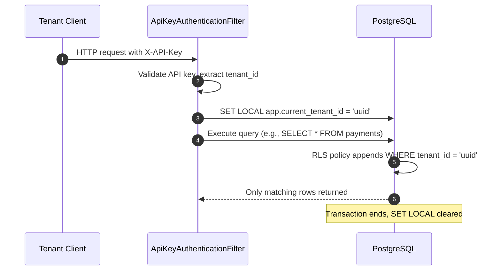
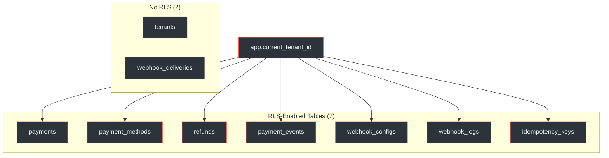
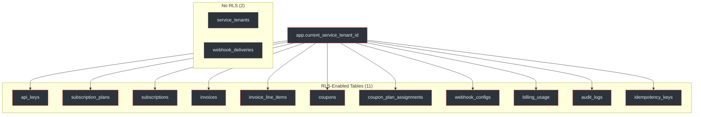
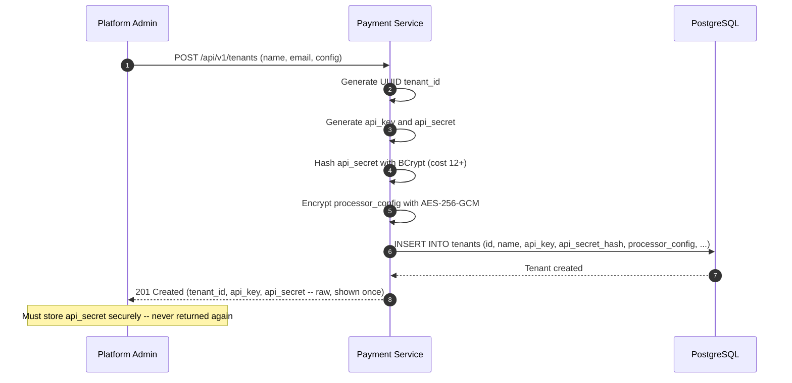
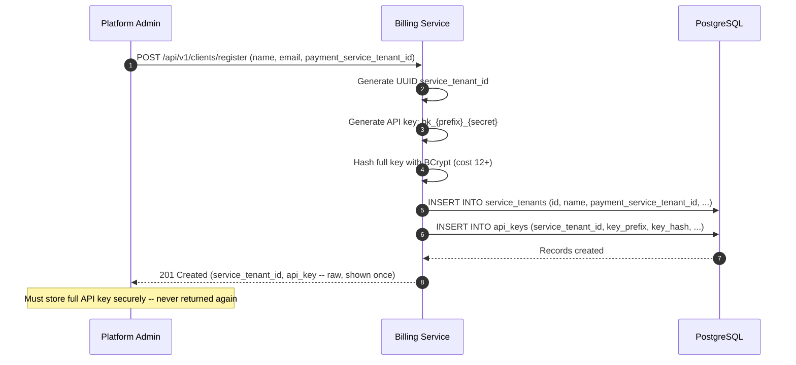
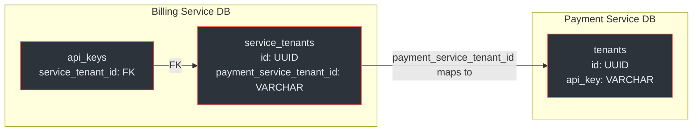

# Tenant Isolation

Multi-tenancy is the foundational security control of the Payment Gateway Platform. Every data access path is scoped to a single tenant via PostgreSQL Row-Level Security (RLS), ensuring that one tenant can never read, modify, or enumerate another tenant's data.

## At a Glance

| Attribute | Payment Service | Billing Service |
|---|---|---|
| **RLS variable** | `app.current_tenant_id` | `app.current_service_tenant_id` |
| **RLS-enabled tables** | 7 | 11 |
| **Tables without RLS** | 2 (`tenants`, `webhook_deliveries`) | 2 (`service_tenants`, `webhook_deliveries`) |
| **Tenant ID type** | `UUID` | `UUID` |
| **Session scoping** | `SET LOCAL` (transaction-bound) | `SET LOCAL` (transaction-bound) |
| **Tenant registration** | `POST /api/v1/tenants` | `POST /api/v1/clients/register` |
| **Cross-tenant response** | 404 Not Found (prevents enumeration) | 404 Not Found (prevents enumeration) |
| **Admin bypass** | DB role without RLS policy | DB role without RLS policy |

(docs/payment-service/database-schema-design.md:69-82, docs/billing-service/database-schema-design.md:72-89)

---

## How RLS Works

PostgreSQL Row-Level Security attaches filter predicates to every query on a table. When enabled, even a `SELECT *` returns only rows matching the policy. The platform uses session variables (`SET LOCAL`) to inject the tenant ID at the start of each request.



<!-- Sources: docs/payment-service/architecture-design.md:312-328, docs/payment-service/database-schema-design.md:69-78 -->

### Session Variable Mechanism

Both services use `SET LOCAL` to set the tenant context within a database transaction. The critical property of `SET LOCAL` is that the value is automatically cleared when the transaction ends, preventing any leakage between requests.

| Property | `SET LOCAL` | `SET` (regular) |
|---|---|---|
| **Scope** | Current transaction only | Current session (connection) |
| **Auto-clear** | <span class="ok">Yes, at COMMIT/ROLLBACK</span> | <span class="fail">No, persists on connection</span> |
| **Connection pool safe** | <span class="ok">Yes</span> | <span class="fail">No, leaks to next borrower</span> |
| **Used by platform** | <span class="ok">Yes</span> | <span class="fail">No</span> |

(docs/payment-service/database-schema-design.md:73-78, docs/billing-service/database-schema-design.md:76-82)

---

## Payment Service RLS

### RLS Policy Architecture

The Payment Service applies RLS to 7 of its 9 tables. Each policy follows an identical pattern: `SELECT`, `UPDATE`, and `DELETE` operations are filtered by `USING (tenant_id = current_setting('app.current_tenant_id')::uuid)`, and `INSERT` operations are checked by `WITH CHECK (tenant_id = current_setting('app.current_tenant_id')::uuid)`.



<!-- Sources: docs/payment-service/database-schema-design.md:69-82, docs/payment-service/database-schema-design.md:87-120 -->

### RLS Policy Detail per Table

| Table | SELECT | INSERT | UPDATE | DELETE | Policy Pattern |
|---|---|---|---|---|---|
| `payments` | <span class="ok">USING</span> | <span class="ok">WITH CHECK</span> | <span class="ok">USING</span> | <span class="ok">USING</span> | `tenant_id = current_setting('app.current_tenant_id')::uuid` |
| `payment_methods` | <span class="ok">USING</span> | <span class="ok">WITH CHECK</span> | <span class="ok">USING</span> | <span class="ok">USING</span> | Same |
| `refunds` | <span class="ok">USING</span> | <span class="ok">WITH CHECK</span> | <span class="ok">USING</span> | <span class="ok">USING</span> | Same |
| `payment_events` | <span class="ok">USING</span> | <span class="ok">WITH CHECK</span> | <span class="ok">USING</span> | <span class="ok">USING</span> | Same |
| `webhook_configs` | <span class="ok">USING</span> | <span class="ok">WITH CHECK</span> | <span class="ok">USING</span> | <span class="ok">USING</span> | Same |
| `webhook_logs` | <span class="ok">USING</span> | <span class="ok">WITH CHECK</span> | <span class="ok">USING</span> | <span class="ok">USING</span> | Same |
| `idempotency_keys` | <span class="ok">USING</span> | <span class="ok">WITH CHECK</span> | <span class="ok">USING</span> | <span class="ok">USING</span> | Same |

(docs/payment-service/database-schema-design.md:87-120)

### Why `tenants` Has No RLS

The `tenants` table is accessed exclusively by the authentication filter to look up API keys and resolve tenant context. It is not queryable by tenant-scoped application code. An admin database role (without RLS) is used for tenant management operations such as registration, suspension, and configuration changes.

(docs/payment-service/database-schema-design.md:69-72, docs/payment-service/architecture-design.md:340-345)

### Why `webhook_deliveries` Has No RLS

The `webhook_deliveries` table records individual delivery attempts for webhook events. It is accessed via a foreign key join from the RLS-protected `webhook_logs` table. Since queries always originate from tenant-scoped webhook log rows, the FK relationship provides implicit tenant scoping.

(docs/payment-service/database-schema-design.md:155-168)

---

## Billing Service RLS

### RLS Policy Architecture

The Billing Service applies RLS to 11 of its 13 tables, covering a broader surface area due to its subscription and invoicing model. The pattern is identical: `service_tenant_id = current_setting('app.current_service_tenant_id')::uuid`.



<!-- Sources: docs/billing-service/database-schema-design.md:72-89, docs/billing-service/database-schema-design.md:95-160 -->

### Special Case: `audit_logs` Policy

The `audit_logs` table has a unique RLS policy that differs from all other tables. System-level audit entries (e.g., schema migrations, background jobs) have a `NULL` `service_tenant_id`. The policy accommodates this:

```
USING (service_tenant_id = current_setting('app.current_service_tenant_id')::uuid
       OR service_tenant_id IS NULL)
```

This allows tenants to see system-wide audit entries alongside their own, without exposing other tenants' entries.

(docs/billing-service/database-schema-design.md:145-153)

### RLS Coverage Comparison

| Table | Payment Service | Billing Service | Notes |
|---|---|---|---|
| `payments` / -- | <span class="ok">RLS</span> | -- | PS only |
| `payment_methods` / -- | <span class="ok">RLS</span> | -- | PS only |
| `refunds` / -- | <span class="ok">RLS</span> | -- | PS only |
| `payment_events` / -- | <span class="ok">RLS</span> | -- | PS only |
| -- / `api_keys` | -- | <span class="ok">RLS</span> | BS only |
| -- / `subscription_plans` | -- | <span class="ok">RLS</span> | BS only |
| -- / `subscriptions` | -- | <span class="ok">RLS</span> | BS only |
| -- / `invoices` | -- | <span class="ok">RLS</span> | BS only |
| -- / `invoice_line_items` | -- | <span class="ok">RLS</span> | BS only |
| -- / `coupons` | -- | <span class="ok">RLS</span> | BS only |
| -- / `coupon_plan_assignments` | -- | <span class="ok">RLS</span> | BS only |
| -- / `billing_usage` | -- | <span class="ok">RLS</span> | BS only |
| -- / `audit_logs` | -- | <span class="ok">RLS</span> | Special NULL policy |
| `webhook_configs` | <span class="ok">RLS</span> | <span class="ok">RLS</span> | Both services |
| `webhook_logs` / -- | <span class="ok">RLS</span> | -- | PS only |
| `idempotency_keys` | <span class="ok">RLS</span> | <span class="ok">RLS</span> | Both services |
| `tenants` / `service_tenants` | <span class="warn">No RLS</span> | <span class="warn">No RLS</span> | Admin-only access |
| `webhook_deliveries` | <span class="warn">No RLS</span> | <span class="warn">No RLS</span> | FK-scoped via parent |

(docs/payment-service/database-schema-design.md:69-120, docs/billing-service/database-schema-design.md:72-160)

---

## Tenant Registration

### Payment Service Registration

Tenants register directly with the Payment Service via `POST /api/v1/tenants`. The response includes the API key and secret, which are the only time the raw secret is returned.



<!-- Sources: docs/payment-service/architecture-design.md:287-305, docs/shared/integration-guide.md:45-68 -->

### Billing Service Registration

The Billing Service uses a separate registration flow via `POST /api/v1/clients/register`. This creates a `service_tenants` record and an initial `api_keys` record.



<!-- Sources: docs/billing-service/architecture-design.md:265-289, docs/shared/integration-guide.md:112-138 -->

### Tenant Model Comparison

| Property | Payment Service | Billing Service |
|---|---|---|
| **Table** | `tenants` | `service_tenants` + `api_keys` |
| **Registration endpoint** | `POST /api/v1/tenants` | `POST /api/v1/clients/register` |
| **Key storage** | `api_key` + `api_secret_hash` in `tenants` | Separate `api_keys` table |
| **Multiple keys** | <span class="fail">No (single key pair)</span> | <span class="ok">Yes (multiple keys per tenant)</span> |
| **Key rotation** | Regenerate via admin API | Self-service via `POST /clients/{id}/api-keys/rotate` |
| **Cross-service link** | -- | `payment_service_tenant_id` column |
| **Config storage** | `processor_config` (AES-256-GCM encrypted) | Settings via subscription plan |

(docs/payment-service/database-schema-design.md:87-95, docs/billing-service/database-schema-design.md:95-118)

---

## Cross-Service Tenant Mapping

The Billing Service stores a `payment_service_tenant_id` column in the `service_tenants` table. This is the bridge that allows the Billing Service to initiate payment operations on behalf of its tenant via the Payment Service API.



<!-- Sources: docs/billing-service/database-schema-design.md:95-105, docs/billing-service/architecture-design.md:389-412 -->

### Cross-Service Payment Flow

When the Billing Service needs to collect a subscription payment, it uses the mapped `payment_service_tenant_id` to authenticate against the Payment Service. The `PaymentServiceClient` in the Billing Service constructs HMAC-signed requests using the stored PS credentials.

| Step | Actor | Action |
|---|---|---|
| 1 | Billing Service | Subscription billing cycle triggers |
| 2 | Billing Service | Looks up `payment_service_tenant_id` from `service_tenants` |
| 3 | Billing Service | Constructs HMAC-signed request using PS tenant credentials |
| 4 | Payment Service | Validates HMAC, resolves tenant, processes payment |
| 5 | Payment Service | Returns payment result |
| 6 | Billing Service | Updates invoice with payment reference |

(docs/billing-service/architecture-design.md:389-412, docs/shared/integration-guide.md:245-270)

---

## Security Guarantees

### Data Isolation Invariant

The combination of RLS policies and `SET LOCAL` scoping provides a formal isolation guarantee:

> **Invariant**: Given any authenticated request from tenant A, it is impossible for that request to read, write, or enumerate any data belonging to tenant B, regardless of the query constructed by the application code.

This guarantee holds because:

1. **RLS is enforced at the database level** -- application code cannot bypass it
2. **`SET LOCAL` is transaction-scoped** -- the tenant context cannot leak across requests via connection pooling
3. **Cross-tenant queries return empty results** -- the application surfaces this as a 404, preventing tenant ID enumeration
4. **No `SECURITY DEFINER` functions** expose tenant-crossing paths in the application schema

(docs/payment-service/compliance-security-guide.md:312-328, docs/billing-service/compliance-security-guide.md:268-282)

### Cross-Tenant Access Response

When a tenant attempts to access a resource belonging to another tenant (e.g., by guessing a payment UUID), the RLS policy filters out the row entirely. The application sees zero results and returns a 404 Not Found -- not a 403 Forbidden.

| Response | Implication |
|---|---|
| **404 Not Found** | <span class="ok">Does not confirm resource exists -- prevents enumeration</span> |
| **403 Forbidden** | <span class="fail">Confirms resource exists -- enables enumeration attacks</span> |

(docs/payment-service/architecture-design.md:350-358, docs/payment-service/compliance-security-guide.md:330-335)

---

## Admin Bypass

For platform administration (tenant onboarding, migrations, analytics), a separate database role operates without RLS policies. This role is never exposed to tenant-facing API endpoints.

| Property | Tenant Role | Admin Role |
|---|---|---|
| **RLS applied** | <span class="ok">Yes, always</span> | <span class="warn">No (bypassed)</span> |
| **Used by** | Application API endpoints | Admin tooling, migrations, analytics |
| **Connection pool** | Shared pool with `SET LOCAL` | Separate pool, no `SET LOCAL` |
| **Access scope** | Single tenant per transaction | All tenants |

(docs/payment-service/database-schema-design.md:69-72, docs/billing-service/database-schema-design.md:72-76)

---

## Related Pages

| Page | Description |
|---|---|
| [Security and Compliance Overview](./index) | Regulatory landscape, encryption architecture, PCI DSS, POPIA |
| [Authentication](./authentication) | HMAC-SHA256 vs API key authentication models, webhook verification |
| [Payment Service Schema](../../02-architecture/payment-service/schema) | Full table definitions, indexes, and constraints |
| [Billing Service Schema](../../02-architecture/billing-service/schema) | Full table definitions, indexes, and constraints |
| [Inter-Service Communication](../../02-architecture/inter-service-communication) | How PS and BS communicate, including tenant context propagation |
| [Provider Integrations](../provider-integrations) | Provider webhook verification and tenant scoping |
| [Correctness Invariants](../correctness-invariants) | Formal properties P2 (tenant isolation), B1 (billing isolation) |
| [Integration Quickstart](../../01-getting-started/integration-quickstart) | Getting started with API keys and authentication |
