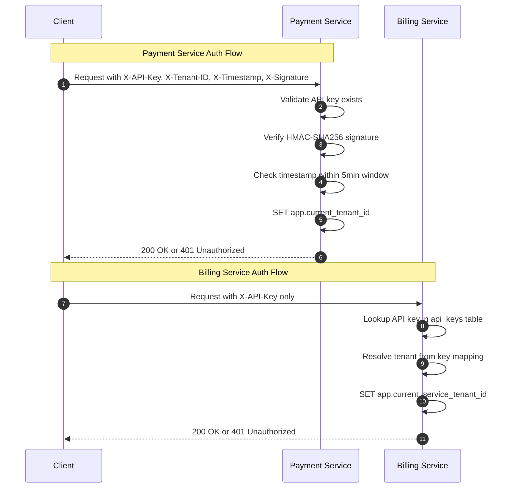
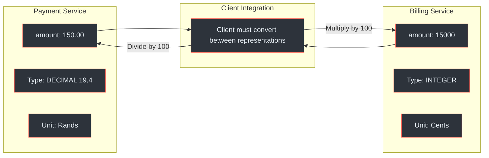
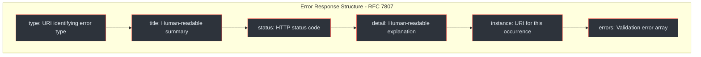
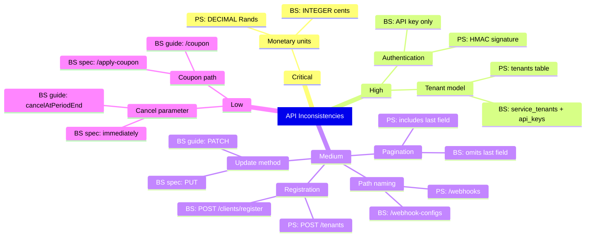
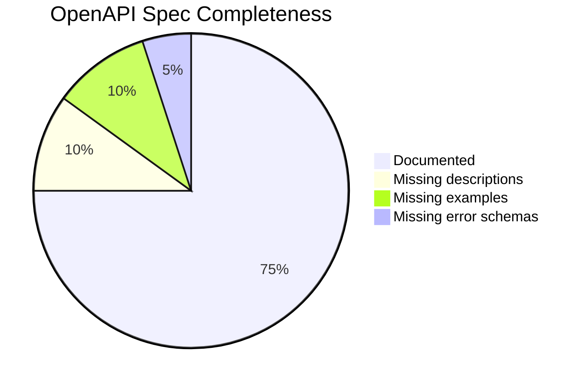
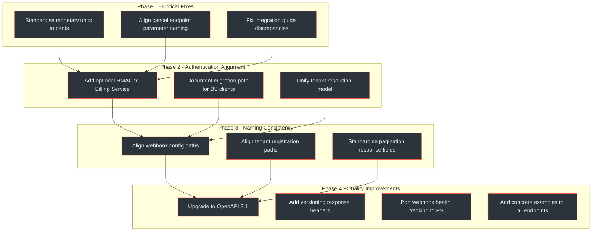

# API Review

<Icon name="mdi:api" /> Critical assessment of both service APIs against REST best practices, identifying inconsistencies, naming violations, and architectural misalignments that must be resolved before production launch.

## At-a-Glance Summary

| Finding | Severity | Service | Status |
|---|---|---|---|
| Monetary unit mismatch (major vs cents) | Critical | PS vs BS | Action Required |
| Authentication model divergence | High | PS vs BS | Monitor |
| Tenant registration path inconsistency | Medium | PS vs BS | Action Required |
| Webhook config path inconsistency | Medium | PS vs BS | Action Required |
| Pagination response field mismatch | Medium | PS vs BS | Action Required |
| Cancel endpoint parameter naming | Medium | BS | Action Required |
| Apply-coupon path inconsistency | Low | BS | Monitor |
| PUT vs PATCH update method inconsistency | Medium | BS | Action Required |
| Missing OpenAPI 3.1 upgrade | Low | Both | Monitor |
| Webhook health tracking gap | Low | PS | Monitor |

<!-- Sources: docs/payment-service/api-specification.yaml:1-20, docs/billing-service/api-specification.yaml:1-20 -->

## API Surface Comparison

| Dimension | Payment Service | Billing Service |
|---|---|---|
| Endpoint Count | ~20 | ~35 |
| OpenAPI Version | 3.0.3 | 3.0.3 |
| Base Path | `/api/v1` | `/api/v1` |
| Auth Model | HMAC (API Key + Signature) | API Key only |
| Tenant Header | `X-Tenant-ID` + `X-API-Key` | `X-API-Key` (tenant resolved) |
| Monetary Unit | Major units (Rands, e.g., 150.00) | Smallest unit (cents, e.g., 15000) |
| Amount Type | `DECIMAL(19,4)` | `INTEGER` |
| Idempotency | `X-Idempotency-Key` header | `X-Idempotency-Key` header |
| Pagination | `page`, `size`, `sort` + `last` field | `page`, `size`, `sort` (no `last` field) |
| Webhook Config | `POST /webhooks` | `POST /webhook-configs` |
| Client Registration | `POST /tenants` | `POST /clients/register` |
| Error Format | RFC 7807 Problem Details | RFC 7807 Problem Details |

<!-- Sources: docs/payment-service/api-specification.yaml:25-80, docs/billing-service/api-specification.yaml:25-100, docs/shared/integration-guide.md:60-120 -->

## Authentication Model Comparison

<!-- Sources: docs/shared/integration-guide.md:85-130, docs/payment-service/api-specification.yaml:30-50, docs/billing-service/api-specification.yaml:30-60 -->

### Assessment

| Aspect | PS | BS | Finding |
|---|---|---|---|
| Replay protection | Timestamp + signature | None | BS lacks replay protection |
| Key rotation | Single key per tenant | Multiple keys per tenant | BS is more flexible |
| Tenant identification | Explicit header | Derived from key | Different mental models |
| Signature verification | HMAC-SHA256 | Not applicable | Higher security in PS |

**Severity: High.** The authentication models are fundamentally different. A client integrating with both services must implement two completely different authentication strategies. (`docs/shared/integration-guide.md:85-130`)

**Recommendation:** Standardise on the PS HMAC model for both services. The BS approach of resolving tenant from API key is convenient but lacks replay protection. At minimum, add optional HMAC support to BS and document migration path.

## Monetary Unit Mismatch -- Critical Finding

<!-- Sources: docs/payment-service/database-schema-design.md:95, docs/billing-service/database-schema-design.md:100, docs/shared/integration-guide.md:150-165 -->

### The Problem

The Payment Service API accepts and returns monetary amounts in **major currency units** (e.g., `150.00` Rands), stored as `DECIMAL(19,4)`. The Billing Service API uses **smallest currency units** (e.g., `15000` cents), stored as `INTEGER`. (`docs/payment-service/database-schema-design.md:95`, `docs/billing-service/database-schema-design.md:100`)

This creates three risks:

1. **Client confusion** -- developers must remember which service uses which unit, leading to off-by-100x errors
2. **Inter-service communication bugs** -- when BS calls PS to process a payment, amount conversion must happen at the boundary
3. **Reporting inconsistency** -- aggregated reports spanning both services require normalisation

### Industry Standard

Stripe, Adyen, and most payment processors use **smallest currency unit (cents/pence)** as integers. This avoids floating-point precision issues and is the de facto standard.

**Severity: Critical.** This is the highest-priority finding in this review.

**Recommendation:** Standardise both services on **smallest currency unit (INTEGER cents)**. The Billing Service already follows industry convention. Migrate the Payment Service to match. This requires schema migration (`DECIMAL` to `INTEGER`), API contract update, and careful handling of multi-currency decimal places.

## REST Convention Compliance

### URL Naming Analysis

| Pattern | PS Example | BS Example | Convention | Status |
|---|---|---|---|---|
| Resource plurals | `/payments`, `/refunds` | `/subscriptions`, `/invoices` | Plural nouns | Consistent |
| Nested resources | `/payments/{id}/refund` | `/subscriptions/{id}/cancel` | Action sub-resource | Consistent |
| Registration | `/tenants` | `/clients/register` | Inconsistent naming | Divergent |
| Webhook config | `/webhooks` | `/webhook-configs` | Inconsistent naming | Divergent |
| Health check | `/actuator/health` | `/actuator/health` | Spring Boot standard | Consistent |
| Versioning | `/api/v1/...` | `/api/v1/...` | URL path versioning | Consistent |

<!-- Sources: docs/payment-service/api-specification.yaml:85-200, docs/billing-service/api-specification.yaml:100-350 -->

### HTTP Method Usage

| Operation | PS | BS | Correct |
|---|---|---|---|
| Create | POST | POST | Yes |
| Read | GET | GET | Yes |
| Full update | PUT | PUT | Yes |
| Partial update | Not specified | PUT (spec) / PATCH (guide) | BS inconsistent |
| Delete | DELETE | DELETE | Yes |
| Actions | POST (e.g., `/refund`) | POST (e.g., `/cancel`) | Yes |

The Billing Service API specification defines `PUT` for subscription updates, but the integration guide references `PATCH` semantics. (`docs/billing-service/api-specification.yaml:280-300`, `docs/shared/integration-guide.md:320-340`)

**Recommendation:** Decide on one approach: use `PATCH` with JSON Merge Patch (RFC 7396) for partial updates, `PUT` for full replacement. Document the choice in the API style guide.

## Error Response Standardisation

Both services use RFC 7807 Problem Details, which is the correct approach. (`docs/shared/integration-guide.md:200-240`)

<!-- Sources: docs/shared/integration-guide.md:200-240 -->

### Error Code Coverage

| HTTP Status | PS Usage | BS Usage | Notes |
|---|---|---|---|
| 400 Bad Request | Validation errors | Validation errors | Consistent |
| 401 Unauthorized | Invalid API key / signature | Invalid API key | Consistent |
| 403 Forbidden | Tenant mismatch | Tenant mismatch | Consistent |
| 404 Not Found | Resource not found | Resource not found | Consistent |
| 409 Conflict | Idempotency conflict, state conflict | Duplicate subscription | Consistent |
| 422 Unprocessable | Provider rejection | Business rule violation | Consistent |
| 429 Too Many Requests | Rate limit exceeded | Rate limit exceeded | Consistent |
| 500 Internal Server Error | Unexpected failure | Unexpected failure | Consistent |
| 502 Bad Gateway | Provider timeout/failure | PS communication failure | Consistent |

**Assessment:** Good. Error response standardisation is one of the strongest areas of API consistency between the two services.

## Idempotency Key Usage

Both services support the `X-Idempotency-Key` header for mutation operations. (`docs/shared/integration-guide.md:180-195`)

| Aspect | PS | BS |
|---|---|---|
| Header name | `X-Idempotency-Key` | `X-Idempotency-Key` |
| Required for | All POST (create/action) | All POST (create/action) |
| Key format | Client-generated UUID | Client-generated UUID |
| Cached in | Redis with TTL | Redis with TTL |
| Replay response | Returns original response | Returns original response |

**Assessment:** Good. Idempotency handling is consistent and follows industry best practices.

## Pagination Pattern Comparison

| Aspect | PS | BS |
|---|---|---|
| Parameters | `page`, `size`, `sort` | `page`, `size`, `sort` |
| Default page size | 20 | 20 |
| Max page size | 100 | 100 |
| Response includes `totalElements` | Yes | Yes |
| Response includes `totalPages` | Yes | Yes |
| Response includes `last` boolean | Yes | No |

The Payment Service includes a `last` boolean field in paginated responses to indicate the final page. The Billing Service omits this field, requiring clients to calculate it from `totalPages` and current page number. (`docs/payment-service/api-specification.yaml:150-170`, `docs/billing-service/api-specification.yaml:200-220`)

**Recommendation:** Add the `last` field to BS pagination responses for consistency, or remove it from PS. The field is convenient but redundant -- pick one approach and apply it uniformly.

## Cross-Service Inconsistency Catalogue

<!-- Sources: docs/payment-service/api-specification.yaml:1-1299, docs/billing-service/api-specification.yaml:1-1911, docs/shared/integration-guide.md:1-1316 -->

## Billing Service Internal Inconsistencies

The Billing Service has several discrepancies between its OpenAPI specification and the shared integration guide:

| Aspect | API Spec (`api-specification.yaml`) | Integration Guide | Resolution |
|---|---|---|---|
| Cancel subscription | `POST /subscriptions/{id}/cancel` with `immediately: true/false` | `cancelAtPeriodEnd: true/false` | Align parameter naming |
| Apply coupon | `POST /subscriptions/{id}/apply-coupon` | `POST /subscriptions/{id}/coupon` | Use `/apply-coupon` (more descriptive) |
| Update method | `PUT /subscriptions/{id}` | Mentions `PATCH` semantics | Choose one, document it |

(`docs/billing-service/api-specification.yaml:320-350`, `docs/shared/integration-guide.md:400-430`)

**Recommendation:** The OpenAPI spec is the source of truth. Update the integration guide to match. Establish a CI check that validates integration guide code samples against the OpenAPI spec.

## Webhook Configuration Gap

| Feature | PS Webhook Config | BS Webhook Config |
|---|---|---|
| URL | Yes | Yes |
| Events filter | Yes | Yes |
| Secret for signing | Yes | Yes |
| Active/inactive toggle | Yes | Yes |
| Failure count tracking | No | Yes |
| Last success timestamp | No | Yes |
| Last failure timestamp | No | Yes |
| Disabled-on-failure | No | Yes |

The Billing Service includes comprehensive webhook health tracking fields (`failure_count`, `last_success_at`, `last_failure_at`, automatic disabling after threshold). The Payment Service lacks these fields entirely. (`docs/billing-service/api-specification.yaml:400-440`, `docs/payment-service/api-specification.yaml:250-280`)

**Recommendation:** Port the BS webhook health tracking design to PS. Automatic disabling after repeated failures is essential for production reliability and prevents wasting resources on dead endpoints.

## API Versioning Strategy

Both services use URL path versioning (`/api/v1/...`), which is the most common and simplest approach. (`docs/payment-service/api-specification.yaml:10-15`, `docs/billing-service/api-specification.yaml:10-15`)

| Aspect | Assessment |
|---|---|
| Versioning method | URL path (`/api/v1`) -- Good |
| Version in response headers | Not specified -- Missing |
| Deprecation header support | Not specified -- Missing |
| Sunset header support | Not specified -- Missing |

**Recommendation:** Add `API-Version`, `Deprecation`, and `Sunset` response headers per RFC 8594. This enables graceful API evolution without breaking existing clients.

## OpenAPI Specification Quality

<!-- Sources: docs/payment-service/api-specification.yaml:1-50, docs/billing-service/api-specification.yaml:1-50 -->

| Quality Dimension | PS Spec | BS Spec |
|---|---|---|
| Schema definitions | Complete | Complete |
| Request body examples | Partial | Partial |
| Response examples | Partial | Good |
| Error response schemas | Generic | Generic |
| Security scheme definition | Defined | Defined |
| OpenAPI version | 3.0.3 | 3.0.3 |
| Description quality | Good | Good |
| Tags / grouping | Good | Good |

**Recommendation:** Upgrade both specs to **OpenAPI 3.1** for JSON Schema compatibility, webhooks-as-first-class-citizens, and `$ref` improvements. Add concrete request/response examples for every endpoint to improve developer experience and enable contract testing.

## Recommended API Harmonisation Plan

<!-- Sources: docs/payment-service/api-specification.yaml:1-1299, docs/billing-service/api-specification.yaml:1-1911 -->

## Findings Summary by Severity

| Severity | Count | Findings |
|---|---|---|
| Critical | 1 | Monetary unit mismatch (Rands vs cents) |
| High | 1 | Authentication model divergence (HMAC vs API key) |
| Medium | 5 | Tenant paths, webhook paths, pagination fields, PUT vs PATCH, cancel parameter |
| Low | 3 | Apply-coupon path, OpenAPI version, webhook health tracking gap |
| **Total** | **10** | |

## Related Pages

| Page | Description |
|---|---|
| [Platform Overview](../01-getting-started/platform-overview) | System context and service boundaries |
| [Payment Service API](../02-architecture/payment-service/api) | Full PS endpoint documentation |
| [Billing Service API](../02-architecture/billing-service/api) | Full BS endpoint documentation |
| [Authentication](../03-deep-dive/security-compliance/authentication) | HMAC and API key authentication deep dive |
| [Inter-Service Communication](../02-architecture/inter-service-communication) | How PS and BS exchange data |
| [Tech Stack Review](./tech-stack-review) | Companion review assessing technology choices |
