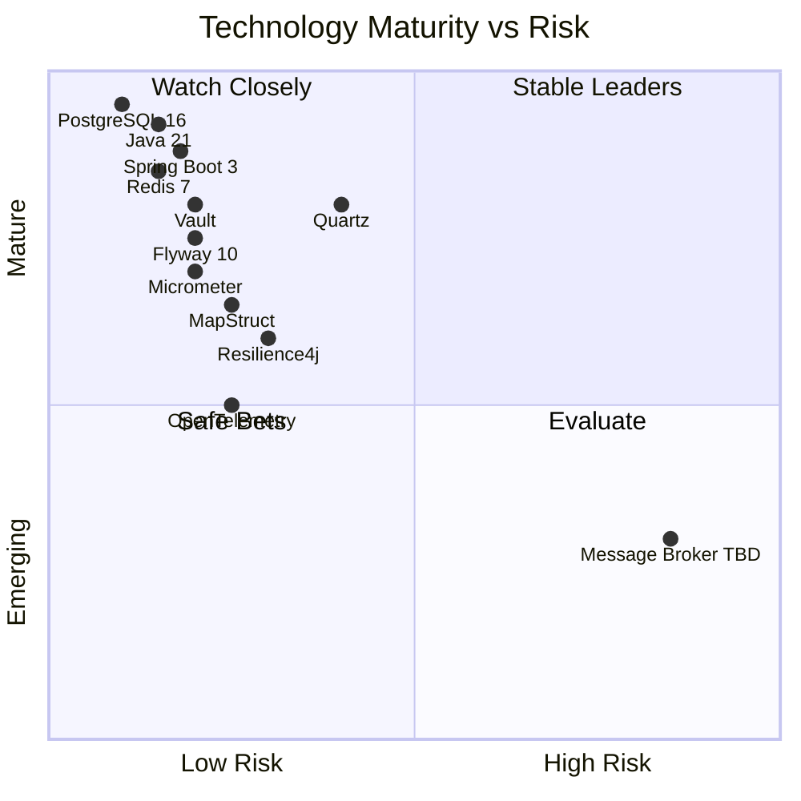
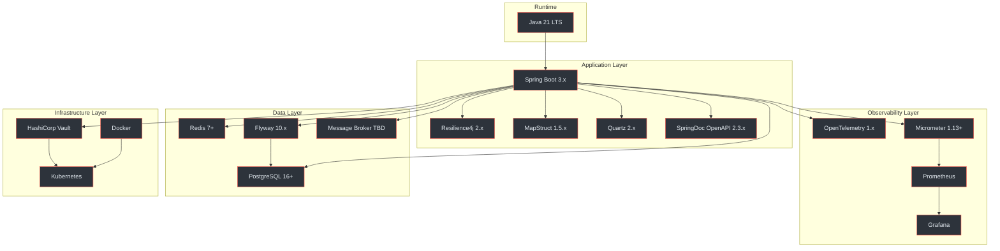
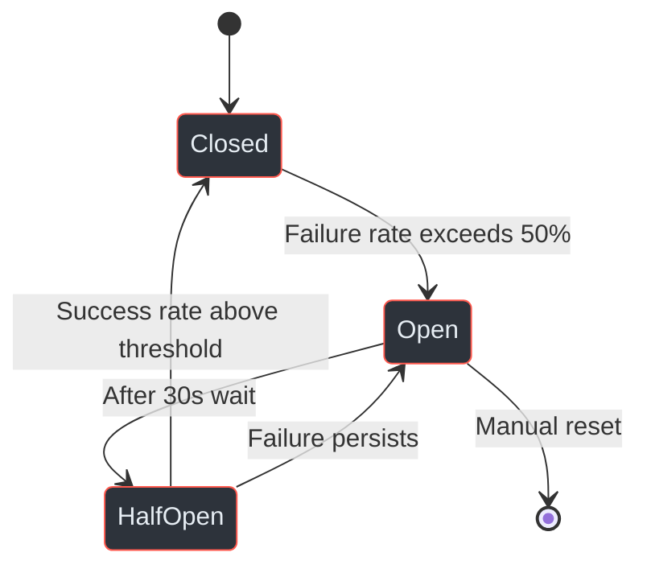
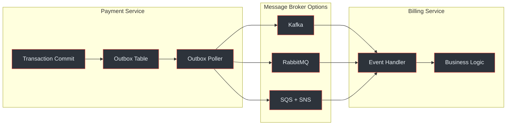
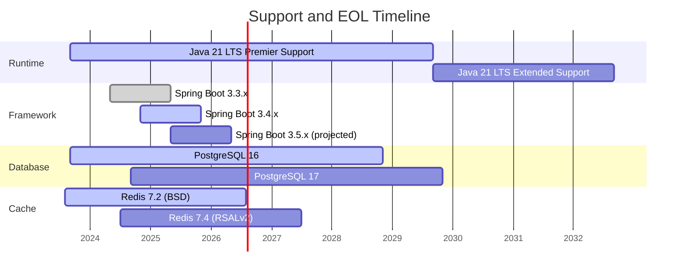

# Technology Stack Review

<Icon name="mdi:layers-triple" /> Comprehensive evaluation of every technology planned for the Payment Gateway Platform, covering version currency, end-of-life risk, community health, and actionable upgrade recommendations.

## At-a-Glance Summary

| Category | Technology | Planned Version | Latest Stable | Status | Risk |
|---|---|---|---|---|---|
| Runtime | Java (Temurin) | 21 LTS | 21.0.5 | Current | Low |
| Framework | Spring Boot | 3.x | 3.4.1 | Current | Low |
| Database | PostgreSQL | 16+ | 17.2 | Current | Low |
| Cache | Redis | 7+ | 7.4.2 | Current | Low |
| Migrations | Flyway | 10.x | 10.22 | Current | Low |
| Mapping | MapStruct | 1.5.x | 1.6.3 | Monitor | Low |
| Resilience | Resilience4j | 2.x | 2.2.0 | Current | Low |
| Scheduling | Quartz | 2.x | 2.5.0-rc1 | Monitor | Medium |
| Observability | Micrometer | 1.13+ | 1.14.3 | Current | Low |
| Tracing | OpenTelemetry | 1.x | 1.45.0 | Current | Low |
| API Docs | SpringDoc OpenAPI | 2.3.x | 2.7.0 | Monitor | Low |
| Build | Maven | 3.9.x | 3.9.9 | Current | Low |
| Containers | Docker + K8s | Latest | Latest | Current | Low |
| Secrets | HashiCorp Vault | Latest | 1.18.3 | Current | Low |
| Messaging | TBD | -- | -- | Action Required | High |
| Testing | JUnit 5 + Testcontainers | 5.11 / 1.20 | 5.11.4 / 1.20.4 | Current | Low |

<!-- Sources: docs/shared/system-architecture.md:1-50, docs/shared/integration-guide.md:1-30 -->

## Technology Maturity Map

<!-- Sources: docs/shared/system-architecture.md:45-120 -->

## Dependency Relationships

<!-- Sources: docs/shared/system-architecture.md:45-180 -->

## Detailed Assessments

### Java 21 LTS

| Attribute | Detail |
|---|---|
| Planned Version | 21 LTS (Temurin) |
| Latest Stable | 21.0.5 (LTS), 23.0.1 (non-LTS latest) |
| EOL Date | September 2029 (Premier Support) |
| Release Cadence | 6-month feature releases, LTS every 2 years |
| Community Health | Excellent -- largest enterprise ecosystem |

**Key Advantages for This Project:**

- **Virtual Threads (Project Loom)** -- critical for payment processing where I/O-bound operations dominate. Each payment provider call, database query, and webhook delivery can use a virtual thread without pooling overhead. (`docs/shared/system-architecture.md:48`)
- **Structured Concurrency** (preview) -- useful for fan-out webhook deliveries
- **Record Patterns** and **Pattern Matching** -- cleaner domain model code
- **ZGC generational mode** -- sub-millisecond GC pauses for latency-sensitive payment flows

**Recommendation:** No action required. Java 21 is the correct choice. Ensure the team pins to Temurin 21.0.5+ and configures `--enable-preview` only in non-production if using structured concurrency.

### Spring Boot 3.x

| Attribute | Detail |
|---|---|
| Planned Version | 3.x (likely 3.3 or 3.4) |
| Latest Stable | 3.4.1 |
| EOL Date | 3.3.x supported until May 2025; 3.4.x until Nov 2025 |
| Release Cadence | Minor every 6 months, patch monthly |
| Community Health | Excellent -- dominant Java framework |

**Key Advantages for This Project:**

- Native GraalVM compilation support (future optimisation for cold starts)
- Built-in Micrometer and OpenTelemetry auto-configuration (`docs/shared/system-architecture.md:85-90`)
- Spring Data JPA with PostgreSQL dialect optimisations
- Spring Security for HMAC signature validation and API key authentication

**Recommendation:** No action required. Target Spring Boot 3.4.x for the longest support window. The modular monolith architecture described in the architecture docs aligns well with Spring's component model. (`docs/payment-service/architecture-design.md:15-25`)

### PostgreSQL 16+

| Attribute | Detail |
|---|---|
| Planned Version | 16+ |
| Latest Stable | 17.2 |
| EOL Date | PG 16: November 2028; PG 17: November 2029 |
| Release Cadence | Major annually, minor quarterly |
| Community Health | Excellent -- most advanced open-source RDBMS |

**Key Features Used by This Project:**

- **Row-Level Security (RLS)** -- enforces tenant isolation at the database level, with `SET app.current_tenant_id` for PS and `SET app.current_service_tenant_id` for BS (`docs/payment-service/database-schema-design.md:35-50`, `docs/billing-service/database-schema-design.md:40-55`)
- **JSONB columns** -- provider-specific metadata storage in `payment_transactions.provider_response` and `payment_transactions.metadata` (`docs/payment-service/database-schema-design.md:120-140`)
- **Partial indexes** -- optimised queries on status columns for active subscriptions and pending transactions
- **DECIMAL(19,4)** precision for PS monetary amounts; **INTEGER** for BS cents-based amounts (`docs/payment-service/database-schema-design.md:95`, `docs/billing-service/database-schema-design.md:100`)

**Recommendation:** No action required. Consider targeting PostgreSQL 17 directly for improved JSON_TABLE support, incremental sort improvements, and better MERGE performance. The 5-year support window provides ample runway.

### Redis 7+

| Attribute | Detail |
|---|---|
| Planned Version | 7+ |
| Latest Stable | 7.4.2 |
| EOL Date | Community: rolling; Enterprise: per contract |
| Licence Change | Redis 7.4+ uses RSALv2 + SSPLv1 (not OSI-approved) |
| Community Health | Changed -- Valkey fork gaining traction |

**Key Features Used by This Project:**

- Idempotency key caching with TTL (`docs/shared/integration-guide.md:180-195`)
- Rate limiting with sliding window counters
- Circuit breaker state sharing across instances
- Session/token caching for API key lookups

**Recommendation:** Monitor. The licence change from BSD to dual RSALv2/SSPL in Redis 7.4 is significant. Evaluate **Valkey** (Linux Foundation fork, API-compatible, BSD-licenced) as a drop-in replacement. For now, Redis 7.2.x (last BSD-licenced version) is safe, but plan a decision by Q2 2025. (`docs/shared/system-architecture.md:62-68`)

### Flyway 10.x

| Attribute | Detail |
|---|---|
| Planned Version | 10.x |
| Latest Stable | 10.22.0 |
| Licence | Apache 2.0 (Community), Commercial (Teams/Enterprise) |
| Community Health | Good -- standard for JVM migrations |

**Recommendation:** No action required. Flyway 10 is the correct choice for PostgreSQL migrations. Ensure versioned migrations follow `V{version}__{description}.sql` naming. Both PS and BS schema designs reference Flyway for DDL management. (`docs/payment-service/database-schema-design.md:1-15`, `docs/billing-service/database-schema-design.md:1-15`)

### MapStruct 1.5.x

| Attribute | Detail |
|---|---|
| Planned Version | 1.5.x |
| Latest Stable | 1.6.3 |
| Release Cadence | Infrequent (months between releases) |
| Community Health | Good -- compile-time mapping is niche but stable |

**Recommendation:** Monitor. Upgrade to 1.6.x for Java 21 record support and improved Spring integration. The 1.5.x line will not receive new features. (`docs/shared/system-architecture.md:55`)

### Resilience4j 2.x

| Attribute | Detail |
|---|---|
| Planned Version | 2.x |
| Latest Stable | 2.2.0 |
| Community Health | Moderate -- maintenance mode, fewer contributors |

**Key Usage in This Project:**

The architecture documents specify Resilience4j circuit breakers wrapping all payment provider calls with a 50% failure rate threshold, 30-second open-state duration, and 10-call sliding window. (`docs/payment-service/architecture-design.md:310-330`)

<!-- Sources: docs/payment-service/architecture-design.md:310-330, docs/shared/system-architecture.md:75-85 -->

**Recommendation:** No action required for now, but monitor the project's activity. If maintenance stalls, consider Spring Cloud Circuit Breaker as an abstraction layer that can swap implementations.

### Quartz 2.x

| Attribute | Detail |
|---|---|
| Planned Version | 2.x |
| Latest Stable | 2.5.0-rc1 (2.3.2 stable) |
| Last Stable Release | December 2019 (2.3.2) |
| Community Health | Low activity -- minimal updates since 2019 |

**Usage:** Scheduled jobs for subscription renewals, invoice generation, dunning retries, and webhook cleanup in the Billing Service. (`docs/billing-service/architecture-design.md:250-270`)

**Recommendation:** Monitor. Quartz has not had a stable release since 2019. For a greenfield project, evaluate **Spring Scheduler** with ShedLock for distributed locking, or **Jobrunr** (active development, virtual thread support). If Quartz is retained, ensure JDBC job store is configured for cluster-safe execution.

### Observability Stack

| Component | Planned | Latest | Status |
|---|---|---|---|
| Micrometer | 1.13+ | 1.14.3 | Current |
| OpenTelemetry Java Agent | 1.x | 1.45.0 | Current |
| Prometheus | Latest | 2.55.1 | Current |
| Grafana | Latest | 11.4.0 | Current |

The architecture specifies a comprehensive observability approach: Micrometer for metrics, OpenTelemetry for distributed tracing, and structured JSON logging. (`docs/shared/system-architecture.md:85-110`)

**Recommendation:** No action required. This is a well-chosen, modern observability stack. Ensure correlation IDs propagate across both services via OpenTelemetry context. (`docs/shared/integration-guide.md:45-60`)

### SpringDoc OpenAPI 2.3.x

| Attribute | Detail |
|---|---|
| Planned Version | 2.3.x |
| Latest Stable | 2.7.0 |
| Community Health | Good -- active development |

**Recommendation:** Monitor. Upgrade to 2.7.x for improved Spring Boot 3.4 compatibility and OpenAPI 3.1 support. The current API specifications use OpenAPI 3.0.3 format. (`docs/payment-service/api-specification.yaml:1-5`, `docs/billing-service/api-specification.yaml:1-5`)

### Maven 3.9.x

| Attribute | Detail |
|---|---|
| Planned Version | 3.9.x |
| Latest Stable | 3.9.9; Maven 4.0.0-rc1 available |
| Community Health | Stable |

The project uses a multi-module Maven structure for the modular monolith architecture. (`docs/shared/system-architecture.md:130-145`)

**Recommendation:** No action required. Stay on 3.9.x for stability. Maven 4.0 is not yet GA and introduces breaking POM model changes. Evaluate Maven 4 adoption after GA release.

### Docker + Kubernetes

| Attribute | Detail |
|---|---|
| Docker | Latest stable |
| Kubernetes | Latest stable |
| Community Health | Excellent -- industry standard |

Both services are containerised with multi-stage Docker builds and deployed to Kubernetes with Helm charts. (`docs/shared/system-architecture.md:150-180`)

**Recommendation:** No action required. Ensure distroless or Eclipse Temurin slim base images for minimal attack surface. Pin base image digests in production Dockerfiles.

### HashiCorp Vault

| Attribute | Detail |
|---|---|
| Planned Version | Latest |
| Latest Stable | 1.18.3 |
| Licence Change | BSL 1.1 since Vault 1.14 (August 2023) |
| Community Health | Changed -- OpenBao fork emerging |

**Usage:** API key storage, payment provider credentials, database credential rotation, TLS certificate management. (`docs/shared/system-architecture.md:170-185`, `docs/shared/integration-guide.md:85-100`)

**Recommendation:** Monitor. The BSL licence change may impact self-hosted deployments. Evaluate **OpenBao** (Linux Foundation fork) for fully open-source Vault compatibility. For managed deployments (HCP Vault), the licence change has no operational impact.

### Message Broker -- Decision Required

| Option | Strengths | Weaknesses | Fit |
|---|---|---|---|
| Apache Kafka | Durable log, replay, high throughput | Operational complexity, overkill for event volume | Over-engineered |
| RabbitMQ | Flexible routing, mature, low latency | No native log replay, clustering complexity | Good fit |
| Amazon SQS | Fully managed, no ops burden | AWS lock-in, no fan-out without SNS, 256KB limit | Cloud-locked |

The architecture documents identify a message broker as TBD for inter-service communication, specifically for the transactional outbox pattern delivering domain events between Payment Service and Billing Service. (`docs/shared/system-architecture.md:95-110`, `docs/billing-service/architecture-design.md:180-200`)

<!-- Sources: docs/shared/system-architecture.md:95-110, docs/billing-service/architecture-design.md:180-200 -->

**Recommendation:** Action Required. For this project's event volume (payment lifecycle events, subscription state changes), **RabbitMQ** is the recommended choice. It provides the routing flexibility needed for domain event fan-out without Kafka's operational overhead. If the platform is AWS-only, consider SQS+SNS but accept the vendor lock-in trade-off. This decision blocks the inter-service communication implementation.

### Testing Stack

| Component | Version | Purpose |
|---|---|---|
| JUnit 5 | 5.11.x | Test framework |
| Testcontainers | 1.20.x | Integration test infrastructure |
| WireMock | 3.x | Payment provider API mocking |
| jqwik | 1.9.x | Property-based testing |
| ArchUnit | 1.3.x | Architecture rule enforcement |

**Recommendation:** No action required. This is an excellent testing stack. Testcontainers with PostgreSQL and Redis modules will validate RLS policies and caching behaviour in integration tests. WireMock is essential for simulating payment provider responses. (`docs/shared/system-architecture.md:115-130`)

## EOL Timeline

<!-- Sources: docs/shared/system-architecture.md:45-120, community release schedules -->

## Risk Matrix

| Risk | Likelihood | Impact | Mitigation |
|---|---|---|---|
| Message broker decision delayed | High | High | Schedule ADR session, deadline Q1 2025 |
| Redis licence incompatibility | Medium | Medium | Evaluate Valkey as drop-in replacement |
| Quartz maintenance abandonment | Medium | Low | Plan migration path to Spring Scheduler + ShedLock |
| Vault BSL licence concern | Low | Medium | Monitor OpenBao maturity; use HCP Vault for managed option |
| MapStruct 1.5.x lacking Java 21 records | Low | Low | Upgrade to 1.6.x in next dependency refresh |
| Spring Boot 3.3 EOL (May 2025) | Medium | Medium | Target 3.4.x from project start |

## Upgrade Priority Roadmap

| Priority | Action | Timeline | Effort |
|---|---|---|---|
| P0 -- Critical | Select message broker (Kafka / RabbitMQ / SQS) | Immediate | ADR + PoC (1-2 weeks) |
| P1 -- High | Target Spring Boot 3.4.x (not 3.3) | Project start | Low (config change) |
| P1 -- High | Evaluate Valkey vs Redis 7.2 vs Redis 7.4 | Q1 2025 | PoC (1 week) |
| P2 -- Medium | Upgrade MapStruct to 1.6.x | Next sprint | Low |
| P2 -- Medium | Upgrade SpringDoc to 2.7.x | Next sprint | Low |
| P3 -- Low | Evaluate Quartz alternatives | Q2 2025 | ADR (2 days) |
| P3 -- Low | Monitor Vault / OpenBao landscape | Ongoing | None |

## Related Pages

| Page | Description |
|---|---|
| [Platform Overview](../01-getting-started/platform-overview) | High-level architecture and technology context |
| [Payment Service Schema](../02-architecture/payment-service/schema) | PostgreSQL schema using DECIMAL monetary amounts |
| [Billing Service Schema](../02-architecture/billing-service/schema) | PostgreSQL schema using INTEGER cents amounts |
| [Inter-Service Communication](../02-architecture/inter-service-communication) | Message broker usage and event flow |
| [Observability](../03-deep-dive/observability) | Micrometer, OpenTelemetry, and monitoring setup |
| [API Review](./api-review) | Companion review assessing REST API quality |
