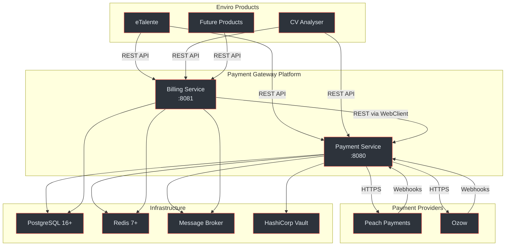
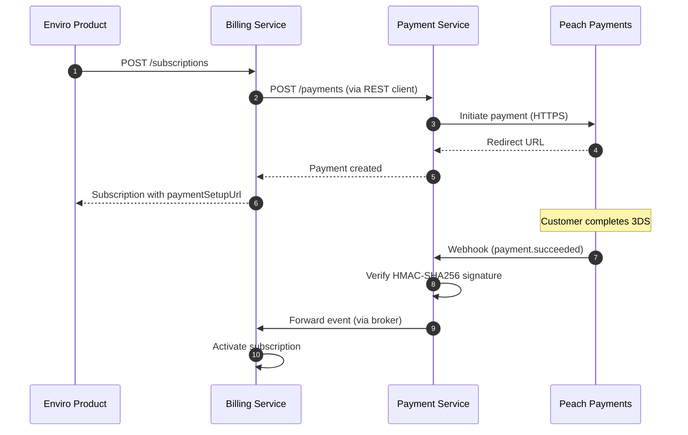
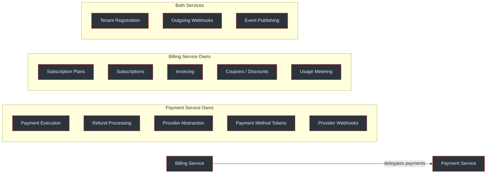

# Payment Gateway Platform

Enviro's centralised payment processing and subscription billing platform, designed for the South African market with built-in PCI DSS SAQ-A, POPIA, 3D Secure, and SARB compliance.

## At a Glance

| Attribute | Value |
|:----------|:------|
| **Services** | Payment Service (:8080) + Billing Service (:8081) |
| **Target Market** | South Africa (ZAR default) |
| **Compliance** | PCI DSS SAQ-A, POPIA, 3DS, SARB |
| **Providers** | Peach Payments (card, BNPL, wallet, QR), Ozow (EFT) |
| **Architecture** | Hexagonal / Ports-and-Adapters per service |
| **Database** | PostgreSQL 16+ with Row-Level Security |
| **Runtime** | Java 21 (virtual threads), Spring Boot 3.x |
| **Event System** | Transactional outbox + message broker + HTTP webhooks |
| **Current State** | <Badge type="warning" text="Design Phase" /> |

<!-- Sources: docs/shared/system-architecture.md:1-54, docs/shared/integration-guide.md:1-80 -->

## Architecture Overview

<!-- Sources: docs/shared/system-architecture.md:60-94 -->

## Documentation Map

| Section | Pages | Description |
|:--------|:-----:|:------------|
| [Onboarding](/onboarding/contributor) | 4 | Audience-tailored guides for contributors, staff engineers, executives, and PMs |
| [Getting Started](/01-getting-started/platform-overview) | 3 | Platform overview, integration quickstart, environment setup |
| [Architecture](/02-architecture/payment-service/) | 9 | Service internals, database schemas, API references, event system |
| [Deep Dive](/03-deep-dive/provider-integrations) | 9 | Provider integrations, security, data flows, correctness, observability |
| [Reviews](/04-reviews/tech-stack-review) | 2 | Tech stack and API quality assessments |

## Tech Stack

| Technology | Version | Purpose | Source |
|:-----------|:--------|:--------|:-------|
| Java | 21 | Runtime with virtual threads | (docs/shared/system-architecture.md:33) |
| Spring Boot | 3.x | Application framework | (docs/shared/system-architecture.md:34) |
| PostgreSQL | 16+ | Primary database with RLS | (docs/shared/system-architecture.md:38) |
| Redis | 7+ | Cache, rate limiting, idempotency | (docs/shared/system-architecture.md:40) |
| Flyway | Latest | Database migrations | (docs/shared/system-architecture.md:42) |
| Resilience4j | Latest | Circuit breakers, retry, rate limiting | (docs/payment-service/architecture-design.md:230) |
| MapStruct | Latest | DTO mapping | (docs/shared/system-architecture.md:44) |
| Quartz | Latest | Scheduled billing jobs | (docs/billing-service/architecture-design.md:650) |
| OpenTelemetry | Latest | Distributed tracing | (docs/shared/system-architecture.md:350) |
| Micrometer | Latest | Metrics collection (Prometheus) | (docs/shared/system-architecture.md:340) |
| Message Broker | TBD | Event streaming (Kafka/RabbitMQ/SQS) | (docs/shared/system-architecture.md:46) |
| HashiCorp Vault | Latest | Secret management | (docs/shared/system-architecture.md:48) |

<!-- Sources: docs/shared/system-architecture.md:33-54 -->

## Key Design Documents

| Document | Lines | Content | Source |
|:---------|------:|:--------|:-------|
| System Architecture | 623 | Platform-level design, deployment topology | (docs/shared/system-architecture.md:1) |
| Integration Guide | 1316 | Client onboarding, auth, webhooks, error handling | (docs/shared/integration-guide.md:1) |
| Correctness Properties | 867 | 23 formal invariants with jqwik test specs | (docs/shared/correctness-properties.md:1) |
| PS Architecture Design | - | Hexagonal layers, provider SPI, outbox pattern | (docs/payment-service/architecture-design.md:1) |
| PS Database Schema | - | 9 tables, RLS, AES-256 encryption | (docs/payment-service/database-schema-design.md:1) |
| PS API Specification | 663 | OpenAPI 3.0.3, 20+ endpoints | (docs/payment-service/api-specification.yaml:1) |
| PS Provider Guide | - | Peach Payments, Ozow, adding new providers | (docs/payment-service/provider-integration-guide.md:1) |
| BS Architecture Design | - | Services, scheduling, payment client integration | (docs/billing-service/architecture-design.md:1) |
| BS Database Schema | - | 13 tables, RLS, audit logs | (docs/billing-service/database-schema-design.md:1) |
| BS API Specification | 1081 | OpenAPI 3.0.3, 35+ endpoints | (docs/billing-service/api-specification.yaml:1) |

## Core Payment Flow

<!-- Sources: docs/shared/system-architecture.md:60-94, docs/shared/integration-guide.md:80-160 -->

## Service Boundary Summary

<!-- Sources: docs/shared/system-architecture.md:96-106 -->

> [!IMPORTANT]
> This platform is currently in the **design phase**. All documentation is derived from 14 design documents -- no source code exists yet. The wiki serves as the canonical reference for implementation.
