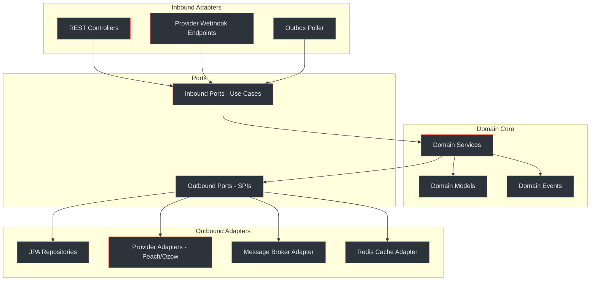
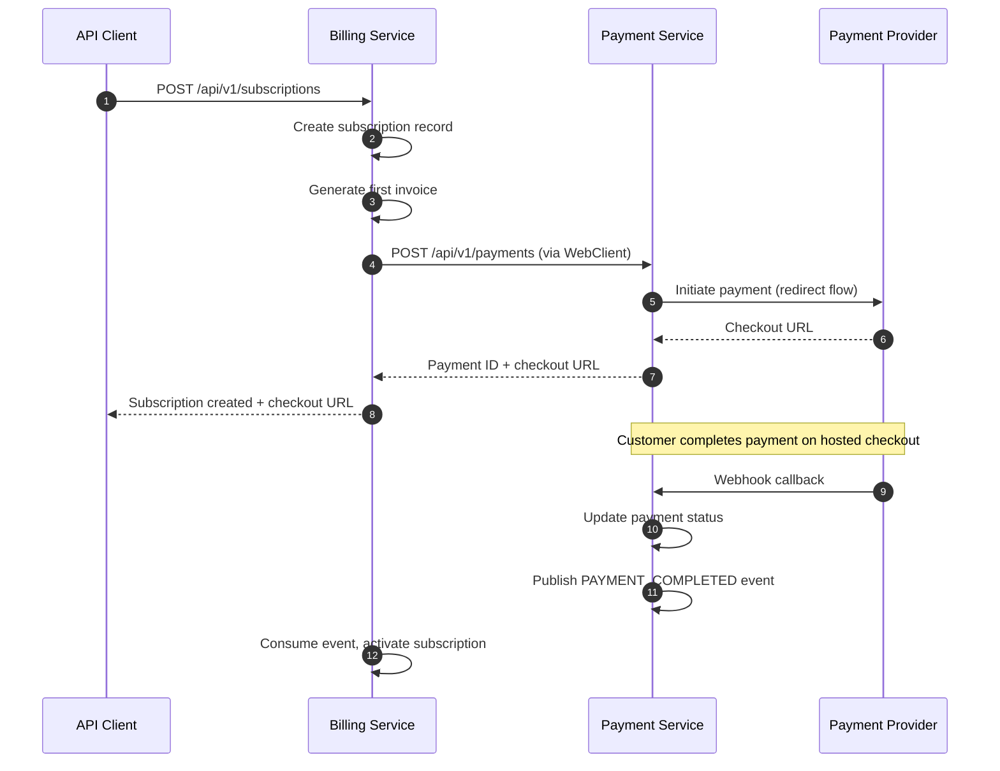
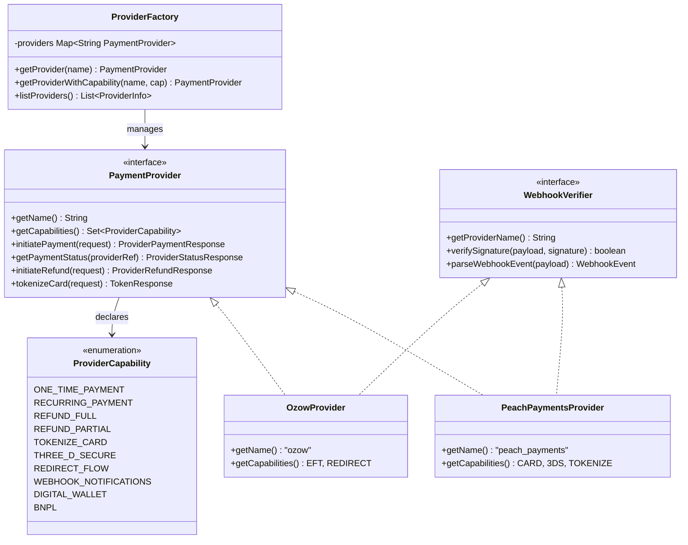
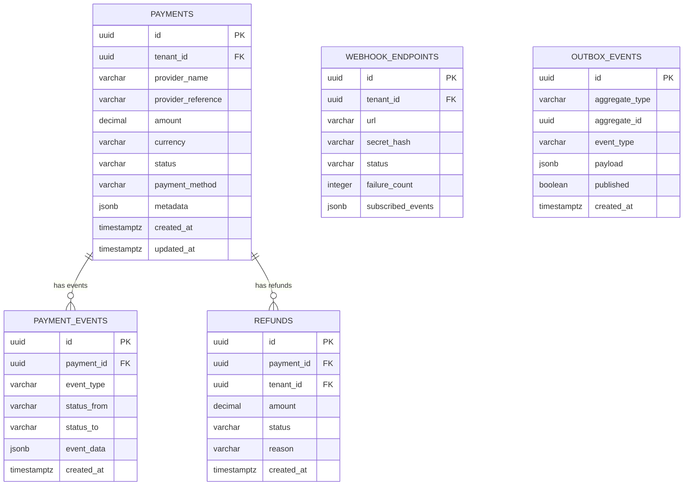
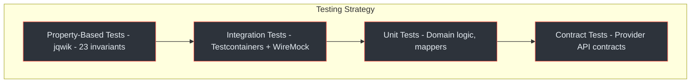

# <Icon name="code" /> Contributor Guide

This guide helps new developers get productive on the Payment Gateway Platform. It covers the planned technology stack, hexagonal architecture, provider integration pattern, database conventions, and property-based testing strategy.

## At a Glance

| Aspect | Detail |
|---|---|
| **Services** | Payment Service (port 8080) + Billing Service (port 8081) |
| **Language** | Java 21 (virtual threads, records, sealed interfaces, pattern matching) |
| **Framework** | Spring Boot 3.x with Spring WebFlux (Payment) and Spring MVC (Billing) |
| **Database** | PostgreSQL 16+ with Flyway 10.x migrations |
| **Cache** | Redis 7+ (idempotency keys, rate limiting, distributed locks) |
| **Build** | Gradle with multi-module layout |
| **Testing** | jqwik property-based testing, Testcontainers, WireMock |
| **Observability** | OpenTelemetry, Micrometer, structured JSON logging |
| **Architecture** | Hexagonal (Payment Service), Layered (Billing Service) |
| **Multi-tenancy** | Shared DB + shared schema + RLS via `tenant_id` column |

## <Icon name="layers" /> Technology Stack

The platform targets Java 21 on Spring Boot 3.x with a PostgreSQL 16+ data layer. Each technology was chosen for a specific reason relevant to South African payment processing.

### Core Runtime

| Technology | Version | Purpose |
|---|---|---|
| Java | 21 LTS | Virtual threads, records, sealed interfaces, pattern matching |
| Spring Boot | 3.x | Auto-configuration, dependency injection, actuator |
| Spring WebFlux | 3.x | Non-blocking I/O for provider HTTP calls (Payment Service) |
| Spring MVC | 3.x | Traditional request-response (Billing Service) |
| PostgreSQL | 16+ | ACID transactions, JSONB, Row-Level Security |
| Redis | 7+ | Idempotency cache, rate limiting, distributed locks |
| Flyway | 10.x | Versioned database migrations |
| MapStruct | 1.5.x | Compile-time DTO mapping (zero reflection) |

<!-- Sources: docs/shared/system-architecture.md:10-45 -->

### Resilience and Scheduling

| Technology | Version | Purpose |
|---|---|---|
| Resilience4j | 2.x | Circuit breaker, retry, rate limiter per payment provider |
| Quartz | 2.x | Cron-scheduled jobs (renewal, trial expiry, invoice generation) |
| OpenTelemetry | 1.x | Distributed tracing across both services |
| Micrometer | 1.x | Metrics export (Prometheus format) |

<!-- Sources: docs/payment-service/architecture-design.md:48-72 -->

### Testing Stack

| Technology | Purpose |
|---|---|
| jqwik | Property-based testing — 23 correctness invariants |
| Testcontainers | Disposable PostgreSQL and Redis for integration tests |
| WireMock | Stub external provider APIs (Peach Payments, Ozow) |
| REST Assured | HTTP-level API testing |

<!-- Sources: docs/shared/correctness-properties.md:1-30 -->

## <Icon name="hexagon" /> Architecture Overview

The Payment Service uses a **hexagonal (ports and adapters) architecture**. The Billing Service uses a **layered architecture** and is a REST client of the Payment Service.

### Hexagonal Layer Structure



<!-- Sources: docs/payment-service/architecture-design.md:85-160 -->

### Package Structure — Payment Service

```
com.enviro.payment/
  adapter/
    in/
      rest/           # REST controllers (inbound adapter)
      webhook/        # Provider webhook endpoints
    out/
      persistence/    # JPA repositories, entities
      provider/       # Provider HTTP clients (Peach, Ozow)
      broker/         # Message broker publisher
      cache/          # Redis operations
  application/
    port/
      in/             # Inbound ports (use case interfaces)
      out/            # Outbound ports (SPI interfaces)
    service/          # Application services (orchestration)
  domain/
    model/            # Domain entities, value objects
    event/            # Domain event definitions
  config/             # Spring configuration, security, OpenAPI
  common/             # Shared utilities, exceptions, constants
```

<!-- Sources: docs/payment-service/architecture-design.md:162-210 -->

### Package Structure — Billing Service

```
com.enviro.billing/
  controller/         # REST controllers
  service/            # Business logic
  repository/         # JPA repositories
  model/
    entity/           # JPA entities
    dto/              # Request/response DTOs
    enums/            # Status enums (SubscriptionStatus, InvoiceStatus)
  client/             # Payment Service WebClient
  event/              # Event publishing, outbox
  job/                # Quartz scheduled jobs
  config/             # Spring configuration, security
  mapper/             # MapStruct mappers
```

<!-- Sources: docs/billing-service/architecture-design.md:80-140 -->

### Two-Service Communication



<!-- Sources: docs/shared/system-architecture.md:90-150, docs/billing-service/architecture-design.md:200-260 -->

## <Icon name="plug" /> Provider SPI Pattern

The Payment Service uses a **Strategy + Factory pattern with Spring auto-discovery** to support multiple payment providers without modifying core code.

### How It Works

1. Each provider implements the `PaymentProvider` interface as a Spring `@Component`
2. `ProviderFactory` collects all `PaymentProvider` beans at startup via Spring injection
3. At runtime, the factory selects a provider by name and validates it supports the requested `ProviderCapability`
4. Adding a new provider requires only implementing the interface — no factory changes needed

### Provider Class Diagram



<!-- Sources: docs/payment-service/provider-integration-guide.md:40-180, docs/payment-service/architecture-design.md:220-310 -->

### Adding a New Provider

To add a new payment provider (e.g., PayFast):

1. **Create the provider class** implementing `PaymentProvider` and `WebhookVerifier`
2. **Annotate with `@Component`** — Spring auto-discovers it
3. **Declare capabilities** via `getCapabilities()` return value
4. **Implement webhook verification** with provider-specific signature logic
5. **Add configuration** in `application.yml` under `payment.providers.payfast`
6. **Write integration tests** using WireMock to stub the provider API

```java
@Component
public class PayFastProvider implements PaymentProvider, WebhookVerifier {

    @Override
    public String getName() {
        return "payfast";
    }

    @Override
    public Set<ProviderCapability> getCapabilities() {
        return Set.of(
            ProviderCapability.ONE_TIME_PAYMENT,
            ProviderCapability.RECURRING_PAYMENT,
            ProviderCapability.REDIRECT_FLOW,
            ProviderCapability.WEBHOOK_NOTIFICATIONS
        );
    }

    @Override
    public ProviderPaymentResponse initiatePayment(ProviderPaymentRequest request) {
        // Implement PayFast-specific payment initiation
    }
    // ... remaining interface methods
}
```

<!-- Sources: docs/payment-service/provider-integration-guide.md:200-350 -->

## <Icon name="database" /> Database Conventions

Both services use PostgreSQL 16+ with strict conventions for schema design, naming, and multi-tenant isolation.

### Naming and Type Conventions

| Convention | Rule | Example |
|---|---|---|
| Table names | `snake_case`, plural | `payments`, `payment_events`, `webhook_endpoints` |
| Column names | `snake_case` | `tenant_id`, `provider_name`, `created_at` |
| Primary keys | UUID via `gen_random_uuid()` | `id UUID PRIMARY KEY DEFAULT gen_random_uuid()` |
| Timestamps | `TIMESTAMP WITH TIME ZONE`, auto-set | `created_at TIMESTAMPTZ NOT NULL DEFAULT NOW()` |
| Money amounts | Payment: `DECIMAL(19,4)` in Rands; Billing: `INTEGER` in cents | `amount DECIMAL(19,4)`, `amount_cents INTEGER` |
| Currency | `VARCHAR(3)`, default `'ZAR'` | `currency VARCHAR(3) NOT NULL DEFAULT 'ZAR'` |
| Status columns | `VARCHAR` with `CHECK` constraint | `CHECK (status IN ('pending', 'completed', 'failed'))` |
| Soft deletes | `is_active BOOLEAN DEFAULT true` | Never hard-delete financial records |
| Foreign keys | `ON DELETE RESTRICT` for financial tables | 7-year data retention requirement |

<!-- Sources: docs/payment-service/database-schema-design.md:20-80 -->

### Multi-Tenant Row-Level Security

Every table includes a `tenant_id UUID NOT NULL` column. PostgreSQL RLS policies enforce tenant isolation at the database level — even if application code has a bug, one tenant cannot see another's data.

```sql
-- Enable RLS on the payments table
ALTER TABLE payments ENABLE ROW LEVEL SECURITY;
ALTER TABLE payments FORCE ROW LEVEL SECURITY;

-- Policy: only rows matching current tenant are visible
CREATE POLICY tenant_isolation_policy ON payments
    USING (tenant_id = current_setting('app.current_tenant_id')::UUID);

-- Set tenant context before each request (via Spring filter)
SET LOCAL app.current_tenant_id = 'tenant-uuid-here';
```

The Payment Service uses `app.current_tenant_id` and the Billing Service uses `app.current_service_tenant_id` as their respective session variables. A Spring request filter sets this at the start of each request.

<!-- Sources: docs/payment-service/database-schema-design.md:400-480, docs/billing-service/compliance-security-guide.md:180-240 -->

### Payment Service Schema Overview



<!-- Sources: docs/payment-service/database-schema-design.md:100-350 -->

### Amount Handling Across Services

A critical convention: the two services use **different amount representations**:

- **Payment Service**: `DECIMAL(19,4)` in **Rands** (e.g., `99.9900`)
- **Billing Service**: `INTEGER` in **cents** (e.g., `9999`)

Conversion happens at the integration boundary when the Billing Service calls the Payment Service. This is enforced by invariant **X3** (cross-service amount consistency).

```java
// Billing Service → Payment Service conversion
BigDecimal amountInRands = BigDecimal.valueOf(amountCents)
    .divide(BigDecimal.valueOf(100), 4, RoundingMode.HALF_UP);
```

<!-- Sources: docs/payment-service/database-schema-design.md:600-650, docs/shared/correctness-properties.md:700-730 -->

## <Icon name="shield" /> Property-Based Testing

The platform defines **23 correctness invariants** verified through property-based testing with **jqwik**. Unlike example-based tests that check specific inputs, property-based tests generate thousands of random inputs and verify invariants always hold.

### Invariant Categories

| Category | IDs | Count | Scope |
|---|---|---|---|
| Payment Service | P1–P13 | 13 | Payment lifecycle, idempotency, refunds, provider routing |
| Billing Service | B1–B10 | 10 | Subscriptions, invoicing, proration, coupons |
| Cross-Service | X1–X4 | 4 | Event delivery, amount consistency, tenant isolation |

### Key Invariants

**P1 — Payment State Machine**: A payment may only transition through valid states: `pending` -> `processing` -> `completed`/`failed`/`expired`. No backward transitions.

**P3 — Idempotency**: Replaying a payment request with the same idempotency key within the TTL window returns the original response without creating a duplicate payment.

**P8 — Refund Conservation**: The sum of all approved refunds for a payment must never exceed the original payment amount (`SUM(refunds) <= payment.amount`).

**B2 — Subscription State Machine**: Subscriptions follow a defined state graph. Only valid transitions are allowed (e.g., `active` -> `paused` is valid, but `canceled` -> `active` is not).

**X1 — Transactional Outbox Guarantee**: Every domain state change produces exactly one outbox event in the same database transaction. The outbox poller eventually publishes all events.

**X4 — Cross-Service Tenant Isolation**: A request scoped to tenant A can never read or modify data belonging to tenant B, enforced by RLS in both databases.

### jqwik Test Example

```java
@Property(tries = 1000)
void refundNeverExceedsPaymentAmount(
    @ForAll @BigRange(min = "0.01", max = "999999.99") BigDecimal paymentAmount,
    @ForAll List<@BigRange(min = "0.01", max = "999999.99") BigDecimal> refundAttempts
) {
    Payment payment = createPayment(paymentAmount, PaymentStatus.COMPLETED);
    BigDecimal totalRefunded = BigDecimal.ZERO;

    for (BigDecimal refundAmount : refundAttempts) {
        RefundResult result = refundService.processRefund(payment.getId(), refundAmount);
        if (result.isApproved()) {
            totalRefunded = totalRefunded.add(refundAmount);
        }
    }

    assertThat(totalRefunded).isLessThanOrEqualTo(paymentAmount);
}
```

<!-- Sources: docs/shared/correctness-properties.md:50-200 -->

### Testing Pyramid



<!-- Sources: docs/shared/correctness-properties.md:30-50, docs/payment-service/architecture-design.md:700-780 -->

## <Icon name="git-branch" /> Development Workflow

### Running Locally

Both services require PostgreSQL and Redis. Use Docker Compose or Testcontainers for local development:

```bash
# Start infrastructure
docker compose up -d postgres redis

# Run Payment Service
./gradlew :payment-service:bootRun

# Run Billing Service (separate terminal)
./gradlew :billing-service:bootRun
```

### Running Tests

```bash
# All tests (requires Docker for Testcontainers)
./gradlew test

# Property-based tests only
./gradlew test --tests '*Property*'

# Integration tests only
./gradlew test --tests '*IntegrationTest*'
```

### Key Configuration Properties

```yaml
# Payment Service (application.yml)
server:
  port: 8080

payment:
  providers:
    peach-payments:
      base-url: https://api.peachpayments.com
      entity-id: ${PEACH_ENTITY_ID}
      secret-key: ${PEACH_SECRET_KEY}
    ozow:
      base-url: https://api.ozow.com
      site-code: ${OZOW_SITE_CODE}
      private-key: ${OZOW_PRIVATE_KEY}

  idempotency:
    ttl: 24h          # Redis key expiry
    key-header: Idempotency-Key

  webhook:
    retry-intervals: 30s,2m,15m,1h,4h
    max-consecutive-failures: 10

spring:
  datasource:
    url: jdbc:postgresql://localhost:5432/payment_db
```

<!-- Sources: docs/shared/system-architecture.md:200-280, docs/payment-service/architecture-design.md:600-680 -->

### Idempotency Pattern

All mutating Payment Service endpoints require an `Idempotency-Key` header. The flow:

1. Client sends request with `Idempotency-Key: <uuid>`
2. Service checks Redis for existing result mapped to that key
3. If found, return cached response (no duplicate processing)
4. If not found, process request, store result in Redis with 24h TTL

This is enforced by invariant **P3** and tested with jqwik.

<!-- Sources: docs/shared/integration-guide.md:120-180 -->

## <Icon name="alert-triangle" /> Common Pitfalls

| Pitfall | Consequence | Prevention |
|---|---|---|
| Forgetting `tenant_id` in queries | Data leak across tenants | RLS policies catch this, but always include `tenant_id` in WHERE clauses |
| Mixing amount units | Over/under-charging customers | Payment Service: Rands (DECIMAL). Billing Service: cents (INTEGER). Convert at boundary. |
| Skipping idempotency key | Duplicate payments | All POST endpoints require `Idempotency-Key` header. Tests enforce this. |
| Hard-deleting financial records | Compliance violation | Use `is_active = false` soft delete. `ON DELETE RESTRICT` prevents accidental cascades. |
| Ignoring circuit breaker state | Cascading provider failures | Resilience4j circuit breaker per provider. Check `/actuator/health` for breaker status. |
| Publishing events outside transaction | Lost events on crash | Always use transactional outbox — event insert in same TX as domain change. |

<!-- Sources: docs/payment-service/compliance-security-guide.md:300-400, docs/shared/correctness-properties.md:600-700 -->

## Related Pages

| Page | Description |
|---|---|
| [Platform Overview](../01-getting-started/platform-overview) | High-level system overview and service boundaries |
| [Integration Quickstart](../01-getting-started/integration-quickstart) | API authentication, first payment, webhook setup |
| [Payment Service Architecture](../02-architecture/payment-service/) | Detailed hexagonal architecture and provider SPI |
| [Billing Service Architecture](../02-architecture/billing-service/) | Layered architecture and subscription management |
| [Provider Integrations](../03-deep-dive/provider-integrations) | Deep dive into Peach Payments and Ozow adapters |
| [Security and Compliance](../03-deep-dive/security-compliance/) | PCI DSS, POPIA, encryption, RLS details |
| [Correctness and Testing](../03-deep-dive/correctness-invariants) | All 23 invariants with formal specifications |
| [Staff Engineer Guide](./staff-engineer) | System design decisions, outbox pattern, event delivery |
