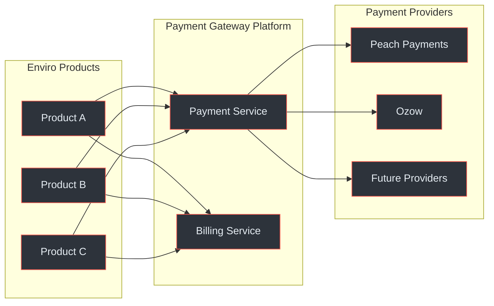
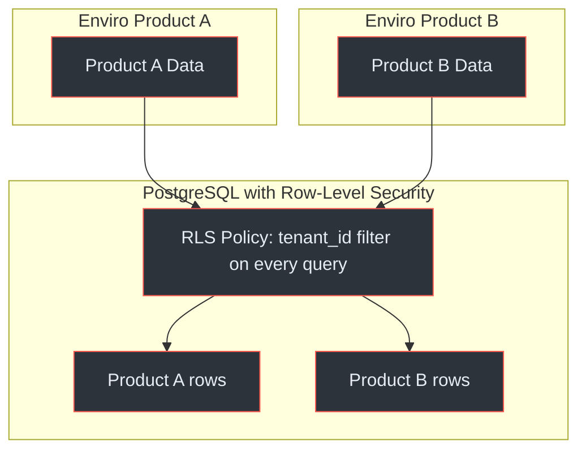
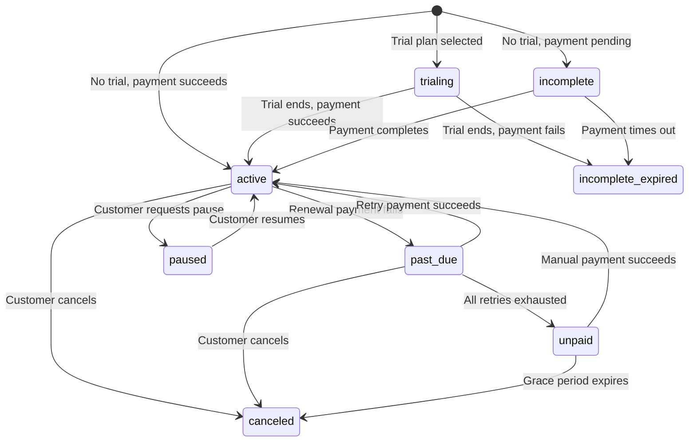

# <Icon name="briefcase" /> Executive Guide

The Payment Gateway Platform is an internal payment processing and subscription billing system built for Enviro's product suite. It centralises all payment operations behind a single API, enabling any Enviro product to accept payments without building its own payment infrastructure.

## At a Glance

| Aspect | Detail |
|---|---|
| **Purpose** | Centralised payment processing and subscription billing for all Enviro products |
| **Target market** | South Africa (ZAR default, SA-specific compliance) |
| **Architecture** | Two services: Payment Service + Billing Service |
| **Provider model** | Provider-agnostic — swap or add providers without code changes to consuming products |
| **Compliance** | PCI DSS SAQ-A, POPIA, 3DS mandatory for card-not-present, SARB guidelines |
| **Payment methods** | Card (Visa/MC/Amex), EFT, BNPL, digital wallets, QR payments |
| **Billing model** | Recurring subscriptions with trials, coupons, proration, usage metering |
| **Data isolation** | Multi-tenant by design — each Enviro product's data is cryptographically isolated |
| **Uptime target** | 99.9% per service |

## <Icon name="target" /> Business Value

### The Problem

Each Enviro product that needs to accept payments currently faces the same challenges:

1. **Direct provider integration** — Every product team must integrate with payment providers independently
2. **Compliance burden** — Each integration must separately achieve PCI compliance, implement 3DS, handle POPIA requirements
3. **No shared billing logic** — Subscription management, invoicing, and dunning are rebuilt per product
4. **Provider lock-in** — Switching from one payment provider to another requires rewriting integration code

### The Solution

The Payment Gateway Platform eliminates this duplication by providing a single, compliant payment API that all Enviro products consume:

<!-- Sources: docs/shared/system-architecture.md:1-30, docs/shared/integration-guide.md:1-40 -->

### Key Benefits

| Benefit | Impact |
|---|---|
| **Single compliance surface** | PCI DSS, POPIA, and 3DS compliance maintained once, shared by all products |
| **Faster time-to-market** | New products integrate in days (API key + REST calls), not months of provider integration |
| **Provider flexibility** | Add or switch providers without changing any consuming product |
| **Reduced operational cost** | One team maintains payment infrastructure instead of duplicating effort per product |
| **Consistent billing** | Subscriptions, trials, coupons, and invoicing work identically across all products |
| **Data isolation** | Multi-tenant design ensures each product's financial data is completely separated |

## <Icon name="shield" /> Compliance Posture

The platform is designed for South African regulatory requirements from the ground up — not retrofitted.

### Compliance Framework

| Requirement | Approach | Status |
|---|---|---|
| **PCI DSS SAQ-A** | Hosted checkout (card data never touches our servers). No PAN, CVV, or track data stored. | Designed |
| **3D Secure** | Mandatory for all South African card-not-present transactions. Enforced by invariant P12. | Designed |
| **POPIA** | Personal data encrypted at rest (AES-256). Consent tracking. Data retention policies. Right to erasure supported. | Designed |
| **SARB** | ZAR as default currency. South African bank integration via EFT providers. Cross-border payment controls. | Designed |
| **Data retention** | 7-year retention for financial records (SARS requirement). Soft deletes only — no hard deletion of financial data. | Designed |
| **Audit logging** | Every mutation produces a tamper-evident audit log entry with actor, action, and timestamp. | Designed |

<!-- Sources: docs/payment-service/compliance-security-guide.md:1-100, docs/billing-service/compliance-security-guide.md:1-80 -->

### PCI Scope Minimisation

The platform achieves PCI DSS SAQ-A (the lightest compliance level) by using **hosted checkout pages** provided by the payment providers. This means:

- Card numbers are entered on the provider's hosted page, not on any Enviro-controlled page
- The Payment Service never receives, processes, or stores cardholder data (PAN, CVV, expiry)
- The only card-related data stored is a provider-issued token for recurring payments

This design decision dramatically reduces compliance scope, cost, and audit burden compared to SAQ-D (which would require handling raw card data).

### Data Isolation Model

<!-- Sources: docs/payment-service/database-schema-design.md:400-480, docs/billing-service/compliance-security-guide.md:180-240 -->

Data isolation is enforced at the **database level** using PostgreSQL Row-Level Security. Even if an application bug or security vulnerability is exploited, one product's financial data cannot be accessed by another product. This is verified by correctness invariants X4 (cross-service), P10 (payment), and B10 (billing).

## <Icon name="credit-card" /> Payment Capabilities

### Supported Payment Methods

| Method | Provider | Use case |
|---|---|---|
| **Card** (Visa, Mastercard, Amex) | Peach Payments | One-time and recurring payments, 3DS |
| **EFT** (all SA banks) | Ozow | Instant bank transfers, no card required |
| **BNPL** (Buy Now Pay Later) | Future provider | Instalment payments |
| **Digital wallets** (Apple Pay, Samsung Pay) | Future provider | Mobile and contactless payments |
| **QR payments** (SnapScan, Zapper) | Future provider | In-person and invoice payments |
| **Capitec Pay** | Future provider | Capitec bank customers |
| **PayShap** | Future provider | Real-time bank-to-bank payments |

The provider-agnostic architecture means adding new payment methods requires only implementing a provider adapter — no changes to the core platform or consuming products.

<!-- Sources: docs/payment-service/provider-integration-guide.md:1-40, docs/shared/integration-guide.md:400-460 -->

### Provider-Agnostic Design

The platform's architecture separates payment logic from provider specifics. This means:

- **No provider lock-in**: Switch from Peach Payments to any other card processor without changing API contracts
- **Multi-provider routing** (planned): Route payments to the optimal provider based on cost, availability, or payment method
- **Automatic failover** (planned): If one provider is down, route to an alternative provider that supports the same capability
- **Negotiation leverage**: Ability to switch providers creates competitive pressure on pricing

## <Icon name="repeat" /> Subscription Billing

The Billing Service provides full subscription lifecycle management, enabling any Enviro product to offer recurring billing.

### Capabilities

| Feature | Description |
|---|---|
| **Plan management** | Create billing plans with monthly/annual intervals, flat or tiered pricing |
| **Trial periods** | Configurable trial duration, automatic transition to paid on expiry |
| **Coupons and discounts** | Percentage or fixed-amount coupons, usage limits, expiry dates |
| **Proration** | Fair billing on mid-cycle plan changes (upgrade or downgrade) |
| **Usage metering** | Track and bill for usage-based features (API calls, storage, etc.) |
| **Invoice generation** | Automated invoice creation with line items, tax, and discounts |
| **Dunning** | Automatic retry of failed payments with configurable retry schedule |
| **Pause and resume** | Customers can pause subscriptions and resume later |

### Subscription Lifecycle

<!-- Sources: docs/billing-service/billing-flow-diagrams.md:1-80, docs/billing-service/architecture-design.md:150-200 -->

## <Icon name="bar-chart-2" /> Operational Targets

| Metric | Target |
|---|---|
| **Payment API latency (p95)** | < 500ms (excludes provider redirect) |
| **Billing API latency (p95)** | < 300ms |
| **Service uptime** | 99.9% per month |
| **Event delivery** | < 5 seconds (p99) from state change to broker |
| **Webhook first attempt** | < 30 seconds from event to first delivery attempt |

<!-- Sources: docs/shared/system-architecture.md:500-560 -->

## Related Pages

| Page | Description |
|---|---|
| [Platform Overview](../01-getting-started/platform-overview) | Technical system overview |
| [Integration Quickstart](../01-getting-started/integration-quickstart) | How products integrate with the gateway |
| [Security and Compliance](../03-deep-dive/security-compliance/) | Detailed compliance documentation |
| [Subscription Lifecycle](../03-deep-dive/data-flows/subscription-lifecycle) | Detailed subscription state machine and flows |
| [Product Manager Guide](./product-manager) | Feature details, payment methods, API model |
| [Staff Engineer Guide](./staff-engineer) | Architecture decisions and consistency guarantees |
