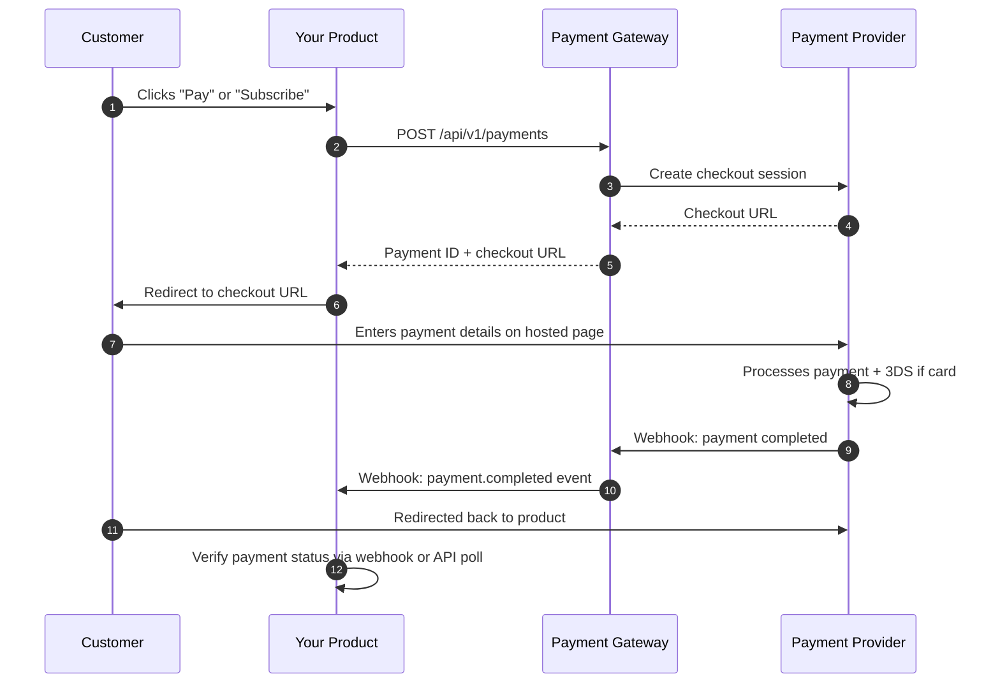
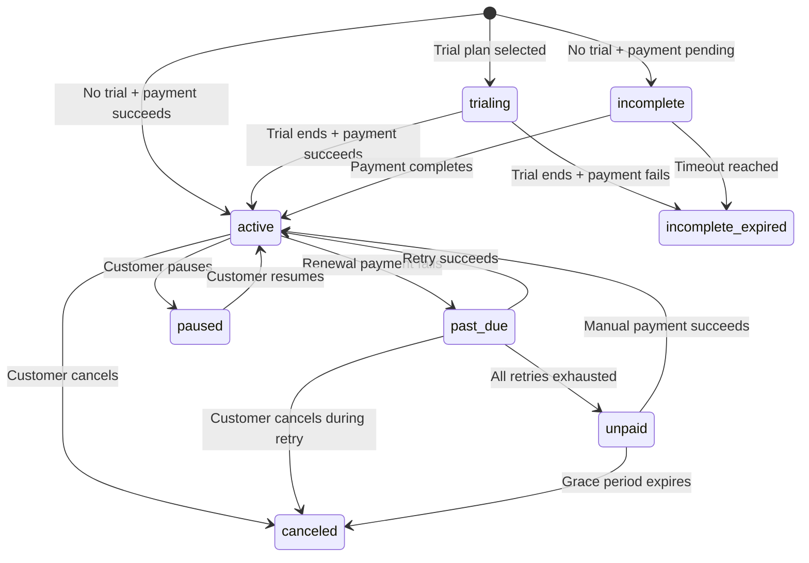
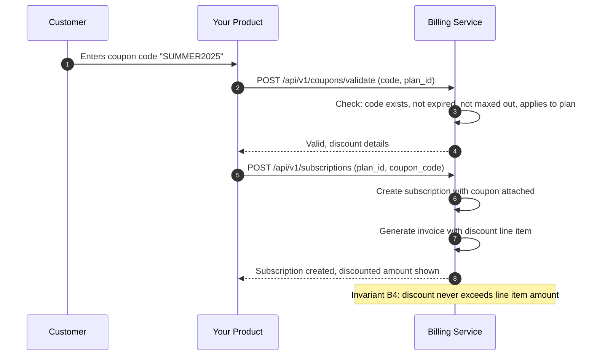
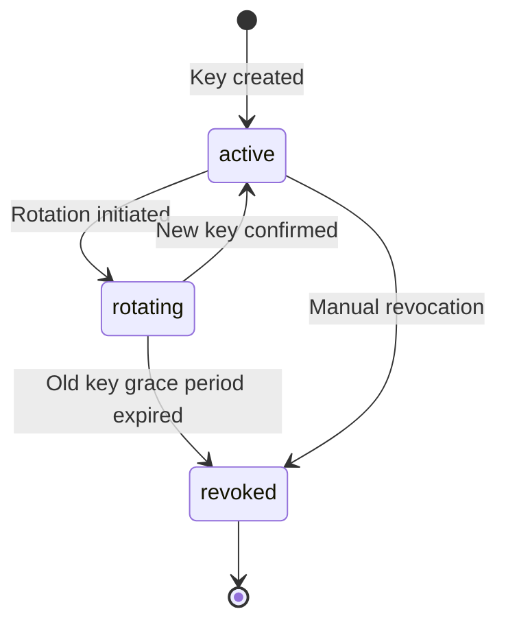

# <Icon name="package" /> Product Manager Guide

This guide covers the Payment Gateway Platform from a product perspective — what it supports, how subscriptions work, how discounts are applied, and how your product receives real-time notifications about payment events.

## At a Glance

| Aspect | Detail |
|---|---|
| **Payment methods** | Card (Visa/MC/Amex), EFT, BNPL, digital wallets (Apple/Samsung Pay), QR (SnapScan/Zapper), Capitec Pay, PayShap |
| **Subscription billing** | Plans, trials, coupons, proration, usage metering, dunning |
| **Subscription states** | trialing, incomplete, active, past_due, paused, unpaid, canceled, incomplete_expired |
| **Notification model** | HTTP webhooks with signed payloads, 5 retries over ~5.5 hours |
| **API access** | Self-service API keys per environment (sandbox + production) |
| **Currency** | ZAR (South African Rand) default |
| **Integration effort** | REST API, JSON payloads, OpenAPI spec available |

## <Icon name="credit-card" /> Supported Payment Methods

### Current Providers

| Payment Method | Provider | Capabilities | Customer Experience |
|---|---|---|---|
| **Card** (Visa, Mastercard, Amex) | Peach Payments | One-time, recurring, tokenisation, 3DS | Hosted checkout page — card details entered on Peach's secure page |
| **EFT** (all SA banks) | Ozow | One-time, instant confirmation | Redirect to Ozow — customer selects bank, authenticates, confirms |

### Planned Providers

| Payment Method | Target Provider | Capabilities | Notes |
|---|---|---|---|
| **BNPL** (Buy Now Pay Later) | TBD | Instalment payments | Split payment into 3-6 instalments |
| **Digital wallets** | TBD | Apple Pay, Samsung Pay | Contactless and mobile payments |
| **QR payments** | SnapScan / Zapper | Scan-to-pay | Invoice and in-person payments |
| **Capitec Pay** | Capitec | Bank-direct payments | Large SA customer base |
| **PayShap** | TBD | Real-time bank-to-bank | South African instant payment rail |

Adding a new payment method does not require changes to your product's integration. The gateway's provider-agnostic design means new methods appear as options in the API automatically once the adapter is implemented.

<!-- Sources: docs/payment-service/provider-integration-guide.md:1-40, docs/shared/integration-guide.md:400-460 -->

### Payment Flow (Customer Perspective)



<!-- Sources: docs/shared/integration-guide.md:100-180, docs/billing-service/billing-flow-diagrams.md:100-180 -->

## <Icon name="repeat" /> Subscription Lifecycle

The Billing Service manages the full subscription lifecycle. Understanding the states and transitions is essential for building correct subscription UIs and handling edge cases.

### Subscription States

| State | Meaning | What the customer sees |
|---|---|---|
| **trialing** | Free trial period active, no payment charged yet | "Your trial ends on [date]" |
| **incomplete** | Subscription created but initial payment pending/failed | "Complete your payment to activate" |
| **active** | Subscription is paid and active | Full access to subscribed features |
| **past_due** | Renewal payment failed, retry in progress | "Payment failed — we'll retry automatically" |
| **paused** | Customer-initiated pause | "Your subscription is paused" |
| **unpaid** | All payment retries exhausted | "Please update your payment method" |
| **canceled** | Subscription terminated (customer or system) | "Your subscription has been cancelled" |
| **incomplete_expired** | Initial payment never completed within timeout | "Your subscription setup has expired" |

### State Machine



<!-- Sources: docs/billing-service/billing-flow-diagrams.md:1-80, docs/billing-service/architecture-design.md:150-200 -->

### Key Lifecycle Events

| Event | Trigger | Your product should... |
|---|---|---|
| `subscription.created` | New subscription created | Show confirmation, start onboarding flow |
| `subscription.activated` | Trial ended or payment confirmed | Grant full access to features |
| `subscription.past_due` | Renewal payment failed | Show payment failure banner, suggest updating payment method |
| `subscription.paused` | Customer paused subscription | Restrict access (or allow read-only) per your policy |
| `subscription.resumed` | Customer resumed from pause | Restore full access |
| `subscription.canceled` | Subscription terminated | Restrict access at end of current period |
| `subscription.expired` | Past grace period with no payment | Fully restrict access |
| `invoice.created` | New invoice generated | Send invoice email or in-app notification |
| `invoice.paid` | Invoice payment succeeded | Update billing UI |
| `invoice.payment_failed` | Invoice payment failed | Alert customer to update payment method |

<!-- Sources: docs/billing-service/billing-flow-diagrams.md:700-800, docs/shared/integration-guide.md:600-700 -->

## <Icon name="tag" /> Coupons and Discounts

The platform supports flexible discount mechanisms for promotions, partner deals, and customer retention.

### Coupon Types

| Type | Example | Behaviour |
|---|---|---|
| **Percentage** | 20% off | Applied to each eligible line item. Never exceeds line item amount. |
| **Fixed amount** | R50 off | Subtracted from invoice total. Remainder (if any) is not carried forward. |

### Coupon Properties

| Property | Description |
|---|---|
| `code` | Unique coupon code (e.g., `SUMMER2025`) |
| `discount_type` | `percentage` or `fixed_amount` |
| `discount_value` | Percentage (0-100) or amount in cents |
| `max_redemptions` | Maximum total uses across all customers (null = unlimited) |
| `max_redemptions_per_customer` | Maximum uses per customer |
| `valid_from` / `valid_until` | Time-bounded validity window |
| `applicable_plans` | Restrict to specific plans (null = all plans) |
| `duration` | `once`, `repeating` (N months), or `forever` |

### Coupon Application Flow



<!-- Sources: docs/billing-service/billing-flow-diagrams.md:400-500, docs/billing-service/architecture-design.md:300-360 -->

## <Icon name="sliders" /> Proration on Plan Changes

When a customer upgrades or downgrades mid-billing-cycle, the platform calculates fair charges based on the remaining time in the current period.

### How Proration Works

**Upgrade example** (mid-cycle):
- Customer is on Plan A (R100/month), 15 days into a 30-day cycle
- Customer upgrades to Plan B (R200/month)
- Credit for unused Plan A: R100 x (15/30) = R50 credit
- Charge for remaining Plan B: R200 x (15/30) = R100 charge
- Net charge: R100 - R50 = **R50 prorated charge**

**Downgrade example** (mid-cycle):
- Customer is on Plan B (R200/month), 10 days into a 30-day cycle
- Customer downgrades to Plan A (R100/month)
- Credit for unused Plan B: R200 x (20/30) = R133.33 credit
- Charge for remaining Plan A: R100 x (20/30) = R66.67 charge
- Net credit: R133.33 - R66.67 = **R66.66 credit applied to next invoice**

This is verified by correctness invariant **B3** (proration accuracy) which ensures charges are always proportional to the remaining billing period.

<!-- Sources: docs/billing-service/billing-flow-diagrams.md:300-400, docs/shared/correctness-properties.md:500-550 -->

## <Icon name="bell" /> Webhook Notifications

Webhooks are the primary way your product receives real-time updates about payment and subscription events. Instead of polling the API, you register a URL and the platform pushes events to you.

### How Webhooks Work

1. Your product registers a webhook endpoint URL with the gateway
2. When an event occurs (payment completed, subscription activated, etc.), the gateway sends a signed HTTP POST to your URL
3. Your endpoint verifies the signature, processes the event, and returns a 2xx status code
4. If delivery fails, the gateway retries up to 5 times with increasing delays

### Retry Schedule

| Attempt | Delay after failure | Cumulative time |
|---|---|---|
| 1st attempt | Immediate | 0 |
| 1st retry | 30 seconds | 30s |
| 2nd retry | 2 minutes | 2m 30s |
| 3rd retry | 15 minutes | 17m 30s |
| 4th retry | 1 hour | 1h 17m 30s |
| 5th retry | 4 hours | 5h 17m 30s |

After 5 failed retries, the delivery is marked as permanently failed. If an endpoint accumulates **10 consecutive failures** across any deliveries, it is automatically disabled to prevent wasting resources on a dead endpoint.

<!-- Sources: docs/shared/system-architecture.md:300-400, docs/payment-service/architecture-design.md:530-600 -->

### Event Payload Structure

Every webhook payload follows a consistent structure:

```json
{
  "event_id": "evt_abc123def456",
  "event_type": "payment.completed",
  "tenant_id": "your-product-tenant-id",
  "created_at": "2025-06-15T14:30:00Z",
  "data": {
    "payment_id": "pay_xyz789",
    "amount": "149.99",
    "currency": "ZAR",
    "status": "completed",
    "provider": "peach_payments",
    "metadata": {
      "order_id": "your-order-123"
    }
  }
}
```

Headers included with every delivery:
- `X-Webhook-Signature`: HMAC-SHA256 signature for verification
- `X-Webhook-Timestamp`: Unix timestamp to prevent replay attacks
- `Content-Type`: `application/json`

### Available Event Types

| Category | Events |
|---|---|
| **Payments** | `payment.created`, `payment.completed`, `payment.failed`, `payment.expired` |
| **Refunds** | `refund.created`, `refund.approved`, `refund.failed` |
| **Subscriptions** | `subscription.created`, `subscription.activated`, `subscription.past_due`, `subscription.paused`, `subscription.resumed`, `subscription.canceled`, `subscription.expired` |
| **Invoices** | `invoice.created`, `invoice.paid`, `invoice.payment_failed`, `invoice.voided` |

<!-- Sources: docs/shared/integration-guide.md:600-750 -->

## <Icon name="key" /> API Key Self-Service Model

Each Enviro product (tenant) manages its own API keys for authenticating with the Payment Gateway. The platform supports separate keys for sandbox and production environments.

### Key Model

| Property | Description |
|---|---|
| **Key prefix** | `pk_live_` (production) or `pk_test_` (sandbox) |
| **Authentication** | Bearer token in `Authorization` header |
| **Scoping** | Each key is scoped to a single tenant — can only access that tenant's data |
| **Rate limits** | 100 requests/second per key (configurable per tenant) |
| **Rotation** | Keys can be rotated without downtime — old key remains valid for a grace period |

### Key Lifecycle



<!-- Sources: docs/shared/integration-guide.md:40-100, docs/billing-service/compliance-security-guide.md:100-140 -->

### Environment Separation

| Environment | Base URL | Purpose | Data |
|---|---|---|---|
| **Sandbox** | `https://sandbox.pay.enviro.co.za` | Development and testing | Test data, simulated provider responses |
| **Production** | `https://pay.enviro.co.za` | Live transactions | Real payments, real money |

Sandbox and production use completely separate databases and API keys. Test transactions in sandbox never touch real payment providers.

<!-- Sources: docs/shared/integration-guide.md:1000-1060 -->

## <Icon name="list" /> Integration Checklist

Use this checklist when planning your product's integration with the Payment Gateway:

| Step | Description |
|---|---|
| 1. Request tenant setup | Contact the platform team to create your tenant and receive sandbox API keys |
| 2. Explore the sandbox | Use sandbox keys to test payment flows, subscription creation, and webhook delivery |
| 3. Register webhook endpoint | Register your product's webhook URL to receive real-time event notifications |
| 4. Implement payment flow | Redirect customers to the checkout URL returned by the Payment API |
| 5. Handle webhook events | Process `payment.completed`, `subscription.activated`, and other relevant events |
| 6. Implement subscription UI | Build plan selection, upgrade/downgrade, pause/cancel, and billing history screens |
| 7. Test edge cases | Verify handling of failed payments, expired trials, coupon application, and proration |
| 8. Request production keys | After sandbox validation, request production API keys |
| 9. Go live | Switch to production base URL and monitor webhook delivery |

<!-- Sources: docs/shared/integration-guide.md:1100-1200 -->

## Related Pages

| Page | Description |
|---|---|
| [Platform Overview](../01-getting-started/platform-overview) | High-level system overview |
| [Integration Quickstart](../01-getting-started/integration-quickstart) | Step-by-step first integration guide |
| [Subscription Lifecycle](../03-deep-dive/data-flows/subscription-lifecycle) | Detailed subscription state machine and flows |
| [Event System and Webhooks](../02-architecture/event-system) | Technical details on event delivery |
| [Security and Compliance](../03-deep-dive/security-compliance/) | PCI DSS, POPIA, and data protection details |
| [Executive Guide](./executive) | Business value and compliance posture |
| [Contributor Guide](./contributor) | Technical onboarding for developers |
