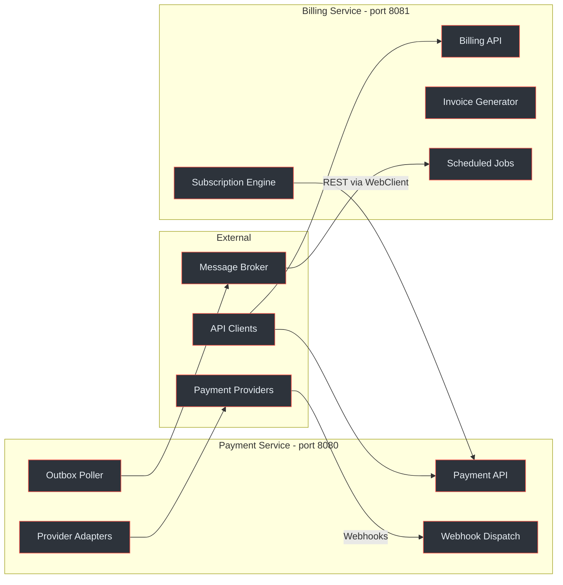
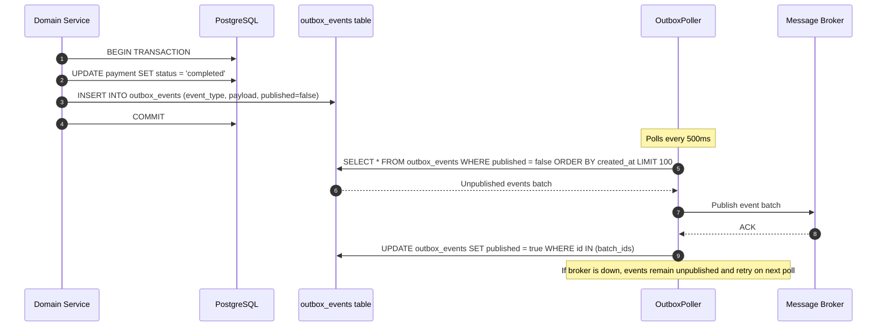
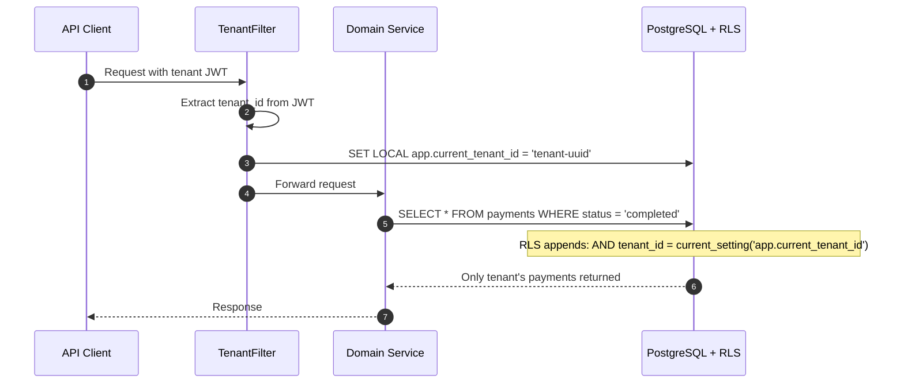
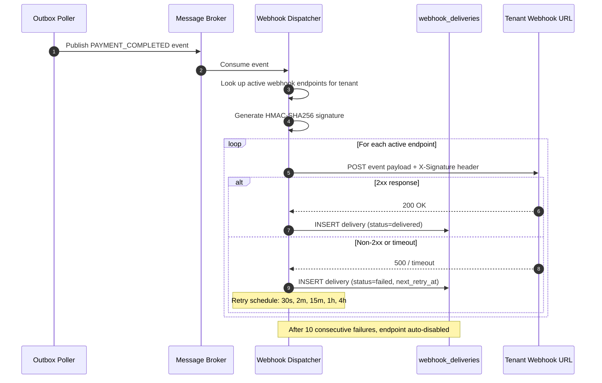
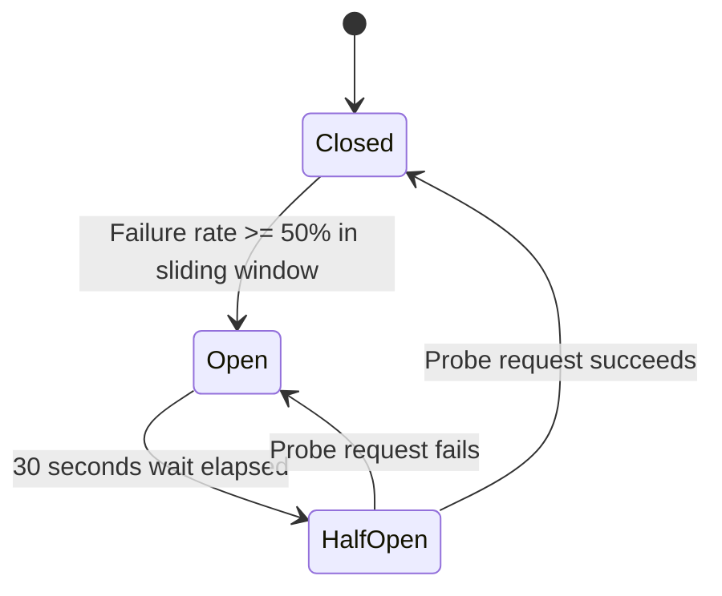

# <Icon name="cpu" /> Staff Engineer Guide

This guide covers the architectural decisions, consistency guarantees, and operational patterns that a staff engineer needs to evaluate and extend the Payment Gateway Platform. It assumes familiarity with distributed systems concepts and focuses on the *why* behind each design choice.

## At a Glance

| Aspect | Detail |
|---|---|
| **Architecture** | Two-service split: Payment Service (hexagonal) + Billing Service (layered) |
| **Consistency model** | Eventual consistency via transactional outbox + idempotent consumers |
| **Tenant isolation** | PostgreSQL Row-Level Security per table, enforced at DB level |
| **Event delivery** | Dual: message broker (at-least-once) + HTTP webhooks (5 retries) |
| **Correctness** | 23 property-based invariants (P1–P13, B1–B10, X1–X4) |
| **Provider abstraction** | Strategy + Factory SPI with per-provider circuit breakers |
| **Amount representation** | Payment: DECIMAL(19,4) Rands; Billing: INTEGER cents |
| **Compliance** | PCI DSS SAQ-A (never stores PAN/CVV), POPIA, 3DS mandatory |
| **SLOs** | Payment p95 < 500ms, Billing p95 < 300ms, 99.9% uptime |

## <Icon name="git-branch" /> Two-Service Split Rationale

The platform is split into two services rather than a monolith or a larger microservice mesh. This decision balances isolation with operational simplicity.

### Why Two Services?

| Concern | Monolith risk | Micro-mesh risk | Two-service approach |
|---|---|---|---|
| **PCI scope** | Entire app in PCI scope | Reduced, but network complexity | Payment Service is the only PCI-scoped component |
| **Release cadence** | Billing changes blocked by payment freeze | Coordination overhead across many services | Independent release cycles for payment vs billing |
| **Data model** | Shared schema coupling | Distributed transactions | Each service owns its database |
| **Provider failures** | Provider outage affects billing | Same | Circuit breaker isolates provider failures from billing |
| **Team scaling** | Merge conflicts | Too many repos for a small team | Two clear ownership boundaries |

### Service Boundaries



<!-- Sources: docs/shared/system-architecture.md:20-90, docs/billing-service/architecture-design.md:10-50 -->

### Design Principles

1. **Database-per-service**: Each service has its own PostgreSQL database. No shared tables, no cross-database joins.
2. **Eventual consistency**: The Billing Service reacts to Payment Service events asynchronously. No distributed transactions.
3. **Idempotent consumers**: Every event consumer and webhook handler is idempotent, keyed on `event_id` or `idempotency_key`.
4. **Provider isolation**: Provider failures are contained by per-provider circuit breakers (Resilience4j). A Peach Payments outage does not affect Ozow payments.
5. **Compliance boundary**: Only the Payment Service handles PCI-scoped data. The Billing Service never sees card details.

<!-- Sources: docs/shared/system-architecture.md:400-500 -->

## <Icon name="refresh-cw" /> Transactional Outbox Pattern

The most critical consistency mechanism in the platform. Both services use the transactional outbox to guarantee that every domain state change produces exactly one event, even if the message broker is temporarily unavailable.

### How It Works

1. Domain operation and outbox event insert happen in the **same database transaction**
2. If the transaction commits, the event is guaranteed to be in the `outbox_events` table
3. If the transaction rolls back, no event exists (and no state change occurred)
4. The `OutboxPoller` reads unpublished events and publishes them to the message broker
5. After successful publish, the event is marked `published = true`

This eliminates the dual-write problem where a service updates its database and then fails to publish the event (or vice versa).

### Outbox Polling Sequence



<!-- Sources: docs/payment-service/architecture-design.md:450-530, docs/shared/system-architecture.md:300-370 -->

### Outbox Table Schema

```sql
CREATE TABLE outbox_events (
    id              UUID PRIMARY KEY DEFAULT gen_random_uuid(),
    aggregate_type  VARCHAR(100)  NOT NULL,  -- 'payment', 'refund', 'subscription'
    aggregate_id    UUID          NOT NULL,  -- ID of the domain entity
    event_type      VARCHAR(100)  NOT NULL,  -- 'PAYMENT_COMPLETED', 'REFUND_APPROVED'
    payload         JSONB         NOT NULL,  -- Full event payload
    published       BOOLEAN       NOT NULL DEFAULT false,
    created_at      TIMESTAMPTZ   NOT NULL DEFAULT NOW(),
    published_at    TIMESTAMPTZ
);

CREATE INDEX idx_outbox_unpublished
    ON outbox_events (created_at)
    WHERE published = false;
```

The partial index `WHERE published = false` ensures that polling queries are efficient even as the table grows — only unpublished events are scanned.

<!-- Sources: docs/payment-service/database-schema-design.md:350-400 -->

### Failure Modes and Recovery

| Failure | Impact | Recovery |
|---|---|---|
| Broker down during publish | Events accumulate in outbox | Poller retries on next cycle (500ms). Events are durable in PostgreSQL. |
| Poller crashes mid-batch | Some events published but not marked | Next poll re-reads and re-publishes. Consumer idempotency prevents duplicates. |
| DB crash after commit | Events may be in WAL but not flushed | PostgreSQL WAL recovery restores committed transactions. |
| Duplicate publish to broker | Consumer receives same event twice | Consumer deduplicates on `event_id` (idempotent processing). |

<!-- Sources: docs/shared/system-architecture.md:370-420 -->

## <Icon name="lock" /> Multi-Tenant RLS Isolation

Row-Level Security is the primary tenant isolation mechanism. It operates at the PostgreSQL level, meaning even SQL injection or application bugs cannot leak data across tenants.

### Architecture



<!-- Sources: docs/payment-service/compliance-security-guide.md:200-280, docs/payment-service/database-schema-design.md:400-480 -->

### RLS Policy Pattern

Every table in both services follows the same RLS pattern:

```sql
-- 1. Enable RLS (even superuser is restricted with FORCE)
ALTER TABLE payments ENABLE ROW LEVEL SECURITY;
ALTER TABLE payments FORCE ROW LEVEL SECURITY;

-- 2. Create tenant isolation policy
CREATE POLICY tenant_isolation ON payments
    FOR ALL
    USING (tenant_id = current_setting('app.current_tenant_id')::UUID)
    WITH CHECK (tenant_id = current_setting('app.current_tenant_id')::UUID);
```

The `WITH CHECK` clause ensures that INSERT and UPDATE operations also respect tenant boundaries — a request cannot create a record with a different tenant's ID.

**Session variable difference**: Payment Service uses `app.current_tenant_id`, Billing Service uses `app.current_service_tenant_id`. This prevents accidental cross-service session leakage if both services share a connection pool in development.

### Tables Under RLS

| Service | Tables with RLS | Session Variable |
|---|---|---|
| Payment Service | `payments`, `payment_events`, `refunds`, `payment_methods`, `webhook_endpoints`, `webhook_deliveries`, `idempotency_keys`, `provider_configurations`, `audit_logs` | `app.current_tenant_id` |
| Billing Service | `subscriptions`, `plans`, `invoices`, `invoice_line_items`, `coupons`, `coupon_redemptions`, `usage_records`, `payment_methods_billing`, `webhook_endpoints_billing`, `webhook_deliveries_billing`, `api_keys`, `customers`, `audit_logs_billing` | `app.current_service_tenant_id` |

<!-- Sources: docs/payment-service/database-schema-design.md:400-480, docs/billing-service/compliance-security-guide.md:180-260 -->

## <Icon name="check-circle" /> Correctness Invariants

The platform defines 23 invariants, verified by property-based tests (jqwik). These are the system's non-negotiable guarantees — every code change must preserve all of them.

### Invariant Summary

| ID | Name | Core guarantee |
|---|---|---|
| **P1** | Payment state machine | Valid transitions only: pending -> processing -> completed/failed/expired |
| **P2** | Amount positivity | All payment amounts > 0 |
| **P3** | Idempotency | Same key + TTL window = same response, no duplicate payment |
| **P4** | Provider routing | Provider selected must support requested capability |
| **P5** | Currency consistency | Currency immutable after payment creation |
| **P6** | Webhook delivery | Every state change event delivered to all active endpoints |
| **P7** | Webhook signature | Every webhook has valid HMAC-SHA256 signature |
| **P8** | Refund conservation | SUM(refunds) <= payment.amount |
| **P9** | Refund state machine | Only completed payments can be refunded |
| **P10** | Tenant isolation (payment) | RLS prevents cross-tenant data access |
| **P11** | Audit completeness | Every mutation produces an audit log entry |
| **P12** | 3DS enforcement | SA card-not-present payments require 3DS |
| **P13** | Provider circuit breaker | Open breaker rejects fast, does not call provider |
| **B1** | Invoice totals | line items + tax - discounts = invoice total |
| **B2** | Subscription state machine | Valid transitions only (defined state graph) |
| **B3** | Proration accuracy | Charges proportional to remaining billing period |
| **B4** | Coupon application | Discount never exceeds line item amount |
| **B5** | Trial expiry | Trial subscriptions transition on expiry date |
| **B6** | Renewal scheduling | Active subscriptions renew within grace period |
| **B7** | Usage metering | Aggregated usage matches sum of raw records |
| **B8** | Plan immutability | Active plan changes never affect existing subscriptions mid-cycle |
| **B9** | Invoice sequencing | Invoice numbers strictly monotonic per tenant |
| **B10** | Tenant isolation (billing) | RLS prevents cross-tenant data access |
| **X1** | Outbox guarantee | Every domain change = exactly one outbox event in same TX |
| **X2** | Event ordering | Events for same aggregate delivered in causal order |
| **X3** | Amount consistency | Billing cents / 100 = Payment Rands at integration boundary |
| **X4** | Cross-service tenant isolation | No cross-tenant data leakage across service boundary |

<!-- Sources: docs/shared/correctness-properties.md:50-600 -->

### Testing Strategy

Each invariant maps to one or more jqwik property tests. The tests use:

- **Arbitrary generators**: Random payment amounts, subscription plans, coupon percentages, tenant IDs
- **Stateful testing**: Multi-step scenarios (create payment -> refund -> refund again) with state machine model
- **Testcontainers**: Real PostgreSQL with RLS enabled to verify invariants P10, B10, X4
- **WireMock**: Simulated provider responses (success, failure, timeout, invalid signature)

Key test counts (planned):
- ~1,000 trials per property test
- ~50 property test classes across both services
- Integration tests run with Testcontainers (PostgreSQL 16 + Redis 7)

<!-- Sources: docs/shared/correctness-properties.md:200-400 -->

## <Icon name="radio" /> Dual Event Delivery System

Events are delivered through two independent channels for redundancy. Both channels are eventually consistent and idempotent.

### Channel Comparison

| Aspect | Message Broker | HTTP Webhooks |
|---|---|---|
| **Audience** | Internal services (Billing Service) | External API consumers |
| **Delivery** | At-least-once, consumer-group semantics | 5 retries with exponential backoff |
| **Ordering** | Per-partition ordering (keyed by aggregate ID) | Best-effort ordering |
| **Latency** | Sub-second | 30s → 2min → 15min → 1h → 4h retry schedule |
| **Deduplication** | Consumer checks `event_id` | Consumer checks `event_id` in payload |
| **Auto-disable** | N/A | Endpoint disabled after 10 consecutive failures |

### Webhook Dispatch Flow



<!-- Sources: docs/shared/system-architecture.md:300-400, docs/payment-service/architecture-design.md:530-600 -->

### Webhook Security

Every webhook delivery includes:

1. **HMAC-SHA256 signature** in `X-Webhook-Signature` header, computed over the raw payload using the endpoint's secret
2. **Timestamp** in `X-Webhook-Timestamp` to prevent replay attacks (consumers should reject timestamps > 5 minutes old)
3. **Event ID** in payload for idempotent processing

```
X-Webhook-Signature: sha256=<hex-encoded-hmac>
X-Webhook-Timestamp: 1700000000
Content-Type: application/json

{
  "event_id": "evt_abc123",
  "event_type": "payment.completed",
  "tenant_id": "tenant-uuid",
  "created_at": "2025-01-15T10:30:00Z",
  "data": { ... }
}
```

<!-- Sources: docs/payment-service/compliance-security-guide.md:400-460 -->

## <Icon name="activity" /> Resilience Patterns

### Per-Provider Circuit Breaker

Each payment provider has its own Resilience4j circuit breaker instance. This prevents a single provider outage from cascading to other providers or blocking billing operations.



<!-- Sources: docs/payment-service/architecture-design.md:340-400 -->

**Configuration** (per provider):
- Sliding window: 10 calls
- Failure rate threshold: 50%
- Wait duration in open state: 30 seconds
- Permitted calls in half-open: 3

When a circuit breaker is open, the `ProviderFactory` can route to an alternative provider if one supports the same capability — this is the foundation for future multi-provider routing.

### Retry Strategy

Provider calls use Resilience4j retry with exponential backoff:

| Attempt | Wait | Notes |
|---|---|---|
| 1st retry | 1 second | Covers transient network blips |
| 2nd retry | 2 seconds | — |
| 3rd retry | 4 seconds | Maximum 3 retries before circuit breaker evaluation |

Retries are only applied to idempotent operations (status checks, refund status). Payment initiation is NOT retried — the client must retry with the same idempotency key.

<!-- Sources: docs/payment-service/architecture-design.md:400-450, docs/payment-service/provider-integration-guide.md:800-860 -->

## <Icon name="clock" /> Scheduled Jobs

The Billing Service runs five Quartz-scheduled jobs that maintain subscription lifecycle consistency:

| Job | Schedule | Purpose | Key invariant |
|---|---|---|---|
| `RenewalJob` | Hourly | Process subscription renewals due within the hour | B6 |
| `InvoiceGenerationJob` | Daily 02:00 | Generate invoices for upcoming billing cycles | B1, B9 |
| `TrialExpirationJob` | Hourly | Transition expired trials to appropriate state | B5 |
| `UsageAggregationJob` | Daily 03:00 | Aggregate raw usage records into billable units | B7 |
| `CleanupJob` | Daily 04:00 | Archive old outbox events, purge expired idempotency keys | — |

Each job acquires a **distributed lock via Redis** (`SETNX` with TTL) to prevent duplicate execution in a multi-instance deployment. The lock key follows the pattern `billing:job:{job_name}:lock`.

<!-- Sources: docs/billing-service/architecture-design.md:500-580 -->

## <Icon name="trending-up" /> SLOs and Operational Boundaries

| Metric | Target | Measurement |
|---|---|---|
| Payment API p95 latency | < 500ms | Excludes provider round-trip (redirect flow) |
| Billing API p95 latency | < 300ms | Excludes downstream Payment Service calls |
| Uptime | 99.9% | Monthly, per service |
| Event delivery latency | < 5 seconds (p99) | Outbox to broker publish |
| Webhook delivery (first attempt) | < 30 seconds | From event creation to first POST |

Observability is provided by OpenTelemetry (distributed tracing), Micrometer (metrics in Prometheus format), and structured JSON logging with correlation IDs.

<!-- Sources: docs/shared/system-architecture.md:500-560 -->

## <Icon name="alert-triangle" /> Key Architectural Risks

| Risk | Severity | Mitigation |
|---|---|---|
| Outbox table growth | <span class="warn">Medium</span> | `CleanupJob` archives published events daily. Partial index keeps poll queries fast. |
| Webhook endpoint abuse | <span class="warn">Medium</span> | Auto-disable after 10 consecutive failures. Rate limit webhook registrations per tenant. |
| Provider API breaking changes | <span class="sev-red">High</span> | Each provider adapter is independently versioned. WireMock contract tests detect changes. |
| Cross-service latency spike | <span class="warn">Medium</span> | Billing Service calls Payment Service with 5s timeout + circuit breaker. Fallback: queue payment request. |
| RLS bypass via raw SQL | <span class="sev-red">High</span> | `FORCE ROW LEVEL SECURITY` prevents even superuser bypass. No raw SQL in application code. |
| Clock skew in multi-instance | <span class="sev-yellow">Low</span> | NTP synchronization required. Quartz uses DB-based clustering with pessimistic locking. |

<!-- Sources: docs/shared/system-architecture.md:440-500 -->

## Related Pages

| Page | Description |
|---|---|
| [Platform Overview](../01-getting-started/platform-overview) | High-level system overview and service boundaries |
| [Payment Service Architecture](../02-architecture/payment-service/) | Hexagonal architecture, SPI, and provider adapters |
| [Billing Service Architecture](../02-architecture/billing-service/) | Layered architecture, subscription engine, scheduled jobs |
| [Inter-Service Communication](../02-architecture/inter-service-communication) | REST integration, event contracts, error handling |
| [Event System and Webhooks](../02-architecture/event-system) | Outbox pattern, broker topics, webhook dispatch |
| [Correctness and Testing](../03-deep-dive/correctness-invariants) | All 23 invariants with formal specifications |
| [Security and Compliance](../03-deep-dive/security-compliance/) | PCI DSS, POPIA, encryption, RLS implementation |
| [Contributor Guide](./contributor) | Tech stack, coding conventions, development workflow |
